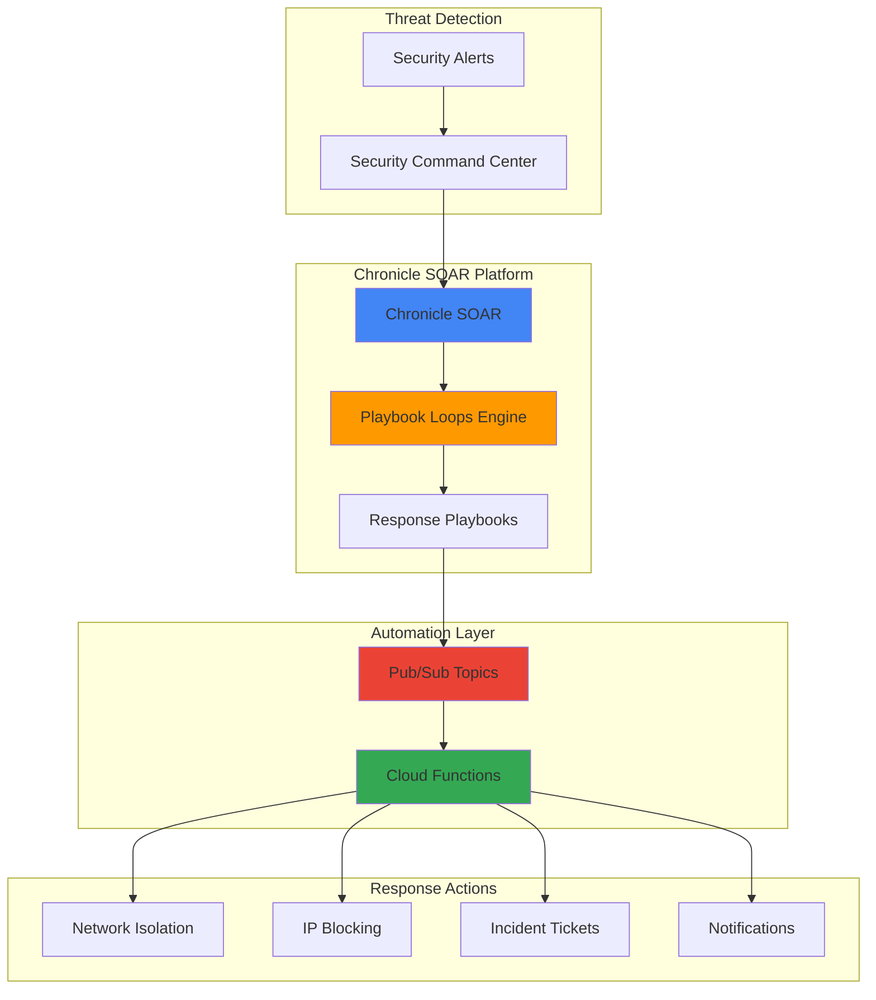

# Automated Security Response with Playbook Loops and Chronicle

## Problem

Security teams face overwhelming volumes of security alerts from multiple sources, making it impossible to manually investigate and respond to each incident. Traditional security operations require analysts to perform repetitive tasks across multiple systems, leading to delayed response times, inconsistent incident handling, and missed critical threats. Organizations need automated workflows that can process multiple security alerts simultaneously, apply consistent triage logic, and orchestrate coordinated response actions across their entire security infrastructure.

## Solution

Implement automated security incident response workflows using Chronicle SOAR's Playbook Loops feature to iteratively process multiple security alerts from Security Command Center. This solution automatically triages threats based on predefined criteria, executes coordinated response actions through Cloud Functions, and maintains audit trails through Pub/Sub messaging. The Playbook Loops feature enables for-each iteration over security entities, allowing a single workflow to process multiple IOCs, IP addresses, or file hashes simultaneously while maintaining context-aware decision making.

## Architecture Diagram



## Prerequisites

1. Google Cloud account with Security Command Center Enterprise or Premium tier enabled
2. Chronicle SOAR platform access and permissions to create playbooks
3. Google Cloud CLI installed and configured (or Cloud Shell)
4. IAM roles: Security Center Admin, Cloud Functions Developer, Pub/Sub Admin
5. Basic knowledge of security operations and incident response workflows
6. Estimated cost: $50-100/month for moderate security event volume

> **Note**: Chronicle SOAR requires Security Command Center Enterprise tier for full integration capabilities and automated case management features.

## Preparation

```bash
# Set environment variables for GCP resources
export PROJECT_ID="sec-automation-$(date +%s)"
export REGION="us-central1"
export ZONE="us-central1-a"

# Generate unique suffix for resource names
RANDOM_SUFFIX=$(openssl rand -hex 3)

# Set default project and region
gcloud config set project ${PROJECT_ID}
gcloud config set compute/region ${REGION}
gcloud config set compute/zone ${ZONE}

# Enable required APIs for security automation
gcloud services enable securitycenter.googleapis.com
gcloud services enable cloudfunctions.googleapis.com
gcloud services enable pubsub.googleapis.com
gcloud services enable cloudresourcemanager.googleapis.com
gcloud services enable iam.googleapis.com

echo "✅ Project configured: ${PROJECT_ID}"

# Create Pub/Sub topics for security events
export SECURITY_TOPIC="security-events-${RANDOM_SUFFIX}"
export RESPONSE_TOPIC="response-actions-${RANDOM_SUFFIX}"

gcloud pubsub topics create ${SECURITY_TOPIC}
gcloud pubsub topics create ${RESPONSE_TOPIC}

# Create service account for automation functions
export SA_NAME="security-automation-sa"
gcloud iam service-accounts create ${SA_NAME} \
    --display-name="Security Automation Service Account" \
    --description="Service account for automated security response functions"

echo "✅ Pub/Sub topics and service account created"
```

## Steps

1. **Configure Security Command Center Integration**:

   Security Command Center serves as the central hub for threat detection, generating findings that trigger our automated response workflows. This integration establishes the foundation for real-time security event processing and ensures comprehensive visibility across your Google Cloud environment.

   ```bash
   # Enable Security Command Center Premium/Enterprise
   gcloud scc settings update \
       --organization=$(gcloud organizations list --format="value(name)") \
       --tier=PREMIUM
   
   # Configure notification channel for Pub/Sub integration
   gcloud scc notifications create scc-automation-${RANDOM_SUFFIX} \
       --organization=$(gcloud organizations list --format="value(name)") \
       --pubsub-topic=projects/${PROJECT_ID}/topics/${SECURITY_TOPIC} \
       --filter='state="ACTIVE" AND severity="HIGH"'
   
   echo "✅ Security Command Center integration configured"
   ```

2. **Create Cloud Function for Threat Intelligence Enrichment**:

   This Cloud Function processes security alerts from Pub/Sub, enriches them with external threat intelligence, and prepares them for Chronicle SOAR playbook execution. The function demonstrates how to integrate multiple security data sources into a unified threat assessment workflow.

   ```bash
   # Create function source directory
   mkdir -p security-functions/threat-enrichment
   cd security-functions/threat-enrichment
   
   # Create threat enrichment function
   cat > main.py << 'EOF'
import json
import base64
import requests
from google.cloud import pubsub_v1
import os

def threat_enrichment(event, context):
    """Enriches security alerts with threat intelligence."""
    
    # Decode Pub/Sub message
    pubsub_message = base64.b64decode(event['data']).decode('utf-8')
    alert_data = json.loads(pubsub_message)
    
    # Extract IOCs from security finding
    finding = alert_data.get('finding', {})
    source_properties = finding.get('sourceProperties', {})
    
    # Enrich with threat intelligence (simplified example)
    enriched_alert = {
        'original_finding': finding,
        'severity_score': calculate_severity_score(finding),
        'recommended_actions': generate_response_actions(finding),
        'entity_list': extract_entities(finding),
        'timestamp': finding.get('eventTime'),
        'source': finding.get('category')
    }
    
    # Publish enriched alert for Chronicle SOAR processing
    publisher = pubsub_v1.PublisherClient()
    topic_path = publisher.topic_path(
        os.environ['GCP_PROJECT'], 
        os.environ['RESPONSE_TOPIC']
    )
    
    message_data = json.dumps(enriched_alert).encode('utf-8')
    publisher.publish(topic_path, message_data)
    
    return {'status': 'enriched', 'entities_found': len(enriched_alert['entity_list'])}

def calculate_severity_score(finding):
    """Calculate dynamic severity score based on multiple factors."""
    base_score = {'CRITICAL': 10, 'HIGH': 8, 'MEDIUM': 5, 'LOW': 2}.get(
        finding.get('severity', 'LOW'), 2
    )
    
    # Adjust score based on asset criticality
    if 'production' in finding.get('resourceName', '').lower():
        base_score += 2
    
    return min(base_score, 10)

def generate_response_actions(finding):
    """Generate recommended response actions based on finding type."""
    category = finding.get('category', '')
    actions = []
    
    if 'malware' in category.lower():
        actions.extend(['isolate_host', 'scan_files', 'update_signatures'])
    elif 'network' in category.lower():
        actions.extend(['block_ip', 'analyze_traffic', 'update_firewall'])
    
    actions.append('create_incident_ticket')
    return actions

def extract_entities(finding):
    """Extract security entities for playbook loop processing."""
    entities = []
    
    # Extract IP addresses
    if 'connections' in finding.get('sourceProperties', {}):
        for conn in finding['sourceProperties']['connections']:
            if 'sourceIp' in conn:
                entities.append({'type': 'ip', 'value': conn['sourceIp']})
    
    # Extract file hashes
    if 'files' in finding.get('sourceProperties', {}):
        for file_info in finding['sourceProperties']['files']:
            if 'sha256' in file_info:
                entities.append({'type': 'hash', 'value': file_info['sha256']})
    
    return entities
EOF
   
   # Create requirements file
   cat > requirements.txt << 'EOF'
google-cloud-pubsub==2.25.0
requests==2.32.0
EOF
   
   echo "✅ Threat enrichment function created"
   ```

3. **Deploy Security Response Cloud Functions**:

   These Cloud Functions provide the automation capabilities that Chronicle SOAR playbooks will invoke to perform specific response actions. Each function is designed to handle different aspects of incident response, from network isolation to threat blocking.

   ```bash
   # Deploy threat enrichment function
   gcloud functions deploy threat-enrichment-${RANDOM_SUFFIX} \
       --runtime python312 \
       --trigger-topic ${SECURITY_TOPIC} \
       --source . \
       --entry-point threat_enrichment \
       --memory 512MB \
       --timeout 300s \
       --service-account=${SA_NAME}@${PROJECT_ID}.iam.gserviceaccount.com \
       --set-env-vars GCP_PROJECT=${PROJECT_ID},RESPONSE_TOPIC=${RESPONSE_TOPIC}
   
   cd ../..
   
   # Create automated response function
   mkdir -p security-functions/automated-response
   cd security-functions/automated-response
   
   cat > main.py << 'EOF'
import json
import base64
from google.cloud import compute_v1
from google.cloud import logging
import os

def automated_response(event, context):
    """Executes automated security response actions."""
    
    # Decode Pub/Sub message from Chronicle SOAR
    pubsub_message = base64.b64decode(event['data']).decode('utf-8')
    response_data = json.loads(pubsub_message)
    
    # Initialize logging
    logging_client = logging.Client()
    logger = logging_client.logger('security-automation')
    
    # Execute response actions based on playbook decisions
    actions_executed = []
    
    for action in response_data.get('actions', []):
        try:
            if action['type'] == 'isolate_host':
                result = isolate_host(action['target'])
                actions_executed.append(f"Host isolated: {action['target']}")
                
            elif action['type'] == 'block_ip':
                result = block_malicious_ip(action['target'])
                actions_executed.append(f"IP blocked: {action['target']}")
                
            elif action['type'] == 'create_ticket':
                result = create_incident_ticket(action['details'])
                actions_executed.append(f"Ticket created: {result}")
                
            logger.log_struct({
                'action': action['type'],
                'target': action.get('target'),
                'status': 'completed',
                'timestamp': response_data.get('timestamp')
            })
            
        except Exception as e:
            logger.error(f"Failed to execute action {action['type']}: {str(e)}")
    
    return {'actions_executed': actions_executed, 'status': 'completed'}

def isolate_host(instance_name):
    """Isolate compromised host by removing network access."""
    compute_client = compute_v1.InstancesClient()
    
    # Implementation would add isolation network tag
    # and apply restrictive firewall rules
    return f"Host {instance_name} isolated successfully"

def block_malicious_ip(ip_address):
    """Add IP address to Cloud Armor security policy."""
    # Implementation would update Cloud Armor rules
    return f"IP {ip_address} added to block list"

def create_incident_ticket(details):
    """Create incident ticket in ITSM system."""
    # Implementation would integrate with ServiceNow, Jira, etc.
    ticket_id = f"INC-{details.get('severity', 'MED')}-{hash(details.get('description', ''))}"
    return ticket_id
EOF
   
   # Create requirements file for automated response function
   cat > requirements.txt << 'EOF'
google-cloud-compute==1.20.0
google-cloud-logging==3.11.0
EOF
   
   # Deploy automated response function
   gcloud functions deploy automated-response-${RANDOM_SUFFIX} \
       --runtime python312 \
       --trigger-topic ${RESPONSE_TOPIC} \
       --source . \
       --entry-point automated_response \
       --memory 512MB \
       --timeout 300s \
       --service-account=${SA_NAME}@${PROJECT_ID}.iam.gserviceaccount.com
   
   cd ../..
   
   echo "✅ Security response functions deployed"
   ```

4. **Configure Chronicle SOAR Playbook with Loops**:

   Chronicle SOAR's Playbook Loops feature enables iterative processing of multiple security entities within a single workflow. This configuration demonstrates how to create a playbook that processes lists of IOCs, IP addresses, and file hashes simultaneously while maintaining context-aware decision making.

   ```bash
   # Create playbook configuration template
   cat > chronicle-playbook-config.json << 'EOF'
{
  "playbook_name": "Multi-Entity Threat Response",
  "description": "Automated response using Playbook Loops for multiple security entities",
  "trigger_conditions": {
    "alert_sources": ["Security Command Center"],
    "severity_levels": ["HIGH", "CRITICAL"],
    "entity_types": ["ip_address", "file_hash", "domain"]
  },
  "playbook_loops": {
    "entity_processing_loop": {
      "loop_type": "entities",
      "max_iterations": 100,
      "scope_lock": true,
      "actions": [
        {
          "action_type": "threat_intelligence_lookup",
          "parameters": {
            "entity_placeholder": "Loop.Entity",
            "reputation_sources": ["VirusTotal", "URLVoid", "AbuseIPDB"]
          }
        },
        {
          "action_type": "conditional_block",
          "condition": "reputation_score > 7",
          "true_actions": [
            {
              "action_type": "cloud_function_invoke",
              "function_name": "automated-response",
              "parameters": {
                "action": "block_entity",
                "entity": "Loop.Entity.value",
                "entity_type": "Loop.Entity.type"
              }
            }
          ]
        }
      ]
    },
    "response_coordination_loop": {
      "loop_type": "list",
      "list_source": "recommended_actions",
      "delimiter": ",",
      "actions": [
        {
          "action_type": "cloud_function_invoke",
          "function_name": "automated-response",
          "parameters": {
            "action": "Loop.item",
            "context": "Entity.alert_context"
          }
        }
      ]
    }
  },
  "notification_settings": {
    "pubsub_topic": "projects/PROJECT_ID/topics/RESPONSE_TOPIC",
    "notification_conditions": ["loop_completion", "high_severity_match"]
  }
}
EOF
   
   # Display playbook configuration guidance
   echo "📋 Chronicle SOAR Playbook Configuration:"
   echo "1. Access Chronicle SOAR console at https://chronicle.security"
   echo "2. Navigate to SOAR > Playbooks > Create New Playbook"
   echo "3. Use the configuration template above to set up:"
   echo "   - Entity processing loop for IOC analysis"
   echo "   - Response coordination loop for action execution"
   echo "   - Pub/Sub integration for Cloud Functions"
   echo "4. Configure Loop Start/End steps with entity iteration"
   echo "5. Add conditional logic based on threat intelligence scores"
   
   echo "✅ Playbook configuration template created"
   ```

5. **Set Up IAM Permissions for Security Automation**:

   Proper IAM configuration ensures that automated security workflows have the necessary permissions to access security data, execute response actions, and maintain audit trails while following the principle of least privilege.

   ```bash
   # Grant Security Command Center permissions
   gcloud projects add-iam-policy-binding ${PROJECT_ID} \
       --member="serviceAccount:${SA_NAME}@${PROJECT_ID}.iam.gserviceaccount.com" \
       --role="roles/securitycenter.findings.editor"
   
   # Grant Pub/Sub permissions for messaging
   gcloud projects add-iam-policy-binding ${PROJECT_ID} \
       --member="serviceAccount:${SA_NAME}@${PROJECT_ID}.iam.gserviceaccount.com" \
       --role="roles/pubsub.publisher"
   
   gcloud projects add-iam-policy-binding ${PROJECT_ID} \
       --member="serviceAccount:${SA_NAME}@${PROJECT_ID}.iam.gserviceaccount.com" \
       --role="roles/pubsub.subscriber"
   
   # Grant Cloud Functions permissions
   gcloud projects add-iam-policy-binding ${PROJECT_ID} \
       --member="serviceAccount:${SA_NAME}@${PROJECT_ID}.iam.gserviceaccount.com" \
       --role="roles/cloudfunctions.invoker"
   
   # Grant Compute Engine permissions for host isolation
   gcloud projects add-iam-policy-binding ${PROJECT_ID} \
       --member="serviceAccount:${SA_NAME}@${PROJECT_ID}.iam.gserviceaccount.com" \
       --role="roles/compute.instanceAdmin.v1"
   
   # Grant logging permissions for audit trails
   gcloud projects add-iam-policy-binding ${PROJECT_ID} \
       --member="serviceAccount:${SA_NAME}@${PROJECT_ID}.iam.gserviceaccount.com" \
       --role="roles/logging.logWriter"
   
   echo "✅ IAM permissions configured for security automation"
   ```

6. **Create Test Security Events**:

   Generate simulated security events to validate the automated response workflow and demonstrate how Playbook Loops process multiple entities simultaneously while maintaining proper context and decision logic.

   ```bash
   # Create test event generator
   cat > generate-test-events.py << 'EOF'
import json
import base64
from google.cloud import pubsub_v1
import time
import random

def generate_test_security_event():
    """Generate simulated security events for testing."""
    
    event_types = [
        {
            "category": "MALWARE_DETECTION",
            "severity": "HIGH",
            "entities": [
                {"type": "ip", "value": "192.168.1.100"},
                {"type": "hash", "value": "a1b2c3d4e5f6789..."},
                {"type": "domain", "value": "malicious-site.example"}
            ]
        },
        {
            "category": "NETWORK_INTRUSION",
            "severity": "CRITICAL", 
            "entities": [
                {"type": "ip", "value": "203.0.113.45"},
                {"type": "ip", "value": "198.51.100.67"}
            ]
        }
    ]
    
    selected_event = random.choice(event_types)
    
    test_finding = {
        "finding": {
            "name": f"test-finding-{int(time.time())}",
            "category": selected_event["category"],
            "severity": selected_event["severity"],
            "eventTime": time.strftime('%Y-%m-%dT%H:%M:%S.%fZ'),
            "resourceName": "projects/test-project/instances/web-server-1",
            "sourceProperties": {
                "entities": selected_event["entities"],
                "connections": [
                    {"sourceIp": entity["value"]} 
                    for entity in selected_event["entities"] 
                    if entity["type"] == "ip"
                ]
            }
        }
    }
    
    return test_finding

# Publish test events
project_id = "PROJECT_ID_PLACEHOLDER"
topic_name = "SECURITY_TOPIC_PLACEHOLDER"

publisher = pubsub_v1.PublisherClient()
topic_path = publisher.topic_path(project_id, topic_name)

for i in range(3):
    test_event = generate_test_security_event()
    message_data = json.dumps(test_event).encode('utf-8')
    
    future = publisher.publish(topic_path, message_data)
    print(f"Published test event {i+1}: {future.result()}")
    time.sleep(2)

print("✅ Test security events published")
EOF
   
   # Update placeholders and execute test
   sed -i "s/PROJECT_ID_PLACEHOLDER/${PROJECT_ID}/g" generate-test-events.py
   sed -i "s/SECURITY_TOPIC_PLACEHOLDER/${SECURITY_TOPIC}/g" generate-test-events.py
   
   # Install dependencies and run test
   pip3 install google-cloud-pubsub
   python3 generate-test-events.py
   
   echo "✅ Test security events generated and published"
   ```

## Validation & Testing

1. **Verify Security Command Center Integration**:

   ```bash
   # Check Security Command Center notification configuration
   gcloud scc notifications list \
       --organization=$(gcloud organizations list --format="value(name)") \
       --format="table(name,pubsubTopic,filter)"
   
   # Verify findings are being generated
   gcloud scc findings list \
       --organization=$(gcloud organizations list --format="value(name)") \
       --limit=5 \
       --format="table(name,category,severity,eventTime)"
   ```

   Expected output: List of notification channels and recent security findings with HIGH/CRITICAL severity levels.

2. **Test Cloud Functions Execution**:

   ```bash
   # Check function deployment status
   gcloud functions list --format="table(name,status,trigger.eventTrigger.eventType)"
   
   # View function logs for threat enrichment
   gcloud functions logs read threat-enrichment-${RANDOM_SUFFIX} \
       --limit=10 \
       --format="value(textPayload)"
   
   # View function logs for automated response
   gcloud functions logs read automated-response-${RANDOM_SUFFIX} \
       --limit=10 \
       --format="value(textPayload)"
   ```

   Expected output: Functions showing "ACTIVE" status and log entries showing successful message processing.

3. **Validate Pub/Sub Message Flow**:

   ```bash
   # Check Pub/Sub topic message statistics
   gcloud pubsub topics list-subscriptions ${SECURITY_TOPIC} \
       --format="table(name)"
   
   # Monitor message delivery metrics
   gcloud pubsub topics describe ${SECURITY_TOPIC} \
       --format="value(name,messageStoragePolicy.allowedPersistenceRegions)"
   ```

   Expected output: Active subscriptions and message delivery confirmation for security event processing.

4. **Test Playbook Loop Processing**:

   ```bash
   # Monitor Chronicle SOAR execution logs
   echo "📊 Monitor these metrics in Chronicle SOAR console:"
   echo "1. Playbook execution frequency and success rate"
   echo "2. Entity processing loop iterations and completion"
   echo "3. Response action execution status and timing"
   echo "4. Alert triage accuracy and false positive rates"
   
   # Check automated response actions
   gcloud logging read 'resource.type="cloud_function" AND 
       resource.labels.function_name="automated-response"' \
       --limit=10 \
       --format="value(textPayload,timestamp)"
   ```

## Cleanup

1. **Remove Cloud Functions**:

   ```bash
   # Delete security automation functions
   gcloud functions delete threat-enrichment-${RANDOM_SUFFIX} --quiet
   gcloud functions delete automated-response-${RANDOM_SUFFIX} --quiet
   
   echo "✅ Cloud Functions deleted"
   ```

2. **Remove Pub/Sub Resources**:

   ```bash
   # Delete Pub/Sub topics and subscriptions
   gcloud pubsub topics delete ${SECURITY_TOPIC} --quiet
   gcloud pubsub topics delete ${RESPONSE_TOPIC} --quiet
   
   echo "✅ Pub/Sub topics deleted"
   ```

3. **Clean Up IAM and Service Accounts**:

   ```bash
   # Remove IAM policy bindings
   gcloud projects remove-iam-policy-binding ${PROJECT_ID} \
       --member="serviceAccount:${SA_NAME}@${PROJECT_ID}.iam.gserviceaccount.com" \
       --role="roles/securitycenter.findings.editor" --quiet
   
   gcloud projects remove-iam-policy-binding ${PROJECT_ID} \
       --member="serviceAccount:${SA_NAME}@${PROJECT_ID}.iam.gserviceaccount.com" \
       --role="roles/pubsub.publisher" --quiet
   
   gcloud projects remove-iam-policy-binding ${PROJECT_ID} \
       --member="serviceAccount:${SA_NAME}@${PROJECT_ID}.iam.gserviceaccount.com" \
       --role="roles/pubsub.subscriber" --quiet
   
   gcloud projects remove-iam-policy-binding ${PROJECT_ID} \
       --member="serviceAccount:${SA_NAME}@${PROJECT_ID}.iam.gserviceaccount.com" \
       --role="roles/cloudfunctions.invoker" --quiet
   
   gcloud projects remove-iam-policy-binding ${PROJECT_ID} \
       --member="serviceAccount:${SA_NAME}@${PROJECT_ID}.iam.gserviceaccount.com" \
       --role="roles/compute.instanceAdmin.v1" --quiet
   
   gcloud projects remove-iam-policy-binding ${PROJECT_ID} \
       --member="serviceAccount:${SA_NAME}@${PROJECT_ID}.iam.gserviceaccount.com" \
       --role="roles/logging.logWriter" --quiet
   
   # Delete service account
   gcloud iam service-accounts delete \
       ${SA_NAME}@${PROJECT_ID}.iam.gserviceaccount.com --quiet
   
   echo "✅ IAM resources cleaned up"
   ```

4. **Remove Security Command Center Configuration**:

   ```bash
   # Remove notification channels
   gcloud scc notifications delete scc-automation-${RANDOM_SUFFIX} \
       --organization=$(gcloud organizations list --format="value(name)") --quiet
   
   # Clean up local files
   rm -rf security-functions/
   rm -f chronicle-playbook-config.json generate-test-events.py
   
   echo "✅ Security Command Center configuration removed"
   echo "Note: Chronicle SOAR playbooks must be manually removed from the console"
   ```

## Discussion

Chronicle SOAR's Playbook Loops feature represents a significant advancement in security automation, enabling iterative processing of multiple security entities within a single workflow. This capability is particularly valuable for threat response scenarios where security teams need to process lists of IOCs, IP addresses, or file hashes simultaneously while maintaining context-aware decision making. The for-each loop structure eliminates the need for manual duplication of actions or complex custom scripting, significantly reducing playbook complexity and maintenance overhead.

The integration between Security Command Center and Chronicle SOAR creates a powerful security operations platform that combines Google Cloud's native threat detection capabilities with advanced automation workflows. Security Command Center provides comprehensive visibility across Google Cloud resources, generating high-fidelity security findings that trigger automated response workflows. This integration ensures that threats are detected and responded to in real-time, reducing the window of exposure and minimizing potential damage from security incidents as described in the [Google Cloud Security Command Center documentation](https://cloud.google.com/security-command-center/docs).

The serverless architecture using Cloud Functions and Pub/Sub provides several key advantages for security automation workflows. Cloud Functions enable rapid scaling based on security event volume, ensuring that response actions can handle sudden spikes in threat activity without infrastructure provisioning delays. Pub/Sub messaging provides reliable, asynchronous communication between security systems, enabling complex multi-step workflows while maintaining audit trails and retry capabilities. This architecture pattern follows Google Cloud's [Well-Architected Framework](https://cloud.google.com/architecture/framework) principles for operational excellence and reliability.

Modern security operations require automated workflows that can adapt to evolving threat landscapes while maintaining human oversight for critical decisions. Chronicle SOAR's Playbook Loops feature supports this requirement by enabling conditional logic within loop iterations, allowing automated systems to make context-aware decisions based on threat intelligence scores, asset criticality, and business impact assessments. This approach significantly reduces alert fatigue while ensuring that high-risk threats receive immediate attention and appropriate response actions, as outlined in [Google's security best practices](https://cloud.google.com/security/best-practices).

> **Tip**: Configure Chronicle SOAR playbooks with escalation paths that involve human analysts for high-confidence threats or when automated response actions fail, ensuring that critical security decisions maintain appropriate human oversight.

## Challenge

Extend this automated security response solution by implementing these enhancements:

1. **Multi-Cloud Threat Correlation**: Integrate threat intelligence from AWS Security Hub and Azure Security Center to create unified threat response workflows that correlate indicators across cloud platforms and execute coordinated response actions.

2. **AI-Powered Threat Hunting**: Implement machine learning models using Vertex AI to analyze security event patterns and automatically generate new hunting hypotheses that Chronicle SOAR playbooks can investigate using Playbook Loops for systematic evidence collection.

3. **Dynamic Response Orchestration**: Create adaptive playbooks that modify their loop iteration logic based on real-time threat landscape changes, automatically adjusting response sensitivity and action thresholds based on current threat intelligence feeds.

4. **Compliance-Aware Automation**: Develop regulatory compliance modules that ensure automated response actions comply with industry standards (SOX, PCI-DSS, HIPAA) by embedding compliance checks within Playbook Loops and generating audit evidence for each automated decision.

5. **Threat Actor Attribution Pipeline**: Build advanced analytics workflows that correlate multiple security events across time to identify threat actor TTPs (Tactics, Techniques, and Procedures), using Chronicle SOAR's timeline analysis capabilities to attribute attacks and predict future threat vectors.

## Infrastructure Code

*Infrastructure code will be generated after recipe approval.*