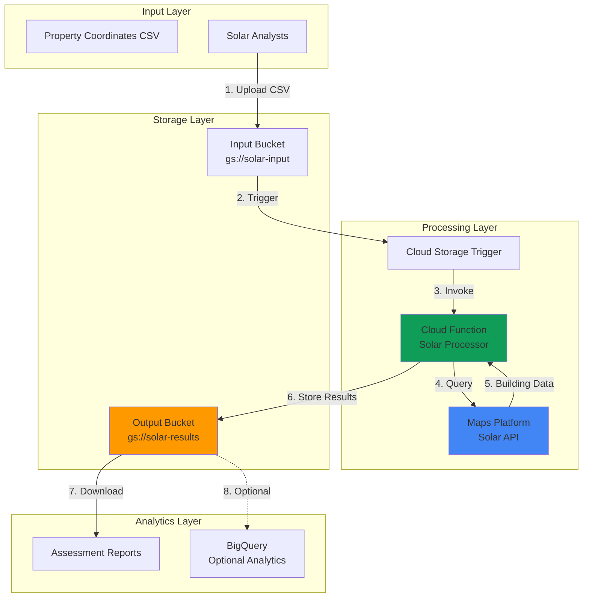

# Automated Solar Assessment with Solar API and Functions

## Problem

Real estate companies and renewable energy consultants need to evaluate solar potential for hundreds or thousands of properties across multiple regions, but manually checking each building through web interfaces is time-consuming and error-prone. Without automated assessment capabilities, solar consultants struggle to provide timely quotes to customers and miss opportunities in competitive markets where speed matters.

## Solution

Build an automated solar assessment system that processes property coordinates in batches using Google Maps Platform Solar API integrated with Cloud Functions for serverless processing and Cloud Storage for scalable result storage. This serverless architecture enables rapid evaluation of building solar potential with detailed analytics including roof suitability, energy production estimates, and cost-benefit analysis.

## Architecture Diagram



## Prerequisites

1. Google Cloud Project with Maps Platform Solar API enabled and billing configured
2. Google Cloud CLI installed and authenticated with project owner permissions
3. Basic knowledge of REST APIs and Python programming concepts
4. Google Maps Platform API key with Solar API access enabled
5. Estimated cost: $2-5 for 100 property assessments (Solar API: $0.01-0.02 per request, Cloud Functions: minimal for processing time, Cloud Storage: $0.02/GB/month)

> **Note**: Solar API pricing varies by region and data complexity. Review current [Google Maps Platform pricing](https://mapsplatform.google.com/pricing/) for accurate cost estimates.

## Preparation

```bash
# Set environment variables for GCP resources
export PROJECT_ID="solar-assessment-$(date +%s)"
export REGION="us-central1"
export ZONE="us-central1-a"

# Generate unique suffix for resource names
RANDOM_SUFFIX=$(openssl rand -hex 3)
export FUNCTION_NAME="solar-processor-${RANDOM_SUFFIX}"
export INPUT_BUCKET="solar-input-${RANDOM_SUFFIX}"
export OUTPUT_BUCKET="solar-results-${RANDOM_SUFFIX}"

# Set default project and region
gcloud config set project ${PROJECT_ID}
gcloud config set compute/region ${REGION}
gcloud config set functions/region ${REGION}

# Enable required APIs
gcloud services enable cloudfunctions.googleapis.com
gcloud services enable storage.googleapis.com
gcloud services enable solar.googleapis.com

echo "✅ Project configured: ${PROJECT_ID}"
echo "Input bucket: gs://${INPUT_BUCKET}"
echo "Output bucket: gs://${OUTPUT_BUCKET}"
```

## Steps

1. **Create Cloud Storage Buckets for Data Processing**:

   Cloud Storage provides the foundation for our serverless data pipeline, offering event-driven triggers that automatically invoke Cloud Functions when new CSV files are uploaded. The dual-bucket architecture separates input processing from results storage, enabling clear data flow and supporting audit trails for solar assessments.

   ```bash
   # Create input bucket for property coordinate files
   gsutil mb -p ${PROJECT_ID} \
       -c STANDARD \
       -l ${REGION} \
       gs://${INPUT_BUCKET}
   
   # Create output bucket for assessment results
   gsutil mb -p ${PROJECT_ID} \
       -c STANDARD \
       -l ${REGION} \
       gs://${OUTPUT_BUCKET}
   
   # Enable versioning for data protection
   gsutil versioning set on gs://${INPUT_BUCKET}
   gsutil versioning set on gs://${OUTPUT_BUCKET}
   
   echo "✅ Cloud Storage buckets created with versioning enabled"
   ```

   The storage infrastructure now supports scalable batch processing with automatic versioning, ensuring data integrity and providing rollback capabilities for production solar assessment workflows.

2. **Create Google Maps Platform API Key**:

   The Solar API requires authentication through a Google Maps Platform API key with specific permissions for building insights and solar potential data. This key enables secure access to Google's comprehensive solar dataset, which includes roof geometry, shading analysis, and energy production calculations based on local weather patterns.

   ```bash
   # Create API key for Solar API access
   API_KEY_NAME="solar-assessment-key-${RANDOM_SUFFIX}"
   
   # Create the API key using the recommended gcloud command
   gcloud services api-keys create \
       --display-name="${API_KEY_NAME}" \
       --api-restrictions-service=solar.googleapis.com
   
   # Get the key string for use in environment variables
   SOLAR_API_KEY=$(gcloud services api-keys get-key-string \
       --location=global \
       ${API_KEY_NAME} \
       --format="value(keyString)")
   
   echo "✅ Solar API key created and configured"
   echo "Store this key securely for production use"
   ```

   The API key is now configured with appropriate service restrictions, following Google Cloud security best practices by limiting access to only the Solar API endpoints required for building assessments.

3. **Develop Solar Assessment Function Code**:

   Cloud Functions provide serverless execution for our solar assessment logic, automatically scaling based on uploaded file volume while maintaining cost efficiency through pay-per-invocation pricing. The function processes CSV files containing property coordinates and enriches them with comprehensive solar potential data.

   ```bash
   # Create function directory and navigate to it
   mkdir -p solar-function && cd solar-function
   
   # Create requirements.txt for Python dependencies
   cat > requirements.txt << 'EOF'
functions-framework==3.6.0
google-cloud-storage==2.17.0
requests==2.32.3
pandas==2.2.2
EOF
   
   echo "✅ Function dependencies configured"
   ```

   The dependency configuration ensures compatibility with Cloud Functions Python 3.11 runtime while including essential libraries for data processing (pandas) and Google Cloud integration (google-cloud-storage).

4. **Implement Solar Processing Logic**:

   The main function logic orchestrates the solar assessment workflow, parsing property coordinates from CSV files, calling the Solar API for each building, and aggregating comprehensive results including solar potential, roof suitability, and energy production estimates.

   ```bash
   # Create main function code
   cat > main.py << 'EOF'
import json
import pandas as pd
import requests
from google.cloud import storage
import os
from io import StringIO
import functions_framework
import time

# Initialize Cloud Storage client
storage_client = storage.Client()

@functions_framework.cloud_event
def process_solar_assessment(cloud_event):
    """
    Process uploaded CSV files and perform solar assessments
    Triggered by Cloud Storage object creation events
    """
    # Extract file information from cloud event
    data = cloud_event.data
    bucket_name = data['bucket']
    file_name = data['name']
    
    # Only process CSV files
    if not file_name.endswith('.csv'):
        print(f"Skipping non-CSV file: {file_name}")
        return
    
    print(f"Processing solar assessment for: {file_name}")
    
    try:
        # Download CSV file from input bucket
        bucket = storage_client.bucket(bucket_name)
        blob = bucket.blob(file_name)
        csv_content = blob.download_as_text()
        
        # Parse CSV file
        df = pd.read_csv(StringIO(csv_content))
        
        # Validate required columns
        required_columns = ['address', 'latitude', 'longitude']
        if not all(col in df.columns for col in required_columns):
            raise ValueError(f"CSV must contain columns: {required_columns}")
        
        # Process each property
        results = []
        solar_api_key = os.environ.get('SOLAR_API_KEY')
        
        if not solar_api_key:
            raise ValueError("SOLAR_API_KEY environment variable not set")
        
        for index, row in df.iterrows():
            try:
                solar_data = get_building_insights(
                    row['latitude'], 
                    row['longitude'], 
                    solar_api_key
                )
                
                # Extract solar potential data with safe navigation
                solar_potential = solar_data.get('solarPotential', {})
                roof_stats = solar_potential.get('wholeRoofStats', {})
                
                # Combine original data with solar insights
                result = {
                    'address': row['address'],
                    'latitude': row['latitude'],
                    'longitude': row['longitude'],
                    'solar_potential_kwh_per_year': solar_potential.get('maxArrayPanelsCount', 0) * 400,  # Estimated 400 kWh per panel
                    'roof_area_sqm': roof_stats.get('areaMeters2', 0),
                    'max_panels': solar_potential.get('maxArrayPanelsCount', 0),
                    'sunshine_quantiles': roof_stats.get('sunshineQuantiles', []),
                    'imagery_quality': solar_data.get('imageryQuality', 'UNKNOWN'),
                    'postal_code': solar_data.get('postalCode', ''),
                    'region_code': solar_data.get('regionCode', ''),
                    'assessment_timestamp': pd.Timestamp.now().isoformat()
                }
                results.append(result)
                
                print(f"✅ Processed: {row['address']}")
                
                # Add delay to respect API rate limits
                time.sleep(0.1)
                
            except Exception as e:
                print(f"❌ Error processing {row['address']}: {str(e)}")
                # Add error record to maintain data completeness
                results.append({
                    'address': row['address'],
                    'latitude': row['latitude'],
                    'longitude': row['longitude'],
                    'error': str(e),
                    'assessment_timestamp': pd.Timestamp.now().isoformat()
                })
        
        # Save results to output bucket
        output_bucket_name = os.environ.get('OUTPUT_BUCKET')
        if output_bucket_name:
            save_results_to_storage(results, output_bucket_name, file_name)
        
        print(f"✅ Solar assessment completed for {len(results)} properties")
        
    except Exception as e:
        print(f"❌ Error processing file {file_name}: {str(e)}")
        raise

def get_building_insights(latitude, longitude, api_key):
    """
    Get solar insights for a building location using Solar API
    """
    url = "https://solar.googleapis.com/v1/buildingInsights:findClosest"
    
    params = {
        'location.latitude': latitude,
        'location.longitude': longitude,
        'requiredQuality': 'MEDIUM',
        'key': api_key
    }
    
    try:
        response = requests.get(url, params=params, timeout=30)
        
        if response.status_code == 200:
            return response.json()
        elif response.status_code == 404:
            # Building not found - return empty data structure
            return {
                'solarPotential': {
                    'maxArrayPanelsCount': 0,
                    'wholeRoofStats': {
                        'areaMeters2': 0,
                        'sunshineQuantiles': []
                    }
                },
                'imageryQuality': 'NOT_FOUND'
            }
        else:
            response.raise_for_status()
    except requests.RequestException as e:
        print(f"API request failed: {str(e)}")
        raise

def save_results_to_storage(results, bucket_name, original_filename):
    """
    Save assessment results to Cloud Storage
    """
    # Create results DataFrame
    results_df = pd.DataFrame(results)
    
    # Generate output filename
    base_name = original_filename.replace('.csv', '')
    output_filename = f"{base_name}_solar_assessment_{pd.Timestamp.now().strftime('%Y%m%d_%H%M%S')}.csv"
    
    # Save to output bucket
    output_bucket = storage_client.bucket(bucket_name)
    output_blob = output_bucket.blob(output_filename)
    
    # Convert DataFrame to CSV string and upload
    csv_string = results_df.to_csv(index=False)
    output_blob.upload_from_string(csv_string, content_type='text/csv')
    
    print(f"✅ Results saved to gs://{bucket_name}/{output_filename}")
EOF
   
   echo "✅ Solar assessment function implemented"
   ```

   The function implementation provides robust error handling, data validation, comprehensive solar analysis integration with the Google Maps Platform Solar API, rate limiting for API calls, and graceful handling of buildings not found in the Solar API dataset.

5. **Deploy Cloud Function with Environment Configuration**:

   Cloud Functions deployment configures the serverless execution environment with appropriate memory allocation, timeout settings, and environment variables needed for Solar API integration. The Cloud Storage trigger enables automatic processing whenever new property data files are uploaded.

   ```bash
   # Deploy Cloud Function with Cloud Storage trigger
   gcloud functions deploy ${FUNCTION_NAME} \
       --gen2 \
       --runtime python311 \
       --trigger-bucket ${INPUT_BUCKET} \
       --source . \
       --entry-point process_solar_assessment \
       --memory 512Mi \
       --timeout 540s \
       --set-env-vars SOLAR_API_KEY=${SOLAR_API_KEY},OUTPUT_BUCKET=${OUTPUT_BUCKET} \
       --max-instances 10 \
       --region ${REGION}
   
   echo "✅ Solar assessment function deployed successfully"
   echo "Function name: ${FUNCTION_NAME}"
   echo "Trigger bucket: gs://${INPUT_BUCKET}"
   ```

   The Cloud Function is now configured with Cloud Functions 2nd generation for improved performance, optimal memory and timeout settings, comprehensive environment variable configuration, and integration with Cloud Storage events for seamless batch processing of solar assessments.

6. **Create Sample Property Data for Testing**:

   Sample data preparation demonstrates the expected CSV format and provides realistic test scenarios for validating the solar assessment pipeline. The test dataset includes diverse property types and geographic locations to verify API integration and result processing accuracy.

   ```bash
   # Navigate back to project root
   cd ..
   
   # Create sample CSV with property coordinates
   cat > sample_properties.csv << 'EOF'
address,latitude,longitude
"1600 Amphitheatre Pkwy, Mountain View, CA",37.4220041,-122.0862515
"One Apple Park Way, Cupertino, CA",37.3348274,-122.0090531
"1 Tesla Rd, Austin, TX",30.2711286,-97.7436995
"350 5th Ave, New York, NY",40.7484405,-73.9856644
"Space Needle, Seattle, WA",47.6205063,-122.3492774
EOF
   
   echo "✅ Sample property data created with 5 diverse locations"
   echo "Properties include commercial and landmark buildings across different climates"
   ```

   The sample dataset represents various building types and geographic regions, enabling comprehensive testing of the Solar API's capabilities across different solar potential scenarios and climate conditions.

## Validation & Testing

1. **Upload Test Data and Trigger Assessment**:

   ```bash
   # Upload sample CSV to trigger function execution
   gsutil cp sample_properties.csv gs://${INPUT_BUCKET}/
   
   echo "✅ Test file uploaded to trigger solar assessment processing"
   echo "Check function logs for processing status"
   ```

2. **Monitor Function Execution and Logs**:

   ```bash
   # View function logs to verify processing
   gcloud functions logs read ${FUNCTION_NAME} \
       --region ${REGION} \
       --limit 20 \
       --format="table(timestamp,severity,textPayload)"
   
   # Check function status
   gcloud functions describe ${FUNCTION_NAME} \
       --region ${REGION} \
       --format="table(state,updateTime)"
   ```

   Expected output: Function logs showing successful processing of each property address with solar potential data retrieved from the Solar API.

3. **Verify Solar Assessment Results**:

   ```bash
   # List generated assessment results
   gsutil ls -l gs://${OUTPUT_BUCKET}/
   
   # Download and examine results file
   RESULT_FILE=$(gsutil ls gs://${OUTPUT_BUCKET}/ | grep solar_assessment | head -1)
   gsutil cp ${RESULT_FILE} ./solar_results.csv
   
   # Display first few results
   head -3 ./solar_results.csv
   ```

   Expected output: CSV file containing original property data enhanced with solar potential metrics including roof area, maximum panels, estimated annual energy production, and sunshine quantiles.

## Cleanup

1. **Remove Cloud Function and associated resources**:

   ```bash
   # Delete Cloud Function
   gcloud functions delete ${FUNCTION_NAME} \
       --region ${REGION} \
       --quiet
   
   echo "✅ Cloud Function deleted"
   ```

2. **Clean up Cloud Storage buckets and data**:

   ```bash
   # Remove all objects and delete buckets
   gsutil -m rm -r gs://${INPUT_BUCKET}
   gsutil -m rm -r gs://${OUTPUT_BUCKET}
   
   # Remove local files
   rm -rf solar-function/ sample_properties.csv solar_results.csv
   
   echo "✅ Storage buckets and local files deleted"
   ```

3. **Remove API key and disable services**:

   ```bash
   # Delete API key
   gcloud services api-keys delete ${API_KEY_NAME} \
       --location=global \
       --quiet
   
   # Disable APIs (optional, may affect other resources)
   # gcloud services disable cloudfunctions.googleapis.com --force
   # gcloud services disable solar.googleapis.com --force
   
   echo "✅ API key deleted and resources cleaned up"
   ```

## Discussion

This automated solar assessment solution demonstrates the power of serverless architectures for geospatial analytics workloads. Google Maps Platform Solar API provides comprehensive building analysis that includes roof geometry detection, solar irradiance calculations, and energy production estimates based on local weather patterns and geographic conditions. The API's sophisticated algorithms account for shading from nearby buildings, trees, and roof features while considering seasonal sun path variations and regional climate data.

The Cloud Functions integration enables cost-effective batch processing by automatically scaling from zero to handle varying workloads without infrastructure management overhead. This serverless approach is particularly valuable for solar assessment businesses that experience seasonal demand fluctuations or project-based workloads. The event-driven architecture ensures immediate processing when new property lists are uploaded, enabling rapid response times for customer quotes and competitive advantage in time-sensitive markets.

Cloud Storage provides the foundation for scalable data operations with built-in versioning, lifecycle management, and integration with BigQuery for advanced analytics. The dual-bucket architecture separates input processing from results storage, supporting clear audit trails and enabling downstream integrations with business intelligence tools, CRM systems, or customer portals for interactive solar potential visualization.

The solution's architecture follows Google Cloud's operational excellence principles by implementing comprehensive error handling, logging, and monitoring capabilities. Each solar assessment includes detailed metadata and error tracking, ensuring data quality and enabling troubleshooting of API quota limits or geographic coverage gaps. For production deployments, additional considerations include implementing retry logic for API rate limits, optimizing batch sizes for cost efficiency, and integrating with Cloud Monitoring for proactive alerting on assessment pipeline health.

> **Tip**: Monitor Solar API usage carefully as costs scale with request volume. Consider implementing caching mechanisms for frequently assessed properties and batch optimization strategies to minimize API calls while maximizing data collection efficiency.

For comprehensive implementation guidance, refer to the [Google Maps Platform Solar API documentation](https://developers.google.com/maps/documentation/solar), [Cloud Functions best practices](https://cloud.google.com/functions/docs/bestpractices), [Cloud Storage design patterns](https://cloud.google.com/storage/docs/best-practices), [Google Cloud Architecture Framework](https://cloud.google.com/architecture/framework), and [serverless application security guidelines](https://cloud.google.com/security/best-practices).

## Challenge

Extend this solution by implementing these enhancements:

1. **Cost-Benefit Analysis Integration**: Add economic modeling that calculates ROI, payback periods, and financing options using local utility rates and solar incentive programs for more comprehensive property assessments.

2. **Geographic Visualization Dashboard**: Build a web interface using Google Maps JavaScript API that displays solar potential results with color-coded roof overlays, interactive property details, and comparative regional analysis capabilities.

3. **Multi-Region Processing Optimization**: Implement intelligent routing that automatically selects optimal Cloud Functions regions based on property locations to minimize latency and comply with data residency requirements for international assessments.

4. **Advanced Analytics Pipeline**: Connect results to BigQuery and create machine learning models that predict solar adoption likelihood based on property characteristics, demographics, and historical installation patterns for targeted marketing campaigns.

5. **Real-Time Assessment API**: Transform the batch processing system into a real-time web service using Cloud Run that provides instant solar assessments through RESTful APIs for integration with real estate platforms and solar installer mobile applications.

## Infrastructure Code

*Infrastructure code will be generated after recipe approval.*