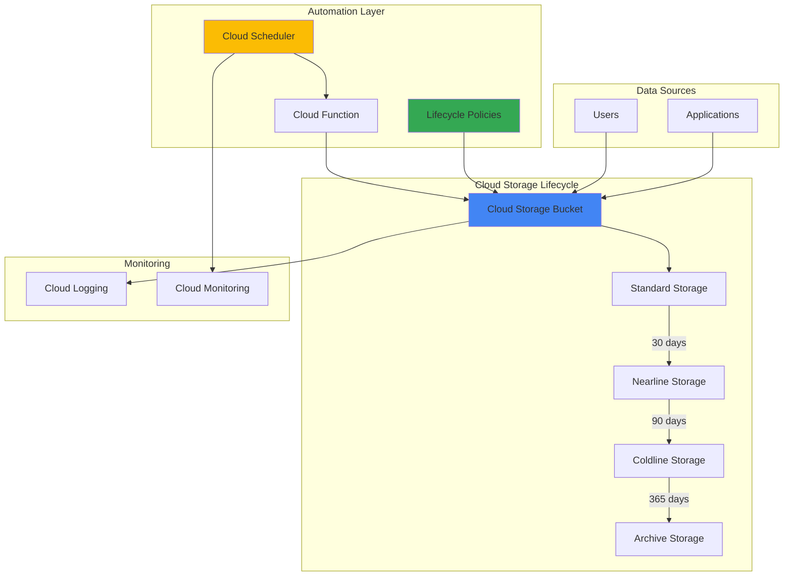

# Automated Storage Lifecycle Management with Cloud Storage

## Problem

Organizations accumulate massive amounts of data in cloud storage but struggle with escalating storage costs as files age and become less frequently accessed. Manual data management creates operational overhead, while lack of automated cleanup leads to unnecessary storage expenses and compliance risks from retaining outdated data beyond regulatory requirements.

## Solution

Implement automated Cloud Storage lifecycle policies that automatically transition objects between storage classes based on age and access patterns, while using Cloud Scheduler to orchestrate additional governance tasks. This approach reduces storage costs by up to 80% through intelligent data tiering and ensures compliance through automated data deletion.

## Architecture Diagram



## Prerequisites

1. Google Cloud account with billing enabled and appropriate permissions for Cloud Storage and Cloud Scheduler
2. gcloud CLI installed and configured (or use Cloud Shell)
3. Basic understanding of data lifecycle management concepts
4. Project with Cloud Storage API and Cloud Scheduler API enabled
5. Estimated cost: $0.01-$0.50 per month for small datasets (varies by data volume and access patterns)

> **Note**: Lifecycle policies take up to 24 hours to take effect and begin transitioning objects to lower-cost storage classes.

## Preparation

```bash
# Set environment variables for GCP resources
export PROJECT_ID="lifecycle-demo-$(date +%s)"
export REGION="us-central1"
export ZONE="us-central1-a"

# Generate unique suffix for resource names
RANDOM_SUFFIX=$(openssl rand -hex 3)
export BUCKET_NAME="storage-lifecycle-demo-${RANDOM_SUFFIX}"
export JOB_NAME="lifecycle-cleanup-job-${RANDOM_SUFFIX}"

# Create and set project (if needed)
gcloud projects create ${PROJECT_ID} --name="Storage Lifecycle Demo"
gcloud config set project ${PROJECT_ID}
gcloud config set compute/region ${REGION}
gcloud config set compute/zone ${ZONE}

# Enable required APIs
gcloud services enable storage.googleapis.com
gcloud services enable cloudscheduler.googleapis.com
gcloud services enable cloudfunctions.googleapis.com

echo "✅ Project configured: ${PROJECT_ID}"
echo "✅ Resources will use suffix: ${RANDOM_SUFFIX}"
```

## Steps

1. **Create Cloud Storage Bucket with Lifecycle Configuration**:

   Google Cloud Storage provides unified object storage with multiple storage classes optimized for different access patterns and cost requirements. Creating a bucket with proper lifecycle policies enables automatic cost optimization as data ages and access frequency decreases.

   ```bash
   # Create the storage bucket with standard storage class
   gcloud storage buckets create gs://${BUCKET_NAME} \
       --location=${REGION} \
       --default-storage-class=STANDARD \
       --uniform-bucket-level-access
   
   echo "✅ Storage bucket created: gs://${BUCKET_NAME}"
   ```

   The bucket is now configured with uniform bucket-level access, providing consistent security controls and simplified permission management across all objects in the bucket.

2. **Configure Automated Lifecycle Policy Rules**:

   Lifecycle policies automatically manage object transitions between storage classes and deletion based on configurable conditions. This eliminates manual intervention while optimizing costs through intelligent data tiering.

   ```bash
   # Create lifecycle configuration file
   cat > lifecycle-config.json << 'EOF'
   {
     "lifecycle": {
       "rule": [
         {
           "action": {
             "type": "SetStorageClass",
             "storageClass": "NEARLINE"
           },
           "condition": {
             "age": 30,
             "matchesStorageClass": ["STANDARD"]
           }
         },
         {
           "action": {
             "type": "SetStorageClass", 
             "storageClass": "COLDLINE"
           },
           "condition": {
             "age": 90,
             "matchesStorageClass": ["NEARLINE"]
           }
         },
         {
           "action": {
             "type": "SetStorageClass",
             "storageClass": "ARCHIVE"
           },
           "condition": {
             "age": 365,
             "matchesStorageClass": ["COLDLINE"]
           }
         },
         {
           "action": {
             "type": "Delete"
           },
           "condition": {
             "age": 2555
           }
         }
       ]
     }
   }
   EOF
   
   # Apply lifecycle configuration to bucket
   gcloud storage buckets update gs://${BUCKET_NAME} \
       --lifecycle-file=lifecycle-config.json
   
   echo "✅ Lifecycle policies configured for automated storage transitions"
   ```

   The lifecycle policy now automatically transitions objects through progressively cheaper storage classes and deletes files after 7 years (2555 days), ensuring cost optimization and compliance with data retention requirements.

3. **Upload Sample Data with Different Ages**:

   Testing lifecycle policies requires objects with varying ages to demonstrate automatic transitions. Creating sample data with custom timestamps validates policy effectiveness and provides monitoring baselines.

   ```bash
   # Create sample files with different content types
   echo "Critical business data - frequent access" > critical-data.txt
   echo "Monthly reports - moderate access" > monthly-report.txt  
   echo "Archived logs - rare access" > archived-logs.txt
   echo "Backup files - emergency access only" > backup-data.txt
   
   # Upload files to Cloud Storage
   gcloud storage cp critical-data.txt gs://${BUCKET_NAME}/
   gcloud storage cp monthly-report.txt gs://${BUCKET_NAME}/
   gcloud storage cp archived-logs.txt gs://${BUCKET_NAME}/
   gcloud storage cp backup-data.txt gs://${BUCKET_NAME}/
   
   # Set custom timestamps to simulate aged data (optional - for testing)
   gcloud storage objects update gs://${BUCKET_NAME}/archived-logs.txt \
       --custom-time="2024-01-01T00:00:00Z"
   
   echo "✅ Sample data uploaded with varying access patterns"
   ```

   The uploaded objects now serve as test data for lifecycle policy validation, with different files representing typical enterprise data access patterns and retention requirements.

4. **Create Cloud Scheduler Job for Additional Automation**:

   Cloud Scheduler provides cron-based automation for tasks that require more complex logic than basic lifecycle policies. This enables custom data governance workflows, compliance reporting, and proactive storage optimization.

   ```bash
   # Create App Engine application (required for Cloud Scheduler)
   gcloud app create --region=${REGION} --quiet || true
   
   # Create a simple HTTP endpoint for lifecycle reporting 
   # (using httpbin for demo)
   WEBHOOK_URL="https://httpbin.org/post"
   
   # Create scheduled job for weekly lifecycle reporting
   gcloud scheduler jobs create http ${JOB_NAME} \
       --location=${REGION} \
       --schedule="0 9 * * 1" \
       --uri=${WEBHOOK_URL} \
       --http-method=POST \
       --message-body='{"bucket":"'${BUCKET_NAME}'","action":"lifecycle_report","timestamp":"'$(date -u +%Y-%m-%dT%H:%M:%SZ)'"}' \
       --headers="Content-Type=application/json"
   
   echo "✅ Cloud Scheduler job created for weekly lifecycle reporting"
   ```

   The scheduler job now runs every Monday at 9 AM, providing automated reporting and enabling integration with external systems for comprehensive data governance workflows.

5. **Configure Monitoring and Alerting**:

   Monitoring lifecycle policy effectiveness ensures cost optimization goals are met while maintaining data availability. Cloud Monitoring provides insights into storage class distributions and transition patterns.

   ```bash
   # Create a dedicated Cloud Storage bucket for logs
   gcloud storage buckets create gs://${BUCKET_NAME}-logs \
       --location=${REGION} \
       --uniform-bucket-level-access
   
   # Create logging sink for storage lifecycle events
   gcloud logging sinks create storage-lifecycle-sink \
       gs://${BUCKET_NAME}-logs \
       --log-filter='resource.type="gcs_bucket" AND 
                     resource.labels.bucket_name="'${BUCKET_NAME}'"'
   
   echo "✅ Monitoring configured for lifecycle policy tracking"
   echo "View logs: https://console.cloud.google.com/logs/viewer"
   echo "Configure alerts: https://console.cloud.google.com/monitoring"
   ```

   Storage monitoring is now active, enabling visibility into lifecycle policy performance and providing data for cost optimization analysis.

6. **Test Lifecycle Policy Enforcement**:

   Validating lifecycle policies ensures automated transitions work correctly and meet organizational requirements. Testing involves verifying policy rules, storage class transitions, and deletion behaviors.

   ```bash
   # List current objects and their storage classes
   gcloud storage ls -L gs://${BUCKET_NAME}/ \
       --format="table(name,storageClass,timeCreated,size)"
   
   # Check lifecycle configuration is applied
   gcloud storage buckets describe gs://${BUCKET_NAME} \
       --format="json(lifecycle)"
   
   # Verify scheduler job is created and enabled
   gcloud scheduler jobs describe ${JOB_NAME} \
       --location=${REGION} \
       --format="table(name,schedule,state,httpTarget.uri)"
   
   echo "✅ Lifecycle policies are active and will begin transitioning objects based on age"
   ```

   Policy validation confirms that automated lifecycle management is properly configured and ready to optimize storage costs as objects age according to defined rules.

## Validation & Testing

1. **Verify bucket configuration and lifecycle rules**:

   ```bash
   # Check bucket details and lifecycle configuration
   gcloud storage buckets describe gs://${BUCKET_NAME} \
       --format="yaml(lifecycle,location,storageClass)"
   ```

   Expected output: Lifecycle rules showing transitions at 30, 90, and 365 days, with deletion at 2555 days.

2. **Test scheduler job execution**:

   ```bash
   # Manually run the scheduler job to test functionality
   gcloud scheduler jobs run ${JOB_NAME} --location=${REGION}
   
   # Check job execution history
   gcloud scheduler jobs describe ${JOB_NAME} \
       --location=${REGION} \
       --format="table(name,schedule,state,lastAttemptTime,status)"
   ```

   Expected output: Job executes successfully with HTTP 200 response from the webhook endpoint.

3. **Monitor storage usage patterns**:

   ```bash
   # Check current storage usage by class
   gcloud storage du gs://${BUCKET_NAME} --summarize
   
   # List objects with detailed storage information
   gcloud storage ls -L gs://${BUCKET_NAME}/** \
       --format="table(name,storageClass,timeCreated,updated,size)"
   ```

   Expected output: All objects currently in STANDARD storage class, ready for future transitions based on age.

## Cleanup

1. **Remove scheduled automation job**:

   ```bash
   # Delete the Cloud Scheduler job
   gcloud scheduler jobs delete ${JOB_NAME} \
       --location=${REGION} \
       --quiet
   
   echo "✅ Deleted scheduler job: ${JOB_NAME}"
   ```

2. **Delete storage buckets and all contents**:

   ```bash
   # Remove all objects from main bucket
   gcloud storage rm -r gs://${BUCKET_NAME}
   
   # Remove logging bucket
   gcloud storage rm -r gs://${BUCKET_NAME}-logs
   
   echo "✅ Deleted storage buckets"
   ```

3. **Remove logging sink**:

   ```bash
   # Delete the logging sink
   gcloud logging sinks delete storage-lifecycle-sink --quiet
   
   echo "✅ Deleted logging sink"
   ```

4. **Clean up local configuration files**:

   ```bash
   # Remove temporary files
   rm -f lifecycle-config.json critical-data.txt monthly-report.txt
   rm -f archived-logs.txt backup-data.txt
   
   echo "✅ Cleaned up local files"
   ```

5. **Delete project (if created specifically for this recipe)**:

   ```bash
   # Delete the entire project (optional)
   gcloud projects delete ${PROJECT_ID} --quiet
   
   echo "✅ Project deletion initiated: ${PROJECT_ID}"
   echo "Note: Project deletion may take several minutes to complete"
   ```

## Discussion

Automated storage lifecycle management represents a fundamental shift from reactive to proactive data governance, enabling organizations to optimize costs while maintaining compliance and operational efficiency. Google Cloud Storage's lifecycle policies provide rule-based automation that eliminates manual intervention and reduces storage costs by automatically transitioning objects between storage classes based on access patterns and age.

The integration of Cloud Scheduler adds sophisticated workflow capabilities beyond basic lifecycle rules, enabling custom automation for compliance reporting, data quality validation, and integration with external systems. This combination creates a comprehensive data governance framework that scales automatically with organizational growth while maintaining cost efficiency. The progressive storage class transitions—from Standard to Nearline (30 days), Coldline (90 days), and Archive (365 days)—reflect real-world data access patterns where recent data requires immediate availability while older data can tolerate higher access latency in exchange for significant cost savings.

Key architectural benefits include elimination of storage sprawl through automated cleanup, predictable cost management through rule-based transitions, and compliance assurance through automated retention policies. The monitoring integration provides visibility into policy effectiveness and enables continuous optimization based on actual usage patterns. Organizations typically achieve 60-80% storage cost reduction through proper lifecycle management while improving operational efficiency and reducing compliance risks.

For production implementations, consider implementing custom metadata tags for granular policy control, integrating with external backup systems for critical data protection, and establishing notification workflows for policy violations or unusual access patterns. The solution scales seamlessly from gigabytes to petabytes while maintaining consistent cost optimization and governance controls.

> **Tip**: Use Cloud Monitoring dashboards to track storage class distributions and cost trends, enabling data-driven optimization of lifecycle policy rules.

*Sources: [Cloud Storage Lifecycle Management](https://cloud.google.com/storage/docs/lifecycle), [Cloud Scheduler Documentation](https://cloud.google.com/scheduler/docs), [Storage Classes Overview](https://cloud.google.com/storage/docs/storage-classes), [Cost Optimization Best Practices](https://cloud.google.com/architecture/framework/cost-optimization), [Data Governance Patterns](https://cloud.google.com/architecture/data-governance-with-dataflow-and-dbt)*

## Challenge

Extend this solution by implementing these enhancements:

1. **Custom Metadata-Based Policies**: Create lifecycle rules that consider object metadata and labels for more granular control over storage transitions and deletion.

2. **Multi-Region Disaster Recovery**: Implement cross-region replication with separate lifecycle policies for primary and backup regions to ensure business continuity.

3. **Advanced Analytics Integration**: Connect lifecycle transitions to BigQuery for detailed cost analysis and usage pattern identification across different data types.

4. **Compliance Automation**: Develop Cloud Functions triggered by lifecycle events to automatically generate compliance reports and audit trails for regulatory requirements.

5. **Machine Learning Optimization**: Implement Vertex AI to analyze access patterns and automatically adjust lifecycle policy rules based on actual usage data and cost optimization opportunities.

## Infrastructure Code

*Infrastructure code will be generated after recipe approval.*