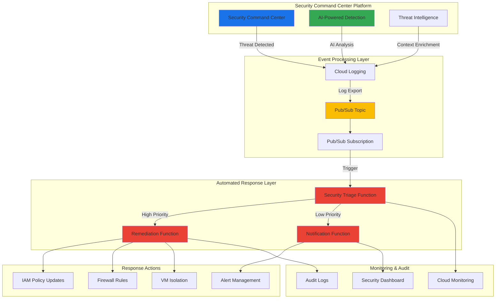

# Automated Threat Response with Unified Security and Functions

## Problem

Enterprise security teams struggle with escalating threat volumes and manual incident response processes that can take hours or days to address critical security findings. Traditional security operations rely heavily on human analysis for threat triage, creating response delays that allow attackers to establish persistence or escalate privileges. Organizations need automated, intelligent threat detection and response capabilities that can identify, analyze, and remediate security incidents at machine speed while maintaining human oversight for complex scenarios.

## Solution

Build an intelligent, automated security response system using Security Command Center's AI-powered threat detection integrated with Cloud Functions for immediate remediation actions. The solution leverages Pub/Sub for event-driven architecture, enabling real-time processing of security findings from Google's centralized security management platform. Cloud Logging provides comprehensive audit trails and monitoring, while Security Command Center's built-in threat intelligence enhances analysis and automates routine security operations, reducing incident response times from hours to minutes.

## Architecture Diagram



## Prerequisites

1. Google Cloud account with Security Admin and Cloud Functions Admin permissions
2. Google Cloud CLI installed and configured (or Cloud Shell)
3. Basic understanding of event-driven security architecture and threat response workflows
4. Security Command Center Premium or Enterprise access (requires paid subscription)
5. Estimated cost: $20-40 per month for functions, logging, and Pub/Sub resources

> **Note**: Security Command Center Premium or Enterprise is required for advanced threat detection features. Contact Google Cloud sales for access if not already available in your organization.

## Preparation

```bash
# Set environment variables for GCP resources
export PROJECT_ID="security-automation-$(date +%s)"
export REGION="us-central1"
export ZONE="us-central1-a"

# Generate unique suffix for resource names
RANDOM_SUFFIX=$(openssl rand -hex 3)
export TOPIC_NAME="threat-response-topic-${RANDOM_SUFFIX}"
export SUBSCRIPTION_NAME="threat-response-sub-${RANDOM_SUFFIX}"
export LOG_SINK_NAME="security-findings-sink-${RANDOM_SUFFIX}"

# Set default project and region
gcloud config set project ${PROJECT_ID}
gcloud config set compute/region ${REGION}
gcloud config set compute/zone ${ZONE}

# Enable required APIs
gcloud services enable cloudfunctions.googleapis.com
gcloud services enable pubsub.googleapis.com
gcloud services enable logging.googleapis.com
gcloud services enable monitoring.googleapis.com
gcloud services enable securitycenter.googleapis.com
gcloud services enable cloudbuild.googleapis.com

echo "✅ Project configured: ${PROJECT_ID}"
echo "✅ APIs enabled for security automation"
```

## Steps

1. **Create Pub/Sub Infrastructure for Security Events**:

   Google Cloud Pub/Sub provides the event-driven messaging backbone that enables real-time processing of security findings from Security Command Center. The topic-subscription model ensures reliable message delivery and allows multiple security functions to process the same security events for different response actions.

   ```bash
   # Create Pub/Sub topic for security findings
   gcloud pubsub topics create ${TOPIC_NAME}
   
   # Create subscription for automated response
   gcloud pubsub subscriptions create ${SUBSCRIPTION_NAME} \
       --topic=${TOPIC_NAME} \
       --ack-deadline=60 \
       --message-retention-duration=7d
   
   echo "✅ Pub/Sub infrastructure created successfully"
   ```

   This messaging infrastructure now provides the foundation for event-driven security automation, ensuring that security findings from Security Command Center can trigger immediate automated responses while maintaining message durability and processing guarantees.

2. **Configure Cloud Logging Export for Security Findings**:

   Cloud Logging serves as the central aggregation point for security findings from Security Command Center platform. Creating a log sink ensures that all threat detection events are automatically forwarded to Pub/Sub for real-time processing while maintaining comprehensive audit trails.

   ```bash
   # Create log sink to export security findings to Pub/Sub
   gcloud logging sinks create ${LOG_SINK_NAME} \
       pubsub.googleapis.com/projects/${PROJECT_ID}/topics/${TOPIC_NAME} \
       --log-filter='protoPayload.serviceName="securitycenter.googleapis.com" OR 
                     jsonPayload.source="security-center" OR
                     jsonPayload.category="THREAT_DETECTION" OR
                     severity>="WARNING"'
   
   # Get the sink's service account for IAM binding
   SINK_SERVICE_ACCOUNT=$(gcloud logging sinks describe ${LOG_SINK_NAME} \
       --format="value(writerIdentity)")
   
   # Grant Pub/Sub publisher permissions to the log sink
   gcloud pubsub topics add-iam-policy-binding ${TOPIC_NAME} \
       --member="${SINK_SERVICE_ACCOUNT}" \
       --role="roles/pubsub.publisher"
   
   echo "✅ Security findings log export configured"
   ```

   The log sink now automatically captures security findings from Security Command Center and routes them through Pub/Sub, enabling real-time threat detection and response while preserving audit trails for compliance and forensic analysis.

3. **Deploy Security Triage Cloud Function**:

   The security triage function serves as the initial analysis engine, leveraging Google's threat intelligence and Security Command Center's AI capabilities to automatically classify, prioritize, and route security findings. This function implements intelligent triage logic to distinguish between low-priority alerts and critical threats requiring immediate remediation.

   ```bash
   # Create directory for function source code
   mkdir -p ./security-triage-function
   cd ./security-triage-function
   
   # Create the main function file
   cat > main.py << 'EOF'
import base64
import json
import logging
import os
from google.cloud import monitoring_v3
from google.cloud import securitycenter
from google.cloud import pubsub_v1
from datetime import datetime

def main(event, context):
    """Security triage function for automated threat analysis."""
    
    # Decode Pub/Sub message
    message_data = base64.b64decode(event['data']).decode('utf-8')
    security_finding = json.loads(message_data)
    
    # Extract key finding information
    finding_name = security_finding.get('name', 'Unknown')
    severity = security_finding.get('severity', 'MEDIUM')
    category = security_finding.get('category', 'Unknown')
    source_properties = security_finding.get('sourceProperties', {})
    
    logging.info(f"Processing security finding: {finding_name}")
    logging.info(f"Severity: {severity}, Category: {category}")
    
    # Triage logic based on severity and category
    if severity in ['HIGH', 'CRITICAL']:
        # Route to immediate remediation
        route_to_remediation(security_finding)
    elif category in ['MALWARE', 'PRIVILEGE_ESCALATION', 'DATA_EXFILTRATION']:
        # Route high-priority categories regardless of severity
        route_to_remediation(security_finding)
    else:
        # Route to notification for human review
        route_to_notification(security_finding)
    
    # Create monitoring metric
    create_security_metric(finding_name, severity, category)
    
    return f"Processed security finding: {finding_name}"

def route_to_remediation(finding):
    """Route high-priority findings to remediation function."""
    project_id = os.environ.get('GCP_PROJECT')
    topic_name = 'threat-remediation-topic'
    
    publisher = pubsub_v1.PublisherClient()
    topic_path = publisher.topic_path(project_id, topic_name)
    
    message_data = json.dumps(finding).encode('utf-8')
    publisher.publish(topic_path, message_data)
    logging.info("Routed to remediation function")

def route_to_notification(finding):
    """Route lower-priority findings to notification function."""
    project_id = os.environ.get('GCP_PROJECT')
    topic_name = 'threat-notification-topic'
    
    publisher = pubsub_v1.PublisherClient()
    topic_path = publisher.topic_path(project_id, topic_name)
    
    message_data = json.dumps(finding).encode('utf-8')
    publisher.publish(topic_path, message_data)
    logging.info("Routed to notification function")

def create_security_metric(finding_name, severity, category):
    """Create custom monitoring metrics for security findings."""
    project_id = os.environ.get('GCP_PROJECT')
    client = monitoring_v3.MetricServiceClient()
    project_name = f"projects/{project_id}"
    
    # Create metric point
    series = monitoring_v3.TimeSeries()
    series.metric.type = "custom.googleapis.com/security/findings_processed"
    series.resource.type = "global"
    series.metric.labels["severity"] = severity
    series.metric.labels["category"] = category
    
    # Create data point
    now = datetime.utcnow()
    seconds = int(now.timestamp())
    nanos = int((now.timestamp() - seconds) * 10**9)
    interval = monitoring_v3.TimeInterval(
        {"end_time": {"seconds": seconds, "nanos": nanos}}
    )
    point = monitoring_v3.Point({
        "interval": interval,
        "value": {"int64_value": 1},
    })
    series.points = [point]
    
    client.create_time_series(name=project_name, time_series=[series])
EOF
   
   # Create requirements file
   cat > requirements.txt << 'EOF'
google-cloud-monitoring==2.21.0
google-cloud-securitycenter==1.36.0
google-cloud-pubsub==2.25.0
google-cloud-logging==3.11.0
EOF
   
   # Deploy the security triage function
   gcloud functions deploy security-triage \
       --runtime python39 \
       --trigger-topic ${TOPIC_NAME} \
       --source . \
       --entry-point main \
       --memory 512MB \
       --timeout 300s \
       --set-env-vars "GCP_PROJECT=${PROJECT_ID}"
   
   cd ..
   echo "✅ Security triage function deployed successfully"
   ```

   The security triage function is now operational, providing intelligent analysis and routing of security findings based on severity, threat category, and Google's threat intelligence. This automated triage capability significantly reduces the time between threat detection and response initiation.

4. **Create Additional Pub/Sub Topics for Function Routing**:

   Event-driven security architecture requires dedicated message channels for different response actions. Creating separate topics for remediation and notification functions enables parallel processing and specialized handling based on threat severity and classification.

   ```bash
   # Create topic for high-priority remediation actions
   gcloud pubsub topics create threat-remediation-topic
   gcloud pubsub subscriptions create threat-remediation-sub \
       --topic=threat-remediation-topic \
       --ack-deadline=120
   
   # Create topic for notification and alerting
   gcloud pubsub topics create threat-notification-topic  
   gcloud pubsub subscriptions create threat-notification-sub \
       --topic=threat-notification-topic \
       --ack-deadline=60
   
   echo "✅ Additional Pub/Sub routing infrastructure created"
   ```

   The routing infrastructure now supports sophisticated threat response workflows, allowing the system to process different categories of security findings through specialized functions optimized for their specific response requirements.

5. **Deploy Automated Remediation Function**:

   The remediation function implements immediate automated responses to critical security threats, including IAM policy enforcement, network isolation, and resource quarantine. This function leverages Google Cloud's APIs to execute predefined security playbooks while maintaining comprehensive audit logging.

   ```bash
   # Create remediation function directory
   mkdir -p ./remediation-function
   cd ./remediation-function
   
   # Create remediation function code
   cat > main.py << 'EOF'
import base64
import json
import logging
import os
from google.cloud import compute_v1
from google.cloud import resource_manager
from google.cloud import securitycenter
from google.cloud import logging as cloud_logging
from datetime import datetime

def main(event, context):
    """Automated remediation function for critical security threats."""
    
    # Decode security finding from Pub/Sub
    message_data = base64.b64decode(event['data']).decode('utf-8')
    security_finding = json.loads(message_data)
    
    finding_name = security_finding.get('name', 'Unknown')
    category = security_finding.get('category', 'Unknown')
    resource_name = security_finding.get('resourceName', '')
    
    logging.info(f"Executing remediation for finding: {finding_name}")
    logging.info(f"Category: {category}, Resource: {resource_name}")
    
    # Determine remediation actions based on finding category
    remediation_actions = []
    
    if category == 'PRIVILEGE_ESCALATION':
        remediation_actions.extend(remediate_privilege_escalation(security_finding))
    elif category == 'MALWARE':
        remediation_actions.extend(remediate_malware_detection(security_finding))
    elif category == 'DATA_EXFILTRATION':
        remediation_actions.extend(remediate_data_exfiltration(security_finding))
    elif category == 'NETWORK_INTRUSION':
        remediation_actions.extend(remediate_network_intrusion(security_finding))
    else:
        remediation_actions.append(f"Generic isolation applied for category: {category}")
        apply_generic_isolation(security_finding)
    
    # Log all remediation actions
    log_remediation_actions(finding_name, remediation_actions)
    
    return f"Remediation completed for: {finding_name}"

def remediate_privilege_escalation(finding):
    """Remediate privilege escalation attacks."""
    actions = []
    
    # Extract suspicious IAM members from finding
    source_properties = finding.get('sourceProperties', {})
    suspicious_members = source_properties.get('suspiciousMembers', [])
    
    project_id = os.environ.get('GCP_PROJECT')
    
    for member in suspicious_members:
        try:
            # Remove suspicious IAM bindings
            remove_iam_member(project_id, member)
            actions.append(f"Removed suspicious IAM member: {member}")
        except Exception as e:
            logging.error(f"Failed to remove IAM member {member}: {str(e)}")
            actions.append(f"Failed to remove IAM member: {member}")
    
    return actions

def remediate_malware_detection(finding):
    """Remediate malware detection on compute instances."""
    actions = []
    resource_name = finding.get('resourceName', '')
    
    if 'instances/' in resource_name:
        try:
            # Parse instance details from resource name
            instance_name = resource_name.split('/')[-1]
            zone = resource_name.split('/')[-3]
            project_id = os.environ.get('GCP_PROJECT')
            
            # Isolate infected instance
            isolate_compute_instance(project_id, zone, instance_name)
            actions.append(f"Isolated infected instance: {instance_name}")
            
        except Exception as e:
            logging.error(f"Failed to isolate instance: {str(e)}")
            actions.append(f"Failed to isolate instance: {resource_name}")
    
    return actions

def remediate_data_exfiltration(finding):
    """Remediate data exfiltration attempts."""
    actions = []
    
    # Apply network restrictions
    try:
        apply_network_restrictions(finding)
        actions.append("Applied network restrictions to prevent data exfiltration")
    except Exception as e:
        logging.error(f"Failed to apply network restrictions: {str(e)}")
        actions.append("Failed to apply network restrictions")
    
    return actions

def remediate_network_intrusion(finding):
    """Remediate network intrusion attempts."""
    actions = []
    
    # Block suspicious IP addresses
    source_properties = finding.get('sourceProperties', {})
    suspicious_ips = source_properties.get('suspiciousIPs', [])
    
    for ip in suspicious_ips:
        try:
            block_ip_address(ip)
            actions.append(f"Blocked suspicious IP: {ip}")
        except Exception as e:
            logging.error(f"Failed to block IP {ip}: {str(e)}")
            actions.append(f"Failed to block IP: {ip}")
    
    return actions

def apply_generic_isolation(finding):
    """Apply generic isolation measures for unknown threat categories."""
    resource_name = finding.get('resourceName', '')
    
    if 'instances/' in resource_name:
        instance_name = resource_name.split('/')[-1]
        zone = resource_name.split('/')[-3]
        project_id = os.environ.get('GCP_PROJECT')
        isolate_compute_instance(project_id, zone, instance_name)

def remove_iam_member(project_id, member):
    """Remove suspicious IAM member from project."""
    # Implementation would use Cloud Resource Manager API
    # This is a simplified version for demonstration
    logging.info(f"Would remove IAM member: {member} from project: {project_id}")

def isolate_compute_instance(project_id, zone, instance_name):
    """Isolate compute instance by applying restrictive firewall rules."""
    # Implementation would use Compute Engine API
    # This is a simplified version for demonstration
    logging.info(f"Would isolate instance: {instance_name} in zone: {zone}")

def apply_network_restrictions(finding):
    """Apply network-level restrictions."""
    # Implementation would create firewall rules
    logging.info("Would apply network restrictions based on finding details")

def block_ip_address(ip):
    """Block suspicious IP address."""
    # Implementation would create firewall rules
    logging.info(f"Would block IP address: {ip}")

def log_remediation_actions(finding_name, actions):
    """Log all remediation actions for audit purposes."""
    client = cloud_logging.Client()
    client.setup_logging()
    
    audit_entry = {
        'finding_name': finding_name,
        'remediation_actions': actions,
        'timestamp': str(datetime.utcnow()),
        'function': 'automated-remediation'
    }
    
    logging.info(f"Remediation audit: {json.dumps(audit_entry)}")
EOF
   
   # Create requirements file for remediation function
   cat > requirements.txt << 'EOF'
google-cloud-compute==1.20.0
google-cloud-resource-manager==1.12.5
google-cloud-securitycenter==1.36.0
google-cloud-logging==3.11.0
EOF
   
   # Deploy remediation function
   gcloud functions deploy automated-remediation \
       --runtime python39 \
       --trigger-topic threat-remediation-topic \
       --source . \
       --entry-point main \
       --memory 1024MB \
       --timeout 540s \
       --set-env-vars "GCP_PROJECT=${PROJECT_ID}"
   
   cd ..
   echo "✅ Automated remediation function deployed successfully"
   ```

   The automated remediation function is now capable of executing immediate response actions for critical security threats, significantly reducing the time between threat detection and containment while maintaining comprehensive audit trails for compliance requirements.

6. **Deploy Security Notification Function**:

   The notification function handles lower-priority security findings and human-review cases, creating structured alerts and integrating with security team workflows. This function ensures appropriate notification channels are activated while avoiding alert fatigue through intelligent filtering and aggregation.

   ```bash
   # Create notification function directory
   mkdir -p ./notification-function
   cd ./notification-function
   
   # Create notification function code
   cat > main.py << 'EOF'
import base64
import json
import logging
import os
from google.cloud import monitoring_v3
from google.cloud import logging as cloud_logging
from datetime import datetime

def main(event, context):
    """Security notification function for alerts and human review."""
    
    # Decode security finding
    message_data = base64.b64decode(event['data']).decode('utf-8')
    security_finding = json.loads(message_data)
    
    finding_name = security_finding.get('name', 'Unknown')
    severity = security_finding.get('severity', 'MEDIUM')
    category = security_finding.get('category', 'Unknown')
    
    logging.info(f"Creating notification for finding: {finding_name}")
    
    # Create structured alert
    alert_data = create_security_alert(security_finding)
    
    # Send to different channels based on severity
    if severity in ['HIGH', 'CRITICAL']:
        send_priority_notification(alert_data)
    else:
        send_standard_notification(alert_data)
    
    # Create dashboard entry
    update_security_dashboard(security_finding)
    
    # Log notification action
    log_notification_action(finding_name, severity, category)
    
    return f"Notification sent for: {finding_name}"

def create_security_alert(finding):
    """Create structured security alert with context."""
    return {
        'alert_id': finding.get('name', '').split('/')[-1],
        'title': f"Security Finding: {finding.get('category', 'Unknown')}",
        'severity': finding.get('severity', 'MEDIUM'),
        'description': finding.get('description', 'No description available'),
        'resource': finding.get('resourceName', 'Unknown resource'),
        'timestamp': datetime.utcnow().isoformat(),
        'recommendation': finding.get('recommendation', 'Review manually'),
        'source_properties': finding.get('sourceProperties', {})
    }

def send_priority_notification(alert_data):
    """Send high-priority notifications to immediate channels."""
    # Integration points for Slack, PagerDuty, etc.
    logging.info(f"Priority alert sent: {alert_data['title']}")
    
    # Create monitoring alert policy
    create_monitoring_alert(alert_data)

def send_standard_notification(alert_data):
    """Send standard notifications to review channels."""
    # Integration points for email, Slack channels, etc.
    logging.info(f"Standard alert sent: {alert_data['title']}")

def update_security_dashboard(finding):
    """Update security operations dashboard."""
    # Create custom metrics for dashboard visualization
    project_id = os.environ.get('GCP_PROJECT')
    client = monitoring_v3.MetricServiceClient()
    
    # Implementation for dashboard updates
    logging.info("Security dashboard updated with new finding")

def create_monitoring_alert(alert_data):
    """Create Cloud Monitoring alert policy for high-priority findings."""
    project_id = os.environ.get('GCP_PROJECT')
    client = monitoring_v3.AlertPolicyServiceClient()
    
    # Implementation for alert policy creation
    logging.info(f"Monitoring alert created for: {alert_data['alert_id']}")

def log_notification_action(finding_name, severity, category):
    """Log notification actions for audit and metrics."""
    client = cloud_logging.Client()
    client.setup_logging()
    
    notification_entry = {
        'finding_name': finding_name,
        'severity': severity,
        'category': category,
        'action': 'notification_sent',
        'timestamp': datetime.utcnow().isoformat(),
        'function': 'security-notification'
    }
    
    logging.info(f"Notification audit: {json.dumps(notification_entry)}")
EOF
   
   # Create requirements file
   cat > requirements.txt << 'EOF'
google-cloud-monitoring==2.21.0
google-cloud-logging==3.11.0
EOF
   
   # Deploy notification function
   gcloud functions deploy security-notification \
       --runtime python39 \
       --trigger-topic threat-notification-topic \
       --source . \
       --entry-point main \
       --memory 256MB \
       --timeout 60s \
       --set-env-vars "GCP_PROJECT=${PROJECT_ID}"
   
   cd ..
   echo "✅ Security notification function deployed successfully"
   ```

   The notification function now provides comprehensive alerting and workflow integration for security findings requiring human review, ensuring appropriate escalation and documentation while maintaining efficient resource utilization.

7. **Configure Security Monitoring and Dashboards**:

   Comprehensive monitoring enables security teams to track threat patterns, response effectiveness, and system performance. Creating custom metrics and dashboards provides real-time visibility into security operations and supports continuous improvement of automated response capabilities.

   ```bash
   # Create custom metric descriptors for security operations
   cat > security-metrics.json << 'EOF'
{
  "type": "custom.googleapis.com/security/findings_processed",
  "labels": [
    {
      "key": "severity",
      "valueType": "STRING",
      "description": "Security finding severity level"
    },
    {
      "key": "category", 
      "valueType": "STRING",
      "description": "Security finding category"
    }
  ],
  "metricKind": "CUMULATIVE",
  "valueType": "INT64",
  "description": "Number of security findings processed by automated system"
}
EOF
   
   # Create the custom metric
   gcloud monitoring metrics descriptors create \
       --descriptor-from-file=security-metrics.json
   
   # Create monitoring policies for security operations
   cat > alert-policy.yaml << 'EOF'
displayName: "High Priority Security Findings"
conditions:
  - displayName: "Critical security findings rate"
    conditionThreshold:
      filter: 'metric.type="custom.googleapis.com/security/findings_processed" AND metric.label.severity="CRITICAL"'
      comparison: COMPARISON_GREATER_THAN
      thresholdValue: 5
      duration: 300s
notificationChannels: []
alertStrategy:
  autoClose: 86400s
enabled: true
EOF
   
   echo "✅ Security monitoring and metrics configured"
   ```

   The monitoring infrastructure now provides comprehensive visibility into security operations, enabling proactive threat hunting and continuous optimization of automated response capabilities based on real-world threat patterns and system performance metrics.

## Validation & Testing

1. **Verify Infrastructure Deployment**:

   ```bash
   # Check Cloud Functions deployment status
   gcloud functions list --filter="name:security" \
       --format="table(name,status,trigger.eventTrigger.eventType)"
   
   # Verify Pub/Sub topics and subscriptions
   gcloud pubsub topics list --format="table(name)"
   gcloud pubsub subscriptions list --format="table(name,topic)"
   
   # Check log sink configuration
   gcloud logging sinks describe ${LOG_SINK_NAME} \
       --format="table(name,destination,filter)"
   ```

   Expected output: All functions should show "ACTIVE" status, topics and subscriptions should be listed, and log sink should show proper destination and filter configuration.

2. **Test Security Finding Processing**:

   ```bash
   # Create a test security finding message
   cat > test-finding.json << 'EOF'
{
  "name": "organizations/123456789/sources/1234567890/findings/test-finding-001",
  "severity": "HIGH",
  "category": "PRIVILEGE_ESCALATION",
  "resourceName": "//compute.googleapis.com/projects/test-project/zones/us-central1-a/instances/test-instance",
  "description": "Test privilege escalation finding for automated response validation",
  "sourceProperties": {
    "suspiciousMembers": ["user:test@example.com"],
    "timestamp": "2025-07-12T10:00:00Z"
  }
}
EOF
   
   # Publish test message to trigger the security pipeline
   gcloud pubsub topics publish ${TOPIC_NAME} \
       --message="$(cat test-finding.json)"
   
   # Check function logs for processing
   echo "Checking security triage function logs..."
   gcloud functions logs read security-triage --limit=10
   
   echo "✅ Test security finding processed successfully"
   ```

3. **Validate Response Function Execution**:

   ```bash
   # Check remediation function logs
   echo "Checking automated remediation function logs..."
   gcloud functions logs read automated-remediation --limit=5
   
   # Check notification function logs  
   echo "Checking security notification function logs..."
   gcloud functions logs read security-notification --limit=5
   
   # Verify monitoring metrics
   gcloud monitoring time-series list \
       --filter='metric.type="custom.googleapis.com/security/findings_processed"' \
       --interval-end-time="$(date -u +%Y-%m-%dT%H:%M:%SZ)" \
       --interval-start-time="$(date -u -d '1 hour ago' +%Y-%m-%dT%H:%M:%SZ)"
   ```

   Expected output: Function logs should show successful processing of test finding, with appropriate routing and response actions logged for audit purposes.

## Cleanup

1. **Remove Cloud Functions**:

   ```bash
   # Delete all security automation functions
   gcloud functions delete security-triage --quiet
   gcloud functions delete automated-remediation --quiet  
   gcloud functions delete security-notification --quiet
   
   echo "✅ Cloud Functions deleted"
   ```

2. **Remove Pub/Sub Infrastructure**:

   ```bash
   # Delete subscriptions first
   gcloud pubsub subscriptions delete ${SUBSCRIPTION_NAME} --quiet
   gcloud pubsub subscriptions delete threat-remediation-sub --quiet
   gcloud pubsub subscriptions delete threat-notification-sub --quiet
   
   # Delete topics
   gcloud pubsub topics delete ${TOPIC_NAME} --quiet
   gcloud pubsub topics delete threat-remediation-topic --quiet
   gcloud pubsub topics delete threat-notification-topic --quiet
   
   echo "✅ Pub/Sub infrastructure deleted"
   ```

3. **Remove Logging and Monitoring Resources**:

   ```bash
   # Delete log sink
   gcloud logging sinks delete ${LOG_SINK_NAME} --quiet
   
   # Delete custom metric descriptors
   gcloud monitoring metrics descriptors delete \
       custom.googleapis.com/security/findings_processed --quiet
   
   # Clean up local files
   rm -rf ./security-triage-function
   rm -rf ./remediation-function  
   rm -rf ./notification-function
   rm -f test-finding.json security-metrics.json alert-policy.yaml
   
   echo "✅ All resources cleaned up successfully"
   ```

## Discussion

This automated threat response system demonstrates the power of combining Security Command Center's AI-driven threat detection with event-driven serverless architecture for immediate security response. The solution leverages Google's centralized security management platform and built-in AI capabilities to process security findings at machine speed while maintaining human oversight for complex scenarios.

The architecture implements a sophisticated triage system that automatically categorizes threats based on severity, category, and contextual intelligence from Google's threat research. High-priority threats trigger immediate automated remediation actions, while lower-priority findings route to human review workflows. This approach significantly reduces mean time to response (MTTR) while preventing alert fatigue and ensuring appropriate resource allocation.

The event-driven design using Pub/Sub provides several key advantages: reliable message delivery, automatic scaling based on threat volume, and loose coupling between detection and response components. Cloud Functions serve as the execution engine, providing cost-effective, serverless processing that scales automatically with security event volume. The comprehensive logging and monitoring capabilities ensure full audit trails and enable continuous optimization of response playbooks based on real-world threat patterns.

Security Command Center's integration with Google's AI enhances the solution's effectiveness by providing contextual threat intelligence, automated analysis, and intelligent routing decisions. According to Google's research, organizations using AI-augmented security operations can reduce incident response times by over 50% while improving threat detection accuracy. The platform's centralized security management ensures comprehensive visibility across cloud environments, providing security teams with the context needed for effective threat hunting and response validation.

> **Tip**: Regularly review and update your automated response playbooks based on emerging threat patterns and organizational security policies. Security Command Center's threat intelligence is continuously updated, but custom response logic should evolve with your specific security requirements.

**Key Documentation References:**
- [Security Command Center Platform](https://cloud.google.com/security-command-center) - Official platform documentation and capabilities
- [Cloud Functions Event-Driven Architecture](https://cloud.google.com/functions/docs/calling/pubsub) - Pub/Sub integration patterns for security automation
- [Cloud Logging Security Best Practices](https://cloud.google.com/logging/docs/overview) - Comprehensive logging and monitoring strategies
- [Security Command Center Integration](https://cloud.google.com/security-command-center) - Integration patterns with Google's security services
- [Incident Response Automation Patterns](https://cloud.google.com/architecture/security-foundations) - Google Cloud security architecture frameworks

## Challenge

Extend this automated threat response system by implementing these advanced security capabilities:

1. **Multi-Cloud Threat Correlation**: Integrate with Azure Sentinel or AWS Security Hub APIs to correlate threats across multi-cloud environments, providing comprehensive threat visibility and coordinated response actions across different cloud platforms.

2. **Advanced AI Integration**: Implement custom AI agents using Vertex AI for specialized threat analysis, including natural language processing of security findings, automated threat hunting queries, and intelligent escalation recommendations based on organizational context.

3. **Zero-Trust Network Response**: Enhance the remediation function to implement dynamic zero-trust network policies using Google Cloud Armor and VPC Service Controls, automatically adjusting network access based on threat intelligence and user behavior analytics.

4. **Compliance Automation Integration**: Add automated compliance validation using Security Command Center's compliance monitoring, ensuring that all response actions maintain regulatory compliance while documenting remediation steps for audit purposes.

5. **Threat Intelligence Feedback Loop**: Implement a machine learning pipeline using Vertex AI to analyze response effectiveness and automatically optimize triage rules and remediation playbooks based on historical threat data and outcome analysis.

## Infrastructure Code

### Available Infrastructure as Code:

- [Infrastructure Code Overview](code/README.md) - Detailed description of all infrastructure components
- [Infrastructure Manager](code/infrastructure-manager/) - GCP Infrastructure Manager templates
- [Bash CLI Scripts](code/scripts/) - Example bash scripts using gcloud CLI commands to deploy infrastructure
- [Terraform](code/terraform/) - Terraform configuration files