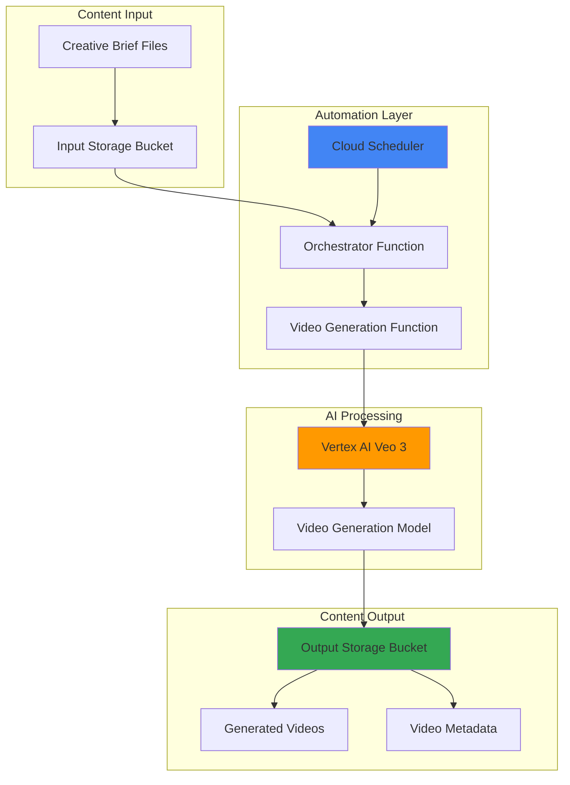

# Automated Video Content Generation using Veo 3 and Storage

## Problem

Content creators and marketing teams need to produce high-quality video content at scale for social media, advertising, and educational purposes, but manual video creation is time-consuming and resource-intensive. Traditional video production workflows require specialized skills, expensive software, and significant time investment for even short-form content. Teams struggle to maintain consistent output while managing creative briefs, production schedules, and content quality standards across multiple projects and platforms.

## Solution

Build an automated video generation system using Google's latest Veo 3 model that processes creative briefs stored in Cloud Storage, generates high-quality 1080p videos with synchronized audio, and organizes the output in a structured content library. The system uses Cloud Scheduler for batch processing, Cloud Functions for orchestration, and Vertex AI's Veo 3 capabilities to transform text prompts into professional video content with minimal human intervention.

## Architecture Diagram



## Prerequisites

1. Google Cloud project with billing enabled and Owner or Editor permissions
2. Google Cloud CLI installed and authenticated (or Cloud Shell access)
3. Basic understanding of Python programming and cloud functions
4. Familiarity with JSON file structures and video production concepts
5. Access to Veo 3 in public preview (available to all users as of 2025)
6. Estimated cost: $15-25 for initial setup and testing (video generation costs $0.75 per second)

> **Note**: Veo 3 is available in public preview on Vertex AI and supports both 720p and 1080p video generation with synchronized audio. Video generation costs $0.75 per second of generated content.

## Preparation

Google Cloud's serverless architecture provides the foundation for automated content generation workflows. Setting up the environment requires enabling key APIs, configuring authentication, and establishing the project structure that will support both manual creative brief uploads and scheduled batch processing.

```bash
# Set environment variables for GCP resources
export PROJECT_ID="video-gen-$(date +%s)"
export REGION="us-central1"
export ZONE="us-central1-a"

# Generate unique suffix for resource names
RANDOM_SUFFIX=$(openssl rand -hex 3)

# Set default project and region
gcloud config set project ${PROJECT_ID}
gcloud config set compute/region ${REGION}
gcloud config set compute/zone ${ZONE}

# Enable required APIs for the video generation workflow
gcloud services enable aiplatform.googleapis.com \
    cloudfunctions.googleapis.com \
    cloudscheduler.googleapis.com \
    storage.googleapis.com \
    cloudbuild.googleapis.com

echo "✅ Project configured: ${PROJECT_ID}"
echo "✅ Required APIs enabled for automated video generation"
```

The API enablement process configures access to Vertex AI for Veo 3 model interactions, Cloud Functions for serverless orchestration, and Cloud Storage for content management. This foundation supports enterprise-scale video generation workflows with automatic scaling and cost optimization.

## Steps

1. **Create Cloud Storage Buckets for Content Pipeline**:

   Cloud Storage provides the foundation for content pipeline management, offering global accessibility and automatic versioning for creative assets. The bucket structure separates input briefs from generated content, enabling clear workflow organization and simplified access controls for different user roles.

   ```bash
   # Create input bucket for creative briefs
   export INPUT_BUCKET="${PROJECT_ID}-video-briefs-${RANDOM_SUFFIX}"
   gsutil mb -p ${PROJECT_ID} \
       -c STANDARD \
       -l ${REGION} \
       gs://${INPUT_BUCKET}
   
   # Create output bucket for generated videos
   export OUTPUT_BUCKET="${PROJECT_ID}-generated-videos-${RANDOM_SUFFIX}"
   gsutil mb -p ${PROJECT_ID} \
       -c STANDARD \
       -l ${REGION} \
       gs://${OUTPUT_BUCKET}
   
   # Enable versioning for content protection
   gsutil versioning set on gs://${INPUT_BUCKET}
   gsutil versioning set on gs://${OUTPUT_BUCKET}
   
   echo "✅ Storage buckets created with versioning enabled"
   ```

   The bucket configuration establishes a robust content management foundation with automatic versioning and regional storage optimization. This setup ensures data durability while maintaining cost efficiency for high-volume video generation workflows.

2. **Create Service Account for Secure API Access**:

   Service accounts provide secure, programmatic access to Google Cloud services without storing credentials in code. The dedicated service account for video generation isolates permissions and enables audit logging for all content creation activities across the automated workflow.

   ```bash
   # Create service account for video generation functions
   export SERVICE_ACCOUNT="video-gen-sa-${RANDOM_SUFFIX}"
   gcloud iam service-accounts create ${SERVICE_ACCOUNT} \
       --display-name="Video Generation Service Account" \
       --description="Service account for automated Veo 3 video generation"
   
   # Grant necessary permissions for Vertex AI and Storage access
   gcloud projects add-iam-policy-binding ${PROJECT_ID} \
       --member="serviceAccount:${SERVICE_ACCOUNT}@${PROJECT_ID}.iam.gserviceaccount.com" \
       --role="roles/aiplatform.user"
   
   gcloud projects add-iam-policy-binding ${PROJECT_ID} \
       --member="serviceAccount:${SERVICE_ACCOUNT}@${PROJECT_ID}.iam.gserviceaccount.com" \
       --role="roles/storage.admin"
   
   echo "✅ Service account created with appropriate permissions"
   ```

   The service account configuration follows Google Cloud security best practices with minimal required permissions, enabling secure access to Vertex AI's Veo 3 capabilities while maintaining strict access controls for content storage operations.

3. **Deploy Video Generation Cloud Function**:

   Cloud Functions provide serverless execution for video generation logic, automatically scaling based on creative brief volume while maintaining cost efficiency through pay-per-use pricing. The function integrates with Vertex AI's Veo 3 model to transform text prompts into high-quality video content.

   ```bash
   # Create function source directory
   mkdir -p video-generation-function
   cd video-generation-function
   
   # Create main function file
   cat > main.py << 'EOF'
import json
import os
import logging
import time
import uuid
from google.cloud import storage
from google import genai
from google.genai import types
import functions_framework

# Initialize Google Gen AI client for Vertex AI
PROJECT_ID = os.environ.get('GCP_PROJECT')
REGION = os.environ.get('FUNCTION_REGION', 'us-central1')

@functions_framework.http
def generate_video(request):
    """Cloud Function to generate videos using Veo 3"""
    try:
        # Initialize client with Vertex AI
        client = genai.Client(vertexai=True, project=PROJECT_ID, location=REGION)
        
        # Parse request data
        request_json = request.get_json(silent=True)
        if not request_json:
            return {'error': 'No JSON data provided'}, 400
        
        prompt = request_json.get('prompt')
        output_bucket = request_json.get('output_bucket')
        resolution = request_json.get('resolution', '1080p')
        
        if not prompt or not output_bucket:
            return {'error': 'Missing required parameters'}, 400
        
        # Generate unique filename and GCS path
        video_id = str(uuid.uuid4())
        filename = f"generated_video_{video_id}.mp4"
        output_gcs_uri = f"gs://{output_bucket}/videos/{filename}"
        
        logging.info(f"Generating video for prompt: {prompt[:100]}...")
        
        # Generate video using Veo 3
        operation = client.models.generate_videos(
            model="veo-3.0-generate-preview",
            prompt=prompt,
            config=types.GenerateVideosConfig(
                aspect_ratio="16:9",
                output_gcs_uri=output_gcs_uri,
                number_of_videos=1,
                duration_seconds=8,
                person_generation="allow_adult",
            ),
        )
        
        # Poll for completion
        max_wait_time = 300  # 5 minutes
        start_time = time.time()
        
        while not operation.done and (time.time() - start_time) < max_wait_time:
            time.sleep(15)
            operation = client.operations.get(operation)
        
        if not operation.done:
            return {'error': 'Video generation timed out'}, 500
        
        if operation.response and operation.result.generated_videos:
            video_uri = operation.result.generated_videos[0].video.uri
            
            # Save metadata
            video_metadata = {
                "video_id": video_id,
                "prompt": prompt,
                "resolution": resolution,
                "video_uri": video_uri,
                "generated_at": time.time(),
                "status": "completed",
                "duration_seconds": 8
            }
            
            storage_client = storage.Client()
            bucket = storage_client.bucket(output_bucket)
            metadata_blob = bucket.blob(f"metadata/{video_id}.json")
            metadata_blob.upload_from_string(
                json.dumps(video_metadata, indent=2),
                content_type='application/json'
            )
            
            logging.info(f"Video generation completed: {filename}")
            
            return {
                'status': 'success',
                'video_id': video_id,
                'filename': filename,
                'video_uri': video_uri,
                'metadata': video_metadata
            }
        else:
            return {'error': 'Video generation failed'}, 500
        
    except Exception as e:
        logging.error(f"Error generating video: {str(e)}")
        return {'error': str(e)}, 500

@functions_framework.http
def process_brief(request):
    """Process creative brief and trigger video generation"""
    try:
        request_json = request.get_json(silent=True)
        brief_file = request_json.get('brief_file')
        input_bucket = request_json.get('input_bucket')
        output_bucket = request_json.get('output_bucket')
        
        # Download and parse creative brief
        storage_client = storage.Client()
        bucket = storage_client.bucket(input_bucket)
        blob = bucket.blob(brief_file)
        brief_content = json.loads(blob.download_as_text())
        
        # Extract video parameters from brief
        prompt = brief_content.get('video_prompt')
        resolution = brief_content.get('resolution', '1080p')
        
        # Create mock request for generate_video function
        video_request = {
            'prompt': prompt,
            'output_bucket': output_bucket,
            'resolution': resolution
        }
        
        # Create mock Flask request object
        class MockRequest:
            def __init__(self, json_data):
                self._json = json_data
            
            def get_json(self, silent=True):
                return self._json
        
        mock_request = MockRequest(video_request)
        result = generate_video(mock_request)
        
        return {
            'status': 'success',
            'brief_processed': brief_file,
            'video_result': result
        }
        
    except Exception as e:
        logging.error(f"Error processing brief: {str(e)}")
        return {'error': str(e)}, 500
EOF
   
   # Create requirements file
   cat > requirements.txt << 'EOF'
google-cloud-storage==2.16.0
google-genai==0.3.0
functions-framework==3.5.0
EOF
   
   # Deploy the Cloud Function
   gcloud functions deploy video-generation \
       --gen2 \
       --runtime python312 \
       --trigger-http \
       --source . \
       --entry-point generate_video \
       --memory 1024MB \
       --timeout 540s \
       --service-account ${SERVICE_ACCOUNT}@${PROJECT_ID}.iam.gserviceaccount.com \
       --set-env-vars GCP_PROJECT=${PROJECT_ID},FUNCTION_REGION=${REGION} \
       --allow-unauthenticated
   
   cd ..
   echo "✅ Video generation function deployed successfully"
   ```

   The Cloud Function deployment creates a scalable endpoint for video generation with optimized memory allocation and timeout settings for AI model processing. The function integrates directly with Vertex AI's Veo 3 model using the latest Google Gen AI SDK while providing comprehensive error handling and logging for production workflows.

4. **Deploy Orchestrator Function for Batch Processing**:

   The orchestrator function coordinates batch processing of multiple creative briefs, managing workflow state and ensuring efficient resource utilization. This component enables scheduled content generation and provides centralized monitoring for large-scale video production pipelines.

   ```bash
   # Create orchestrator function directory
   mkdir -p orchestrator-function
   cd orchestrator-function
   
   # Create orchestrator function
   cat > main.py << 'EOF'
import json
import os
import logging
import time
import requests
from google.cloud import storage
import functions_framework

@functions_framework.http
def orchestrate_video_generation(request):
    """Orchestrate batch video generation from creative briefs"""
    try:
        # Get environment variables
        input_bucket = os.environ.get('INPUT_BUCKET')
        output_bucket = os.environ.get('OUTPUT_BUCKET')
        video_function_url = os.environ.get('VIDEO_FUNCTION_URL')
        
        if not all([input_bucket, output_bucket, video_function_url]):
            return {'error': 'Missing required environment variables'}, 500
        
        # List creative brief files
        storage_client = storage.Client()
        bucket = storage_client.bucket(input_bucket)
        
        briefs = []
        for blob in bucket.list_blobs(prefix='briefs/'):
            if blob.name.endswith('.json'):
                briefs.append(blob.name)
        
        logging.info(f"Found {len(briefs)} creative briefs to process")
        
        # Process each brief
        results = []
        for brief_file in briefs:
            try:
                # Download and parse brief
                blob = bucket.blob(brief_file)
                brief_content = json.loads(blob.download_as_text())
                
                # Prepare generation request
                generation_request = {
                    'prompt': brief_content.get('video_prompt'),
                    'output_bucket': output_bucket,
                    'resolution': brief_content.get('resolution', '1080p'),
                    'brief_id': brief_content.get('id', brief_file)
                }
                
                # Call video generation function
                response = requests.post(
                    video_function_url,
                    json=generation_request,
                    headers={'Content-Type': 'application/json'},
                    timeout=600  # Increase timeout for video generation
                )
                
                if response.status_code == 200:
                    result = response.json()
                    results.append({
                        'brief': brief_file,
                        'status': 'success',
                        'video_id': result.get('video_id'),
                        'filename': result.get('filename'),
                        'video_uri': result.get('video_uri')
                    })
                    logging.info(f"Successfully processed brief: {brief_file}")
                else:
                    logging.error(f"Failed to process brief {brief_file}: {response.text}")
                    results.append({
                        'brief': brief_file,
                        'status': 'failed',
                        'error': response.text
                    })
                
                # Add delay between requests to avoid rate limits
                time.sleep(5)
                
            except Exception as e:
                logging.error(f"Error processing brief {brief_file}: {str(e)}")
                results.append({
                    'brief': brief_file,
                    'status': 'error',
                    'error': str(e)
                })
        
        # Generate summary report
        successful = len([r for r in results if r['status'] == 'success'])
        failed = len(results) - successful
        
        summary = {
            'total_briefs': len(briefs),
            'successful_generations': successful,
            'failed_generations': failed,
            'results': results,
            'processed_at': time.time()
        }
        
        # Save batch processing report
        output_bucket_obj = storage_client.bucket(output_bucket)
        report_blob = output_bucket_obj.blob(f"reports/batch_report_{int(time.time())}.json")
        report_blob.upload_from_string(
            json.dumps(summary, indent=2),
            content_type='application/json'
        )
        
        logging.info(f"Batch processing completed: {successful}/{len(briefs)} successful")
        
        return summary
        
    except Exception as e:
        logging.error(f"Error in orchestration: {str(e)}")
        return {'error': str(e)}, 500
EOF
   
   # Create requirements file
   cat > requirements.txt << 'EOF'
google-cloud-storage==2.16.0
requests==2.31.0
functions-framework==3.5.0
EOF
   
   # Deploy orchestrator function
   gcloud functions deploy video-orchestrator \
       --gen2 \
       --runtime python312 \
       --trigger-http \
       --source . \
       --entry-point orchestrate_video_generation \
       --memory 512MB \
       --timeout 900s \
       --service-account ${SERVICE_ACCOUNT}@${PROJECT_ID}.iam.gserviceaccount.com \
       --set-env-vars INPUT_BUCKET=${INPUT_BUCKET},OUTPUT_BUCKET=${OUTPUT_BUCKET} \
       --allow-unauthenticated
   
   # Get function URL for orchestrator
   export ORCHESTRATOR_URL=$(gcloud functions describe video-orchestrator \
       --region=${REGION} \
       --gen2 \
       --format="value(serviceConfig.uri)")
   
   # Get video generation function URL for orchestrator environment
   export VIDEO_FUNCTION_URL=$(gcloud functions describe video-generation \
       --region=${REGION} \
       --gen2 \
       --format="value(serviceConfig.uri)")
   
   # Update orchestrator with video function URL
   gcloud functions deploy video-orchestrator \
       --gen2 \
       --runtime python312 \
       --trigger-http \
       --source . \
       --entry-point orchestrate_video_generation \
       --memory 512MB \
       --timeout 900s \
       --service-account ${SERVICE_ACCOUNT}@${PROJECT_ID}.iam.gserviceaccount.com \
       --set-env-vars INPUT_BUCKET=${INPUT_BUCKET},OUTPUT_BUCKET=${OUTPUT_BUCKET},VIDEO_FUNCTION_URL=${VIDEO_FUNCTION_URL} \
       --allow-unauthenticated
   
   cd ..
   echo "✅ Orchestrator function deployed successfully"
   ```

   The orchestrator function provides intelligent batch processing capabilities with error handling, rate limiting, and comprehensive reporting. This design ensures reliable processing of high-volume content requests while maintaining system stability and cost efficiency.

5. **Configure Automated Scheduling with Cloud Scheduler**:

   Cloud Scheduler enables fully automated content generation workflows by triggering batch processing at predetermined intervals. This serverless approach ensures consistent content output while optimizing resource usage and providing flexibility for different content production schedules.

   ```bash
   # Create scheduled job for automated video generation
   gcloud scheduler jobs create http automated-video-generation \
       --location=${REGION} \
       --schedule="0 9 * * MON,WED,FRI" \
       --uri=${ORCHESTRATOR_URL} \
       --http-method=POST \
       --headers="Content-Type=application/json" \
       --message-body='{"trigger":"scheduled","batch_size":10}' \
       --time-zone="America/New_York"
   
   echo "✅ Automated scheduling configured for Monday, Wednesday, Friday at 9 AM"
   
   # Create on-demand job for immediate processing
   gcloud scheduler jobs create http on-demand-video-generation \
       --location=${REGION} \
       --schedule="0 0 31 2 *" \
       --uri=${ORCHESTRATOR_URL} \
       --http-method=POST \
       --headers="Content-Type=application/json" \
       --message-body='{"trigger":"manual","batch_size":5}' \
       --time-zone="America/New_York"
   
   echo "✅ On-demand processing job created (never runs automatically)"
   ```

   The scheduling configuration establishes both automated and manual processing capabilities, providing flexibility for different content production requirements while maintaining predictable resource usage patterns and cost management.

6. **Create Sample Creative Brief Templates**:

   Standardized creative brief templates ensure consistent input formatting and enable automated parameter extraction for video generation. These templates guide content creators while providing the structured data needed for reliable AI model processing and content organization.

   ```bash
   # Create sample creative brief for testing
   cat > sample_brief.json << 'EOF'
{
  "id": "brief_001",
  "title": "Product Launch Video",
  "video_prompt": "A sleek modern smartphone floating in a minimalist white environment with soft lighting, slowly rotating to show all angles, with subtle particle effects and elegant typography appearing to highlight key features",
  "resolution": "1080p",
  "duration": "8s",
  "style": "modern, clean, professional",
  "target_audience": "tech enthusiasts",
  "brand_guidelines": {
    "colors": ["#1a73e8", "#ffffff", "#f8f9fa"],
    "tone": "innovative, premium"
  },
  "created_at": "2025-07-12T10:00:00Z",
  "created_by": "marketing_team"
}
EOF
   
   # Upload sample brief to input bucket
   gsutil cp sample_brief.json gs://${INPUT_BUCKET}/briefs/
   
   # Create additional sample briefs for batch testing
   cat > lifestyle_brief.json << 'EOF'
{
  "id": "brief_002",
  "title": "Lifestyle Brand Video",
  "video_prompt": "A serene morning scene with golden sunlight streaming through a window, a steaming coffee cup on a wooden table, plants in the background, creating a warm and inviting atmosphere for wellness and mindfulness",
  "resolution": "1080p",
  "duration": "8s",
  "style": "warm, natural, lifestyle",
  "target_audience": "wellness enthusiasts",
  "brand_guidelines": {
    "colors": ["#8bc34a", "#ff9800", "#795548"],
    "tone": "calming, authentic"
  },
  "created_at": "2025-07-12T10:15:00Z",
  "created_by": "content_team"
}
EOF
   
   gsutil cp lifestyle_brief.json gs://${INPUT_BUCKET}/briefs/
   
   echo "✅ Sample creative briefs uploaded successfully"
   echo "📁 Briefs available in: gs://${INPUT_BUCKET}/briefs/"
   ```

   The creative brief templates establish a standardized format that supports both manual content creation and automated processing workflows, ensuring consistent quality and enabling efficient scaling of video production operations.

7. **Configure Monitoring and Alerting**:

   Comprehensive monitoring ensures reliable operation of the automated video generation pipeline by tracking function performance, storage usage, and generation success rates. The monitoring setup provides operational visibility and proactive alerting for production environments.

   ```bash
   # Create notification channel for alerts (email)
   export NOTIFICATION_EMAIL="admin@yourdomain.com"
   
   # Create alert policy for function failures
   cat > alert_policy.yaml << 'EOF'
displayName: "Video Generation Function Failures"
conditions:
  - displayName: "Cloud Function error rate"
    conditionThreshold:
      filter: 'resource.type="cloud_function" AND metric.type="cloudfunctions.googleapis.com/function/execution_count" AND metric.label.status!="ok"'
      comparison: COMPARISON_GREATER_THAN
      thresholdValue: 5
      duration: 300s
alertStrategy:
  autoClose: 1800s
documentation:
  content: "Video generation functions are experiencing high error rates"
EOF
   
   gcloud alpha monitoring policies create --policy-from-file=alert_policy.yaml
   
   echo "✅ Monitoring and alerting configured"
   echo "📊 Function logs available in Cloud Logging"
   ```

   The monitoring configuration provides comprehensive observability for production video generation workflows, enabling proactive issue detection and performance optimization while maintaining service reliability and user experience.

## Validation & Testing

1. **Verify Storage Bucket Configuration**:

   ```bash
   # Check bucket creation and permissions
   gsutil ls -L gs://${INPUT_BUCKET}
   gsutil ls -L gs://${OUTPUT_BUCKET}
   
   # Verify versioning is enabled
   gsutil versioning get gs://${INPUT_BUCKET}
   gsutil versioning get gs://${OUTPUT_BUCKET}
   ```

   Expected output: Bucket details showing STANDARD storage class, regional location, and versioning enabled.

2. **Test Function Deployment Status**:

   ```bash
   # Check function deployment status
   gcloud functions list --regions=${REGION} --gen2
   
   # Test function connectivity
   curl -X POST "${ORCHESTRATOR_URL}" \
       -H "Content-Type: application/json" \
       -d '{"test": true}'
   ```

   Expected output: Functions listed as ACTIVE status and successful HTTP response from test call.

3. **Validate Scheduler Configuration**:

   ```bash
   # List scheduled jobs
   gcloud scheduler jobs list --location=${REGION}
   
   # Test manual job execution
   gcloud scheduler jobs run on-demand-video-generation \
       --location=${REGION}
   
   # Check job execution history
   gcloud scheduler jobs describe automated-video-generation \
       --location=${REGION}
   ```

   Expected output: Jobs listed with ENABLED status and successful test execution.

4. **Test End-to-End Video Generation**:

   ```bash
   # Trigger manual video generation
   export GENERATION_URL=$(gcloud functions describe video-generation \
       --region=${REGION} \
       --gen2 \
       --format="value(serviceConfig.uri)")
   
   curl -X POST "${GENERATION_URL}" \
       -H "Content-Type: application/json" \
       -d '{
         "prompt": "A peaceful lake at sunset with mountains in the background",
         "output_bucket": "'${OUTPUT_BUCKET}'",
         "resolution": "1080p"
       }'
   
   # Check generated content (wait a few minutes for processing)
   sleep 300
   gsutil ls gs://${OUTPUT_BUCKET}/videos/
   gsutil ls gs://${OUTPUT_BUCKET}/metadata/
   ```

   Expected output: Successful API response with video_id and generated files in output bucket after processing time.

## Cleanup

1. **Remove Scheduled Jobs**:

   ```bash
   # Delete scheduler jobs
   gcloud scheduler jobs delete automated-video-generation \
       --location=${REGION} \
       --quiet
   
   gcloud scheduler jobs delete on-demand-video-generation \
       --location=${REGION} \
       --quiet
   
   echo "✅ Scheduled jobs removed"
   ```

2. **Delete Cloud Functions**:

   ```bash
   # Remove deployed functions
   gcloud functions delete video-generation \
       --region=${REGION} \
       --gen2 \
       --quiet
   
   gcloud functions delete video-orchestrator \
       --region=${REGION} \
       --gen2 \
       --quiet
   
   echo "✅ Cloud Functions deleted"
   ```

3. **Remove Storage Buckets and Contents**:

   ```bash
   # Delete all bucket contents and buckets
   gsutil -m rm -r gs://${INPUT_BUCKET}
   gsutil -m rm -r gs://${OUTPUT_BUCKET}
   
   echo "✅ Storage buckets and contents removed"
   ```

4. **Clean Up Service Account and IAM**:

   ```bash
   # Remove IAM bindings
   gcloud projects remove-iam-policy-binding ${PROJECT_ID} \
       --member="serviceAccount:${SERVICE_ACCOUNT}@${PROJECT_ID}.iam.gserviceaccount.com" \
       --role="roles/aiplatform.user"
   
   gcloud projects remove-iam-policy-binding ${PROJECT_ID} \
       --member="serviceAccount:${SERVICE_ACCOUNT}@${PROJECT_ID}.iam.gserviceaccount.com" \
       --role="roles/storage.admin"
   
   # Delete service account
   gcloud iam service-accounts delete \
       ${SERVICE_ACCOUNT}@${PROJECT_ID}.iam.gserviceaccount.com \
       --quiet
   
   echo "✅ Service account and permissions cleaned up"
   ```

5. **Remove Local Files**:

   ```bash
   # Clean up local development files
   rm -rf video-generation-function orchestrator-function
   rm -f sample_brief.json lifestyle_brief.json alert_policy.yaml
   
   echo "✅ Local files cleaned up successfully"
   echo "Note: Project deletion may take several minutes to complete"
   ```

## Discussion

This automated video generation system demonstrates the power of combining Google Cloud's serverless architecture with cutting-edge AI capabilities. The solution leverages Veo 3's advanced video generation features, which represent a significant advancement in AI-powered content creation. Unlike traditional video production workflows that require specialized skills and expensive software, this system enables content creators to generate professional-quality videos through simple text prompts and structured creative briefs.

The architecture follows Google Cloud's recommended patterns for AI workflows, utilizing Cloud Functions for serverless orchestration, Cloud Storage for scalable content management, and Cloud Scheduler for reliable automation. This approach provides several key advantages: automatic scaling based on demand, pay-per-use pricing that optimizes costs, and integration with Google Cloud's enterprise security and compliance features. The system can handle anything from single video requests to large-scale batch processing, making it suitable for both small content teams and enterprise marketing organizations.

Veo 3's capabilities extend beyond simple text-to-video generation, incorporating synchronized audio generation, multiple resolution options (720p and 1080p), and support for image-to-video workflows. The model's ability to understand complex prompts and generate realistic physics simulations makes it particularly valuable for product demonstrations, educational content, and marketing materials. The 8-second duration limit, while currently restrictive, aligns well with social media content requirements and can be extended through video stitching techniques for longer-form content. All generated videos include SynthID watermarking for responsible AI usage.

The monitoring and error handling components ensure production reliability by tracking generation success rates, function performance metrics, and storage usage patterns. This operational visibility enables teams to optimize prompts for better results, manage costs effectively, and maintain service quality standards. The system's modular design also facilitates future enhancements, such as integration with content management systems, automated quality assessment workflows, or custom post-processing pipelines.

> **Tip**: Optimize video generation costs by batching requests during off-peak hours and using the 720p resolution option for draft content before generating final 1080p versions. Consider implementing prompt optimization techniques to improve generation success rates.

For comprehensive implementation guidance, refer to the [Vertex AI Veo 3 documentation](https://cloud.google.com/vertex-ai/generative-ai/docs/models/veo/3-0-generate-preview), [Cloud Functions best practices](https://cloud.google.com/functions/docs/bestpractices), [Cloud Storage lifecycle management](https://cloud.google.com/storage/docs/lifecycle), [Cloud Scheduler configuration guide](https://cloud.google.com/scheduler/docs), and [Google Cloud security best practices](https://cloud.google.com/security/best-practices).

## Challenge

Extend this automated video generation system with these advanced capabilities:

1. **Multi-Style Video Variants**: Implement automatic generation of multiple video styles (corporate, casual, artistic) from a single creative brief using different prompt engineering techniques and post-processing filters with Cloud Vision API integration.

2. **Content Quality Assessment**: Build an automated quality scoring system using Cloud Vision API to analyze generated videos for composition, lighting, and brand consistency before approval workflows, including SynthID watermark verification.

3. **Interactive Content Personalization**: Create a system that generates personalized video content based on user preferences, demographics, or behavior data stored in BigQuery, with real-time personalization triggers using Pub/Sub.

4. **Advanced Workflow Orchestration**: Implement a complex multi-stage workflow using Cloud Workflows that includes brief validation, A/B testing of different prompts, automatic thumbnail generation with Imagen 3, and content distribution to multiple platforms.

5. **Enterprise Integration Hub**: Develop connectors for popular content management systems (WordPress, Drupal), marketing automation platforms (HubSpot, Marketo), and social media scheduling tools with automated publishing workflows and performance tracking using Google Analytics.

## Infrastructure Code

### Available Infrastructure as Code:

- [Infrastructure Code Overview](code/README.md) - Detailed description of all infrastructure components
- [Infrastructure Manager](code/infrastructure-manager/) - GCP Infrastructure Manager templates
- [Bash CLI Scripts](code/scripts/) - Example bash scripts using gcloud CLI commands to deploy infrastructure
- [Terraform](code/terraform/) - Terraform configuration files