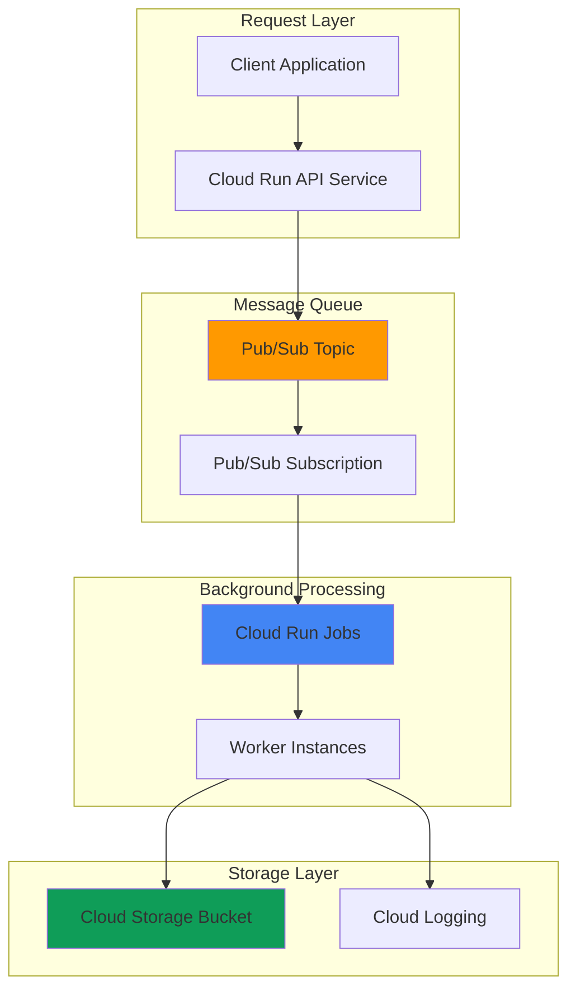

# Background Task Processing with Cloud Run Worker Pools

## Problem

Modern applications frequently need to handle time-consuming background tasks like file processing, data transformation, and batch operations without blocking user-facing requests. Traditional approaches often require managing dedicated worker infrastructure, leading to resource waste during low traffic periods and potential bottlenecks during peak loads. Organizations struggle with efficiently scaling background processing while maintaining cost optimization and reliable task execution.

## Solution

Build a scalable background task processing system using Cloud Run Jobs triggered by Pub/Sub messages, with Cloud Storage for file processing. This serverless approach automatically scales workers based on demand, provides built-in retry mechanisms, and eliminates infrastructure management while ensuring cost-effective processing through pay-per-use pricing and automatic scaling to zero when idle.

## Architecture Diagram



## Prerequisites

1. Google Cloud account with Pub/Sub, Cloud Run, and Cloud Storage APIs enabled
2. Google Cloud CLI installed and configured (or Cloud Shell)
3. Basic understanding of containerized applications and message queues
4. Familiarity with Python programming for the worker implementation
5. Estimated cost: $0.10-$0.50 for testing (pay-per-use serverless pricing)

> **Note**: Cloud Run Jobs provide automatic scaling and cost optimization for background processing workloads, charging only for actual execution time.

## Preparation

```bash
# Set environment variables for GCP resources
export PROJECT_ID="background-tasks-$(date +%s)"
export REGION="us-central1"
export ZONE="us-central1-a"

# Generate unique suffix for resource names
RANDOM_SUFFIX=$(openssl rand -hex 3)

# Set default project and region
gcloud config set project ${PROJECT_ID}
gcloud config set compute/region ${REGION}
gcloud config set compute/zone ${ZONE}

# Enable required APIs
gcloud services enable run.googleapis.com
gcloud services enable pubsub.googleapis.com
gcloud services enable storage.googleapis.com
gcloud services enable cloudbuild.googleapis.com

echo "✅ Project configured: ${PROJECT_ID}"

# Create foundational resources
export TOPIC_NAME="task-queue-${RANDOM_SUFFIX}"
export SUBSCRIPTION_NAME="worker-sub-${RANDOM_SUFFIX}"
export BUCKET_NAME="task-files-${PROJECT_ID}-${RANDOM_SUFFIX}"
export JOB_NAME="background-worker-${RANDOM_SUFFIX}"

# Create Pub/Sub topic for task coordination
gcloud pubsub topics create ${TOPIC_NAME}

# Create Cloud Storage bucket for file processing
gsutil mb -p ${PROJECT_ID} \
    -c STANDARD \
    -l ${REGION} \
    gs://${BUCKET_NAME}

echo "✅ Foundational resources created"
```

## Steps

1. **Create Worker Application Code**:

   Cloud Run Jobs provide serverless execution for background tasks with automatic scaling and built-in retry mechanisms. The worker application processes Pub/Sub messages and performs file operations, demonstrating a typical background processing pattern that can handle various workloads from simple data processing to complex file transformations.

   ```bash
   # Create application directory and files
   mkdir -p background-worker
   cd background-worker
   
   # Create main worker application
   cat > main.py << 'EOF'
import os
import json
import time
import logging
from google.cloud import storage, pubsub_v1
from concurrent.futures import ThreadPoolExecutor
import signal
import sys

# Configure logging
logging.basicConfig(level=logging.INFO)
logger = logging.getLogger(__name__)

class BackgroundWorker:
    def __init__(self):
        self.project_id = os.environ.get('GOOGLE_CLOUD_PROJECT')
        self.subscription_name = os.environ.get('SUBSCRIPTION_NAME')
        self.bucket_name = os.environ.get('BUCKET_NAME')
        self.max_messages = int(os.environ.get('MAX_MESSAGES', '10'))
        
        self.subscriber = pubsub_v1.SubscriberClient()
        self.storage_client = storage.Client()
        
        self.subscription_path = self.subscriber.subscription_path(
            self.project_id, self.subscription_name)
        
        self.running = True
        signal.signal(signal.SIGTERM, self.shutdown)
        signal.signal(signal.SIGINT, self.shutdown)
    
    def shutdown(self, signum, frame):
        logger.info("Received shutdown signal")
        self.running = False
    
    def process_message(self, message):
        """Process individual Pub/Sub message"""
        try:
            # Parse message data
            data = json.loads(message.data.decode('utf-8'))
            task_type = data.get('task_type', 'unknown')
            
            logger.info(f"Processing task: {task_type}")
            
            if task_type == 'file_processing':
                self.process_file_task(data)
            elif task_type == 'data_transformation':
                self.process_data_task(data)
            else:
                logger.warning(f"Unknown task type: {task_type}")
            
            # Acknowledge message after successful processing
            message.ack()
            logger.info(f"Task {task_type} completed successfully")
            
        except Exception as e:
            logger.error(f"Error processing message: {e}")
            message.nack()
    
    def process_file_task(self, data):
        """Simulate file processing task"""
        filename = data.get('filename', 'default.txt')
        processing_time = data.get('processing_time', 2)
        
        # Create sample processed file
        bucket = self.storage_client.bucket(self.bucket_name)
        blob = bucket.blob(f"processed/{filename}")
        
        # Simulate processing work
        time.sleep(processing_time)
        
        processed_content = f"Processed at {time.strftime('%Y-%m-%d %H:%M:%S')}\n"
        processed_content += f"Original file: {filename}\n"
        processed_content += f"Processing time: {processing_time}s\n"
        
        blob.upload_from_string(processed_content)
        logger.info(f"File {filename} processed and saved")
    
    def process_data_task(self, data):
        """Simulate data transformation task"""
        dataset_size = data.get('dataset_size', 100)
        transformation_type = data.get('transformation', 'normalize')
        
        # Simulate data processing
        time.sleep(1)
        
        result = {
            'transformation': transformation_type,
            'records_processed': dataset_size,
            'timestamp': time.strftime('%Y-%m-%d %H:%M:%S')
        }
        
        # Save result to Cloud Storage
        bucket = self.storage_client.bucket(self.bucket_name)
        blob = bucket.blob(f"results/data_transform_{int(time.time())}.json")
        blob.upload_from_string(json.dumps(result, indent=2))
        
        logger.info(f"Data transformation completed: {transformation_type}")
    
    def run(self):
        """Main worker loop"""
        logger.info("Starting background worker")
        
        with ThreadPoolExecutor(max_workers=4) as executor:
            while self.running:
                try:
                    # Pull messages from subscription using modern API pattern
                    response = self.subscriber.pull(
                        request={
                            "subscription": self.subscription_path,
                            "max_messages": self.max_messages,
                        },
                        timeout=30.0
                    )
                    
                    if response.received_messages:
                        logger.info(f"Received {len(response.received_messages)} messages")
                        
                        # Process messages concurrently
                        futures = []
                        for message in response.received_messages:
                            future = executor.submit(self.process_message, message)
                            futures.append(future)
                        
                        # Wait for all tasks to complete
                        for future in futures:
                            future.result()
                    
                    else:
                        logger.info("No messages received, waiting...")
                        time.sleep(5)
                        
                except Exception as e:
                    logger.error(f"Error in worker loop: {e}")
                    time.sleep(10)
        
        logger.info("Background worker shutdown complete")

if __name__ == "__main__":
    worker = BackgroundWorker()
    worker.run()
EOF
   
   echo "✅ Worker application created"
   ```

2. **Create Container Configuration**:

   Cloud Run Jobs require containerized applications with proper dependency management and configuration. The Dockerfile and requirements define the runtime environment, while the container configuration ensures optimal resource allocation and scaling behavior for background processing workloads.

   ```bash
   # Create requirements file with current library versions
   cat > requirements.txt << 'EOF'
google-cloud-pubsub==2.23.1
google-cloud-storage==2.17.0
google-cloud-logging==3.11.0
EOF
   
   # Create Dockerfile optimized for Cloud Run Jobs
   cat > Dockerfile << 'EOF'
FROM python:3.11-slim

# Set working directory
WORKDIR /app

# Install Python dependencies
COPY requirements.txt .
RUN pip install --no-cache-dir -r requirements.txt

# Copy application code
COPY main.py .

# Set environment variables for optimal container execution
ENV PYTHONUNBUFFERED=1

# Run the worker
CMD ["python", "main.py"]
EOF
   
   echo "✅ Container configuration created"
   ```

3. **Build and Deploy Worker Container**:

   Google Cloud Build provides seamless container image building and deployment to Artifact Registry. The containerized worker can then be deployed as a Cloud Run Job, enabling automatic scaling based on Pub/Sub message volume while maintaining cost efficiency through serverless execution.

   ```bash
   # Build container image using Cloud Build
   gcloud builds submit \
       --tag ${REGION}-docker.pkg.dev/${PROJECT_ID}/cloud-run-source-deploy/${JOB_NAME}
   
   echo "✅ Container image built and pushed"
   ```

4. **Create Pub/Sub Subscription for Job Triggering**:

   Pub/Sub subscriptions provide reliable message delivery with configurable retry policies and dead letter queues. The subscription configuration ensures that background tasks are processed reliably even during worker failures, with automatic message redelivery and exponential backoff for failed processing attempts.

   ```bash
   # Create subscription with appropriate settings for background processing
   gcloud pubsub subscriptions create ${SUBSCRIPTION_NAME} \
       --topic=${TOPIC_NAME} \
       --ack-deadline=600 \
       --message-retention-duration=7d \
       --max-delivery-attempts=5
   
   echo "✅ Pub/Sub subscription created with retry configuration"
   ```

5. **Deploy Cloud Run Job**:

   Cloud Run Jobs provide serverless execution for batch and background processing workloads. The job configuration defines resource limits, environment variables, and scaling parameters that optimize performance and cost for background task processing while ensuring reliable execution.

   ```bash
   # Deploy Cloud Run Job with optimized configuration
   gcloud run jobs create ${JOB_NAME} \
       --image=${REGION}-docker.pkg.dev/${PROJECT_ID}/cloud-run-source-deploy/${JOB_NAME} \
       --region=${REGION} \
       --set-env-vars="SUBSCRIPTION_NAME=${SUBSCRIPTION_NAME},BUCKET_NAME=${BUCKET_NAME}" \
       --memory=1Gi \
       --cpu=1 \
       --max-retries=3 \
       --parallelism=1 \
       --task-count=1
   
   echo "✅ Cloud Run Job deployed successfully"
   ```

6. **Create Task Submission API Service**:

   A Cloud Run service provides an HTTP API for submitting background tasks to the Pub/Sub queue. This decouples task submission from processing, enabling scalable task ingestion while the background workers handle processing asynchronously with automatic scaling based on queue depth.

   ```bash
   # Create API service directory
   cd ..
   mkdir -p task-api
   cd task-api
   
   # Create API service code with modern Flask patterns
   cat > app.py << 'EOF'
import os
import json
import time
from flask import Flask, request, jsonify
from google.cloud import pubsub_v1
import uuid
import logging

app = Flask(__name__)
logging.basicConfig(level=logging.INFO)

# Initialize Pub/Sub client using modern patterns
publisher = pubsub_v1.PublisherClient()
project_id = os.environ.get('GOOGLE_CLOUD_PROJECT')
topic_name = os.environ.get('TOPIC_NAME')
topic_path = publisher.topic_path(project_id, topic_name)

@app.route('/health', methods=['GET'])
def health_check():
    return jsonify({'status': 'healthy'}), 200

@app.route('/submit-task', methods=['POST'])
def submit_task():
    try:
        data = request.get_json()
        
        # Validate required fields
        if not data or 'task_type' not in data:
            return jsonify({'error': 'task_type is required'}), 400
        
        # Add task metadata with current timestamp
        task_data = {
            'task_id': str(uuid.uuid4()),
            'task_type': data['task_type'],
            'submitted_at': str(int(time.time())),
            **data
        }
        
        # Publish message to Pub/Sub using request format
        message_data = json.dumps(task_data).encode('utf-8')
        future = publisher.publish(topic_path, message_data)
        message_id = future.result()
        
        logging.info(f"Task submitted: {task_data['task_id']}")
        
        return jsonify({
            'task_id': task_data['task_id'],
            'message_id': message_id,
            'status': 'submitted'
        }), 200
        
    except Exception as e:
        logging.error(f"Error submitting task: {e}")
        return jsonify({'error': str(e)}), 500

@app.route('/submit-file-task', methods=['POST'])
def submit_file_task():
    data = {
        'task_type': 'file_processing',
        'filename': request.json.get('filename', 'sample.txt'),
        'processing_time': request.json.get('processing_time', 2)
    }
    return submit_task_internal(data)

@app.route('/submit-data-task', methods=['POST'])
def submit_data_task():
    data = {
        'task_type': 'data_transformation',
        'dataset_size': request.json.get('dataset_size', 100),
        'transformation': request.json.get('transformation', 'normalize')
    }
    return submit_task_internal(data)

def submit_task_internal(data):
    request._cached_json = data
    return submit_task()

if __name__ == '__main__':
    port = int(os.environ.get('PORT', 8080))
    app.run(host='0.0.0.0', port=port)
EOF
   
   # Create API requirements with current Flask version
   cat > requirements.txt << 'EOF'
Flask==3.0.3
google-cloud-pubsub==2.23.1
gunicorn==22.0.0
EOF
   
   # Create optimized API Dockerfile
   cat > Dockerfile << 'EOF'
FROM python:3.11-slim

WORKDIR /app

COPY requirements.txt .
RUN pip install --no-cache-dir -r requirements.txt

COPY app.py .

ENV PORT=8080
EXPOSE 8080

CMD ["gunicorn", "--bind", "0.0.0.0:8080", "--workers", "2", "--timeout", "0", "app:app"]
EOF
   
   echo "✅ Task submission API created"
   ```

7. **Deploy API Service**:

   The Cloud Run API service provides scalable HTTP endpoints for task submission while automatically scaling based on request volume. This serverless approach ensures cost efficiency and high availability for task ingestion, with built-in load balancing and automatic scaling to handle varying request patterns.

   ```bash
   # Build and deploy API service using source-based deployment
   gcloud run deploy task-api \
       --source . \
       --region=${REGION} \
       --set-env-vars="TOPIC_NAME=${TOPIC_NAME}" \
       --allow-unauthenticated \
       --memory=512Mi \
       --cpu=1 \
       --min-instances=0 \
       --max-instances=10
   
   # Get API service URL for testing
   export API_URL=$(gcloud run services describe task-api \
       --region=${REGION} \
       --format='value(status.url)')
   
   echo "✅ API service deployed at: ${API_URL}"
   ```

8. **Execute Background Job with Manual Trigger**:

   Cloud Run Jobs can be executed manually for testing and on-demand processing. The job execution demonstrates the complete background processing workflow, from message consumption through task processing to result storage, validating the entire system integration.

   ```bash
   # Execute the background job manually for testing
   gcloud run jobs execute ${JOB_NAME} \
       --region=${REGION} \
       --wait
   
   echo "✅ Background job executed successfully"
   ```

## Validation & Testing

1. **Test Task Submission API**:

   ```bash
   # Test file processing task submission
   curl -X POST "${API_URL}/submit-file-task" \
       -H "Content-Type: application/json" \
       -d '{
           "filename": "test-document.pdf",
           "processing_time": 3
       }'
   ```

   Expected output: JSON response with task_id and message_id showing successful submission.

2. **Submit Data Processing Task**:

   ```bash
   # Test data transformation task
   curl -X POST "${API_URL}/submit-data-task" \
       -H "Content-Type: application/json" \
       -d '{
           "dataset_size": 500,
           "transformation": "aggregation"
       }'
   ```

   Expected output: Task submission confirmation with unique identifiers.

3. **Verify Message Processing**:

   ```bash
   # Check Pub/Sub subscription for message delivery
   gcloud pubsub subscriptions pull ${SUBSCRIPTION_NAME} \
       --auto-ack \
       --limit=5
   
   # Trigger job execution to process queued messages
   gcloud run jobs execute ${JOB_NAME} \
       --region=${REGION} \
       --wait
   ```

4. **Validate Processed Results**:

   ```bash
   # Check Cloud Storage for processed files
   gsutil ls -r gs://${BUCKET_NAME}/
   
   # View processed file content
   gsutil cat gs://${BUCKET_NAME}/processed/test-document.pdf
   ```

   Expected output: Directory listing showing processed files and transformation results.

## Cleanup

1. **Remove Cloud Run Services and Jobs**:

   ```bash
   # Delete Cloud Run Job
   gcloud run jobs delete ${JOB_NAME} \
       --region=${REGION} \
       --quiet
   
   # Delete API service
   gcloud run services delete task-api \
       --region=${REGION} \
       --quiet
   
   echo "✅ Cloud Run resources deleted"
   ```

2. **Remove Pub/Sub Resources**:

   ```bash
   # Delete subscription
   gcloud pubsub subscriptions delete ${SUBSCRIPTION_NAME}
   
   # Delete topic
   gcloud pubsub topics delete ${TOPIC_NAME}
   
   echo "✅ Pub/Sub resources deleted"
   ```

3. **Remove Cloud Storage Resources**:

   ```bash
   # Remove storage bucket and contents
   gsutil -m rm -r gs://${BUCKET_NAME}
   
   echo "✅ Storage resources deleted"
   ```

4. **Clean Environment Variables**:

   ```bash
   # Clear environment variables
   unset PROJECT_ID REGION TOPIC_NAME SUBSCRIPTION_NAME
   unset BUCKET_NAME JOB_NAME API_URL RANDOM_SUFFIX
   
   echo "✅ Environment variables cleared"
   ```

## Discussion

This background task processing system demonstrates the power of Google Cloud's serverless offerings for handling asynchronous workloads. Cloud Run Jobs provide an ideal solution for background processing by offering automatic scaling, built-in retry mechanisms, and pay-per-use pricing that eliminates the need for persistent worker infrastructure.

The architecture separates concerns effectively: the Cloud Run API service handles task ingestion and queuing, Pub/Sub provides reliable message delivery with durability guarantees, and Cloud Run Jobs execute the actual processing work. This decoupling enables each component to scale independently based on demand, ensuring optimal resource utilization and cost efficiency.

Pub/Sub's message durability and retry mechanisms ensure that tasks are not lost during system failures, while Cloud Run Jobs' automatic scaling means worker capacity adjusts dynamically to queue depth. The combination provides enterprise-grade reliability for background processing workloads while maintaining the simplicity and cost benefits of serverless computing. The use of modern Pub/Sub client patterns with request-based API calls ensures compatibility with the latest Google Cloud client libraries.

The system supports various task types through a flexible message format, enabling everything from simple file processing to complex data transformations. Cloud Storage integration provides persistent storage for both input files and processing results, creating a complete background processing pipeline suitable for production workloads.

> **Tip**: Use Cloud Monitoring to track Pub/Sub message backlog and Cloud Run Job execution metrics to optimize scaling parameters and detect processing bottlenecks.

For more information, see the [Cloud Run Jobs documentation](https://cloud.google.com/run/docs/create-jobs), [Pub/Sub best practices](https://cloud.google.com/pubsub/docs/best-practices), [Cloud Storage integration patterns](https://cloud.google.com/storage/docs/cloud-console), and [Google Cloud serverless architecture guides](https://cloud.google.com/architecture/serverless-overview).

## Challenge

Extend this solution by implementing these enhancements:

1. **Add Dead Letter Queue Processing**: Implement a separate Cloud Run Job to handle failed messages from the dead letter queue, with custom retry logic and manual intervention capabilities.

2. **Implement Job Scheduling**: Use Cloud Scheduler to trigger periodic batch processing jobs, combining scheduled execution with on-demand message processing for hybrid workload patterns.

3. **Add Monitoring and Alerting**: Integrate Cloud Monitoring dashboards and alerting policies to track processing metrics, queue depths, and job success rates with automated notification to operations teams.

4. **Scale with Workload Identity**: Configure Workload Identity Federation to enable secure, keyless authentication between Cloud Run Jobs and other Google Cloud services, following security best practices.

5. **Implement Priority Queuing**: Create multiple Pub/Sub topics with different priority levels and corresponding Cloud Run Jobs with different resource allocations to handle urgent vs. batch processing tasks.

## Infrastructure Code

*Infrastructure code will be generated after recipe approval.*