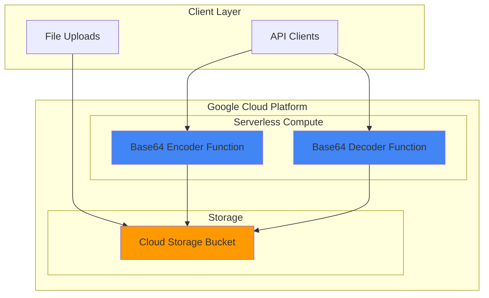

# Base64 Encoder Decoder with Cloud Functions

## Problem

Development teams frequently need to encode and decode Base64 data for API integrations, data transmission, and file processing workflows. Manually handling these operations or setting up dedicated servers for simple transformations creates unnecessary complexity and infrastructure overhead. Teams require a lightweight, scalable solution that can handle both text and file-based encoding operations while minimizing operational burden.

## Solution

Deploy serverless HTTP Cloud Functions to provide Base64 encoding and decoding APIs with integrated Cloud Storage support for file uploads. This approach eliminates infrastructure management while providing automatic scaling, built-in security, and pay-per-use pricing. The solution supports both direct text transformation and file-based operations through a unified API interface.

## Architecture Diagram



## Prerequisites

1. Google Cloud Project with billing enabled and appropriate permissions for Cloud Functions and Cloud Storage
2. Google Cloud CLI (gcloud) installed and authenticated to your project
3. Basic understanding of HTTP APIs and Base64 encoding concepts
4. Python 3.8+ knowledge for function development (functions will use Python runtime)
5. Estimated cost: $0.01-$0.50 for initial testing (free tier typically covers development usage)

> **Note**: This recipe uses Google Cloud's serverless services that automatically scale to zero when not in use, minimizing costs for development and testing scenarios.

## Preparation

```bash
# Set environment variables for GCP resources
export PROJECT_ID="base64-demo-$(date +%s)"
export REGION="us-central1"
export ZONE="us-central1-a"

# Generate unique suffix for resource names
RANDOM_SUFFIX=$(openssl rand -hex 3)
export BUCKET_NAME="base64-files-${RANDOM_SUFFIX}"
export ENCODER_FUNCTION="base64-encoder"
export DECODER_FUNCTION="base64-decoder"

# Set default project and region
gcloud config set project ${PROJECT_ID}
gcloud config set compute/region ${REGION}
gcloud config set functions/region ${REGION}

# Enable required APIs
gcloud services enable cloudfunctions.googleapis.com
gcloud services enable cloudbuild.googleapis.com
gcloud services enable storage.googleapis.com

echo "✅ Project configured: ${PROJECT_ID}"
echo "✅ Storage bucket name: ${BUCKET_NAME}"
```

## Steps

1. **Create Cloud Storage Bucket for File Operations**:

   Cloud Storage provides the foundation for handling file uploads and downloads in our Base64 processing workflow. Creating a bucket with appropriate location and access controls ensures secure, high-performance file operations that integrate seamlessly with Cloud Functions.

   ```bash
   # Create Cloud Storage bucket for file processing
   gsutil mb -p ${PROJECT_ID} \
       -c STANDARD \
       -l ${REGION} \
       gs://${BUCKET_NAME}
   
   # Set bucket permissions for function access
   gsutil iam ch serviceAccount:${PROJECT_ID}@appspot.gserviceaccount.com:objectAdmin \
       gs://${BUCKET_NAME}
   
   echo "✅ Cloud Storage bucket created: gs://${BUCKET_NAME}"
   ```

   The storage bucket now provides secure file handling capabilities with proper service account permissions, enabling our Cloud Functions to read and write files during Base64 processing operations.

2. **Create Base64 Encoder Function Source Code**:

   The encoder function handles both text and file-based Base64 encoding with comprehensive error handling and HTTP response formatting. This implementation follows Google Cloud Functions best practices for HTTP handlers while providing flexible input handling.

   ```bash
   # Create directory for encoder function
   mkdir -p encoder-function
   cd encoder-function
   
   # Create encoder function source code
   cat > main.py << 'EOF'
import base64
import json
import logging
from google.cloud import storage
import functions_framework

# Configure logging
logging.basicConfig(level=logging.INFO)
logger = logging.getLogger(__name__)

@functions_framework.http
def encode_base64(request):
    """HTTP Cloud Function to encode text or files to Base64."""
    
    # Set CORS headers for browser compatibility
    headers = {
        'Access-Control-Allow-Origin': '*',
        'Access-Control-Allow-Methods': 'GET, POST, OPTIONS',
        'Access-Control-Allow-Headers': 'Content-Type',
        'Content-Type': 'application/json'
    }
    
    # Handle preflight requests
    if request.method == 'OPTIONS':
        return ('', 204, headers)
    
    try:
        if request.method == 'POST':
            # Handle JSON input for text encoding
            if request.is_json:
                data = request.get_json()
                text_input = data.get('text', '')
                
                if not text_input:
                    return (json.dumps({'error': 'Text input required'}), 400, headers)
                
                # Encode text to Base64
                encoded = base64.b64encode(text_input.encode('utf-8')).decode('utf-8')
                
                response = {
                    'encoded': encoded,
                    'original_length': len(text_input),
                    'encoded_length': len(encoded)
                }
                
                logger.info(f"Successfully encoded {len(text_input)} characters")
                return (json.dumps(response), 200, headers)
            
            # Handle form data for file uploads
            elif 'file' in request.files:
                file = request.files['file']
                file_content = file.read()
                
                # Encode file content to Base64
                encoded = base64.b64encode(file_content).decode('utf-8')
                
                response = {
                    'encoded': encoded,
                    'filename': file.filename,
                    'original_size': len(file_content),
                    'encoded_size': len(encoded)
                }
                
                logger.info(f"Successfully encoded file: {file.filename}")
                return (json.dumps(response), 200, headers)
            
        # Handle GET requests with query parameters
        elif request.method == 'GET':
            query_text = request.args.get('text', '')
            
            if not query_text:
                return (json.dumps({'error': 'Text parameter required'}), 400, headers)
            
            encoded = base64.b64encode(query_text.encode('utf-8')).decode('utf-8')
            
            response = {
                'encoded': encoded,
                'original_length': len(query_text),
                'encoded_length': len(encoded)
            }
            
            return (json.dumps(response), 200, headers)
        
        return (json.dumps({'error': 'Invalid request method'}), 405, headers)
        
    except Exception as e:
        logger.error(f"Encoding error: {str(e)}")
        return (json.dumps({'error': 'Internal server error'}), 500, headers)
EOF
   
   # Create requirements.txt for dependencies
   cat > requirements.txt << 'EOF'
functions-framework==3.*
google-cloud-storage==2.*
EOF
   
   echo "✅ Encoder function source code created"
   ```

   The encoder function now provides comprehensive Base64 encoding capabilities with support for multiple input methods, proper error handling, and CORS headers for web application integration.

3. **Deploy Base64 Encoder Cloud Function**:

   Deploying the encoder function creates a managed, scalable HTTP endpoint that automatically handles traffic spikes and scales to zero during idle periods. The deployment includes proper memory allocation and security configurations for production use.

   ```bash
   # Deploy encoder function with appropriate settings
   gcloud functions deploy ${ENCODER_FUNCTION} \
       --runtime python312 \
       --trigger-http \
       --source . \
       --entry-point encode_base64 \
       --memory 256MB \
       --timeout 60s \
       --allow-unauthenticated \
       --max-instances 10
   
   # Get the function URL
   ENCODER_URL=$(gcloud functions describe ${ENCODER_FUNCTION} \
       --format="value(httpsTrigger.url)")
   
   echo "✅ Encoder function deployed successfully"
   echo "Encoder URL: ${ENCODER_URL}"
   ```

   The encoder function is now live and accessible via HTTPS, providing automatic scaling, built-in monitoring, and Google Cloud's global edge network for optimal performance worldwide.

4. **Create Base64 Decoder Function Source Code**:

   The decoder function implements the reverse operation with validation to ensure input is properly formatted Base64 data. This implementation includes comprehensive error handling for malformed input and supports both text and binary output formats.

   ```bash
   # Navigate back and create decoder function directory
   cd ..
   mkdir -p decoder-function
   cd decoder-function
   
   # Create decoder function source code
   cat > main.py << 'EOF'
import base64
import json
import logging
from google.cloud import storage
import functions_framework

# Configure logging
logging.basicConfig(level=logging.INFO)
logger = logging.getLogger(__name__)

@functions_framework.http
def decode_base64(request):
    """HTTP Cloud Function to decode Base64 text back to original format."""
    
    # Set CORS headers for browser compatibility
    headers = {
        'Access-Control-Allow-Origin': '*',
        'Access-Control-Allow-Methods': 'GET, POST, OPTIONS',
        'Access-Control-Allow-Headers': 'Content-Type',
        'Content-Type': 'application/json'
    }
    
    # Handle preflight requests
    if request.method == 'OPTIONS':
        return ('', 204, headers)
    
    try:
        base64_input = ''
        
        if request.method == 'POST' and request.is_json:
            data = request.get_json()
            base64_input = data.get('encoded', '')
        elif request.method == 'GET':
            base64_input = request.args.get('encoded', '')
        
        if not base64_input:
            return (json.dumps({'error': 'Base64 encoded input required'}), 400, headers)
        
        # Validate and decode Base64 input
        try:
            # Remove any whitespace and validate Base64 format
            base64_input = base64_input.strip()
            decoded_bytes = base64.b64decode(base64_input, validate=True)
            
            # Attempt to decode as UTF-8 text
            try:
                decoded_text = decoded_bytes.decode('utf-8')
                is_text = True
            except UnicodeDecodeError:
                decoded_text = None
                is_text = False
            
            response = {
                'decoded': decoded_text if is_text else None,
                'is_text': is_text,
                'decoded_length': len(decoded_bytes),
                'original_length': len(base64_input)
            }
            
            if not is_text:
                response['message'] = 'Content appears to be binary data'
                response['size_bytes'] = len(decoded_bytes)
            
            logger.info(f"Successfully decoded {len(base64_input)} characters")
            return (json.dumps(response), 200, headers)
            
        except Exception as decode_error:
            logger.warning(f"Base64 decode error: {str(decode_error)}")
            return (json.dumps({
                'error': 'Invalid Base64 input',
                'details': 'Input must be valid Base64 encoded data'
            }), 400, headers)
        
    except Exception as e:
        logger.error(f"Decoder error: {str(e)}")
        return (json.dumps({'error': 'Internal server error'}), 500, headers)
EOF
   
   # Create requirements.txt for decoder function
   cat > requirements.txt << 'EOF'
functions-framework==3.*
google-cloud-storage==2.*
EOF
   
   echo "✅ Decoder function source code created"
   ```

   The decoder function now provides robust Base64 decoding with input validation, UTF-8 text detection, and graceful handling of binary data that cannot be represented as text.

5. **Deploy Base64 Decoder Cloud Function**:

   The decoder deployment creates the second API endpoint, completing our Base64 processing service. Both functions operate independently while sharing the same underlying infrastructure benefits and security model.

   ```bash
   # Deploy decoder function
   gcloud functions deploy ${DECODER_FUNCTION} \
       --runtime python312 \
       --trigger-http \
       --source . \
       --entry-point decode_base64 \
       --memory 256MB \
       --timeout 60s \
       --allow-unauthenticated \
       --max-instances 10
   
   # Get the decoder function URL
   DECODER_URL=$(gcloud functions describe ${DECODER_FUNCTION} \
       --format="value(httpsTrigger.url)")
   
   echo "✅ Decoder function deployed successfully"
   echo "Decoder URL: ${DECODER_URL}"
   ```

   Both encoder and decoder functions are now deployed and ready to handle Base64 processing requests with automatic scaling, monitoring, and Google Cloud's enterprise-grade security features.

6. **Test Base64 Encoding Operations**:

   Testing validates that our encoding function correctly handles different input types and returns properly formatted responses. These tests confirm the API behaves correctly under various scenarios including error conditions.

   ```bash
   # Test text encoding via GET request
   curl -X GET "${ENCODER_URL}?text=Hello%20World" \
       | python3 -m json.tool
   
   # Test text encoding via POST request with JSON
   curl -X POST "${ENCODER_URL}" \
       -H "Content-Type: application/json" \
       -d '{"text":"Hello from Cloud Functions!"}' \
       | python3 -m json.tool
   
   # Create a test file for file upload testing
   echo "This is a test file for Base64 encoding" > test-file.txt
   
   # Test file upload encoding
   curl -X POST "${ENCODER_URL}" \
       -F "file=@test-file.txt" \
       | python3 -m json.tool
   
   echo "✅ Encoder function tests completed"
   ```

   The encoding tests demonstrate successful text and file processing with proper JSON responses, confirming our function handles multiple input methods correctly.

7. **Test Base64 Decoding Operations**:

   Decoding tests verify that our decoder function correctly reverses the encoding process and properly handles both valid and invalid Base64 input with appropriate error responses.

   ```bash
   # Test decoding the encoded text from previous step
   ENCODED_TEXT="SGVsbG8gV29ybGQ="  # "Hello World" in Base64
   
   curl -X GET "${DECODER_URL}?encoded=${ENCODED_TEXT}" \
       | python3 -m json.tool
   
   # Test decoding via POST request
   curl -X POST "${DECODER_URL}" \
       -H "Content-Type: application/json" \
       -d "{\"encoded\":\"${ENCODED_TEXT}\"}" \
       | python3 -m json.tool
   
   # Test error handling with invalid Base64
   curl -X POST "${DECODER_URL}" \
       -H "Content-Type: application/json" \
       -d '{"encoded":"invalid-base64!!!"}' \
       | python3 -m json.tool
   
   echo "✅ Decoder function tests completed"
   ```

   The decoding tests confirm proper handling of valid Base64 input and graceful error responses for malformed data, validating our comprehensive error handling implementation.

## Validation & Testing

1. **Verify Cloud Functions deployment status**:

   ```bash
   # Check function deployment status
   gcloud functions list --filter="name:(${ENCODER_FUNCTION} OR ${DECODER_FUNCTION})" \
       --format="table(name,status,httpsTrigger.url)"
   ```

   Expected output: Both functions should show "ACTIVE" status with HTTPS URLs

2. **Test round-trip encoding/decoding**:

   ```bash
   # Test complete encode-decode cycle
   ORIGINAL_TEXT="Hello Cloud Functions!"
   
   # Encode the text
   ENCODED_RESULT=$(curl -s -X POST "${ENCODER_URL}" \
       -H "Content-Type: application/json" \
       -d "{\"text\":\"${ORIGINAL_TEXT}\"}" \
       | python3 -c "import sys, json; print(json.load(sys.stdin)['encoded'])")
   
   # Decode the result
   DECODED_RESULT=$(curl -s -X POST "${DECODER_URL}" \
       -H "Content-Type: application/json" \
       -d "{\"encoded\":\"${ENCODED_RESULT}\"}" \
       | python3 -c "import sys, json; print(json.load(sys.stdin)['decoded'])")
   
   # Compare original and decoded text
   if [ "${ORIGINAL_TEXT}" = "${DECODED_RESULT}" ]; then
       echo "✅ Round-trip test successful: '${ORIGINAL_TEXT}' = '${DECODED_RESULT}'"
   else
       echo "❌ Round-trip test failed: '${ORIGINAL_TEXT}' ≠ '${DECODED_RESULT}'"
   fi
   ```

3. **Verify Cloud Storage bucket access**:

   ```bash
   # Verify bucket exists and is accessible
   gsutil ls -p ${PROJECT_ID} gs://${BUCKET_NAME}
   
   # Test bucket permissions
   echo "test-content" | gsutil cp - gs://${BUCKET_NAME}/test-file.txt
   gsutil cat gs://${BUCKET_NAME}/test-file.txt
   ```

## Cleanup

1. **Remove deployed Cloud Functions**:

   ```bash
   # Delete encoder function
   gcloud functions delete ${ENCODER_FUNCTION} \
       --region=${REGION} \
       --quiet
   
   echo "✅ Deleted encoder function"
   ```

2. **Remove decoder function**:

   ```bash
   # Delete decoder function
   gcloud functions delete ${DECODER_FUNCTION} \
       --region=${REGION} \
       --quiet
   
   echo "✅ Deleted decoder function"
   ```

3. **Remove Cloud Storage bucket and contents**:

   ```bash
   # Remove all objects and the bucket
   gsutil -m rm -r gs://${BUCKET_NAME}
   
   echo "✅ Deleted Cloud Storage bucket"
   ```

4. **Clean up local files and environment**:

   ```bash
   # Remove local function directories
   cd ..
   rm -rf encoder-function decoder-function
   rm -f test-file.txt
   
   # Clean up environment variables
   unset PROJECT_ID REGION BUCKET_NAME ENCODER_FUNCTION DECODER_FUNCTION
   unset ENCODER_URL DECODER_URL RANDOM_SUFFIX
   
   echo "✅ Local cleanup completed"
   ```

## Discussion

This recipe demonstrates the power of Google Cloud's serverless architecture for building lightweight API services. Cloud Functions provides an ideal platform for data transformation services like Base64 encoding because it eliminates infrastructure management while automatically scaling based on demand. The pay-per-invocation pricing model makes it cost-effective for both development and production workloads, especially for intermittent or variable traffic patterns.

The implementation showcases several Cloud Functions best practices including comprehensive error handling, CORS support for web applications, and proper HTTP status codes. By supporting multiple input methods (GET parameters, JSON POST, and file uploads), the API provides flexibility for different client integration patterns. The Functions Framework's HTTP signature type enables standard REST API patterns while benefiting from Google Cloud's managed infrastructure, automatic SSL termination, and global edge network distribution.

Security considerations are built into this solution through Google Cloud's default protections including automatic DDoS protection, SSL/TLS encryption, and IAM integration. For production deployments, consider implementing authentication through Cloud IAM, API keys, or integration with Firebase Authentication. The current configuration allows unauthenticated access for simplicity, but this should be restricted based on your specific security requirements and compliance needs.

Integration with Cloud Storage provides a foundation for more complex workflows including batch file processing, data pipeline integration, and archive storage patterns. The storage bucket serves as a temporary workspace for large file operations and can be extended to support permanent file storage with lifecycle management policies for cost optimization.

> **Tip**: Monitor function performance and costs using Cloud Monitoring dashboards to optimize memory allocation and timeout settings based on actual usage patterns and performance requirements.

**Documentation References:**
- [Cloud Functions HTTP Functions Guide](https://cloud.google.com/functions/docs/writing/write-http-functions)
- [Cloud Storage Object Upload Documentation](https://cloud.google.com/storage/docs/uploading-objects)
- [Functions Framework for Python](https://github.com/GoogleCloudPlatform/functions-framework-python)
- [Cloud Functions Best Practices](https://cloud.google.com/functions/docs/bestpractices)
- [Google Cloud Architecture Framework](https://cloud.google.com/architecture/framework)

## Challenge

Extend this solution by implementing these enhancements:

1. **Add file format detection** - Modify functions to detect and report file types (images, documents, etc.) using Python's `python-magic` library or Cloud Vision API integration.

2. **Implement batch processing** - Create a Cloud Storage trigger function that automatically processes multiple files uploaded to specific bucket folders, with results stored in organized output directories.

3. **Add data validation and size limits** - Enhance functions with configurable size limits, content validation, and integration with Cloud DLP API for sensitive data detection and handling.

4. **Create a web interface** - Build a simple HTML/JavaScript frontend hosted on Firebase Hosting or Cloud Storage static website hosting that provides drag-and-drop file upload and download capabilities.

5. **Implement caching and performance optimization** - Add Cloud Memorystore (Redis) caching for frequently encoded/decoded content and implement Cloud CDN for improved global performance and reduced function invocations.

## Infrastructure Code

### Available Infrastructure as Code:

- [Infrastructure Code Overview](code/README.md) - Detailed description of all infrastructure components
- [Infrastructure Manager](code/infrastructure-manager/) - GCP Infrastructure Manager templates
- [Bash CLI Scripts](code/scripts/) - Example bash scripts using gcloud CLI commands to deploy infrastructure
- [Terraform](code/terraform/) - Terraform configuration files