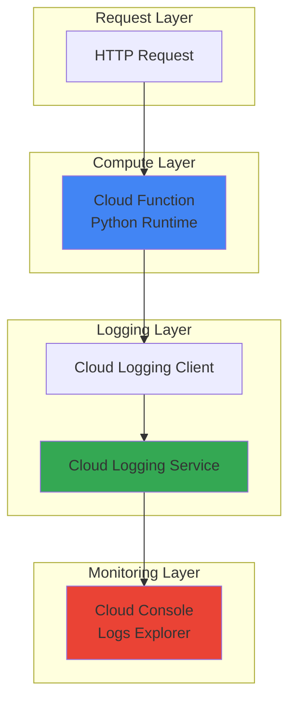

# Basic Application Logging with Cloud Functions

## Problem

Modern applications require comprehensive logging for troubleshooting, performance monitoring, and business intelligence. Many developers new to cloud environments struggle with implementing proper structured logging that integrates with cloud-native observability tools. Without structured logs, finding specific errors, tracking user behavior, and monitoring application health becomes time-consuming and inefficient, leading to longer resolution times and reduced system reliability.

## Solution

Create a Cloud Function with structured logging using Google Cloud Logging client library to automatically capture, format, and store application logs with rich metadata. The solution leverages Cloud Functions' serverless architecture for event-driven logging and Cloud Logging's powerful querying capabilities to provide comprehensive observability without infrastructure management overhead.

## Architecture Diagram



## Prerequisites

1. Google Cloud account with billing enabled and Cloud Functions API access
2. Google Cloud CLI installed and configured or Cloud Shell access
3. Basic knowledge of Python programming and HTTP concepts
4. Understanding of serverless computing fundamentals
5. Estimated cost: $0.01-0.10 for testing (covered by free tier)

> **Note**: Cloud Functions provides 2 million invocations per month in the free tier, making this recipe cost-effective for learning and development.

## Preparation

```bash
# Set environment variables for GCP resources
export PROJECT_ID="logging-demo-$(date +%s)"
export REGION="us-central1"
export FUNCTION_NAME="logging-demo-function"

# Generate unique suffix for resource names
RANDOM_SUFFIX=$(openssl rand -hex 3)

# Create a new project for this demo
gcloud projects create ${PROJECT_ID} \
    --name="Cloud Functions Logging Demo"

# Set default project and region
gcloud config set project ${PROJECT_ID}
gcloud config set compute/region ${REGION}

# Enable required APIs
gcloud services enable cloudfunctions.googleapis.com
gcloud services enable logging.googleapis.com
gcloud services enable cloudbuild.googleapis.com

echo "✅ Project configured: ${PROJECT_ID}"
echo "✅ Region set to: ${REGION}"
```

## Steps

1. **Create the Function Directory Structure**:

   Cloud Functions deployment requires a specific directory structure with source code and dependency files. Creating an organized project structure ensures proper deployment and maintainability while following Google Cloud best practices for serverless development.

   ```bash
   # Create project directory
   mkdir -p cloud-function-logging
   cd cloud-function-logging
   
   # Create basic project structure
   touch main.py requirements.txt
   
   echo "✅ Function directory structure created"
   ```

2. **Define Function Dependencies**:

   The requirements.txt file specifies Python packages needed for structured logging integration. Including specific versions ensures consistent behavior across deployments and prevents compatibility issues during function execution.

   ```bash
   # Create requirements.txt with logging dependencies
   cat > requirements.txt << 'EOF'
functions-framework==3.8.0
google-cloud-logging==3.11.0
EOF
   
   echo "✅ Dependencies defined in requirements.txt"
   ```

3. **Implement Structured Logging Function**:

   The main function code demonstrates proper Cloud Logging integration using the Python standard library. This approach provides automatic log formatting, metadata enrichment, and seamless integration with Google Cloud's observability ecosystem.

   ```bash
   # Create main function with structured logging
   cat > main.py << 'EOF'
import logging
import functions_framework
from google.cloud.logging import Client


@functions_framework.http
def log_demo(request):
    """Cloud Function demonstrating structured logging capabilities."""
    
    # Initialize Cloud Logging client and setup integration
    logging_client = Client()
    logging_client.setup_logging()
    
    # Extract request information for logging context
    method = request.method
    path = request.path
    user_agent = request.headers.get('User-Agent', 'Unknown')
    
    # Create structured log entries with different severity levels
    logging.info("Function invocation started", extra={
        "json_fields": {
            "component": "log-demo-function",
            "request_method": method,
            "request_path": path,
            "event_type": "function_start"
        }
    })
    
    # Simulate application logic with informational logging
    logging.info("Processing user request", extra={
        "json_fields": {
            "component": "log-demo-function",
            "user_agent": user_agent,
            "processing_stage": "validation",
            "event_type": "request_processing"
        }
    })
    
    # Example warning log for demonstration
    if "test" in request.args.get('mode', '').lower():
        logging.warning("Running in test mode", extra={
            "json_fields": {
                "component": "log-demo-function",
                "mode": "test",
                "event_type": "configuration_warning"
            }
        })
    
    # Success completion log
    logging.info("Function execution completed successfully", extra={
        "json_fields": {
            "component": "log-demo-function",
            "status": "success",
            "event_type": "function_complete"
        }
    })
    
    return {
        "message": "Logging demonstration completed",
        "status": "success",
        "logs_generated": 4
    }
EOF
   
   echo "✅ Structured logging function created"
   ```

4. **Deploy Cloud Function**:

   Deploying the function to Google Cloud enables serverless execution with automatic scaling and integrated logging. The deployment process builds the function environment, installs dependencies, and configures the runtime for optimal performance.

   ```bash
   # Deploy function with logging configuration
   gcloud functions deploy ${FUNCTION_NAME} \
       --runtime python312 \
       --trigger-http \
       --allow-unauthenticated \
       --region ${REGION} \
       --memory 256MB \
       --timeout 60s \
       --source .
   
   # Get function URL for testing
   FUNCTION_URL=$(gcloud functions describe ${FUNCTION_NAME} \
       --region ${REGION} \
       --format="value(httpsTrigger.url)")
   
   echo "✅ Function deployed successfully"
   echo "Function URL: ${FUNCTION_URL}"
   ```

5. **Test Function and Generate Logs**:

   Testing the deployed function demonstrates logging capabilities and populates Cloud Logging with structured log entries. Multiple test scenarios showcase different log levels and metadata structures for comprehensive observability validation.

   ```bash
   # Test function with normal request
   curl -s "${FUNCTION_URL}" | python3 -m json.tool
   
   # Test function with test mode parameter
   curl -s "${FUNCTION_URL}?mode=test" | python3 -m json.tool
   
   # Generate additional log entries for demonstration
   curl -s "${FUNCTION_URL}?user=demo"
   
   echo "✅ Function tested and logs generated"
   ```

## Validation & Testing

1. **Verify Function Deployment**:

   ```bash
   # Confirm function is deployed and active
   gcloud functions describe ${FUNCTION_NAME} \
       --region ${REGION} \
       --format="table(name,status,httpsTrigger.url)"
   ```

   Expected output: Function status should show "ACTIVE" with a valid HTTPS URL.

2. **Examine Structured Logs in Cloud Console**:

   ```bash
   # View recent function logs
   gcloud logging read "resource.type=\"cloud_function\" AND \
       resource.labels.function_name=\"${FUNCTION_NAME}\"" \
       --limit 10 \
       --format="table(timestamp,severity,jsonPayload.component,jsonPayload.event_type)"
   
   # Search for specific log events
   gcloud logging read "resource.type=\"cloud_function\" AND \
       jsonPayload.event_type=\"function_start\"" \
       --limit 5
   ```

   Expected output: Structured log entries with JSON payload fields, timestamps, and severity levels should be visible.

3. **Test Log Filtering and Querying**:

   ```bash
   # Filter logs by component
   gcloud logging read "resource.type=\"cloud_function\" AND \
       jsonPayload.component=\"log-demo-function\"" \
       --limit 5 \
       --format="value(jsonPayload.event_type)"
   ```

   Expected output: Event types like "function_start", "request_processing", and "function_complete" should appear.

## Cleanup

1. **Delete Cloud Function**:

   ```bash
   # Remove the deployed function
   gcloud functions delete ${FUNCTION_NAME} \
       --region ${REGION} \
       --quiet
   
   echo "✅ Cloud Function deleted"
   ```

2. **Clean Up Local Files**:

   ```bash
   # Remove local project directory
   cd ..
   rm -rf cloud-function-logging
   
   echo "✅ Local files cleaned up"
   ```

3. **Delete Project Resources**:

   ```bash
   # Delete the entire project (optional)
   gcloud projects delete ${PROJECT_ID} --quiet
   
   echo "✅ Project resources deleted"
   echo "Note: Project deletion may take several minutes to complete"
   ```

## Discussion

Structured logging transforms raw application data into queryable, actionable insights that drive operational excellence. The Cloud Logging client library automatically handles log formatting, metadata enrichment, and transport optimization, enabling developers to focus on application logic rather than logging infrastructure. The `json_fields` parameter creates structured log entries that Cloud Logging stores in the `jsonPayload` field, enabling powerful filtering and analysis capabilities through the [Logs Explorer interface](https://cloud.google.com/logging/docs/view/logs-explorer-interface).

Cloud Functions provides an ideal environment for learning logging best practices due to its automatic integration with Google Cloud's observability stack. The StructuredLogHandler automatically formats logs as JSON when running in serverless environments, ensuring consistency and compatibility with Cloud Logging's advanced features. This approach eliminates the complexity of manual log formatting while maintaining the flexibility to include custom metadata and structured data that supports operational monitoring and business analytics.

The integration between Cloud Functions and Cloud Logging exemplifies Google Cloud's commitment to operational simplicity and developer productivity. By leveraging Python's standard logging library with Cloud Logging's client library, developers can implement enterprise-grade observability without learning new APIs or changing existing logging patterns. This seamless integration reduces development time while providing the scalability and reliability required for production applications. For more information on Cloud Logging best practices, see the [Google Cloud Logging documentation](https://cloud.google.com/logging/docs/best-practices).

The structured logging approach demonstrated in this recipe follows Google Cloud's [recommended practices for serverless observability](https://cloud.google.com/functions/docs/monitoring/logging) and provides a foundation for implementing comprehensive monitoring, alerting, and analytics capabilities. As applications grow in complexity, these logging patterns scale naturally with Google Cloud's infrastructure, supporting everything from simple debugging scenarios to sophisticated business intelligence workflows powered by [Cloud Operations suite](https://cloud.google.com/products/operations).

> **Tip**: Use Cloud Logging's powerful query language to create custom dashboards and alerts based on your structured log data, enabling proactive monitoring and rapid incident response.

## Challenge

Extend this solution by implementing these enhancements:

1. **Add Error Handling and Retry Logic**: Implement proper exception handling with structured error logging and integrate with Cloud Error Reporting for automated error tracking and notification.

2. **Create Custom Log Metrics**: Use Cloud Logging's metrics capabilities to create custom business metrics from log data, such as request counts, response times, and error rates, then visualize them in Cloud Monitoring dashboards.

3. **Implement Trace Correlation**: Add Cloud Trace integration to correlate logs with distributed traces, enabling end-to-end request tracking across multiple services and providing deeper performance insights.

4. **Build Log-Based Alerting**: Configure Cloud Monitoring alerts based on log patterns, such as error rate thresholds or specific log messages, to enable proactive incident response and system health monitoring.

5. **Deploy Multi-Environment Logging**: Extend the solution to support multiple environments (development, staging, production) with environment-specific logging configurations and centralized log aggregation for operational consistency.

## Infrastructure Code

### Available Infrastructure as Code:

- [Infrastructure Code Overview](code/README.md) - Detailed description of all infrastructure components
- [Infrastructure Manager](code/infrastructure-manager/) - GCP Infrastructure Manager templates
- [Bash CLI Scripts](code/scripts/) - Example bash scripts using gcloud CLI commands to deploy infrastructure
- [Terraform](code/terraform/) - Terraform configuration files