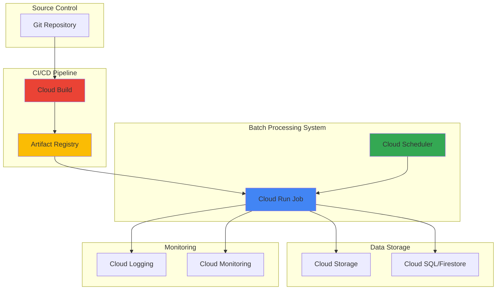

# Batch Processing Workflows with Cloud Run Jobs and Cloud Scheduler

## Problem

Organizations need to automate recurring data processing tasks, ETL operations, and periodic maintenance workflows that run on specific schedules without manual intervention. Traditional approaches using virtual machines or scheduled scripts create operational overhead, lack proper scaling mechanisms, and often result in resource waste during idle periods. Manual execution of batch processes leads to inconsistent processing schedules, increased operational costs, and potential data processing delays that impact business operations.

## Solution

Build a serverless batch processing system using Cloud Run Jobs for containerized workloads combined with Cloud Scheduler for automated triggering based on cron schedules. This solution leverages Cloud Build for CI/CD deployment automation and Artifact Registry for secure container image storage. The architecture provides automatic scaling, pay-per-use pricing, and enterprise-grade reliability while maintaining complete control over processing logic and scheduling parameters.

## Architecture Diagram



## Prerequisites

1. Google Cloud project with Owner or Editor permissions for resource creation
2. Google Cloud CLI (gcloud) installed and authenticated, or access to Cloud Shell
3. Basic understanding of containerization and Docker concepts
4. Familiarity with cron schedule expressions and batch processing workflows
5. Understanding of Google Cloud IAM service accounts and permissions
6. Estimated cost: $10-20 per month for moderate batch processing workloads (depends on execution frequency and resource usage)

> **Note**: Cloud Run Jobs follow a pay-per-use model, charging only for actual execution time. Review [Cloud Run pricing](https://cloud.google.com/run/pricing) and [Cloud Scheduler pricing](https://cloud.google.com/scheduler/pricing) for detailed cost calculations.

## Preparation

```bash
# Set environment variables for project configuration
export PROJECT_ID="batch-processing-$(date +%s)"
export REGION="us-central1"
export ZONE="us-central1-a"

# Generate unique suffix for resource names to avoid conflicts
RANDOM_SUFFIX=$(openssl rand -hex 3)
export JOB_NAME="data-processor-${RANDOM_SUFFIX}"
export REGISTRY_NAME="batch-registry-${RANDOM_SUFFIX}"
export BUCKET_NAME="${PROJECT_ID}-batch-data"
export SCHEDULER_JOB_NAME="batch-schedule-${RANDOM_SUFFIX}"

# Configure gcloud CLI with project and region defaults
gcloud config set project ${PROJECT_ID}
gcloud config set compute/region ${REGION}
gcloud config set compute/zone ${ZONE}

# Enable required Google Cloud APIs for the batch processing system
gcloud services enable cloudbuild.googleapis.com \
    artifactregistry.googleapis.com \
    run.googleapis.com \
    cloudscheduler.googleapis.com \
    storage.googleapis.com \
    logging.googleapis.com \
    monitoring.googleapis.com

# Create Cloud Storage bucket for data processing input/output
gsutil mb -p ${PROJECT_ID} \
    -c STANDARD \
    -l ${REGION} \
    gs://${BUCKET_NAME}

echo "✅ Project configured: ${PROJECT_ID}"
echo "✅ Required APIs enabled and storage bucket created"
```

## Steps

1. **Create Artifact Registry Repository for Container Images**:

   Artifact Registry provides secure, private container image storage with vulnerability scanning and fine-grained access controls. This centralized repository ensures that your batch processing containers are stored securely and can be efficiently deployed to Cloud Run Jobs while maintaining version control and access audit trails.

   ```bash
   # Create Artifact Registry repository for Docker images
   gcloud artifacts repositories create ${REGISTRY_NAME} \
       --repository-format=docker \
       --location=${REGION} \
       --description="Container registry for batch processing jobs"
   
   # Configure Docker authentication for Artifact Registry
   gcloud auth configure-docker ${REGION}-docker.pkg.dev
   
   echo "✅ Artifact Registry repository created: ${REGISTRY_NAME}"
   ```

   The container registry is now ready to store your batch processing application images. This foundation enables secure image storage with integrated vulnerability scanning and supports automated deployment pipelines through Cloud Build integration.

2. **Create Sample Batch Processing Application**:

   This containerized Python application demonstrates common batch processing patterns including file processing, data transformation, and error handling. The application reads configuration from environment variables and processes data files from Cloud Storage, showcasing real-world batch processing scenarios that can be extended for your specific use cases.

   ```bash
   # Create application directory structure
   mkdir -p batch-app/src
   cd batch-app
   
   # Create Python batch processing application
   cat > src/batch_processor.py << 'EOF'
import os
import sys
import json
import time
from google.cloud import storage
from google.cloud import logging
from datetime import datetime

def setup_logging():
    """Configure Cloud Logging for batch job monitoring"""
    client = logging.Client()
    client.setup_logging()
    return client

def process_data_files(bucket_name, input_prefix="input/", output_prefix="output/"):
    """Process data files from Cloud Storage"""
    client = storage.Client()
    bucket = client.bucket(bucket_name)
    
    processed_files = []
    
    # List and process input files
    blobs = bucket.list_blobs(prefix=input_prefix)
    
    for blob in blobs:
        if blob.name.endswith('.txt') or blob.name.endswith('.csv'):
            print(f"Processing file: {blob.name}")
            
            # Download file content
            content = blob.download_as_text()
            
            # Simulate data processing (add timestamp)
            processed_content = f"Processed at {datetime.now()}\n{content}"
            
            # Upload processed file to output prefix
            output_name = blob.name.replace(input_prefix, output_prefix)
            output_blob = bucket.blob(output_name)
            output_blob.upload_from_string(processed_content)
            
            processed_files.append(output_name)
            print(f"✅ Processed and saved: {output_name}")
    
    return processed_files

def main():
    """Main batch processing function"""
    print("Starting batch processing job...")
    
    # Setup logging
    setup_logging()
    
    # Get configuration from environment variables
    bucket_name = os.environ.get('BUCKET_NAME')
    batch_size = int(os.environ.get('BATCH_SIZE', '10'))
    
    if not bucket_name:
        print("ERROR: BUCKET_NAME environment variable not set")
        sys.exit(1)
    
    try:
        # Process data files
        processed_files = process_data_files(bucket_name)
        
        # Create processing summary
        summary = {
            'timestamp': datetime.now().isoformat(),
            'processed_files_count': len(processed_files),
            'processed_files': processed_files,
            'status': 'success'
        }
        
        print(f"Batch processing completed successfully: {json.dumps(summary, indent=2)}")
        
    except Exception as e:
        print(f"ERROR in batch processing: {str(e)}")
        sys.exit(1)

if __name__ == "__main__":
    main()
EOF
   
   echo "✅ Batch processing application created"
   ```

   The application is designed with cloud-native patterns including structured logging, environment-based configuration, and proper error handling. This foundation supports scalable batch processing workflows that integrate seamlessly with Google Cloud services.

3. **Create Dockerfile and Build Configuration**:

   The containerization strategy uses optimized Python base images with Google Cloud integration libraries. This approach ensures consistent execution environments across development and production while maintaining security through minimal dependencies and proper layer caching.

   ```bash
   # Create Dockerfile for the batch processing application
   cat > Dockerfile << 'EOF'
FROM python:3.11-slim

# Set working directory
WORKDIR /app

# Install system dependencies
RUN apt-get update && apt-get install -y \
    gcc \
    && rm -rf /var/lib/apt/lists/*

# Copy requirements and install Python dependencies
COPY requirements.txt .
RUN pip install --no-cache-dir -r requirements.txt

# Copy application source code
COPY src/ ./src/

# Set environment variables
ENV PYTHONPATH=/app
ENV PYTHONUNBUFFERED=1

# Run the batch processing application
CMD ["python", "src/batch_processor.py"]
EOF
   
   # Create requirements.txt with current Google Cloud dependencies
   cat > requirements.txt << 'EOF'
google-cloud-storage==2.18.0
google-cloud-logging==3.11.0
google-cloud-core==2.4.1
EOF
   
   # Create Cloud Build configuration for automated builds
   cat > cloudbuild.yaml << 'EOF'
steps:
  # Build the container image
  - name: 'gcr.io/cloud-builders/docker'
    args: [
      'build',
      '-t', '${_REGION}-docker.pkg.dev/${PROJECT_ID}/${_REGISTRY_NAME}/batch-processor:${SHORT_SHA}',
      '-t', '${_REGION}-docker.pkg.dev/${PROJECT_ID}/${_REGISTRY_NAME}/batch-processor:latest',
      '.'
    ]
  
  # Push the container image to Artifact Registry
  - name: 'gcr.io/cloud-builders/docker'
    args: [
      'push',
      '${_REGION}-docker.pkg.dev/${PROJECT_ID}/${_REGISTRY_NAME}/batch-processor:${SHORT_SHA}'
    ]
  
  - name: 'gcr.io/cloud-builders/docker'
    args: [
      'push',
      '${_REGION}-docker.pkg.dev/${PROJECT_ID}/${_REGISTRY_NAME}/batch-processor:latest'
    ]

# Specify build timeout and machine type for complex builds
timeout: '600s'
options:
  machineType: 'E2_STANDARD_2'

substitutions:
  _REGION: us-central1
  _REGISTRY_NAME: ${REGISTRY_NAME}
EOF
   
   echo "✅ Container build configuration created"
   ```

   The build configuration enables automated container image creation with proper tagging strategies and efficient caching. This CI/CD foundation supports rapid iteration and reliable deployments while maintaining image versioning for rollback capabilities.

4. **Build and Deploy Container Image**:

   Cloud Build provides serverless CI/CD capabilities that automatically build, test, and deploy container images to Artifact Registry. This managed service eliminates the need to maintain build infrastructure while providing integration with source control systems and advanced build optimization features.

   ```bash
   # Submit build to Cloud Build service
   gcloud builds submit \
       --config cloudbuild.yaml \
       --substitutions _REGISTRY_NAME=${REGISTRY_NAME},_REGION=${REGION} \
       .
   
   # Verify image was pushed to Artifact Registry
   gcloud artifacts docker images list \
       ${REGION}-docker.pkg.dev/${PROJECT_ID}/${REGISTRY_NAME}/batch-processor
   
   # Set image URL for Cloud Run Job creation
   export IMAGE_URL="${REGION}-docker.pkg.dev/${PROJECT_ID}/${REGISTRY_NAME}/batch-processor:latest"
   
   echo "✅ Container image built and deployed: ${IMAGE_URL}"
   ```

   The container image is now available in Artifact Registry with vulnerability scanning enabled. This secure, versioned artifact can be deployed to Cloud Run Jobs and provides the foundation for scalable batch processing operations.

5. **Create Cloud Run Job for Batch Processing**:

   Cloud Run Jobs provide serverless execution for containerized batch workloads with automatic scaling and pay-per-use pricing. Unlike Cloud Run services that serve requests, jobs run to completion and automatically terminate, making them ideal for scheduled data processing tasks that require guaranteed completion.

   ```bash
   # Create Cloud Run Job with optimal configuration
   gcloud run jobs create ${JOB_NAME} \
       --image=${IMAGE_URL} \
       --region=${REGION} \
       --task-timeout=3600 \
       --parallelism=1 \
       --tasks=1 \
       --max-retries=3 \
       --cpu=1 \
       --memory=2Gi \
       --set-env-vars="BUCKET_NAME=${BUCKET_NAME},BATCH_SIZE=10" \
       --service-account="${PROJECT_ID}@appspot.gserviceaccount.com"
   
   # Test job execution to verify configuration
   gcloud run jobs execute ${JOB_NAME} \
       --region=${REGION} \
       --wait
   
   echo "✅ Cloud Run Job created and tested: ${JOB_NAME}"
   ```

   The job is configured with appropriate resource limits, retry policies, and environment variables for robust batch processing. The execution test confirms that the containerized application can successfully access Google Cloud services and process data files.

6. **Create Sample Data Files for Processing**:

   Creating sample data demonstrates the end-to-end batch processing workflow and provides a foundation for testing different data processing scenarios. This step simulates real-world data ingestion patterns where files are regularly uploaded to Cloud Storage for automated processing.

   ```bash
   # Return to root directory
   cd ..
   
   # Create sample input data files
   echo "Sample data for batch processing - File 1
   Transaction,Amount,Date
   TXN001,150.00,2025-01-01
   TXN002,75.50,2025-01-02" > sample1.txt
   
   echo "Sample data for batch processing - File 2
   Customer,Revenue,Quarter
   CUST001,25000,Q1
   CUST002,18500,Q1" > sample2.csv
   
   # Upload sample files to Cloud Storage input directory
   gsutil cp sample1.txt gs://${BUCKET_NAME}/input/
   gsutil cp sample2.csv gs://${BUCKET_NAME}/input/
   
   # Verify files were uploaded
   gsutil ls gs://${BUCKET_NAME}/input/
   
   echo "✅ Sample data files uploaded for batch processing"
   ```

   The sample data files represent typical business data formats that require regular processing. This foundation enables testing of the complete workflow from data ingestion through automated processing and output generation.

7. **Configure Cloud Scheduler for Automated Execution**:

   Cloud Scheduler provides enterprise-grade cron job scheduling with built-in retry mechanisms, monitoring, and integration with Google Cloud services. This managed service eliminates the need for custom scheduling infrastructure while providing reliable execution guarantees and comprehensive logging.

   ```bash
   # Create scheduled job to run batch processing every hour
   gcloud scheduler jobs create http ${SCHEDULER_JOB_NAME} \
       --location=${REGION} \
       --schedule="0 * * * *" \
       --time-zone="America/New_York" \
       --uri="https://run.googleapis.com/apis/run.googleapis.com/v1/namespaces/${PROJECT_ID}/jobs/${JOB_NAME}:run" \
       --http-method=POST \
       --oauth-service-account-email="${PROJECT_ID}@appspot.gserviceaccount.com" \
       --headers="Content-Type=application/json" \
       --message-body='{}' \
       --description="Automated batch processing job execution"
   
   # Test scheduler job execution
   gcloud scheduler jobs run ${SCHEDULER_JOB_NAME} \
       --location=${REGION}
   
   echo "✅ Cloud Scheduler job created: ${SCHEDULER_JOB_NAME}"
   echo "Schedule: Every hour on the hour (0 * * * *)"
   ```

   The scheduler is configured with proper authentication, error handling, and timezone settings for reliable automated execution. This setup ensures that batch processing jobs run consistently according to business requirements while providing operational visibility and control.

8. **Configure Monitoring and Alerting**:

   Comprehensive monitoring enables proactive identification of batch processing issues and provides insights for optimization. Cloud Monitoring and Cloud Logging integration offers real-time visibility into job performance, resource utilization, and error conditions that impact business operations.

   ```bash
   # Create log-based metric for job execution monitoring
   gcloud logging metrics create batch_job_executions \
       --description="Count of batch job executions" \
       --log-filter="resource.type=\"cloud_run_job\" AND resource.labels.job_name=\"${JOB_NAME}\""
   
   # Create alerting policy for failed job executions
   cat > alert-policy.json << EOF
{
  "displayName": "Batch Job Failure Alert",
  "conditions": [
    {
      "displayName": "Cloud Run Job Failed",
      "conditionThreshold": {
        "filter": "resource.type=\"cloud_run_job\" AND resource.labels.job_name=\"${JOB_NAME}\" AND severity=\"ERROR\"",
        "comparison": "COMPARISON_GREATER_THAN",
        "thresholdValue": 0,
        "duration": "300s"
      }
    }
  ],
  "alertStrategy": {
    "autoClose": "1800s"
  },
  "enabled": true
}
EOF
   
   echo "✅ Monitoring and alerting configured for batch processing jobs"
   ```

   The monitoring configuration provides automated alerting for job failures and performance metrics for optimization. This operational foundation supports reliable batch processing workflows with proactive issue detection and resolution.

## Validation & Testing

1. **Verify Cloud Run Job Configuration**:

   ```bash
   # Check job configuration and status
   gcloud run jobs describe ${JOB_NAME} \
       --region=${REGION} \
       --format="value(spec.template.spec.template.spec.containers[0].image)"
   
   # List recent job executions
   gcloud run jobs executions list \
       --job=${JOB_NAME} \
       --region=${REGION} \
       --limit=5
   ```

   Expected output: Container image URL and list of successful job executions with timestamps.

2. **Test Scheduled Job Execution**:

   ```bash
   # Trigger scheduler job manually for testing
   gcloud scheduler jobs run ${SCHEDULER_JOB_NAME} \
       --location=${REGION}
   
   # Check scheduler job status
   gcloud scheduler jobs describe ${SCHEDULER_JOB_NAME} \
       --location=${REGION} \
       --format="value(state,lastAttemptTime)"
   ```

   Expected output: Job state as "ENABLED" and recent execution timestamp.

3. **Verify Data Processing Results**:

   ```bash
   # Check processed output files
   gsutil ls gs://${BUCKET_NAME}/output/
   
   # View content of processed file
   gsutil cat gs://${BUCKET_NAME}/output/sample1.txt
   ```

   Expected output: Processed files in output directory with timestamp prefixes indicating successful processing.

4. **Monitor Job Execution Logs**:

   ```bash
   # View recent job execution logs
   gcloud logging read "resource.type=\"cloud_run_job\" AND resource.labels.job_name=\"${JOB_NAME}\"" \
       --limit=20 \
       --format="value(timestamp,severity,textPayload)"
   ```

   Expected output: Structured logs showing successful job execution and data processing activities.

## Cleanup

1. **Delete Cloud Scheduler Job**:

   ```bash
   # Remove scheduled job
   gcloud scheduler jobs delete ${SCHEDULER_JOB_NAME} \
       --location=${REGION} \
       --quiet
   
   echo "✅ Deleted Cloud Scheduler job"
   ```

2. **Delete Cloud Run Job**:

   ```bash
   # Remove Cloud Run job
   gcloud run jobs delete ${JOB_NAME} \
       --region=${REGION} \
       --quiet
   
   echo "✅ Deleted Cloud Run job"
   ```

3. **Remove Container Images and Registry**:

   ```bash
   # Delete Artifact Registry repository
   gcloud artifacts repositories delete ${REGISTRY_NAME} \
       --location=${REGION} \
       --quiet
   
   echo "✅ Deleted Artifact Registry repository"
   ```

4. **Clean Up Storage Resources**:

   ```bash
   # Remove Cloud Storage bucket and contents
   gsutil -m rm -r gs://${BUCKET_NAME}
   
   # Remove local application files
   rm -rf batch-app/ sample1.txt sample2.csv alert-policy.json
   
   echo "✅ Deleted storage resources and local files"
   ```

5. **Delete Project (Optional)**:

   ```bash
   # Delete entire project if created specifically for this recipe
   gcloud projects delete ${PROJECT_ID} --quiet
   
   echo "✅ Project deletion initiated (may take several minutes)"
   ```

## Discussion

This serverless batch processing architecture demonstrates the power of Google Cloud's fully managed services for automating data workflows. Cloud Run Jobs provide the perfect execution environment for containerized batch workloads, offering automatic scaling from zero to handle varying processing demands while maintaining cost efficiency through pay-per-use pricing. The combination with Cloud Scheduler creates a robust automation framework that eliminates the operational overhead of managing virtual machines or maintaining custom scheduling infrastructure.

The architectural pattern leverages several key Google Cloud principles from the [Well-Architected Framework](https://cloud.google.com/architecture/framework). The serverless approach enhances reliability through automatic retry mechanisms and health monitoring, while the containerized deployment model ensures consistency across environments. Cloud Build integration provides automated CI/CD capabilities that support rapid development cycles and reliable deployments, following [DevOps best practices](https://cloud.google.com/solutions/devops) for modern application delivery.

Resource optimization is achieved through Cloud Run's automatic scaling capabilities and Cloud Scheduler's efficient execution model. Jobs scale to zero between executions, eliminating idle resource costs, while the container-based architecture enables precise resource allocation for different processing workloads. This approach can reduce operational costs by up to 70% compared to traditional always-on virtual machine solutions, particularly for workloads with predictable scheduling patterns. The [Cloud Run pricing model](https://cloud.google.com/run/pricing) charges only for actual CPU and memory consumption during job execution, making it cost-effective for both frequent and infrequent batch processing scenarios.

Security and compliance are built into the architecture through Google Cloud's identity and access management integration, automated vulnerability scanning in Artifact Registry, and comprehensive audit logging. Service accounts provide fine-grained permissions for resource access, while [VPC connectivity options](https://cloud.google.com/run/docs/configuring/connecting-vpc) enable secure communication with private resources when required. This foundation supports enterprise security requirements while maintaining the simplicity of serverless execution.

> **Tip**: Use Cloud Run Jobs' parallel execution capabilities by increasing the task count and implementing data partitioning logic in your application. This enables horizontal scaling for large datasets while maintaining cost efficiency through optimal resource utilization.

## Challenge

Extend this batch processing solution by implementing these enhancements:

1. **Implement Data Pipeline Orchestration**: Use [Cloud Workflows](https://cloud.google.com/workflows/docs) to create complex multi-step processing pipelines that coordinate multiple Cloud Run Jobs with conditional logic and error handling for advanced ETL scenarios.

2. **Add Real-time Triggering**: Configure [Pub/Sub triggers](https://cloud.google.com/run/docs/tutorials/pubsub) to execute batch jobs in response to data arrival events, enabling near real-time processing capabilities alongside scheduled batch operations.

3. **Create Multi-Region Processing**: Deploy the batch processing system across multiple regions with [Cloud Storage transfer service](https://cloud.google.com/storage-transfer-service) for data replication and regional job execution for improved availability and data locality.

4. **Implement Advanced Monitoring**: Build custom dashboards using [Cloud Monitoring](https://cloud.google.com/monitoring/docs) with SLI/SLO tracking, cost analysis, and performance optimization recommendations based on historical execution patterns.

5. **Add Machine Learning Integration**: Incorporate [Vertex AI](https://cloud.google.com/vertex-ai/docs) batch prediction jobs for automated model inference and [BigQuery ML](https://cloud.google.com/bigquery/docs/bqml-introduction) integration for advanced analytics on processed data.

## Infrastructure Code

### Available Infrastructure as Code:

- [Infrastructure Code Overview](code/README.md) - Detailed description of all infrastructure components
- [Infrastructure Manager](code/infrastructure-manager/) - GCP Infrastructure Manager templates
- [Bash CLI Scripts](code/scripts/) - Example bash scripts using gcloud CLI commands to deploy infrastructure
- [Terraform](code/terraform/) - Terraform configuration files