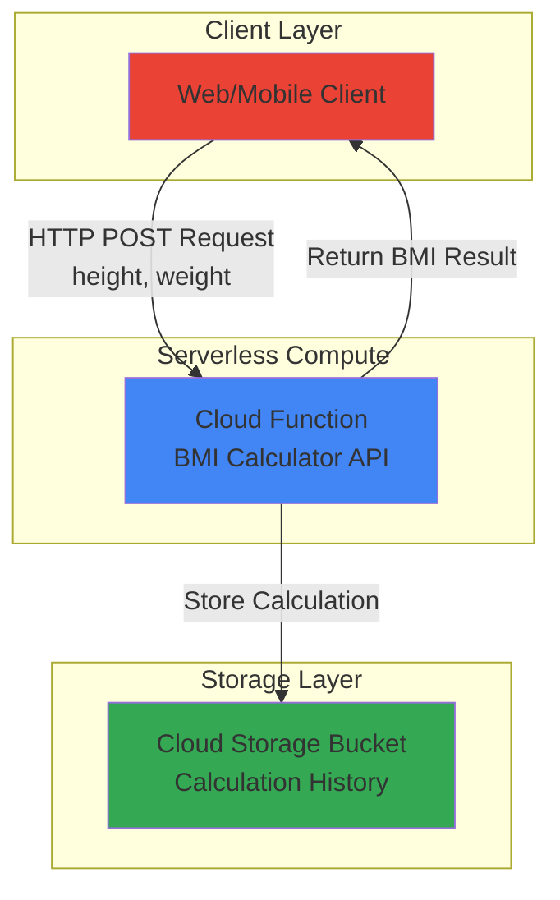

# BMI Calculator API with Cloud Functions

## Problem

Healthcare applications and fitness platforms need simple, scalable APIs to calculate Body Mass Index (BMI) for users while maintaining a history of calculations for tracking progress over time. Traditional server-based solutions require infrastructure management, capacity planning, and constant maintenance, leading to unnecessary operational overhead and costs for what should be a lightweight mathematical computation.

## Solution

Build a serverless HTTP API using Google Cloud Functions that calculates BMI from height and weight parameters and automatically stores calculation history in Cloud Storage. This approach provides automatic scaling, pay-per-use pricing, and zero infrastructure management while maintaining calculation records in durable object storage for future analysis and user history tracking.

## Architecture Diagram



## Prerequisites

1. Google Cloud account with billing enabled and appropriate permissions for Cloud Functions and Cloud Storage
2. Google Cloud CLI (gcloud) installed and configured with authentication
3. Basic understanding of Python programming and HTTP APIs
4. Understanding of JSON data formats for API requests and responses
5. Estimated cost: Less than $0.10 USD for typical development and testing usage

> **Note**: This recipe uses Google Cloud's serverless offerings which follow a pay-per-use model. Cloud Functions are billed per invocation and execution time, while Cloud Storage charges for data storage and operations.

## Preparation

Google Cloud Functions and Cloud Storage work together to provide a complete serverless solution. Cloud Functions handles the HTTP API logic and mathematical calculations, while Cloud Storage provides durable, scalable object storage for maintaining calculation history. This combination enables event-driven architectures with persistent data storage.

```bash
# Set environment variables for GCP resources
export PROJECT_ID="bmi-calculator-$(date +%s)"
export REGION="us-central1"
export FUNCTION_NAME="bmi-calculator"

# Generate unique suffix for resource names
RANDOM_SUFFIX=$(openssl rand -hex 3)
export BUCKET_NAME="bmi-history-${RANDOM_SUFFIX}"

# Create new project for this recipe
gcloud projects create ${PROJECT_ID} \
    --name="BMI Calculator API"

# Link billing account (replace with your billing account ID)
# gcloud billing projects link ${PROJECT_ID} \
#     --billing-account=YOUR_BILLING_ACCOUNT_ID

# Set default project and region
gcloud config set project ${PROJECT_ID}
gcloud config set compute/region ${REGION}
gcloud config set functions/region ${REGION}

echo "✅ Project configured: ${PROJECT_ID}"
```

Cloud Functions require several APIs to be enabled for deployment and execution. The Cloud Functions API handles the serverless compute functionality, while Cloud Storage provides the object storage backend. Cloud Build API is used for packaging and deploying the function code from source.

```bash
# Enable required APIs for Cloud Functions and Cloud Storage
gcloud services enable cloudfunctions.googleapis.com \
    cloudbuild.googleapis.com \
    storage.googleapis.com \
    artifactregistry.googleapis.com \
    run.googleapis.com

echo "✅ Required APIs enabled successfully"

# Create Cloud Storage bucket for calculation history
gsutil mb -p ${PROJECT_ID} \
    -c STANDARD \
    -l ${REGION} \
    gs://${BUCKET_NAME}

echo "✅ Cloud Storage bucket created: gs://${BUCKET_NAME}"
```

## Steps

1. **Create Python Function Code**:

   Cloud Functions in Python provide a lightweight runtime for executing code in response to HTTP requests. The function will calculate BMI using the standard formula (weight in kg / height in meters²) and store each calculation with a timestamp in Cloud Storage for historical tracking and analysis.

   ```bash
   # Create function directory and main Python file
   mkdir bmi-function
   cd bmi-function
   
   # Create main.py with BMI calculation logic
   cat > main.py << 'EOF'
import functions_framework
import json
from datetime import datetime
from google.cloud import storage
import os

@functions_framework.http
def calculate_bmi(request):
    """HTTP Cloud Function that calculates BMI and stores history."""
    
    # Set CORS headers for web browser compatibility
    headers = {
        'Access-Control-Allow-Origin': '*',
        'Access-Control-Allow-Methods': 'POST, OPTIONS',
        'Access-Control-Allow-Headers': 'Content-Type'
    }
    
    # Handle preflight OPTIONS request for CORS
    if request.method == 'OPTIONS':
        return ('', 204, headers)
    
    # Parse JSON request body
    try:
        request_json = request.get_json(silent=True)
        if not request_json:
            return json.dumps({
                'error': 'Request must contain JSON data'
            }), 400, headers
        
        height = float(request_json.get('height', 0))
        weight = float(request_json.get('weight', 0))
        
        if height <= 0 or weight <= 0:
            return json.dumps({
                'error': 'Height and weight must be positive numbers'
            }), 400, headers
        
    except (ValueError, TypeError):
        return json.dumps({
            'error': 'Height and weight must be valid numbers'
        }), 400, headers
    
    # Calculate BMI using standard formula
    bmi = weight / (height ** 2)
    
    # Determine BMI category based on WHO standards
    if bmi < 18.5:
        category = 'Underweight'
    elif bmi < 25:
        category = 'Normal weight'
    elif bmi < 30:
        category = 'Overweight'
    else:
        category = 'Obese'
    
    # Create calculation record
    calculation = {
        'timestamp': datetime.utcnow().isoformat(),
        'height': height,
        'weight': weight,
        'bmi': round(bmi, 2),
        'category': category
    }
    
    # Store calculation in Cloud Storage
    try:
        bucket_name = os.environ.get('BUCKET_NAME')
        if bucket_name:
            client = storage.Client()
            bucket = client.bucket(bucket_name)
            
            # Create unique filename with timestamp
            filename = f"calculations/{datetime.utcnow().strftime('%Y%m%d_%H%M%S_%f')}.json"
            blob = bucket.blob(filename)
            blob.upload_from_string(json.dumps(calculation))
            
    except Exception as e:
        # Log error but don't fail the request
        print(f"Error storing calculation: {str(e)}")
    
    # Return BMI calculation result
    return json.dumps(calculation), 200, headers
EOF
   
   echo "✅ Python function code created successfully"
   ```

   This Cloud Function implements a complete BMI calculation API with error handling, CORS support for web browsers, and automatic data persistence. The function validates input parameters, calculates BMI using the international standard formula, categorizes results according to WHO guidelines, and stores each calculation in Cloud Storage for historical analysis.

2. **Create Requirements File**:

   Cloud Functions require a requirements.txt file to specify Python dependencies. The Functions Framework handles HTTP request routing, while the Google Cloud Storage client library enables seamless integration with Cloud Storage buckets for data persistence.

   ```bash
   # Create requirements.txt with necessary dependencies
   cat > requirements.txt << 'EOF'
functions-framework==3.*
google-cloud-storage==2.*
EOF
   
   echo "✅ Requirements file created with dependencies"
   ```

3. **Deploy Cloud Function**:

   Cloud Functions deployment packages your Python code, installs dependencies, and creates a managed HTTP endpoint. The deployment process includes building a container image, storing it in Artifact Registry, and configuring the runtime environment with necessary permissions and environment variables.

   ```bash
   # Deploy Cloud Function with HTTP trigger and environment variables
   gcloud functions deploy ${FUNCTION_NAME} \
       --gen2 \
       --runtime python311 \
       --trigger-http \
       --allow-unauthenticated \
       --source . \
       --entry-point calculate_bmi \
       --memory 256MB \
       --timeout 60s \
       --set-env-vars "BUCKET_NAME=${BUCKET_NAME}" \
       --region ${REGION}
   
   # Get the function URL for testing
   FUNCTION_URL=$(gcloud functions describe ${FUNCTION_NAME} \
       --gen2 \
       --region=${REGION} \
       --format="value(serviceConfig.uri)")
   
   echo "✅ Cloud Function deployed successfully"
   echo "Function URL: ${FUNCTION_URL}"
   ```

   The deployed function is now accessible via HTTPS with automatic SSL certificate management, global load balancing, and automatic scaling based on incoming request volume. Google Cloud handles all infrastructure provisioning, monitoring, and maintenance tasks automatically.

4. **Configure IAM Permissions**:

   Cloud Functions require appropriate Identity and Access Management (IAM) permissions to interact with Cloud Storage. The Cloud Functions service account needs Storage Object Creator permissions to write calculation history files to the designated bucket.

   ```bash
   # Get the Cloud Functions service account for 2nd gen functions
   FUNCTION_SA=$(gcloud functions describe ${FUNCTION_NAME} \
       --gen2 \
       --region=${REGION} \
       --format="value(serviceConfig.serviceAccountEmail)")
   
   # Grant Storage Object Creator role to the function
   gsutil iam ch serviceAccount:${FUNCTION_SA}:objectCreator \
       gs://${BUCKET_NAME}
   
   echo "✅ IAM permissions configured for Cloud Storage access"
   ```

5. **Test BMI Calculation API**:

   Testing the deployed function ensures proper functionality across different BMI categories and validates both the mathematical calculations and data storage integration. The API accepts JSON payloads with height (in meters) and weight (in kilograms) parameters.

   ```bash
   # Test with normal weight calculation
   curl -X POST ${FUNCTION_URL} \
       -H "Content-Type: application/json" \
       -d '{"height": 1.75, "weight": 70}' \
       | python3 -m json.tool
   
   # Test with different BMI category (overweight)
   curl -X POST ${FUNCTION_URL} \
       -H "Content-Type: application/json" \
       -d '{"height": 1.70, "weight": 85}' \
       | python3 -m json.tool
   
   echo "✅ API tested successfully with multiple scenarios"
   ```

## Validation & Testing

1. **Verify Function Deployment Status**:

   ```bash
   # Check function deployment status and configuration
   gcloud functions describe ${FUNCTION_NAME} \
       --gen2 \
       --region=${REGION} \
       --format="table(name,state,serviceConfig.uri)"
   ```

   Expected output: Function should show state as `ACTIVE` with a valid HTTPS URL.

2. **Test API Error Handling**:

   ```bash
   # Test with invalid input (missing weight)
   curl -X POST ${FUNCTION_URL} \
       -H "Content-Type: application/json" \
       -d '{"height": 1.75}' \
       | python3 -m json.tool
   
   # Test with zero values
   curl -X POST ${FUNCTION_URL} \
       -H "Content-Type: application/json" \
       -d '{"height": 0, "weight": 70}' \
       | python3 -m json.tool
   ```

   Expected output: Both requests should return HTTP 400 status with appropriate error messages.

3. **Verify Data Storage in Cloud Storage**:

   ```bash
   # List calculation files stored in Cloud Storage bucket
   gsutil ls -r gs://${BUCKET_NAME}/calculations/
   
   # View content of a recent calculation file
   LATEST_FILE=$(gsutil ls gs://${BUCKET_NAME}/calculations/ | tail -1)
   gsutil cat ${LATEST_FILE} | python3 -m json.tool
   ```

   Expected output: JSON files containing calculation records with timestamps, input values, BMI results, and health categories.

## Cleanup

1. **Delete Cloud Function**:

   ```bash
   # Remove the deployed Cloud Function
   gcloud functions delete ${FUNCTION_NAME} \
       --gen2 \
       --region=${REGION} \
       --quiet
   
   echo "✅ Cloud Function deleted successfully"
   ```

2. **Remove Cloud Storage Bucket and Contents**:

   ```bash
   # Delete all objects in the bucket and the bucket itself
   gsutil -m rm -r gs://${BUCKET_NAME}
   
   echo "✅ Cloud Storage bucket and contents removed"
   ```

3. **Delete Project Resources**:

   ```bash
   # Delete the entire project to remove all resources
   gcloud projects delete ${PROJECT_ID} --quiet
   
   # Clean up local files
   cd ..
   rm -rf bmi-function
   
   echo "✅ Project and local files cleaned up"
   echo "Note: Project deletion may take several minutes to complete"
   ```

## Discussion

This serverless BMI calculator demonstrates the power of Google Cloud's serverless architecture for building lightweight, scalable APIs. Cloud Functions automatically handles HTTP request routing, scaling, and infrastructure management, while Cloud Storage provides reliable persistence for calculation history without database complexity. The solution uses Google Cloud's second-generation Cloud Functions (gen2), which provides improved performance, better scaling characteristics, and enhanced security features compared to the first generation.

The solution leverages several key Google Cloud design patterns. The stateless function design ensures each request is processed independently, enabling automatic horizontal scaling based on demand. The integration between Cloud Functions and Cloud Storage follows Google's recommended practices for serverless data persistence, using the Google Cloud client libraries for secure, authenticated access to storage resources. The gen2 Cloud Functions run on Cloud Run infrastructure, providing better cold start performance and more consistent execution times.

Security considerations include CORS headers for browser compatibility, input validation to prevent malicious data, and IAM-based access controls for Cloud Storage operations. The function uses a dedicated service account with minimal permissions, following the principle of least privilege. Error handling ensures graceful degradation when storage operations fail, maintaining API availability even during temporary service disruptions. The function also implements proper HTTP status codes and structured error responses for better client integration.

Performance optimization opportunities include implementing response caching for identical calculations, using Cloud Storage's object lifecycle policies for automatic data retention management, and exploring Cloud Firestore for more complex query requirements as the application scales. The current architecture supports thousands of concurrent requests with sub-second response times and automatic global distribution through Google's edge infrastructure. Monitoring and observability are built-in through Cloud Monitoring and Cloud Logging.

> **Tip**: Monitor function performance using Cloud Monitoring to optimize memory allocation and execution time based on actual usage patterns and request volumes.

**Documentation Sources:**
- [Google Cloud Functions Python Quickstart](https://cloud.google.com/functions/docs/quickstart-python)
- [Cloud Storage Python Client Library](https://cloud.google.com/storage/docs/reference/libraries#client-libraries-install-python)
- [Cloud Functions HTTP Functions](https://cloud.google.com/functions/docs/writing/http)
- [Google Cloud IAM Best Practices](https://cloud.google.com/iam/docs/using-iam-securely)
- [Cloud Storage Security and Access Control](https://cloud.google.com/storage/docs/access-control)
- [Cloud Functions 2nd Generation](https://cloud.google.com/functions/docs/2nd-gen/overview)

## Challenge

Extend this solution by implementing these enhancements:

1. **Add User Authentication**: Integrate with Google Cloud Identity and Access Management (IAM) or Firebase Authentication to associate calculations with specific users and provide personalized history tracking.

2. **Implement Data Analytics**: Create a Cloud Functions trigger that processes new calculation files and generates aggregate statistics using BigQuery or Cloud Dataflow for population health insights.

3. **Build a Web Interface**: Deploy a static website using Cloud Storage and Cloud CDN that provides a user-friendly interface for BMI calculations with visualization of historical trends and health recommendations.

4. **Add Notification System**: Integrate with Cloud Pub/Sub and Gmail API to send email notifications when BMI calculations indicate significant health category changes over time.

5. **Implement Rate Limiting**: Use Cloud Armor or Firestore to implement API rate limiting and usage quotas to prevent abuse and manage costs in production environments.

## Infrastructure Code

*Infrastructure code will be generated after recipe approval.*