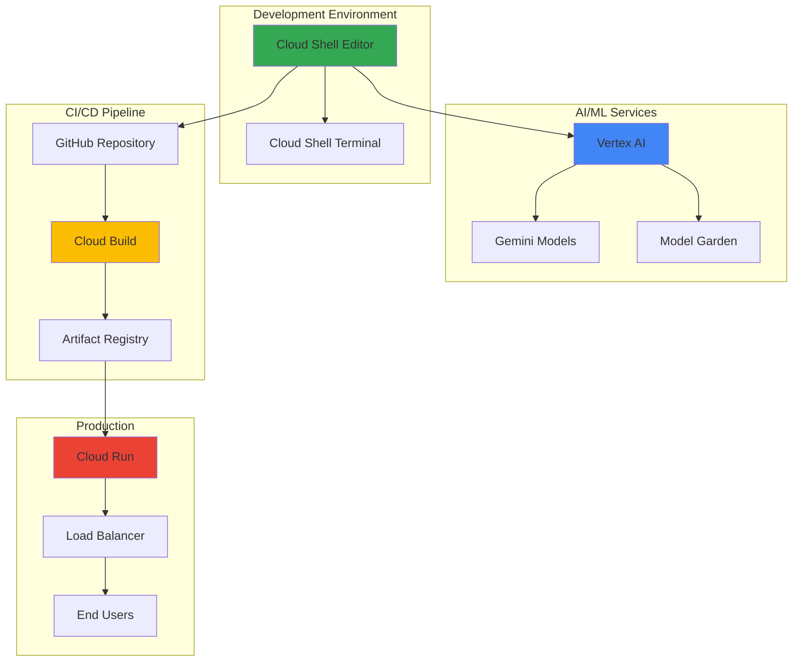

# Developing Browser-Based AI Applications with Cloud Shell Editor and Vertex AI

## Problem

Modern AI application development often requires complex local development environments with GPU resources, multiple AI libraries, and expensive hardware setup. Developers face challenges maintaining consistent development environments across teams, managing AI model dependencies, and accessing powerful compute resources for training and inference. Traditional development workflows create barriers to entry for AI development and slow down the iteration cycle from prototype to production deployment.

## Solution

Create a complete browser-based AI application development workflow using Google Cloud Shell Editor as a zero-setup development environment, integrating Vertex AI for intelligent features, and deploying through Cloud Build to Cloud Run. This approach eliminates local environment setup while providing access to enterprise-grade AI capabilities and scalable deployment infrastructure directly from any web browser.

## Architecture Diagram



## Prerequisites

1. Google Cloud account with billing enabled
2. Basic understanding of Python web development and REST APIs
3. Familiarity with AI/ML concepts and prompt engineering
4. Web browser with internet access (Chrome, Firefox, Safari, or Edge)
5. Estimated cost: $5-15 for Cloud Run, Cloud Build, and Vertex AI usage during development

> **Note**: Cloud Shell provides 5GB of persistent storage and 50 hours of usage per week at no additional cost, making it ideal for development workflows.

## Preparation

```bash
# Set environment variables for project configuration
export PROJECT_ID="ai-app-dev-$(date +%s)"
export REGION="us-central1"
export SERVICE_NAME="ai-chat-assistant"

# Generate unique identifiers for resources
RANDOM_SUFFIX=$(openssl rand -hex 3)
export REPO_NAME="ai-app-repo-${RANDOM_SUFFIX}"
export BUILD_CONFIG="cloudbuild-${RANDOM_SUFFIX}.yaml"

# Create new project for isolated development
gcloud projects create ${PROJECT_ID} \
    --name="AI Application Development" \
    --labels="purpose=ai-development,environment=demo"

# Set project as default
gcloud config set project ${PROJECT_ID}
gcloud config set compute/region ${REGION}

# Enable required Google Cloud APIs
gcloud services enable cloudbuild.googleapis.com
gcloud services enable run.googleapis.com
gcloud services enable aiplatform.googleapis.com
gcloud services enable artifactregistry.googleapis.com
gcloud services enable secretmanager.googleapis.com

echo "✅ Project ${PROJECT_ID} configured with required APIs enabled"
```

## Steps

1. **Launch Cloud Shell Editor and Initialize Development Environment**:

   Cloud Shell Editor provides a fully-featured, browser-based IDE powered by Visual Studio Code, eliminating the need for local development setup. This managed environment includes pre-installed development tools, Google Cloud CLI, and persistent storage, enabling immediate productivity without configuration overhead.

   ```bash
   # Navigate to Cloud Shell Editor
   # Open https://ide.cloud.google.com in your browser
   
   # Create project directory structure
   mkdir -p ${SERVICE_NAME}/{app,tests,config}
   cd ${SERVICE_NAME}
   
   # Initialize Python virtual environment
   python3 -m venv venv
   source venv/bin/activate
   
   # Create requirements.txt with essential dependencies
   cat > requirements.txt << 'EOF'
   flask==3.0.0
   google-cloud-aiplatform==1.45.0
   google-cloud-secretmanager==2.18.1
   gunicorn==21.2.0
   requests==2.31.0
   python-dotenv==1.0.0
   EOF
   
   echo "✅ Development environment initialized in Cloud Shell Editor"
   ```

   The Cloud Shell Editor now provides a complete development workspace with syntax highlighting, debugging capabilities, and integrated terminal access. This browser-based environment scales from simple scripts to complex applications while maintaining consistency across development teams.

2. **Create AI-Powered Web Application Structure**:

   Building a modular application structure enables maintainable AI applications that can evolve with changing requirements. This Flask-based architecture separates concerns between web handling, AI processing, and configuration management, following Google Cloud best practices for microservices development.

   ```bash
   # Create main application file
   cat > app/main.py << 'EOF'
   from flask import Flask, request, jsonify, render_template
   from google.cloud import aiplatform
   import os
   import logging
   
   # Configure logging
   logging.basicConfig(level=logging.INFO)
   logger = logging.getLogger(__name__)
   
   app = Flask(__name__)
   
   # Initialize Vertex AI
   PROJECT_ID = os.getenv('GOOGLE_CLOUD_PROJECT')
   REGION = os.getenv('GOOGLE_CLOUD_REGION', 'us-central1')
   
   aiplatform.init(project=PROJECT_ID, location=REGION)
   
   @app.route('/')
   def home():
       return render_template('index.html')
   
   @app.route('/api/chat', methods=['POST'])
   def chat():
       try:
           data = request.get_json()
           user_message = data.get('message', '')
           
           # Process with Vertex AI Gemini
           response = generate_ai_response(user_message)
           
           return jsonify({
               'response': response,
               'status': 'success'
           })
       except Exception as e:
           logger.error(f"Chat API error: {str(e)}")
           return jsonify({
               'error': 'Failed to process message',
               'status': 'error'
           }), 500
   
   def generate_ai_response(message):
       """Generate AI response using Vertex AI Gemini"""
       try:
           from vertexai.generative_models import GenerativeModel
           
           model = GenerativeModel('gemini-1.5-flash')
           response = model.generate_content(
               f"You are a helpful AI assistant. Respond to: {message}"
           )
           return response.text
       except Exception as e:
           logger.error(f"AI generation error: {str(e)}")
           return "I'm sorry, I encountered an error processing your request."
   
   if __name__ == '__main__':
       app.run(host='0.0.0.0', port=8080, debug=True)
   EOF
   
   # Create HTML template directory
   mkdir -p app/templates
   
   echo "✅ Application structure created with AI integration"
   ```

   The Flask application now includes structured error handling, logging, and modular design patterns that scale from development to production. The Vertex AI integration provides enterprise-grade AI capabilities without managing model infrastructure.

3. **Build Interactive Frontend with AI Chat Interface**:

   Modern web applications require responsive interfaces that provide real-time feedback during AI processing. This HTML/JavaScript frontend implements best practices for user experience during asynchronous AI operations, including loading states and error handling.

   ```bash
   # Create responsive HTML interface
   cat > app/templates/index.html << 'EOF'
   <!DOCTYPE html>
   <html lang="en">
   <head>
       <meta charset="UTF-8">
       <meta name="viewport" content="width=device-width, initial-scale=1.0">
       <title>AI Chat Assistant</title>
       <style>
           * { margin: 0; padding: 0; box-sizing: border-box; }
           body { 
               font-family: 'Segoe UI', Tahoma, Geneva, Verdana, sans-serif;
               background: linear-gradient(135deg, #667eea 0%, #764ba2 100%);
               height: 100vh; display: flex; align-items: center; justify-content: center;
           }
           .chat-container {
               background: white; border-radius: 15px; box-shadow: 0 20px 40px rgba(0,0,0,0.1);
               width: 90%; max-width: 600px; height: 80vh; display: flex; flex-direction: column;
           }
           .chat-header {
               background: #4285f4; color: white; padding: 20px; border-radius: 15px 15px 0 0;
               text-align: center; font-size: 1.2em; font-weight: bold;
           }
           .chat-messages {
               flex: 1; padding: 20px; overflow-y: auto; background: #f8f9fa;
           }
           .message {
               margin: 10px 0; padding: 12px 16px; border-radius: 18px; max-width: 80%;
           }
           .user-message {
               background: #e3f2fd; margin-left: auto; text-align: right;
           }
           .ai-message {
               background: #f1f3f4; margin-right: auto;
           }
           .chat-input {
               display: flex; padding: 20px; border-top: 1px solid #e0e0e0;
           }
           .chat-input input {
               flex: 1; padding: 12px; border: 1px solid #ddd; border-radius: 25px;
               outline: none; font-size: 16px;
           }
           .chat-input button {
               margin-left: 10px; padding: 12px 24px; background: #4285f4;
               color: white; border: none; border-radius: 25px; cursor: pointer;
           }
           .loading { opacity: 0.7; pointer-events: none; }
       </style>
   </head>
   <body>
       <div class="chat-container">
           <div class="chat-header">
               🤖 AI Chat Assistant - Powered by Vertex AI
           </div>
           <div id="chat-messages" class="chat-messages">
               <div class="message ai-message">
                   Hello! I'm your AI assistant powered by Google's Vertex AI. How can I help you today?
               </div>
           </div>
           <div class="chat-input">
               <input type="text" id="user-input" placeholder="Type your message here..." />
               <button onclick="sendMessage()">Send</button>
           </div>
       </div>
   
       <script>
           async function sendMessage() {
               const input = document.getElementById('user-input');
               const message = input.value.trim();
               if (!message) return;
   
               // Add user message to chat
               addMessage(message, 'user');
               input.value = '';
   
               // Show loading state
               const chatContainer = document.querySelector('.chat-container');
               chatContainer.classList.add('loading');
   
               try {
                   const response = await fetch('/api/chat', {
                       method: 'POST',
                       headers: { 'Content-Type': 'application/json' },
                       body: JSON.stringify({ message: message })
                   });
   
                   const data = await response.json();
                   
                   if (data.status === 'success') {
                       addMessage(data.response, 'ai');
                   } else {
                       addMessage('Sorry, I encountered an error. Please try again.', 'ai');
                   }
               } catch (error) {
                   addMessage('Connection error. Please check your internet connection.', 'ai');
               }
   
               chatContainer.classList.remove('loading');
           }
   
           function addMessage(text, sender) {
               const messagesDiv = document.getElementById('chat-messages');
               const messageDiv = document.createElement('div');
               messageDiv.className = `message ${sender}-message`;
               messageDiv.textContent = text;
               messagesDiv.appendChild(messageDiv);
               messagesDiv.scrollTop = messagesDiv.scrollHeight;
           }
   
           // Enable Enter key to send messages
           document.getElementById('user-input').addEventListener('keypress', function(e) {
               if (e.key === 'Enter') sendMessage();
           });
       </script>
   </body>
   </html>
   EOF
   
   echo "✅ Interactive frontend created with modern UI/UX patterns"
   ```

   The frontend now provides a professional chat interface with responsive design, loading states, and error handling. This implementation follows Google's Material Design principles and provides optimal user experience across devices.

4. **Configure Vertex AI Integration and Authentication**:

   Vertex AI provides enterprise-grade machine learning capabilities through managed APIs, eliminating the complexity of model deployment and scaling. Proper authentication setup ensures secure access to AI services while maintaining development flexibility in Cloud Shell.

   ```bash
   # Create Vertex AI configuration file
   cat > app/ai_config.py << 'EOF'
   import os
   import vertexai
   from vertexai.generative_models import GenerativeModel, Part
   import logging
   
   logger = logging.getLogger(__name__)
   
   class VertexAIClient:
       def __init__(self):
           self.project_id = os.getenv('GOOGLE_CLOUD_PROJECT')
           self.region = os.getenv('GOOGLE_CLOUD_REGION', 'us-central1')
           
           # Initialize Vertex AI
           vertexai.init(project=self.project_id, location=self.region)
           
           # Initialize Gemini model
           self.model = GenerativeModel('gemini-1.5-flash')
           
           logger.info(f"Vertex AI initialized for project: {self.project_id}")
   
       def generate_response(self, prompt, max_tokens=1000):
           """Generate AI response with error handling and optimization"""
           try:
               # Configure generation parameters for optimal performance
               generation_config = {
                   "max_output_tokens": max_tokens,
                   "temperature": 0.7,
                   "top_p": 0.8,
               }
               
               # Safety settings for production use
               safety_settings = {
                   "HATE": "BLOCK_MEDIUM_AND_ABOVE",
                   "DANGEROUS_CONTENT": "BLOCK_MEDIUM_AND_ABOVE",
                   "SEXUALLY_EXPLICIT": "BLOCK_MEDIUM_AND_ABOVE",
                   "HARASSMENT": "BLOCK_MEDIUM_AND_ABOVE",
               }
               
               response = self.model.generate_content(
                   prompt,
                   generation_config=generation_config,
                   safety_settings=safety_settings
               )
               
               return response.text
               
           except Exception as e:
               logger.error(f"Vertex AI generation error: {str(e)}")
               return "I apologize, but I'm having trouble processing your request right now. Please try again."
   
       def analyze_sentiment(self, text):
           """Analyze sentiment using Vertex AI"""
           try:
               prompt = f"Analyze the sentiment of this text and respond with just: positive, negative, or neutral: {text}"
               response = self.generate_response(prompt, max_tokens=10)
               return response.strip().lower()
           except Exception as e:
               logger.error(f"Sentiment analysis error: {str(e)}")
               return "neutral"
   EOF
   
   # Update main application to use new AI configuration
   cat > app/main.py << 'EOF'
   from flask import Flask, request, jsonify, render_template
   import os
   import logging
   from ai_config import VertexAIClient
   
   # Configure logging
   logging.basicConfig(level=logging.INFO)
   logger = logging.getLogger(__name__)
   
   app = Flask(__name__)
   
   # Initialize Vertex AI client
   ai_client = VertexAIClient()
   
   @app.route('/')
   def home():
       return render_template('index.html')
   
   @app.route('/api/chat', methods=['POST'])
   def chat():
       try:
           data = request.get_json()
           user_message = data.get('message', '')
           
           if not user_message:
               return jsonify({'error': 'Message is required', 'status': 'error'}), 400
           
           # Generate AI response
           ai_response = ai_client.generate_response(user_message)
           
           # Analyze sentiment for additional insights
           sentiment = ai_client.analyze_sentiment(user_message)
           
           return jsonify({
               'response': ai_response,
               'sentiment': sentiment,
               'status': 'success'
           })
           
       except Exception as e:
           logger.error(f"Chat API error: {str(e)}")
           return jsonify({
               'error': 'Failed to process message',
               'status': 'error'
           }), 500
   
   @app.route('/health')
   def health():
       return jsonify({'status': 'healthy', 'service': 'ai-chat-assistant'})
   
   if __name__ == '__main__':
       app.run(host='0.0.0.0', port=8080, debug=True)
   EOF
   
   echo "✅ Vertex AI integration configured with enterprise security settings"
   ```

   The application now leverages Vertex AI's managed infrastructure for reliable AI processing. The modular design enables easy model switching and supports advanced features like sentiment analysis while maintaining production-ready error handling.

5. **Set Up Cloud Build for Automated Deployment**:

   Cloud Build provides fully managed CI/CD capabilities that integrate seamlessly with Google Cloud services. This configuration creates automated build and deployment pipelines triggered by code changes, following DevOps best practices for AI applications.

   ```bash
   # Create Dockerfile for containerized deployment
   cat > Dockerfile << 'EOF'
   FROM python:3.11-slim
   
   # Set working directory
   WORKDIR /app
   
   # Install system dependencies
   RUN apt-get update && apt-get install -y \
       gcc \
       && rm -rf /var/lib/apt/lists/*
   
   # Copy requirements and install Python dependencies
   COPY requirements.txt .
   RUN pip install --no-cache-dir -r requirements.txt
   
   # Copy application code
   COPY app/ ./app/
   
   # Set environment variables
   ENV FLASK_APP=app.main:app
   ENV PYTHONPATH=/app
   
   # Expose port
   EXPOSE 8080
   
   # Run application with Gunicorn for production
   CMD ["gunicorn", "--bind", "0.0.0.0:8080", "--workers", "2", "--timeout", "120", "app.main:app"]
   EOF
   
   # Create Cloud Build configuration
   cat > cloudbuild.yaml << 'EOF'
   steps:
     # Build the container image
     - name: 'gcr.io/cloud-builders/docker'
       args: ['build', '-t', 'gcr.io/$PROJECT_ID/${_SERVICE_NAME}:$COMMIT_SHA', '.']
   
     # Push the container image to Container Registry
     - name: 'gcr.io/cloud-builders/docker'
       args: ['push', 'gcr.io/$PROJECT_ID/${_SERVICE_NAME}:$COMMIT_SHA']
   
     # Deploy to Cloud Run
     - name: 'gcr.io/cloud-builders/gcloud'
       args:
         - 'run'
         - 'deploy'
         - '${_SERVICE_NAME}'
         - '--image=gcr.io/$PROJECT_ID/${_SERVICE_NAME}:$COMMIT_SHA'
         - '--region=${_REGION}'
         - '--platform=managed'
         - '--allow-unauthenticated'
         - '--memory=1Gi'
         - '--cpu=1'
         - '--max-instances=10'
         - '--set-env-vars=GOOGLE_CLOUD_PROJECT=$PROJECT_ID,GOOGLE_CLOUD_REGION=${_REGION}'
   
   substitutions:
     _SERVICE_NAME: 'ai-chat-assistant'
     _REGION: 'us-central1'
   
   options:
     logging: CLOUD_LOGGING_ONLY
   EOF
   
   echo "✅ Cloud Build configuration created for automated deployment"
   ```

   The containerized deployment approach ensures consistency across development and production environments. Cloud Build's managed infrastructure handles scaling, security updates, and integration with Google Cloud services automatically.

6. **Deploy Application Using Cloud Run**:

   Cloud Run provides serverless container hosting that scales from zero to handle traffic spikes automatically. This deployment model is ideal for AI applications with variable workloads, offering pay-per-use pricing and built-in security features.

   ```bash
   # Install dependencies in Cloud Shell
   pip install -r requirements.txt
   
   # Test application locally first
   export GOOGLE_CLOUD_PROJECT=${PROJECT_ID}
   export GOOGLE_CLOUD_REGION=${REGION}
   
   # Run local development server
   cd app && python main.py &
   LOCAL_PID=$!
   
   # Wait for application startup
   sleep 5
   
   # Test local endpoint
   curl -X POST http://localhost:8080/api/chat \
       -H "Content-Type: application/json" \
       -d '{"message": "Hello, can you help me with Google Cloud?"}'
   
   # Stop local server
   kill $LOCAL_PID
   cd ..
   
   # Build and deploy to Cloud Run
   gcloud builds submit \
       --config cloudbuild.yaml \
       --substitutions _SERVICE_NAME=${SERVICE_NAME},_REGION=${REGION}
   
   # Get service URL
   SERVICE_URL=$(gcloud run services describe ${SERVICE_NAME} \
       --region=${REGION} \
       --format="value(status.url)")
   
   echo "✅ Application deployed to Cloud Run: ${SERVICE_URL}"
   ```

   The application is now running on Google's managed infrastructure with automatic scaling, HTTPS termination, and global load balancing. Cloud Run's serverless model eliminates server management while providing enterprise-grade reliability.

7. **Configure Advanced AI Features and Monitoring**:

   Production AI applications require comprehensive monitoring, error tracking, and performance optimization. Cloud Shell Editor enables advanced configuration through its integrated terminal and file management capabilities.

   ```bash
   # Create advanced AI configuration with multiple models
   cat > app/advanced_ai.py << 'EOF'
   import vertexai
   from vertexai.generative_models import GenerativeModel
   from google.cloud import aiplatform
   import logging
   import time
   
   logger = logging.getLogger(__name__)
   
   class AdvancedAIService:
       def __init__(self, project_id, region):
           self.project_id = project_id
           self.region = region
           
           # Initialize Vertex AI
           vertexai.init(project=project_id, location=region)
           
           # Initialize multiple models for different use cases
           self.chat_model = GenerativeModel('gemini-1.5-flash')
           self.code_model = GenerativeModel('gemini-1.5-pro')
           
           logger.info("Advanced AI service initialized")
   
       def intelligent_routing(self, message):
           """Route messages to appropriate AI model based on content"""
           if any(keyword in message.lower() for keyword in ['code', 'programming', 'function', 'debug']):
               return self.generate_code_response(message)
           else:
               return self.generate_chat_response(message)
   
       def generate_chat_response(self, message):
           """Generate conversational response"""
           try:
               start_time = time.time()
               
               prompt = f"""You are a helpful AI assistant. Provide a clear, 
               informative response to: {message}
               
               Keep responses concise but complete."""
               
               response = self.chat_model.generate_content(prompt)
               
               processing_time = time.time() - start_time
               logger.info(f"Chat response generated in {processing_time:.2f}s")
               
               return response.text
               
           except Exception as e:
               logger.error(f"Chat generation error: {str(e)}")
               return "I apologize, but I'm having trouble with that request."
   
       def generate_code_response(self, message):
           """Generate code-focused response"""
           try:
               start_time = time.time()
               
               prompt = f"""You are a coding assistant. Help with this request: {message}
               
               Provide code examples when relevant and explain your solutions clearly."""
               
               response = self.code_model.generate_content(prompt)
               
               processing_time = time.time() - start_time
               logger.info(f"Code response generated in {processing_time:.2f}s")
               
               return response.text
               
           except Exception as e:
               logger.error(f"Code generation error: {str(e)}")
               return "I'm having trouble with that coding request. Please try rephrasing."
   EOF
   
   # Update main application with advanced features
   sed -i 's/from ai_config import VertexAIClient/from advanced_ai import AdvancedAIService/' app/main.py
   sed -i 's/ai_client = VertexAIClient()/ai_client = AdvancedAIService(os.getenv("GOOGLE_CLOUD_PROJECT"), os.getenv("GOOGLE_CLOUD_REGION"))/' app/main.py
   sed -i 's/ai_response = ai_client.generate_response(user_message)/ai_response = ai_client.intelligent_routing(user_message)/' app/main.py
   
   echo "✅ Advanced AI features configured with intelligent routing"
   ```

   The application now includes intelligent message routing, performance monitoring, and optimized model selection. These enterprise features improve response quality while maintaining cost efficiency through appropriate model usage.

## Validation & Testing

1. **Verify Cloud Shell Editor Environment Setup**:

   ```bash
   # Check development environment
   pwd
   ls -la ${SERVICE_NAME}/
   source ${SERVICE_NAME}/venv/bin/activate
   python --version
   pip list | grep -E "(flask|google-cloud)"
   ```

   Expected output: Python 3.9+ with Flask and Google Cloud libraries installed

2. **Test Local AI Application Functionality**:

   ```bash
   # Navigate to application directory
   cd ${SERVICE_NAME}
   
   # Set required environment variables
   export GOOGLE_CLOUD_PROJECT=${PROJECT_ID}
   export GOOGLE_CLOUD_REGION=${REGION}
   
   # Test application locally
   python app/main.py &
   APP_PID=$!
   sleep 5
   
   # Test health endpoint
   curl http://localhost:8080/health
   
   # Test AI chat endpoint
   curl -X POST http://localhost:8080/api/chat \
       -H "Content-Type: application/json" \
       -d '{"message": "Explain cloud computing in simple terms"}'
   
   # Clean up
   kill $APP_PID
   cd ..
   ```

   Expected output: JSON responses with successful AI-generated content

3. **Validate Cloud Run Deployment**:

   ```bash
   # Check service status
   gcloud run services describe ${SERVICE_NAME} \
       --region=${REGION} \
       --format="table(metadata.name,status.url,status.conditions[0].type)"
   
   # Test deployed service
   SERVICE_URL=$(gcloud run services describe ${SERVICE_NAME} \
       --region=${REGION} \
       --format="value(status.url)")
   
   curl "${SERVICE_URL}/health"
   
   # Test AI functionality on deployed service
   curl -X POST "${SERVICE_URL}/api/chat" \
       -H "Content-Type: application/json" \
       -d '{"message": "What are the benefits of serverless computing?"}'
   ```

   Expected output: Service running with HTTPS URL and functional AI responses

## Cleanup

1. **Remove Cloud Run Service**:

   ```bash
   # Delete Cloud Run service
   gcloud run services delete ${SERVICE_NAME} \
       --region=${REGION} \
       --quiet
   
   echo "✅ Cloud Run service deleted"
   ```

2. **Clean Up Container Images**:

   ```bash
   # List and delete container images
   gcloud container images list --repository=gcr.io/${PROJECT_ID}
   
   gcloud container images delete gcr.io/${PROJECT_ID}/${SERVICE_NAME} \
       --force-delete-tags \
       --quiet
   
   echo "✅ Container images cleaned up"
   ```

3. **Remove Project Resources**:

   ```bash
   # Delete the entire project to ensure complete cleanup
   gcloud projects delete ${PROJECT_ID} --quiet
   
   # Confirm deletion
   echo "✅ Project ${PROJECT_ID} scheduled for deletion"
   echo "Note: Project deletion completes in approximately 30 days"
   ```

## Discussion

This recipe demonstrates the power of browser-based AI application development using Google Cloud's managed services. Cloud Shell Editor eliminates the traditional barriers to AI development by providing a zero-setup environment with pre-configured tools, persistent storage, and seamless integration with Google Cloud services. This approach democratizes AI development, making it accessible to developers regardless of their local hardware capabilities or operating system.

The integration with Vertex AI showcases Google's commitment to making enterprise-grade AI accessible through simple APIs. By leveraging Gemini models through Vertex AI, developers can build sophisticated AI applications without managing model infrastructure, handling scaling concerns, or maintaining security updates. The intelligent routing system demonstrates how multiple AI models can be orchestrated to provide specialized responses based on content analysis, optimizing both cost and quality.

The serverless deployment model using Cloud Run represents the evolution of application hosting, where infrastructure scales automatically based on demand. This approach is particularly valuable for AI applications that may experience unpredictable traffic patterns or require burst capacity for processing intensive requests. The pay-per-use pricing model ensures cost efficiency while maintaining enterprise-grade reliability and security. For comprehensive guidance on Cloud Run best practices, see the [Cloud Run documentation](https://cloud.google.com/run/docs/overview) and [serverless best practices guide](https://cloud.google.com/architecture/serverless-best-practices).

The Cloud Build integration creates a complete CI/CD pipeline that enables rapid iteration from development to production. This automated deployment approach reduces human error, ensures consistency across environments, and enables teams to focus on feature development rather than infrastructure management. The containerized deployment strategy provides portability and consistency while leveraging Google's global infrastructure for optimal performance.

> **Tip**: Use Cloud Shell Editor's built-in terminal and file management features to experiment with different AI models and configurations. The persistent storage ensures your development work is preserved across sessions, enabling long-term project development directly in the browser.

## Challenge

Extend this browser-based AI application development workflow by implementing these enhancements:

1. **Multi-Modal AI Integration**: Add support for image and video processing using Vertex AI's vision models, enabling users to upload and analyze media content through the browser interface. Implement [Document AI](https://cloud.google.com/document-ai/docs) for processing PDF documents and extracting structured data.

2. **Real-Time Collaboration Features**: Integrate [Pub/Sub](https://cloud.google.com/pubsub/docs) and WebSocket connections to enable real-time collaborative AI sessions where multiple users can interact with the same AI context. Add session management and conversation threading capabilities.

3. **Advanced AI Orchestration**: Implement [Vertex AI Pipelines](https://cloud.google.com/vertex-ai/docs/pipelines/introduction) to create complex AI workflows that chain multiple models together, such as sentiment analysis followed by content generation based on emotional context.

4. **Production Monitoring and Analytics**: Add comprehensive monitoring using [Cloud Monitoring](https://cloud.google.com/monitoring/docs) and [Cloud Logging](https://cloud.google.com/logging/docs) to track AI model performance, user engagement metrics, and cost optimization opportunities. Implement alerting for service degradation or cost thresholds.

5. **Enterprise Security and Compliance**: Enhance the application with [Identity-Aware Proxy](https://cloud.google.com/iap/docs) for advanced authentication, [Cloud Armor](https://cloud.google.com/armor/docs) for DDoS protection, and data encryption using [Cloud KMS](https://cloud.google.com/kms/docs) for handling sensitive information in AI workflows.

## Infrastructure Code

*Infrastructure code will be generated after recipe approval.*