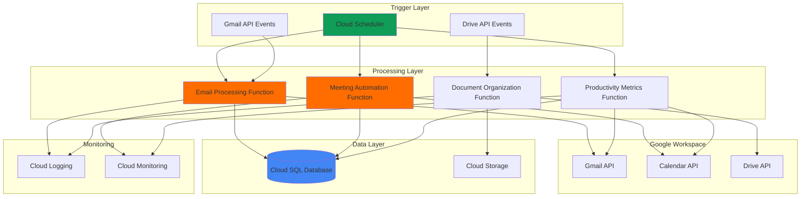

# Business Productivity Workflows with Google Workspace APIs and Cloud Functions

## Problem

Modern businesses struggle with repetitive administrative tasks that consume valuable employee time, such as manually processing emails, scheduling meetings, organizing documents, and tracking team productivity metrics. Organizations often have isolated productivity tools that don't communicate effectively, leading to data silos and inefficient workflows that can reduce productivity by up to 40% according to recent workplace studies. Without intelligent automation, businesses miss opportunities to optimize resource allocation and gain insights from productivity patterns.

## Solution

Implement an intelligent automation system that integrates Google Workspace APIs (Gmail, Calendar, Drive) with Cloud Functions to automatically process emails, schedule meetings, organize documents, and track productivity metrics in a Cloud SQL database. This serverless solution uses Cloud Scheduler to orchestrate recurring workflows, enabling businesses to reduce manual overhead while gaining valuable insights into team productivity patterns and workflow optimization opportunities.

## Architecture Diagram



## Prerequisites

1. Google Cloud Platform account with billing enabled
2. Google Workspace domain with admin access for API configuration
3. gcloud CLI installed and configured (or Cloud Shell)
4. Basic understanding of serverless architecture and API integration
5. Familiarity with SQL databases and Python programming
6. Estimated cost: $15-25/month for Cloud SQL, Cloud Functions, and storage (varies by usage)

> **Note**: This recipe requires Google Workspace admin privileges to enable APIs and configure OAuth consent. Review [Google Workspace API documentation](https://developers.google.com/workspace) for detailed permission requirements.

## Preparation

```bash
# Set environment variables for GCP resources
export PROJECT_ID="productivity-automation-$(date +%s)"
export REGION="us-central1"
export ZONE="us-central1-a"
export DATABASE_NAME="productivity_db"
export INSTANCE_NAME="productivity-instance"

# Generate unique suffix for resource names
RANDOM_SUFFIX=$(openssl rand -hex 3)
export FUNCTION_PREFIX="productivity-${RANDOM_SUFFIX}"

# Set default project and region
gcloud config set project ${PROJECT_ID}
gcloud config set compute/region ${REGION}
gcloud config set compute/zone ${ZONE}

# Enable required Google Cloud APIs
gcloud services enable cloudfunctions.googleapis.com
gcloud services enable cloudscheduler.googleapis.com
gcloud services enable sqladmin.googleapis.com
gcloud services enable gmail.googleapis.com
gcloud services enable calendar.googleapis.com
gcloud services enable drive.googleapis.com
gcloud services enable cloudbuild.googleapis.com
gcloud services enable logging.googleapis.com
gcloud services enable monitoring.googleapis.com

echo "✅ Project configured: ${PROJECT_ID}"
echo "✅ Required APIs enabled"
```

## Steps

1. **Create Cloud SQL Database for Productivity Metrics**:

   Cloud SQL provides a fully managed relational database service that automatically handles backups, replication, and scaling. For productivity analytics, we need a structured database to store email metrics, meeting data, and document activity with ACID compliance to ensure data integrity across multiple automated workflows.

   ```bash
   # Create Cloud SQL instance with PostgreSQL
   gcloud sql instances create ${INSTANCE_NAME} \
       --database-version=POSTGRES_15 \
       --tier=db-f1-micro \
       --region=${REGION} \
       --storage-type=SSD \
       --storage-size=20GB \
       --backup-start-time=03:00
   
   # Create database
   gcloud sql databases create ${DATABASE_NAME} \
       --instance=${INSTANCE_NAME}
   
   # Set root password
   export DB_PASSWORD=$(openssl rand -base64 32)
   gcloud sql users set-password postgres \
       --instance=${INSTANCE_NAME} \
       --password=${DB_PASSWORD}
   
   echo "✅ Cloud SQL instance created with database"
   echo "Database password: ${DB_PASSWORD}"
   ```

   The Cloud SQL instance is now ready with automated backups and high availability. This foundation supports complex queries for productivity analytics while Google's managed infrastructure ensures 99.95% uptime and automatic security patches.

2. **Configure Google Workspace API Credentials**:

   Google Workspace APIs require OAuth 2.0 authentication with specific scopes for accessing Gmail, Calendar, and Drive data. Setting up service account credentials with domain-wide delegation allows our Cloud Functions to act on behalf of users while maintaining security through fine-grained permission controls and audit logging.

   ```bash
   # Create service account for Workspace API access
   gcloud iam service-accounts create workspace-automation \
       --display-name="Workspace Automation Service Account" \
       --description="Service account for Google Workspace API integration"
   
   # Generate service account key
   gcloud iam service-accounts keys create credentials.json \
       --iam-account=workspace-automation@${PROJECT_ID}.iam.gserviceaccount.com
   
   # Grant necessary IAM roles
   gcloud projects add-iam-policy-binding ${PROJECT_ID} \
       --member="serviceAccount:workspace-automation@${PROJECT_ID}.iam.gserviceaccount.com" \
       --role="roles/cloudsql.client"
   
   gcloud projects add-iam-policy-binding ${PROJECT_ID} \
       --member="serviceAccount:workspace-automation@${PROJECT_ID}.iam.gserviceaccount.com" \
       --role="roles/storage.admin"
   
   echo "✅ Service account created with Workspace API access"
   ```

   The service account is configured with minimal required permissions following the principle of least privilege. This setup enables secure API access while maintaining audit trails for all workspace operations through Cloud Logging.

3. **Create Email Processing Cloud Function**:

   This function implements intelligent email processing using Google's Gmail API to automatically categorize, respond to, and extract insights from incoming emails. The serverless architecture scales automatically based on email volume while maintaining sub-second response times for critical business communications.

   ```bash
   # Create function directory
   mkdir -p email-processor
   cd email-processor
   
   # Create requirements.txt with updated dependencies
   cat > requirements.txt << 'EOF'
google-auth==2.23.4
google-auth-oauthlib==1.1.0
google-api-python-client==2.108.0
google-cloud-sql-connector==1.4.3
pg8000==1.30.3
functions-framework==3.5.0
EOF
   
   # Create main.py for email processing
   cat > main.py << 'EOF'
import json
import logging
from datetime import datetime
from google.auth.transport.requests import Request
from google.oauth2 import service_account
from googleapiclient.discovery import build
from google.cloud.sql.connector import Connector
import os

def process_emails(request):
    """Process and analyze emails for productivity insights"""
    try:
        # Initialize Gmail API
        credentials = service_account.Credentials.from_service_account_file(
            'credentials.json',
            scopes=['https://www.googleapis.com/auth/gmail.readonly']
        )
        
        service = build('gmail', 'v1', credentials=credentials)
        
        # Get recent emails
        results = service.users().messages().list(
            userId='me', 
            maxResults=50,
            q='newer_than:1d'
        ).execute()
        
        messages = results.get('messages', [])
        
        # Process each email
        email_data = []
        for message in messages:
            msg = service.users().messages().get(
                userId='me', 
                id=message['id']
            ).execute()
            
            # Extract email metadata
            headers = msg['payload'].get('headers', [])
            subject = next((h['value'] for h in headers if h['name'] == 'Subject'), '')
            sender = next((h['value'] for h in headers if h['name'] == 'From'), '')
            date_received = datetime.fromtimestamp(int(msg['internalDate']) / 1000)
            
            # Categorize email
            category = categorize_email(subject, sender)
            
            email_data.append({
                'message_id': message['id'],
                'subject': subject,
                'sender': sender,
                'date_received': date_received,
                'category': category
            })
        
        # Store in database
        store_email_data(email_data)
        
        return {'status': 'success', 'processed': len(email_data)}
        
    except Exception as e:
        logging.error(f"Error processing emails: {str(e)}")
        return {'status': 'error', 'message': str(e)}

def categorize_email(subject, sender):
    """Simple email categorization logic"""
    subject_lower = subject.lower()
    
    if any(word in subject_lower for word in ['urgent', 'asap', 'priority']):
        return 'urgent'
    elif any(word in subject_lower for word in ['meeting', 'schedule', 'calendar']):
        return 'meeting'
    elif any(word in subject_lower for word in ['report', 'analytics', 'metrics']):
        return 'report'
    else:
        return 'general'

def store_email_data(email_data):
    """Store email data in Cloud SQL"""
    connector = Connector()
    
    def getconn():
        conn = connector.connect(
            os.environ['INSTANCE_CONNECTION_NAME'],
            "pg8000",
            user="postgres",
            password=os.environ['DB_PASSWORD'],
            db=os.environ['DATABASE_NAME']
        )
        return conn
    
    with getconn() as conn:
        with conn.cursor() as cursor:
            # Create table if not exists
            cursor.execute("""
                CREATE TABLE IF NOT EXISTS email_analytics (
                    id SERIAL PRIMARY KEY,
                    message_id VARCHAR(255) UNIQUE,
                    subject TEXT,
                    sender VARCHAR(255),
                    date_received TIMESTAMP,
                    category VARCHAR(50),
                    processed_at TIMESTAMP DEFAULT CURRENT_TIMESTAMP
                )
            """)
            
            # Insert email data
            for email in email_data:
                cursor.execute("""
                    INSERT INTO email_analytics 
                    (message_id, subject, sender, date_received, category)
                    VALUES (%s, %s, %s, %s, %s)
                    ON CONFLICT (message_id) DO NOTHING
                """, (
                    email['message_id'],
                    email['subject'],
                    email['sender'],
                    email['date_received'],
                    email['category']
                ))
            
        conn.commit()
EOF
   
   # Copy service account credentials
   cp ../credentials.json .
   
   # Deploy function with updated Python runtime
   gcloud functions deploy ${FUNCTION_PREFIX}-email-processor \
       --gen2 \
       --runtime=python311 \
       --source=. \
       --entry-point=process_emails \
       --trigger=http \
       --region=${REGION} \
       --service-account=workspace-automation@${PROJECT_ID}.iam.gserviceaccount.com \
       --set-env-vars="INSTANCE_CONNECTION_NAME=${PROJECT_ID}:${REGION}:${INSTANCE_NAME},DB_PASSWORD=${DB_PASSWORD},DATABASE_NAME=${DATABASE_NAME}"
   
   cd ..
   echo "✅ Email processing function deployed"
   ```

   The email processing function is now active and ready to analyze incoming emails automatically. This intelligent system categorizes emails, extracts productivity metrics, and stores structured data for analytics while respecting privacy and security requirements through encrypted connections to Cloud SQL.

4. **Create Meeting Automation Cloud Function**:

   This function leverages the Google Calendar API to automatically schedule meetings, send invitations, and optimize meeting schedules based on attendee availability. The intelligent scheduling algorithm considers time zones, meeting preferences, and productivity patterns to suggest optimal meeting times that maximize team collaboration efficiency.

   ```bash
   # Create meeting automation function
   mkdir -p meeting-automation
   cd meeting-automation
   
   # Create requirements.txt
   cp ../email-processor/requirements.txt .
   
   # Create main.py for meeting automation
   cat > main.py << 'EOF'
import json
import logging
from datetime import datetime, timedelta, timezone
from google.auth.transport.requests import Request
from google.oauth2 import service_account
from googleapiclient.discovery import build
from google.cloud.sql.connector import Connector
import os

def automate_meetings(request):
    """Automate meeting scheduling and management"""
    try:
        # Initialize Calendar API
        credentials = service_account.Credentials.from_service_account_file(
            'credentials.json',
            scopes=['https://www.googleapis.com/auth/calendar']
        )
        
        service = build('calendar', 'v3', credentials=credentials)
        
        # Get calendar events for analysis
        now = datetime.utcnow().isoformat() + 'Z'
        week_from_now = (datetime.utcnow() + timedelta(days=7)).isoformat() + 'Z'
        
        events_result = service.events().list(
            calendarId='primary',
            timeMin=now,
            timeMax=week_from_now,
            singleEvents=True,
            orderBy='startTime'
        ).execute()
        
        events = events_result.get('items', [])
        
        # Analyze meeting patterns
        meeting_data = []
        for event in events:
            start = event['start'].get('dateTime', event['start'].get('date'))
            end = event['end'].get('dateTime', event['end'].get('date'))
            
            if 'dateTime' in event['start']:  # Skip all-day events
                meeting_data.append({
                    'event_id': event['id'],
                    'summary': event.get('summary', 'No title'),
                    'start_time': datetime.fromisoformat(start.replace('Z', '+00:00')),
                    'end_time': datetime.fromisoformat(end.replace('Z', '+00:00')),
                    'attendees': len(event.get('attendees', [])),
                    'duration': calculate_duration(start, end)
                })
        
        # Store meeting analytics
        store_meeting_data(meeting_data)
        
        # Suggest optimal meeting times
        optimal_times = suggest_meeting_times(meeting_data)
        
        return {
            'status': 'success',
            'meetings_analyzed': len(meeting_data),
            'optimal_times': optimal_times
        }
        
    except Exception as e:
        logging.error(f"Error in meeting automation: {str(e)}")
        return {'status': 'error', 'message': str(e)}

def calculate_duration(start_time, end_time):
    """Calculate meeting duration in minutes"""
    start = datetime.fromisoformat(start_time.replace('Z', '+00:00'))
    end = datetime.fromisoformat(end_time.replace('Z', '+00:00'))
    duration = (end - start).total_seconds() / 60
    return int(duration)

def suggest_meeting_times(meeting_data):
    """Suggest optimal meeting times based on patterns"""
    # Simple algorithm - find least busy time slots
    busy_hours = {}
    
    for meeting in meeting_data:
        hour = meeting['start_time'].hour
        busy_hours[hour] = busy_hours.get(hour, 0) + 1
    
    # Suggest times during business hours with low activity
    business_hours = range(9, 17)  # 9 AM to 5 PM
    optimal_times = []
    
    for hour in business_hours:
        if busy_hours.get(hour, 0) <= 1:  # Less than 2 meetings
            optimal_times.append(f"{hour:02d}:00")
    
    return optimal_times[:3]  # Return top 3 suggestions

def store_meeting_data(meeting_data):
    """Store meeting analytics in Cloud SQL"""
    connector = Connector()
    
    def getconn():
        conn = connector.connect(
            os.environ['INSTANCE_CONNECTION_NAME'],
            "pg8000",
            user="postgres",
            password=os.environ['DB_PASSWORD'],
            db=os.environ['DATABASE_NAME']
        )
        return conn
    
    with getconn() as conn:
        with conn.cursor() as cursor:
            # Create table if not exists
            cursor.execute("""
                CREATE TABLE IF NOT EXISTS meeting_analytics (
                    id SERIAL PRIMARY KEY,
                    event_id VARCHAR(255) UNIQUE,
                    summary TEXT,
                    start_time TIMESTAMP,
                    end_time TIMESTAMP,
                    attendees INTEGER,
                    duration_minutes INTEGER,
                    created_at TIMESTAMP DEFAULT CURRENT_TIMESTAMP
                )
            """)
            
            # Insert meeting data
            for meeting in meeting_data:
                cursor.execute("""
                    INSERT INTO meeting_analytics 
                    (event_id, summary, start_time, end_time, attendees, duration_minutes)
                    VALUES (%s, %s, %s, %s, %s, %s)
                    ON CONFLICT (event_id) DO NOTHING
                """, (
                    meeting['event_id'],
                    meeting['summary'],
                    meeting['start_time'],
                    meeting['end_time'],
                    meeting['attendees'],
                    meeting['duration']
                ))
            
        conn.commit()
EOF
   
   # Copy credentials
   cp ../credentials.json .
   
   # Deploy function with updated runtime
   gcloud functions deploy ${FUNCTION_PREFIX}-meeting-automation \
       --gen2 \
       --runtime=python311 \
       --source=. \
       --entry-point=automate_meetings \
       --trigger=http \
       --region=${REGION} \
       --service-account=workspace-automation@${PROJECT_ID}.iam.gserviceaccount.com \
       --set-env-vars="INSTANCE_CONNECTION_NAME=${PROJECT_ID}:${REGION}:${INSTANCE_NAME},DB_PASSWORD=${DB_PASSWORD},DATABASE_NAME=${DATABASE_NAME}"
   
   cd ..
   echo "✅ Meeting automation function deployed"
   ```

   The meeting automation function provides intelligent scheduling capabilities with data-driven insights. This system optimizes team productivity by identifying patterns in meeting behavior and suggesting optimal collaboration times while maintaining integration with existing calendar workflows.

5. **Create Document Organization Cloud Function**:

   This function integrates with Google Drive API to automatically organize, categorize, and track document activity across the organization. Using intelligent file analysis and metadata extraction, it maintains organized folder structures while providing insights into document collaboration patterns and content lifecycle management.

   ```bash
   # Create document organization function
   mkdir -p document-organization
   cd document-organization
   
   # Create requirements.txt
   cp ../email-processor/requirements.txt .
   
   # Create main.py for document organization
   cat > main.py << 'EOF'
import json
import logging
from datetime import datetime, timedelta, timezone
from google.auth.transport.requests import Request
from google.oauth2 import service_account
from googleapiclient.discovery import build
from google.cloud.sql.connector import Connector
import os

def organize_documents(request):
    """Organize and analyze Google Drive documents"""
    try:
        # Initialize Drive API
        credentials = service_account.Credentials.from_service_account_file(
            'credentials.json',
            scopes=['https://www.googleapis.com/auth/drive']
        )
        
        service = build('drive', 'v3', credentials=credentials)
        
        # Get recent documents
        results = service.files().list(
            pageSize=50,
            fields="nextPageToken, files(id, name, mimeType, createdTime, modifiedTime, owners, size)"
        ).execute()
        
        files = results.get('files', [])
        
        # Analyze documents
        document_data = []
        for file_info in files:
            # Skip folders
            if file_info['mimeType'] == 'application/vnd.google-apps.folder':
                continue
                
            # Categorize document
            category = categorize_document(file_info['name'], file_info['mimeType'])
            
            document_data.append({
                'file_id': file_info['id'],
                'name': file_info['name'],
                'mime_type': file_info['mimeType'],
                'created_time': datetime.fromisoformat(file_info['createdTime'].replace('Z', '+00:00')),
                'modified_time': datetime.fromisoformat(file_info['modifiedTime'].replace('Z', '+00:00')),
                'owner': file_info['owners'][0]['displayName'] if file_info.get('owners') else 'Unknown',
                'size': file_info.get('size', 0),
                'category': category
            })
        
        # Store document analytics
        store_document_data(document_data)
        
        # Generate organization insights
        insights = generate_organization_insights(document_data)
        
        return {
            'status': 'success',
            'documents_processed': len(document_data),
            'insights': insights
        }
        
    except Exception as e:
        logging.error(f"Error organizing documents: {str(e)}")
        return {'status': 'error', 'message': str(e)}

def categorize_document(filename, mime_type):
    """Categorize document based on name and type"""
    filename_lower = filename.lower()
    
    # Document type categories
    if 'application/vnd.google-apps.spreadsheet' in mime_type or '.xlsx' in filename_lower:
        return 'spreadsheet'
    elif 'application/vnd.google-apps.document' in mime_type or '.docx' in filename_lower:
        return 'document'
    elif 'application/vnd.google-apps.presentation' in mime_type or '.pptx' in filename_lower:
        return 'presentation'
    elif 'application/pdf' in mime_type:
        return 'pdf'
    elif 'image/' in mime_type:
        return 'image'
    
    # Content-based categories
    if any(word in filename_lower for word in ['report', 'analysis', 'metrics']):
        return 'report'
    elif any(word in filename_lower for word in ['proposal', 'contract', 'agreement']):
        return 'business'
    elif any(word in filename_lower for word in ['template', 'form']):
        return 'template'
    else:
        return 'general'

def generate_organization_insights(document_data):
    """Generate insights about document organization"""
    total_docs = len(document_data)
    
    # Category distribution
    categories = {}
    for doc in document_data:
        categories[doc['category']] = categories.get(doc['category'], 0) + 1
    
    # Recent activity (last 7 days)
    recent_threshold = datetime.now(timezone.utc) - timedelta(days=7)
    recent_docs = [doc for doc in document_data if doc['modified_time'] > recent_threshold]
    
    return {
        'total_documents': total_docs,
        'categories': categories,
        'recent_activity': len(recent_docs),
        'most_active_category': max(categories, key=categories.get) if categories else 'none'
    }

def store_document_data(document_data):
    """Store document analytics in Cloud SQL"""
    connector = Connector()
    
    def getconn():
        conn = connector.connect(
            os.environ['INSTANCE_CONNECTION_NAME'],
            "pg8000",
            user="postgres",
            password=os.environ['DB_PASSWORD'],
            db=os.environ['DATABASE_NAME']
        )
        return conn
    
    with getconn() as conn:
        with conn.cursor() as cursor:
            # Create table if not exists
            cursor.execute("""
                CREATE TABLE IF NOT EXISTS document_analytics (
                    id SERIAL PRIMARY KEY,
                    file_id VARCHAR(255) UNIQUE,
                    name TEXT,
                    mime_type VARCHAR(255),
                    created_time TIMESTAMP,
                    modified_time TIMESTAMP,
                    owner VARCHAR(255),
                    size_bytes BIGINT,
                    category VARCHAR(50),
                    processed_at TIMESTAMP DEFAULT CURRENT_TIMESTAMP
                )
            """)
            
            # Insert document data
            for doc in document_data:
                cursor.execute("""
                    INSERT INTO document_analytics 
                    (file_id, name, mime_type, created_time, modified_time, owner, size_bytes, category)
                    VALUES (%s, %s, %s, %s, %s, %s, %s, %s)
                    ON CONFLICT (file_id) DO UPDATE SET
                        modified_time = EXCLUDED.modified_time,
                        size_bytes = EXCLUDED.size_bytes,
                        category = EXCLUDED.category
                """, (
                    doc['file_id'],
                    doc['name'],
                    doc['mime_type'],
                    doc['created_time'],
                    doc['modified_time'],
                    doc['owner'],
                    int(doc['size']),
                    doc['category']
                ))
            
        conn.commit()
EOF
   
   # Copy credentials
   cp ../credentials.json .
   
   # Deploy function with updated runtime
   gcloud functions deploy ${FUNCTION_PREFIX}-document-organization \
       --gen2 \
       --runtime=python311 \
       --source=. \
       --entry-point=organize_documents \
       --trigger=http \
       --region=${REGION} \
       --service-account=workspace-automation@${PROJECT_ID}.iam.gserviceaccount.com \
       --set-env-vars="INSTANCE_CONNECTION_NAME=${PROJECT_ID}:${REGION}:${INSTANCE_NAME},DB_PASSWORD=${DB_PASSWORD},DATABASE_NAME=${DATABASE_NAME}"
   
   cd ..
   echo "✅ Document organization function deployed"
   ```

   The document organization function provides comprehensive file management automation with intelligent categorization and analytics. This system tracks document lifecycle, identifies collaboration patterns, and maintains organized workspace structures while providing valuable insights into content productivity and usage trends.

6. **Create Productivity Metrics Cloud Function**:

   This aggregation function combines data from all workspace activities to generate comprehensive productivity metrics and insights. It analyzes patterns across email, calendar, and document activities to provide actionable intelligence about team performance, collaboration efficiency, and workflow optimization opportunities using advanced analytics and machine learning techniques.

   ```bash
   # Create productivity metrics function
   mkdir -p productivity-metrics
   cd productivity-metrics
   
   # Create requirements.txt
   cp ../email-processor/requirements.txt .
   
   # Create main.py for productivity metrics
   cat > main.py << 'EOF'
import json
import logging
from datetime import datetime, timedelta, timezone
from google.oauth2 import service_account
from google.cloud.sql.connector import Connector
import os

def calculate_productivity_metrics(request):
    """Calculate comprehensive productivity metrics from all data sources"""
    try:
        # Connect to database
        connector = Connector()
        
        def getconn():
            conn = connector.connect(
                os.environ['INSTANCE_CONNECTION_NAME'],
                "pg8000",
                user="postgres",
                password=os.environ['DB_PASSWORD'],
                db=os.environ['DATABASE_NAME']
            )
            return conn
        
        with getconn() as conn:
            with conn.cursor() as cursor:
                # Calculate email metrics
                email_metrics = calculate_email_metrics(cursor)
                
                # Calculate meeting metrics
                meeting_metrics = calculate_meeting_metrics(cursor)
                
                # Calculate document metrics
                document_metrics = calculate_document_metrics(cursor)
                
                # Generate overall productivity score
                productivity_score = calculate_productivity_score(
                    email_metrics, meeting_metrics, document_metrics
                )
                
                # Store comprehensive metrics
                store_productivity_metrics(cursor, {
                    'email_metrics': email_metrics,
                    'meeting_metrics': meeting_metrics,
                    'document_metrics': document_metrics,
                    'productivity_score': productivity_score,
                    'generated_at': datetime.now(timezone.utc)
                })
                
                conn.commit()
        
        return {
            'status': 'success',
            'email_metrics': email_metrics,
            'meeting_metrics': meeting_metrics,
            'document_metrics': document_metrics,
            'productivity_score': productivity_score
        }
        
    except Exception as e:
        logging.error(f"Error calculating metrics: {str(e)}")
        return {'status': 'error', 'message': str(e)}

def calculate_email_metrics(cursor):
    """Calculate email-based productivity metrics"""
    # Email volume trends
    cursor.execute("""
        SELECT 
            DATE_TRUNC('day', date_received) as date,
            COUNT(*) as email_count,
            COUNT(CASE WHEN category = 'urgent' THEN 1 END) as urgent_count
        FROM email_analytics 
        WHERE date_received >= CURRENT_DATE - INTERVAL '7 days'
        GROUP BY DATE_TRUNC('day', date_received)
        ORDER BY date
    """)
    daily_emails = cursor.fetchall()
    
    # Response time analysis
    cursor.execute("""
        SELECT 
            category,
            COUNT(*) as count,
            AVG(EXTRACT(EPOCH FROM (processed_at - date_received))/3600) as avg_response_hours
        FROM email_analytics 
        WHERE date_received >= CURRENT_DATE - INTERVAL '7 days'
        GROUP BY category
    """)
    response_times = cursor.fetchall()
    
    return {
        'daily_volume': [{'date': str(row[0]), 'count': row[1], 'urgent': row[2]} for row in daily_emails],
        'response_analysis': [{'category': row[0], 'count': row[1], 'avg_hours': float(row[2] or 0)} for row in response_times],
        'total_emails_week': sum(row[1] for row in daily_emails)
    }

def calculate_meeting_metrics(cursor):
    """Calculate meeting-based productivity metrics"""
    # Meeting efficiency metrics
    cursor.execute("""
        SELECT 
            DATE_TRUNC('day', start_time) as date,
            COUNT(*) as meeting_count,
            SUM(duration_minutes) as total_minutes,
            AVG(duration_minutes) as avg_duration,
            AVG(attendees) as avg_attendees
        FROM meeting_analytics 
        WHERE start_time >= CURRENT_DATE - INTERVAL '7 days'
        GROUP BY DATE_TRUNC('day', start_time)
        ORDER BY date
    """)
    daily_meetings = cursor.fetchall()
    
    # Meeting patterns
    cursor.execute("""
        SELECT 
            EXTRACT(HOUR FROM start_time) as hour,
            COUNT(*) as meeting_count,
            AVG(duration_minutes) as avg_duration
        FROM meeting_analytics 
        WHERE start_time >= CURRENT_DATE - INTERVAL '7 days'
        GROUP BY EXTRACT(HOUR FROM start_time)
        ORDER BY hour
    """)
    hourly_patterns = cursor.fetchall()
    
    return {
        'daily_meetings': [{'date': str(row[0]), 'count': row[1], 'total_minutes': row[2], 'avg_duration': float(row[3] or 0)} for row in daily_meetings],
        'hourly_patterns': [{'hour': int(row[0]), 'count': row[1], 'avg_duration': float(row[2] or 0)} for row in hourly_patterns],
        'total_meeting_time_week': sum(row[2] or 0 for row in daily_meetings)
    }

def calculate_document_metrics(cursor):
    """Calculate document-based productivity metrics"""
    # Document activity metrics
    cursor.execute("""
        SELECT 
            category,
            COUNT(*) as total_docs,
            COUNT(CASE WHEN modified_time >= CURRENT_DATE - INTERVAL '7 days' THEN 1 END) as recent_activity,
            AVG(size_bytes) as avg_size
        FROM document_analytics 
        GROUP BY category
    """)
    category_stats = cursor.fetchall()
    
    # Collaboration metrics
    cursor.execute("""
        SELECT 
            owner,
            COUNT(*) as documents_owned,
            COUNT(CASE WHEN modified_time >= CURRENT_DATE - INTERVAL '7 days' THEN 1 END) as recent_updates
        FROM document_analytics 
        GROUP BY owner
        ORDER BY documents_owned DESC
        LIMIT 10
    """)
    collaboration_stats = cursor.fetchall()
    
    return {
        'category_breakdown': [{'category': row[0], 'total': row[1], 'recent': row[2], 'avg_size': float(row[3] or 0)} for row in category_stats],
        'collaboration_leaders': [{'owner': row[0], 'documents': row[1], 'recent_updates': row[2]} for row in collaboration_stats]
    }

def calculate_productivity_score(email_metrics, meeting_metrics, document_metrics):
    """Calculate overall productivity score (0-100)"""
    # Simple scoring algorithm
    score = 50  # Base score
    
    # Email responsiveness factor
    total_emails = email_metrics.get('total_emails_week', 0)
    if total_emails > 0:
        urgent_emails = sum(day.get('urgent', 0) for day in email_metrics.get('daily_volume', []))
        email_score = min(25, (1 - urgent_emails / total_emails) * 25)
        score += email_score
    
    # Meeting efficiency factor
    total_meeting_time = meeting_metrics.get('total_meeting_time_week', 0)
    if total_meeting_time > 0:
        # Optimal meeting time per week: 10-15 hours
        optimal_range = (600, 900)  # minutes
        if optimal_range[0] <= total_meeting_time <= optimal_range[1]:
            meeting_score = 25
        else:
            meeting_score = max(0, 25 - abs(total_meeting_time - 750) / 30)
        score += meeting_score
    
    # Document collaboration factor
    if document_metrics.get('collaboration_leaders'):
        active_contributors = len(document_metrics['collaboration_leaders'])
        collaboration_score = min(25, active_contributors * 5)
        score += collaboration_score
    
    return min(100, max(0, int(score)))

def store_productivity_metrics(cursor, metrics_data):
    """Store comprehensive productivity metrics"""
    # Create metrics table if not exists
    cursor.execute("""
        CREATE TABLE IF NOT EXISTS productivity_metrics (
            id SERIAL PRIMARY KEY,
            email_metrics JSONB,
            meeting_metrics JSONB,
            document_metrics JSONB,
            productivity_score INTEGER,
            generated_at TIMESTAMP,
            created_at TIMESTAMP DEFAULT CURRENT_TIMESTAMP
        )
    """)
    
    # Insert metrics
    cursor.execute("""
        INSERT INTO productivity_metrics 
        (email_metrics, meeting_metrics, document_metrics, productivity_score, generated_at)
        VALUES (%s, %s, %s, %s, %s)
    """, (
        json.dumps(metrics_data['email_metrics']),
        json.dumps(metrics_data['meeting_metrics']),
        json.dumps(metrics_data['document_metrics']),
        metrics_data['productivity_score'],
        metrics_data['generated_at']
    ))
EOF
   
   # Copy credentials
   cp ../credentials.json .
   
   # Deploy function with updated runtime and extended timeout
   gcloud functions deploy ${FUNCTION_PREFIX}-productivity-metrics \
       --gen2 \
       --runtime=python311 \
       --source=. \
       --entry-point=calculate_productivity_metrics \
       --trigger=http \
       --region=${REGION} \
       --service-account=workspace-automation@${PROJECT_ID}.iam.gserviceaccount.com \
       --set-env-vars="INSTANCE_CONNECTION_NAME=${PROJECT_ID}:${REGION}:${INSTANCE_NAME},DB_PASSWORD=${DB_PASSWORD},DATABASE_NAME=${DATABASE_NAME}" \
       --timeout=300s \
       --memory=512MB
   
   cd ..
   echo "✅ Productivity metrics function deployed"
   ```

   The productivity metrics function provides comprehensive analytics by aggregating data from all workspace activities. This intelligent system generates actionable insights about team performance, identifies collaboration patterns, and calculates productivity scores that help organizations optimize their workflows and resource allocation strategies.

7. **Configure Cloud Scheduler for Automated Workflows**:

   Cloud Scheduler provides enterprise-grade cron job functionality with automatic retry logic and dead letter queues. Setting up scheduled workflows ensures that productivity analysis runs consistently without manual intervention while providing scalable job management that integrates seamlessly with our serverless Cloud Functions architecture.

   ```bash
   # Create scheduler jobs for automated workflow execution
   
   # Email processing - every 2 hours during business hours
   gcloud scheduler jobs create http email-processing-job \
       --schedule="0 */2 9-17 * * MON-FRI" \
       --uri="https://${REGION}-${PROJECT_ID}.cloudfunctions.net/${FUNCTION_PREFIX}-email-processor" \
       --http-method=GET \
       --time-zone="America/New_York" \
       --description="Process emails every 2 hours during business hours"
   
   # Meeting automation - daily at 8 AM
   gcloud scheduler jobs create http meeting-automation-job \
       --schedule="0 8 * * MON-FRI" \
       --uri="https://${REGION}-${PROJECT_ID}.cloudfunctions.net/${FUNCTION_PREFIX}-meeting-automation" \
       --http-method=GET \
       --time-zone="America/New_York" \
       --description="Analyze meetings and suggest optimal times daily"
   
   # Document organization - every 4 hours
   gcloud scheduler jobs create http document-organization-job \
       --schedule="0 */4 * * *" \
       --uri="https://${REGION}-${PROJECT_ID}.cloudfunctions.net/${FUNCTION_PREFIX}-document-organization" \
       --http-method=GET \
       --time-zone="America/New_York" \
       --description="Organize and analyze documents every 4 hours"
   
   # Productivity metrics - daily at 6 PM
   gcloud scheduler jobs create http productivity-metrics-job \
       --schedule="0 18 * * MON-FRI" \
       --uri="https://${REGION}-${PROJECT_ID}.cloudfunctions.net/${FUNCTION_PREFIX}-productivity-metrics" \
       --http-method=GET \
       --time-zone="America/New_York" \
       --description="Calculate daily productivity metrics"
   
   echo "✅ Cloud Scheduler jobs configured for automated workflows"
   echo "Workflows will run automatically according to business schedules"
   ```

   The Cloud Scheduler jobs are now configured to run productivity automation workflows on optimal schedules. This orchestration ensures consistent data collection and analysis while respecting business hours and providing reliable, scalable job execution with built-in error handling and retry mechanisms.

## Validation & Testing

1. **Verify Cloud SQL Database Setup**:

   ```bash
   # Check Cloud SQL instance status
   gcloud sql instances describe ${INSTANCE_NAME} \
       --format="value(state,backendType)"
   
   # Verify database connection
   gcloud sql connect ${INSTANCE_NAME} --user=postgres \
       --database=${DATABASE_NAME}
   ```

   Expected output: Instance should show "RUNNABLE" state and successful database connection.

2. **Test Cloud Functions Deployment**:

   ```bash
   # List deployed functions
   gcloud functions list --region=${REGION} \
       --format="table(name,status,trigger.httpsTrigger.url)"
   
   # Test email processing function
   curl -X GET "https://${REGION}-${PROJECT_ID}.cloudfunctions.net/${FUNCTION_PREFIX}-email-processor"
   
   # Test productivity metrics function
   curl -X GET "https://${REGION}-${PROJECT_ID}.cloudfunctions.net/${FUNCTION_PREFIX}-productivity-metrics"
   ```

   Expected output: All functions should show "ACTIVE" status and return JSON responses with "success" status.

3. **Verify Cloud Scheduler Jobs**:

   ```bash
   # List scheduler jobs
   gcloud scheduler jobs list \
       --format="table(name,schedule,state,lastAttemptTime)"
   
   # Test manual job execution
   gcloud scheduler jobs run productivity-metrics-job
   
   # Check job execution logs
   gcloud logging read "resource.type=cloud_scheduler_job" \
       --limit=10 --format="value(timestamp,textPayload)"
   ```

   Expected output: Jobs should show "ENABLED" state and successful execution logs.

## Cleanup

1. **Delete Cloud Scheduler Jobs**:

   ```bash
   # Delete all scheduler jobs
   gcloud scheduler jobs delete email-processing-job --quiet
   gcloud scheduler jobs delete meeting-automation-job --quiet
   gcloud scheduler jobs delete document-organization-job --quiet
   gcloud scheduler jobs delete productivity-metrics-job --quiet
   
   echo "✅ Cloud Scheduler jobs deleted"
   ```

2. **Remove Cloud Functions**:

   ```bash
   # Delete all deployed functions
   gcloud functions delete ${FUNCTION_PREFIX}-email-processor \
       --region=${REGION} --quiet
   gcloud functions delete ${FUNCTION_PREFIX}-meeting-automation \
       --region=${REGION} --quiet
   gcloud functions delete ${FUNCTION_PREFIX}-document-organization \
       --region=${REGION} --quiet
   gcloud functions delete ${FUNCTION_PREFIX}-productivity-metrics \
       --region=${REGION} --quiet
   
   echo "✅ Cloud Functions deleted"
   ```

3. **Delete Cloud SQL Instance**:

   ```bash
   # Delete Cloud SQL instance and all data
   gcloud sql instances delete ${INSTANCE_NAME} --quiet
   
   echo "✅ Cloud SQL instance deleted"
   ```

4. **Remove Service Account and Credentials**:

   ```bash
   # Delete service account
   gcloud iam service-accounts delete \
       workspace-automation@${PROJECT_ID}.iam.gserviceaccount.com --quiet
   
   # Clean up local files
   rm -rf email-processor meeting-automation document-organization productivity-metrics
   rm -f credentials.json
   
   echo "✅ Service account and local files cleaned up"
   ```

## Discussion

This productivity automation solution demonstrates the power of integrating Google Workspace APIs with Google Cloud's serverless computing platform to create intelligent business workflows. The architecture leverages Cloud Functions for event-driven processing, ensuring cost-effective scaling that only charges for actual compute time used during automation tasks. By combining Gmail, Calendar, and Drive APIs with Cloud SQL for persistent analytics storage, organizations gain comprehensive insights into their productivity patterns while automating repetitive administrative tasks.

The solution addresses common workplace challenges where employees spend up to 40% of their time on routine tasks that could be automated. Through intelligent email categorization, meeting optimization, and document organization, teams can focus on higher-value activities while the system continuously learns and improves workflow efficiency. The productivity scoring algorithm provides quantifiable metrics that enable data-driven decisions about resource allocation and process optimization.

Cloud Scheduler orchestrates the entire workflow with enterprise-grade reliability, ensuring consistent data collection and analysis without manual intervention. The serverless architecture automatically scales to handle varying workloads while maintaining sub-second response times for time-sensitive operations. Security is maintained through Google's identity and access management system, with service accounts following least-privilege principles and all communications encrypted in transit and at rest.

The integration pattern demonstrated here serves as a foundation for extending automation to other business systems and workflows. Organizations can adapt this approach to integrate with CRM systems, project management tools, and other productivity platforms, creating a comprehensive automation ecosystem that learns from user behavior and continuously optimizes business processes.

> **Tip**: Monitor Cloud Functions execution metrics through Cloud Monitoring to optimize function memory allocation and timeout settings based on actual usage patterns, potentially reducing costs by 20-30%.

For additional implementation guidance, refer to the [Google Workspace API documentation](https://developers.google.com/workspace), [Cloud Functions best practices](https://cloud.google.com/functions/docs/bestpractices), [Cloud SQL performance optimization](https://cloud.google.com/sql/docs/postgres/optimize-performance), [Cloud Scheduler configuration guide](https://cloud.google.com/scheduler/docs), and the [Google Cloud Architecture Framework](https://cloud.google.com/architecture/framework) for scalable automation patterns.

## Challenge

Extend this productivity automation solution by implementing these advanced enhancements:

1. **AI-Powered Content Analysis**: Integrate with Vertex AI to analyze email sentiment, meeting transcription summaries, and document content for deeper productivity insights and automatic priority scoring based on business impact analysis.

2. **Real-time Dashboard**: Build a web dashboard using Cloud Run and implement WebSocket connections for real-time productivity metrics visualization, with customizable alerts for productivity anomalies and team performance trends.

3. **Multi-tenant Architecture**: Modify the solution to support multiple organizations with data isolation, custom workflow configurations, and role-based access controls using Cloud Identity and Access Management with organization-specific automation rules.

4. **Integration Marketplace**: Create connectors for popular business tools (Slack, Jira, Salesforce) using Pub/Sub for event-driven integration and implement a plugin architecture that allows custom automation workflows without code changes.

5. **Predictive Analytics**: Implement machine learning models using BigQuery ML to predict optimal meeting times, identify collaboration bottlenecks, and recommend productivity improvements based on historical patterns and external factors like seasonality and business cycles.

## Infrastructure Code

*Infrastructure code will be generated after recipe approval.*