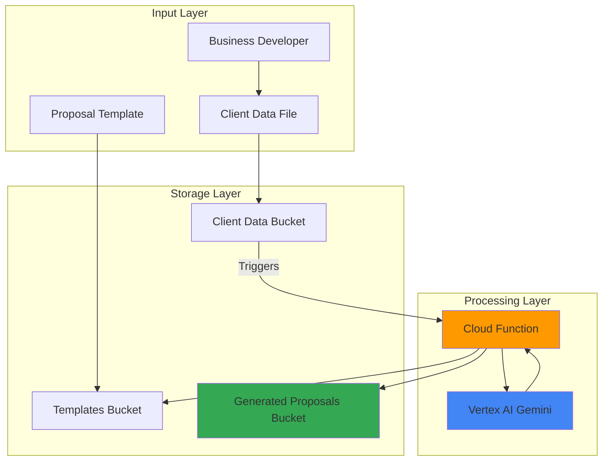

# Business Proposal Generator with Vertex AI and Storage

## Problem

Business development teams waste countless hours creating customized proposals for potential clients, often starting from scratch or manually adapting generic templates. This manual process leads to inconsistent messaging, delayed responses to prospects, and missed opportunities due to the time-intensive nature of proposal creation. Without automation, teams struggle to scale their outreach efforts while maintaining personalization and quality standards.

## Solution

Build an automated business proposal generation system using Vertex AI's Gemini models to create customized proposals from predefined templates and client data. Cloud Functions orchestrates the workflow by triggering proposal generation when client data is uploaded to Cloud Storage, while Vertex AI analyzes client requirements and generates tailored content that maintains consistency and professionalism across all proposals.

## Architecture Diagram



## Prerequisites

1. Google Cloud account with Vertex AI API and Cloud Functions API enabled
2. Google Cloud CLI installed and configured
3. Basic understanding of JavaScript/Node.js and AI/ML concepts
4. Existing proposal templates and sample client data for testing
5. Estimated cost: $5-15 for moderate usage (Vertex AI API calls and Cloud Functions execution)

> **Note**: This configuration follows Google Cloud best practices for serverless AI applications. See [Google Cloud Architecture Center](https://cloud.google.com/architecture) for additional guidance on AI/ML patterns.

## Preparation

```bash
# Set environment variables for GCP resources
export PROJECT_ID="proposal-generator-$(date +%s)"
export REGION="us-central1"
export ZONE="us-central1-a"

# Generate unique suffix for resource names
RANDOM_SUFFIX=$(openssl rand -hex 3)

# Set default project and region
gcloud config set project ${PROJECT_ID}
gcloud config set compute/region ${REGION}
gcloud config set compute/zone ${ZONE}

# Enable required APIs
gcloud services enable cloudfunctions.googleapis.com
gcloud services enable storage.googleapis.com
gcloud services enable aiplatform.googleapis.com
gcloud services enable cloudbuild.googleapis.com

# Create resource names with unique suffix
export TEMPLATES_BUCKET="${PROJECT_ID}-templates-${RANDOM_SUFFIX}"
export CLIENT_DATA_BUCKET="${PROJECT_ID}-client-data-${RANDOM_SUFFIX}"
export OUTPUT_BUCKET="${PROJECT_ID}-generated-proposals-${RANDOM_SUFFIX}"
export FUNCTION_NAME="proposal-generator-${RANDOM_SUFFIX}"

echo "✅ Project configured: ${PROJECT_ID}"
echo "✅ Templates bucket: ${TEMPLATES_BUCKET}"
echo "✅ Client data bucket: ${CLIENT_DATA_BUCKET}"
echo "✅ Output bucket: ${OUTPUT_BUCKET}"
```

## Steps

1. **Create Cloud Storage Buckets for Data Management**:

   Cloud Storage provides the foundation for our proposal generation system, offering global accessibility and seamless integration with Cloud Functions. We'll create three specialized buckets: one for proposal templates, one for client data uploads, and one for generated proposals. This separation ensures organized data management and proper access controls.

   ```bash
   # Create bucket for proposal templates
   gsutil mb -p ${PROJECT_ID} \
       -c STANDARD \
       -l ${REGION} \
       gs://${TEMPLATES_BUCKET}
   
   # Create bucket for client data files
   gsutil mb -p ${PROJECT_ID} \
       -c STANDARD \
       -l ${REGION} \
       gs://${CLIENT_DATA_BUCKET}
   
   # Create bucket for generated proposals
   gsutil mb -p ${PROJECT_ID} \
       -c STANDARD \
       -l ${REGION} \
       gs://${OUTPUT_BUCKET}
   
   echo "✅ Created three storage buckets for the proposal pipeline"
   ```

   The storage buckets are now configured with standard storage class for optimal cost-performance balance, providing the data foundation for our AI-powered proposal generation workflow.

2. **Upload Sample Proposal Template**:

   A well-structured template serves as the foundation for consistent proposal generation. We'll create a sample template that includes placeholders for client-specific information that Vertex AI will populate based on the client data analysis.

   ```bash
   # Create a sample proposal template
   cat > proposal-template.txt << 'EOF'
   BUSINESS PROPOSAL TEMPLATE

   Dear {{CLIENT_NAME}},

   Thank you for considering our services for {{PROJECT_TYPE}}. Based on our understanding of your requirements, we propose the following solution:

   PROJECT OVERVIEW:
   {{PROJECT_OVERVIEW}}

   SOLUTION APPROACH:
   {{SOLUTION_APPROACH}}

   TIMELINE:
   {{TIMELINE}}

   INVESTMENT:
   {{INVESTMENT}}

   NEXT STEPS:
   {{NEXT_STEPS}}

   We look forward to partnering with you.

   Best regards,
   Business Development Team
   EOF
   
   # Upload template to Cloud Storage
   gsutil cp proposal-template.txt gs://${TEMPLATES_BUCKET}/
   
   echo "✅ Uploaded proposal template to storage"
   ```

   The template is now stored in Cloud Storage, ready to be retrieved and populated by our AI-powered function with client-specific content.

3. **Create Sample Client Data File**:

   Client data files contain the specific information that Vertex AI will analyze to generate personalized proposal content. This structured approach ensures consistent input format and enables the AI to extract relevant details for proposal customization.

   ```bash
   # Create sample client data in JSON format
   cat > client-data.json << 'EOF'
   {
     "client_name": "TechCorp Solutions",
     "industry": "Financial Services",
     "project_type": "Digital Transformation Initiative",
     "requirements": [
       "Modernize legacy banking systems",
       "Implement cloud-native architecture",
       "Enhance mobile banking experience",
       "Ensure regulatory compliance"
     ],
     "timeline": "6-month implementation",
     "budget_range": "$500K - $1M",
     "key_stakeholders": [
       "CTO - Technology Strategy",
       "Head of Digital - User Experience",
       "Compliance Officer - Regulatory Requirements"
     ],
     "success_metrics": [
       "50% reduction in system response time",
       "90% customer satisfaction score",
       "100% regulatory compliance"
     ]
   }
   EOF
   
   echo "✅ Created sample client data file"
   ```

   This structured client data provides comprehensive context for Vertex AI to generate relevant and personalized proposal content.

4. **Create Cloud Function for Proposal Generation**:

   Cloud Functions provides serverless execution that automatically triggers when client data is uploaded, eliminating the need for infrastructure management. Our function will integrate with Vertex AI to analyze client requirements and generate customized proposals.

   ```bash
   # Create function directory and navigate to it
   mkdir proposal-function && cd proposal-function
   
   # Create package.json for Node.js dependencies
   cat > package.json << 'EOF'
   {
     "name": "proposal-generator",
     "version": "1.0.0",
     "description": "AI-powered business proposal generator",
     "main": "index.js",
     "dependencies": {
       "@google-cloud/vertexai": "^1.0.0",
       "@google-cloud/storage": "^7.0.0",
       "@google-cloud/functions-framework": "^3.0.0"
     }
   }
   EOF
   
   echo "✅ Created package.json with required dependencies"
   ```

   The package configuration includes the essential Google Cloud client libraries for seamless integration with Vertex AI and Cloud Storage services.

5. **Implement Proposal Generation Logic**:

   The function implementation leverages Vertex AI's Gemini model to analyze client data and generate professional, tailored proposals. This serverless approach ensures scalability and cost-effectiveness while maintaining high-quality output.

   ```bash
   # Create the main function implementation
   cat > index.js << 'EOF'
   const { Storage } = require('@google-cloud/storage');
   const { VertexAI } = require('@google-cloud/vertexai');
   const functions = require('@google-cloud/functions-framework');

   const storage = new Storage();

   functions.cloudEvent('generateProposal', async (cloudEvent) => {
     try {
       console.log('Proposal generation triggered by:', cloudEvent.data.name);
       
       const bucketName = cloudEvent.data.bucket;
       const fileName = cloudEvent.data.name;
       
       // Skip if not a client data file
       if (!fileName.endsWith('.json')) {
         console.log('Skipping non-JSON file:', fileName);
         return;
       }
       
       // Download client data
       const clientDataFile = storage.bucket(bucketName).file(fileName);
       const [clientDataContent] = await clientDataFile.download();
       const clientData = JSON.parse(clientDataContent.toString());
       
       // Download proposal template
       const templateBucket = process.env.TEMPLATES_BUCKET;
       const templateFile = storage.bucket(templateBucket).file('proposal-template.txt');
       const [templateContent] = await templateFile.download();
       const template = templateContent.toString();
       
       // Initialize Vertex AI
       const projectId = process.env.GOOGLE_CLOUD_PROJECT;
       const location = process.env.REGION || 'us-central1';
       
       const vertexAI = new VertexAI({
         project: projectId,
         location: location
       });
       
       const generativeModel = vertexAI.getGenerativeModel({
         model: 'gemini-1.5-flash',
         generationConfig: {
           maxOutputTokens: 2048,
           temperature: 0.3,
           topP: 0.8,
           topK: 40
         }
       });
       
       // Generate proposal using Vertex AI
       const prompt = `You are a professional business proposal writer. Based on the following client data, 
       generate specific content for each section of the proposal template.
       
       Client Data:
       ${JSON.stringify(clientData, null, 2)}
       
       Template:
       ${template}
       
       Please provide specific, professional content for each placeholder ({{...}}) in the template.
       Make the content relevant to the client's industry, requirements, and objectives.
       Ensure the tone is professional and persuasive.
       Return the complete proposal with all placeholders filled in.`;
       
       const request = {
         contents: [{
           role: 'user',
           parts: [{ text: prompt }]
         }]
       };
       
       const result = await generativeModel.generateContent(request);
       const response = result.response;
       const generatedContent = response.candidates[0].content.parts[0].text;
       
       // Save generated proposal
       const outputBucket = process.env.OUTPUT_BUCKET;
       const outputFileName = `proposal-${clientData.client_name.replace(/\s+/g, '-').toLowerCase()}-${Date.now()}.txt`;
       
       await storage.bucket(outputBucket).file(outputFileName).save(generatedContent);
       
       console.log(`✅ Generated proposal saved as: ${outputFileName}`);
       
     } catch (error) {
       console.error('Error generating proposal:', error);
       throw error;
     }
   });
   EOF
   
   echo "✅ Created proposal generation function implementation"
   ```

   The function implements intelligent proposal generation using Vertex AI's current Node.js SDK with optimized parameters for professional content creation, ensuring consistent quality and relevance.

6. **Deploy Cloud Function with Storage Trigger**:

   Deploying the function with a Cloud Storage trigger creates an event-driven architecture that automatically processes new client data uploads. This serverless approach ensures immediate response to new opportunities while maintaining cost efficiency.

   ```bash
   # Deploy function with Cloud Storage trigger
   gcloud functions deploy ${FUNCTION_NAME} \
       --runtime nodejs20 \
       --trigger-bucket ${CLIENT_DATA_BUCKET} \
       --source . \
       --entry-point generateProposal \
       --memory 512MB \
       --timeout 540s \
       --set-env-vars "TEMPLATES_BUCKET=${TEMPLATES_BUCKET},OUTPUT_BUCKET=${OUTPUT_BUCKET},REGION=${REGION}"
   
   # Wait for deployment to complete
   sleep 30
   
   echo "✅ Cloud Function deployed with storage trigger"
   ```

   The function is now deployed with appropriate memory allocation and timeout settings, ready to process client data uploads and generate proposals automatically.

7. **Test Proposal Generation Workflow**:

   Testing the complete workflow validates the integration between Cloud Storage, Cloud Functions, and Vertex AI. This end-to-end test ensures the system can handle real-world proposal generation scenarios.

   ```bash
   # Return to parent directory
   cd ..
   
   # Upload client data to trigger the function
   gsutil cp client-data.json gs://${CLIENT_DATA_BUCKET}/
   
   # Wait for function execution
   echo "Waiting for proposal generation..."
   sleep 45
   
   # Check function logs
   gcloud functions logs read ${FUNCTION_NAME} --limit 10
   
   echo "✅ Proposal generation workflow triggered"
   ```

   The workflow test demonstrates the seamless integration of storage triggers, serverless computing, and AI-powered content generation for automated proposal creation.

## Validation & Testing

1. **Verify Generated Proposal Output**:

   ```bash
   # List generated proposals in output bucket
   gsutil ls gs://${OUTPUT_BUCKET}/
   
   # Download and review the generated proposal
   PROPOSAL_FILE=$(gsutil ls gs://${OUTPUT_BUCKET}/ | head -1 | sed 's|gs://[^/]*/||')
   gsutil cp gs://${OUTPUT_BUCKET}/${PROPOSAL_FILE} ./generated-proposal.txt
   
   # Display the generated content
   echo "Generated Proposal Content:"
   cat generated-proposal.txt
   ```

   Expected output: A professionally formatted proposal with client-specific content populated in all template placeholders.

2. **Test Function Performance and Monitoring**:

   ```bash
   # Check function execution metrics
   gcloud functions describe ${FUNCTION_NAME} \
       --format="table(status,updateTime,sourceArchiveUrl)"
   
   # Verify function environment variables
   gcloud functions describe ${FUNCTION_NAME} \
       --format="value(environmentVariables)"
   ```

   Expected output: Function status should show "ACTIVE" with recent update time and properly configured environment variables.

3. **Validate AI Model Integration**:

   ```bash
   # Upload additional test data to verify consistency
   cat > test-client-2.json << 'EOF'
   {
     "client_name": "RetailMax Inc",
     "industry": "E-commerce",
     "project_type": "Customer Analytics Platform",
     "requirements": [
       "Real-time customer behavior tracking",
       "Predictive analytics for inventory",
       "Personalized recommendation engine"
     ],
     "timeline": "4-month implementation",
     "budget_range": "$300K - $600K"
   }
   EOF
   
   # Upload second test case
   gsutil cp test-client-2.json gs://${CLIENT_DATA_BUCKET}/
   
   # Wait and check for second proposal
   sleep 45
   gsutil ls gs://${OUTPUT_BUCKET}/ | wc -l
   ```

   Expected output: Two proposal files in the output bucket, demonstrating consistent AI-powered generation for different client scenarios.

## Cleanup

1. **Remove Cloud Function and Associated Resources**:

   ```bash
   # Delete the Cloud Function
   gcloud functions delete ${FUNCTION_NAME} \
       --region ${REGION} \
       --quiet
   
   echo "✅ Deleted Cloud Function"
   ```

2. **Remove Cloud Storage Buckets and Contents**:

   ```bash
   # Remove all storage buckets and their contents
   gsutil -m rm -r gs://${TEMPLATES_BUCKET}
   gsutil -m rm -r gs://${CLIENT_DATA_BUCKET}
   gsutil -m rm -r gs://${OUTPUT_BUCKET}
   
   echo "✅ Deleted all storage buckets"
   ```

3. **Clean Up Local Files**:

   ```bash
   # Remove local files and directories
   rm -rf proposal-function/
   rm -f proposal-template.txt client-data.json test-client-2.json generated-proposal.txt
   
   # Clear environment variables
   unset PROJECT_ID REGION ZONE RANDOM_SUFFIX
   unset TEMPLATES_BUCKET CLIENT_DATA_BUCKET OUTPUT_BUCKET FUNCTION_NAME
   
   echo "✅ Cleaned up local files and environment variables"
   ```

## Discussion

This business proposal generator demonstrates the power of combining Google Cloud's serverless computing with advanced AI capabilities to automate content creation workflows. The architecture leverages Cloud Functions' event-driven model to create a responsive system that processes client data uploads immediately, while Vertex AI's Gemini models ensure high-quality, contextually relevant proposal content.

The solution addresses several key business challenges: reducing manual effort in proposal creation, ensuring consistency across all client communications, and enabling rapid response to new opportunities. By structuring client data in JSON format and using templated approaches, the system maintains flexibility while providing standardized outputs that meet professional standards.

The integration pattern showcased here—storage triggers activating serverless functions that call AI services—represents a modern approach to business process automation. This pattern is particularly effective for document generation, content personalization, and knowledge work that benefits from AI augmentation. The pay-per-use model of both Cloud Functions and Vertex AI ensures cost efficiency, making this solution accessible to businesses of various sizes.

Performance considerations include optimizing the Vertex AI model parameters for consistent output quality and implementing proper error handling for production deployments. The system can be enhanced with additional features like approval workflows, version control for templates, and integration with CRM systems for seamless business development processes. The updated implementation uses the current Vertex AI Node.js SDK, ensuring compatibility with the latest Google Cloud AI platform capabilities.

> **Tip**: Monitor Vertex AI API costs closely during development and implement request caching for frequently similar client profiles to optimize expenses while maintaining response quality.

**Documentation Sources:**
- [Vertex AI documentation](https://cloud.google.com/vertex-ai/docs/) - Comprehensive guide to Google's unified ML platform
- [Cloud Functions documentation](https://cloud.google.com/functions/docs/) - Serverless computing platform for event-driven applications  
- [Cloud Storage documentation](https://cloud.google.com/storage/docs/) - Object storage service for data management
- [Vertex AI Node.js Client](https://github.com/googleapis/nodejs-vertexai) - Official Node.js client library for Vertex AI
- [Google Cloud Architecture Center](https://cloud.google.com/architecture/) - Best practices and patterns for cloud solutions

## Challenge

Extend this solution by implementing these enhancements:

1. **Multi-language Proposal Support**: Integrate Cloud Translation API to generate proposals in multiple languages based on client preferences, expanding global business reach.

2. **Advanced Template Management**: Create a web interface using Cloud Run and Firestore to allow business teams to upload, version, and manage proposal templates without technical expertise.

3. **Client Sentiment Analysis**: Add Natural Language API integration to analyze client communication history and adjust proposal tone and emphasis based on sentiment analysis results.

4. **Approval Workflow Integration**: Implement a Pub/Sub-based approval system where generated proposals require manager approval before final delivery, including email notifications and tracking.

5. **CRM Integration**: Connect with external CRM systems using Cloud Workflows to automatically pull client data and push generated proposals back to the appropriate opportunity records.

## Infrastructure Code

### Available Infrastructure as Code:

- [Infrastructure Code Overview](code/README.md) - Detailed description of all infrastructure components
- [Infrastructure Manager](code/infrastructure-manager/) - GCP Infrastructure Manager templates
- [Bash CLI Scripts](code/scripts/) - Example bash scripts using gcloud CLI commands to deploy infrastructure
- [Terraform](code/terraform/) - Terraform configuration files