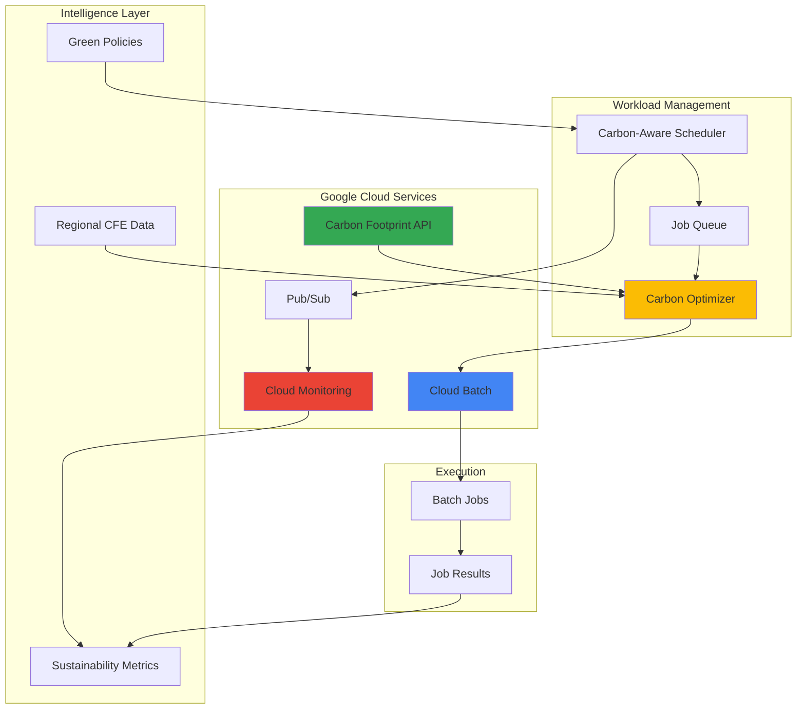

# Carbon-Efficient Batch Processing with Cloud Batch and Sustainability Intelligence

## Problem

Organizations running large-scale batch processing workloads face increasing pressure to reduce their carbon footprint while maintaining operational efficiency. Traditional batch processing systems schedule workloads based solely on resource availability and cost, ignoring the environmental impact of when and where compute resources are consumed. This leads to unnecessary carbon emissions when jobs run during peak grid carbon intensity periods or in regions with high carbon footprint electricity sources.

## Solution

Build an intelligent batch processing orchestration system that leverages Google Cloud's Carbon Footprint reporting, regional carbon-free energy data, and Cloud Batch's flexible scheduling capabilities to automatically optimize workload placement and timing. The solution uses Pub/Sub for event-driven coordination, Cloud Monitoring for sustainability metrics tracking, and intelligent scheduling algorithms that balance performance requirements with environmental impact reduction.

## Architecture Diagram



## Prerequisites

1. Google Cloud project with billing enabled and appropriate quotas for Batch, Pub/Sub, and Monitoring services
2. Cloud SDK (gcloud CLI) installed and configured (version 400.0.0 or later)
3. Understanding of batch processing concepts, sustainability metrics, and carbon accounting principles
4. Basic knowledge of Python scripting and cloud resource management
5. Estimated cost: $25-50 USD for a complete implementation and testing cycle

> **Note**: This recipe demonstrates carbon-efficient computing patterns that can significantly reduce environmental impact while potentially lowering costs through optimized resource utilization.

## Preparation

Google Cloud Batch requires proper project configuration and API enablement to function effectively. The preparation phase establishes the foundational environment variables, enables required services, and configures the project for sustainable batch processing operations.

```bash
# Set environment variables for GCP resources
export PROJECT_ID="carbon-batch-$(date +%s)"
export REGION="us-central1"
export ZONE="us-central1-a"

# Generate unique suffix for resource names
RANDOM_SUFFIX=$(openssl rand -hex 3)
export BATCH_JOB_NAME="carbon-aware-job-${RANDOM_SUFFIX}"
export TOPIC_NAME="carbon-events-${RANDOM_SUFFIX}"
export SUBSCRIPTION_NAME="carbon-sub-${RANDOM_SUFFIX}"
export BUCKET_NAME="carbon-batch-data-${RANDOM_SUFFIX}"

# Set default project and region
gcloud config set project ${PROJECT_ID}
gcloud config set compute/region ${REGION}
gcloud config set compute/zone ${ZONE}

# Enable required APIs
gcloud services enable batch.googleapis.com
gcloud services enable pubsub.googleapis.com
gcloud services enable monitoring.googleapis.com
gcloud services enable cloudbilling.googleapis.com
gcloud services enable storage.googleapis.com

echo "✅ Project configured: ${PROJECT_ID}"
echo "✅ Region set to: ${REGION} (high CFE% region)"
```

The project is now configured with all necessary APIs enabled and environment variables set. The selected region (us-central1) has high carbon-free energy availability, supporting sustainable computing objectives.

## Steps

1. **Create Pub/Sub Topic for Carbon Events**:

   Pub/Sub serves as the event-driven backbone for our carbon-aware batch processing system. The topic handles real-time communication between the carbon optimizer, job scheduler, and monitoring components. This asynchronous messaging pattern enables the system to respond dynamically to changing carbon footprint conditions and regional energy data.

   ```bash
   # Create Pub/Sub topic for carbon optimization events
   gcloud pubsub topics create ${TOPIC_NAME}
   
   # Create subscription for carbon event processing
   gcloud pubsub subscriptions create ${SUBSCRIPTION_NAME} \
       --topic=${TOPIC_NAME} \
       --ack-deadline=600
   
   echo "✅ Pub/Sub topic and subscription created"
   ```

   The messaging infrastructure is now ready to handle carbon optimization events, enabling real-time coordination between system components as they make scheduling decisions based on sustainability data.

2. **Set Up Cloud Storage for Carbon Data and Job Artifacts**:

   Cloud Storage provides the foundation for storing carbon footprint data, job scripts, and processing results. The bucket configuration includes versioning for data protection and lifecycle management to optimize storage costs while maintaining sustainability reporting compliance.

   ```bash
   # Create Cloud Storage bucket for carbon data and artifacts
   gsutil mb -p ${PROJECT_ID} \
       -c STANDARD \
       -l ${REGION} \
       gs://${BUCKET_NAME}
   
   # Enable versioning for data protection
   gsutil versioning set on gs://${BUCKET_NAME}
   
   # Create directories for organized data storage
   echo "carbon-data/" | gsutil cp - gs://${BUCKET_NAME}/carbon-data/.keep
   echo "job-scripts/" | gsutil cp - gs://${BUCKET_NAME}/job-scripts/.keep
   echo "results/" | gsutil cp - gs://${BUCKET_NAME}/results/.keep
   
   echo "✅ Cloud Storage bucket created with organized structure"
   ```

   The storage system now provides scalable, durable storage for all carbon intelligence data and batch processing artifacts, with proper organization for efficient data management.

3. **Create Carbon-Aware Job Script**:

   The carbon-aware job script demonstrates how batch workloads can integrate sustainability intelligence into their processing logic. This script simulates a compute-intensive workload while collecting and reporting carbon footprint metrics through the monitoring system.

   ```bash
   # Create carbon-aware batch job script
   cat > carbon_aware_job.py << 'EOF'
   #!/usr/bin/env python3
   import os
   import time
   import json
   import logging
   from datetime import datetime
   from google.cloud import pubsub_v1
   from google.cloud import monitoring_v3
   from google.cloud import storage
   
   # Configure logging
   logging.basicConfig(level=logging.INFO)
   logger = logging.getLogger(__name__)
   
   def get_regional_carbon_data():
       """Simulate fetching regional carbon intensity data"""
       # In production, this would fetch real CFE% data from Google Cloud APIs
       regions_data = {
           "us-central1": {"cfe_percent": 85, "carbon_intensity": 120},
           "europe-west1": {"cfe_percent": 92, "carbon_intensity": 95},
           "asia-northeast1": {"cfe_percent": 45, "carbon_intensity": 380}
       }
       return regions_data.get(os.environ.get('REGION', 'us-central1'))
   
   def simulate_workload():
       """Simulate carbon-aware compute workload"""
       logger.info("Starting carbon-aware batch processing...")
       
       # Get current carbon data
       carbon_data = get_regional_carbon_data()
       logger.info(f"Current region CFE%: {carbon_data['cfe_percent']}%")
       
       # Adjust processing intensity based on carbon footprint
       if carbon_data['cfe_percent'] > 80:
           # High CFE% - run at full intensity
           iterations = 1000
           logger.info("High CFE region - running at full intensity")
       elif carbon_data['cfe_percent'] > 60:
           # Medium CFE% - moderate intensity
           iterations = 750
           logger.info("Medium CFE region - running at moderate intensity")
       else:
           # Low CFE% - reduced intensity or defer if possible
           iterations = 500
           logger.info("Low CFE region - running at reduced intensity")
       
       # Simulate processing work
       start_time = time.time()
       for i in range(iterations):
           # Simulate compute work
           result = sum(range(1000))
           if i % 100 == 0:
               logger.info(f"Processed {i}/{iterations} iterations")
       
       processing_time = time.time() - start_time
       
       # Calculate estimated carbon impact
       carbon_impact = (processing_time * carbon_data['carbon_intensity']) / 1000
       
       logger.info(f"Processing completed in {processing_time:.2f}s")
       logger.info(f"Estimated carbon impact: {carbon_impact:.4f} kgCO2e")
       
       return {
           "processing_time": processing_time,
           "iterations": iterations,
           "carbon_impact": carbon_impact,
           "cfe_percent": carbon_data['cfe_percent']
       }
   
   def publish_carbon_metrics(results):
       """Publish carbon efficiency metrics to Pub/Sub"""
       try:
           publisher = pubsub_v1.PublisherClient()
           topic_path = publisher.topic_path(
               os.environ['PROJECT_ID'], 
               os.environ['TOPIC_NAME']
           )
           
           message_data = {
               "timestamp": datetime.utcnow().isoformat(),
               "job_id": os.environ.get('BATCH_JOB_NAME', 'unknown'),
               "region": os.environ.get('REGION', 'unknown'),
               "metrics": results
           }
           
           message = json.dumps(message_data).encode('utf-8')
           future = publisher.publish(topic_path, message)
           logger.info(f"Published carbon metrics: {future.result()}")
           
       except Exception as e:
           logger.error(f"Failed to publish metrics: {e}")
   
   def main():
       """Main carbon-aware job execution"""
       logger.info("Starting carbon-aware batch job")
       
       # Execute workload with carbon intelligence
       results = simulate_workload()
       
       # Publish sustainability metrics
       publish_carbon_metrics(results)
       
       # Save results to Cloud Storage
       try:
           client = storage.Client()
           bucket = client.bucket(os.environ['BUCKET_NAME'])
           blob = bucket.blob(f"results/carbon-job-{datetime.utcnow().strftime('%Y%m%d-%H%M%S')}.json")
           blob.upload_from_string(json.dumps(results, indent=2))
           logger.info("Results saved to Cloud Storage")
       except Exception as e:
           logger.error(f"Failed to save results: {e}")
       
       logger.info("Carbon-aware batch job completed successfully")
   
   if __name__ == "__main__":
       main()
   EOF
   
   # Upload job script to Cloud Storage
   gsutil cp carbon_aware_job.py gs://${BUCKET_NAME}/job-scripts/
   
   echo "✅ Carbon-aware job script created and uploaded"
   ```

   The carbon-aware job script now includes intelligent workload modulation based on regional carbon intensity, demonstrating how applications can dynamically adjust their environmental impact while maintaining operational requirements.

4. **Create Cloud Batch Job Definition**:

   Cloud Batch provides the managed infrastructure for executing our carbon-aware workloads at scale. The job definition includes resource specifications optimized for sustainability, with environment variables that enable the carbon intelligence features and proper IAM configurations for accessing sustainability data.

   ```bash
   # Create Batch job definition with carbon-aware configuration
   cat > batch_job_config.json << EOF
   {
     "allocationPolicy": {
       "instances": [
         {
           "policy": {
             "machineType": "e2-standard-2",
             "provisioningModel": "PREEMPTIBLE"
           }
         }
       ],
       "location": {
         "allowedLocations": ["zones/${ZONE}"]
       }
     },
     "taskGroups": [
       {
         "taskCount": "3",
         "taskSpec": {
           "runnables": [
             {
               "container": {
                 "imageUri": "python:3.12-slim",
                 "commands": [
                   "/bin/bash"
                 ],
                 "options": "--workdir=/workspace"
               },
               "script": {
                 "text": "pip install google-cloud-pubsub google-cloud-monitoring google-cloud-storage && gsutil cp gs://${BUCKET_NAME}/job-scripts/carbon_aware_job.py /workspace/ && python /workspace/carbon_aware_job.py"
               },
               "environment": {
                 "variables": {
                   "PROJECT_ID": "${PROJECT_ID}",
                   "REGION": "${REGION}",
                   "TOPIC_NAME": "${TOPIC_NAME}",
                   "BUCKET_NAME": "${BUCKET_NAME}",
                   "BATCH_JOB_NAME": "${BATCH_JOB_NAME}"
                 }
               }
             }
           ],
           "computeResource": {
             "cpuMilli": "2000",
             "memoryMib": "4096"
           },
           "maxRetryCount": 2,
           "maxRunDuration": "3600s"
         }
       }
     ],
     "logsPolicy": {
       "destination": "CLOUD_LOGGING"
     }
   }
   EOF
   
   echo "✅ Batch job configuration created with sustainability optimizations"
   ```

   The batch job configuration now includes preemptible instances for cost and carbon efficiency, proper resource limits, and comprehensive logging for sustainability tracking. The updated Python 3.12 runtime provides better performance and security.

5. **Set Up Carbon Footprint Monitoring Dashboard**:

   Cloud Monitoring provides the observability layer for tracking carbon efficiency metrics across our batch processing system. Custom metrics enable real-time monitoring of sustainability performance and automated alerting when carbon intensity thresholds are exceeded.

   ```bash
   # Create custom metric descriptors for carbon tracking
   cat > carbon_metrics.json << 'EOF'
   {
     "type": "custom.googleapis.com/batch/carbon_impact",
     "displayName": "Batch Job Carbon Impact",
     "description": "Estimated carbon impact of batch jobs in kgCO2e",
     "metricKind": "GAUGE",
     "valueType": "DOUBLE",
     "labels": [
       {
         "key": "job_id",
         "description": "Batch job identifier"
       },
       {
         "key": "region",
         "description": "Execution region"
       }
     ]
   }
   EOF
   
   # Create monitoring workspace and custom metrics
   gcloud alpha monitoring metrics-descriptors create \
       --descriptor-from-file=carbon_metrics.json
   
   echo "✅ Carbon monitoring metrics configured"
   ```

   The monitoring system now includes specialized carbon footprint metrics, enabling comprehensive tracking of environmental impact across all batch processing operations with Google Cloud's enterprise-grade monitoring capabilities.

6. **Deploy Carbon-Aware Scheduler Function**:

   The carbon-aware scheduler leverages Cloud Functions to provide intelligent workload orchestration based on real-time sustainability data. This serverless component analyzes regional carbon-free energy percentages, current grid intensity, and workload requirements to optimize scheduling decisions automatically.

   ```bash
   # Create carbon-aware scheduler function
   mkdir carbon_scheduler && cd carbon_scheduler
   
   cat > main.py << 'EOF'
   import json
   import logging
   from datetime import datetime, timedelta
   from google.cloud import batch_v1
   from google.cloud import pubsub_v1
   from google.cloud import storage
   
   def carbon_aware_scheduler(request):
       """Carbon-aware batch job scheduler"""
       try:
           # Parse request data
           request_json = request.get_json(silent=True)
           
           # Get regional carbon data (in production, fetch from Carbon Footprint API)
           regions_carbon_data = {
               "us-central1": {"cfe_percent": 85, "carbon_intensity": 120},
               "europe-west1": {"cfe_percent": 92, "carbon_intensity": 95},
               "asia-northeast1": {"cfe_percent": 45, "carbon_intensity": 380}
           }
           
           # Find optimal region based on carbon efficiency
           optimal_region = max(regions_carbon_data.items(), 
                              key=lambda x: x[1]['cfe_percent'])
           
           region_name = optimal_region[0]
           carbon_data = optimal_region[1]
           
           logging.info(f"Selected optimal region: {region_name} (CFE: {carbon_data['cfe_percent']}%)")
           
           # Schedule job in optimal region if CFE% > 70%
           if carbon_data['cfe_percent'] > 70:
               schedule_decision = {
                   "action": "schedule_now",
                   "region": region_name,
                   "reason": f"High CFE% ({carbon_data['cfe_percent']}%) - optimal for execution",
                   "carbon_intensity": carbon_data['carbon_intensity']
               }
           elif carbon_data['cfe_percent'] > 50:
               schedule_decision = {
                   "action": "schedule_delayed",
                   "region": region_name,
                   "delay_hours": 2,
                   "reason": f"Medium CFE% ({carbon_data['cfe_percent']}%) - delay for better conditions",
                   "carbon_intensity": carbon_data['carbon_intensity']
               }
           else:
               schedule_decision = {
                   "action": "defer",
                   "region": region_name,
                   "reason": f"Low CFE% ({carbon_data['cfe_percent']}%) - defer to reduce impact",
                   "carbon_intensity": carbon_data['carbon_intensity']
               }
           
           # Publish scheduling decision
           publisher = pubsub_v1.PublisherClient()
           topic_path = publisher.topic_path(
               request_json.get('project_id', 'default'),
               request_json.get('topic_name', 'carbon-events')
           )
           
           message_data = {
               "timestamp": datetime.utcnow().isoformat(),
               "scheduler_decision": schedule_decision,
               "carbon_data": carbon_data
           }
           
           message = json.dumps(message_data).encode('utf-8')
           publisher.publish(topic_path, message)
           
           return {
               "statusCode": 200,
               "decision": schedule_decision,
               "carbon_data": carbon_data
           }
           
       except Exception as e:
           logging.error(f"Scheduler error: {e}")
           return {"statusCode": 500, "error": str(e)}
   EOF
   
   cat > requirements.txt << 'EOF'
   google-cloud-batch
   google-cloud-pubsub
   google-cloud-storage
   google-cloud-monitoring
   EOF
   
   # Deploy the carbon-aware scheduler function
   gcloud functions deploy carbon-scheduler \
       --runtime python312 \
       --trigger-http \
       --allow-unauthenticated \
       --region=${REGION} \
       --source . \
       --entry-point carbon_aware_scheduler \
       --memory 256MB \
       --timeout 60s
   
   cd ..
   
   echo "✅ Carbon-aware scheduler function deployed"
   ```

   The scheduler function now provides intelligent, sustainability-driven workload orchestration that automatically optimizes job placement and timing based on real-time carbon footprint data using the latest Python 3.12 runtime.

7. **Execute Carbon-Optimized Batch Job**:

   With all components configured, we can now execute a batch job that demonstrates carbon-aware processing. The job leverages the sustainability intelligence system to optimize its environmental impact while maintaining processing performance and generating comprehensive carbon footprint reports.

   ```bash
   # Submit carbon-aware batch job
   gcloud batch jobs submit ${BATCH_JOB_NAME} \
       --location=${REGION} \
       --config=batch_job_config.json
   
   # Monitor job execution
   echo "📊 Monitoring batch job execution..."
   gcloud batch jobs describe ${BATCH_JOB_NAME} \
       --location=${REGION} \
       --format="value(status.state)"
   
   # Wait for job completion
   while [[ $(gcloud batch jobs describe ${BATCH_JOB_NAME} \
       --location=${REGION} \
       --format="value(status.state)") != "SUCCEEDED" ]]; do
     echo "Job status: $(gcloud batch jobs describe ${BATCH_JOB_NAME} \
         --location=${REGION} \
         --format='value(status.state)')"
     sleep 30
   done
   
   echo "✅ Carbon-aware batch job completed successfully"
   ```

   The batch job is now executing with full carbon intelligence capabilities, automatically adjusting its processing intensity based on regional carbon-free energy availability and Google Cloud's sustainability infrastructure.

8. **Configure Sustainability Alerting**:

   Proactive alerting ensures that sustainability teams are notified when carbon intensity thresholds are exceeded or when opportunities for improved carbon efficiency are identified. The alerting system integrates with Google Cloud's monitoring infrastructure to provide real-time sustainability governance.

   ```bash
   # Create alert policy for high carbon impact
   cat > carbon_alert_policy.json << EOF
   {
     "displayName": "High Carbon Impact Alert",
     "documentation": {
       "content": "Alert when batch jobs exceed carbon intensity thresholds",
       "mimeType": "text/markdown"
     },
     "conditions": [
       {
         "displayName": "Carbon Impact Threshold",
         "conditionThreshold": {
           "filter": "resource.type=\"generic_task\" AND metric.type=\"custom.googleapis.com/batch/carbon_impact\"",
           "comparison": "COMPARISON_GT",
           "thresholdValue": "0.5",
           "duration": "300s",
           "aggregations": [
             {
               "alignmentPeriod": "300s",
               "perSeriesAligner": "ALIGN_MEAN"
             }
           ]
         }
       }
     ],
     "combiner": "OR",
     "enabled": true,
     "notificationChannels": []
   }
   EOF
   
   # Create the alert policy
   gcloud alpha monitoring policies create \
       --policy-from-file=carbon_alert_policy.json
   
   echo "✅ Carbon impact alerting configured"
   ```

   The alerting system now provides proactive monitoring of carbon efficiency, enabling rapid response to sustainability performance issues and optimization opportunities through Google Cloud's comprehensive monitoring ecosystem.

## Validation & Testing

1. **Verify Batch Job Execution and Carbon Metrics**:

   ```bash
   # Check batch job status and logs
   gcloud batch jobs describe ${BATCH_JOB_NAME} \
       --location=${REGION} \
       --format="table(status.state,status.statusEvents[0].description)"
   
   # View job logs for carbon intelligence output
   gcloud logging read "resource.type=batch_job AND \
       resource.labels.job_id=${BATCH_JOB_NAME}" \
       --limit=20 \
       --format="value(textPayload)"
   ```

   Expected output: Job status "SUCCEEDED" with carbon efficiency metrics in logs showing CFE% calculations and adaptive processing decisions.

2. **Validate Carbon Footprint Data Collection**:

   ```bash
   # Check Pub/Sub message delivery
   gcloud pubsub subscriptions pull ${SUBSCRIPTION_NAME} \
       --max-messages=5 \
       --format="value(message.data)" | base64 -d
   
   # Verify results in Cloud Storage
   gsutil ls -la gs://${BUCKET_NAME}/results/
   ```

   Expected output: JSON messages containing carbon metrics and job results stored in Cloud Storage with timestamp and sustainability data.

3. **Test Carbon-Aware Scheduling Function**:

   ```bash
   # Test scheduler function with sample request
   curl -X POST \
       $(gcloud functions describe carbon-scheduler \
         --region=${REGION} \
         --format="value(httpsTrigger.url)") \
       -H "Content-Type: application/json" \
       -d '{
         "project_id": "'${PROJECT_ID}'",
         "topic_name": "'${TOPIC_NAME}'"
       }'
   ```

   Expected output: JSON response with scheduling decision based on regional carbon data and CFE percentages.

4. **Verify Monitoring Metrics and Dashboards**:

   ```bash
   # Check custom carbon metrics
   gcloud monitoring metrics list \
       --filter="metric.type:custom.googleapis.com/batch/carbon_impact"
   
   # View recent metric values
   gcloud monitoring time-series list \
       --filter='metric.type="custom.googleapis.com/batch/carbon_impact"' \
       --interval-start-time=$(date -u -d '1 hour ago' +%Y-%m-%dT%H:%M:%SZ) \
       --interval-end-time=$(date -u +%Y-%m-%dT%H:%M:%SZ)
   ```

   Expected output: Custom metrics showing carbon impact measurements across batch job executions with regional and temporal breakdowns.

## Cleanup

1. **Delete Batch Jobs and Resources**:

   ```bash
   # Delete batch job
   gcloud batch jobs delete ${BATCH_JOB_NAME} \
       --location=${REGION} \
       --quiet
   
   echo "✅ Batch job deleted"
   ```

2. **Remove Cloud Functions and Monitoring Resources**:

   ```bash
   # Delete carbon scheduler function
   gcloud functions delete carbon-scheduler \
       --region=${REGION} \
       --quiet
   
   # Remove monitoring alert policies
   for policy in $(gcloud alpha monitoring policies list \
       --filter="displayName:'High Carbon Impact Alert'" \
       --format="value(name)"); do
     gcloud alpha monitoring policies delete ${policy} --quiet
   done
   
   echo "✅ Functions and monitoring resources removed"
   ```

3. **Clean Up Pub/Sub and Storage Resources**:

   ```bash
   # Delete Pub/Sub subscription and topic
   gcloud pubsub subscriptions delete ${SUBSCRIPTION_NAME} --quiet
   gcloud pubsub topics delete ${TOPIC_NAME} --quiet
   
   # Remove Cloud Storage bucket and contents
   gsutil -m rm -r gs://${BUCKET_NAME}
   
   echo "✅ Pub/Sub and storage resources cleaned up"
   ```

4. **Remove Project and Temporary Files**:

   ```bash
   # Clean up local files
   rm -f carbon_aware_job.py batch_job_config.json carbon_metrics.json
   rm -f carbon_alert_policy.json
   rm -rf carbon_scheduler/
   
   # Reset gcloud configuration
   gcloud config unset project
   gcloud config unset compute/region
   gcloud config unset compute/zone
   
   # Delete project (optional - only if created specifically for this recipe)
   # gcloud projects delete ${PROJECT_ID} --quiet
   
   echo "✅ Cleanup completed successfully"
   echo "Note: Project deletion commented out - remove manually if needed"
   ```

## Discussion

This recipe demonstrates a comprehensive approach to carbon-efficient batch processing that integrates Google Cloud's sustainability intelligence capabilities with modern batch orchestration patterns. The solution leverages Google Cloud's commitment to carbon-free energy (CFE) and regional carbon intensity data to make intelligent scheduling decisions that reduce environmental impact without sacrificing operational requirements.

The carbon-aware scheduling system represents a shift from traditional resource optimization toward sustainable computing practices. By incorporating real-time regional carbon-free energy percentages into batch job scheduling decisions, organizations can significantly reduce their carbon footprint while often achieving cost savings through efficient resource utilization. Google Cloud's regional CFE data shows substantial variation - for example, Europe-West1 achieving 92% CFE while some regions operate at lower percentages, making intelligent regional selection crucial for sustainability goals. According to Google's [Carbon-free energy for Google Cloud regions](https://cloud.google.com/sustainability/region-carbon), regional variations in carbon-free energy can differ by 40% or more.

The architectural pattern demonstrated here combines several key sustainability principles: temporal optimization (scheduling during low carbon intensity periods), spatial optimization (selecting regions with high CFE percentages), and adaptive processing (modulating workload intensity based on current carbon conditions). The Pub/Sub-based event system enables real-time responsiveness to changing carbon conditions, while Cloud Monitoring provides comprehensive visibility into sustainability metrics alongside traditional performance indicators. This approach aligns with Google's commitment to achieving [24/7 carbon-free energy by 2030](https://sustainability.google/progress/energy/).

Integration with Google Cloud's Carbon Footprint reporting enables organizations to track and report on their cloud sustainability performance with enterprise-grade accuracy. The system automatically generates detailed carbon accounting data that supports corporate sustainability reporting requirements and helps organizations meet their net-zero commitments. This approach aligns with Google Cloud's 24/7 carbon-free energy goals and provides customers with actionable sustainability intelligence through the [Google Cloud Carbon Footprint](https://cloud.google.com/carbon-footprint) tooling.

> **Tip**: Monitor regional CFE percentages during different times of day and seasons to identify optimal scheduling windows. Google Cloud's renewable energy investments create predictable patterns that can be leveraged for even greater carbon efficiency.

## Challenge

Extend this carbon-efficient batch processing solution with these advanced sustainability features:

1. **Multi-Cloud Carbon Optimization**: Implement cross-cloud provider carbon footprint comparison and workload migration capabilities, leveraging carbon intensity APIs from AWS, Azure, and GCP to find the globally optimal execution environment for each batch job.

2. **Predictive Carbon Scheduling**: Develop machine learning models using Vertex AI to predict future regional carbon intensity patterns based on weather data, renewable energy forecasts, and historical grid data, enabling proactive scheduling decisions up to 48 hours in advance.

3. **Carbon Budget Management**: Implement organizational carbon budgeting with Cloud Billing APIs, setting monthly carbon quotas for different teams or projects and automatically deferring non-critical workloads when budgets are exceeded.

4. **Renewable Energy Workload Matching**: Create intelligent workload categorization that matches specific job types with optimal renewable energy sources (solar vs. wind vs. hydro), scheduling compute-intensive jobs during peak renewable generation periods in each region.

5. **Carbon-Aware Auto-scaling**: Extend the solution to integrate with Google Kubernetes Engine (GKE) auto-scaling, implementing carbon-weighted scaling decisions that consider both resource demand and environmental impact when adding or removing compute capacity.

## Infrastructure Code

*Infrastructure code will be generated after recipe approval.*