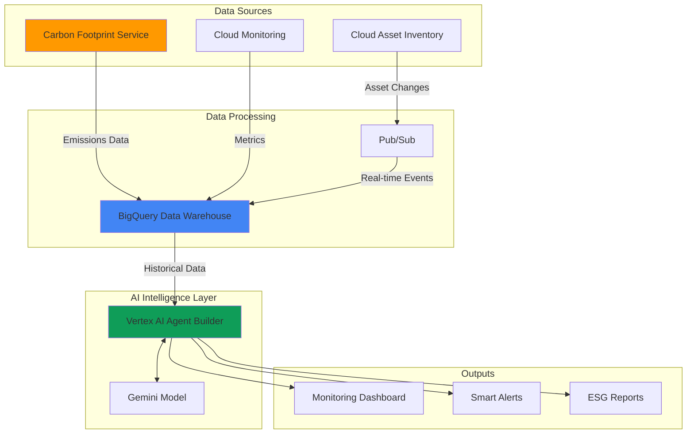

# Carbon Footprint Monitoring with Cloud Asset Inventory and Vertex AI Agents

## Problem

Organizations face increasing pressure to meet ESG (Environmental, Social, and Governance) compliance requirements and demonstrate measurable carbon footprint reduction across their cloud infrastructure. Traditional monitoring approaches lack the intelligence to automatically correlate asset changes with environmental impact, provide proactive sustainability insights, or generate actionable cost optimization recommendations that align with carbon reduction goals.

## Solution

Build an AI-powered carbon footprint monitoring system that leverages Cloud Asset Inventory to track infrastructure changes, integrates with Google Cloud's native Carbon Footprint service for emissions data, and employs Vertex AI agents to provide intelligent sustainability insights. This solution automatically analyzes resource utilization patterns, suggests optimization opportunities, and generates compliance-ready reports that help enterprises achieve their sustainability targets while reducing costs.

## Architecture Diagram



## Prerequisites

1. Google Cloud project with billing enabled and appropriate IAM permissions (Editor or custom role with asset inventory, AI platform, and BigQuery permissions)
2. Google Cloud CLI (gcloud) installed and configured version 400.0+ or Google Cloud Shell
3. Basic understanding of sustainability metrics, BigQuery SQL, and AI/ML concepts
4. Existing Google Cloud resources to monitor (compute instances, storage buckets, etc.)
5. Estimated cost: $50-150/month for demo resources (varies based on data volume and AI agent usage)

> **Note**: This recipe uses Google Cloud's Carbon Footprint service which provides free carbon emissions data. Vertex AI agent costs scale with usage and query complexity.

## Preparation

```bash
# Set environment variables for the carbon monitoring system
export PROJECT_ID="carbon-monitor-$(date +%s)"
export REGION="us-central1"
export DATASET_NAME="carbon_footprint_analytics"
export AGENT_NAME="sustainability-advisor"

# Generate unique identifiers for resources
RANDOM_SUFFIX=$(openssl rand -hex 3)
export BUCKET_NAME="carbon-data-${RANDOM_SUFFIX}"
export TOPIC_NAME="asset-changes-${RANDOM_SUFFIX}"

# Set default configuration
gcloud config set project ${PROJECT_ID}
gcloud config set compute/region ${REGION}

# Enable required Google Cloud APIs
gcloud services enable cloudasset.googleapis.com
gcloud services enable bigquery.googleapis.com
gcloud services enable pubsub.googleapis.com
gcloud services enable aiplatform.googleapis.com
gcloud services enable monitoring.googleapis.com
gcloud services enable carbonfootprint.googleapis.com

echo "✅ Project configured: ${PROJECT_ID}"
echo "✅ APIs enabled for carbon footprint monitoring"
```

## Steps

1. **Create BigQuery Dataset for Carbon Analytics**:

   BigQuery serves as the central data warehouse for carbon footprint analytics, providing the scale and performance needed to process large volumes of asset inventory data and emissions metrics. The dataset structure supports both historical analysis and real-time monitoring, enabling AI agents to identify patterns and trends in resource usage and environmental impact.

   ```bash
   # Create the main analytics dataset
   bq mk --dataset \
       --location=${REGION} \
       --description="Carbon footprint and sustainability analytics" \
       ${PROJECT_ID}:${DATASET_NAME}
   
   # Create table for asset inventory tracking
   bq mk --table \
       ${PROJECT_ID}:${DATASET_NAME}.asset_inventory \
       timestamp:TIMESTAMP,asset_type:STRING,name:STRING,location:STRING,resource_data:JSON
   
   # Create table for carbon emissions data
   bq mk --table \
       ${PROJECT_ID}:${DATASET_NAME}.carbon_emissions \
       billing_account_id:STRING,project_id:STRING,service:STRING,location:STRING,carbon_footprint_kgCO2e:FLOAT64,carbon_footprint_total_kgCO2e:FLOAT64,usage_month:DATE
   
   echo "✅ BigQuery dataset and tables created for carbon analytics"
   ```

   The BigQuery dataset now provides a unified foundation for correlating asset changes with carbon emissions, enabling sophisticated analysis across infrastructure lifecycle and environmental impact metrics.

2. **Set Up Cloud Asset Inventory Export**:

   Cloud Asset Inventory maintains a comprehensive view of your Google Cloud resources and their configurations over time. By configuring automated exports to BigQuery, we create a continuous data stream that enables the AI agent to understand how infrastructure changes correlate with environmental impact and identify optimization opportunities.

   ```bash
   # Create Pub/Sub topic for real-time asset change notifications
   gcloud pubsub topics create ${TOPIC_NAME}
   
   # Create BigQuery export configuration for asset inventory
   gcloud asset feeds create carbon-monitoring-feed \
       --project=${PROJECT_ID} \
       --asset-types="compute.googleapis.com/Instance,storage.googleapis.com/Bucket,container.googleapis.com/Cluster" \
       --content-type=resource \
       --pubsub-topic=projects/${PROJECT_ID}/topics/${TOPIC_NAME}
   
   # Set up IAM permissions for asset inventory service
   gcloud projects add-iam-policy-binding ${PROJECT_ID} \
       --member="serviceAccount:cloud-asset-inventory@system.gserviceaccount.com" \
       --role="roles/pubsub.publisher"
   
   echo "✅ Asset inventory feed configured for real-time monitoring"
   ```

   Asset inventory tracking is now active, providing real-time visibility into infrastructure changes that impact carbon footprint calculations and sustainability metrics.

3. **Configure Carbon Footprint Data Export**:

   Google Cloud's Carbon Footprint service provides scientifically-validated emissions data based on your actual resource usage. Exporting this data to BigQuery enables the AI agent to correlate emissions with specific resources and usage patterns, forming the foundation for intelligent sustainability recommendations.

   ```bash
   # Configure automated carbon footprint data export to BigQuery
   gcloud alpha carbon-footprint export create \
       --destination-table=${PROJECT_ID}.${DATASET_NAME}.carbon_emissions \
       --location=${REGION}
   
   # Create a view for monthly carbon trends
   bq query --use_legacy_sql=false \
   "CREATE VIEW \`${PROJECT_ID}.${DATASET_NAME}.monthly_carbon_trends\` AS
   SELECT 
     usage_month,
     service,
     location,
     SUM(carbon_footprint_total_kgCO2e) as total_emissions,
     COUNT(*) as resource_count
   FROM \`${PROJECT_ID}.${DATASET_NAME}.carbon_emissions\`
   GROUP BY usage_month, service, location
   ORDER BY usage_month DESC"
   
   echo "✅ Carbon footprint data export configured"
   ```

   Carbon emissions data is now automatically exported to BigQuery, providing the AI agent with accurate, methodology-compliant emissions data for analysis and recommendations.

4. **Create Cloud Storage Bucket for AI Agent Data**:

   The storage bucket serves as a repository for training data, model artifacts, and report outputs generated by the Vertex AI agent. This centralized storage enables the agent to access historical patterns and generate comprehensive sustainability reports for ESG compliance.

   ```bash
   # Create storage bucket for agent data and reports
   gsutil mb -p ${PROJECT_ID} \
       -c STANDARD \
       -l ${REGION} \
       gs://${BUCKET_NAME}
   
   # Configure bucket for lifecycle management to optimize storage costs
   cat > lifecycle.json << EOF
   {
     "rule": [
       {
         "action": {"type": "SetStorageClass", "storageClass": "NEARLINE"},
         "condition": {"age": 30}
       },
       {
         "action": {"type": "SetStorageClass", "storageClass": "COLDLINE"},
         "condition": {"age": 90}
       }
     ]
   }
   EOF
   
   gsutil lifecycle set lifecycle.json gs://${BUCKET_NAME}
   
   echo "✅ Storage bucket created with cost-optimized lifecycle policies"
   ```

   The storage infrastructure now supports efficient data management for AI agent operations while implementing sustainability best practices through automated storage class transitions.

5. **Deploy Vertex AI Agent for Sustainability Intelligence**:

   Vertex AI Agent Builder enables creation of intelligent agents that can understand sustainability contexts, analyze carbon footprint data, and provide actionable recommendations. The agent combines Google's foundation models with domain-specific knowledge about cloud infrastructure optimization and environmental impact.

   ```bash
   # Create the sustainability advisor agent
   gcloud alpha ai agents create ${AGENT_NAME} \
       --region=${REGION} \
       --display-name="Carbon Footprint Sustainability Advisor" \
       --description="AI agent for carbon footprint analysis and sustainability recommendations" \
       --instruction="You are a sustainability expert focused on cloud infrastructure carbon footprint optimization. Analyze data from Cloud Asset Inventory and Carbon Footprint service to provide actionable recommendations for reducing environmental impact while optimizing costs."
   
   # Configure agent with BigQuery data source
   gcloud alpha ai agents data-stores create sustainability-data \
       --region=${REGION} \
       --agent=${AGENT_NAME} \
       --data-store-type=structured \
       --bigquery-source=projects/${PROJECT_ID}/datasets/${DATASET_NAME}
   
   echo "✅ Vertex AI sustainability agent deployed and configured"
   ```

   The AI agent is now ready to analyze carbon footprint data and provide intelligent sustainability insights based on your infrastructure usage patterns.

6. **Set Up Monitoring Dashboard and Alerts**:

   Cloud Monitoring provides the visualization and alerting framework for carbon footprint metrics, enabling real-time tracking of sustainability KPIs and automated notifications when emissions exceed thresholds or optimization opportunities are identified.

   ```bash
   # Create custom metrics for carbon footprint monitoring
   gcloud alpha monitoring metrics-descriptors create \
       --descriptor-from-file=<(cat << EOF
   {
     "type": "custom.googleapis.com/carbon/emissions_per_service",
     "metricKind": "GAUGE",
     "valueType": "DOUBLE",
     "description": "Carbon emissions per Google Cloud service in kgCO2e"
   }
   EOF
   )
   
   # Create alerting policy for carbon emission spikes
   gcloud alpha monitoring policies create \
       --policy-from-file=<(cat << EOF
   {
     "displayName": "High Carbon Emissions Alert",
     "conditions": [
       {
         "displayName": "Carbon emissions threshold exceeded",
         "conditionThreshold": {
           "filter": "metric.type=\"custom.googleapis.com/carbon/emissions_per_service\"",
           "comparison": "COMPARISON_GREATER_THAN",
           "thresholdValue": 10.0
         }
       }
     ],
     "alertStrategy": {
       "autoClose": "1800s"
     }
   }
   EOF
   )
   
   echo "✅ Carbon footprint monitoring and alerting configured"
   ```

   Monitoring infrastructure now provides real-time visibility into carbon emissions trends and proactive alerts for sustainability management.

## Validation & Testing

1. **Verify BigQuery data population**:

   ```bash
   # Check asset inventory data ingestion
   bq query --use_legacy_sql=false \
   "SELECT COUNT(*) as asset_count, 
    COUNT(DISTINCT asset_type) as asset_types
   FROM \`${PROJECT_ID}.${DATASET_NAME}.asset_inventory\`"
   ```

   Expected output: Shows count of monitored assets and types being tracked

2. **Test AI agent functionality**:

   ```bash
   # Query the sustainability agent for recommendations
   gcloud alpha ai agents query ${AGENT_NAME} \
       --region=${REGION} \
       --query="What are the top 3 recommendations for reducing carbon footprint based on current infrastructure usage?"
   ```

   Expected output: AI-generated sustainability recommendations based on your data

3. **Validate carbon footprint data export**:

   ```bash
   # Check carbon emissions data availability
   bq query --use_legacy_sql=false \
   "SELECT service, SUM(carbon_footprint_total_kgCO2e) as total_emissions
   FROM \`${PROJECT_ID}.${DATASET_NAME}.carbon_emissions\`
   GROUP BY service
   ORDER BY total_emissions DESC
   LIMIT 5"
   ```

   Expected output: Top 5 services by carbon emissions with kgCO2e values

## Cleanup

1. **Remove monitoring and alerting resources**:

   ```bash
   # Delete monitoring policies
   gcloud alpha monitoring policies list --format="value(name)" | \
   xargs -I {} gcloud alpha monitoring policies delete {} --quiet
   
   # Delete custom metrics
   gcloud alpha monitoring metrics-descriptors delete \
       custom.googleapis.com/carbon/emissions_per_service --quiet
   
   echo "✅ Monitoring resources cleaned up"
   ```

2. **Delete Vertex AI agent and data stores**:

   ```bash
   # Remove agent data stores
   gcloud alpha ai agents data-stores list \
       --region=${REGION} \
       --agent=${AGENT_NAME} \
       --format="value(name)" | \
   xargs -I {} gcloud alpha ai agents data-stores delete {} \
       --region=${REGION} --quiet
   
   # Delete the sustainability agent
   gcloud alpha ai agents delete ${AGENT_NAME} \
       --region=${REGION} --quiet
   
   echo "✅ AI agent resources removed"
   ```

3. **Clean up data storage and feeds**:

   ```bash
   # Delete asset inventory feed
   gcloud asset feeds delete carbon-monitoring-feed \
       --project=${PROJECT_ID} --quiet
   
   # Remove Pub/Sub topic
   gcloud pubsub topics delete ${TOPIC_NAME} --quiet
   
   # Delete storage bucket and contents
   gsutil -m rm -r gs://${BUCKET_NAME}
   
   # Remove BigQuery dataset
   bq rm -r -f ${PROJECT_ID}:${DATASET_NAME}
   
   echo "✅ Data storage and pipeline resources cleaned up"
   ```

## Discussion

This carbon footprint monitoring solution demonstrates the power of combining Google Cloud's infrastructure management services with AI-driven analytics to address critical sustainability challenges. The integration between Cloud Asset Inventory and Carbon Footprint service provides comprehensive visibility into both resource utilization and environmental impact, while Vertex AI agents transform raw data into actionable intelligence for sustainability management.

The solution's strength lies in its ability to correlate infrastructure changes with carbon emissions in real-time, enabling proactive sustainability management rather than reactive reporting. By leveraging Google Cloud's scientifically-validated carbon accounting methodology, organizations can trust the accuracy of their emissions data for ESG compliance and reporting requirements. The AI agent component adds significant value by identifying optimization patterns that might not be obvious to human analysts, such as workload scheduling opportunities that align with renewable energy availability or resource rightsizing recommendations that deliver both cost and carbon benefits.

From an architectural perspective, this solution follows Google Cloud's best practices for data analytics and AI integration. The use of BigQuery as the central data warehouse ensures scalability and performance, while the event-driven architecture through Pub/Sub enables real-time responsiveness. The storage lifecycle policies demonstrate sustainability best practices at the infrastructure level, automatically optimizing storage costs and reducing resource consumption over time.

The business impact extends beyond compliance requirements, as the solution enables data-driven decision making for sustainability initiatives. Organizations can quantify the environmental impact of technical decisions, track progress toward carbon neutrality goals, and identify cost optimization opportunities that align with sustainability objectives. This dual focus on environmental and financial optimization helps build business cases for green technology initiatives and demonstrates the business value of sustainable infrastructure practices.

**References and Documentation:**
- [Google Cloud Carbon Footprint Methodology](https://cloud.google.com/carbon-footprint/docs/methodology)
- [Cloud Asset Inventory Best Practices](https://cloud.google.com/asset-inventory/docs/best-practices)
- [Vertex AI Agent Builder Documentation](https://cloud.google.com/vertex-ai/docs/agent-builder)
- [BigQuery for Sustainability Analytics](https://cloud.google.com/bigquery/docs/analytics)
- [GHG Protocol Corporate Standard](https://cloud.google.com/carbon-footprint/docs/ghg-protocol)

> **Tip**: Schedule regular agent queries to generate monthly sustainability reports automatically. This creates consistent ESG reporting and helps track progress toward carbon reduction goals while identifying seasonal optimization opportunities.

## Challenge

Extend this sustainability monitoring solution by implementing these advanced capabilities:

1. **Multi-Cloud Carbon Comparison**: Integrate carbon footprint data from AWS and Azure using their respective sustainability APIs to provide comprehensive multi-cloud environmental impact analysis.

2. **Predictive Sustainability Analytics**: Enhance the Vertex AI agent with forecasting capabilities to predict future carbon emissions based on planned infrastructure changes and seasonal usage patterns.

3. **Automated Green Workload Scheduling**: Implement Cloud Functions that automatically schedule non-critical workloads during periods of high renewable energy availability in specific regions.

4. **Supply Chain Carbon Tracking**: Extend the monitoring to include Scope 3 emissions by integrating with software supply chain tools to track the carbon footprint of third-party services and dependencies.

5. **ESG Integration Platform**: Build a comprehensive ESG dashboard that combines carbon footprint data with other sustainability metrics like water usage, waste reduction, and social impact indicators for holistic sustainability reporting.

## Infrastructure Code

*Infrastructure code will be generated after recipe approval.*