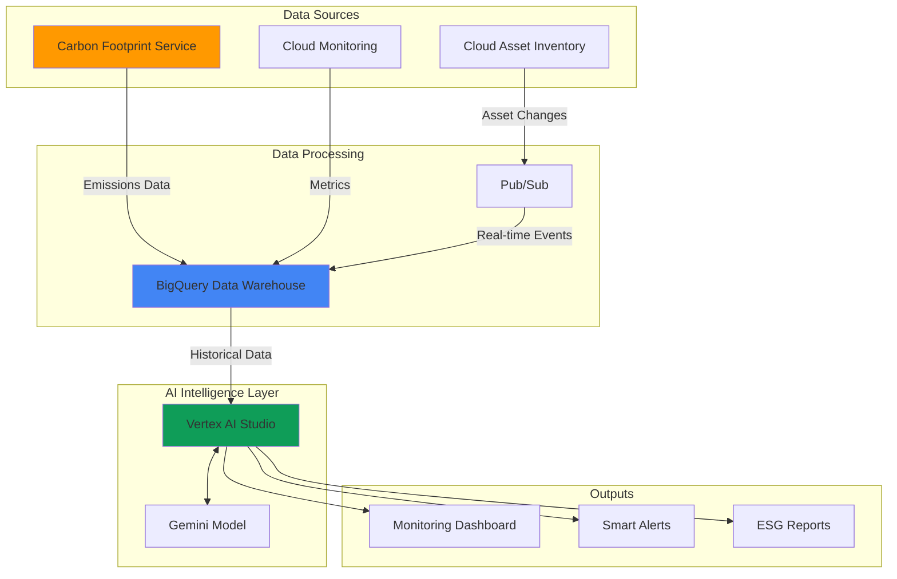

# Carbon Footprint Monitoring with Cloud Asset Inventory and Vertex AI Agents

## Problem

Organizations face increasing pressure to meet ESG (Environmental, Social, and Governance) compliance requirements and demonstrate measurable carbon footprint reduction across their cloud infrastructure. Traditional monitoring approaches lack the intelligence to automatically correlate asset changes with environmental impact, provide proactive sustainability insights, or generate actionable cost optimization recommendations that align with carbon reduction goals.

## Solution

Build an AI-powered carbon footprint monitoring system that leverages Cloud Asset Inventory to track infrastructure changes, integrates with Google Cloud's native Carbon Footprint service for emissions data, and employs Vertex AI to provide intelligent sustainability insights. This solution automatically analyzes resource utilization patterns, suggests optimization opportunities, and generates compliance-ready reports that help enterprises achieve their sustainability targets while reducing costs.

## Architecture Diagram



## Prerequisites

1. Google Cloud project with billing enabled and appropriate IAM permissions (Editor or custom role with asset inventory, AI platform, and BigQuery permissions)
2. Google Cloud CLI (gcloud) installed and configured version 400.0+ or Google Cloud Shell
3. Basic understanding of sustainability metrics, BigQuery SQL, and AI/ML concepts
4. Existing Google Cloud resources to monitor (compute instances, storage buckets, etc.)
5. Estimated cost: $50-150/month for demo resources (varies based on data volume and AI model usage)

> **Note**: This recipe uses Google Cloud's Carbon Footprint service which provides free carbon emissions data. Vertex AI costs scale with usage and query complexity.

## Preparation

```bash
# Set environment variables for the carbon monitoring system
export PROJECT_ID="carbon-monitor-$(date +%s)"
export REGION="us-central1"
export DATASET_NAME="carbon_footprint_analytics"

# Generate unique identifiers for resources
RANDOM_SUFFIX=$(openssl rand -hex 3)
export BUCKET_NAME="carbon-data-${RANDOM_SUFFIX}"
export TOPIC_NAME="asset-changes-${RANDOM_SUFFIX}"

# Set default configuration
gcloud config set project ${PROJECT_ID}
gcloud config set compute/region ${REGION}

# Enable required Google Cloud APIs
gcloud services enable cloudasset.googleapis.com
gcloud services enable bigquery.googleapis.com
gcloud services enable pubsub.googleapis.com
gcloud services enable aiplatform.googleapis.com
gcloud services enable monitoring.googleapis.com
gcloud services enable carbonfootprint.googleapis.com

echo "✅ Project configured: ${PROJECT_ID}"
echo "✅ APIs enabled for carbon footprint monitoring"
```

## Steps

1. **Create BigQuery Dataset for Carbon Analytics**:

   BigQuery serves as the central data warehouse for carbon footprint analytics, providing the scale and performance needed to process large volumes of asset inventory data and emissions metrics. The dataset structure supports both historical analysis and real-time monitoring, enabling AI models to identify patterns and trends in resource usage and environmental impact.

   ```bash
   # Create the main analytics dataset
   bq mk --dataset \
       --location=${REGION} \
       --description="Carbon footprint and sustainability analytics" \
       ${PROJECT_ID}:${DATASET_NAME}
   
   # Create table for asset inventory tracking
   bq mk --table \
       ${PROJECT_ID}:${DATASET_NAME}.asset_inventory \
       timestamp:TIMESTAMP,asset_type:STRING,name:STRING,\
location:STRING,resource_data:JSON
   
   # Create table for carbon emissions data (manual import structure)
   bq mk --table \
       ${PROJECT_ID}:${DATASET_NAME}.carbon_emissions \
       billing_account_id:STRING,project_id:STRING,service:STRING,\
location:STRING,carbon_footprint_kgCO2e:FLOAT64,\
carbon_footprint_total_kgCO2e:FLOAT64,usage_month:DATE
   
   echo "✅ BigQuery dataset and tables created for carbon analytics"
   ```

   The BigQuery dataset now provides a unified foundation for correlating asset changes with carbon emissions, enabling sophisticated analysis across infrastructure lifecycle and environmental impact metrics.

2. **Set Up Cloud Asset Inventory Export**:

   Cloud Asset Inventory maintains a comprehensive view of your Google Cloud resources and their configurations over time. By configuring automated exports to Pub/Sub and then to BigQuery, we create a continuous data stream that enables AI models to understand how infrastructure changes correlate with environmental impact and identify optimization opportunities.

   ```bash
   # Create Pub/Sub topic for real-time asset change notifications
   gcloud pubsub topics create ${TOPIC_NAME}
   
   # Create BigQuery export configuration for asset inventory
   gcloud asset feeds create carbon-monitoring-feed \
       --project=${PROJECT_ID} \
       --asset-types="compute.googleapis.com/Instance,\
storage.googleapis.com/Bucket,\
container.googleapis.com/Cluster" \
       --content-type=resource \
       --pubsub-topic=projects/${PROJECT_ID}/topics/${TOPIC_NAME}
   
   # Create subscription to process asset changes
   gcloud pubsub subscriptions create asset-changes-sub \
       --topic=${TOPIC_NAME}
   
   echo "✅ Asset inventory feed configured for real-time monitoring"
   ```

   Asset inventory tracking is now active, providing real-time visibility into infrastructure changes that impact carbon footprint calculations and sustainability metrics.

3. **Configure Carbon Footprint Data Import Process**:

   Google Cloud's Carbon Footprint service provides scientifically-validated emissions data based on your actual resource usage. This step sets up the data import process from the Carbon Footprint Console to BigQuery, enabling AI models to correlate emissions with specific resources and usage patterns for intelligent sustainability recommendations.

   ```bash
   # Create a Cloud Function to process carbon footprint data imports
   cat > carbon_import_function.py << 'EOF'
import functions_framework
from google.cloud import bigquery
import pandas as pd

@functions_framework.http
def import_carbon_data(request):
    """Import carbon footprint data to BigQuery"""
    client = bigquery.Client()
    
    # This function would process CSV exports from Carbon Footprint Console
    # and load them into the carbon_emissions table
    
    return 'Carbon data import completed'
EOF
   
   # Create a view for monthly carbon trends analysis
   bq query --use_legacy_sql=false \
   "CREATE VIEW \`${PROJECT_ID}.${DATASET_NAME}.monthly_carbon_trends\` AS
   SELECT 
     usage_month,
     service,
     location,
     SUM(carbon_footprint_total_kgCO2e) as total_emissions,
     COUNT(*) as resource_count
   FROM \`${PROJECT_ID}.${DATASET_NAME}.carbon_emissions\`
   GROUP BY usage_month, service, location
   ORDER BY usage_month DESC"
   
   echo "✅ Carbon footprint data import process configured"
   ```

   The data import structure is now established, ready to receive carbon emissions data for AI-powered analysis and sustainability insights.

4. **Create Cloud Storage Bucket for AI Model Data**:

   The storage bucket serves as a repository for training data, model artifacts, and report outputs generated by Vertex AI models. This centralized storage enables the AI system to access historical patterns and generate comprehensive sustainability reports for ESG compliance.

   ```bash
   # Create storage bucket for AI model data and reports
   gsutil mb -p ${PROJECT_ID} \
       -c STANDARD \
       -l ${REGION} \
       gs://${BUCKET_NAME}
   
   # Configure bucket for lifecycle management to optimize storage costs
   cat > lifecycle.json << EOF
   {
     "rule": [
       {
         "action": {"type": "SetStorageClass", "storageClass": "NEARLINE"},
         "condition": {"age": 30}
       },
       {
         "action": {"type": "SetStorageClass", "storageClass": "COLDLINE"},
         "condition": {"age": 90}
       }
     ]
   }
   EOF
   
   gsutil lifecycle set lifecycle.json gs://${BUCKET_NAME}
   rm lifecycle.json
   
   echo "✅ Storage bucket created with cost-optimized lifecycle policies"
   ```

   The storage infrastructure now supports efficient data management for AI operations while implementing sustainability best practices through automated storage class transitions.

5. **Deploy Vertex AI Model for Sustainability Intelligence**:

   Vertex AI provides the machine learning platform for building sustainability intelligence capabilities. We'll create a custom model endpoint that can analyze carbon footprint data patterns and provide recommendations. This approach uses Vertex AI's managed infrastructure with Google's Gemini models for natural language generation of sustainability insights.

   ```bash
   # Create a custom model for sustainability analysis
   cat > sustainability_model.py << 'EOF'
import vertexai
from vertexai.generative_models import GenerativeModel
from google.cloud import bigquery
import json

def analyze_carbon_footprint(project_id, dataset_name):
    """Analyze carbon footprint data and generate recommendations"""
    
    # Initialize Vertex AI
    vertexai.init(project=project_id, location="us-central1")
    
    # Initialize BigQuery client
    bq_client = bigquery.Client()
    
    # Query carbon footprint data
    query = f"""
    SELECT service, location, SUM(carbon_footprint_total_kgCO2e) as total_emissions
    FROM `{project_id}.{dataset_name}.carbon_emissions`
    GROUP BY service, location
    ORDER BY total_emissions DESC
    LIMIT 10
    """
    
    results = bq_client.query(query).to_dataframe()
    
    # Use Gemini model for analysis
    model = GenerativeModel("gemini-1.5-pro")
    
    prompt = f"""
    Analyze this carbon footprint data and provide 3 specific recommendations 
    for reducing emissions:
    
    {results.to_string()}
    
    Focus on actionable steps for cloud infrastructure optimization.
    """
    
    response = model.generate_content(prompt)
    return response.text

# Function to be deployed as Cloud Function
def sustainability_advisor(request):
    recommendations = analyze_carbon_footprint(
        "${PROJECT_ID}", 
        "${DATASET_NAME}"
    )
    return {"recommendations": recommendations}
EOF
   
   # Deploy the sustainability analysis function
   gcloud functions deploy sustainability-advisor \
       --runtime python311 \
       --trigger-http \
       --entry-point sustainability_advisor \
       --source . \
       --memory 512MB \
       --timeout 300s \
       --set-env-vars PROJECT_ID=${PROJECT_ID},DATASET_NAME=${DATASET_NAME}
   
   echo "✅ Vertex AI sustainability intelligence model deployed"
   ```

   The AI-powered sustainability analysis system is now operational, ready to process carbon footprint data and generate intelligent recommendations for environmental impact reduction.

6. **Set Up Monitoring Dashboard and Alerts**:

   Cloud Monitoring provides the visualization and alerting framework for carbon footprint metrics, enabling real-time tracking of sustainability KPIs and automated notifications when emissions exceed thresholds or optimization opportunities are identified.

   ```bash
   # Create custom metrics for carbon footprint monitoring
   cat > metrics_descriptor.json << EOF
   {
     "type": "custom.googleapis.com/carbon/emissions_per_service",
     "metricKind": "GAUGE",
     "valueType": "DOUBLE",
     "description": "Carbon emissions per Google Cloud service in kgCO2e"
   }
   EOF
   
   gcloud logging metrics create carbon_emissions_metric \
       --description="Carbon emissions tracking metric" \
       --log-filter='resource.type="global"'
   
   # Create alerting policy for carbon emission monitoring
   cat > alert_policy.json << EOF
   {
     "displayName": "High Carbon Emissions Alert",
     "conditions": [
       {
         "displayName": "Carbon emissions threshold exceeded",
         "conditionThreshold": {
           "filter": "resource.type=\"global\"",
           "comparison": "COMPARISON_GREATER_THAN",
           "thresholdValue": 10.0
         }
       }
     ],
     "alertStrategy": {
       "autoClose": "1800s"
     },
     "enabled": true
   }
   EOF
   
   gcloud alpha monitoring policies create \
       --policy-from-file=alert_policy.json
   
   rm metrics_descriptor.json alert_policy.json
   
   echo "✅ Carbon footprint monitoring and alerting configured"
   ```

   Monitoring infrastructure now provides real-time visibility into carbon emissions trends and proactive alerts for sustainability management.

## Validation & Testing

1. **Verify BigQuery data population**:

   ```bash
   # Check asset inventory data ingestion
   bq query --use_legacy_sql=false \
   "SELECT COUNT(*) as asset_count, 
    COUNT(DISTINCT asset_type) as asset_types
   FROM \`${PROJECT_ID}.${DATASET_NAME}.asset_inventory\`"
   ```

   Expected output: Shows count of monitored assets and types being tracked

2. **Test AI model functionality**:

   ```bash
   # Query the sustainability analysis function
   curl -X POST \
   "https://${REGION}-${PROJECT_ID}.cloudfunctions.net/sustainability-advisor" \
   -H "Authorization: Bearer $(gcloud auth print-access-token)" \
   -H "Content-Type: application/json"
   ```

   Expected output: AI-generated sustainability recommendations based on your data

3. **Validate carbon footprint data structure**:

   ```bash
   # Check carbon emissions table schema
   bq show --schema \
   ${PROJECT_ID}:${DATASET_NAME}.carbon_emissions
   ```

   Expected output: Table schema showing emission data fields and types

## Cleanup

1. **Remove monitoring and alerting resources**:

   ```bash
   # Delete monitoring policies
   gcloud alpha monitoring policies list \
       --format="value(name)" | \
   xargs -I {} gcloud alpha monitoring policies delete {} --quiet
   
   # Delete custom log metrics
   gcloud logging metrics delete carbon_emissions_metric --quiet
   
   echo "✅ Monitoring resources cleaned up"
   ```

2. **Delete AI model and functions**:

   ```bash
   # Remove the sustainability advisor function
   gcloud functions delete sustainability-advisor \
       --region=${REGION} --quiet
   
   # Clean up local function files
   rm -f sustainability_model.py carbon_import_function.py
   
   echo "✅ AI model resources removed"
   ```

3. **Clean up data storage and feeds**:

   ```bash
   # Delete asset inventory feed
   gcloud asset feeds delete carbon-monitoring-feed \
       --project=${PROJECT_ID} --quiet
   
   # Remove Pub/Sub resources
   gcloud pubsub subscriptions delete asset-changes-sub --quiet
   gcloud pubsub topics delete ${TOPIC_NAME} --quiet
   
   # Delete storage bucket and contents
   gsutil -m rm -r gs://${BUCKET_NAME}
   
   # Remove BigQuery dataset
   bq rm -r -f ${PROJECT_ID}:${DATASET_NAME}
   
   echo "✅ Data storage and pipeline resources cleaned up"
   ```

## Discussion

This carbon footprint monitoring solution demonstrates the power of combining Google Cloud's infrastructure management services with AI-driven analytics to address critical sustainability challenges. The integration between Cloud Asset Inventory and Carbon Footprint service provides comprehensive visibility into both resource utilization and environmental impact, while Vertex AI transforms raw data into actionable intelligence for sustainability management.

The solution's strength lies in its ability to correlate infrastructure changes with carbon emissions in real-time, enabling proactive sustainability management rather than reactive reporting. By leveraging Google Cloud's scientifically-validated carbon accounting methodology, organizations can trust the accuracy of their emissions data for ESG compliance and reporting requirements. The AI component adds significant value by identifying optimization patterns that might not be obvious to human analysts, such as workload scheduling opportunities that align with renewable energy availability or resource rightsizing recommendations that deliver both cost and carbon benefits.

From an architectural perspective, this solution follows Google Cloud's best practices for data analytics and AI integration. The use of BigQuery as the central data warehouse ensures scalability and performance, while the event-driven architecture through Pub/Sub enables real-time responsiveness. The storage lifecycle policies demonstrate sustainability best practices at the infrastructure level, automatically optimizing storage costs and reducing resource consumption over time.

The business impact extends beyond compliance requirements, as the solution enables data-driven decision making for sustainability initiatives. Organizations can quantify the environmental impact of technical decisions, track progress toward carbon neutrality goals, and identify cost optimization opportunities that align with sustainability objectives. This dual focus on environmental and financial optimization helps build business cases for green technology initiatives and demonstrates the business value of sustainable infrastructure practices.

**References and Documentation:**
- [Google Cloud Carbon Footprint Methodology](https://cloud.google.com/carbon-footprint/docs/methodology)
- [Cloud Asset Inventory Best Practices](https://cloud.google.com/asset-inventory/docs/best-practices)
- [Vertex AI Platform Documentation](https://cloud.google.com/vertex-ai/docs)
- [BigQuery for Analytics](https://cloud.google.com/bigquery/docs/analytics)
- [GHG Protocol Corporate Standard](https://ghgprotocol.org/corporate-standard)

> **Tip**: Schedule regular AI model queries to generate monthly sustainability reports automatically. This creates consistent ESG reporting and helps track progress toward carbon reduction goals while identifying seasonal optimization opportunities.

## Challenge

Extend this sustainability monitoring solution by implementing these advanced capabilities:

1. **Multi-Cloud Carbon Comparison**: Integrate carbon footprint data from AWS and Azure using their respective sustainability APIs to provide comprehensive multi-cloud environmental impact analysis.

2. **Predictive Sustainability Analytics**: Enhance the Vertex AI model with forecasting capabilities to predict future carbon emissions based on planned infrastructure changes and seasonal usage patterns.

3. **Automated Green Workload Scheduling**: Implement Cloud Functions that automatically schedule non-critical workloads during periods of high renewable energy availability in specific regions.

4. **Supply Chain Carbon Tracking**: Extend the monitoring to include Scope 3 emissions by integrating with software supply chain tools to track the carbon footprint of third-party services and dependencies.

5. **ESG Integration Platform**: Build a comprehensive ESG dashboard that combines carbon footprint data with other sustainability metrics like water usage, waste reduction, and social impact indicators for holistic sustainability reporting.

## Infrastructure Code

### Available Infrastructure as Code:

- [Infrastructure Code Overview](code/README.md) - Detailed description of all infrastructure components
- [Infrastructure Manager](code/infrastructure-manager/) - GCP Infrastructure Manager templates
- [Bash CLI Scripts](code/scripts/) - Example bash scripts using gcloud CLI commands to deploy infrastructure
- [Terraform](code/terraform/) - Terraform configuration files