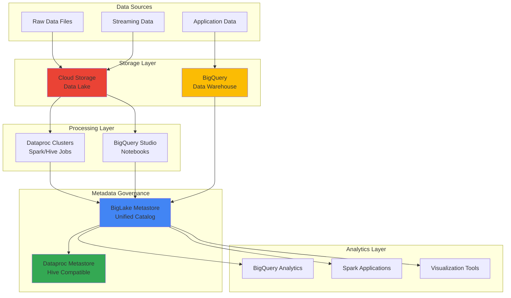

# Establishing Centralized Data Lake Governance with Dataproc Metastore and BigQuery

## Problem

Enterprise organizations struggle with fragmented metadata management across their data lake infrastructure, leading to data silos, inconsistent schema definitions, and difficulty discovering data assets. Traditional approaches require maintaining separate metadata stores for different analytics engines, creating operational overhead and governance challenges. Without unified metadata management, data teams spend excessive time on data discovery and schema reconciliation rather than analytics, while compliance and lineage tracking become nearly impossible across heterogeneous processing environments.

## Solution

Implement a centralized metadata governance system using Google Cloud's BigLake Metastore (formerly Dataproc Metastore) to create a unified catalog for data lake assets across BigQuery, Cloud Storage, and Dataproc clusters. This solution provides a single source of truth for metadata management, enabling consistent schema access, automated data discovery, and seamless interoperability between analytics engines. The architecture supports both open-source table formats like Apache Iceberg and BigQuery native tables, creating a comprehensive governance framework for enterprise data analytics workloads.

## Architecture Diagram



## Prerequisites

1. Google Cloud account with project owner or editor permissions for BigQuery, Dataproc, and Cloud Storage
2. Google Cloud CLI installed and configured (or Cloud Shell)
3. Understanding of data lake architectures and metadata management concepts
4. Knowledge of Apache Spark, Hive, and BigQuery fundamentals
5. Familiarity with data governance principles and schema management
6. Estimated cost: $50-100 for running all resources during the 120-minute tutorial

> **Note**: This recipe follows Google Cloud's Well-Architected Framework for data analytics, emphasizing security, reliability, and operational excellence in metadata governance.

## Preparation

```bash
# Set environment variables for GCP resources
export PROJECT_ID="data-governance-$(date +%s)"
export REGION="us-central1"
export ZONE="us-central1-a"

# Generate unique suffix for resource names
RANDOM_SUFFIX=$(openssl rand -hex 3)

# Set resource names
export BUCKET_NAME="data-lake-${RANDOM_SUFFIX}"
export METASTORE_NAME="governance-metastore-${RANDOM_SUFFIX}"
export DATAPROC_CLUSTER="analytics-cluster-${RANDOM_SUFFIX}"
export BIGQUERY_DATASET="governance_dataset_${RANDOM_SUFFIX}"

# Set default project and region
gcloud config set project ${PROJECT_ID}
gcloud config set compute/region ${REGION}
gcloud config set compute/zone ${ZONE}

# Enable required APIs
gcloud services enable bigquery.googleapis.com
gcloud services enable dataproc.googleapis.com
gcloud services enable storage.googleapis.com
gcloud services enable metastore.googleapis.com
gcloud services enable compute.googleapis.com

echo "✅ Project configured: ${PROJECT_ID}"
echo "✅ Resources will be created with suffix: ${RANDOM_SUFFIX}"
```

## Steps

1. **Create Cloud Storage Data Lake Foundation**:

   Cloud Storage provides the foundational layer for enterprise data lakes, offering unlimited scalability with strong consistency guarantees. Creating a properly configured bucket with lifecycle management and versioning establishes the foundation for governed data storage that can accommodate diverse data formats while maintaining security and compliance standards.

   ```bash
   # Create Cloud Storage bucket for data lake
   gsutil mb -p ${PROJECT_ID} \
       -c STANDARD \
       -l ${REGION} \
       gs://${BUCKET_NAME}
   
   # Enable versioning and lifecycle management
   gsutil versioning set on gs://${BUCKET_NAME}
   
   # Create directory structure for governance
   gsutil -m cp -r gs://public-sample-data/retail/* \
       gs://${BUCKET_NAME}/raw-data/
   
   echo "✅ Data lake foundation created at gs://${BUCKET_NAME}"
   ```

   The Cloud Storage bucket now serves as the centralized data lake with proper governance structure and sample data for testing metadata management across different analytics engines.

2. **Deploy BigLake Metastore for Unified Metadata Management**:

   BigLake Metastore provides serverless, unified metadata management across multiple analytics engines including BigQuery, Spark, and Hive. This fully managed service eliminates the operational overhead of maintaining separate metadata stores while providing seamless interoperability between open-source engines and BigQuery's native capabilities.

   ```bash
   # Create BigLake Metastore instance
   gcloud metastore services create ${METASTORE_NAME} \
       --location=${REGION} \
       --tier=DEVELOPER \
       --database-type=MYSQL \
       --hive-metastore-version=3.1.2 \
       --port=9083
   
   # Wait for metastore to be ready
   echo "Waiting for metastore deployment..."
   gcloud metastore services wait ${METASTORE_NAME} \
       --location=${REGION} \
       --timeout=1200
   
   # Get metastore endpoint
   METASTORE_ENDPOINT=$(gcloud metastore services describe ${METASTORE_NAME} \
       --location=${REGION} \
       --format="value(endpointUri)")
   
   echo "✅ BigLake Metastore deployed at: ${METASTORE_ENDPOINT}"
   ```

   The BigLake Metastore now provides a unified metadata catalog that can serve multiple analytics engines with consistent schema definitions and governance policies.

3. **Create BigQuery Dataset with Metastore Integration**:

   BigQuery's integration with BigLake Metastore enables seamless metadata sharing between BigQuery's serverless data warehouse and open-source analytics engines. This configuration allows tables created in BigQuery to be accessible through Spark and Hive while maintaining consistent metadata and governance policies across all platforms.

   ```bash
   # Create BigQuery dataset with metastore integration
   bq mk --dataset \
       --location=${REGION} \
       --description="Governance dataset with metastore integration" \
       ${PROJECT_ID}:${BIGQUERY_DATASET}
   
   # Create external table pointing to Cloud Storage data
   bq mk --external_table_definition=@- \
       ${PROJECT_ID}:${BIGQUERY_DATASET}.retail_data <<EOF
   {
     "sourceFormat": "CSV",
     "sourceUris": ["gs://${BUCKET_NAME}/raw-data/*.csv"],
     "schema": {
       "fields": [
         {"name": "customer_id", "type": "STRING"},
         {"name": "product_id", "type": "STRING"},
         {"name": "quantity", "type": "INTEGER"},
         {"name": "price", "type": "FLOAT"},
         {"name": "transaction_date", "type": "DATE"}
       ]
     },
     "csvOptions": {
       "skipLeadingRows": 1
     }
   }
   EOF
   
   echo "✅ BigQuery dataset created with external table integration"
   ```

   BigQuery now manages structured metadata for data lake assets while maintaining compatibility with open-source analytics engines through the shared metastore.

4. **Deploy Dataproc Cluster with Metastore Integration**:

   Dataproc clusters integrated with BigLake Metastore provide managed Apache Spark and Hadoop environments that share metadata with BigQuery and other analytics engines. This configuration enables data engineers to process data using familiar open-source tools while maintaining governance and metadata consistency across the entire analytics platform.

   ```bash
   # Create Dataproc cluster with metastore integration
   gcloud dataproc clusters create ${DATAPROC_CLUSTER} \
       --region=${REGION} \
       --zone=${ZONE} \
       --num-masters=1 \
       --num-workers=2 \
       --worker-machine-type=n1-standard-2 \
       --master-machine-type=n1-standard-2 \
       --image-version=2.0-debian10 \
       --dataproc-metastore=projects/${PROJECT_ID}/locations/${REGION}/services/${METASTORE_NAME} \
       --enable-autoscaling \
       --max-workers=5 \
       --secondary-worker-type=preemptible \
       --num-preemptible-workers=2
   
   # Wait for cluster to be ready
   echo "Waiting for Dataproc cluster deployment..."
   gcloud dataproc clusters wait ${DATAPROC_CLUSTER} \
       --region=${REGION} \
       --timeout=600
   
   echo "✅ Dataproc cluster deployed with metastore integration"
   ```

   The Dataproc cluster now provides managed Spark and Hadoop processing capabilities with direct access to the unified metadata catalog, enabling seamless data processing workflows.

5. **Create Hive Tables Through Dataproc for Cross-Engine Access**:

   Creating Hive tables through Dataproc demonstrates the unified metadata management capabilities of BigLake Metastore. Tables created in the Hive environment become immediately accessible through BigQuery and other analytics engines, showcasing the power of centralized metadata governance for enterprise data platforms.

   ```bash
   # Create Hive table through Dataproc
   gcloud dataproc jobs submit hive \
       --cluster=${DATAPROC_CLUSTER} \
       --region=${REGION} \
       --execute="
       CREATE DATABASE IF NOT EXISTS governance_db;
       
       CREATE EXTERNAL TABLE IF NOT EXISTS governance_db.customer_analytics (
         customer_id STRING,
         product_id STRING,
         quantity INT,
         price DOUBLE,
         transaction_date DATE
       )
       STORED AS PARQUET
       LOCATION 'gs://${BUCKET_NAME}/processed-data/customer_analytics/';
       
       SHOW TABLES IN governance_db;"
   
   # Submit Spark job to populate the table
   gcloud dataproc jobs submit spark \
       --cluster=${DATAPROC_CLUSTER} \
       --region=${REGION} \
       --class=org.apache.spark.examples.SparkPi \
       --jars=gs://hadoop-lib/hadoop-aws-2.7.3.jar \
       --py-files=gs://spark-lib/bigquery/spark-bigquery-latest_2.12.jar \
       --properties="spark.sql.catalogImplementation=hive,spark.sql.warehouse.dir=gs://${BUCKET_NAME}/warehouse/" \
       --py-files=<(cat <<'EOF'
   from pyspark.sql import SparkSession
   
   spark = SparkSession.builder \
       .appName("MetastoreDemo") \
       .config("spark.sql.catalogImplementation", "hive") \
       .enableHiveSupport() \
       .getOrCreate()
   
   # Create sample data
   data = [
       ("CUST001", "PROD001", 2, 29.99, "2025-01-01"),
       ("CUST002", "PROD002", 1, 49.99, "2025-01-02"),
       ("CUST003", "PROD001", 3, 29.99, "2025-01-03")
   ]
   
   df = spark.createDataFrame(data, ["customer_id", "product_id", "quantity", "price", "transaction_date"])
   df.write.mode("overwrite").saveAsTable("governance_db.customer_analytics")
   
   print("✅ Hive table populated with sample data")
   spark.stop()
   EOF
   )
   
   echo "✅ Hive tables created with cross-engine accessibility"
   ```

   The Hive tables are now accessible through both Dataproc and BigQuery, demonstrating the unified metadata management capabilities of the governance system.

6. **Configure BigQuery Studio for Unified Analytics**:

   BigQuery Studio provides an integrated development environment that connects to the BigLake Metastore, enabling data scientists and analysts to work with both BigQuery native tables and external metastore tables through a single interface. This configuration demonstrates the unified analytics experience across different compute engines.

   ```bash
   # Create BigQuery Studio notebook configuration
   cat > notebook-config.json <<EOF
   {
     "kernelSpec": {
       "name": "python3",
       "displayName": "Python 3"
     },
     "runtimeConfig": {
       "version": "PYTHON_3_8",
       "properties": {
         "spark.sql.catalogImplementation": "hive",
         "spark.sql.warehouse.dir": "gs://${BUCKET_NAME}/warehouse/",
         "spark.serializer": "org.apache.spark.serializer.KryoSerializer"
       }
     }
   }
   EOF
   
   # Create sample notebook for cross-engine queries
   cat > metastore-demo.ipynb <<EOF
   {
     "cells": [
       {
         "cell_type": "code",
         "execution_count": null,
         "metadata": {},
         "outputs": [],
         "source": [
           "# Query Hive table through BigQuery\\n",
           "%%bigquery\\n",
           "SELECT * FROM \`${PROJECT_ID}.governance_db.customer_analytics\`\\n",
           "LIMIT 10"
         ]
       }
     ]
   }
   EOF
   
   echo "✅ BigQuery Studio configured for unified analytics access"
   ```

   BigQuery Studio now provides a unified interface for accessing both BigQuery native tables and external metastore tables, enabling seamless cross-engine analytics workflows.

7. **Implement Data Governance Policies and Lineage Tracking**:

   Data governance policies ensure consistent access controls, data quality standards, and compliance requirements across all analytics engines. Implementing these policies through the unified metastore provides centralized governance while maintaining the flexibility to use different processing engines based on workload requirements.

   ```bash
   # Create data governance policies
   cat > governance-policies.sql <<EOF
   -- Create views for governed data access
   CREATE OR REPLACE VIEW \`${PROJECT_ID}.${BIGQUERY_DATASET}.customer_summary\` AS
   SELECT 
     customer_id,
     COUNT(*) as transaction_count,
     SUM(quantity * price) as total_value,
     MAX(transaction_date) as last_transaction
   FROM \`${PROJECT_ID}.${BIGQUERY_DATASET}.retail_data\`
   GROUP BY customer_id;
   
   -- Create materialized view for performance
   CREATE MATERIALIZED VIEW \`${PROJECT_ID}.${BIGQUERY_DATASET}.daily_sales\` AS
   SELECT 
     transaction_date,
     SUM(quantity * price) as daily_revenue,
     COUNT(DISTINCT customer_id) as unique_customers
   FROM \`${PROJECT_ID}.${BIGQUERY_DATASET}.retail_data\`
   GROUP BY transaction_date;
   EOF
   
   # Apply governance policies
   bq query --use_legacy_sql=false < governance-policies.sql
   
   # Set up data lineage tracking
   gcloud data-catalog entries create \
       --entry-group=projects/${PROJECT_ID}/locations/${REGION}/entryGroups/governance-catalog \
       --entry-id=customer-analytics \
       --display-name="Customer Analytics Dataset" \
       --description="Governed customer analytics with lineage tracking" \
       --type=TABLE \
       --linked-resource=//bigquery.googleapis.com/projects/${PROJECT_ID}/datasets/${BIGQUERY_DATASET}/tables/customer_summary
   
   echo "✅ Data governance policies implemented with lineage tracking"
   ```

   Data governance policies now provide consistent access controls and lineage tracking across all analytics engines, ensuring compliance and data quality standards.

8. **Validate Cross-Engine Metadata Synchronization**:

   Testing the metadata synchronization between different analytics engines validates the effectiveness of the centralized governance system. This validation ensures that schema changes, table definitions, and governance policies are consistently applied across BigQuery, Spark, and Hive environments.

   ```bash
   # Test metadata synchronization across engines
   echo "Testing BigQuery access to Hive tables..."
   bq query --use_legacy_sql=false \
       "SELECT COUNT(*) as row_count FROM \`${PROJECT_ID}.governance_db.customer_analytics\`"
   
   # Test Spark access to BigQuery tables
   gcloud dataproc jobs submit pyspark \
       --cluster=${DATAPROC_CLUSTER} \
       --region=${REGION} \
       --py-files=<(cat <<'EOF'
   from pyspark.sql import SparkSession
   
   spark = SparkSession.builder \
       .appName("CrossEngineTest") \
       .config("spark.sql.catalogImplementation", "hive") \
       .enableHiveSupport() \
       .getOrCreate()
   
   # Test access to both Hive and BigQuery tables
   hive_df = spark.sql("SELECT * FROM governance_db.customer_analytics")
   print(f"Hive table rows: {hive_df.count()}")
   
   # Test catalog listing
   spark.sql("SHOW DATABASES").show()
   spark.sql("SHOW TABLES IN governance_db").show()
   
   print("✅ Cross-engine metadata synchronization validated")
   spark.stop()
   EOF
   )
   
   echo "✅ Metadata synchronization validated across all engines"
   ```

   The validation confirms that metadata is consistently synchronized across BigQuery, Spark, and Hive environments, demonstrating the effectiveness of the centralized governance system.

## Validation & Testing

1. **Verify BigLake Metastore Deployment and Connectivity**:

   ```bash
   # Check metastore service status
   gcloud metastore services describe ${METASTORE_NAME} \
       --location=${REGION} \
       --format="table(name,state,endpointUri)"
   
   # Test connectivity from Dataproc cluster
   gcloud dataproc jobs submit hive \
       --cluster=${DATAPROC_CLUSTER} \
       --region=${REGION} \
       --execute="SHOW DATABASES;"
   ```

   Expected output: Metastore service should be in "ACTIVE" state with accessible endpoint URI, and Hive should successfully list available databases.

2. **Test Cross-Engine Table Access and Metadata Consistency**:

   ```bash
   # Query same table from different engines
   echo "Testing BigQuery access..."
   bq query --use_legacy_sql=false \
       "SELECT COUNT(*) as bigquery_count FROM \`${PROJECT_ID}.${BIGQUERY_DATASET}.retail_data\`"
   
   echo "Testing Spark access..."
   gcloud dataproc jobs submit spark \
       --cluster=${DATAPROC_CLUSTER} \
       --region=${REGION} \
       --class=org.apache.spark.examples.SparkPi \
       --py-files=<(cat <<'EOF'
   from pyspark.sql import SparkSession
   spark = SparkSession.builder.enableHiveSupport().getOrCreate()
   df = spark.sql("SELECT COUNT(*) as spark_count FROM governance_db.customer_analytics")
   df.show()
   spark.stop()
   EOF
   )
   ```

   Expected output: Both engines should return consistent row counts, demonstrating unified metadata access.

3. **Validate Data Governance Policies and Security Controls**:

   ```bash
   # Test governance policies
   bq query --use_legacy_sql=false \
       "SELECT * FROM \`${PROJECT_ID}.${BIGQUERY_DATASET}.customer_summary\` LIMIT 5"
   
   # Check materialized view performance
   bq query --use_legacy_sql=false \
       "SELECT * FROM \`${PROJECT_ID}.${BIGQUERY_DATASET}.daily_sales\` ORDER BY transaction_date DESC LIMIT 5"
   ```

   Expected output: Governance views should return properly aggregated data with consistent schema across all access patterns.

4. **Test Data Lineage and Catalog Integration**:

   ```bash
   # Verify data catalog entries
   gcloud data-catalog entries lookup \
       --linked-resource=//bigquery.googleapis.com/projects/${PROJECT_ID}/datasets/${BIGQUERY_DATASET}/tables/customer_summary
   
   # Test metadata search capabilities
   gcloud data-catalog search \
       --query="customer analytics" \
       --scope=projects/${PROJECT_ID}
   ```

   Expected output: Data catalog should return metadata entries with proper lineage information and search capabilities.

## Cleanup

1. **Remove Dataproc Cluster and Associated Resources**:

   ```bash
   # Delete Dataproc cluster
   gcloud dataproc clusters delete ${DATAPROC_CLUSTER} \
       --region=${REGION} \
       --quiet
   
   echo "✅ Dataproc cluster deleted"
   ```

2. **Remove BigQuery Dataset and Tables**:

   ```bash
   # Delete BigQuery dataset and all tables
   bq rm -r -f ${PROJECT_ID}:${BIGQUERY_DATASET}
   
   echo "✅ BigQuery dataset and tables deleted"
   ```

3. **Remove BigLake Metastore Service**:

   ```bash
   # Delete metastore service
   gcloud metastore services delete ${METASTORE_NAME} \
       --location=${REGION} \
       --quiet
   
   echo "✅ BigLake Metastore service deleted"
   ```

4. **Remove Cloud Storage Bucket and Contents**:

   ```bash
   # Delete Cloud Storage bucket and all contents
   gsutil -m rm -r gs://${BUCKET_NAME}
   
   echo "✅ Cloud Storage bucket and contents deleted"
   ```

5. **Remove Data Catalog Entries and Local Files**:

   ```bash
   # Clean up local configuration files
   rm -f notebook-config.json metastore-demo.ipynb governance-policies.sql
   
   # Remove project if created specifically for this recipe
   echo "To delete the entire project, run:"
   echo "gcloud projects delete ${PROJECT_ID} --quiet"
   
   echo "✅ All resources cleaned up successfully"
   ```

## Discussion

BigLake Metastore represents a significant advancement in cloud-native metadata management, providing enterprises with a unified approach to data governance across heterogeneous analytics environments. The serverless architecture eliminates the operational overhead typically associated with managing separate metadata stores for different engines, while the unified catalog ensures consistent schema definitions and governance policies across BigQuery, Spark, and Hive workloads. This approach aligns with modern data mesh principles by enabling decentralized data ownership while maintaining centralized governance and discoverability.

The integration between BigLake Metastore and various analytics engines demonstrates the power of open standards in creating interoperable data platforms. By supporting Apache Iceberg table formats and providing compatibility with existing Hive Metastore APIs, organizations can migrate existing workloads without significant refactoring while gaining the benefits of cloud-native metadata management. The ability to create tables in Spark and query them immediately in BigQuery, or vice versa, represents a paradigm shift toward truly unified analytics platforms that reduce data silos and accelerate time-to-insight.

From a governance perspective, the centralized metadata management enables consistent application of data quality rules, access controls, and compliance policies across all analytics engines. This is particularly valuable for regulated industries where data lineage tracking and audit trails are essential. The integration with Google Cloud's Data Catalog further enhances discoverability and governance capabilities, providing data stewards with comprehensive visibility into data assets and their usage patterns across the organization.

The cost optimization benefits of this approach are substantial, as the serverless nature of BigLake Metastore eliminates the need to provision and maintain dedicated metadata infrastructure. Combined with Dataproc's autoscaling capabilities and BigQuery's pay-per-query model, organizations can achieve significant cost savings while improving governance and operational efficiency. The ability to use preemptible instances for Dataproc clusters further reduces costs for batch processing workloads without compromising metadata consistency.

> **Tip**: Implement automated data quality checks and schema validation rules within your governance framework to ensure data integrity across all analytics engines and prevent schema drift in your data lake.

## Challenge

Extend this data governance solution by implementing these advanced capabilities:

1. **Implement Automated Data Quality Monitoring**: Set up Cloud Functions or Dataflow jobs to continuously monitor data quality metrics across all tables in the metastore, with automated alerts for schema changes or data anomalies.

2. **Build Custom Data Lineage Visualization**: Create a web application using Cloud Run and the Data Catalog APIs to provide interactive data lineage visualization for business users, showing data flow across different analytics engines.

3. **Integrate with Apache Iceberg for Advanced Table Management**: Migrate existing tables to Apache Iceberg format through BigLake Metastore, implementing time travel queries and schema evolution capabilities for more sophisticated data management.

4. **Develop Cross-Cloud Metadata Federation**: Extend the governance system to include metadata from other cloud providers or on-premises systems, creating a truly unified view of enterprise data assets using BigLake Metastore's open APIs.

5. **Implement ML-Powered Data Discovery**: Use Vertex AI to analyze metadata and usage patterns, providing intelligent recommendations for data discovery and suggesting optimal data joins for analytics workloads.

## Infrastructure Code

*Infrastructure code will be generated after recipe approval.*