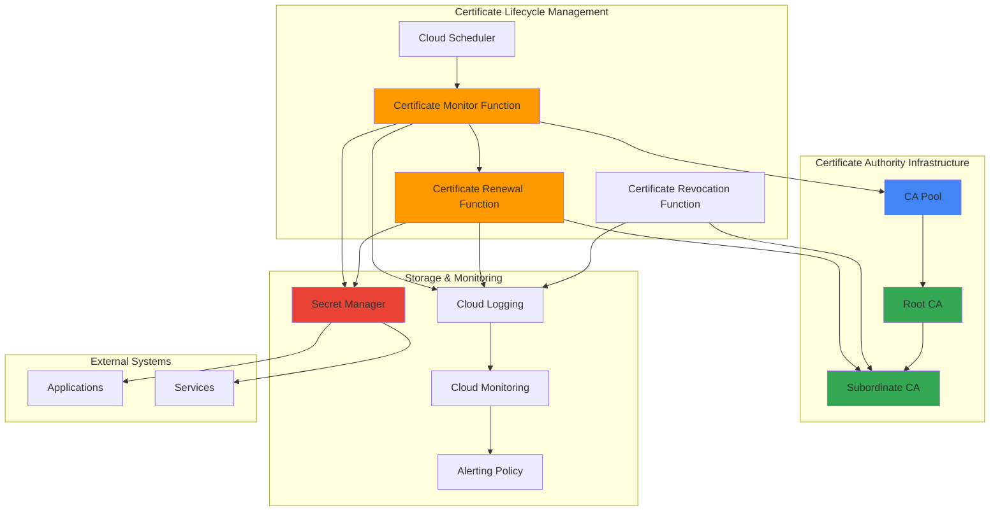

# Certificate Lifecycle Management with Certificate Authority Service and Cloud Functions

## Problem

Organizations managing private certificate infrastructures face significant operational overhead with manual certificate lifecycle processes, including issuance, renewal, and revocation tracking. Without automation, certificate expiration leads to service outages, security vulnerabilities from delayed renewals, and compliance issues from poor certificate tracking and governance.

## Solution

Deploy an automated certificate lifecycle management system using Google Cloud Certificate Authority Service for secure certificate operations, Cloud Functions for event-driven automation logic, Cloud Scheduler for proactive monitoring, and Secret Manager for secure certificate storage. This solution provides centralized PKI management with automated workflows that ensure certificates are renewed before expiration and revoked when compromised.

## Architecture Diagram



## Prerequisites

1. Google Cloud project with billing enabled and appropriate permissions for Certificate Authority Service, Cloud Functions, Cloud Scheduler, and Secret Manager
2. Google Cloud CLI (gcloud) installed and configured with latest version
3. Basic understanding of Public Key Infrastructure (PKI) concepts and certificate management
4. Python development experience for Cloud Functions implementation
5. Estimated cost: $50-100/month for Enterprise tier CA pools, function execution, and storage (DevOps tier available for testing at lower cost)

> **Note**: Certificate Authority Service Enterprise tier is required for certificate revocation capabilities. DevOps tier can be used for testing but does not support revocation features as outlined in the [CA Service tiers documentation](https://cloud.google.com/certificate-authority-service/docs/tiers).

## Preparation

```bash
# Set environment variables for GCP resources
export PROJECT_ID="cert-lifecycle-$(date +%s)"
export REGION="us-central1"
export ZONE="us-central1-a"

# Generate unique suffix for resource names
RANDOM_SUFFIX=$(openssl rand -hex 3)

# Set resource names
export CA_POOL_NAME="enterprise-ca-pool-${RANDOM_SUFFIX}"
export ROOT_CA_NAME="root-ca-${RANDOM_SUFFIX}"
export SUB_CA_NAME="sub-ca-${RANDOM_SUFFIX}"
export MONITOR_FUNCTION_NAME="cert-monitor-${RANDOM_SUFFIX}"
export RENEW_FUNCTION_NAME="cert-renew-${RANDOM_SUFFIX}"
export REVOKE_FUNCTION_NAME="cert-revoke-${RANDOM_SUFFIX}"
export SCHEDULER_JOB_NAME="cert-check-${RANDOM_SUFFIX}"

# Set default project and region
gcloud config set project ${PROJECT_ID}
gcloud config set compute/region ${REGION}
gcloud config set compute/zone ${ZONE}

# Enable required APIs
gcloud services enable privateca.googleapis.com
gcloud services enable cloudfunctions.googleapis.com
gcloud services enable cloudscheduler.googleapis.com
gcloud services enable secretmanager.googleapis.com
gcloud services enable cloudresourcemanager.googleapis.com
gcloud services enable cloudbuild.googleapis.com
gcloud services enable logging.googleapis.com
gcloud services enable monitoring.googleapis.com

echo "✅ Project configured: ${PROJECT_ID}"
echo "✅ Region set to: ${REGION}"
echo "✅ Required APIs enabled"
```

## Steps

1. **Create Certificate Authority Pool with Enterprise Tier**:

   Google Cloud Certificate Authority Service provides managed PKI infrastructure that eliminates the operational complexity of maintaining certificate authorities. Creating an Enterprise tier CA pool enables advanced features including certificate revocation, audit logging, and comprehensive certificate tracking essential for production environments.

   ```bash
   # Create Enterprise tier CA pool for full certificate lifecycle support
   gcloud privateca pools create ${CA_POOL_NAME} \
       --location=${REGION} \
       --tier=ENTERPRISE \
       --subject="CN=Enterprise PKI Pool,O=Organization,C=US" \
       --issuance-policy="" \
       --publishing-options-include-ca-cert-url=true \
       --publishing-options-include-crl-access-url=true
   
   echo "✅ CA pool created: ${CA_POOL_NAME}"
   ```

   The Enterprise tier CA pool now provides a secure foundation for certificate operations with hardware security module (HSM) backed keys and comprehensive audit logging. This configuration enables certificate revocation lists (CRL) and CA certificate publishing for trust chain validation across your infrastructure.

2. **Create Root Certificate Authority**:

   The root certificate authority serves as the trust anchor for your entire PKI hierarchy. Google Cloud manages the cryptographic operations and key protection using Cloud HSM, ensuring the highest security standards while providing the operational simplicity of a managed service.

   ```bash
   # Create root CA with strong cryptographic parameters
   gcloud privateca roots create ${ROOT_CA_NAME} \
       --pool=${CA_POOL_NAME} \
       --location=${REGION} \
       --subject="CN=Root CA,O=Organization,C=US" \
       --validity=10y \
       --key-algorithm=rsa-pkcs1-4096-sha256 \
       --max-chain-length=2
   
   # Enable the root CA for certificate operations
   gcloud privateca roots enable ${ROOT_CA_NAME} \
       --pool=${CA_POOL_NAME} \
       --location=${REGION}
   
   echo "✅ Root CA created and enabled: ${ROOT_CA_NAME}"
   ```

   The root CA is now operational with RSA 4096-bit keys providing long-term security strength. The 10-year validity period and chain length limitation of 2 establish appropriate security boundaries for the certificate hierarchy while enabling subordinate CA delegation.

3. **Create Subordinate Certificate Authority for Daily Operations**:

   Subordinate CAs provide operational isolation by handling day-to-day certificate issuance while keeping the root CA protected. This architectural pattern follows PKI best practices and enables easier key rotation and policy changes without affecting the entire trust hierarchy.

   ```bash
   # Create subordinate CA for operational certificate issuance
   gcloud privateca subordinates create ${SUB_CA_NAME} \
       --pool=${CA_POOL_NAME} \
       --location=${REGION} \
       --issuer-pool=${CA_POOL_NAME} \
       --issuer-location=${REGION} \
       --subject="CN=Subordinate CA,O=Organization,OU=Operations,C=US" \
       --validity=5y \
       --key-algorithm=rsa-pkcs1-2048-sha256
   
   # Enable the subordinate CA
   gcloud privateca subordinates enable ${SUB_CA_NAME} \
       --pool=${CA_POOL_NAME} \
       --location=${REGION}
   
   echo "✅ Subordinate CA created and enabled: ${SUB_CA_NAME}"
   ```

   The subordinate CA provides operational certificate issuance capabilities with appropriate key strength and validity periods. This two-tier hierarchy enables secure certificate operations while maintaining root CA protection and compliance with industry PKI standards.

4. **Create Service Account for Cloud Functions**:

   Cloud Functions require appropriate IAM permissions to interact with Certificate Authority Service, Secret Manager, and logging services. Creating a dedicated service account follows the principle of least privilege and enables precise permission management for automated certificate operations.

   ```bash
   # Create service account for certificate automation functions
   gcloud iam service-accounts create cert-automation-sa \
       --display-name="Certificate Automation Service Account" \
       --description="Service account for automated certificate lifecycle management"
   
   export SERVICE_ACCOUNT_EMAIL="cert-automation-sa@${PROJECT_ID}.iam.gserviceaccount.com"
   
   # Grant necessary permissions for certificate operations
   gcloud projects add-iam-policy-binding ${PROJECT_ID} \
       --member="serviceAccount:${SERVICE_ACCOUNT_EMAIL}" \
       --role="roles/privateca.certificateManager"
   
   gcloud projects add-iam-policy-binding ${PROJECT_ID} \
       --member="serviceAccount:${SERVICE_ACCOUNT_EMAIL}" \
       --role="roles/secretmanager.admin"
   
   gcloud projects add-iam-policy-binding ${PROJECT_ID} \
       --member="serviceAccount:${SERVICE_ACCOUNT_EMAIL}" \
       --role="roles/logging.logWriter"
   
   echo "✅ Service account configured: ${SERVICE_ACCOUNT_EMAIL}"
   ```

   The service account now has precise permissions for certificate lifecycle operations without excessive privileges. This configuration enables secure automation while maintaining audit trails and operational visibility through Cloud Logging integration.

5. **Create Certificate Monitoring Cloud Function**:

   The monitoring function proactively scans Secret Manager for stored certificates approaching expiration. This event-driven approach ensures timely renewal operations and prevents service disruptions from expired certificates.

   ```bash
   # Create directory for certificate monitor function
   mkdir -p cert-monitor-function
   cd cert-monitor-function
   
   # Create main function file
   cat > main.py << 'EOF'
import json
import datetime
import logging
import os
from google.cloud import secretmanager
from google.cloud import privateca_v1
import cryptography
from cryptography import x509
from cryptography.hazmat.backends import default_backend
import base64

def certificate_monitor(request):
    """Monitor certificates for expiration and trigger renewal"""
    
    # Initialize clients
    secret_client = secretmanager.SecretManagerServiceClient()
    ca_client = privateca_v1.CertificateAuthorityServiceClient()
    
    project_id = os.environ.get('PROJECT_ID')
    ca_pool = os.environ.get('CA_POOL_NAME')
    location = os.environ.get('REGION')
    renewal_threshold_days = int(os.environ.get('RENEWAL_THRESHOLD_DAYS', '30'))
    
    try:
        # List all secrets with certificate metadata
        parent = f"projects/{project_id}"
        secrets = secret_client.list_secrets(request={"parent": parent})
        
        expiring_certificates = []
        
        for secret in secrets:
            if 'certificate' in secret.name.lower():
                try:
                    # Get the latest version of the secret
                    secret_version_name = f"{secret.name}/versions/latest"
                    response = secret_client.access_secret_version(
                        request={"name": secret_version_name}
                    )
                    
                    # Parse certificate data (handle JSON format from renewal function)
                    cert_data = response.payload.data.decode('utf-8')
                    if cert_data.startswith('{'):
                        # JSON format from renewal function
                        cert_json = json.loads(cert_data)
                        cert_pem = cert_json.get('certificate', cert_data)
                    else:
                        # Raw PEM format
                        cert_pem = cert_data
                    
                    cert = x509.load_pem_x509_certificate(
                        cert_pem.encode(), default_backend()
                    )
                    
                    # Check expiration
                    days_until_expiry = (cert.not_valid_after - datetime.datetime.utcnow()).days
                    
                    if days_until_expiry <= renewal_threshold_days:
                        cert_info = {
                            'secret_name': secret.name,
                            'common_name': cert.subject.get_attributes_for_oid(x509.NameOID.COMMON_NAME)[0].value,
                            'expiry_date': cert.not_valid_after.isoformat(),
                            'days_until_expiry': days_until_expiry
                        }
                        expiring_certificates.append(cert_info)
                        
                        # Log certificate requiring renewal
                        logging.info(f"Certificate {cert_info['common_name']} expires in {days_until_expiry} days")
                        
                except Exception as e:
                    logging.error(f"Error processing secret {secret.name}: {str(e)}")
                    continue
        
        # Trigger renewal for expiring certificates
        if expiring_certificates:
            # In a production environment, this would trigger the renewal function
            # For this example, we'll log the certificates that need renewal
            logging.info(f"Found {len(expiring_certificates)} certificates requiring renewal")
            
            for cert in expiring_certificates:
                logging.warning(f"RENEWAL REQUIRED: {cert['common_name']} expires {cert['expiry_date']}")
        
        return {
            'statusCode': 200,
            'body': json.dumps({
                'message': f"Processed certificate monitoring",
                'expiring_certificates': len(expiring_certificates),
                'certificates': expiring_certificates
            })
        }
        
    except Exception as e:
        logging.error(f"Certificate monitoring error: {str(e)}")
        return {
            'statusCode': 500,
            'body': json.dumps({'error': str(e)})
        }
EOF
   
   # Create requirements file
   cat > requirements.txt << 'EOF'
google-cloud-secret-manager==2.21.0
google-cloud-private-ca==1.12.0
cryptography==42.0.0
EOF
   
   echo "✅ Certificate monitoring function created"
   cd ..
   ```

   The monitoring function implements comprehensive certificate expiration tracking with configurable renewal thresholds. This proactive approach prevents service outages by identifying certificates requiring renewal well before their expiration dates.

6. **Create Certificate Renewal Cloud Function**:

   The renewal function automates certificate issuance using the subordinate CA and securely stores new certificates in Secret Manager. This automation ensures consistent certificate management while maintaining security through proper validation and storage practices.

   ```bash
   # Create directory for certificate renewal function
   mkdir -p cert-renewal-function
   cd cert-renewal-function
   
   # Create renewal function
   cat > main.py << 'EOF'
import json
import logging
import datetime
from google.cloud import secretmanager
from google.cloud import privateca_v1
from cryptography.hazmat.primitives import serialization, hashes
from cryptography.hazmat.primitives.asymmetric import rsa
from cryptography import x509
from cryptography.x509.oid import NameOID, ExtendedKeyUsageOID
import os

def certificate_renewal(request):
    """Renew expiring certificates using Certificate Authority Service"""
    
    # Initialize clients
    secret_client = secretmanager.SecretManagerServiceClient()
    ca_client = privateca_v1.CertificateAuthorityServiceClient()
    
    project_id = os.environ.get('PROJECT_ID')
    ca_pool = os.environ.get('CA_POOL_NAME')
    sub_ca = os.environ.get('SUB_CA_NAME')
    location = os.environ.get('REGION')
    
    try:
        # Parse request data
        request_json = request.get_json(silent=True)
        if not request_json or 'common_name' not in request_json:
            raise ValueError("Missing required 'common_name' in request")
        
        common_name = request_json['common_name']
        validity_days = request_json.get('validity_days', 365)
        
        # Generate new private key
        private_key = rsa.generate_private_key(
            public_exponent=65537,
            key_size=2048
        )
        
        # Create certificate request
        subject = x509.Name([
            x509.NameAttribute(NameOID.COUNTRY_NAME, "US"),
            x509.NameAttribute(NameOID.ORGANIZATION_NAME, "Organization"),
            x509.NameAttribute(NameOID.COMMON_NAME, common_name),
        ])
        
        # Build certificate signing request
        csr = x509.CertificateSigningRequestBuilder().subject_name(
            subject
        ).add_extension(
            x509.SubjectAlternativeName([
                x509.DNSName(common_name),
            ]),
            critical=False,
        ).add_extension(
            x509.KeyUsage(
                digital_signature=True,
                key_encipherment=True,
                content_commitment=False,
                data_encipherment=False,
                key_agreement=False,
                key_cert_sign=False,
                crl_sign=False,
                encipher_only=False,
                decipher_only=False
            ),
            critical=True,
        ).add_extension(
            x509.ExtendedKeyUsage([
                ExtendedKeyUsageOID.SERVER_AUTH,
                ExtendedKeyUsageOID.CLIENT_AUTH,
            ]),
            critical=True,
        ).sign(private_key, hashes.SHA256())
        
        # Submit certificate request to CA Service
        ca_parent = f"projects/{project_id}/locations/{location}/caPools/{ca_pool}"
        
        certificate_request = privateca_v1.Certificate(
            pem_csr=csr.public_bytes(serialization.Encoding.PEM).decode('utf-8'),
            lifetime=datetime.timedelta(days=validity_days)
        )
        
        request_obj = privateca_v1.CreateCertificateRequest(
            parent=ca_parent,
            certificate=certificate_request,
            certificate_id=f"{common_name.replace('.', '-')}-{int(datetime.datetime.now().timestamp())}"
        )
        
        # Issue the certificate
        operation = ca_client.create_certificate(request=request_obj)
        certificate = operation.result()
        
        # Prepare certificate and private key for storage
        cert_pem = certificate.pem_certificate
        private_key_pem = private_key.private_bytes(
            encoding=serialization.Encoding.PEM,
            format=serialization.PrivateFormat.PKCS8,
            encryption_algorithm=serialization.NoEncryption()
        ).decode('utf-8')
        
        # Store certificate in Secret Manager
        secret_name = f"projects/{project_id}/secrets/cert-{common_name.replace('.', '-')}"
        
        # Create or update secret with new certificate
        cert_bundle = {
            'certificate': cert_pem,
            'private_key': private_key_pem,
            'issued_date': datetime.datetime.utcnow().isoformat(),
            'expiry_date': (datetime.datetime.utcnow() + datetime.timedelta(days=validity_days)).isoformat()
        }
        
        secret_payload = json.dumps(cert_bundle).encode('utf-8')
        
        try:
            # Try to create new secret
            secret_client.create_secret(
                request={
                    "parent": f"projects/{project_id}",
                    "secret_id": f"cert-{common_name.replace('.', '-')}",
                    "secret": {"replication": {"automatic": {}}}
                }
            )
        except Exception:
            # Secret already exists, which is fine
            pass
        
        # Add new version
        secret_client.add_secret_version(
            request={
                "parent": secret_name,
                "payload": {"data": secret_payload}
            }
        )
        
        logging.info(f"Successfully renewed certificate for {common_name}")
        
        return {
            'statusCode': 200,
            'body': json.dumps({
                'message': f"Certificate renewed successfully for {common_name}",
                'certificate_name': certificate.name,
                'expiry_date': (datetime.datetime.utcnow() + datetime.timedelta(days=validity_days)).isoformat()
            })
        }
        
    except Exception as e:
        logging.error(f"Certificate renewal error: {str(e)}")
        return {
            'statusCode': 500,
            'body': json.dumps({'error': str(e)})
        }
EOF
   
   # Create requirements file
   cat > requirements.txt << 'EOF'
google-cloud-secret-manager==2.21.0
google-cloud-private-ca==1.12.0
cryptography==42.0.0
EOF
   
   echo "✅ Certificate renewal function created"
   cd ..
   ```

   The renewal function implements secure certificate generation and issuance workflows using industry-standard cryptographic practices. Integration with Secret Manager ensures certificates are stored securely with proper versioning and access controls.

7. **Deploy Cloud Functions with Proper Configuration**:

   Deploying Cloud Functions with environment variables and service account configuration enables secure, automated certificate operations. The functions operate with minimal privileges while maintaining full operational capability for certificate lifecycle management.

   ```bash
   # Deploy certificate monitoring function
   gcloud functions deploy ${MONITOR_FUNCTION_NAME} \
       --source=cert-monitor-function \
       --runtime=python311 \
       --trigger=http \
       --entry-point=certificate_monitor \
       --service-account=${SERVICE_ACCOUNT_EMAIL} \
       --region=${REGION} \
       --set-env-vars="PROJECT_ID=${PROJECT_ID},CA_POOL_NAME=${CA_POOL_NAME},REGION=${REGION},RENEWAL_THRESHOLD_DAYS=30" \
       --memory=256MB \
       --timeout=540s
   
   # Deploy certificate renewal function
   gcloud functions deploy ${RENEW_FUNCTION_NAME} \
       --source=cert-renewal-function \
       --runtime=python311 \
       --trigger=http \
       --entry-point=certificate_renewal \
       --service-account=${SERVICE_ACCOUNT_EMAIL} \
       --region=${REGION} \
       --set-env-vars="PROJECT_ID=${PROJECT_ID},CA_POOL_NAME=${CA_POOL_NAME},SUB_CA_NAME=${SUB_CA_NAME},REGION=${REGION}" \
       --memory=512MB \
       --timeout=540s
   
   echo "✅ Cloud Functions deployed successfully"
   ```

   The functions are now deployed with appropriate resource allocation and security configuration. The monitoring function runs with lower memory requirements for efficiency, while the renewal function has additional memory for cryptographic operations.

8. **Create Cloud Scheduler Jobs for Automated Monitoring**:

   Cloud Scheduler provides reliable, cron-based execution for certificate monitoring workflows. Regular automated checks ensure certificates are renewed proactively, preventing service disruptions from unexpected expirations.

   ```bash
   # Create Cloud Scheduler job for regular certificate monitoring
   MONITOR_FUNCTION_URL=$(gcloud functions describe ${MONITOR_FUNCTION_NAME} \
       --region=${REGION} \
       --format="value(httpsTrigger.url)")
   
   gcloud scheduler jobs create http ${SCHEDULER_JOB_NAME} \
       --location=${REGION} \
       --schedule="0 8 * * *" \
       --time-zone="America/New_York" \
       --uri="${MONITOR_FUNCTION_URL}" \
       --http-method=POST \
       --headers="Content-Type=application/json" \
       --message-body='{"source":"scheduler","action":"monitor"}' \
       --oidc-service-account-email=${SERVICE_ACCOUNT_EMAIL}
   
   echo "✅ Scheduler job created: ${SCHEDULER_JOB_NAME}"
   echo "Monitor function URL: ${MONITOR_FUNCTION_URL}"
   ```

   The scheduler job executes daily monitoring checks with OIDC authentication ensuring secure function invocation. This automated approach provides consistent certificate oversight without manual intervention requirements.

9. **Create Certificate Template for Standardized Issuance**:

   Certificate templates define standard certificate profiles with appropriate extensions, validity periods, and usage constraints. This standardization ensures consistent certificate properties across your infrastructure while simplifying issuance workflows.

   ```bash
   # Create certificate template for web server certificates
   cat > web-server-template.yaml << EOF
name: projects/${PROJECT_ID}/locations/${REGION}/certificateTemplates/web-server-template
description: "Standard template for web server certificates"
predefined_values:
  key_usage:
    base_key_usage:
      digital_signature: true
      key_encipherment: true
    extended_key_usage:
      server_auth: true
      client_auth: true
  ca_options:
    is_ca: false
  policy_ids:
    - object_id_path: [1, 3, 6, 1, 4, 1, 11129, 2, 5, 2]
identity_constraints:
  cel_expression:
    expression: 'subject_alt_names.all(san, san.type == DNS)'
    title: "DNS SANs only"
    description: "Only DNS Subject Alternative Names are allowed"
passthrough_extensions:
  known_extensions:
    - SUBJECT_ALT_NAME
  additional_extensions:
    - object_id_path: [2, 5, 29, 17]
EOF
   
   # Apply the certificate template
   gcloud privateca templates create web-server-template \
       --location=${REGION} \
       --definition-file=web-server-template.yaml
   
   echo "✅ Certificate template created for standardized issuance"
   ```

   The certificate template ensures consistent certificate properties and security controls across all issued certificates. This standardization simplifies management while enforcing organizational security policies and compliance requirements.

10. **Configure Monitoring and Alerting**:

    Cloud Monitoring integration provides operational visibility into certificate lifecycle operations with alerting capabilities for critical events. This comprehensive monitoring ensures prompt response to certificate issues and maintains service availability.

    ```bash
    # Create alerting policy for certificate expiration warnings
    cat > cert-alert-policy.yaml << EOF
displayName: "Certificate Expiration Alert"
documentation:
  content: "Alert when certificates are approaching expiration"
  mimeType: "text/markdown"
conditions:
  - displayName: "Certificate Monitor Function Errors"
    conditionThreshold:
      filter: 'resource.type="cloud_function" AND resource.labels.function_name="${MONITOR_FUNCTION_NAME}"'
      comparison: COMPARISON_GREATER_THAN
      thresholdValue: 0
      duration: 300s
      aggregations:
        - alignmentPeriod: 300s
          perSeriesAligner: ALIGN_RATE
          crossSeriesReducer: REDUCE_SUM
notificationChannels: []
alertStrategy:
  autoClose: 86400s
enabled: true
EOF
    
    # Create the alerting policy
    gcloud monitoring policies create --policy-from-file=cert-alert-policy.yaml
    
    echo "✅ Monitoring and alerting configured"
    ```

    The monitoring configuration provides proactive alerting for certificate lifecycle events and function execution issues. This operational visibility ensures rapid response to certificate management problems and maintains security posture.

## Validation & Testing

1. **Verify Certificate Authority Infrastructure**:

   ```bash
   # Check CA pool status
   gcloud privateca pools describe ${CA_POOL_NAME} \
       --location=${REGION} \
       --format="table(name,tier,state)"
   
   # Verify root CA status
   gcloud privateca roots describe ${ROOT_CA_NAME} \
       --pool=${CA_POOL_NAME} \
       --location=${REGION} \
       --format="table(name,state,certificateAuthority.config.subjectConfig.subject)"
   
   # Check subordinate CA status
   gcloud privateca subordinates describe ${SUB_CA_NAME} \
       --pool=${CA_POOL_NAME} \
       --location=${REGION} \
       --format="table(name,state)"
   ```

   Expected output: All CAs should show "ENABLED" state with proper configuration.

2. **Test Certificate Issuance Process**:

   ```bash
   # Test certificate renewal function with sample request
   RENEW_FUNCTION_URL=$(gcloud functions describe ${RENEW_FUNCTION_NAME} \
       --region=${REGION} \
       --format="value(httpsTrigger.url)")
   
   # Issue test certificate
   curl -X POST ${RENEW_FUNCTION_URL} \
       -H "Content-Type: application/json" \
       -H "Authorization: Bearer $(gcloud auth print-identity-token)" \
       -d '{"common_name": "test.example.com", "validity_days": 90}'
   ```

   Expected output: JSON response indicating successful certificate issuance with certificate details.

3. **Verify Certificate Storage in Secret Manager**:

   ```bash
   # List secrets containing certificates
   gcloud secrets list --filter="name~cert-" \
       --format="table(name,createTime)"
   
   # Verify test certificate storage
   gcloud secrets versions access latest \
       --secret="cert-test-example-com" \
       --format="get(payload.data)" | base64 -d | jq '.issued_date'
   ```

   Expected output: Certificate data stored securely in Secret Manager with proper JSON structure.

4. **Test Monitoring Function Execution**:

   ```bash
   # Manually trigger certificate monitoring
   curl -X POST ${MONITOR_FUNCTION_URL} \
       -H "Content-Type: application/json" \
       -H "Authorization: Bearer $(gcloud auth print-identity-token)" \
       -d '{"source":"manual_test","action":"monitor"}'
   ```

   Expected output: Function execution summary with certificate expiration analysis.

## Cleanup

1. **Remove Cloud Scheduler Jobs**:

   ```bash
   # Delete scheduler job
   gcloud scheduler jobs delete ${SCHEDULER_JOB_NAME} \
       --location=${REGION} \
       --quiet
   
   echo "✅ Scheduler job deleted"
   ```

2. **Delete Cloud Functions**:

   ```bash
   # Remove certificate management functions
   gcloud functions delete ${MONITOR_FUNCTION_NAME} \
       --region=${REGION} \
       --quiet
   
   gcloud functions delete ${RENEW_FUNCTION_NAME} \
       --region=${REGION} \
       --quiet
   
   echo "✅ Cloud Functions deleted"
   ```

3. **Remove Certificate Templates and Secrets**:

   ```bash
   # Delete certificate template
   gcloud privateca templates delete web-server-template \
       --location=${REGION} \
       --quiet
   
   # Remove test certificates from Secret Manager
   gcloud secrets delete cert-test-example-com --quiet
   
   echo "✅ Templates and secrets removed"
   ```

4. **Disable and Delete Certificate Authorities**:

   ```bash
   # Disable subordinate CA first
   gcloud privateca subordinates disable ${SUB_CA_NAME} \
       --pool=${CA_POOL_NAME} \
       --location=${REGION} \
       --ignore-active-certificates
   
   # Disable root CA
   gcloud privateca roots disable ${ROOT_CA_NAME} \
       --pool=${CA_POOL_NAME} \
       --location=${REGION} \
       --ignore-active-certificates
   
   # Delete CAs (requires disabled state)
   gcloud privateca subordinates delete ${SUB_CA_NAME} \
       --pool=${CA_POOL_NAME} \
       --location=${REGION} \
       --quiet \
       --ignore-active-certificates
   
   gcloud privateca roots delete ${ROOT_CA_NAME} \
       --pool=${CA_POOL_NAME} \
       --location=${REGION} \
       --quiet \
       --ignore-active-certificates
   
   # Delete CA pool
   gcloud privateca pools delete ${CA_POOL_NAME} \
       --location=${REGION} \
       --quiet
   
   echo "✅ Certificate authorities and pool deleted"
   ```

5. **Remove Service Account and Project Resources**:

   ```bash
   # Delete service account
   gcloud iam service-accounts delete ${SERVICE_ACCOUNT_EMAIL} \
       --quiet
   
   # Remove function source directories
   rm -rf cert-monitor-function cert-renewal-function
   rm -f web-server-template.yaml cert-alert-policy.yaml
   
   echo "✅ Service accounts and local files cleaned up"
   echo "Note: Consider deleting the entire project if created specifically for this recipe"
   ```

## Discussion

This automated certificate lifecycle management solution addresses critical operational challenges in PKI management by leveraging Google Cloud's managed services for security, scalability, and reliability. The architecture separates concerns effectively, with Certificate Authority Service providing enterprise-grade PKI infrastructure, Cloud Functions handling automation logic, and Secret Manager ensuring secure certificate storage.

The solution implements industry best practices including hierarchical CA design with root and subordinate certificate authorities, proactive certificate monitoring with configurable renewal thresholds, and comprehensive audit logging through Cloud Logging integration. The Enterprise tier CA pool provides essential capabilities like certificate revocation and CRL publishing that are required for production PKI deployments, as detailed in the [Certificate Authority Service best practices documentation](https://cloud.google.com/certificate-authority-service/docs/best-practices).

Certificate templates standardize issuance workflows and enforce security policies consistently across the organization. The automated renewal process prevents service outages by renewing certificates well before expiration, while the monitoring function provides operational visibility into certificate status. Integration with Cloud Monitoring and alerting ensures prompt response to certificate lifecycle events and maintains security posture through continuous oversight.

The serverless architecture using Cloud Functions provides cost-effective scaling and eliminates infrastructure management overhead while maintaining high availability. Secret Manager integration ensures certificates are stored securely with proper access controls and versioning capabilities. This approach significantly reduces operational complexity compared to traditional PKI management while providing enterprise-grade security and compliance capabilities outlined in the [Google Cloud security documentation](https://cloud.google.com/security/best-practices).

> **Tip**: Consider implementing certificate pinning and OCSP stapling for enhanced security posture, and regularly review certificate templates to ensure they align with evolving security requirements and organizational policies.

## Challenge

Extend this certificate lifecycle management solution with these enhancements:

1. **Implement Certificate Revocation Automation**: Build a Cloud Function that monitors for compromised certificates and automatically revokes them using Certificate Authority Service, then updates Certificate Revocation Lists and notifies dependent services.

2. **Add Multi-Region Certificate Replication**: Deploy certificate authorities across multiple Google Cloud regions for high availability and implement certificate synchronization between regions using Cloud Storage and Pub/Sub for disaster recovery scenarios.

3. **Build Certificate Usage Analytics**: Create a BigQuery-based analytics pipeline that tracks certificate usage patterns, identifies unused certificates, and provides insights for certificate optimization and cost management using Cloud Functions and Dataflow.

4. **Implement Advanced Certificate Templates**: Develop dynamic certificate templates that adjust validity periods, key algorithms, and extensions based on certificate usage patterns and security policies using Cloud Functions and organization policy constraints.

5. **Create Certificate Compliance Dashboard**: Build a Cloud Monitoring dashboard with custom metrics for certificate inventory, expiration timelines, renewal success rates, and compliance status using Cloud Operations Suite and Looker Studio integration.

## Infrastructure Code

*Infrastructure code will be generated after recipe approval.*