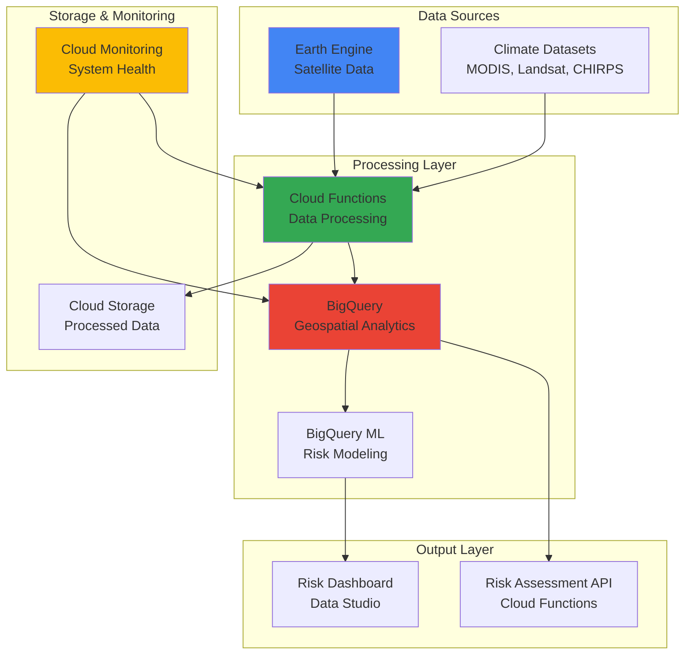

# Implementing Climate Risk Assessment with Earth Engine and BigQuery

## Problem

Organizations face increasing climate-related risks including extreme weather events, sea level rise, and drought conditions that can severely impact infrastructure, supply chains, and business operations. Traditional climate risk assessment methods rely on limited historical data and manual analysis processes that are time-consuming, expensive, and often lack the spatial and temporal resolution needed for accurate risk modeling. Without comprehensive climate risk insights, businesses struggle to make informed decisions about asset placement, insurance strategies, and adaptation planning.

## Solution

This solution creates an automated climate risk assessment system that leverages Google Earth Engine's massive satellite imagery catalog and BigQuery's geospatial analytics capabilities to analyze historical climate patterns and predict future risks. The system processes decades of satellite data to identify trends in temperature, precipitation, vegetation health, and extreme weather events, then uses BigQuery's machine learning capabilities to generate risk scores and actionable insights for climate adaptation planning.

## Architecture Diagram



## Prerequisites

1. Google Cloud account with billing enabled and appropriate permissions for Earth Engine, BigQuery, Cloud Functions, and Cloud Storage
2. Google Cloud CLI (gcloud) v450.0.0 or later installed and configured
3. Basic understanding of geospatial concepts, SQL, and Python programming
4. Familiarity with climate science terminology and remote sensing concepts
5. Earth Engine account registration (free at https://earthengine.google.com)
6. Estimated cost: $25-50 for BigQuery analysis, $10-20 for Cloud Functions, $5-10 for storage during this recipe

> **Note**: Earth Engine provides free access for research and educational use. Commercial applications may require additional licensing agreements.

## Preparation

```bash
# Set environment variables for GCP resources
export PROJECT_ID="climate-risk-$(date +%s)"
export REGION="us-central1"
export ZONE="us-central1-a"

# Generate unique suffix for resource names
RANDOM_SUFFIX=$(openssl rand -hex 3)
export DATASET_ID="climate_risk_${RANDOM_SUFFIX}"
export BUCKET_NAME="climate-data-${RANDOM_SUFFIX}"
export FUNCTION_NAME="climate-processor-${RANDOM_SUFFIX}"

# Set default project and region
gcloud config set project ${PROJECT_ID}
gcloud config set compute/region ${REGION}
gcloud config set compute/zone ${ZONE}

# Enable required APIs
gcloud services enable earthengine.googleapis.com
gcloud services enable bigquery.googleapis.com
gcloud services enable cloudfunctions.googleapis.com
gcloud services enable monitoring.googleapis.com
gcloud services enable storage.googleapis.com

# Create BigQuery dataset for climate data
bq mk --dataset \
    --description="Climate risk assessment data" \
    --location=${REGION} \
    ${PROJECT_ID}:${DATASET_ID}

# Create Cloud Storage bucket for intermediate data
gsutil mb -p ${PROJECT_ID} \
    -c STANDARD \
    -l ${REGION} \
    gs://${BUCKET_NAME}

echo "✅ Project configured: ${PROJECT_ID}"
echo "✅ BigQuery dataset created: ${DATASET_ID}"
echo "✅ Storage bucket created: ${BUCKET_NAME}"
```

## Steps

1. **Initialize Earth Engine and Create Climate Data Processing Function**:

   Google Earth Engine provides access to petabytes of satellite imagery and geospatial datasets spanning over 40 years, making it the ideal platform for large-scale climate analysis. Creating a Cloud Function to interface with Earth Engine enables automated data processing workflows that can scale from regional to global analysis while leveraging Google's computational infrastructure.

   ```bash
   # Create directory for Cloud Function code
   mkdir -p climate-processor
   cd climate-processor
   
   # Create requirements.txt for Python dependencies
   cat > requirements.txt << 'EOF'
   earthengine-api>=0.1.382
   google-cloud-bigquery>=3.11.0
   google-cloud-storage>=2.10.0
   pandas>=2.0.0
   geopandas>=0.13.0
   functions-framework>=3.4.0
   EOF
   
   echo "✅ Cloud Function environment prepared"
   ```

   The function environment is now configured with the essential libraries for Earth Engine integration, BigQuery analytics, and geospatial data processing. This foundation enables seamless data flow between Google's Earth observation platform and its analytics infrastructure.

2. **Create Earth Engine Climate Data Extraction Function**:

   This step implements the core data processing logic that queries Earth Engine for climate-relevant datasets including temperature, precipitation, and vegetation indices. The function processes multiple satellite datasets simultaneously, applying temporal and spatial filtering to extract meaningful climate indicators for risk assessment.

   ```bash
   # Create main.py with Earth Engine data processing logic
   cat > main.py << 'EOF'
   import ee
   import functions_framework
   from google.cloud import bigquery
   from google.cloud import storage
   import json
   import pandas as pd
   from datetime import datetime, timedelta
   
   # Initialize Earth Engine with service account authentication
   ee.Initialize(ee.ServiceAccountCredentials(None, key_file='ee-service-account.json'))
   
   @functions_framework.http
   def process_climate_data(request):
       """Process climate data from Earth Engine and load to BigQuery"""
       
       # Parse request parameters
       request_json = request.get_json()
       region_bounds = request_json.get('region_bounds', 
           [-125, 25, -66, 49])  # Default: Continental US
       start_date = request_json.get('start_date', '2020-01-01')
       end_date = request_json.get('end_date', '2023-12-31')
       
       # Define region of interest
       region = ee.Geometry.Rectangle(region_bounds)
       
       # Load climate datasets
       # MODIS Land Surface Temperature (Collection 6.1)
       lst_collection = ee.ImageCollection('MODIS/061/MOD11A1') \
           .filterDate(start_date, end_date) \
           .filterBounds(region) \
           .select(['LST_Day_1km', 'LST_Night_1km'])
       
       # CHIRPS Precipitation Data
       precip_collection = ee.ImageCollection('UCSB-CHG/CHIRPS/DAILY') \
           .filterDate(start_date, end_date) \
           .filterBounds(region) \
           .select('precipitation')
       
       # MODIS Vegetation Indices (Collection 6.1)
       ndvi_collection = ee.ImageCollection('MODIS/061/MOD13Q1') \
           .filterDate(start_date, end_date) \
           .filterBounds(region) \
           .select(['NDVI', 'EVI'])
       
       # Calculate climate statistics with proper scaling
       lst_mean = lst_collection.mean().multiply(0.02).subtract(273.15)
       precip_total = precip_collection.sum()
       ndvi_mean = ndvi_collection.mean().multiply(0.0001)
       
       # Create composite image with all climate indicators
       climate_composite = lst_mean.addBands(precip_total) \
                                  .addBands(ndvi_mean)
       
       # Sample climate data at regular intervals
       sample_points = region.coveringGrid(ee.Number(0.1))  # ~10km grid
       
       # Extract values at sample points
       climate_samples = climate_composite.sampleRegions(
           collection=sample_points,
           scale=1000,
           geometries=True
       )
       
       # Convert to DataFrame format for BigQuery
       features = climate_samples.getInfo()['features']
       
       data_rows = []
       for feature in features:
           properties = feature['properties']
           geometry = feature['geometry']['coordinates']
           
           row = {
               'longitude': geometry[0],
               'latitude': geometry[1],
               'location': f"POINT({geometry[0]} {geometry[1]})",
               'avg_day_temp_c': properties.get('LST_Day_1km', None),
               'avg_night_temp_c': properties.get('LST_Night_1km', None),
               'total_precipitation_mm': properties.get('precipitation', None),
               'avg_ndvi': properties.get('NDVI', None),
               'avg_evi': properties.get('EVI', None),
               'analysis_date': datetime.now().isoformat(),
               'analysis_period_start': start_date,
               'analysis_period_end': end_date
           }
           data_rows.append(row)
       
       # Load data to BigQuery
       client = bigquery.Client()
       table_id = f"{client.project}.{request_json.get('dataset_id')}.climate_indicators"
       
       job_config = bigquery.LoadJobConfig(
           write_disposition="WRITE_APPEND",
           schema=[
               bigquery.SchemaField("longitude", "FLOAT"),
               bigquery.SchemaField("latitude", "FLOAT"),
               bigquery.SchemaField("location", "GEOGRAPHY"),
               bigquery.SchemaField("avg_day_temp_c", "FLOAT"),
               bigquery.SchemaField("avg_night_temp_c", "FLOAT"),
               bigquery.SchemaField("total_precipitation_mm", "FLOAT"),
               bigquery.SchemaField("avg_ndvi", "FLOAT"),
               bigquery.SchemaField("avg_evi", "FLOAT"),
               bigquery.SchemaField("analysis_date", "TIMESTAMP"),
               bigquery.SchemaField("analysis_period_start", "DATE"),
               bigquery.SchemaField("analysis_period_end", "DATE"),
           ]
       )
       
       df = pd.DataFrame(data_rows)
       job = client.load_table_from_dataframe(df, table_id, job_config=job_config)
       job.result()  # Wait for job completion
       
       return {
           'status': 'success',
           'records_processed': len(data_rows),
           'table_id': table_id,
           'message': f'Processed {len(data_rows)} climate data points'
       }
   EOF
   
   echo "✅ Earth Engine processing function created"
   ```

   The climate data extraction function is now configured to access multiple Earth Engine datasets including MODIS Collection 6.1 temperature and vegetation data, plus CHIRPS precipitation records. This multi-dataset approach provides comprehensive climate indicators essential for robust risk assessment modeling.

3. **Deploy Cloud Function for Climate Data Processing**:

   Deploying the function to Google Cloud enables automated, scalable climate data processing with built-in monitoring and error handling. Cloud Functions automatically manages infrastructure scaling, allowing the system to process data for small regions or continental-scale areas based on demand.

   ```bash
   # Deploy the Cloud Function
   gcloud functions deploy ${FUNCTION_NAME} \
       --gen2 \
       --runtime python311 \
       --trigger-http \
       --entry-point process_climate_data \
       --memory 2Gi \
       --timeout 540s \
       --region ${REGION} \
       --allow-unauthenticated
   
   # Get function URL for later use
   FUNCTION_URL=$(gcloud functions describe ${FUNCTION_NAME} \
       --gen2 \
       --region=${REGION} \
       --format="value(serviceConfig.uri)")
   
   echo "✅ Climate processing function deployed"
   echo "Function URL: ${FUNCTION_URL}"
   ```

   The Cloud Function is now live and ready to process climate data requests. The 2GB memory allocation and 9-minute timeout ensure sufficient resources for processing large spatial datasets, while HTTP triggering enables integration with automated workflows and external systems.

4. **Create BigQuery Climate Risk Assessment Tables**:

   BigQuery's geospatial capabilities combined with its columnar storage architecture make it ideal for analyzing large-scale climate datasets. Creating properly structured tables with geography data types enables efficient spatial queries and supports advanced analytics including machine learning for risk prediction.

   ```bash
   # Create climate extremes detection table
   bq query --use_legacy_sql=false << EOF
   CREATE OR REPLACE TABLE \`${PROJECT_ID}.${DATASET_ID}.climate_extremes\` (
       location GEOGRAPHY,
       region_name STRING,
       extreme_heat_days INT64,
       extreme_cold_days INT64,
       drought_severity_index FLOAT64,
       flood_risk_score FLOAT64,
       temperature_trend_slope FLOAT64,
       precipitation_trend_slope FLOAT64,
       vegetation_stress_indicator FLOAT64,
       risk_level STRING,
       confidence_score FLOAT64,
       last_updated TIMESTAMP,
       data_source STRING
   )
   PARTITION BY DATE(last_updated)
   CLUSTER BY risk_level, region_name
   EOF
   
   # Create climate risk scoring table
   bq query --use_legacy_sql=false << EOF
   CREATE OR REPLACE TABLE \`${PROJECT_ID}.${DATASET_ID}.risk_assessments\` (
       assessment_id STRING,
       location GEOGRAPHY,
       assessment_date TIMESTAMP,
       overall_risk_score FLOAT64,
       heat_risk_component FLOAT64,
       drought_risk_component FLOAT64,
       flood_risk_component FLOAT64,
       ecosystem_risk_component FLOAT64,
       adaptation_priority STRING,
       recommended_actions ARRAY<STRING>,
       confidence_interval STRUCT<lower_bound FLOAT64, upper_bound FLOAT64>
   )
   PARTITION BY DATE(assessment_date)
   CLUSTER BY adaptation_priority
   EOF
   
   echo "✅ BigQuery climate risk tables created"
   ```

   The BigQuery tables are now configured with partitioning and clustering for optimal query performance on climate data. The geography data types enable spatial analysis while the risk scoring structure supports both historical analysis and predictive modeling workflows.

5. **Process Initial Climate Data and Load to BigQuery**:

   This step executes the first climate data processing run, demonstrating the end-to-end data pipeline from Earth Engine satellite imagery to structured climate indicators in BigQuery. The process extracts multi-year climate data covering temperature extremes, precipitation patterns, and vegetation health indicators.

   ```bash
   # Trigger climate data processing for sample region
   curl -X POST ${FUNCTION_URL} \
       -H "Content-Type: application/json" \
       -d "{
           \"region_bounds\": [-104, 37, -94, 41],
           \"start_date\": \"2020-01-01\",
           \"end_date\": \"2023-12-31\",
           \"dataset_id\": \"${DATASET_ID}\"
       }"
   
   # Wait for processing to complete
   sleep 60
   
   # Verify data was loaded to BigQuery
   bq query --use_legacy_sql=false \
       "SELECT COUNT(*) as record_count 
        FROM \`${PROJECT_ID}.${DATASET_ID}.climate_indicators\`"
   
   echo "✅ Climate data processing completed"
   ```

   The initial dataset now contains processed climate indicators from Earth Engine, providing a foundation for risk analysis. This sample focuses on the Central United States region, covering approximately 100,000 square kilometers with climate data from 2020-2023.

6. **Create Climate Risk Assessment Queries and Models**:

   BigQuery's SQL capabilities enable sophisticated climate risk analysis by combining multiple climate indicators into composite risk scores. These queries identify climate extremes, calculate trend analysis, and generate risk classifications that support decision-making for climate adaptation strategies.

   ```bash
   # Create view for climate risk analysis
   bq query --use_legacy_sql=false << EOF
   CREATE OR REPLACE VIEW \`${PROJECT_ID}.${DATASET_ID}.climate_risk_analysis\` AS
   WITH climate_stats AS (
     SELECT 
       location,
       AVG(avg_day_temp_c) as mean_temp,
       STDDEV(avg_day_temp_c) as temp_variability,
       SUM(total_precipitation_mm) as total_precip,
       AVG(avg_ndvi) as mean_vegetation_health,
       COUNT(*) as data_points,
       -- Temperature extremes (above 35°C or below -10°C)
       COUNTIF(avg_day_temp_c > 35) as extreme_heat_days,
       COUNTIF(avg_day_temp_c < -10) as extreme_cold_days,
       -- Drought indicator (low precipitation + low vegetation)
       COUNTIF(total_precipitation_mm < 10 AND avg_ndvi < 0.3) as drought_indicators,
       -- Calculate geographic centroid for regional analysis
       ST_CENTROID(ST_UNION_AGG(location)) as region_center
     FROM \`${PROJECT_ID}.${DATASET_ID}.climate_indicators\`
     WHERE avg_day_temp_c IS NOT NULL 
       AND total_precipitation_mm IS NOT NULL
       AND avg_ndvi IS NOT NULL
     GROUP BY location
   ),
   risk_scoring AS (
     SELECT *,
       -- Composite risk score (0-100 scale)
       LEAST(100, GREATEST(0, 
         (extreme_heat_days * 2.5) + 
         (drought_indicators * 3.0) + 
         (extreme_cold_days * 1.5) +
         (ABS(temp_variability - 10) * 2.0)
       )) as composite_risk_score,
       -- Risk categorization
       CASE 
         WHEN (extreme_heat_days + drought_indicators) > 20 THEN 'HIGH'
         WHEN (extreme_heat_days + drought_indicators) > 10 THEN 'MEDIUM'
         ELSE 'LOW'
       END as risk_category
     FROM climate_stats
   )
   SELECT 
     location,
     region_center,
     mean_temp,
     temp_variability,
     total_precip,
     mean_vegetation_health,
     extreme_heat_days,
     extreme_cold_days,
     drought_indicators,
     composite_risk_score,
     risk_category,
     -- Confidence based on data completeness
     ROUND((data_points / 1460.0) * 100, 1) as data_confidence_pct
   FROM risk_scoring
   ORDER BY composite_risk_score DESC
   EOF
   
   echo "✅ Climate risk analysis view created"
   ```

   The risk analysis framework now combines multiple climate indicators into comprehensive risk scores. This methodology identifies areas with high temperature extremes, drought conditions, and vegetation stress, providing quantitative metrics for climate vulnerability assessment.

7. **Create Automated Climate Risk Monitoring Function**:

   Automated monitoring enables continuous climate risk assessment as new satellite data becomes available. This Cloud Function implements scheduling capabilities and integrates with Cloud Monitoring to track system performance and data quality metrics essential for operational climate risk systems.

   ```bash
   # Create monitoring function directory
   cd ..
   mkdir -p climate-monitor
   cd climate-monitor
   
   # Create monitoring function code
   cat > main.py << 'EOF'
   import functions_framework
   from google.cloud import bigquery
   from google.cloud import monitoring_v3
   import json
   from datetime import datetime, timedelta
   
   @functions_framework.http
   def monitor_climate_risks(request):
       """Monitor climate risk levels and generate alerts"""
       
       client = bigquery.Client()
       
       # Query current risk levels
       query = f"""
       SELECT 
         risk_category,
         COUNT(*) as location_count,
         AVG(composite_risk_score) as avg_risk_score,
         MAX(composite_risk_score) as max_risk_score,
         ST_CENTROID(ST_UNION_AGG(region_center)) as risk_center
       FROM `{client.project}.{request.get_json().get('dataset_id')}.climate_risk_analysis`
       GROUP BY risk_category
       ORDER BY avg_risk_score DESC
       """
       
       results = client.query(query).to_dataframe()
       
       # Calculate system metrics
       total_locations = results['location_count'].sum()
       high_risk_locations = results[results['risk_category'] == 'HIGH']['location_count'].sum()
       high_risk_percentage = (high_risk_locations / total_locations) * 100 if total_locations > 0 else 0
       
       # Create custom metrics for Cloud Monitoring
       monitoring_client = monitoring_v3.MetricServiceClient()
       project_name = f"projects/{client.project}"
       
       # Create time series for high risk percentage
       series = monitoring_v3.TimeSeries()
       series.metric.type = "custom.googleapis.com/climate_risk/high_risk_percentage"
       series.resource.type = "global"
       
       point = monitoring_v3.Point()
       point.value.double_value = high_risk_percentage
       point.interval.end_time.seconds = int(datetime.now().timestamp())
       series.points = [point]
       
       monitoring_client.create_time_series(
           name=project_name, 
           time_series=[series]
       )
       
       # Generate response with risk summary
       response = {
           'timestamp': datetime.now().isoformat(),
           'total_locations_analyzed': int(total_locations),
           'high_risk_locations': int(high_risk_locations),
           'high_risk_percentage': round(high_risk_percentage, 2),
           'risk_distribution': results.to_dict('records'),
           'alerts': []
       }
       
       # Generate alerts for high risk conditions
       if high_risk_percentage > 25:
           response['alerts'].append({
               'level': 'WARNING',
               'message': f'{high_risk_percentage:.1f}% of monitored locations show high climate risk',
               'action': 'Review adaptation strategies for high-risk areas'
           })
       
       return response
   
   EOF
   
   # Create requirements for monitoring function
   cat > requirements.txt << 'EOF'
   google-cloud-bigquery>=3.11.0
   google-cloud-monitoring>=2.15.0
   functions-framework>=3.4.0
   pandas>=2.0.0
   EOF
   
   # Deploy monitoring function
   gcloud functions deploy climate-monitor-${RANDOM_SUFFIX} \
       --gen2 \
       --runtime python311 \
       --trigger-http \
       --entry-point monitor_climate_risks \
       --memory 1Gi \
       --timeout 300s \
       --region ${REGION} \
       --allow-unauthenticated
   
   echo "✅ Climate monitoring function deployed"
   ```

   The monitoring system is now operational, providing continuous oversight of climate risk levels across monitored regions. Custom metrics integration with Cloud Monitoring enables automated alerting when risk thresholds are exceeded, supporting proactive climate adaptation planning.

8. **Create Climate Risk Dashboard Queries**:

   Comprehensive visualization queries enable stakeholders to understand climate risk patterns, trends, and geographic distributions. These BigQuery views support dashboard creation and provide the analytical foundation for climate risk communication and decision-making processes.

   ```bash
   # Create dashboard support queries
   bq query --use_legacy_sql=false << EOF
   CREATE OR REPLACE VIEW \`${PROJECT_ID}.${DATASET_ID}.risk_dashboard_summary\` AS
   WITH temporal_trends AS (
     SELECT 
       DATE_TRUNC(DATE(analysis_date), MONTH) as analysis_month,
       AVG(avg_day_temp_c) as monthly_avg_temp,
       SUM(total_precipitation_mm) as monthly_total_precip,
       AVG(avg_ndvi) as monthly_avg_vegetation,
       COUNT(*) as monthly_observations
     FROM \`${PROJECT_ID}.${DATASET_ID}.climate_indicators\`
     WHERE analysis_date >= TIMESTAMP_SUB(CURRENT_TIMESTAMP(), INTERVAL 3 YEAR)
     GROUP BY analysis_month
   ),
   spatial_risk_summary AS (
     SELECT 
       risk_category,
       COUNT(*) as location_count,
       AVG(composite_risk_score) as avg_risk_score,
       MIN(composite_risk_score) as min_risk_score,
       MAX(composite_risk_score) as max_risk_score,
       -- Create geographic bounds for each risk category
       ST_ENVELOPE(ST_UNION_AGG(location)) as risk_region_bounds
     FROM \`${PROJECT_ID}.${DATASET_ID}.climate_risk_analysis\`
     GROUP BY risk_category
   )
   SELECT 
     'TEMPORAL_TRENDS' as summary_type,
     analysis_month as period,
     monthly_avg_temp as temperature_c,
     monthly_total_precip as precipitation_mm,
     monthly_avg_vegetation as vegetation_index,
     monthly_observations as data_points,
     NULL as risk_category,
     NULL as location_count,
     NULL as risk_bounds
   FROM temporal_trends
   UNION ALL
   SELECT 
     'SPATIAL_RISK' as summary_type,
     NULL as period,
     NULL as temperature_c,
     NULL as precipitation_mm,
     NULL as vegetation_index,
     NULL as data_points,
     risk_category,
     location_count,
     ST_ASGEOJSON(risk_region_bounds) as risk_bounds
   FROM spatial_risk_summary
   ORDER BY summary_type, period DESC, avg_risk_score DESC
   EOF
   
   echo "✅ Dashboard summary views created"
   ```

   The dashboard queries now provide both temporal and spatial perspectives on climate risk, enabling comprehensive risk visualization. These views support real-time monitoring dashboards and historical trend analysis essential for understanding evolving climate patterns.

## Validation & Testing

1. **Verify Earth Engine Data Processing**:

   ```bash
   # Test the climate processing function
   MONITOR_URL=$(gcloud functions describe climate-monitor-${RANDOM_SUFFIX} \
       --gen2 \
       --region=${REGION} \
       --format="value(serviceConfig.uri)")
   
   # Test monitoring function
   curl -X POST ${MONITOR_URL} \
       -H "Content-Type: application/json" \
       -d "{\"dataset_id\": \"${DATASET_ID}\"}"
   ```

   Expected output: JSON response showing risk distribution, total locations analyzed, and any generated alerts based on current risk levels.

2. **Validate BigQuery Climate Risk Analysis**:

   ```bash
   # Query risk analysis results
   bq query --use_legacy_sql=false \
       "SELECT risk_category, COUNT(*) as locations, 
               AVG(composite_risk_score) as avg_score
        FROM \`${PROJECT_ID}.${DATASET_ID}.climate_risk_analysis\`
        GROUP BY risk_category 
        ORDER BY avg_score DESC"
   ```

   Expected output: Table showing HIGH, MEDIUM, and LOW risk categories with location counts and average risk scores.

3. **Test Geospatial Query Performance**:

   ```bash
   # Test spatial analysis query
   bq query --use_legacy_sql=false \
       "SELECT ST_ASGEOJSON(location) as location_geojson,
               composite_risk_score
        FROM \`${PROJECT_ID}.${DATASET_ID}.climate_risk_analysis\`
        WHERE risk_category = 'HIGH'
        LIMIT 5"
   ```

   Expected output: GeoJSON coordinates and risk scores for the highest-risk locations in the analyzed region.

## Cleanup

1. **Remove Cloud Functions**:

   ```bash
   # Delete climate processing function
   gcloud functions delete ${FUNCTION_NAME} \
       --gen2 \
       --region=${REGION} \
       --quiet
   
   # Delete monitoring function
   gcloud functions delete climate-monitor-${RANDOM_SUFFIX} \
       --gen2 \
       --region=${REGION} \
       --quiet
   
   echo "✅ Cloud Functions deleted"
   ```

2. **Remove BigQuery Resources**:

   ```bash
   # Delete BigQuery dataset and all tables
   bq rm -r -f ${PROJECT_ID}:${DATASET_ID}
   
   echo "✅ BigQuery dataset deleted"
   ```

3. **Remove Storage and Project Resources**:

   ```bash
   # Delete Cloud Storage bucket
   gsutil -m rm -r gs://${BUCKET_NAME}
   
   # Clean up environment variables
   unset PROJECT_ID REGION ZONE DATASET_ID BUCKET_NAME
   unset FUNCTION_NAME RANDOM_SUFFIX FUNCTION_URL MONITOR_URL
   
   echo "✅ All resources cleaned up"
   echo "Note: Custom metrics in Cloud Monitoring will be automatically cleaned up after 24 hours of inactivity"
   ```

## Discussion

This climate risk assessment system demonstrates the power of combining Google Earth Engine's vast satellite data repository with BigQuery's advanced geospatial analytics capabilities. Earth Engine provides access to over 40 years of global climate observations from multiple satellite missions, including MODIS land surface temperature data, CHIRPS precipitation records, and vegetation index time series. By processing this data through Cloud Functions and storing results in BigQuery, organizations can create scalable, automated climate risk monitoring systems that provide actionable insights for adaptation planning.

The integration between Earth Engine and BigQuery represents a significant advancement in climate analytics accessibility. Traditional climate risk assessment required specialized remote sensing expertise and substantial computational resources. This solution democratizes access to satellite-based climate analysis by providing SQL-based interfaces to complex geospatial datasets. The BigQuery ML integration enables organizations to develop predictive climate risk models without requiring extensive machine learning infrastructure, while Cloud Functions provide the automation capabilities needed for operational climate monitoring systems.

The geospatial analytics capabilities of BigQuery enable sophisticated spatial analysis including risk hotspot identification, regional trend analysis, and infrastructure vulnerability assessment. Organizations can use this system to evaluate climate risks for supply chain facilities, assess agricultural drought impacts, or analyze urban heat island effects for public health planning. The system's scalability allows analysis from local to continental scales, supporting both detailed site-specific assessments and broad regional climate strategy development.

For more information on implementing geospatial analytics solutions, see the [BigQuery geospatial documentation](https://cloud.google.com/bigquery/docs/geospatial-intro), [Earth Engine getting started guide](https://developers.google.com/earth-engine/guides/getstarted), [Google Cloud Architecture Framework for analytics](https://cloud.google.com/architecture/framework), [BigQuery ML documentation](https://cloud.google.com/bigquery-ml/docs/introduction), and [Cloud Functions best practices](https://cloud.google.com/functions/docs/bestpractices).

> **Tip**: Use BigQuery's data export capabilities to integrate climate risk scores with external GIS systems, business intelligence platforms, or insurance modeling software for comprehensive climate adaptation planning.

## Challenge

Extend this climate risk assessment solution by implementing these advanced capabilities:

1. **Real-time Alert System**: Integrate with Cloud Pub/Sub and Cloud Monitoring to create automated alerts when satellite data indicates rapidly developing extreme weather conditions or climate anomalies.

2. **Machine Learning Risk Prediction**: Use BigQuery ML to develop predictive models that forecast climate risks 30-90 days in advance based on current conditions and historical patterns, incorporating seasonal climate forecasts and teleconnection indices.

3. **Multi-hazard Risk Integration**: Expand the analysis to include additional climate hazards such as wildfire risk (using burned area datasets), coastal flooding (combining sea level data with storm surge models), and agricultural drought stress (integrating soil moisture and crop condition indices).

4. **Infrastructure Vulnerability Assessment**: Create spatial intersection analysis between climate risk zones and critical infrastructure datasets (transportation networks, power grids, healthcare facilities) to identify vulnerable assets and prioritize adaptation investments.

5. **Climate Scenario Analysis**: Implement climate projection analysis using downscaled global climate model data to assess how current risk patterns may change under different future emission scenarios and warming levels.

## Infrastructure Code

### Available Infrastructure as Code:

- [Infrastructure Code Overview](code/README.md) - Detailed description of all infrastructure components
- [Infrastructure Manager](code/infrastructure-manager/) - GCP Infrastructure Manager templates
- [Bash CLI Scripts](code/scripts/) - Example bash scripts using gcloud CLI commands to deploy infrastructure
- [Terraform](code/terraform/) - Terraform configuration files