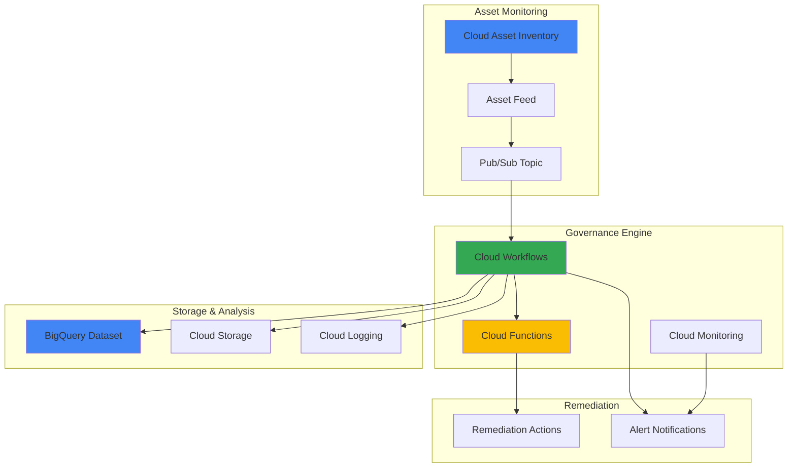

# Cloud Asset Governance with Cloud Asset Inventory and Cloud Workflows

## Problem

Organizations managing large-scale Google Cloud environments struggle with maintaining consistent governance policies across hundreds of projects and thousands of resources. Manual compliance checks are time-consuming, error-prone, and cannot scale to detect policy violations in real-time, leading to security vulnerabilities, cost overruns, and regulatory compliance failures that could expose the organization to significant financial and reputational risks.

## Solution

Build a comprehensive automated governance system using Cloud Asset Inventory to continuously monitor resource changes, Cloud Workflows to orchestrate compliance evaluation logic, and Cloud Functions to execute remediation actions. This serverless architecture provides real-time policy enforcement, automated violation detection, and systematic remediation across your entire Google Cloud organization while maintaining detailed audit trails for compliance reporting.

## Architecture Diagram



## Prerequisites

1. Google Cloud project with billing enabled and Organization-level access
2. gcloud CLI v531.0.0+ installed and configured
3. Basic understanding of Cloud IAM, Pub/Sub, and serverless architectures
4. Organization Admin or Security Admin roles for setting up asset feeds
5. Estimated cost: $50-150/month for medium-scale deployments with moderate governance activity

> **Note**: This recipe requires organization-level permissions to create asset feeds that monitor resources across multiple projects. Ensure you have the necessary administrative access before proceeding.

## Preparation

```bash
# Set environment variables for the governance system
export PROJECT_ID="governance-system-$(date +%s)"
export ORGANIZATION_ID=$(gcloud organizations list \
    --format="value(name)" --limit=1)
export REGION="us-central1"
export ZONE="us-central1-a"

# Generate unique suffix for resource names
RANDOM_SUFFIX=$(openssl rand -hex 3)
export GOVERNANCE_SUFFIX="gov-${RANDOM_SUFFIX}"

# Set default project and region
gcloud config set project ${PROJECT_ID}
gcloud config set compute/region ${REGION}
gcloud config set compute/zone ${ZONE}

# Create the governance project
gcloud projects create ${PROJECT_ID} \
    --name="Cloud Asset Governance System" \
    --organization=${ORGANIZATION_ID}

# Link billing account (replace with your billing account ID)
export BILLING_ACCOUNT=$(gcloud billing accounts list \
    --format="value(name)" --limit=1)
gcloud billing projects link ${PROJECT_ID} \
    --billing-account=${BILLING_ACCOUNT}

# Enable required APIs for the governance system
gcloud services enable cloudasset.googleapis.com
gcloud services enable workflows.googleapis.com
gcloud services enable cloudfunctions.googleapis.com
gcloud services enable pubsub.googleapis.com
gcloud services enable bigquery.googleapis.com
gcloud services enable storage.googleapis.com
gcloud services enable monitoring.googleapis.com
gcloud services enable logging.googleapis.com

echo "✅ Governance project configured: ${PROJECT_ID}"
echo "✅ Organization ID: ${ORGANIZATION_ID}"
```

## Steps

1. **Create Cloud Storage Bucket for Governance Data**:

   Cloud Storage serves as the central repository for governance policies, compliance reports, and asset snapshots. This bucket will store policy definitions, violation reports, and historical compliance data that enable audit trails and trend analysis for your governance framework.

   ```bash
   # Create storage bucket for governance artifacts
   export GOVERNANCE_BUCKET="${PROJECT_ID}-governance-${GOVERNANCE_SUFFIX}"
   
   gsutil mb -p ${PROJECT_ID} \
       -c STANDARD \
       -l ${REGION} \
       gs://${GOVERNANCE_BUCKET}
   
   # Enable versioning for audit trail compliance
   gsutil versioning set on gs://${GOVERNANCE_BUCKET}
   
   # Create folder structure for organized governance data
   echo "Created governance storage structure" | \
       gsutil cp - gs://${GOVERNANCE_BUCKET}/policies/.keep
   echo "Created compliance reports folder" | \
       gsutil cp - gs://${GOVERNANCE_BUCKET}/reports/.keep
   
   echo "✅ Governance bucket created: ${GOVERNANCE_BUCKET}"
   ```

   The governance bucket is now ready with versioning enabled to maintain an immutable audit trail of all policy changes and compliance activities. This structured approach supports regulatory requirements and provides historical context for governance decisions.

2. **Create BigQuery Dataset for Asset Analytics**:

   BigQuery provides powerful analytics capabilities for asset inventory data, enabling complex compliance queries, trend analysis, and reporting across your entire Google Cloud organization. This dataset will serve as the analytical foundation for governance insights and compliance dashboards.

   ```bash
   # Create BigQuery dataset for asset governance analytics
   export BQ_DATASET="asset_governance_${GOVERNANCE_SUFFIX}"
   
   bq mk --project_id=${PROJECT_ID} \
       --location=${REGION} \
       --description="Cloud Asset Governance Analytics Dataset" \
       ${BQ_DATASET}
   
   # Create tables for asset tracking and compliance reporting
   bq mk --project_id=${PROJECT_ID} \
       --table ${BQ_DATASET}.asset_violations \
       violation_id:STRING,resource_name:STRING,policy_name:STRING,violation_type:STRING,severity:STRING,timestamp:TIMESTAMP,project_id:STRING,remediation_status:STRING
   
   bq mk --project_id=${PROJECT_ID} \
       --table ${BQ_DATASET}.compliance_reports \
       report_id:STRING,scan_timestamp:TIMESTAMP,total_resources:INTEGER,violations_found:INTEGER,high_severity:INTEGER,medium_severity:INTEGER,low_severity:INTEGER,compliance_score:FLOAT
   
   echo "✅ BigQuery dataset created: ${BQ_DATASET}"
   ```

   The BigQuery dataset provides a scalable analytics foundation for governance data, supporting real-time compliance monitoring and historical trend analysis. This enables data-driven governance decisions and comprehensive compliance reporting.

3. **Create Pub/Sub Topic for Asset Change Notifications**:

   Pub/Sub serves as the event-driven backbone of the governance system, receiving real-time notifications from Cloud Asset Inventory whenever resources are created, modified, or deleted. This enables immediate response to governance policy violations and maintains continuous compliance monitoring.

   ```bash
   # Create Pub/Sub topic for asset change notifications
   export ASSET_TOPIC="asset-changes-${GOVERNANCE_SUFFIX}"
   
   gcloud pubsub topics create ${ASSET_TOPIC} \
       --message-retention-duration=7d
   
   # Create subscription for workflow processing
   export WORKFLOW_SUBSCRIPTION="workflow-processor-${GOVERNANCE_SUFFIX}"
   
   gcloud pubsub subscriptions create ${WORKFLOW_SUBSCRIPTION} \
       --topic=${ASSET_TOPIC} \
       --ack-deadline=600s \
       --message-retention-duration=7d
   
   echo "✅ Pub/Sub infrastructure created: ${ASSET_TOPIC}"
   ```

   The Pub/Sub topic is configured with appropriate message retention settings to ensure reliable delivery of asset change events to the governance workflow system.

4. **Create Service Account for Governance Operations**:

   A dedicated service account with least-privilege permissions ensures secure operation of the governance system while maintaining the ability to read asset data, execute workflows, and perform authorized remediation actions across the organization.

   ```bash
   # Create service account for governance operations
   export GOVERNANCE_SA="governance-engine-${GOVERNANCE_SUFFIX}"
   
   gcloud iam service-accounts create ${GOVERNANCE_SA} \
       --display-name="Cloud Asset Governance Engine" \
       --description="Service account for automated governance operations"
   
   # Grant necessary permissions for asset monitoring and governance
   gcloud organizations add-iam-policy-binding ${ORGANIZATION_ID} \
       --member="serviceAccount:${GOVERNANCE_SA}@${PROJECT_ID}.iam.gserviceaccount.com" \
       --role="roles/cloudasset.viewer"
   
   gcloud projects add-iam-policy-binding ${PROJECT_ID} \
       --member="serviceAccount:${GOVERNANCE_SA}@${PROJECT_ID}.iam.gserviceaccount.com" \
       --role="roles/workflows.invoker"
   
   gcloud projects add-iam-policy-binding ${PROJECT_ID} \
       --member="serviceAccount:${GOVERNANCE_SA}@${PROJECT_ID}.iam.gserviceaccount.com" \
       --role="roles/bigquery.dataEditor"
   
   gcloud projects add-iam-policy-binding ${PROJECT_ID} \
       --member="serviceAccount:${GOVERNANCE_SA}@${PROJECT_ID}.iam.gserviceaccount.com" \
       --role="roles/storage.objectAdmin"
   
   echo "✅ Governance service account created: ${GOVERNANCE_SA}"
   ```

   The service account is configured with minimal required permissions following the principle of least privilege, ensuring secure operations while enabling comprehensive governance capabilities.

5. **Deploy Cloud Function for Policy Evaluation**:

   Cloud Functions provide serverless compute for executing governance policies against asset data. This function evaluates resources against compliance rules and determines appropriate remediation actions based on configurable policy definitions.

   ```bash
   # Create directory for function source code
   mkdir -p governance-function
   cd governance-function
   
   # Create the policy evaluation function
   cat > main.py << 'EOF'
import json
import logging
from google.cloud import bigquery
from google.cloud import storage
from datetime import datetime
import hashlib
import os

def evaluate_governance_policy(request):
    """Evaluate assets against governance policies."""
    
    # Initialize clients
    bq_client = bigquery.Client()
    storage_client = storage.Client()
    
    # Parse asset change event
    event_data = request.get_json()
    
    if not event_data or 'asset' not in event_data:
        return {'status': 'no_asset_data'}, 200
    
    asset = event_data['asset']
    asset_type = asset.get('asset_type', '')
    resource_name = asset.get('name', '')
    
    # Define governance policies
    violations = []
    
    # Policy 1: Check for unencrypted storage buckets
    if asset_type == 'storage.googleapis.com/Bucket':
        resource_data = asset.get('resource', {}).get('data', {})
        encryption = resource_data.get('encryption', {})
        if not encryption:
            violations.append({
                'policy': 'storage_encryption_required',
                'severity': 'HIGH',
                'description': 'Storage bucket lacks customer-managed encryption'
            })
    
    # Policy 2: Check for compute instances without secure boot
    if asset_type == 'compute.googleapis.com/Instance':
        resource_data = asset.get('resource', {}).get('data', {})
        secure_boot = resource_data.get('shieldedInstanceConfig', {}).get('enableSecureBoot', False)
        if not secure_boot:
            violations.append({
                'policy': 'compute_secure_boot_required',
                'severity': 'MEDIUM',
                'description': 'Compute instance lacks secure boot configuration'
            })
    
    # Policy 3: Check for public IP assignments
    if asset_type == 'compute.googleapis.com/Instance':
        resource_data = asset.get('resource', {}).get('data', {})
        network_interfaces = resource_data.get('networkInterfaces', [])
        for interface in network_interfaces:
            if interface.get('accessConfigs'):
                violations.append({
                    'policy': 'no_public_ip_required',
                    'severity': 'HIGH',
                    'description': 'Compute instance has public IP assignment'
                })
                break
    
    # Record violations in BigQuery
    if violations:
        governance_suffix = os.environ.get('GOVERNANCE_SUFFIX', 'default')
        table_id = f"{bq_client.project}.asset_governance_{governance_suffix}.asset_violations"
        
        rows_to_insert = []
        for violation in violations:
            violation_id = hashlib.md5(f"{resource_name}-{violation['policy']}-{datetime.now().isoformat()}".encode()).hexdigest()
            rows_to_insert.append({
                'violation_id': violation_id,
                'resource_name': resource_name,
                'policy_name': violation['policy'],
                'violation_type': violation['description'],
                'severity': violation['severity'],
                'timestamp': datetime.now().isoformat(),
                'project_id': asset.get('ancestors', [])[-1] if asset.get('ancestors') else 'unknown',
                'remediation_status': 'DETECTED'
            })
        
        errors = bq_client.insert_rows_json(table_id, rows_to_insert)
        if errors:
            logging.error(f"BigQuery insert errors: {errors}")
    
    return {
        'status': 'completed',
        'violations_found': len(violations),
        'resource_name': resource_name,
        'asset_type': asset_type
    }, 200
EOF

   # Create requirements file with latest versions
   cat > requirements.txt << 'EOF'
google-cloud-bigquery>=3.25.0
google-cloud-storage>=2.18.0
functions-framework>=3.8.0
EOF

   # Deploy the governance function
   gcloud functions deploy governance-policy-evaluator \
       --gen2 \
       --runtime=python312 \
       --region=${REGION} \
       --source=. \
       --entry-point=evaluate_governance_policy \
       --trigger=http \
       --service-account=${GOVERNANCE_SA}@${PROJECT_ID}.iam.gserviceaccount.com \
       --set-env-vars="GOVERNANCE_SUFFIX=${GOVERNANCE_SUFFIX}" \
       --max-instances=10 \
       --memory=512MB \
       --timeout=540s
   
   cd ..
   
   echo "✅ Policy evaluation function deployed"
   ```

   The Cloud Function implements configurable governance policies including encryption requirements, security configurations, and network access controls. This serverless approach ensures scalable policy evaluation that automatically adapts to changing resource volumes.

6. **Create Cloud Workflow for Orchestration**:

   Cloud Workflows orchestrates the complete governance process from asset change detection through policy evaluation, violation recording, and remediation action triggering. This declarative workflow ensures consistent processing and provides visibility into governance operations.

   ```bash
   # Create the governance orchestration workflow
   cat > governance-workflow.yaml << EOF
main:
  steps:
    - initialize:
        assign:
          - project_id: "${PROJECT_ID}"
          - governance_suffix: "${GOVERNANCE_SUFFIX}"
          - function_url: "https://${REGION}-${PROJECT_ID}.cloudfunctions.net/governance-policy-evaluator"
    
    - parse_pubsub_message:
        assign:
          - message_data: \${base64.decode(args.message.data)}
          - asset_change: \${json.decode(message_data)}
    
    - log_asset_change:
        call: sys.log
        args:
          text: \${"Processing asset change: " + asset_change.asset.name}
          severity: "INFO"
    
    - evaluate_policies:
        call: http.post
        args:
          url: \${function_url}
          headers:
            Content-Type: "application/json"
            X-Governance-Suffix: \${governance_suffix}
          body:
            asset: \${asset_change.asset}
            change_type: \${asset_change.change_type}
        result: evaluation_result
    
    - check_violations:
        switch:
          - condition: \${evaluation_result.body.violations_found > 0}
            next: process_violations
          - condition: true
            next: complete_processing
    
    - process_violations:
        steps:
          - log_violations:
              call: sys.log
              args:
                text: \${"Found " + string(evaluation_result.body.violations_found) + " violations for " + evaluation_result.body.resource_name}
                severity: "WARNING"
    
    - complete_processing:
        call: sys.log
        args:
          text: "Governance processing completed successfully"
          severity: "INFO"
    
    - return_result:
        return:
          status: "completed"
          violations: \${evaluation_result.body.violations_found}
          resource: \${evaluation_result.body.resource_name}
EOF

   # Deploy the governance workflow
   gcloud workflows deploy governance-orchestrator \
       --source=governance-workflow.yaml \
       --location=${REGION} \
       --service-account=${GOVERNANCE_SA}@${PROJECT_ID}.iam.gserviceaccount.com
   
   echo "✅ Governance workflow deployed: governance-orchestrator"
   ```

   The workflow provides a structured, auditable process for governance operations with built-in logging, error handling, and alerting capabilities. This ensures reliable processing of asset changes and maintains comprehensive audit trails.

7. **Create Cloud Asset Inventory Feed**:

   The asset feed establishes real-time monitoring of resource changes across your Google Cloud organization, automatically triggering governance workflows whenever resources are created, modified, or deleted. This provides the foundation for continuous compliance monitoring.

   ```bash
   # Create Cloud Asset Inventory feed for organization-wide monitoring
   export FEED_NAME="governance-feed-${GOVERNANCE_SUFFIX}"
   
   # Grant Asset Inventory service account permissions to publish to Pub/Sub
   export ASSET_SA="service-$(gcloud projects describe ${PROJECT_ID} --format='value(projectNumber)')@gcp-sa-cloudasset.iam.gserviceaccount.com"
   
   gcloud pubsub topics add-iam-policy-binding ${ASSET_TOPIC} \
       --member="serviceAccount:${ASSET_SA}" \
       --role="roles/pubsub.publisher"
   
   # Create the asset feed for organization-wide monitoring
   gcloud asset feeds create ${FEED_NAME} \
       --organization=${ORGANIZATION_ID} \
       --pubsub-topic=projects/${PROJECT_ID}/topics/${ASSET_TOPIC} \
       --content-type=resource \
       --asset-types=storage.googleapis.com/Bucket,compute.googleapis.com/Instance,bigquery.googleapis.com/Dataset \
       --relationship-types=""
   
   echo "✅ Asset feed created: ${FEED_NAME}"
   echo "📊 Monitoring: Storage buckets, Compute instances, BigQuery datasets"
   ```

   The asset feed is configured to monitor critical resource types across your organization, ensuring comprehensive governance coverage while maintaining manageable event volumes for the processing pipeline.

8. **Configure Workflow Trigger from Pub/Sub**:

   Connecting the Pub/Sub subscription to the Cloud Workflow creates an event-driven governance system that automatically processes asset changes in real-time. This integration ensures immediate response to policy violations and maintains continuous compliance monitoring.

   ```bash
   # Create Cloud Function to trigger workflow from Pub/Sub
   mkdir -p workflow-trigger
   cd workflow-trigger
   
   cat > main.py << 'EOF'
import json
import base64
from google.cloud import workflows_v1
from google.oauth2 import service_account
import logging
import os

def trigger_governance_workflow(event, context):
    """Trigger governance workflow from Pub/Sub message."""
    
    # Initialize Workflows client
    client = workflows_v1.WorkflowsClient()
    
    # Parse Pub/Sub message
    pubsub_message = base64.b64decode(event['data']).decode('utf-8')
    message_data = json.loads(pubsub_message)
    
    # Prepare workflow execution
    project_id = os.environ.get('GCP_PROJECT', context.resource.split('/')[1])
    location = os.environ.get('FUNCTION_REGION', 'us-central1')
    workflow_id = 'governance-orchestrator'
    
    workflow_path = f"projects/{project_id}/locations/{location}/workflows/{workflow_id}"
    
    # Execute workflow with asset data
    execution_request = {
        "parent": workflow_path,
        "execution": {
            "argument": json.dumps({
                "message": {
                    "data": event['data']
                }
            })
        }
    }
    
    try:
        operation = client.create_execution(request=execution_request)
        logging.info(f"Workflow execution started: {operation.name}")
        return {'status': 'workflow_triggered', 'execution': operation.name}
    except Exception as e:
        logging.error(f"Failed to trigger workflow: {str(e)}")
        return {'status': 'error', 'message': str(e)}
EOF

   cat > requirements.txt << 'EOF'
google-cloud-workflows>=1.14.0
google-auth>=2.35.0
EOF

   # Deploy the trigger function
   gcloud functions deploy governance-workflow-trigger \
       --gen2 \
       --runtime=python312 \
       --region=${REGION} \
       --source=. \
       --entry-point=trigger_governance_workflow \
       --trigger-topic=${ASSET_TOPIC} \
       --service-account=${GOVERNANCE_SA}@${PROJECT_ID}.iam.gserviceaccount.com \
       --max-instances=20 \
       --memory=256MB \
       --timeout=60s
   
   cd ..
   
   echo "✅ Workflow trigger function deployed"
   ```

   The trigger function provides reliable integration between Pub/Sub and Cloud Workflows, ensuring that all asset change events are processed through the governance pipeline with appropriate error handling and logging.

## Validation & Testing

1. **Verify governance infrastructure deployment**:

   ```bash
   # Check Cloud Asset feed status
   gcloud asset feeds list --organization=${ORGANIZATION_ID}
   
   # Verify Pub/Sub topic and subscription
   gcloud pubsub topics list --filter="name:${ASSET_TOPIC}"
   gcloud pubsub subscriptions list --filter="name:${WORKFLOW_SUBSCRIPTION}"
   
   # Check Cloud Functions deployment
   gcloud functions list --region=${REGION}
   ```

   Expected output: Asset feed active, Pub/Sub infrastructure ready, functions deployed successfully.

2. **Test policy evaluation function**:

   ```bash
   # Create test payload for governance evaluation
   cat > test-asset.json << EOF
   {
     "asset": {
       "name": "//storage.googleapis.com/projects/test-project/buckets/test-bucket",
       "asset_type": "storage.googleapis.com/Bucket",
       "resource": {
         "data": {
           "name": "test-bucket",
           "location": "US"
         }
       },
       "ancestors": ["projects/123456789"]
     },
     "change_type": "CREATED"
   }
EOF

   # Test function directly
   curl -X POST "https://${REGION}-${PROJECT_ID}.cloudfunctions.net/governance-policy-evaluator" \
        -H "Content-Type: application/json" \
        -H "X-Governance-Suffix: ${GOVERNANCE_SUFFIX}" \
        -d @test-asset.json
   ```

   Expected output: Function processes asset and reports policy violations for unencrypted bucket.

3. **Verify BigQuery data capture**:

   ```bash
   # Query violations table for test data
   bq query --use_legacy_sql=false \
       "SELECT * FROM \`${PROJECT_ID}.${BQ_DATASET}.asset_violations\` 
        ORDER BY timestamp DESC LIMIT 10"
   
   # Check compliance reports table structure
   bq show ${PROJECT_ID}:${BQ_DATASET}.compliance_reports
   ```

   Expected output: Violation records appear in BigQuery with proper timestamps and policy details.

4. **Test end-to-end governance flow**:

   ```bash
   # Create test resource to trigger governance workflow
   gsutil mb gs://test-governance-bucket-${RANDOM_SUFFIX}
   
   # Monitor workflow executions
   sleep 30
   gcloud workflows executions list governance-orchestrator \
       --location=${REGION} \
       --limit=5
   
   # Clean up test resource
   gsutil rm -r gs://test-governance-bucket-${RANDOM_SUFFIX}
   ```

   Expected output: Workflow execution triggered automatically, governance policies evaluated, violations recorded.

## Cleanup

1. **Remove Cloud Asset feed**:

   ```bash
   # Delete the asset feed
   gcloud asset feeds delete ${FEED_NAME} \
       --organization=${ORGANIZATION_ID} \
       --quiet
   
   echo "✅ Deleted asset feed: ${FEED_NAME}"
   ```

2. **Delete Cloud Functions and Workflows**:

   ```bash
   # Delete Cloud Functions
   gcloud functions delete governance-policy-evaluator \
       --region=${REGION} \
       --quiet
   
   gcloud functions delete governance-workflow-trigger \
       --region=${REGION} \
       --quiet
   
   # Delete Cloud Workflow
   gcloud workflows delete governance-orchestrator \
       --location=${REGION} \
       --quiet
   
   echo "✅ Deleted serverless components"
   ```

3. **Clean up Pub/Sub and BigQuery resources**:

   ```bash
   # Delete Pub/Sub resources
   gcloud pubsub subscriptions delete ${WORKFLOW_SUBSCRIPTION} --quiet
   gcloud pubsub topics delete ${ASSET_TOPIC} --quiet
   
   # Delete BigQuery dataset
   bq rm -r -f ${PROJECT_ID}:${BQ_DATASET}
   
   echo "✅ Deleted messaging and analytics resources"
   ```

4. **Remove storage and IAM resources**:

   ```bash
   # Delete storage bucket and contents
   gsutil -m rm -r gs://${GOVERNANCE_BUCKET}
   
   # Delete service account
   gcloud iam service-accounts delete \
       ${GOVERNANCE_SA}@${PROJECT_ID}.iam.gserviceaccount.com \
       --quiet
   
   # Delete the entire project (optional)
   gcloud projects delete ${PROJECT_ID} --quiet
   
   echo "✅ Governance infrastructure completely removed"
   ```

## Discussion

This automated governance solution demonstrates the power of Google Cloud's serverless architecture for implementing enterprise-scale compliance monitoring. Cloud Asset Inventory provides comprehensive, real-time visibility into resource changes across your organization, while Cloud Workflows orchestrates complex governance logic without requiring infrastructure management. The integration with Cloud Functions enables sophisticated policy evaluation that can be easily customized for specific compliance requirements.

The serverless approach offers significant advantages over traditional governance tools. The system automatically scales to handle varying workloads, from small startups to large enterprises with thousands of daily resource changes. Cost optimization is built-in, as you only pay for actual governance processing rather than maintaining dedicated infrastructure. The event-driven architecture ensures immediate response to policy violations, reducing security exposure windows and enabling rapid remediation.

The solution's modularity allows for progressive enhancement of governance capabilities. Organizations can start with basic policies like encryption requirements and gradually expand to complex compliance frameworks such as SOC 2, PCI DSS, or industry-specific regulations. The BigQuery integration provides powerful analytics for governance trends, compliance scoring, and executive reporting. According to [Google Cloud's security best practices documentation](https://cloud.google.com/security/best-practices), implementing automated governance reduces manual oversight effort by up to 80% while improving compliance accuracy and response times.

Integration with Google Cloud's broader ecosystem enhances the solution's effectiveness. Cloud Monitoring provides operational visibility and alerting, while Cloud Logging maintains comprehensive audit trails required for compliance reporting. The [Cloud Asset Inventory documentation](https://cloud.google.com/asset-inventory/docs/overview) details advanced features like relationship tracking and custom asset searches that can further enhance governance capabilities. For organizations requiring additional compliance frameworks, the [Cloud Security Command Center](https://cloud.google.com/security-command-center/docs) can be integrated to provide unified security and compliance management across the entire Google Cloud environment.

> **Tip**: Implement governance policies incrementally, starting with high-impact, low-complexity rules like encryption requirements before expanding to sophisticated compliance frameworks. This approach builds organizational confidence while establishing governance processes.

## Challenge

Extend this automated governance solution by implementing these advanced capabilities:

1. **Multi-Cloud Governance Integration**: Integrate with AWS Config and Azure Policy to create unified governance across hybrid cloud environments, using Cloud Workflows to orchestrate cross-cloud compliance evaluation.

2. **AI-Powered Policy Recommendations**: Implement Vertex AI integration to analyze governance patterns and automatically suggest new policies based on emerging security threats and compliance trends detected in your environment.

3. **Automated Remediation Actions**: Extend Cloud Functions to perform automated remediation such as enabling encryption, applying security groups, or quarantining non-compliant resources while maintaining approval workflows for high-impact changes.

4. **Advanced Compliance Reporting**: Build comprehensive compliance dashboards using Looker Studio integration with BigQuery, providing executive-level visibility into governance trends, policy effectiveness, and organizational compliance posture.

5. **Policy-as-Code Implementation**: Create a GitOps workflow that manages governance policies through version control, enabling collaborative policy development, testing in staging environments, and controlled deployment to production governance systems.

## Infrastructure Code

### Available Infrastructure as Code:

- [Infrastructure Code Overview](code/README.md) - Detailed description of all infrastructure components
- [Infrastructure Manager](code/infrastructure-manager/) - GCP Infrastructure Manager templates
- [Bash CLI Scripts](code/scripts/) - Example bash scripts using gcloud CLI commands to deploy infrastructure
- [Terraform](code/terraform/) - Terraform configuration files