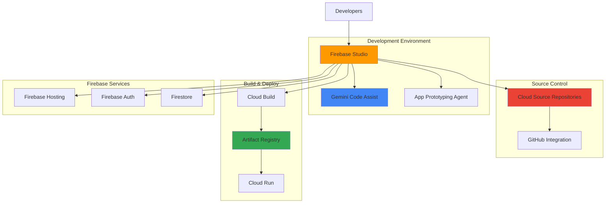

# Building Cloud-Native Development Environments with Firebase Studio and Gemini Code Assist

## Problem

Development teams struggle to establish consistent, cloud-native development environments that enable efficient collaboration while leveraging AI-powered coding assistance. Traditional local development setups create inconsistencies across team members, require complex toolchain management, and lack integrated AI capabilities for accelerated development cycles. Organizations need a unified platform that combines intelligent code generation, version control, and deployment pipelines in a single cloud-based environment.

## Solution

Firebase Studio provides a cloud-based, agentic development environment powered by Gemini Code Assist that eliminates local setup complexity while enabling AI-accelerated development workflows. This solution integrates Firebase Studio workspaces with Cloud Source Repositories for version control and Artifact Registry for container management, creating a complete cloud-native development pipeline that enables teams to build, test, and deploy full-stack AI applications entirely in the cloud.

## Architecture Diagram



## Prerequisites

1. Google Cloud account with billing enabled and appropriate permissions
2. Firebase project or ability to create new Firebase projects
3. Google Developer Program membership (recommended for extended workspace limits)
4. Basic understanding of web development concepts and Git workflows
5. Estimated cost: $0-50/month during development (Firebase Studio preview is free, Cloud Build and storage costs may apply)

> **Note**: Firebase Studio is currently in preview and available at no cost with workspace limitations. Production usage may incur charges for Cloud Build, storage, and compute resources.

## Preparation

```bash
# Set environment variables for GCP resources
export PROJECT_ID="firebase-studio-dev-$(date +%s)"
export REGION="us-central1"
export ZONE="us-central1-a"

# Generate unique suffix for resource names
RANDOM_SUFFIX=$(openssl rand -hex 3)
export REPO_NAME="ai-app-repo-${RANDOM_SUFFIX}"
export REGISTRY_NAME="ai-app-registry-${RANDOM_SUFFIX}"

# Create new GCP project
gcloud projects create ${PROJECT_ID} \
    --name="Firebase Studio Development Environment"

# Set default project and region
gcloud config set project ${PROJECT_ID}
gcloud config set compute/region ${REGION}
gcloud config set compute/zone ${ZONE}

# Enable required APIs
gcloud services enable firebase.googleapis.com
gcloud services enable sourcerepo.googleapis.com
gcloud services enable artifactregistry.googleapis.com
gcloud services enable cloudbuild.googleapis.com
gcloud services enable run.googleapis.com

echo "✅ Project configured: ${PROJECT_ID}"
echo "✅ Required APIs enabled"
```

## Steps

1. **Initialize Firebase Project and Enable Firebase Studio**:

   Firebase Studio represents a paradigm shift in cloud-native development, providing an integrated development environment that combines the power of Firebase services with AI-powered code assistance. This cloud-based IDE eliminates the complexity of local development setup while providing enterprise-grade collaboration features and seamless integration with Google Cloud services. Firebase Studio is now the evolution of Project IDX, offering enhanced AI capabilities through Gemini integration.

   ```bash
   # Install Firebase CLI if not already installed
   npm install -g firebase-tools
   
   # Login to Firebase (this will open a browser)
   firebase login
   
   # Initialize Firebase project
   firebase projects:create ${PROJECT_ID} \
       --display-name "AI Development Environment"
   
   # Set the project as default
   firebase use ${PROJECT_ID}
   
   echo "✅ Firebase project initialized: ${PROJECT_ID}"
   ```

   The Firebase project now serves as the foundation for your cloud-native development environment. Firebase Studio will automatically detect this project configuration and provide seamless integration with Firebase services, enabling rapid prototyping and deployment of AI-powered applications without complex infrastructure management.

2. **Create Cloud Source Repository for Version Control**:

   Cloud Source Repositories provides enterprise-grade Git hosting with deep integration into Google Cloud services. This managed Git solution offers automatic synchronization with external repositories, advanced security features, and seamless integration with Cloud Build for continuous integration workflows.

   ```bash
   # Create Cloud Source Repository
   gcloud source repos create ${REPO_NAME} \
       --project=${PROJECT_ID}
   
   # Get repository clone URL
   REPO_URL=$(gcloud source repos describe ${REPO_NAME} \
       --format="value(url)")
   
   # Configure Git credentials helper for Cloud Source Repositories
   git config --global credential.helper gcloud.sh
   
   echo "✅ Cloud Source Repository created: ${REPO_NAME}"
   echo "Repository URL: ${REPO_URL}"
   ```

   The Git repository is now ready for collaborative development with automatic credential management through Google Cloud IAM. This integration ensures secure access control and eliminates the need for manual credential management, while providing audit trails for all code changes through Cloud Logging.

3. **Set up Artifact Registry for Container Management**:

   Artifact Registry provides a unified platform for managing container images, language packages, and other build artifacts with enterprise security and compliance features. This managed service integrates seamlessly with Cloud Build and deployment services, providing vulnerability scanning and access control for all development artifacts.

   ```bash
   # Create Artifact Registry repository
   gcloud artifacts repositories create ${REGISTRY_NAME} \
       --repository-format=docker \
       --location=${REGION} \
       --description="Container registry for AI applications"
   
   # Configure Docker authentication
   gcloud auth configure-docker ${REGION}-docker.pkg.dev
   
   # Set environment variable for registry URL
   export REGISTRY_URL="${REGION}-docker.pkg.dev/${PROJECT_ID}/${REGISTRY_NAME}"
   
   echo "✅ Artifact Registry created: ${REGISTRY_NAME}"
   echo "Registry URL: ${REGISTRY_URL}"
   ```

   Artifact Registry is now configured to store and manage container images with built-in security scanning and access controls. This centralized artifact management enables consistent deployments across environments while providing detailed audit trails and vulnerability assessments for all container images.

4. **Access Firebase Studio and Create Development Workspace**:

   Firebase Studio transforms traditional development workflows by providing a cloud-native IDE with AI-powered assistance directly in the browser. This eliminates environment inconsistencies and provides instant access to powerful development tools without local installation requirements.

   ```bash
   # Open Firebase Studio in browser
   echo "🌐 Opening Firebase Studio..."
   echo "Navigate to: https://studio.firebase.google.com"
   echo ""
   echo "Actions to perform in Firebase Studio:"
   echo "1. Sign in with your Google account"
   echo "2. Select project: ${PROJECT_ID}"
   echo "3. Click 'Create new workspace'"
   echo "4. Choose 'Full-stack AI app' template"
   echo "5. Name your workspace: 'ai-development-environment'"
   
   # Create local directory for workspace sync (optional)
   mkdir -p ~/firebase-studio-workspace
   cd ~/firebase-studio-workspace
   
   echo "✅ Firebase Studio workspace creation initiated"
   ```

   Firebase Studio provides an integrated development environment with pre-configured tools, extensions, and AI assistance. The workspace includes automatic integration with Firebase services, Gemini Code Assist for intelligent code completion, and seamless deployment capabilities that accelerate the entire development lifecycle.

5. **Configure Gemini Code Assist Integration**:

   Gemini Code Assist represents the next generation of AI-powered development assistance, providing context-aware code generation, debugging support, and architectural guidance. This integration transforms how developers write code by understanding project context and providing intelligent suggestions that align with best practices and project requirements.

   ```bash
   # Enable Gemini Code Assist APIs
   gcloud services enable aiplatform.googleapis.com
   gcloud services enable generativelanguage.googleapis.com
   
   # Create service account for Gemini Code Assist
   gcloud iam service-accounts create gemini-code-assist \
       --display-name="Gemini Code Assist Service Account"
   
   # Grant necessary permissions for AI Platform access
   gcloud projects add-iam-policy-binding ${PROJECT_ID} \
       --member="serviceAccount:gemini-code-assist@${PROJECT_ID}.iam.gserviceaccount.com" \
       --role="roles/aiplatform.user"
   
   # Wait for IAM changes to propagate
   sleep 30
   
   echo "✅ Gemini Code Assist integration configured"
   echo "Note: Additional configuration will be done within Firebase Studio"
   ```

   Gemini Code Assist is now enabled with proper IAM permissions for AI-powered development assistance. This service provides intelligent code completion, error detection, and architectural suggestions that understand your specific project context and Firebase integration patterns.

6. **Initialize Sample AI Application with App Prototyping Agent**:

   The App Prototyping Agent leverages advanced AI capabilities to transform natural language descriptions into functional application prototypes. This revolutionary approach enables rapid ideation and validation of application concepts without extensive initial coding, accelerating the design and development process significantly.

   ```bash
   # Create application configuration file
   cat > app-config.json << EOF
   {
     "name": "intelligent-task-manager",
     "description": "AI-powered task management application with natural language processing",
     "features": [
       "Natural language task creation",
       "AI-powered priority suggestions",
       "Smart deadline recommendations",
       "Automated task categorization"
     ],
     "tech_stack": {
       "frontend": "Next.js with TypeScript",
       "backend": "Firebase Functions",
       "database": "Firestore",
       "ai": "Gemini API"
     }
   }
   EOF
   
   # Create initial project structure
   mkdir -p src/{components,pages,lib,types}
   mkdir -p functions/src
   
   echo "✅ Application configuration created"
   echo "Next: Use Firebase Studio App Prototyping Agent with this configuration"
   ```

   The application configuration provides structured input for the App Prototyping Agent, which will generate a complete application scaffold including UI components, API schemas, and AI integration patterns. This automated scaffolding process dramatically reduces initial development time while ensuring architectural best practices.

7. **Set up Cloud Build for Continuous Integration**:

   Cloud Build provides a fully managed continuous integration platform that automates building, testing, and deployment processes. This serverless build environment scales automatically and integrates seamlessly with source repositories and deployment targets, enabling efficient DevOps workflows without infrastructure management overhead.

   ```bash
   # Create Cloud Build configuration
   cat > cloudbuild.yaml << EOF
   steps:
   # Install dependencies
   - name: 'node:18'
     entrypoint: 'npm'
     args: ['install']
   
   # Run tests
   - name: 'node:18'
     entrypoint: 'npm'
     args: ['test']
   
   # Build application
   - name: 'node:18'
     entrypoint: 'npm'
     args: ['run', 'build']
   
   # Build Docker image
   - name: 'gcr.io/cloud-builders/docker'
     args: ['build', '-t', '\${_REGISTRY_URL}/ai-app:latest', '.']
   
   # Push image to Artifact Registry
   - name: 'gcr.io/cloud-builders/docker'
     args: ['push', '\${_REGISTRY_URL}/ai-app:latest']
   
   # Deploy to Cloud Run
   - name: 'gcr.io/cloud-builders/gcloud'
     args: ['run', 'deploy', 'ai-app', 
            '--image', '\${_REGISTRY_URL}/ai-app:latest',
            '--region', '\${_REGION}',
            '--platform', 'managed',
            '--allow-unauthenticated']
   
   substitutions:
     _REGISTRY_URL: '${REGISTRY_URL}'
     _REGION: '${REGION}'
   
   options:
     logging: CLOUD_LOGGING_ONLY
   EOF
   
   # Create build trigger
   gcloud builds triggers create cloud-source-repositories \
       --repo=${REPO_NAME} \
       --branch-pattern="^main$" \
       --build-config=cloudbuild.yaml \
       --description="Automated build and deployment trigger"
   
   echo "✅ Cloud Build configuration created"
   ```

   Cloud Build is now configured for automated continuous integration and deployment. This pipeline automatically triggers on code commits, runs tests, builds container images, and deploys to Cloud Run, providing a complete DevOps workflow that ensures code quality and rapid deployment cycles.

8. **Connect Git Repository to Firebase Studio Workspace**:

   Integrating Git repositories with Firebase Studio enables seamless version control workflows directly within the cloud IDE. This connection provides collaborative development capabilities, automatic synchronization, and the ability to leverage external repositories while maintaining the benefits of cloud-native development.

   ```bash
   # Clone repository into local directory for initial setup
   git clone ${REPO_URL} ./temp-repo
   cd ./temp-repo
   
   # Create initial project files
   echo "# AI Development Environment" > README.md
   echo "node_modules/" > .gitignore
   echo "*.env.local" >> .gitignore
   echo ".DS_Store" >> .gitignore
   echo "dist/" >> .gitignore
   
   # Add Cloud Build configuration
   cp ../cloudbuild.yaml .
   cp ../app-config.json .
   
   # Initial commit
   git add .
   git commit -m "Initial project setup with Cloud Build configuration"
   git push origin main
   
   cd ..
   rm -rf ./temp-repo
   
   echo "✅ Repository initialized with project configuration"
   echo "Note: Import this repository into Firebase Studio workspace"
   ```

   The Git repository now contains the foundational project structure and CI/CD configuration. Firebase Studio can import this repository, providing immediate access to version control features while maintaining the cloud-native development experience with integrated AI assistance and collaborative tools.

## Validation & Testing

1. **Verify Firebase Studio Workspace Access**:

   ```bash
   # Check Firebase project status
   firebase projects:list | grep ${PROJECT_ID}
   
   # Verify project configuration
   gcloud config get-value project
   ```

   Expected output: Firebase project should be listed and set as the current GCP project.

2. **Test Cloud Source Repository Integration**:

   ```bash
   # Verify repository creation
   gcloud source repos list --format="table(name,url)"
   
   # Test repository access
   git ls-remote ${REPO_URL}
   ```

   Expected output: Repository should be listed and accessible via Git commands.

3. **Validate Artifact Registry Configuration**:

   ```bash
   # Check registry status
   gcloud artifacts repositories describe ${REGISTRY_NAME} \
       --location=${REGION} \
       --format="table(name,format,createTime)"
   
   # Test Docker authentication
   docker-credential-gcloud list
   ```

   Expected output: Registry should be created and Docker authentication should be configured.

4. **Test Gemini Code Assist API Access**:

   ```bash
   # Verify API enablement
   gcloud services list --enabled \
       --filter="name:aiplatform.googleapis.com OR name:generativelanguage.googleapis.com" \
       --format="table(name,title)"
   
   # Check service account permissions
   gcloud projects get-iam-policy ${PROJECT_ID} \
       --flatten="bindings[].members" \
       --filter="bindings.members:*gemini-code-assist*"
   ```

   Expected output: APIs should be enabled and service account should have appropriate permissions.

## Cleanup

1. **Remove Cloud Build triggers and configurations**:

   ```bash
   # Delete build triggers
   gcloud builds triggers list --format="value(id)" | \
   while read trigger_id; do
       gcloud builds triggers delete ${trigger_id} --quiet
   done
   
   echo "✅ Build triggers deleted"
   ```

2. **Delete Artifact Registry and repositories**:

   ```bash
   # Delete Artifact Registry repository
   gcloud artifacts repositories delete ${REGISTRY_NAME} \
       --location=${REGION} \
       --quiet
   
   # Delete Cloud Source Repository
   gcloud source repos delete ${REPO_NAME} --quiet
   
   echo "✅ Repositories and registries deleted"
   ```

3. **Clean up Firebase resources**:

   ```bash
   # Note: Firebase Studio workspaces are managed through the web interface
   echo "Manual cleanup required:"
   echo "1. Visit https://studio.firebase.google.com"
   echo "2. Delete workspaces associated with project: ${PROJECT_ID}"
   echo "3. Visit https://console.firebase.google.com"
   echo "4. Delete Firebase project: ${PROJECT_ID}"
   ```

4. **Remove GCP project**:

   ```bash
   # Delete the entire project (optional - removes all resources)
   gcloud projects delete ${PROJECT_ID} --quiet
   
   echo "✅ Project deletion initiated"
   echo "Note: Project deletion may take several minutes to complete"
   ```

## Discussion

Firebase Studio represents a fundamental shift in how development teams approach cloud-native application development, particularly for AI-powered applications. By providing a browser-based development environment with integrated AI assistance through Gemini Code Assist, it eliminates the complexity and inconsistency of local development setups while enabling unprecedented collaboration capabilities. The platform's integration with Google Cloud services creates a seamless workflow from ideation through deployment, significantly reducing the time required to build and iterate on AI applications. Following the evolution from Project IDX, Firebase Studio now offers enhanced AI capabilities and deeper integration with Firebase services.

The integration of Cloud Source Repositories and Artifact Registry creates a comprehensive DevOps pipeline that maintains enterprise-grade security and compliance requirements. Cloud Source Repositories provides secure, scalable version control with deep integration into Google Cloud's identity and access management systems, while Artifact Registry ensures consistent artifact management with built-in vulnerability scanning and access controls. This combination enables teams to maintain development velocity while adhering to security best practices and regulatory requirements outlined in the [Google Cloud Architecture Framework](https://cloud.google.com/architecture/framework).

The App Prototyping Agent within Firebase Studio demonstrates the transformative potential of AI-assisted development. By enabling natural language application design and automatic code generation, it democratizes application development and allows teams to rapidly validate concepts before investing significant development resources. This capability is particularly valuable for organizations exploring AI integration opportunities, as it reduces the technical barriers to experimentation and proof-of-concept development.

For more detailed information about Firebase Studio capabilities, see the [Firebase Studio documentation](https://firebase.google.com/docs/studio). The [Gemini Code Assist overview](https://cloud.google.com/docs/duet-ai/code-assist) provides comprehensive guidance on leveraging AI assistance in development workflows. Additional best practices for cloud-native development can be found in the [Google Cloud Architecture Framework](https://cloud.google.com/architecture/framework). For CI/CD implementation patterns, reference the [Cloud Build documentation](https://cloud.google.com/build/docs), and for container management strategies, see the [Artifact Registry best practices guide](https://cloud.google.com/artifact-registry/docs/best-practices).

> **Tip**: Take advantage of Firebase Studio's pre-built templates and Gemini Code Assist agents to accelerate development workflows. The Migration agent can help modernize existing codebases, while the AI Testing agent provides automated testing capabilities for AI-powered features, significantly improving development efficiency and code quality.

## Challenge

Extend this cloud-native development environment by implementing these enhancements:

1. **Multi-environment Deployment Pipeline**: Configure separate staging and production environments with automated promotion workflows using Cloud Deploy and environment-specific configurations.

2. **Advanced AI Testing Integration**: Implement comprehensive AI testing workflows using the AI Testing agent to validate model outputs, test for bias, and ensure responsible AI practices across your applications.

3. **Team Collaboration Workflows**: Set up advanced collaboration features including code review automation, shared workspace templates, and team-specific development standards using Firebase Studio's collaboration tools.

4. **Security and Compliance Automation**: Integrate Security Command Center and Cloud Security Scanner to automatically assess code and infrastructure for security vulnerabilities and compliance violations.

5. **Performance Monitoring and Optimization**: Implement comprehensive application performance monitoring using Cloud Monitoring, Cloud Trace, and Firebase Performance Monitoring to optimize AI application performance and user experience.

## Infrastructure Code

### Available Infrastructure as Code:

- [Infrastructure Code Overview](code/README.md) - Detailed description of all infrastructure components
- [Infrastructure Manager](code/infrastructure-manager/) - GCP Infrastructure Manager templates
- [Bash CLI Scripts](code/scripts/) - Example bash scripts using gcloud CLI commands to deploy infrastructure
- [Terraform](code/terraform/) - Terraform configuration files