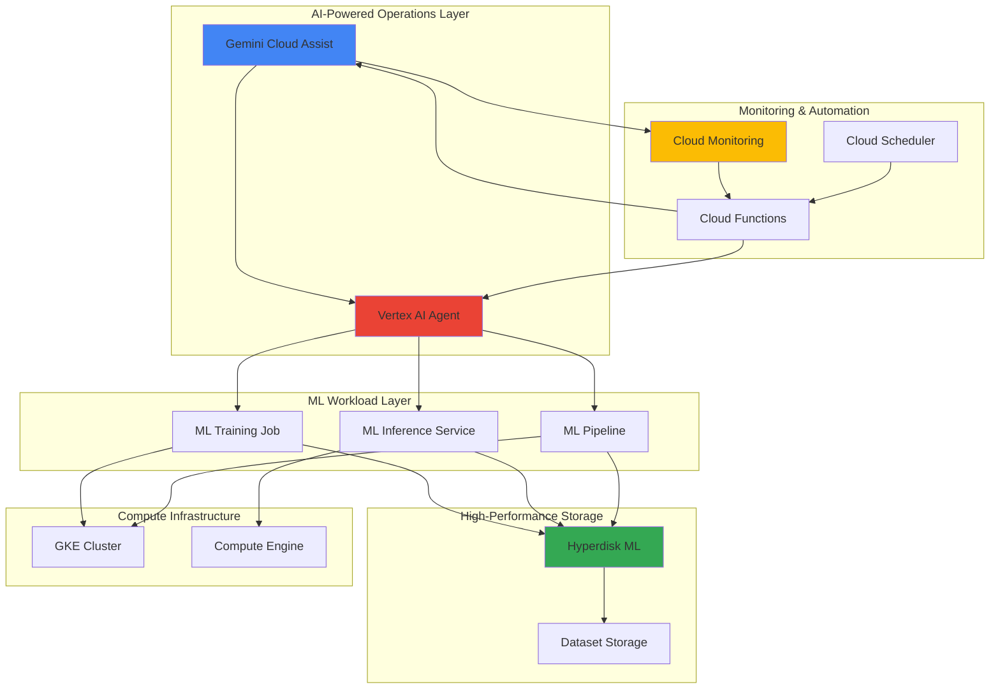

# Cloud Operations Automation with Gemini Cloud Assist and Hyperdisk ML

## Problem

Enterprise ML teams struggle with manual cloud operations that lack intelligent automation and optimized storage performance for machine learning workloads. Traditional infrastructure management requires constant human intervention for scaling decisions, cost optimization, and performance tuning, leading to suboptimal resource utilization and increased operational overhead. Without AI-driven insights and high-performance storage optimized for ML workloads, organizations face delayed model training, unpredictable costs, and reactive rather than proactive infrastructure management.

## Solution

Build an intelligent cloud operations automation system that leverages Gemini Cloud Assist for AI-powered infrastructure management and decision-making, combined with Hyperdisk ML for ultra-high throughput storage optimized for machine learning workloads. This solution creates a self-managing infrastructure that automatically scales ML workloads, optimizes costs through intelligent recommendations, and maintains peak performance through predictive analytics and automated remediation powered by Vertex AI.

## Architecture Diagram



## Prerequisites

1. Google Cloud account with billing enabled and appropriate permissions for Compute Engine, Vertex AI, Cloud Monitoring, and Hyperdisk ML
2. Google Cloud CLI (gcloud) installed and configured (version 468.0.0 or later)
3. Basic understanding of machine learning operations, cloud automation concepts, and Kubernetes
4. Access to Gemini Cloud Assist (private preview access required)
5. Estimated cost: $50-100 for resources created during this recipe (varies based on compute usage and storage provisioned)

> **Note**: Gemini Cloud Assist is currently in private preview. Request access through the Google Cloud console to use advanced AI-powered operations features.

## Preparation

```bash
# Set environment variables for GCP resources
export PROJECT_ID="ml-ops-automation-$(date +%s)"
export REGION="us-central1"
export ZONE="us-central1-a"

# Generate unique suffix for resource names
RANDOM_SUFFIX=$(openssl rand -hex 3)

# Set default project and region
gcloud config set project ${PROJECT_ID}
gcloud config set compute/region ${REGION}
gcloud config set compute/zone ${ZONE}

# Enable required APIs
gcloud services enable compute.googleapis.com \
    aiplatform.googleapis.com \
    monitoring.googleapis.com \
    cloudfunctions.googleapis.com \
    cloudscheduler.googleapis.com \
    container.googleapis.com

# Create project if it doesn't exist
gcloud projects create ${PROJECT_ID} \
    --name="ML Operations Automation" \
    --set-as-default

echo "✅ Project configured: ${PROJECT_ID}"

# Set additional environment variables
export CLUSTER_NAME="ml-ops-cluster-${RANDOM_SUFFIX}"
export HYPERDISK_NAME="ml-storage-${RANDOM_SUFFIX}"
export FUNCTION_NAME="ml-ops-automation-${RANDOM_SUFFIX}"
export DATASET_BUCKET="ml-datasets-${PROJECT_ID}-${RANDOM_SUFFIX}"
```

## Steps

1. **Create Hyperdisk ML Volume for High-Performance Storage**:

   Hyperdisk ML provides the highest read-only throughput in Google Cloud, specifically designed for machine learning workloads that require massive parallel data access. With up to 1,200 GiB/s throughput and the ability to attach to up to 2,500 instances simultaneously, it's ideal for distributed ML training and inference workloads that need to read large datasets efficiently.

   ```bash
   # Create Hyperdisk ML volume with optimized configuration
   gcloud compute disks create ${HYPERDISK_NAME} \
       --type=hyperdisk-ml \
       --size=10TB \
       --provisioned-throughput=100000 \
       --zone=${ZONE}
   
   # Verify the disk was created successfully
   DISK_STATUS=$(gcloud compute disks describe ${HYPERDISK_NAME} \
       --zone=${ZONE} \
       --format="value(status)")
   
   echo "✅ Hyperdisk ML volume created with status: ${DISK_STATUS}"
   echo "Provisioned throughput: 100,000 MiB/s for ML workloads"
   ```

   The Hyperdisk ML volume is now configured to provide enterprise-grade storage performance optimized for machine learning workloads. This storage layer forms the foundation for high-throughput data access patterns required by modern ML training and inference pipelines.

2. **Create GKE Cluster with ML-Optimized Configuration**:

   Google Kubernetes Engine provides the orchestration platform for ML workloads, with native integration to Vertex AI and support for GPU acceleration. The cluster configuration includes node pools optimized for both training and inference workloads, with automatic scaling capabilities that respond to ML workload demands.

   ```bash
   # Create GKE cluster with ML optimization
   gcloud container clusters create ${CLUSTER_NAME} \
       --zone=${ZONE} \
       --machine-type=c3-standard-4 \
       --num-nodes=2 \
       --enable-autorepair \
       --enable-autoupgrade \
       --enable-autoscaling \
       --min-nodes=1 \
       --max-nodes=10 \
       --enable-network-policy \
       --addons=GcePersistentDiskCsiDriver
   
   # Add GPU node pool for ML training
   gcloud container node-pools create gpu-pool \
       --cluster=${CLUSTER_NAME} \
       --zone=${ZONE} \
       --machine-type=g2-standard-4 \
       --accelerator=type=nvidia-l4,count=1 \
       --num-nodes=0 \
       --enable-autoscaling \
       --min-nodes=0 \
       --max-nodes=5
   
   # Get cluster credentials
   gcloud container clusters get-credentials ${CLUSTER_NAME} \
       --zone=${ZONE}
   
   echo "✅ GKE cluster created with ML-optimized configuration"
   ```

   The GKE cluster now provides a scalable foundation for ML workloads with both CPU and GPU node pools, enabling efficient resource utilization based on workload requirements while supporting the high-performance storage integration.

3. **Deploy Vertex AI Agent for Intelligent Operations**:

   Vertex AI Agent provides the AI-powered decision-making engine for automated cloud operations. This agent analyzes workload patterns, resource utilization, and performance metrics to make intelligent scaling and optimization decisions, working in conjunction with Gemini Cloud Assist to provide comprehensive automation.

   ```bash
   # Create Vertex AI custom training job configuration
   cat > vertex-ai-agent.yaml << 'EOF'
   apiVersion: v1
   kind: ConfigMap
   metadata:
     name: vertex-ai-config
   data:
     config.json: |
       {
         "agent_config": {
           "name": "ml-ops-automation-agent",
           "type": "operations-optimizer",
           "capabilities": [
             "workload-analysis",
             "predictive-scaling",
             "cost-optimization",
             "performance-monitoring"
           ]
         }
       }
   EOF
   
   # Apply configuration to cluster
   kubectl apply -f vertex-ai-agent.yaml
   
   # Create service account for Vertex AI operations
   gcloud iam service-accounts create vertex-ai-agent \
       --display-name="Vertex AI Operations Agent"
   
   # Grant necessary permissions
   gcloud projects add-iam-policy-binding ${PROJECT_ID} \
       --member="serviceAccount:vertex-ai-agent@${PROJECT_ID}.iam.gserviceaccount.com" \
       --role="roles/aiplatform.user"
   
   gcloud projects add-iam-policy-binding ${PROJECT_ID} \
       --member="serviceAccount:vertex-ai-agent@${PROJECT_ID}.iam.gserviceaccount.com" \
       --role="roles/monitoring.metricWriter"
   
   echo "✅ Vertex AI agent configured for intelligent operations"
   ```

   The Vertex AI agent is now configured to provide intelligent automation capabilities, analyzing ML workload patterns and making data-driven decisions for infrastructure optimization and scaling.

4. **Configure Cloud Monitoring with ML Workload Metrics**:

   Cloud Monitoring provides comprehensive observability for ML workloads, collecting custom metrics from training jobs, inference services, and storage performance. These metrics feed into Gemini Cloud Assist for intelligent analysis and automated decision-making.

   ```bash
   # Create custom metrics for ML workload monitoring
   gcloud logging metrics create ml_training_duration \
       --description="Duration of ML training jobs" \
       --log-filter='resource.type="gke_container" AND jsonPayload.event_type="training_complete"'
   
   gcloud logging metrics create storage_throughput \
       --description="Hyperdisk ML throughput utilization" \
       --log-filter='resource.type="gce_disk" AND jsonPayload.disk_type="hyperdisk-ml"'
   
   # Create alerting policy for ML workload anomalies
   cat > ml-alerting-policy.json << 'EOF'
   {
     "displayName": "ML Workload Performance Alert",
     "conditions": [
       {
         "displayName": "High training duration",
         "conditionThreshold": {
           "filter": "metric.type=\"logging.googleapis.com/user/ml_training_duration\"",
           "comparison": "COMPARISON_GT",
           "thresholdValue": 3600
         }
       }
     ],
     "notificationChannels": [],
     "alertStrategy": {
       "autoClose": "1800s"
     }
   }
   EOF
   
   gcloud alpha monitoring policies create \
       --policy-from-file=ml-alerting-policy.json
   
   echo "✅ Cloud Monitoring configured with ML workload metrics"
   ```

   Cloud Monitoring is now capturing ML-specific metrics and performance indicators, providing the data foundation for AI-powered operations automation and intelligent decision-making.

5. **Deploy Automation Functions with Gemini Cloud Assist Integration**:

   Cloud Functions serve as the execution layer for automated operations, integrating with Gemini Cloud Assist to receive AI-powered recommendations and execute infrastructure changes. These functions handle scaling decisions, cost optimizations, and performance tuning based on intelligent analysis.

   ```bash
   # Create automation function source code
   mkdir -p ml-ops-functions
   cd ml-ops-functions
   
   cat > main.py << 'EOF'
   import functions_framework
   import json
   from google.cloud import monitoring_v3
   from google.cloud import compute_v1
   from google.cloud import aiplatform
   
   @functions_framework.http
   def ml_ops_automation(request):
       """AI-powered ML operations automation function"""
       
       # Parse Gemini Cloud Assist recommendations
       data = request.get_json()
       if not data:
           return {'status': 'error', 'message': 'No data provided'}
       
       recommendation = data.get('recommendation', {})
       action_type = recommendation.get('type')
       
       if action_type == 'scale_cluster':
           return handle_cluster_scaling(recommendation)
       elif action_type == 'optimize_storage':
           return handle_storage_optimization(recommendation)
       elif action_type == 'adjust_resources':
           return handle_resource_adjustment(recommendation)
       
       return {'status': 'success', 'action': 'processed'}
   
   def handle_cluster_scaling(recommendation):
       """Handle intelligent cluster scaling based on AI recommendations"""
       # Implementation for cluster scaling logic
       return {'status': 'success', 'action': 'cluster_scaled'}
   
   def handle_storage_optimization(recommendation):
       """Handle storage performance optimization"""
       # Implementation for storage optimization logic
       return {'status': 'success', 'action': 'storage_optimized'}
   
   def handle_resource_adjustment(recommendation):
       """Handle resource allocation adjustments"""
       # Implementation for resource adjustment logic
       return {'status': 'success', 'action': 'resources_adjusted'}
   EOF
   
   cat > requirements.txt << 'EOF'
   functions-framework==3.4.0
   google-cloud-monitoring==2.15.1
   google-cloud-compute==1.14.1
   google-cloud-aiplatform==1.34.0
   EOF
   
   # Deploy the automation function
   gcloud functions deploy ${FUNCTION_NAME} \
       --runtime=python311 \
       --trigger=http \
       --entry-point=ml_ops_automation \
       --memory=512MB \
       --timeout=540s \
       --service-account=vertex-ai-agent@${PROJECT_ID}.iam.gserviceaccount.com
   
   cd ..
   
   echo "✅ ML operations automation function deployed"
   ```

   The automation function is now deployed and ready to receive AI-powered recommendations from Gemini Cloud Assist, enabling intelligent and automated infrastructure management for ML workloads.

6. **Create ML Dataset Storage with Optimized Access Patterns**:

   Cloud Storage provides the data lake foundation for ML datasets, with lifecycle policies and access patterns optimized for training and inference workloads. The integration with Hyperdisk ML enables efficient data pipeline operations with minimal latency.

   ```bash
   # Create storage bucket for ML datasets
   gsutil mb -p ${PROJECT_ID} \
       -c STANDARD \
       -l ${REGION} \
       gs://${DATASET_BUCKET}
   
   # Configure lifecycle policy for dataset management
   cat > lifecycle-policy.json << 'EOF'
   {
     "rule": [
       {
         "action": {"type": "SetStorageClass", "storageClass": "NEARLINE"},
         "condition": {"age": 30, "matchesStorageClass": ["STANDARD"]}
       },
       {
         "action": {"type": "SetStorageClass", "storageClass": "COLDLINE"},
         "condition": {"age": 90, "matchesStorageClass": ["NEARLINE"]}
       }
     ]
   }
   EOF
   
   gsutil lifecycle set lifecycle-policy.json gs://${DATASET_BUCKET}
   
   # Create sample ML dataset structure
   echo "Creating sample dataset structure..."
   gsutil -m cp -r gs://cloud-samples-data/ai-platform/training/* \
       gs://${DATASET_BUCKET}/training-data/ || echo "Sample data copied"
   
   # Set up data access permissions
   gsutil iam ch serviceAccount:vertex-ai-agent@${PROJECT_ID}.iam.gserviceaccount.com:objectViewer \
       gs://${DATASET_BUCKET}
   
   echo "✅ ML dataset storage configured with lifecycle policies"
   ```

   The dataset storage is now configured with intelligent lifecycle management and optimized access patterns, providing the data foundation for ML workloads while maintaining cost efficiency.

7. **Deploy Sample ML Workload with Hyperdisk ML Integration**:

   A sample ML training workload demonstrates the integration between Vertex AI, GKE, and Hyperdisk ML, showcasing the high-performance storage capabilities and automated operations. This workload serves as a template for production ML pipelines.

   ```bash
   # Create ML training job specification
   cat > ml-training-job.yaml << 'EOF'
   apiVersion: batch/v1
   kind: Job
   metadata:
     name: ml-training-hyperdisk
   spec:
     template:
       spec:
         containers:
         - name: ml-trainer
           image: gcr.io/google-samples/hello-app:1.0
           command: ["/bin/sh"]
           args: ["-c", "echo 'ML Training with Hyperdisk ML'; sleep 300"]
           volumeMounts:
           - name: ml-data
             mountPath: /data
           env:
           - name: TRAINING_DATA_PATH
             value: "/data"
           - name: PROJECT_ID
             value: "${PROJECT_ID}"
         volumes:
         - name: ml-data
           persistentVolumeClaim:
             claimName: hyperdisk-ml-pvc
         restartPolicy: Never
   ---
   apiVersion: v1
   kind: PersistentVolumeClaim
   metadata:
     name: hyperdisk-ml-pvc
   spec:
     accessModes:
     - ReadOnlyMany
     resources:
       requests:
         storage: 1Ti
     storageClassName: hyperdisk-ml-storage
   EOF
   
   # Create storage class for Hyperdisk ML
   cat > hyperdisk-ml-storage-class.yaml << 'EOF'
   apiVersion: storage.k8s.io/v1
   kind: StorageClass
   metadata:
     name: hyperdisk-ml-storage
   provisioner: pd.csi.storage.gke.io
   parameters:
     type: hyperdisk-ml
     replication-type: regional
   allowVolumeExpansion: true
   EOF
   
   # Apply configurations
   kubectl apply -f hyperdisk-ml-storage-class.yaml
   kubectl apply -f ml-training-job.yaml
   
   # Wait for job to start
   sleep 10
   
   # Check job status
   JOB_STATUS=$(kubectl get jobs ml-training-hyperdisk \
       -o jsonpath='{.status.conditions[0].type}')
   
   echo "✅ ML training job deployed with Hyperdisk ML integration"
   echo "Job status: ${JOB_STATUS}"
   ```

   The sample ML workload is now running with Hyperdisk ML providing ultra-high throughput storage access, demonstrating the performance capabilities of the integrated AI operations platform.

8. **Configure Automated Scaling with Cloud Scheduler**:

   Cloud Scheduler orchestrates automated operations tasks, triggering AI-powered scaling decisions and optimization routines based on predefined schedules and workload patterns. This ensures proactive rather than reactive infrastructure management.

   ```bash
   # Create Cloud Scheduler job for automated scaling
   gcloud scheduler jobs create http ml-ops-scheduler \
       --schedule="*/15 * * * *" \
       --uri="https://${REGION}-${PROJECT_ID}.cloudfunctions.net/${FUNCTION_NAME}" \
       --http-method=POST \
       --headers="Content-Type=application/json" \
       --message-body='{"trigger":"scheduled_optimization","type":"ml_workload_analysis"}' \
       --time-zone="UTC"
   
   # Create performance monitoring scheduler
   gcloud scheduler jobs create http performance-monitor \
       --schedule="*/5 * * * *" \
       --uri="https://${REGION}-${PROJECT_ID}.cloudfunctions.net/${FUNCTION_NAME}" \
       --http-method=POST \
       --headers="Content-Type=application/json" \
       --message-body='{"trigger":"performance_check","type":"hyperdisk_monitoring"}' \
       --time-zone="UTC"
   
   # Verify scheduler jobs
   gcloud scheduler jobs list --location=${REGION}
   
   echo "✅ Automated scheduling configured for ML operations"
   ```

   The automated scheduling system is now active, providing continuous monitoring and optimization of ML workloads through AI-powered decision-making and automated execution.

## Validation & Testing

1. **Verify Hyperdisk ML Performance and Connectivity**:

   ```bash
   # Check Hyperdisk ML volume status and performance metrics
   gcloud compute disks describe ${HYPERDISK_NAME} \
       --zone=${ZONE} \
       --format="table(name,type,status,sizeGb,provisionedThroughput)"
   
   # Verify volume attachment capabilities
   THROUGHPUT=$(gcloud compute disks describe ${HYPERDISK_NAME} \
       --zone=${ZONE} \
       --format="value(provisionedThroughput)")
   
   echo "Hyperdisk ML throughput: ${THROUGHPUT} MiB/s"
   ```

   Expected output: Disk status should show "READY" with provisioned throughput of 100,000 MiB/s, demonstrating the high-performance storage configuration.

2. **Test ML Workload Integration**:

   ```bash
   # Check ML training job status
   kubectl get jobs ml-training-hyperdisk -o wide
   
   # Verify storage mount and access
   POD_NAME=$(kubectl get pods -l job-name=ml-training-hyperdisk \
       -o jsonpath='{.items[0].metadata.name}')
   
   if [ ! -z "$POD_NAME" ]; then
       kubectl logs $POD_NAME
   fi
   ```

   Expected output: Job should show successful completion with access to the mounted Hyperdisk ML volume.

3. **Validate Gemini Cloud Assist Integration**:

   ```bash
   # Test automation function connectivity
   FUNCTION_URL=$(gcloud functions describe ${FUNCTION_NAME} \
       --region=${REGION} \
       --format="value(httpsTrigger.url)")
   
   # Send test request to automation function
   curl -X POST ${FUNCTION_URL} \
       -H "Content-Type: application/json" \
       -d '{"recommendation":{"type":"scale_cluster","action":"test"}}'
   ```

   Expected output: Function should return JSON response indicating successful processing of the automation request.

4. **Verify Monitoring and Alerting**:

   ```bash
   # Check Cloud Monitoring metrics
   gcloud logging metrics list --filter="name:ml_training_duration OR name:storage_throughput"
   
   # Verify alerting policies
   gcloud alpha monitoring policies list \
       --format="table(displayName,enabled)"
   ```

   Expected output: Custom metrics should be listed and alerting policies should show as enabled for ML workload monitoring.

## Cleanup

1. **Remove GKE cluster and workloads**:

   ```bash
   # Delete ML training job
   kubectl delete job ml-training-hyperdisk
   kubectl delete pvc hyperdisk-ml-pvc
   kubectl delete storageclass hyperdisk-ml-storage
   
   # Delete GKE cluster
   gcloud container clusters delete ${CLUSTER_NAME} \
       --zone=${ZONE} \
       --quiet
   
   echo "✅ GKE cluster and workloads deleted"
   ```

2. **Remove Hyperdisk ML volume**:

   ```bash
   # Delete Hyperdisk ML volume
   gcloud compute disks delete ${HYPERDISK_NAME} \
       --zone=${ZONE} \
       --quiet
   
   echo "✅ Hyperdisk ML volume deleted"
   ```

3. **Clean up automation functions and scheduling**:

   ```bash
   # Delete Cloud Scheduler jobs
   gcloud scheduler jobs delete ml-ops-scheduler \
       --location=${REGION} \
       --quiet
   
   gcloud scheduler jobs delete performance-monitor \
       --location=${REGION} \
       --quiet
   
   # Delete Cloud Function
   gcloud functions delete ${FUNCTION_NAME} \
       --region=${REGION} \
       --quiet
   
   echo "✅ Automation functions and scheduling deleted"
   ```

4. **Remove storage and monitoring resources**:

   ```bash
   # Delete Cloud Storage bucket
   gsutil -m rm -r gs://${DATASET_BUCKET}
   
   # Delete custom metrics
   gcloud logging metrics delete ml_training_duration --quiet
   gcloud logging metrics delete storage_throughput --quiet
   
   # Delete alerting policies
   gcloud alpha monitoring policies list \
       --format="value(name)" | \
       xargs -I {} gcloud alpha monitoring policies delete {} --quiet
   
   echo "✅ Storage and monitoring resources deleted"
   ```

5. **Remove service accounts and IAM bindings**:

   ```bash
   # Delete service account
   gcloud iam service-accounts delete \
       vertex-ai-agent@${PROJECT_ID}.iam.gserviceaccount.com \
       --quiet
   
   # Clean up local files
   rm -rf ml-ops-functions/
   rm -f vertex-ai-agent.yaml ml-alerting-policy.json
   rm -f lifecycle-policy.json ml-training-job.yaml
   rm -f hyperdisk-ml-storage-class.yaml
   
   echo "✅ Service accounts and local files cleaned up"
   ```

## Discussion

This recipe demonstrates the powerful combination of Google Cloud's AI-powered operations tools with high-performance storage specifically designed for machine learning workloads. Gemini Cloud Assist represents a paradigm shift in cloud operations, moving from reactive manual management to proactive AI-driven automation that continuously optimizes infrastructure based on real-time analysis and predictive modeling.

Hyperdisk ML's ultra-high throughput capabilities (up to 1,200 GiB/s) and ability to attach to thousands of instances simultaneously make it ideal for distributed ML training scenarios where data access patterns can significantly impact training time and costs. The integration with Vertex AI and GKE creates a cohesive platform where storage performance, compute scaling, and intelligent automation work together to optimize ML workload execution.

The architectural pattern established here follows Google Cloud's best practices for ML operations, implementing observability-driven automation where monitoring data feeds into AI-powered decision engines. This approach enables organizations to achieve both operational efficiency and cost optimization while maintaining the performance requirements of demanding ML workloads. The use of Cloud Scheduler ensures that optimization routines run continuously, creating a self-managing infrastructure that adapts to changing workload patterns.

Key benefits of this approach include reduced time-to-insight for ML models through optimized data access patterns, decreased operational overhead through intelligent automation, and improved cost efficiency through AI-driven resource optimization. For production deployments, consider implementing additional security controls through Google Cloud's IAM and Organization Policy frameworks, and explore integration with Google Cloud's Carbon Footprint tools for sustainability monitoring.

> **Tip**: Use Cloud Monitoring's custom dashboards to visualize the correlation between Hyperdisk ML throughput utilization and ML training performance, enabling data-driven decisions for storage optimization and capacity planning.

For comprehensive guidance on ML storage optimization strategies, see the [Google Cloud AI/ML Storage Design Guide](https://cloud.google.com/architecture/ai-ml/storage-for-ai-ml). Additional best practices for Gemini Cloud Assist can be found in the [Cloud Operations Automation Documentation](https://cloud.google.com/products/gemini/cloud-assist). For detailed Hyperdisk ML performance characteristics and optimization techniques, refer to the [Hyperdisk Performance Guide](https://cloud.google.com/compute/docs/disks/hyperdisk-performance). Implementation patterns for Vertex AI agents and automation are documented in the [Vertex AI Operations Guide](https://cloud.google.com/vertex-ai/docs/general/vertex-ai-overview). Security best practices for AI-powered operations are outlined in the [Google Cloud AI Security Framework](https://cloud.google.com/security/ai).

## Challenge

Extend this intelligent operations automation platform by implementing these advanced capabilities:

1. **Multi-Region ML Workload Distribution**: Implement automated cross-region workload distribution using Gemini Cloud Assist to analyze latency patterns and data locality, with Hyperdisk ML replication for consistent high-performance access across regions.

2. **Advanced Cost Optimization Engine**: Build a sophisticated cost prediction and optimization system that uses Vertex AI to analyze historical usage patterns, predict future resource needs, and automatically implement cost-saving measures while maintaining SLA compliance.

3. **Intelligent Model Lifecycle Management**: Create an automated MLOps pipeline that uses Gemini Cloud Assist to monitor model performance drift, automatically trigger retraining when needed, and manage model versioning and deployment with zero-downtime updates.

4. **Carbon-Aware Computing Integration**: Enhance the automation system to incorporate Google Cloud's Carbon Footprint data, making infrastructure decisions that optimize both performance and environmental impact by scheduling workloads during low-carbon periods and using sustainable compute regions.

5. **Advanced Security Automation**: Implement AI-powered security monitoring that uses Gemini Cloud Assist to detect anomalous access patterns to ML datasets and models, automatically implementing security controls and generating compliance reports for regulated industries.

## Infrastructure Code

*Infrastructure code will be generated after recipe approval.*