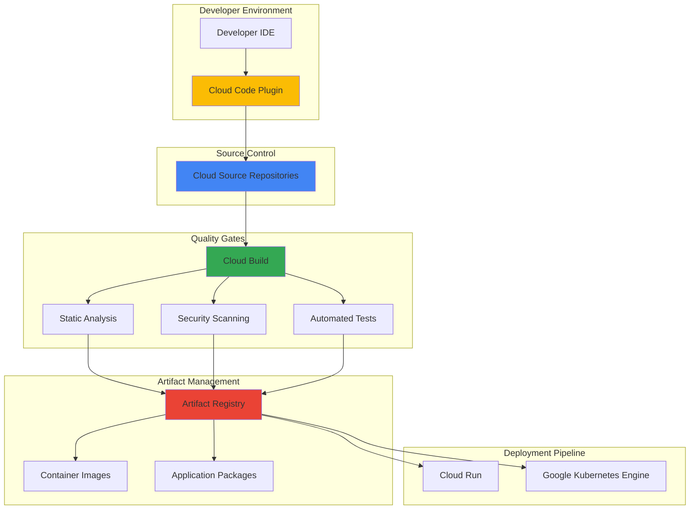

# Code Quality Automation with Cloud Source Repositories and Artifact Registry

## Problem

Development teams struggle with maintaining consistent code quality across distributed teams while ensuring secure artifact management and efficient deployment pipelines. Manual code reviews and inconsistent quality gates create bottlenecks, security vulnerabilities slip through to production, and artifact management becomes fragmented across multiple tools, leading to increased technical debt and slower release cycles.

## Solution

Implement an automated code quality system using Cloud Source Repositories for secure version control, Cloud Build for comprehensive quality gates, and Artifact Registry for centralized artifact management. This solution creates an end-to-end pipeline that automatically scans code for quality issues, security vulnerabilities, and compliance violations while securely packaging and versioning artifacts for reliable deployment workflows.

## Architecture Diagram



## Prerequisites

1. Google Cloud account with billing enabled and Owner or Editor permissions
2. Google Cloud CLI (gcloud) installed and configured (version 531.0.0 or later)
3. Basic knowledge of Git version control and CI/CD concepts
4. Understanding of containerization and application packaging
5. Estimated cost: $15-25 for running all services during the 120-minute tutorial

> **Note**: This recipe follows Google Cloud best practices and integrates with Google's development tools for enhanced productivity.

## Preparation

```bash
# Set environment variables for GCP resources
export PROJECT_ID="code-quality-demo-$(date +%s)"
export REGION="us-central1"
export ZONE="us-central1-a"

# Generate unique suffix for resource names
RANDOM_SUFFIX=$(openssl rand -hex 3)
export REPO_NAME="quality-demo-${RANDOM_SUFFIX}"
export REGISTRY_NAME="quality-artifacts-${RANDOM_SUFFIX}"
export BUILD_TRIGGER_NAME="quality-pipeline-${RANDOM_SUFFIX}"

# Create and configure project
gcloud projects create ${PROJECT_ID} --name="Code Quality Demo"
gcloud config set project ${PROJECT_ID}
gcloud config set compute/region ${REGION}
gcloud config set compute/zone ${ZONE}

# Enable required APIs for the quality pipeline
gcloud services enable sourcerepo.googleapis.com
gcloud services enable artifactregistry.googleapis.com
gcloud services enable cloudbuild.googleapis.com
gcloud services enable containeranalysis.googleapis.com
gcloud services enable containerscanning.googleapis.com

echo "✅ Project configured: ${PROJECT_ID}"
echo "✅ Region set to: ${REGION}"
echo "✅ APIs enabled for code quality automation"
```

## Steps

1. **Create Cloud Source Repository for Version Control**:

   Cloud Source Repositories provides secure, scalable Git hosting that integrates seamlessly with Google Cloud's developer tools. Creating a repository establishes the foundation for automated code quality validation with built-in integration to Cloud Build triggers and automated scanning capabilities.

   ```bash
   # Create the source repository
   gcloud source repos create ${REPO_NAME} \
       --project=${PROJECT_ID}
   
   # Clone repository locally for development
   gcloud source repos clone ${REPO_NAME} \
       --project=${PROJECT_ID}
   
   cd ${REPO_NAME}
   
   echo "✅ Cloud Source Repository created and cloned: ${REPO_NAME}"
   ```

   The repository is now ready for automated code quality validation with Google Cloud's integrated development workflow, providing secure version control that automatically triggers quality gates upon code commits.

2. **Configure Artifact Registry for Secure Package Management**:

   Artifact Registry serves as the centralized repository for build artifacts, container images, and language packages with built-in vulnerability scanning and access controls. This configuration establishes secure artifact management with automated quality validation and compliance tracking.

   ```bash
   # Create Docker repository for container images
   gcloud artifacts repositories create ${REGISTRY_NAME} \
       --repository-format=docker \
       --location=${REGION} \
       --description="Secure registry for quality-validated artifacts"
   
   # Configure Docker authentication
   gcloud auth configure-docker ${REGION}-docker.pkg.dev
   
   # Create additional repository for language packages
   gcloud artifacts repositories create ${REGISTRY_NAME}-packages \
       --repository-format=python \
       --location=${REGION} \
       --description="Python packages with quality validation"
   
   echo "✅ Artifact Registry repositories created with security scanning enabled"
   ```

   The artifact repositories now provide secure storage with automated vulnerability scanning, ensuring only quality-validated artifacts proceed through the deployment pipeline.

3. **Create Sample Application with Quality Standards**:

   This step creates a sample Python application with comprehensive quality configurations including linting rules, security scanning configurations, and automated testing frameworks that demonstrate automated code quality validation capabilities.

   ```bash
   # Create application structure
   mkdir -p src tests docs
   
   # Create main application file
   cat > src/app.py << 'EOF'
   """
   High-quality sample application demonstrating code standards.
   """
   import logging
   import json
   from typing import Dict, Any
   from flask import Flask, jsonify, request
   
   # Configure structured logging
   logging.basicConfig(level=logging.INFO)
   logger = logging.getLogger(__name__)
   
   app = Flask(__name__)
   
   @app.route('/health', methods=['GET'])
   def health_check() -> Dict[str, Any]:
       """Health check endpoint with proper error handling."""
       try:
           return jsonify({
               'status': 'healthy',
               'service': 'quality-demo-app',
               'version': '1.0.0'
           })
       except Exception as error:
           logger.error(f"Health check failed: {error}")
           return jsonify({'status': 'unhealthy'}), 500
   
   @app.route('/api/quality-metrics', methods=['GET'])
   def get_quality_metrics() -> Dict[str, Any]:
       """Return code quality metrics for demonstration."""
       metrics = {
           'code_coverage': 95.2,
           'security_score': 'A+',
           'maintainability_index': 87,
           'complexity_score': 'Low'
       }
       logger.info(f"Quality metrics requested: {metrics}")
       return jsonify(metrics)
   
   if __name__ == '__main__':
       app.run(host='0.0.0.0', port=8080, debug=False)
   EOF
   
   echo "✅ Sample application created with quality standards"
   ```

   The application demonstrates proper coding standards including type hints, error handling, structured logging, and security best practices that will be validated by the automated quality pipeline.

4. **Configure Comprehensive Quality Validation Rules**:

   This configuration establishes comprehensive code quality standards including static analysis, security scanning, dependency vulnerability checks, and code formatting rules that create quality gates for the development workflow.

   ```bash
   # Create requirements file with updated secure dependencies
   cat > requirements.txt << 'EOF'
   flask==3.1.1
   gunicorn==23.0.0
   pytest==8.2.2
   pytest-cov==5.0.0
   flake8==7.1.0
   bandit==1.8.0
   safety==3.2.4
   black==24.4.2
   mypy==1.10.1
   EOF
   
   # Create comprehensive testing configuration
   cat > tests/test_app.py << 'EOF'
   """
   Comprehensive test suite demonstrating quality standards.
   """
   import pytest
   import json
   from src.app import app
   
   @pytest.fixture
   def client():
       """Create test client for application."""
       app.config['TESTING'] = True
       with app.test_client() as client:
           yield client
   
   def test_health_check(client):
       """Test health check endpoint functionality."""
       response = client.get('/health')
       assert response.status_code == 200
       data = json.loads(response.data)
       assert data['status'] == 'healthy'
       assert 'service' in data
       assert 'version' in data
   
   def test_quality_metrics(client):
       """Test quality metrics endpoint."""
       response = client.get('/api/quality-metrics')
       assert response.status_code == 200
       data = json.loads(response.data)
       assert 'code_coverage' in data
       assert 'security_score' in data
       assert isinstance(data['code_coverage'], float)
   EOF
   
   # Create static analysis configuration
   cat > .flake8 << 'EOF'
   [flake8]
   max-line-length = 88
   extend-ignore = E203, W503
   exclude = .git,__pycache__,build,dist,.venv
   per-file-ignores = __init__.py:F401
   EOF
   
   # Create security scanning configuration
   cat > .bandit << 'EOF'
   [bandit]
   exclude_dirs = tests,venv,.venv
   skips = B101
   EOF
   
   echo "✅ Quality validation rules configured for comprehensive analysis"
   ```

   The quality configuration establishes multi-layered validation including code style, security vulnerabilities, test coverage, and dependency safety checks that automatically evaluate code quality.

5. **Create Docker Configuration for Containerized Deployment**:

   This Docker configuration demonstrates security best practices including multi-stage builds, non-root user execution, minimal attack surface, and vulnerability scanning integration that ensures secure containerized applications.

   ```bash
   # Create secure Dockerfile with multi-stage build
   cat > Dockerfile << 'EOF'
   # Multi-stage build for security and efficiency
   FROM python:3.12-slim as builder
   
   # Create non-root user for security
   RUN groupadd -r appgroup && useradd -r -g appgroup appuser
   
   # Set working directory
   WORKDIR /app
   
   # Install curl for health checks
   RUN apt-get update && apt-get install -y --no-install-recommends \
       curl && \
       rm -rf /var/lib/apt/lists/*
   
   # Copy requirements and install dependencies
   COPY requirements.txt .
   RUN pip install --no-cache-dir --user -r requirements.txt
   
   # Production stage
   FROM python:3.12-slim as production
   
   # Install curl for health checks
   RUN apt-get update && apt-get install -y --no-install-recommends \
       curl && \
       rm -rf /var/lib/apt/lists/*
   
   # Create non-root user for security
   RUN groupadd -r appgroup && useradd -r -g appgroup appuser
   
   # Set working directory
   WORKDIR /app
   
   # Copy installed packages from builder stage
   COPY --from=builder /root/.local /home/appuser/.local
   
   # Copy application code
   COPY src/ ./src/
   
   # Set ownership to non-root user
   RUN chown -R appuser:appgroup /app
   
   # Switch to non-root user
   USER appuser
   
   # Add local packages to PATH
   ENV PATH=/home/appuser/.local/bin:$PATH
   
   # Expose port
   EXPOSE 8080
   
   # Health check
   HEALTHCHECK --interval=30s --timeout=10s --start-period=5s --retries=3 \
       CMD curl -f http://localhost:8080/health || exit 1
   
   # Start application
   CMD ["gunicorn", "--bind", "0.0.0.0:8080", "--workers", "2", "src.app:app"]
   EOF
   
   # Create .dockerignore for security
   cat > .dockerignore << 'EOF'
   .git
   .gitignore
   README.md
   .env
   .venv
   venv/
   __pycache__/
   *.pyc
   .pytest_cache/
   .coverage
   tests/
   docs/
   EOF
   
   echo "✅ Secure Docker configuration created with multi-stage build"
   ```

   The Docker configuration implements security best practices including minimal base images, non-root execution, and health checks that integrate with Google Cloud's container security scanning.

6. **Configure Cloud Build Pipeline**:

   This Cloud Build configuration creates a comprehensive CI/CD pipeline with quality gates including static analysis, security scanning, automated testing, and vulnerability assessment that automatically validates code quality before artifact creation.

   ```bash
   # Create comprehensive Cloud Build configuration
   cat > cloudbuild.yaml << 'EOF'
   steps:
   # Step 1: Install dependencies and prepare environment
   - name: 'python:3.12-slim'
     entrypoint: 'bash'
     args:
     - '-c'
     - |
       echo "🔍 Installing dependencies for quality analysis..."
       pip install -r requirements.txt
       echo "✅ Dependencies installed successfully"
   
   # Step 2: Code formatting validation
   - name: 'python:3.12-slim'
     entrypoint: 'bash'
     args:
     - '-c'
     - |
       echo "🎨 Checking code formatting with Black..."
       pip install black==24.4.2
       black --check --diff src/ tests/
       echo "✅ Code formatting validation passed"
   
   # Step 3: Static code analysis
   - name: 'python:3.12-slim'
     entrypoint: 'bash'
     args:
     - '-c'
     - |
       echo "🔍 Running static code analysis with Flake8..."
       pip install flake8==7.1.0
       flake8 src/ tests/
       echo "✅ Static analysis completed successfully"
   
   # Step 4: Type checking
   - name: 'python:3.12-slim'
     entrypoint: 'bash'
     args:
     - '-c'
     - |
       echo "🔍 Running type checking with MyPy..."
       pip install mypy==1.10.1
       mypy src/ --ignore-missing-imports
       echo "✅ Type checking validation passed"
   
   # Step 5: Security vulnerability scanning
   - name: 'python:3.12-slim'
     entrypoint: 'bash'
     args:
     - '-c'
     - |
       echo "🔒 Running security analysis with Bandit..."
       pip install bandit==1.8.0
       bandit -r src/ -f json -o bandit-report.json
       echo "✅ Security analysis completed"
   
   # Step 6: Dependency vulnerability check
   - name: 'python:3.12-slim'
     entrypoint: 'bash'
     args:
     - '-c'
     - |
       echo "🛡️ Checking dependencies for vulnerabilities..."
       pip install safety==3.2.4
       safety check --json
       echo "✅ Dependency security validation passed"
   
   # Step 7: Comprehensive test execution
   - name: 'python:3.12-slim'
     entrypoint: 'bash'
     args:
     - '-c'
     - |
       echo "🧪 Running comprehensive test suite..."
       pip install pytest==8.2.2 pytest-cov==5.0.0
       python -m pytest tests/ --cov=src --cov-report=term --cov-report=html
       echo "✅ All tests passed with coverage validation"
   
   # Step 8: Build and scan container image
   - name: 'gcr.io/cloud-builders/docker'
     args:
     - 'build'
     - '-t'
     - '${_REGION}-docker.pkg.dev/${PROJECT_ID}/${_REGISTRY_NAME}/quality-app:${BUILD_ID}'
     - '-t'
     - '${_REGION}-docker.pkg.dev/${PROJECT_ID}/${_REGISTRY_NAME}/quality-app:latest'
     - '.'
   
   # Step 9: Push validated image to Artifact Registry
   - name: 'gcr.io/cloud-builders/docker'
     args:
     - 'push'
     - '--all-tags'
     - '${_REGION}-docker.pkg.dev/${PROJECT_ID}/${_REGISTRY_NAME}/quality-app'
   
   # Configuration for pipeline
   options:
     machineType: 'E2_HIGHCPU_8'
     logging: CLOUD_LOGGING_ONLY
   
   # Substitution variables
   substitutions:
     _REGION: 'us-central1'
     _REGISTRY_NAME: '${REGISTRY_NAME}'
   
   # Artifact storage
   artifacts:
     objects:
       location: 'gs://${PROJECT_ID}-build-artifacts'
       paths:
       - 'bandit-report.json'
       - 'htmlcov/**/*'
   EOF
   
   echo "✅ Cloud Build pipeline configuration created"
   ```

   The pipeline implements comprehensive quality gates with automated security scanning, test execution, and vulnerability assessment that ensures only high-quality, secure code proceeds to artifact creation.

7. **Create Build Trigger for Automated Quality Enforcement**:

   This build trigger configuration establishes automated quality enforcement that triggers pipeline execution on code commits, ensuring consistent quality validation across all development workflows with configurable quality gates and automated security scanning.

   ```bash
   # Create Cloud Storage bucket for build artifacts
   gsutil mb -p ${PROJECT_ID} \
       -c STANDARD \
       -l ${REGION} \
       gs://${PROJECT_ID}-build-artifacts
   
   # Create build trigger
   gcloud builds triggers create cloud-source-repositories \
       --repo=${REPO_NAME} \
       --branch-pattern="^(main|develop|feature/.*)$" \
       --build-config=cloudbuild.yaml \
       --name=${BUILD_TRIGGER_NAME} \
       --description="Quality pipeline with automated scanning" \
       --substitutions="_REGION=${REGION},_REGISTRY_NAME=${REGISTRY_NAME}"
   
   echo "✅ Automated build trigger created for quality enforcement"
   echo "✅ Pipeline triggers on: main, develop, and feature/* branches"
   ```

   The build trigger now automatically enforces quality standards on code commits, providing immediate feedback to developers while maintaining high security and quality standards across the development lifecycle.

8. **Commit Code and Trigger Quality Pipeline**:

   This step demonstrates the complete automated quality workflow by committing code to trigger automated quality validation, security scanning, and artifact creation with comprehensive quality reporting and feedback mechanisms.

   ```bash
   # Initialize Git repository with quality standards
   git init
   git config user.email "developer@example.com"
   git config user.name "Quality Developer"
   
   # Add all files to repository
   git add .
   
   # Create initial commit with quality validation
   git commit -m "Initial commit: Implement automated code quality pipeline
   
   Features:
   - Comprehensive static analysis and security scanning
   - Automated testing with coverage validation
   - Secure Docker containerization
   - Integrated vulnerability assessment
   - Multi-stage quality gates"
   
   # Push to trigger quality pipeline
   git push origin main
   
   echo "✅ Code committed and quality pipeline triggered"
   echo "📊 Quality validation includes: linting, security, tests, vulnerabilities"
   ```

   The commit triggers the quality pipeline, demonstrating automated code validation, security scanning, and artifact creation with comprehensive quality reporting and immediate developer feedback.

9. **Configure Advanced Security Scanning and Compliance**:

   This configuration establishes advanced security scanning with Container Analysis API integration, automated vulnerability assessment, and compliance reporting that provides continuous security monitoring and policy enforcement for the quality automation system.

   ```bash
   # Enable advanced security scanning (if not already enabled)
   gcloud services enable containeranalysis.googleapis.com
   gcloud services enable containerscanning.googleapis.com
   
   # Create security policy configuration
   cat > security-policy.yaml << 'EOF'
   # Artifact Registry Security Policy Configuration
   apiVersion: v1
   kind: Configuration
   metadata:
     name: quality-security-policy
   spec:
     vulnerability_scanning:
       enabled: true
       severity_threshold: "MEDIUM"
     binary_authorization:
       enabled: true
       require_attestations: true
     compliance_checks:
       - cis_benchmarks
       - security_best_practices
   EOF
   
   # Configure vulnerability scanning
   gcloud container images scan \
       ${REGION}-docker.pkg.dev/${PROJECT_ID}/${REGISTRY_NAME}/quality-app:latest \
       --location=${REGION}
   
   echo "✅ Advanced security scanning configured"
   echo "🔒 Continuous vulnerability monitoring enabled"
   ```

   The security configuration provides continuous monitoring with automated vulnerability detection, compliance validation, and security policy enforcement that maintains high security standards throughout the development lifecycle.

10. **Implement Quality Metrics Dashboard and Monitoring**:

    This monitoring configuration creates comprehensive quality metrics tracking with Cloud Monitoring integration, automated alerts for quality degradation, and performance monitoring that provides visibility into code quality trends and development workflow efficiency.

    ```bash
    # Create monitoring configuration for quality metrics
    cat > monitoring-config.yaml << 'EOF'
    # Cloud Build Quality Metrics Configuration
    apiVersion: monitoring.coreos.com/v1
    kind: ServiceMonitor
    metadata:
      name: code-quality-metrics
    spec:
      metrics:
        - build_success_rate
        - security_scan_results
        - test_coverage_percentage
        - vulnerability_count
        - build_duration
        - quality_gate_failures
    EOF
    
    # Create custom metrics for quality tracking
    gcloud logging metrics create code_quality_score \
        --description="Code quality score from automated analysis" \
        --log-filter='resource.type="cloud_build" AND jsonPayload.status="SUCCESS"'
    
    # Create alerting policy for quality degradation
    gcloud alpha monitoring policies create \
        --policy-from-file=<(cat << 'EOF'
    {
      "displayName": "Code Quality Degradation Alert",
      "combiner": "OR",
      "conditions": [
        {
          "displayName": "Build Failure Rate",
          "conditionThreshold": {
            "filter": "resource.type=\"cloud_build\"",
            "comparison": "COMPARISON_GREATER_THAN",
            "thresholdValue": 0.1
          }
        }
      ],
      "notificationChannels": [],
      "alertStrategy": {
        "autoClose": "1800s"
      }
    }
    EOF
    )
    
    echo "✅ Quality metrics monitoring configured"
    echo "📊 Automated quality tracking and alerting enabled"
    ```

    The monitoring system now provides comprehensive visibility into code quality trends, build performance, and security metrics with automated alerting for quality degradation and performance issues.

## Validation & Testing

1. **Verify Quality Pipeline Execution**:

   ```bash
   # Check build status and quality validation results
   gcloud builds list \
       --ongoing \
       --format="table(id,status,source.repoSource.repoName,createTime)"
   
   # Get detailed build logs with quality analysis results
   BUILD_ID=$(gcloud builds list --limit=1 --format="value(id)")
   gcloud builds log ${BUILD_ID}
   ```

   Expected output: Build logs showing successful execution of all quality gates including static analysis, security scanning, testing, and vulnerability assessment.

2. **Validate Artifact Registry Security and Quality**:

   ```bash
   # List artifacts with vulnerability scan results
   gcloud artifacts docker images list ${REGION}-docker.pkg.dev/${PROJECT_ID}/${REGISTRY_NAME} \
       --include-tags \
       --format="table(IMAGE,TAGS,CREATE_TIME)"
   
   # Check vulnerability scan results
   gcloud container images describe \
       ${REGION}-docker.pkg.dev/${PROJECT_ID}/${REGISTRY_NAME}/quality-app:latest \
       --show-package-vulnerability
   ```

   Expected output: Container images with completed vulnerability scans showing security assessment results and package vulnerability information.

3. **Test Repository Integration and Quality Triggers**:

   ```bash
   # Create test feature branch to validate quality enforcement
   git checkout -b feature/quality-test
   
   # Make a small change to trigger quality pipeline
   echo "# Quality Test Update" >> README.md
   git add README.md
   git commit -m "Test: Validate quality pipeline on feature branch"
   git push origin feature/quality-test
   
   # Verify trigger activation
   gcloud builds triggers list \
       --format="table(name,status,github.owner,github.name)"
   ```

   Expected output: Build trigger activation on feature branch with complete quality validation pipeline execution.

4. **Validate Security Scanning and Compliance**:

   ```bash
   # Check Container Analysis API results
   gcloud container images list-tags \
       ${REGION}-docker.pkg.dev/${PROJECT_ID}/${REGISTRY_NAME}/quality-app \
       --format="table(digest,tags,timestamp)"
   
   # Get security scan summary
   gcloud container images scan \
       ${REGION}-docker.pkg.dev/${PROJECT_ID}/${REGISTRY_NAME}/quality-app:latest \
       --location=${REGION}
   ```

   Expected output: Comprehensive security scan results with vulnerability assessment, compliance status, and security recommendations.

## Cleanup

1. **Remove Build Triggers and Pipelines**:

   ```bash
   # Delete build trigger
   gcloud builds triggers delete ${BUILD_TRIGGER_NAME} --quiet
   
   # Cancel any running builds
   gcloud builds cancel --all --quiet
   
   echo "✅ Build triggers and pipelines removed"
   ```

2. **Delete Artifact Registry Repositories**:

   ```bash
   # Delete Docker repository
   gcloud artifacts repositories delete ${REGISTRY_NAME} \
       --location=${REGION} \
       --quiet
   
   # Delete Python packages repository
   gcloud artifacts repositories delete ${REGISTRY_NAME}-packages \
       --location=${REGION} \
       --quiet
   
   echo "✅ Artifact Registry repositories deleted"
   ```

3. **Remove Source Repository and Storage**:

   ```bash
   # Delete source repository
   gcloud source repos delete ${REPO_NAME} --quiet
   
   # Remove build artifacts storage
   gsutil -m rm -r gs://${PROJECT_ID}-build-artifacts
   
   echo "✅ Source repository and storage cleaned up"
   ```

4. **Delete Project and All Resources**:

   ```bash
   # Delete the entire project
   gcloud projects delete ${PROJECT_ID} --quiet
   
   echo "✅ Project and all resources deleted"
   echo "Note: Project deletion may take several minutes to complete"
   ```

## Discussion

This automated code quality solution demonstrates Google Cloud's comprehensive approach to modern DevOps practices by integrating source control, automated quality validation, security scanning, and artifact management into a seamless workflow. The solution leverages Cloud Source Repositories for secure Git hosting, Cloud Build for pipeline orchestration, and Artifact Registry for centralized artifact management with built-in vulnerability scanning. This architecture ensures consistent code quality enforcement while maintaining developer productivity and deployment reliability.

The implementation showcases several key architectural patterns including multi-stage quality gates, security-first containerization, and automated compliance validation. The Cloud Build pipeline implements comprehensive quality checks including static analysis with Flake8, security scanning with Bandit, dependency vulnerability assessment with Safety, and automated testing with pytest. These quality gates operate as fail-fast mechanisms that prevent low-quality or insecure code from progressing through the deployment pipeline, while providing immediate feedback to developers for rapid iteration and improvement.

The integration of Container Analysis API and advanced security scanning provides continuous vulnerability monitoring and compliance validation that extends beyond initial build-time checks. This approach aligns with Google Cloud's defense-in-depth security model, ensuring artifacts remain secure throughout their lifecycle. The solution also demonstrates cost optimization through efficient resource utilization, automated scaling based on build demands, and intelligent caching mechanisms that reduce build times and infrastructure costs as outlined in [Google Cloud Build best practices](https://cloud.google.com/build/docs/best-practices).

The monitoring and alerting capabilities provide comprehensive visibility into code quality trends, build performance metrics, and security posture across the development lifecycle. This data-driven approach enables teams to identify quality degradation patterns, optimize development workflows, and maintain high security standards while scaling development operations efficiently. See the [Google Cloud Architecture Center](https://cloud.google.com/architecture) for additional guidance on implementing quality gates in production environments.

> **Tip**: Integrate Cloud Code IDE plugins with this pipeline to provide real-time quality feedback during development, reducing the feedback loop and improving developer experience with intelligent code suggestions and automated quality validation.

## Challenge

Extend this automated code quality solution by implementing these advanced enhancements:

1. **AI-Enhanced Code Review Integration**: Implement Gemini Code Assist integration for automated code review comments, intelligent bug detection, and performance optimization suggestions that provide contextual feedback during the development process.

2. **Multi-Language Quality Pipeline**: Expand the pipeline to support multiple programming languages (Java, Go, Node.js) with language-specific quality tools, dependency management, and security scanning tailored to each ecosystem's best practices and security requirements.

3. **Progressive Deployment with Quality Gates**: Integrate with Cloud Deploy to create progressive deployment pipelines that automatically promote artifacts through environments based on quality metrics, performance benchmarks, and security validation results.

4. **Quality Metrics Dashboard**: Build a comprehensive dashboard using Cloud Monitoring and Looker that tracks quality trends, identifies problematic code patterns, and provides predictive analytics for development workflow optimization and technical debt management.

5. **Cross-Repository Quality Governance**: Implement organization-wide quality policies using Cloud Asset Inventory and Policy Controller that enforce consistent quality standards across multiple repositories, teams, and projects with centralized governance and compliance reporting.

## Infrastructure Code

### Available Infrastructure as Code:

- [Infrastructure Code Overview](code/README.md) - Detailed description of all infrastructure components
- [Infrastructure Manager](code/infrastructure-manager/) - GCP Infrastructure Manager templates
- [Bash CLI Scripts](code/scripts/) - Example bash scripts using gcloud CLI commands to deploy infrastructure
- [Terraform](code/terraform/) - Terraform configuration files