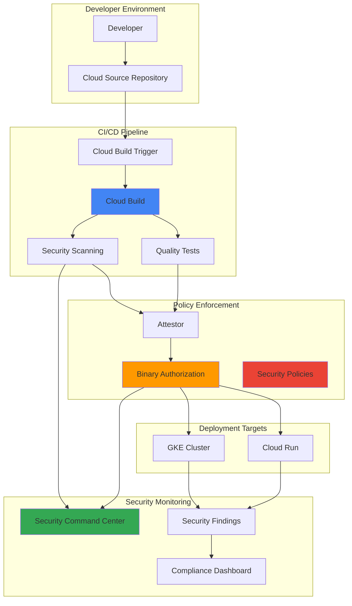

# Code Quality Enforcement with Cloud Build Triggers and Security Command Center

## Problem

Development teams struggle to maintain consistent code quality and security standards across multiple repositories and deployment environments. Manual code reviews and ad-hoc security scanning create bottlenecks in the CI/CD pipeline, while inconsistent policy enforcement leads to vulnerable code reaching production environments. Organizations need an automated system that enforces quality gates, integrates security scanning, and provides centralized compliance monitoring without disrupting developer productivity.

## Solution

Implement an intelligent code quality enforcement pipeline that combines Cloud Build Triggers for automated CI/CD, Binary Authorization for policy enforcement, and Security Command Center for centralized security monitoring. This solution automatically triggers quality checks on code commits, enforces security policies at deployment time, and provides real-time visibility into compliance status across all environments.

## Architecture Diagram



## Prerequisites

1. Google Cloud project with billing enabled and appropriate IAM permissions
2. Cloud SDK (gcloud) installed and configured or Cloud Shell access
3. Basic understanding of CI/CD pipelines, container security, and policy enforcement
4. Familiarity with Kubernetes deployments and container orchestration
5. Estimated cost: $20-50 for resources created during this recipe (varies by usage)

> **Note**: This recipe creates multiple Google Cloud services that may incur charges. Monitor your usage through the Google Cloud Console billing dashboard.

## Preparation

```bash
# Set environment variables for GCP resources
export PROJECT_ID="code-quality-$(date +%s)"
export REGION="us-central1"
export ZONE="us-central1-a"
export CLUSTER_NAME="quality-enforcement-cluster"

# Generate unique suffix for resource names
RANDOM_SUFFIX=$(openssl rand -hex 3)
export REPO_NAME="secure-app-${RANDOM_SUFFIX}"
export TRIGGER_NAME="quality-enforcement-trigger-${RANDOM_SUFFIX}"
export ATTESTOR_NAME="quality-attestor-${RANDOM_SUFFIX}"
export SERVICE_ACCOUNT="build-security-sa-${RANDOM_SUFFIX}"

# Set default project and region
gcloud config set project ${PROJECT_ID}
gcloud config set compute/region ${REGION}
gcloud config set compute/zone ${ZONE}

# Enable required APIs
gcloud services enable cloudbuild.googleapis.com
gcloud services enable sourcerepo.googleapis.com
gcloud services enable binaryauthorization.googleapis.com
gcloud services enable securitycenter.googleapis.com
gcloud services enable container.googleapis.com
gcloud services enable containeranalysis.googleapis.com
gcloud services enable run.googleapis.com

echo "✅ Project configured: ${PROJECT_ID}"
echo "✅ APIs enabled for security pipeline"
```

## Steps

1. **Create Cloud Source Repository and Sample Application**:

   Cloud Source Repositories provides Git repositories hosted on Google Cloud with integrated CI/CD capabilities. Creating a repository with sample application code establishes the foundation for automated quality enforcement, enabling developers to trigger security scans and policy validation through standard Git workflows.

   ```bash
   # Create Cloud Source Repository
   gcloud source repos create ${REPO_NAME} \
       --project=${PROJECT_ID}
   
   # Clone the repository locally
   gcloud source repos clone ${REPO_NAME} \
       --project=${PROJECT_ID}
   
   cd ${REPO_NAME}
   
   # Create sample application structure
   mkdir -p app tests security
   
   # Create sample Python application
   cat > app/main.py << 'EOF'
   from flask import Flask, jsonify
   import os
   import logging
   
   app = Flask(__name__)
   logging.basicConfig(level=logging.INFO)
   
   @app.route('/')
   def hello():
       return jsonify({
           'message': 'Secure Hello World',
           'version': '1.0.0',
           'environment': os.getenv('ENVIRONMENT', 'development')
       })
   
   @app.route('/health')
   def health():
       return jsonify({'status': 'healthy'})
   
   if __name__ == '__main__':
       app.run(host='0.0.0.0', port=int(os.getenv('PORT', 8080)))
   EOF
   
   echo "✅ Cloud Source Repository created with sample application"
   ```

2. **Create Dockerfile with Security Best Practices**:

   Container security begins with secure base images and minimal attack surface. This Dockerfile implements security best practices including non-root user execution, minimal base image, and explicit dependency management. These practices reduce vulnerabilities and support Binary Authorization policy enforcement.

   ```bash
   # Create secure Dockerfile
   cat > Dockerfile << 'EOF'
   FROM python:3.11-slim
   
   # Create non-root user for security
   RUN groupadd -r appuser && useradd -r -g appuser appuser
   
   # Set working directory
   WORKDIR /app
   
   # Install dependencies
   COPY requirements.txt .
   RUN pip install --no-cache-dir -r requirements.txt
   
   # Copy application code
   COPY app/ .
   
   # Change ownership to non-root user
   RUN chown -R appuser:appuser /app
   USER appuser
   
   # Expose port
   EXPOSE 8080
   
   # Health check
   HEALTHCHECK --interval=30s --timeout=3s --start-period=5s --retries=3 \
       CMD curl -f http://localhost:8080/health || exit 1
   
   # Start application
   CMD ["python", "main.py"]
   EOF
   
   # Create requirements file
   cat > requirements.txt << 'EOF'
   Flask==2.3.3
   gunicorn==21.2.0
   requests==2.31.0
   EOF
   
   echo "✅ Secure Dockerfile created with best practices"
   ```

3. **Create Cloud Build Configuration with Security Scanning**:

   Cloud Build configuration defines the automated pipeline that enforces code quality through multiple validation stages. This configuration integrates static code analysis, dependency scanning, container image vulnerability assessment, and security policy compliance checks. Each step must pass before proceeding to deployment, ensuring comprehensive quality enforcement.

   ```bash
   # Create comprehensive Cloud Build configuration
   cat > cloudbuild.yaml << 'EOF'
   steps:
   # Step 1: Run unit tests
   - name: 'python:3.11-slim'
     entrypoint: 'bash'
     args:
     - '-c'
     - |
       pip install -r requirements.txt pytest
       python -m pytest tests/ -v || exit 1
     id: 'unit-tests'
   
   # Step 2: Static code analysis with bandit
   - name: 'python:3.11-slim'
     entrypoint: 'bash'
     args:
     - '-c'
     - |
       pip install bandit[toml]
       bandit -r app/ -f json -o security/bandit-report.json || true
       bandit -r app/ --severity-level medium || exit 1
     id: 'static-analysis'
   
   # Step 3: Dependency vulnerability scanning
   - name: 'python:3.11-slim'
     entrypoint: 'bash'
     args:
     - '-c'
     - |
       pip install safety
       safety check --json --output security/safety-report.json || true
       safety check --short-report || exit 1
     id: 'dependency-scan'
   
   # Step 4: Build container image
   - name: 'gcr.io/cloud-builders/docker'
     args: ['build', '-t', 'gcr.io/$PROJECT_ID/${_IMAGE_NAME}:$BUILD_ID', '.']
     id: 'build-image'
   
   # Step 5: Container vulnerability scanning
   - name: 'gcr.io/cloud-builders/docker'
     args: ['push', 'gcr.io/$PROJECT_ID/${_IMAGE_NAME}:$BUILD_ID']
     id: 'push-image'
   
   # Step 6: Create attestation for Binary Authorization
   - name: 'gcr.io/cloud-builders/gcloud'
     entrypoint: 'bash'
     args:
     - '-c'
     - |
       gcloud container binauthz attestations sign-and-create \
         --artifact-url=gcr.io/$PROJECT_ID/${_IMAGE_NAME}:$BUILD_ID \
         --attestor=${_ATTESTOR_NAME} \
         --attestor-project=${PROJECT_ID} \
         --keyversion=${_KEY_VERSION}
     id: 'create-attestation'
   
   substitutions:
     _IMAGE_NAME: 'secure-app'
     _ATTESTOR_NAME: '${ATTESTOR_NAME}'
     _KEY_VERSION: 'projects/${PROJECT_ID}/locations/global/keyRings/binauthz-ring/cryptoKeys/attestor-key/cryptoKeyVersions/1'
   
   options:
     logging: CLOUD_LOGGING_ONLY
   
   images:
   - 'gcr.io/$PROJECT_ID/${_IMAGE_NAME}:$BUILD_ID'
   EOF
   
   # Create basic unit test
   cat > tests/test_main.py << 'EOF'
   import sys
   import os
   sys.path.insert(0, os.path.join(os.path.dirname(__file__), '..', 'app'))
   
   from main import app
   import pytest
   
   @pytest.fixture
   def client():
       app.config['TESTING'] = True
       with app.test_client() as client:
           yield client
   
   def test_hello_endpoint(client):
       response = client.get('/')
       assert response.status_code == 200
       assert b'Secure Hello World' in response.data
   
   def test_health_endpoint(client):
       response = client.get('/health')
       assert response.status_code == 200
       assert b'healthy' in response.data
   EOF
   
   echo "✅ Cloud Build configuration created with security scanning"
   ```

4. **Create Service Account and Configure IAM Permissions**:

   Service accounts provide identity and access management for automated systems while following the principle of least privilege. This service account configuration grants only the necessary permissions for Cloud Build to perform security scanning, create attestations, and interact with Security Command Center, ensuring secure automation without over-privileging.

   ```bash
   # Create service account for Cloud Build
   gcloud iam service-accounts create ${SERVICE_ACCOUNT} \
       --display-name="Build Security Service Account" \
       --description="Service account for automated security pipeline"
   
   # Grant necessary IAM roles
   gcloud projects add-iam-policy-binding ${PROJECT_ID} \
       --member="serviceAccount:${SERVICE_ACCOUNT}@${PROJECT_ID}.iam.gserviceaccount.com" \
       --role="roles/cloudbuild.builds.builder"
   
   gcloud projects add-iam-policy-binding ${PROJECT_ID} \
       --member="serviceAccount:${SERVICE_ACCOUNT}@${PROJECT_ID}.iam.gserviceaccount.com" \
       --role="roles/binaryauthorization.attestorsEditor"
   
   gcloud projects add-iam-policy-binding ${PROJECT_ID} \
       --member="serviceAccount:${SERVICE_ACCOUNT}@${PROJECT_ID}.iam.gserviceaccount.com" \
       --role="roles/containeranalysis.notes.editor"
   
   gcloud projects add-iam-policy-binding ${PROJECT_ID} \
       --member="serviceAccount:${SERVICE_ACCOUNT}@${PROJECT_ID}.iam.gserviceaccount.com" \
       --role="roles/securitycenter.findingsEditor"
   
   echo "✅ Service account created with security permissions"
   ```

5. **Set Up Binary Authorization with Security Policies**:

   Binary Authorization provides deployment-time security policy enforcement that prevents unauthorized or vulnerable container images from running in production. Creating attestors and policies ensures that only images that have passed security scans and quality checks can be deployed, implementing a critical security gate in the CI/CD pipeline.

   ```bash
   # Create Cloud KMS key ring and key for attestation signing
   gcloud kms keyrings create binauthz-ring \
       --location=global
   
   gcloud kms keys create attestor-key \
       --location=global \
       --keyring=binauthz-ring \
       --purpose=asymmetric-signing \
       --default-algorithm=rsa-sign-pkcs1-4096-sha512
   
   # Create Binary Authorization attestor
   gcloud container binauthz attestors create ${ATTESTOR_NAME} \
       --attestation-authority-note=${ATTESTOR_NAME} \
       --attestation-authority-note-project=${PROJECT_ID}
   
   # Add public key to attestor
   gcloud container binauthz attestors public-keys add \
       --attestor=${ATTESTOR_NAME} \
       --keyversion-project=${PROJECT_ID} \
       --keyversion-location=global \
       --keyversion-keyring=binauthz-ring \
       --keyversion-key=attestor-key \
       --keyversion=1
   
   # Create Binary Authorization policy
   cat > binauthz-policy.yaml << EOF
   defaultAdmissionRule:
     requireAttestationsBy:
     - projects/${PROJECT_ID}/attestors/${ATTESTOR_NAME}
     enforcementMode: ENFORCED_BLOCK_AND_AUDIT_LOG
   globalPolicyEvaluationMode: ENABLE
   admissionWhitelistPatterns:
   - namePattern: gcr.io/my-project/allowlisted-image*
   clusterAdmissionRules:
     us-central1-a.${CLUSTER_NAME}:
       requireAttestationsBy:
       - projects/${PROJECT_ID}/attestors/${ATTESTOR_NAME}
       enforcementMode: ENFORCED_BLOCK_AND_AUDIT_LOG
   EOF
   
   gcloud container binauthz policy import binauthz-policy.yaml
   
   echo "✅ Binary Authorization configured with security policies"
   ```

6. **Create Cloud Build Trigger with Quality Gates**:

   Cloud Build Triggers automate the execution of security and quality pipelines based on source code changes. Configuring triggers with quality gates ensures that every code commit undergoes comprehensive security scanning, policy validation, and compliance checking before deployment, providing continuous security enforcement throughout the development lifecycle.

   ```bash
   # Create Cloud Build trigger with security scanning
   gcloud builds triggers create cloud-source-repositories \
       --repo=${REPO_NAME} \
       --branch-pattern="^main$" \
       --build-config="cloudbuild.yaml" \
       --name=${TRIGGER_NAME} \
       --description="Automated security and quality enforcement pipeline" \
       --service-account="projects/${PROJECT_ID}/serviceAccounts/${SERVICE_ACCOUNT}@${PROJECT_ID}.iam.gserviceaccount.com" \
       --substitutions="_IMAGE_NAME=secure-app,_ATTESTOR_NAME=${ATTESTOR_NAME}"
   
   # Commit and push code to trigger the pipeline
   git add .
   git commit -m "Initial commit: Secure application with quality enforcement"
   git push origin main
   
   echo "✅ Cloud Build trigger created and pipeline initiated"
   ```

7. **Deploy GKE Cluster with Binary Authorization Enabled**:

   Google Kubernetes Engine with Binary Authorization integration provides runtime security policy enforcement for containerized applications. Enabling Binary Authorization on the cluster ensures that only attested, security-scanned images can be deployed, creating a secure deployment environment that maintains compliance with organizational security policies.

   ```bash
   # Create GKE cluster with Binary Authorization enabled
   gcloud container clusters create ${CLUSTER_NAME} \
       --zone=${ZONE} \
       --num-nodes=3 \
       --enable-binauthz \
       --enable-network-policy \
       --enable-shielded-nodes \
       --shielded-secure-boot \
       --shielded-integrity-monitoring \
       --workload-pool=${PROJECT_ID}.svc.id.goog
   
   # Get cluster credentials
   gcloud container clusters get-credentials ${CLUSTER_NAME} \
       --zone=${ZONE}
   
   # Create Kubernetes deployment manifest
   cat > k8s-deployment.yaml << EOF
   apiVersion: apps/v1
   kind: Deployment
   metadata:
     name: secure-app
     labels:
       app: secure-app
   spec:
     replicas: 3
     selector:
       matchLabels:
         app: secure-app
     template:
       metadata:
         labels:
           app: secure-app
       spec:
         containers:
         - name: secure-app
           image: gcr.io/${PROJECT_ID}/secure-app:latest
           ports:
           - containerPort: 8080
           resources:
             requests:
               memory: "64Mi"
               cpu: "250m"
             limits:
               memory: "128Mi"
               cpu: "500m"
           securityContext:
             runAsNonRoot: true
             runAsUser: 1000
             allowPrivilegeEscalation: false
             readOnlyRootFilesystem: true
   ---
   apiVersion: v1
   kind: Service
   metadata:
     name: secure-app-service
   spec:
     selector:
       app: secure-app
     ports:
     - protocol: TCP
       port: 80
       targetPort: 8080
     type: LoadBalancer
   EOF
   
   echo "✅ GKE cluster created with Binary Authorization enabled"
   ```

8. **Configure Security Command Center Integration**:

   Security Command Center provides centralized security and compliance monitoring across Google Cloud resources. Configuring SCC integration enables real-time visibility into security findings from container scanning, policy violations, and compliance status, creating a comprehensive security dashboard for the entire code quality enforcement pipeline.

   ```bash
   # Enable Security Command Center API (if not already enabled)
   gcloud services enable securitycenter.googleapis.com
   
   # Create custom security finding source
   gcloud scc sources create \
       --display-name="Code Quality Enforcement Pipeline" \
       --description="Security findings from automated code quality pipeline"
   
   # Get the source ID for future reference
   export SCC_SOURCE=$(gcloud scc sources list --format="value(name)" \
       --filter="displayName:'Code Quality Enforcement Pipeline'")
   
   # Create sample security finding
   gcloud scc findings create finding-code-quality-001 \
       --source=${SCC_SOURCE} \
       --state=ACTIVE \
       --category="SECURITY_SCAN_RESULT" \
       --external-uri="https://console.cloud.google.com/cloud-build/builds" \
       --source-properties="scanType=container-scan,severity=medium,pipeline=${TRIGGER_NAME}"
   
   echo "✅ Security Command Center configured for compliance monitoring"
   echo "SCC Source: ${SCC_SOURCE}"
   ```

## Validation & Testing

1. **Verify Cloud Build Pipeline Execution**:

   ```bash
   # Check recent build status
   gcloud builds list --limit=5 --format="table(id,status,source.repoSource.repoName,createTime)"
   
   # Get detailed build information
   BUILD_ID=$(gcloud builds list --limit=1 --format="value(id)")
   gcloud builds describe ${BUILD_ID}
   ```

   Expected output: Build status should show "SUCCESS" with all security scanning steps completed.

2. **Test Binary Authorization Policy Enforcement**:

   ```bash
   # Attempt to deploy without attestation (should fail)
   kubectl run test-pod --image=nginx:latest --dry-run=server
   
   # Check attestation status
   gcloud container binauthz attestations list \
       --attestor=${ATTESTOR_NAME} \
       --artifact-url=gcr.io/${PROJECT_ID}/secure-app:${BUILD_ID}
   ```

   Expected output: Deployment without attestation should be blocked by Binary Authorization policy.

3. **Validate Security Command Center Integration**:

   ```bash
   # List security findings
   gcloud scc findings list --source=${SCC_SOURCE} \
       --format="table(name,category,state,createTime)"
   
   # Check container analysis results
   gcloud container images scan gcr.io/${PROJECT_ID}/secure-app:${BUILD_ID} \
       --format="table(vulnerability.severity,vulnerability.cvssScore,vulnerability.packageIssue[0].affectedPackage)"
   ```

   Expected output: Security findings should appear in SCC dashboard with vulnerability scan results.

4. **Test Application Deployment with Valid Attestation**:

   ```bash
   # Deploy application with valid attestation
   sed -i "s/:latest/:${BUILD_ID}/g" k8s-deployment.yaml
   kubectl apply -f k8s-deployment.yaml
   
   # Verify deployment status
   kubectl get pods -l app=secure-app
   kubectl get service secure-app-service
   ```

   Expected output: Application should deploy successfully with valid attestation.

## Cleanup

1. **Remove Kubernetes Resources**:

   ```bash
   # Delete Kubernetes deployments and services
   kubectl delete -f k8s-deployment.yaml
   
   echo "✅ Kubernetes resources removed"
   ```

2. **Delete GKE Cluster**:

   ```bash
   # Delete GKE cluster
   gcloud container clusters delete ${CLUSTER_NAME} \
       --zone=${ZONE} \
       --quiet
   
   echo "✅ GKE cluster deleted"
   ```

3. **Remove Binary Authorization Resources**:

   ```bash
   # Reset Binary Authorization policy to default
   gcloud container binauthz policy import /dev/stdin << 'EOF'
   defaultAdmissionRule:
     evaluationMode: ALWAYS_ALLOW
     enforcementMode: ENFORCED_BLOCK_AND_AUDIT_LOG
   globalPolicyEvaluationMode: ENABLE
   EOF
   
   # Delete attestor
   gcloud container binauthz attestors delete ${ATTESTOR_NAME} --quiet
   
   # Delete KMS resources
   gcloud kms keys versions destroy 1 \
       --key=attestor-key \
       --keyring=binauthz-ring \
       --location=global \
       --quiet
   
   gcloud kms keys destroy attestor-key \
       --keyring=binauthz-ring \
       --location=global \
       --quiet
   
   echo "✅ Binary Authorization resources removed"
   ```

4. **Clean Up Cloud Build and Source Repository**:

   ```bash
   # Delete Cloud Build trigger
   gcloud builds triggers delete ${TRIGGER_NAME} --quiet
   
   # Delete Cloud Source Repository
   gcloud source repos delete ${REPO_NAME} --quiet
   
   # Delete service account
   gcloud iam service-accounts delete \
       ${SERVICE_ACCOUNT}@${PROJECT_ID}.iam.gserviceaccount.com \
       --quiet
   
   echo "✅ Cloud Build and repository resources removed"
   ```

5. **Remove Security Command Center Source**:

   ```bash
   # Delete SCC custom source
   gcloud scc sources delete ${SCC_SOURCE} --quiet
   
   echo "✅ Security Command Center resources cleaned up"
   ```

## Discussion

This intelligent code quality enforcement pipeline demonstrates how Google Cloud's integrated security services create a comprehensive DevSecOps environment. The solution addresses the critical challenge of maintaining security and quality standards while enabling rapid development cycles through automated policy enforcement and continuous monitoring.

The integration of Cloud Build Triggers with Binary Authorization provides deployment-time security controls that prevent vulnerable or non-compliant code from reaching production environments. This approach implements the "shift-left" security philosophy by incorporating security scanning early in the development pipeline while maintaining strict policy enforcement at deployment time. The attestation-based approach ensures that only images that have passed comprehensive security checks can be deployed, creating a verifiable chain of trust from source code to production.

Security Command Center integration provides centralized visibility and compliance monitoring across the entire pipeline. By consolidating security findings from container scanning, policy violations, and compliance checks, SCC enables security teams to maintain oversight without becoming a bottleneck in the development process. The real-time monitoring capabilities help organizations demonstrate compliance with industry standards and quickly respond to emerging security threats.

The pipeline's multi-layered security approach combines static code analysis, dependency vulnerability scanning, container image assessment, and runtime policy enforcement. This comprehensive coverage addresses various attack vectors and ensures that security considerations are embedded throughout the software development lifecycle. The automated nature of these controls reduces the risk of human error while providing consistent policy enforcement across all environments.

> **Tip**: Implement gradual policy enforcement by starting with Binary Authorization in "dry-run" mode, allowing teams to understand policy impacts before enabling blocking enforcement. This approach facilitates smooth adoption while maintaining security standards.

For more information on implementing secure CI/CD pipelines, see the [Google Cloud Build Security Best Practices](https://cloud.google.com/build/docs/securing-builds/overview), [Binary Authorization Documentation](https://cloud.google.com/binary-authorization/docs), [Security Command Center User Guide](https://cloud.google.com/security-command-center/docs), [Container Analysis Documentation](https://cloud.google.com/container-analysis/docs), and [Google Cloud Architecture Framework Security Pillar](https://cloud.google.com/architecture/framework/security).

## Challenge

Extend this intelligent code quality enforcement solution by implementing these advanced capabilities:

1. **Multi-Environment Policy Progression**: Configure different Binary Authorization policies for development, staging, and production environments with progressively stricter requirements, including separate attestors for each environment and automated policy promotion based on testing results.

2. **Advanced Security Scanning Integration**: Integrate additional security tools such as Container Registry vulnerability scanning, Cloud Security Scanner for web application testing, and third-party SAST/DAST tools through custom Cloud Build steps with findings aggregation in Security Command Center.

3. **Automated Compliance Reporting**: Build automated compliance reporting that aggregates security findings, policy violations, and attestation status into executive dashboards and regulatory reports, with automated notifications for critical security events and policy violations.

4. **Dynamic Policy Adjustment**: Implement machine learning-based policy recommendations that analyze historical security findings and deployment patterns to suggest optimal policy configurations and automatically adjust policies based on threat intelligence feeds.

5. **Cross-Project Security Governance**: Extend the solution to operate across multiple Google Cloud projects with centralized policy management, organization-level security monitoring, and federated attestation services for enterprise-scale code quality enforcement.

## Infrastructure Code

*Infrastructure code will be generated after recipe approval.*