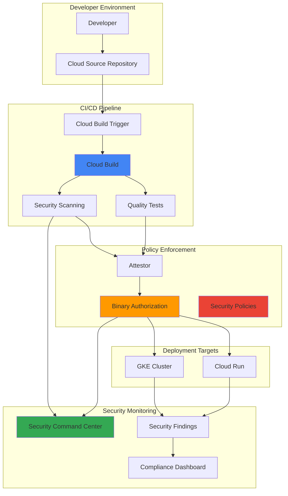

# Code Quality Enforcement with Cloud Build Triggers and Security Command Center

## Problem

Development teams struggle to maintain consistent code quality and security standards across multiple repositories and deployment environments. Manual code reviews and ad-hoc security scanning create bottlenecks in the CI/CD pipeline, while inconsistent policy enforcement leads to vulnerable code reaching production environments. Organizations need an automated system that enforces quality gates, integrates security scanning, and provides centralized compliance monitoring without disrupting developer productivity.

## Solution

Implement an intelligent code quality enforcement pipeline that combines Cloud Build Triggers for automated CI/CD, Binary Authorization for policy enforcement, and Security Command Center for centralized security monitoring. This solution automatically triggers quality checks on code commits, enforces security policies at deployment time, and provides real-time visibility into compliance status across all environments.

## Architecture Diagram



## Prerequisites

1. Google Cloud project with billing enabled and appropriate IAM permissions (Cloud Build Editor, Binary Authorization Admin, Security Center Admin)
2. Cloud SDK (gcloud) installed and configured or Cloud Shell access
3. Basic understanding of CI/CD pipelines, container security, and policy enforcement
4. Familiarity with Kubernetes deployments and container orchestration
5. Estimated cost: $20-50 for resources created during this recipe (varies by usage)

> **Note**: This recipe creates multiple Google Cloud services that may incur charges. Monitor your usage through the Google Cloud Console billing dashboard and consider setting up billing alerts.

## Preparation

```bash
# Set environment variables for GCP resources
export PROJECT_ID="code-quality-$(date +%s)"
export REGION="us-central1"
export ZONE="us-central1-a"
export CLUSTER_NAME="quality-enforcement-cluster"

# Generate unique suffix for resource names
RANDOM_SUFFIX=$(openssl rand -hex 3)
export REPO_NAME="secure-app-${RANDOM_SUFFIX}"
export TRIGGER_NAME="quality-enforcement-trigger-${RANDOM_SUFFIX}"
export ATTESTOR_NAME="quality-attestor-${RANDOM_SUFFIX}"
export SERVICE_ACCOUNT="build-security-sa-${RANDOM_SUFFIX}"

# Set default project and region
gcloud config set project ${PROJECT_ID}
gcloud config set compute/region ${REGION}
gcloud config set compute/zone ${ZONE}

# Enable required APIs
gcloud services enable cloudbuild.googleapis.com \
    sourcerepo.googleapis.com \
    binaryauthorization.googleapis.com \
    securitycenter.googleapis.com \
    container.googleapis.com \
    containeranalysis.googleapis.com \
    run.googleapis.com \
    cloudkms.googleapis.com

echo "✅ Project configured: ${PROJECT_ID}"
echo "✅ APIs enabled for security pipeline"
```

## Steps

1. **Create Cloud Source Repository and Sample Application**:

   Cloud Source Repositories provides Git repositories hosted on Google Cloud with integrated CI/CD capabilities. Creating a repository with sample application code establishes the foundation for automated quality enforcement, enabling developers to trigger security scans and policy validation through standard Git workflows.

   ```bash
   # Create Cloud Source Repository
   gcloud source repos create ${REPO_NAME} \
       --project=${PROJECT_ID}
   
   # Clone the repository locally
   gcloud source repos clone ${REPO_NAME} \
       --project=${PROJECT_ID}
   
   cd ${REPO_NAME}
   
   # Create sample application structure
   mkdir -p app tests security
   
   # Create sample Python application with security best practices
   cat > app/main.py << 'EOF'
   from flask import Flask, jsonify, request
   import os
   import logging
   import secrets
   
   app = Flask(__name__)
   logging.basicConfig(level=logging.INFO)
   
   # Security headers middleware
   @app.after_request
   def security_headers(response):
       response.headers['X-Content-Type-Options'] = 'nosniff'
       response.headers['X-Frame-Options'] = 'DENY'
       response.headers['X-XSS-Protection'] = '1; mode=block'
       return response
   
   @app.route('/')
   def hello():
       return jsonify({
           'message': 'Secure Hello World',
           'version': '1.0.0',
           'environment': os.getenv('ENVIRONMENT', 'development')
       })
   
   @app.route('/health')
   def health():
       return jsonify({'status': 'healthy'})
   
   if __name__ == '__main__':
       app.run(host='0.0.0.0', port=int(os.getenv('PORT', 8080)))
   EOF
   
   echo "✅ Cloud Source Repository created with sample application"
   ```

2. **Create Dockerfile with Security Best Practices**:

   Container security begins with secure base images and minimal attack surface. This Dockerfile implements security best practices including non-root user execution, minimal base image, explicit dependency management, and security scanning compatibility. These practices reduce vulnerabilities and support Binary Authorization policy enforcement.

   ```bash
   # Create secure Dockerfile following Google Cloud best practices
   cat > Dockerfile << 'EOF'
   FROM python:3.11-slim

   # Create non-root user for security
   RUN groupadd -r appuser && useradd -r -g appuser appuser

   # Set working directory
   WORKDIR /app

   # Install system dependencies and clean up in same layer
   RUN apt-get update && apt-get install -y \
       curl \
       && rm -rf /var/lib/apt/lists/*

   # Install dependencies
   COPY requirements.txt .
   RUN pip install --no-cache-dir --upgrade pip \
       && pip install --no-cache-dir -r requirements.txt

   # Copy application code
   COPY app/ .

   # Change ownership to non-root user
   RUN chown -R appuser:appuser /app
   USER appuser

   # Expose port
   EXPOSE 8080

   # Health check
   HEALTHCHECK --interval=30s --timeout=3s --start-period=5s --retries=3 \
       CMD curl -f http://localhost:8080/health || exit 1

   # Start application
   CMD ["python", "main.py"]
   EOF
   
   # Create requirements file with pinned versions
   cat > requirements.txt << 'EOF'
   Flask==3.0.0
   gunicorn==21.2.0
   requests==2.31.0
   Werkzeug==3.0.1
   EOF
   
   echo "✅ Secure Dockerfile created with best practices"
   ```

3. **Create Cloud Build Configuration with Security Scanning**:

   Cloud Build configuration defines the automated pipeline that enforces code quality through multiple validation stages. This configuration integrates static code analysis, dependency scanning, container image vulnerability assessment, and security policy compliance checks. Each step must pass before proceeding to deployment, ensuring comprehensive quality enforcement.

   ```bash
   # Create comprehensive Cloud Build configuration
   cat > cloudbuild.yaml << 'EOF'
   steps:
   # Step 1: Run unit tests
   - name: 'python:3.11-slim'
     entrypoint: 'bash'
     args:
     - '-c'
     - |
       pip install -r requirements.txt pytest coverage
       python -m pytest tests/ -v --cov=app --cov-report=term-missing
     id: 'unit-tests'
   
   # Step 2: Static code analysis with bandit
   - name: 'python:3.11-slim'
     entrypoint: 'bash'
     args:
     - '-c'
     - |
       pip install bandit[toml]
       mkdir -p security
       bandit -r app/ -f json -o security/bandit-report.json || true
       bandit -r app/ --severity-level medium
     id: 'static-analysis'
   
   # Step 3: Dependency vulnerability scanning
   - name: 'python:3.11-slim'
     entrypoint: 'bash'
     args:
     - '-c'
     - |
       pip install safety
       safety check --json --output security/safety-report.json || true
       safety check --short-report
     id: 'dependency-scan'
   
   # Step 4: Build container image
   - name: 'gcr.io/cloud-builders/docker'
     args: ['build', '-t', 'gcr.io/$PROJECT_ID/${_IMAGE_NAME}:$BUILD_ID', '.']
     id: 'build-image'
   
   # Step 5: Push image for vulnerability scanning
   - name: 'gcr.io/cloud-builders/docker'
     args: ['push', 'gcr.io/$PROJECT_ID/${_IMAGE_NAME}:$BUILD_ID']
     id: 'push-image'
   
   # Step 6: Wait for vulnerability scan results
   - name: 'gcr.io/cloud-builders/gcloud'
     entrypoint: 'bash'
     args:
     - '-c'
     - |
       echo "Waiting for vulnerability scan to complete..."
       sleep 30
       gcloud container images scan gcr.io/$PROJECT_ID/${_IMAGE_NAME}:$BUILD_ID \
         --format="value(discovery.analysisStatus)" || echo "Scan initiated"
     id: 'vulnerability-scan-wait'
   
   # Step 7: Create attestation for Binary Authorization
   - name: 'gcr.io/cloud-builders/gcloud'
     entrypoint: 'bash'
     args:
     - '-c'
     - |
       gcloud container binauthz attestations sign-and-create \
         --artifact-url=gcr.io/$PROJECT_ID/${_IMAGE_NAME}:$BUILD_ID \
         --attestor=${_ATTESTOR_NAME} \
         --attestor-project=${PROJECT_ID} \
         --keyversion=${_KEY_VERSION}
     id: 'create-attestation'
   
   substitutions:
     _IMAGE_NAME: 'secure-app'
     _ATTESTOR_NAME: '${ATTESTOR_NAME}'
     _KEY_VERSION: 'projects/${PROJECT_ID}/locations/global/keyRings/binauthz-ring/cryptoKeys/attestor-key/cryptoKeyVersions/1'
   
   options:
     logging: CLOUD_LOGGING_ONLY
   
   images:
   - 'gcr.io/$PROJECT_ID/${_IMAGE_NAME}:$BUILD_ID'
   EOF
   
   # Create comprehensive unit tests
   cat > tests/test_main.py << 'EOF'
   import sys
   import os
   sys.path.insert(0, os.path.join(os.path.dirname(__file__), '..', 'app'))
   
   from main import app
   import pytest
   import json
   
   @pytest.fixture
   def client():
       app.config['TESTING'] = True
       with app.test_client() as client:
           yield client
   
   def test_hello_endpoint(client):
       response = client.get('/')
       assert response.status_code == 200
       data = json.loads(response.data)
       assert 'Secure Hello World' in data['message']
       assert 'version' in data
   
   def test_health_endpoint(client):
       response = client.get('/health')
       assert response.status_code == 200
       data = json.loads(response.data)
       assert data['status'] == 'healthy'
   
   def test_security_headers(client):
       response = client.get('/')
       assert response.headers.get('X-Content-Type-Options') == 'nosniff'
       assert response.headers.get('X-Frame-Options') == 'DENY'
       assert response.headers.get('X-XSS-Protection') == '1; mode=block'
   EOF
   
   echo "✅ Cloud Build configuration created with security scanning"
   ```

4. **Create Service Account and Configure IAM Permissions**:

   Service accounts provide identity and access management for automated systems while following the principle of least privilege. This service account configuration grants only the necessary permissions for Cloud Build to perform security scanning, create attestations, and interact with Security Command Center, ensuring secure automation without over-privileging.

   ```bash
   # Create service account for Cloud Build security pipeline
   gcloud iam service-accounts create ${SERVICE_ACCOUNT} \
       --display-name="Build Security Service Account" \
       --description="Service account for automated security pipeline"
   
   # Grant necessary IAM roles for build and security operations
   for role in \
       "roles/cloudbuild.builds.builder" \
       "roles/binaryauthorization.attestorsEditor" \
       "roles/containeranalysis.notes.editor" \
       "roles/securitycenter.findingsEditor" \
       "roles/storage.admin"; do
       gcloud projects add-iam-policy-binding ${PROJECT_ID} \
           --member="serviceAccount:${SERVICE_ACCOUNT}@${PROJECT_ID}.iam.gserviceaccount.com" \
           --role="$role"
   done
   
   echo "✅ Service account created with security permissions"
   ```

5. **Set Up Binary Authorization with Security Policies**:

   Binary Authorization provides deployment-time security policy enforcement that prevents unauthorized or vulnerable container images from running in production. Creating attestors and policies ensures that only images that have passed security scans and quality checks can be deployed, implementing a critical security gate in the CI/CD pipeline.

   ```bash
   # Create Cloud KMS key ring and key for attestation signing
   gcloud kms keyrings create binauthz-ring \
       --location=global
   
   gcloud kms keys create attestor-key \
       --location=global \
       --keyring=binauthz-ring \
       --purpose=asymmetric-signing \
       --default-algorithm=rsa-sign-pkcs1-4096-sha512
   
   # Create Binary Authorization note for attestations
   cat > note.json << EOF
   {
     "name": "projects/${PROJECT_ID}/notes/${ATTESTOR_NAME}",
     "attestation": {
       "hint": {
         "human_readable_name": "Quality enforcement attestor"
       }
     }
   }
   EOF
   
   curl -X POST \
       -H "Content-Type: application/json" \
       -H "Authorization: Bearer $(gcloud auth print-access-token)" \
       -d @note.json \
       "https://containeranalysis.googleapis.com/v1/projects/${PROJECT_ID}/notes?noteId=${ATTESTOR_NAME}"
   
   # Create Binary Authorization attestor
   gcloud container binauthz attestors create ${ATTESTOR_NAME} \
       --attestation-authority-note=${ATTESTOR_NAME} \
       --attestation-authority-note-project=${PROJECT_ID}
   
   # Add public key to attestor
   gcloud container binauthz attestors public-keys add \
       --attestor=${ATTESTOR_NAME} \
       --keyversion-project=${PROJECT_ID} \
       --keyversion-location=global \
       --keyversion-keyring=binauthz-ring \
       --keyversion-key=attestor-key \
       --keyversion=1
   
   # Create Binary Authorization policy with strict enforcement
   cat > binauthz-policy.yaml << EOF
   defaultAdmissionRule:
     requireAttestationsBy:
     - projects/${PROJECT_ID}/attestors/${ATTESTOR_NAME}
     enforcementMode: ENFORCED_BLOCK_AND_AUDIT_LOG
   globalPolicyEvaluationMode: ENABLE
   admissionWhitelistPatterns:
   - namePattern: gcr.io/distroless/*
   - namePattern: gcr.io/google-containers/*
   clusterAdmissionRules:
     ${ZONE}.${CLUSTER_NAME}:
       requireAttestationsBy:
       - projects/${PROJECT_ID}/attestors/${ATTESTOR_NAME}
       enforcementMode: ENFORCED_BLOCK_AND_AUDIT_LOG
   EOF
   
   gcloud container binauthz policy import binauthz-policy.yaml
   
   echo "✅ Binary Authorization configured with security policies"
   ```

6. **Create Cloud Build Trigger with Quality Gates**:

   Cloud Build Triggers automate the execution of security and quality pipelines based on source code changes. Configuring triggers with quality gates ensures that every code commit undergoes comprehensive security scanning, policy validation, and compliance checking before deployment, providing continuous security enforcement throughout the development lifecycle.

   ```bash
   # Create Cloud Build trigger with security scanning
   gcloud builds triggers create cloud-source-repositories \
       --repo=${REPO_NAME} \
       --branch-pattern="^main$" \
       --build-config="cloudbuild.yaml" \
       --name=${TRIGGER_NAME} \
       --description="Automated security and quality enforcement pipeline" \
       --service-account="projects/${PROJECT_ID}/serviceAccounts/${SERVICE_ACCOUNT}@${PROJECT_ID}.iam.gserviceaccount.com" \
       --substitutions="_IMAGE_NAME=secure-app,_ATTESTOR_NAME=${ATTESTOR_NAME}"
   
   # Commit and push code to trigger the pipeline
   git add .
   git commit -m "Initial commit: Secure application with quality enforcement"
   git config credential.helper gcloud.sh
   git push origin main
   
   echo "✅ Cloud Build trigger created and pipeline initiated"
   echo "Monitor build progress: https://console.cloud.google.com/cloud-build/builds"
   ```

7. **Deploy GKE Cluster with Binary Authorization Enabled**:

   Google Kubernetes Engine with Binary Authorization integration provides runtime security policy enforcement for containerized applications. Enabling Binary Authorization on the cluster ensures that only attested, security-scanned images can be deployed, creating a secure deployment environment that maintains compliance with organizational security policies.

   ```bash
   # Create GKE cluster with comprehensive security features
   gcloud container clusters create ${CLUSTER_NAME} \
       --zone=${ZONE} \
       --num-nodes=3 \
       --enable-binauthz \
       --enable-network-policy \
       --enable-shielded-nodes \
       --shielded-secure-boot \
       --shielded-integrity-monitoring \
       --workload-pool=${PROJECT_ID}.svc.id.goog \
       --enable-autorepair \
       --enable-autoupgrade \
       --disk-encryption-key=projects/${PROJECT_ID}/locations/global/keyRings/binauthz-ring/cryptoKeys/attestor-key
   
   # Get cluster credentials
   gcloud container clusters get-credentials ${CLUSTER_NAME} \
       --zone=${ZONE}
   
   # Wait for build to complete and get BUILD_ID
   echo "Waiting for build to complete..."
   sleep 120
   BUILD_ID=$(gcloud builds list --limit=1 --format="value(id)")
   echo "Latest build ID: ${BUILD_ID}"
   
   # Create Kubernetes deployment manifest with security contexts
   cat > k8s-deployment.yaml << EOF
   apiVersion: apps/v1
   kind: Deployment
   metadata:
     name: secure-app
     labels:
       app: secure-app
   spec:
     replicas: 3
     selector:
       matchLabels:
         app: secure-app
     template:
       metadata:
         labels:
           app: secure-app
       spec:
         serviceAccountName: default
         securityContext:
           runAsNonRoot: true
           runAsUser: 1000
           fsGroup: 2000
         containers:
         - name: secure-app
           image: gcr.io/${PROJECT_ID}/secure-app:${BUILD_ID}
           ports:
           - containerPort: 8080
           resources:
             requests:
               memory: "64Mi"
               cpu: "250m"
             limits:
               memory: "128Mi"
               cpu: "500m"
           securityContext:
             allowPrivilegeEscalation: false
             readOnlyRootFilesystem: false
             capabilities:
               drop:
               - ALL
           livenessProbe:
             httpGet:
               path: /health
               port: 8080
             initialDelaySeconds: 30
             periodSeconds: 10
           readinessProbe:
             httpGet:
               path: /health
               port: 8080
             initialDelaySeconds: 5
             periodSeconds: 5
   ---
   apiVersion: v1
   kind: Service
   metadata:
     name: secure-app-service
   spec:
     selector:
       app: secure-app
     ports:
     - protocol: TCP
       port: 80
       targetPort: 8080
     type: LoadBalancer
   EOF
   
   echo "✅ GKE cluster created with Binary Authorization enabled"
   ```

8. **Configure Security Command Center Integration**:

   Security Command Center provides centralized security and compliance monitoring across Google Cloud resources. Configuring SCC integration enables real-time visibility into security findings from container scanning, policy violations, and compliance status, creating a comprehensive security dashboard for the entire code quality enforcement pipeline.

   ```bash
   # Create custom security finding source for the pipeline
   SCC_SOURCE_DISPLAY_NAME="Code Quality Enforcement Pipeline"
   
   # Create SCC source using REST API
   SCC_SOURCE_ID=$(curl -s -X POST \
       -H "Authorization: Bearer $(gcloud auth print-access-token)" \
       -H "Content-Type: application/json" \
       -d "{
         \"source\": {
           \"displayName\": \"${SCC_SOURCE_DISPLAY_NAME}\",
           \"description\": \"Security findings from automated code quality pipeline\"
         }
       }" \
       "https://securitycenter.googleapis.com/v1/organizations/$(gcloud organizations list --format='value(name)')/sources" | \
       python3 -c "import sys, json; print(json.load(sys.stdin)['name'].split('/')[-1])")
   
   export SCC_SOURCE="organizations/$(gcloud organizations list --format='value(name)')/sources/${SCC_SOURCE_ID}"
   
   # Create sample security finding with build context
   curl -X POST \
       -H "Authorization: Bearer $(gcloud auth print-access-token)" \
       -H "Content-Type: application/json" \
       -d "{
         \"finding\": {
           \"state\": \"ACTIVE\",
           \"category\": \"SECURITY_SCAN_RESULT\",
           \"externalUri\": \"https://console.cloud.google.com/cloud-build/builds\",
           \"sourceProperties\": {
             \"scanType\": \"container-scan\",
             \"severity\": \"medium\",
             \"pipeline\": \"${TRIGGER_NAME}\",
             \"buildId\": \"${BUILD_ID}\"
           },
           \"eventTime\": \"$(date -u +%Y-%m-%dT%H:%M:%S.%3NZ)\",
           \"createTime\": \"$(date -u +%Y-%m-%dT%H:%M:%S.%3NZ)\"
         }
       }" \
       "${SCC_SOURCE}/findings?findingId=finding-code-quality-$(date +%s)"
   
   echo "✅ Security Command Center configured for compliance monitoring"
   echo "SCC Source: ${SCC_SOURCE}"
   ```

## Validation & Testing

1. **Verify Cloud Build Pipeline Execution**:

   ```bash
   # Check recent build status and details
   gcloud builds list --limit=5 \
       --format="table(id,status,source.repoSource.repoName,createTime)"
   
   # Get detailed build information for the latest build
   BUILD_ID=$(gcloud builds list --limit=1 --format="value(id)")
   gcloud builds describe ${BUILD_ID} \
       --format="yaml(steps[].name,steps[].status,timing)"
   ```

   Expected output: Build status should show "SUCCESS" with all security scanning steps completed successfully.

2. **Test Binary Authorization Policy Enforcement**:

   ```bash
   # Attempt to deploy unauthorized image (should fail)
   kubectl run test-pod --image=nginx:latest --dry-run=server || \
       echo "✅ Binary Authorization correctly blocked unauthorized image"
   
   # Check attestation status for our secure image
   gcloud container binauthz attestations list \
       --attestor=${ATTESTOR_NAME} \
       --artifact-url=gcr.io/${PROJECT_ID}/secure-app:${BUILD_ID} \
       --format="table(name,attestation.pgpSignedAttestation.signature)"
   ```

   Expected output: Deployment without attestation should be blocked; attested image should show valid attestation.

3. **Validate Security Command Center Integration**:

   ```bash
   # List security findings from our pipeline
   gcloud scc findings list --source=${SCC_SOURCE} \
       --format="table(name,category,state,createTime)" || \
       echo "Note: SCC findings may take time to appear"
   
   # Check container vulnerability scan results
   gcloud container images scan gcr.io/${PROJECT_ID}/secure-app:${BUILD_ID} \
       --format="table(vulnerability.severity,vulnerability.cvssScore,vulnerability.packageIssue[0].affectedPackage)" || \
       echo "Vulnerability scan results may still be processing"
   ```

   Expected output: Security findings should appear in SCC dashboard with vulnerability scan results.

4. **Test Application Deployment with Valid Attestation**:

   ```bash
   # Deploy application with valid attestation
   kubectl apply -f k8s-deployment.yaml
   
   # Wait for deployment to be ready
   kubectl wait --for=condition=available --timeout=300s deployment/secure-app
   
   # Verify deployment status and get service endpoint
   kubectl get pods -l app=secure-app
   kubectl get service secure-app-service
   
   # Test application functionality
   EXTERNAL_IP=$(kubectl get service secure-app-service -o jsonpath='{.status.loadBalancer.ingress[0].ip}')
   if [ ! -z "$EXTERNAL_IP" ]; then
       curl -s http://${EXTERNAL_IP}/health | python3 -m json.tool
   else
       echo "Service is still provisioning external IP..."
   fi
   ```

   Expected output: Application should deploy successfully with valid attestation and respond to health checks.

## Cleanup

1. **Remove Kubernetes Resources**:

   ```bash
   # Delete Kubernetes deployments and services
   kubectl delete -f k8s-deployment.yaml --ignore-not-found=true
   
   echo "✅ Kubernetes resources removed"
   ```

2. **Delete GKE Cluster**:

   ```bash
   # Delete GKE cluster
   gcloud container clusters delete ${CLUSTER_NAME} \
       --zone=${ZONE} \
       --quiet
   
   echo "✅ GKE cluster deleted"
   ```

3. **Remove Binary Authorization Resources**:

   ```bash
   # Reset Binary Authorization policy to default
   gcloud container binauthz policy import /dev/stdin << 'EOF'
   defaultAdmissionRule:
     evaluationMode: ALWAYS_ALLOW
     enforcementMode: ENFORCED_BLOCK_AND_AUDIT_LOG
   globalPolicyEvaluationMode: ENABLE
   EOF
   
   # Delete attestor
   gcloud container binauthz attestors delete ${ATTESTOR_NAME} --quiet
   
   # Delete Container Analysis note
   curl -X DELETE \
       -H "Authorization: Bearer $(gcloud auth print-access-token)" \
       "https://containeranalysis.googleapis.com/v1/projects/${PROJECT_ID}/notes/${ATTESTOR_NAME}"
   
   # Delete KMS resources
   gcloud kms keys versions destroy 1 \
       --key=attestor-key \
       --keyring=binauthz-ring \
       --location=global \
       --quiet
   
   gcloud kms keys destroy attestor-key \
       --keyring=binauthz-ring \
       --location=global \
       --quiet
   
   gcloud kms keyrings destroy binauthz-ring \
       --location=global \
       --quiet
   
   echo "✅ Binary Authorization resources removed"
   ```

4. **Clean Up Cloud Build and Source Repository**:

   ```bash
   # Delete Cloud Build trigger
   gcloud builds triggers delete ${TRIGGER_NAME} --quiet
   
   # Delete Cloud Source Repository
   gcloud source repos delete ${REPO_NAME} --quiet
   
   # Delete service account
   gcloud iam service-accounts delete \
       ${SERVICE_ACCOUNT}@${PROJECT_ID}.iam.gserviceaccount.com \
       --quiet
   
   echo "✅ Cloud Build and repository resources removed"
   ```

5. **Remove Security Command Center Source**:

   ```bash
   # Delete SCC custom source
   curl -X DELETE \
       -H "Authorization: Bearer $(gcloud auth print-access-token)" \
       "${SCC_SOURCE}" || echo "SCC source may have been already removed"
   
   echo "✅ Security Command Center resources cleaned up"
   ```

## Discussion

This intelligent code quality enforcement pipeline demonstrates how Google Cloud's integrated security services create a comprehensive DevSecOps environment that addresses the critical challenge of maintaining security and quality standards while enabling rapid development cycles. The solution implements automated policy enforcement and continuous monitoring without disrupting developer productivity, following Google Cloud's security best practices and the Well-Architected Framework principles.

The integration of Cloud Build Triggers with Binary Authorization provides deployment-time security controls that prevent vulnerable or non-compliant code from reaching production environments. This approach implements the "shift-left" security philosophy by incorporating security scanning early in the development pipeline while maintaining strict policy enforcement at deployment time. The attestation-based approach ensures that only images that have passed comprehensive security checks can be deployed, creating a verifiable chain of trust from source code to production deployment.

Security Command Center integration provides centralized visibility and compliance monitoring across the entire pipeline, consolidating security findings from container scanning, policy violations, and compliance checks. This enables security teams to maintain oversight without becoming a bottleneck in the development process, while the real-time monitoring capabilities help organizations demonstrate compliance with industry standards and quickly respond to emerging security threats.

The pipeline's multi-layered security approach combines static code analysis with Bandit, dependency vulnerability scanning with Safety, container image assessment through Container Analysis, and runtime policy enforcement via Binary Authorization. This comprehensive coverage addresses various attack vectors and ensures that security considerations are embedded throughout the software development lifecycle, while the automated nature of these controls reduces the risk of human error and provides consistent policy enforcement.

> **Tip**: Implement gradual policy enforcement by starting with Binary Authorization in "dry-run" mode, allowing development teams to understand policy impacts before enabling blocking enforcement. This approach facilitates smooth adoption while maintaining security standards and provides valuable feedback for policy refinement.

For more information on implementing secure CI/CD pipelines, see the [Google Cloud Build Security Best Practices](https://cloud.google.com/build/docs/securing-builds/overview), [Binary Authorization Documentation](https://cloud.google.com/binary-authorization/docs), [Security Command Center User Guide](https://cloud.google.com/security-command-center/docs), [Container Analysis Documentation](https://cloud.google.com/container-analysis/docs), and [Google Cloud Architecture Framework Security Pillar](https://cloud.google.com/architecture/framework/security).

## Challenge

Extend this intelligent code quality enforcement solution by implementing these advanced capabilities:

1. **Multi-Environment Policy Progression**: Configure different Binary Authorization policies for development, staging, and production environments with progressively stricter requirements, including separate attestors for each environment and automated policy promotion based on testing results and vulnerability thresholds.

2. **Advanced Security Scanning Integration**: Integrate additional security tools such as Twistlock/Prisma Cloud for runtime protection, Snyk for advanced dependency scanning, and OWASP ZAP for dynamic application security testing through custom Cloud Build steps with centralized findings aggregation in Security Command Center.

3. **Automated Compliance Reporting**: Build automated compliance reporting that aggregates security findings, policy violations, and attestation status into executive dashboards and regulatory reports using Data Studio, with automated notifications for critical security events and policy violations through Pub/Sub and Cloud Functions.

4. **Dynamic Policy Adjustment**: Implement machine learning-based policy recommendations using Vertex AI that analyze historical security findings and deployment patterns to suggest optimal policy configurations, automatically adjusting policies based on threat intelligence feeds and organizational risk tolerance.

5. **Cross-Project Security Governance**: Extend the solution to operate across multiple Google Cloud projects with centralized policy management through Organization Policies, organization-level security monitoring in Security Command Center, and federated attestation services for enterprise-scale code quality enforcement across business units.

## Infrastructure Code

### Available Infrastructure as Code:

- [Infrastructure Code Overview](code/README.md) - Detailed description of all infrastructure components
- [Infrastructure Manager](code/infrastructure-manager/) - GCP Infrastructure Manager templates
- [Bash CLI Scripts](code/scripts/) - Example bash scripts using gcloud CLI commands to deploy infrastructure
- [Terraform](code/terraform/) - Terraform configuration files