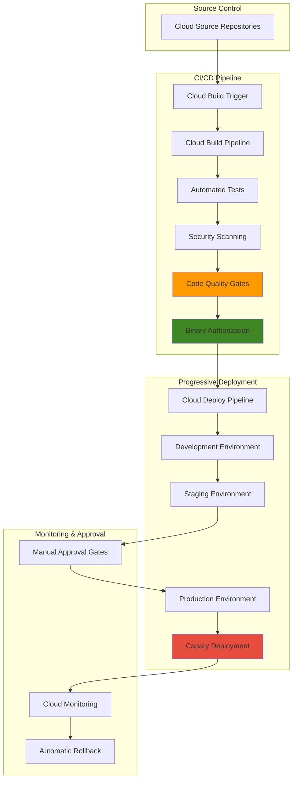

# Code Quality Gates with Cloud Build Triggers and Cloud Deploy

## Problem

Development teams struggle to maintain consistent code quality and security standards across rapidly evolving applications, leading to production deployments with vulnerabilities, performance issues, and compliance violations. Manual code review processes create bottlenecks, while inconsistent quality checks result in technical debt accumulation and increased risk of security breaches that can impact business operations and customer trust.

## Solution

Create an automated CI/CD pipeline using Cloud Build Triggers for comprehensive code quality enforcement and Cloud Deploy for progressive delivery with approval gates. This solution integrates automated testing, security scanning, and code quality analysis directly into the development workflow, ensuring only validated code reaches production through controlled canary deployments with automatic rollback capabilities.

## Architecture Diagram



## Prerequisites

1. Google Cloud project with billing enabled and required APIs access
2. gcloud CLI installed and configured (version 450.0.0 or later)
3. Git command line tool and basic container/Kubernetes knowledge
4. Understanding of CI/CD concepts and progressive delivery strategies
5. Estimated cost: $50-100 for running this recipe (includes compute, storage, and networking costs)

> **Note**: This recipe creates resources across multiple GCP services. Monitor usage through Cloud Billing to track costs during implementation.

## Preparation

```bash
# Set environment variables for GCP resources
export PROJECT_ID="code-quality-pipeline-$(date +%s)"
export REGION="us-central1"
export ZONE="us-central1-a"

# Generate unique suffix for resource names
RANDOM_SUFFIX=$(openssl rand -hex 3)

# Set project configuration
gcloud config set project ${PROJECT_ID}
gcloud config set compute/region ${REGION}
gcloud config set compute/zone ${ZONE}

# Enable required APIs for the pipeline
gcloud services enable cloudbuild.googleapis.com
gcloud services enable clouddeploy.googleapis.com
gcloud services enable sourcerepo.googleapis.com
gcloud services enable binaryauthorization.googleapis.com
gcloud services enable container.googleapis.com
gcloud services enable artifactregistry.googleapis.com
gcloud services enable cloudresourcemanager.googleapis.com

# Create environment variables for resources
export REPO_NAME="sample-app-${RANDOM_SUFFIX}"
export CLUSTER_NAME="quality-gates-cluster-${RANDOM_SUFFIX}"
export PIPELINE_NAME="quality-pipeline-${RANDOM_SUFFIX}"
export REGISTRY_NAME="app-registry-${RANDOM_SUFFIX}"
export BUILD_ID=""
export TRIGGER_ID=""

echo "✅ Project configured: ${PROJECT_ID}"
echo "✅ Repository name: ${REPO_NAME}"
echo "✅ Cluster name: ${CLUSTER_NAME}"
```

## Steps

1. **Create Source Repository and Sample Application**:

   Cloud Source Repositories provides secure, private Git hosting that integrates seamlessly with Google Cloud services. Creating a repository with a sample application establishes the foundation for our CI/CD pipeline, enabling automatic trigger activation when code changes are pushed to specific branches.

   ```bash
   # Create Cloud Source Repository
   gcloud source repos create ${REPO_NAME}
   
   # Clone the repository locally
   gcloud source repos clone ${REPO_NAME} \
       --project=${PROJECT_ID}
   
   cd ${REPO_NAME}
   
   # Create sample Node.js application
   cat > app.js << 'EOF'
const express = require('express');
const app = express();
const port = process.env.PORT || 8080;

app.get('/', (req, res) => {
  res.json({
    message: 'Code Quality Pipeline Demo',
    version: '1.0.0',
    timestamp: new Date().toISOString()
  });
});

app.get('/health', (req, res) => {
  res.status(200).json({ status: 'healthy' });
});

app.listen(port, () => {
  console.log(`Server running on port ${port}`);
});

module.exports = app;
EOF
   
   # Create package.json with dependencies and test scripts
   cat > package.json << 'EOF'
{
  "name": "code-quality-demo",
  "version": "1.0.0",
  "description": "Demo app for code quality pipeline",
  "main": "app.js",
  "scripts": {
    "start": "node app.js",
    "test": "jest",
    "lint": "eslint .",
    "security": "audit-ci --config audit-ci.json"
  },
  "dependencies": {
    "express": "^4.18.2"
  },
  "devDependencies": {
    "jest": "^29.5.0",
    "supertest": "^6.3.3",
    "eslint": "^8.41.0",
    "audit-ci": "^6.6.1"
  }
}
EOF
   
   echo "✅ Sample application created successfully"
   ```

   The application structure now includes proper dependency management and testing frameworks. This foundation enables comprehensive quality checks including unit testing, linting, and security scanning throughout the CI/CD pipeline.

2. **Create Dockerfile and Kubernetes Manifests**:

   Container deployment requires properly configured Docker images and Kubernetes manifests that follow security best practices. These configurations enable consistent deployments across environments while supporting progressive delivery strategies and rollback capabilities.

   ```bash
   # Create multi-stage Dockerfile for optimized builds
   cat > Dockerfile << 'EOF'
# Build stage
FROM node:18-alpine AS builder
WORKDIR /app
COPY package*.json ./
RUN npm ci --only=production

# Runtime stage
FROM node:18-alpine AS runtime
RUN addgroup -g 1001 -S nodejs && \
    adduser -S nodejs -u 1001
WORKDIR /app
COPY --from=builder /app/node_modules ./node_modules
COPY --chown=nodejs:nodejs . .
USER nodejs
EXPOSE 8080
CMD ["npm", "start"]
EOF
   
   # Create Kubernetes deployment manifest
   mkdir -p k8s
   cat > k8s/deployment.yaml << 'EOF'
apiVersion: apps/v1
kind: Deployment
metadata:
  name: code-quality-app
  labels:
    app: code-quality-app
spec:
  replicas: 3
  selector:
    matchLabels:
      app: code-quality-app
  template:
    metadata:
      labels:
        app: code-quality-app
    spec:
      containers:
      - name: app
        image: gcr.io/PROJECT_ID/code-quality-app:latest
        ports:
        - containerPort: 8080
        livenessProbe:
          httpGet:
            path: /health
            port: 8080
          initialDelaySeconds: 30
          periodSeconds: 10
        readinessProbe:
          httpGet:
            path: /health
            port: 8080
          initialDelaySeconds: 5
          periodSeconds: 5
        resources:
          requests:
            memory: "128Mi"
            cpu: "100m"
          limits:
            memory: "256Mi"
            cpu: "200m"
        securityContext:
          allowPrivilegeEscalation: false
          readOnlyRootFilesystem: true
          runAsNonRoot: true
          runAsUser: 1001
---
apiVersion: v1
kind: Service
metadata:
  name: code-quality-service
spec:
  selector:
    app: code-quality-app
  ports:
  - port: 80
    targetPort: 8080
  type: ClusterIP
EOF
   
   echo "✅ Container and Kubernetes configurations created"
   ```

   The deployment configuration implements security best practices including non-root execution, resource limits, and health checks. These configurations support reliable progressive deployments with proper monitoring and automatic recovery capabilities.

3. **Configure Code Quality and Security Scanning**:

   Comprehensive code quality enforcement requires multiple validation layers including unit testing, code linting, security vulnerability scanning, and dependency analysis. These automated checks ensure consistent quality standards while preventing security vulnerabilities from reaching production environments.

   ```bash
   # Create Jest test configuration
   cat > app.test.js << 'EOF'
const request = require('supertest');
const app = require('./app');

describe('Application Tests', () => {
  test('GET / should return application info', async () => {
    const response = await request(app).get('/');
    expect(response.status).toBe(200);
    expect(response.body.message).toBe('Code Quality Pipeline Demo');
    expect(response.body.version).toBe('1.0.0');
  });

  test('GET /health should return healthy status', async () => {
    const response = await request(app).get('/health');
    expect(response.status).toBe(200);
    expect(response.body.status).toBe('healthy');
  });
});
EOF
   
   # Create ESLint configuration for code quality
   cat > .eslintrc.json << 'EOF'
{
  "env": {
    "node": true,
    "es2021": true,
    "jest": true
  },
  "extends": [
    "eslint:recommended"
  ],
  "parserOptions": {
    "ecmaVersion": 12,
    "sourceType": "module"
  },
  "rules": {
    "no-console": "warn",
    "no-unused-vars": "error",
    "prefer-const": "error",
    "no-var": "error"
  }
}
EOF
   
   # Create audit configuration for security scanning
   cat > audit-ci.json << 'EOF'
{
  "moderate": true,
  "high": true,
  "critical": true,
  "report-type": "full",
  "allowlist": []
}
EOF
   
   echo "✅ Code quality and security configurations created"
   ```

   The quality gate configurations now include comprehensive testing, linting rules, and security scanning parameters. These automated checks provide immediate feedback to developers while maintaining consistent quality standards across all code contributions.

4. **Create Cloud Build Pipeline Configuration**:

   Cloud Build pipelines orchestrate the entire CI/CD workflow through declarative configuration files that define build steps, quality gates, and deployment triggers. This configuration implements a comprehensive validation pipeline that enforces quality standards before allowing code progression.

   ```bash
   # Create comprehensive Cloud Build configuration
   cat > cloudbuild.yaml << 'EOF'
steps:
  # Install dependencies
  - name: 'node:18-alpine'
    entrypoint: 'npm'
    args: ['ci']
    id: 'install-deps'

  # Run unit tests
  - name: 'node:18-alpine'
    entrypoint: 'npm'
    args: ['test']
    id: 'unit-tests'
    waitFor: ['install-deps']

  # Run code linting
  - name: 'node:18-alpine'
    entrypoint: 'npm'
    args: ['run', 'lint']
    id: 'code-lint'
    waitFor: ['install-deps']

  # Run security audit
  - name: 'node:18-alpine'
    entrypoint: 'npm'
    args: ['run', 'security']
    id: 'security-scan'
    waitFor: ['install-deps']

  # Build Docker image
  - name: 'gcr.io/cloud-builders/docker'
    args: [
      'build',
      '-t', 'gcr.io/$PROJECT_ID/code-quality-app:$COMMIT_SHA',
      '-t', 'gcr.io/$PROJECT_ID/code-quality-app:latest',
      '.'
    ]
    id: 'docker-build'
    waitFor: ['unit-tests', 'code-lint', 'security-scan']

  # Container security scanning
  - name: 'gcr.io/cloud-builders/gcloud'
    entrypoint: 'bash'
    args:
      - '-c'
      - |
        # Push image first for scanning
        docker push gcr.io/$PROJECT_ID/code-quality-app:$COMMIT_SHA
        # Run vulnerability scan
        gcloud container images scan gcr.io/$PROJECT_ID/code-quality-app:$COMMIT_SHA \
          --format="value(response.scan.analysisCompleted)" \
          --quiet || exit 1
    id: 'container-scan'
    waitFor: ['docker-build']

  # Tag and push additional image tags
  - name: 'gcr.io/cloud-builders/docker'
    args: ['push', 'gcr.io/$PROJECT_ID/code-quality-app:latest']
    id: 'docker-push'
    waitFor: ['container-scan']

  # Update Kubernetes manifests
  - name: 'gcr.io/cloud-builders/gcloud'
    entrypoint: 'bash'
    args:
      - '-c'
      - |
        sed -i "s|gcr.io/PROJECT_ID|gcr.io/$PROJECT_ID|g" k8s/deployment.yaml
        sed -i "s|:latest|:$COMMIT_SHA|g" k8s/deployment.yaml
    id: 'update-manifests'
    waitFor: ['docker-push']

  # Create Cloud Deploy release
  - name: 'gcr.io/cloud-builders/gcloud'
    entrypoint: 'bash'
    args:
      - '-c'
      - |
        gcloud deploy releases create release-$BUILD_ID \
          --delivery-pipeline=${_PIPELINE_NAME} \
          --region=${_REGION} \
          --source=. \
          --build-artifacts=gcr.io/$PROJECT_ID/code-quality-app:$COMMIT_SHA
    id: 'create-release'
    waitFor: ['update-manifests']

options:
  logging: CLOUD_LOGGING_ONLY
  machineType: E2_STANDARD_4

substitutions:
  _REGION: us-central1
  _PIPELINE_NAME: quality-pipeline-${RANDOM_SUFFIX}

timeout: 1200s
EOF
   
   echo "✅ Cloud Build pipeline configuration created"
   ```

   The pipeline configuration implements comprehensive quality gates including dependency installation, testing, linting, security scanning, container vulnerability analysis, and automated deployment preparation. Each step must pass before proceeding, ensuring consistent quality enforcement.

5. **Create GKE Cluster for Deployment Targets**:

   Google Kubernetes Engine provides managed Kubernetes clusters that support progressive deployment strategies with built-in monitoring and security features. Creating properly configured clusters enables reliable application deployment with automated scaling and health management.

   ```bash
   # Create GKE cluster with security features enabled
   gcloud container clusters create ${CLUSTER_NAME} \
       --zone=${ZONE} \
       --num-nodes=3 \
       --node-locations=${ZONE} \
       --machine-type=e2-standard-2 \
       --disk-size=30GB \
       --enable-autorepair \
       --enable-autoupgrade \
       --enable-network-policy \
       --enable-ip-alias \
       --enable-shielded-nodes \
       --shielded-secure-boot \
       --shielded-integrity-monitoring \
       --workload-pool=${PROJECT_ID}.svc.id.goog \
       --logging=SYSTEM,WORKLOAD \
       --monitoring=SYSTEM
   
   # Get cluster credentials
   gcloud container clusters get-credentials ${CLUSTER_NAME} \
       --zone=${ZONE}
   
   # Create namespaces for different environments
   kubectl create namespace development
   kubectl create namespace staging
   kubectl create namespace production
   
   echo "✅ GKE cluster created with security features enabled"
   ```

   The cluster configuration enables essential security features including network policies, workload identity, shielded nodes, and comprehensive logging. These features support secure progressive deployments with proper isolation between environments.

6. **Configure Binary Authorization Policy**:

   Binary Authorization ensures only verified container images can be deployed to production environments by enforcing attestation-based policies. This security layer prevents unauthorized or vulnerable images from reaching critical environments while maintaining deployment velocity.

   ```bash
   # Enable Binary Authorization API
   gcloud services enable binaryauthorization.googleapis.com
   
   # Create Binary Authorization policy
   cat > binauth-policy.yaml << 'EOF'
admissionWhitelistPatterns:
- namePattern: gcr.io/google_containers/*
- namePattern: k8s.gcr.io/*
- namePattern: gcr.io/google-appengine/*
defaultAdmissionRule:
  requireAttestationsBy: []
  enforcementMode: ENFORCED_BLOCK_AND_AUDIT_LOG
  evaluationMode: REQUIRE_ATTESTATION
clusterAdmissionRules:
  us-central1-a.quality-gates-cluster-*:
    requireAttestationsBy: []
    enforcementMode: ENFORCED_BLOCK_AND_AUDIT_LOG
    evaluationMode: ALWAYS_ALLOW
EOF
   
   # Apply Binary Authorization policy
   gcloud container binauthz policy import binauth-policy.yaml
   
   # Enable Binary Authorization on the cluster
   gcloud container clusters update ${CLUSTER_NAME} \
       --zone=${ZONE} \
       --enable-binauthz
   
   echo "✅ Binary Authorization policy configured"
   ```

   Binary Authorization is now configured to enforce security policies while allowing development and staging deployments. This configuration provides security governance without blocking the development workflow during testing phases.

7. **Create Cloud Deploy Pipeline Configuration**:

   Cloud Deploy orchestrates progressive delivery through declarative pipeline configurations that define deployment targets, promotion strategies, and approval requirements. This configuration enables controlled rollouts with built-in safety mechanisms and rollback capabilities.

   ```bash
   # Create skaffold configuration for Cloud Deploy
   cat > skaffold.yaml << 'EOF'
apiVersion: skaffold/v4beta1
kind: Config
metadata:
  name: code-quality-app
profiles:
- name: development
  manifests:
    rawYaml:
    - k8s/deployment.yaml
- name: staging
  manifests:
    rawYaml:
    - k8s/deployment.yaml
- name: production
  manifests:
    rawYaml:
    - k8s/deployment.yaml
EOF
   
   # Create Cloud Deploy pipeline configuration
   cat > clouddeploy.yaml << 'EOF'
apiVersion: deploy.cloud.google.com/v1
kind: DeliveryPipeline
metadata:
  name: quality-pipeline-${RANDOM_SUFFIX}
description: Automated code quality pipeline with progressive delivery
serialPipeline:
  stages:
  - targetId: development
    profiles: [development]
    strategy:
      standard:
        verify: false
  - targetId: staging
    profiles: [staging]
    strategy:
      standard:
        verify: true
  - targetId: production
    profiles: [production]
    strategy:
      canary:
        runtimeConfig:
          kubernetes:
            gatewayServiceMesh:
              httpRoute: code-quality-route
              service: code-quality-service
        canaryDeployment:
          percentages: [25, 50, 100]
          verify: true
          postDeploy:
            actions: ["verify-deployment"]
---
apiVersion: deploy.cloud.google.com/v1
kind: Target
metadata:
  name: development
description: Development environment
gke:
  cluster: projects/${PROJECT_ID}/locations/${ZONE}/clusters/${CLUSTER_NAME}
  internalIp: false
  namespace: development
---
apiVersion: deploy.cloud.google.com/v1
kind: Target
metadata:
  name: staging
description: Staging environment with approval gates
requireApproval: false
gke:
  cluster: projects/${PROJECT_ID}/locations/${ZONE}/clusters/${CLUSTER_NAME}
  internalIp: false
  namespace: staging
---
apiVersion: deploy.cloud.google.com/v1
kind: Target
metadata:
  name: production
description: Production environment with manual approval
requireApproval: true
gke:
  cluster: projects/${PROJECT_ID}/locations/${ZONE}/clusters/${CLUSTER_NAME}
  internalIp: false
  namespace: production
EOF
   
   # Apply Cloud Deploy configuration
   envsubst < clouddeploy.yaml | gcloud deploy apply \
       --file=- \
       --region=${REGION}
   
   echo "✅ Cloud Deploy pipeline configured with progressive delivery"
   ```

   The delivery pipeline now implements progressive deployment with automated development deployment, staging verification, and production canary rollouts with manual approval gates. This configuration ensures safe production deployments with built-in rollback capabilities.

8. **Create Cloud Build Trigger**:

   Cloud Build Triggers automatically initiate CI/CD pipelines when code changes are detected in source repositories. Configuring triggers with proper branch filtering and substitution variables enables automated quality enforcement while maintaining development workflow efficiency.

   ```bash
   # Create Cloud Build trigger for main branch
   gcloud builds triggers create cloud-source-repositories \
       --repo=${REPO_NAME} \
       --branch-pattern="^main$" \
       --build-config=cloudbuild.yaml \
       --substitutions=_REGION=${REGION},_PIPELINE_NAME=${PIPELINE_NAME} \
       --name="code-quality-trigger-${RANDOM_SUFFIX}" \
       --description="Automated quality pipeline trigger"
   
   # Store trigger ID for cleanup
   TRIGGER_ID=$(gcloud builds triggers list \
       --filter="name:code-quality-trigger-${RANDOM_SUFFIX}" \
       --format="value(id)")
   
   # Grant necessary permissions to Cloud Build service account
   PROJECT_NUMBER=$(gcloud projects describe ${PROJECT_ID} \
       --format="value(projectNumber)")
   
   CLOUDBUILD_SA="${PROJECT_NUMBER}@cloudbuild.gserviceaccount.com"
   
   # Grant Cloud Deploy permissions
   gcloud projects add-iam-policy-binding ${PROJECT_ID} \
       --member="serviceAccount:${CLOUDBUILD_SA}" \
       --role="roles/clouddeploy.developer"
   
   # Grant GKE permissions
   gcloud projects add-iam-policy-binding ${PROJECT_ID} \
       --member="serviceAccount:${CLOUDBUILD_SA}" \
       --role="roles/container.developer"
   
   # Grant Binary Authorization permissions
   gcloud projects add-iam-policy-binding ${PROJECT_ID} \
       --member="serviceAccount:${CLOUDBUILD_SA}" \
       --role="roles/binaryauthorization.attestorsViewer"
   
   echo "✅ Cloud Build trigger created with proper permissions"
   ```

   The trigger configuration now automatically initiates quality pipelines when code is pushed to the main branch. Service account permissions enable comprehensive pipeline execution including deployment, security scanning, and progressive delivery management.

9. **Commit and Push Code to Trigger Pipeline**:

   Committing code to the repository triggers the automated CI/CD pipeline, demonstrating the complete quality gate enforcement and progressive deployment workflow. This step validates the entire pipeline configuration and provides immediate feedback on implementation success.

   ```bash
   # Add all files to git
   git add .
   
   # Commit changes with descriptive message
   git commit -m "Add automated code quality pipeline with progressive delivery
   
   - Implement comprehensive CI/CD pipeline with Cloud Build
   - Add automated testing, linting, and security scanning
   - Configure progressive deployment with canary strategy
   - Enable Binary Authorization for container security
   - Add approval gates for production deployments"
   
   # Push to trigger the pipeline
   git push origin main
   
   # Get the build ID and monitor progress
   echo "Monitoring build progress..."
   BUILD_ID=$(gcloud builds list --limit=1 \
       --format="value(id)" \
       --filter="source.repoSource.repoName:${REPO_NAME}")
   
   echo "✅ Code pushed successfully - Build ID: ${BUILD_ID}"
   echo "Monitor build progress: https://console.cloud.google.com/cloud-build/builds/${BUILD_ID}"
   ```

   The pipeline is now executing with comprehensive quality gates including testing, security scanning, and progressive deployment preparation. Monitor the build progress to verify successful pipeline execution and quality enforcement.

## Validation & Testing

1. **Verify Cloud Build Pipeline Execution**:

   ```bash
   # Check build status and logs
   gcloud builds describe ${BUILD_ID} \
       --format="value(status,logUrl)"
   
   # List recent builds for the repository
   gcloud builds list \
       --filter="source.repoSource.repoName:${REPO_NAME}" \
       --limit=5 \
       --format="table(id,status,createTime,duration)"
   ```

   Expected output: Build status should show "SUCCESS" with all quality gates passed

2. **Validate Cloud Deploy Pipeline Status**:

   ```bash
   # Check delivery pipeline status
   gcloud deploy delivery-pipelines list \
       --region=${REGION} \
       --format="table(name,condition.pipelineReadyCondition.status)"
   
   # List releases and rollouts
   gcloud deploy releases list \
       --delivery-pipeline=${PIPELINE_NAME} \
       --region=${REGION} \
       --format="table(name,createTime,renderState)"
   ```

   Expected output: Pipeline should be ready with successful release creation

3. **Test Application Deployment in Development Environment**:

   ```bash
   # Check pod status in development namespace
   kubectl get pods -n development
   
   # Verify service accessibility
   kubectl port-forward -n development \
       service/code-quality-service 8080:80 &
   
   # Test application endpoints
   curl -s http://localhost:8080/ | jq '.'
   curl -s http://localhost:8080/health | jq '.'
   
   # Stop port forwarding
   pkill -f "kubectl port-forward"
   ```

   Expected output: Pods should be running and endpoints should return proper JSON responses

4. **Verify Security and Quality Gates**:

   ```bash
   # Check Binary Authorization policy status
   gcloud container binauthz policy export \
       --format="value(defaultAdmissionRule.enforcementMode)"
   
   # Verify container image vulnerability scan results
   gcloud container images scan-results list \
       --repository=gcr.io/${PROJECT_ID}/code-quality-app \
       --format="table(name,vulnerability.severity,createTime)"
   ```

   Expected output: Binary Authorization should be enforced and vulnerability scans should complete successfully

## Cleanup

1. **Delete Cloud Deploy Resources**:

   ```bash
   # Delete delivery pipeline and targets
   gcloud deploy delivery-pipelines delete ${PIPELINE_NAME} \
       --region=${REGION} \
       --quiet
   
   echo "✅ Cloud Deploy pipeline deleted"
   ```

2. **Remove GKE Cluster**:

   ```bash
   # Delete GKE cluster
   gcloud container clusters delete ${CLUSTER_NAME} \
       --zone=${ZONE} \
       --quiet
   
   echo "✅ GKE cluster deleted"
   ```

3. **Clean Up Cloud Build Resources**:

   ```bash
   # Delete Cloud Build triggers
   if [ -n "${TRIGGER_ID}" ]; then
       gcloud builds triggers delete ${TRIGGER_ID} --quiet
   else
       # Fallback: search for trigger by name
       FALLBACK_TRIGGER_ID=$(gcloud builds triggers list \
           --filter="name:code-quality-trigger-${RANDOM_SUFFIX}" \
           --format="value(id)")
       if [ -n "${FALLBACK_TRIGGER_ID}" ]; then
           gcloud builds triggers delete ${FALLBACK_TRIGGER_ID} --quiet
       fi
   fi
   
   echo "✅ Cloud Build triggers deleted"
   ```

4. **Remove Container Images and Repository**:

   ```bash
   # Delete container images
   gcloud container images delete gcr.io/${PROJECT_ID}/code-quality-app \
       --force-delete-tags \
       --quiet
   
   # Delete source repository
   gcloud source repos delete ${REPO_NAME} --quiet
   
   # Remove local repository
   cd ..
   rm -rf ${REPO_NAME}
   
   echo "✅ Container images and repository deleted"
   ```

5. **Reset Binary Authorization and Clean Up Environment Variables**:

   ```bash
   # Reset Binary Authorization policy to default
   gcloud container binauthz policy import \
       <(echo "defaultAdmissionRule: {enforcementMode: ALWAYS_ALLOW}")
   
   # Clean up environment variables
   unset PROJECT_ID REGION ZONE RANDOM_SUFFIX
   unset REPO_NAME CLUSTER_NAME PIPELINE_NAME REGISTRY_NAME
   unset BUILD_ID TRIGGER_ID
   
   echo "✅ All resources cleaned up successfully"
   ```

## Discussion

This automated code quality pipeline demonstrates how Cloud Build Triggers and Cloud Deploy work together to enforce comprehensive quality standards while enabling rapid, safe deployments. The solution implements multiple layers of validation including unit testing, code linting, security vulnerability scanning, and container analysis before allowing code progression through environments. The progressive delivery strategy using canary deployments with approval gates ensures production stability while maintaining development velocity, following Google Cloud's [CI/CD best practices](https://cloud.google.com/architecture/devops/devops-tech-continuous-integration) and [deployment strategies](https://cloud.google.com/deploy/docs/deployment-strategies).

The integration of Binary Authorization adds an essential security layer by preventing unauthorized container images from reaching production environments. This attestation-based approach ensures only verified, scanned containers can be deployed while maintaining audit trails for compliance requirements, as outlined in Google Cloud's [Binary Authorization documentation](https://cloud.google.com/binary-authorization/docs). Combined with Cloud Deploy's rollback capabilities, organizations can confidently implement continuous deployment knowing that both quality and security guardrails are automatically enforced.

The pipeline architecture supports modern DevOps practices by automating manual processes while preserving necessary control points. Development teams receive immediate feedback on quality issues, security vulnerabilities, and test failures, enabling faster iteration cycles. Operations teams benefit from consistent deployment processes, comprehensive monitoring, and automated rollback capabilities that reduce manual intervention and operational overhead, aligning with Google Cloud's [Well-Architected Framework](https://cloud.google.com/architecture/framework) principles.

> **Tip**: Integrate Cloud Monitoring and Cloud Logging to track pipeline performance metrics and identify optimization opportunities for build times and deployment success rates.

Key implementation considerations include proper IAM configuration for service accounts, network security for GKE clusters, and cost optimization through efficient resource sizing. The solution scales from small development teams to enterprise organizations by adjusting cluster sizes, adding additional quality gates, and incorporating more sophisticated approval workflows. Regular review of security scanning results and quality metrics ensures the pipeline continues meeting evolving requirements while maintaining high development productivity. For additional guidance, refer to the [Google Cloud Security Best Practices](https://cloud.google.com/security/best-practices) documentation.

## Challenge

Extend this automated code quality pipeline by implementing these enhancements:

1. **Advanced Security Integration**: Implement vulnerability scanning with Cloud Security Command Center integration, add SAST/DAST scanning tools, and configure automated security incident response workflows with Cloud Functions triggers.

2. **Performance Testing Gates**: Add automated performance testing using Cloud Load Testing API, implement performance regression detection with Cloud Monitoring metrics, and configure automatic rollback based on SLA violations during canary deployments.

3. **Multi-Environment Governance**: Expand to support multiple regions with Cloud Deploy promotion policies, implement environment-specific compliance scanning, and add automated compliance reporting with Cloud Asset Inventory integration.

4. **Advanced Monitoring and Observability**: Integrate distributed tracing with Cloud Trace, implement custom quality metrics dashboards in Cloud Monitoring, and add intelligent alerting with Cloud Alerting for pipeline failures and quality degradation detection.

5. **Enterprise Integration**: Connect with third-party security tools through Cloud Build custom steps, implement approval workflows with Cloud Workflows, and add integration with external ticket systems for change management and audit trail requirements.

## Infrastructure Code

*Infrastructure code will be generated after recipe approval.*