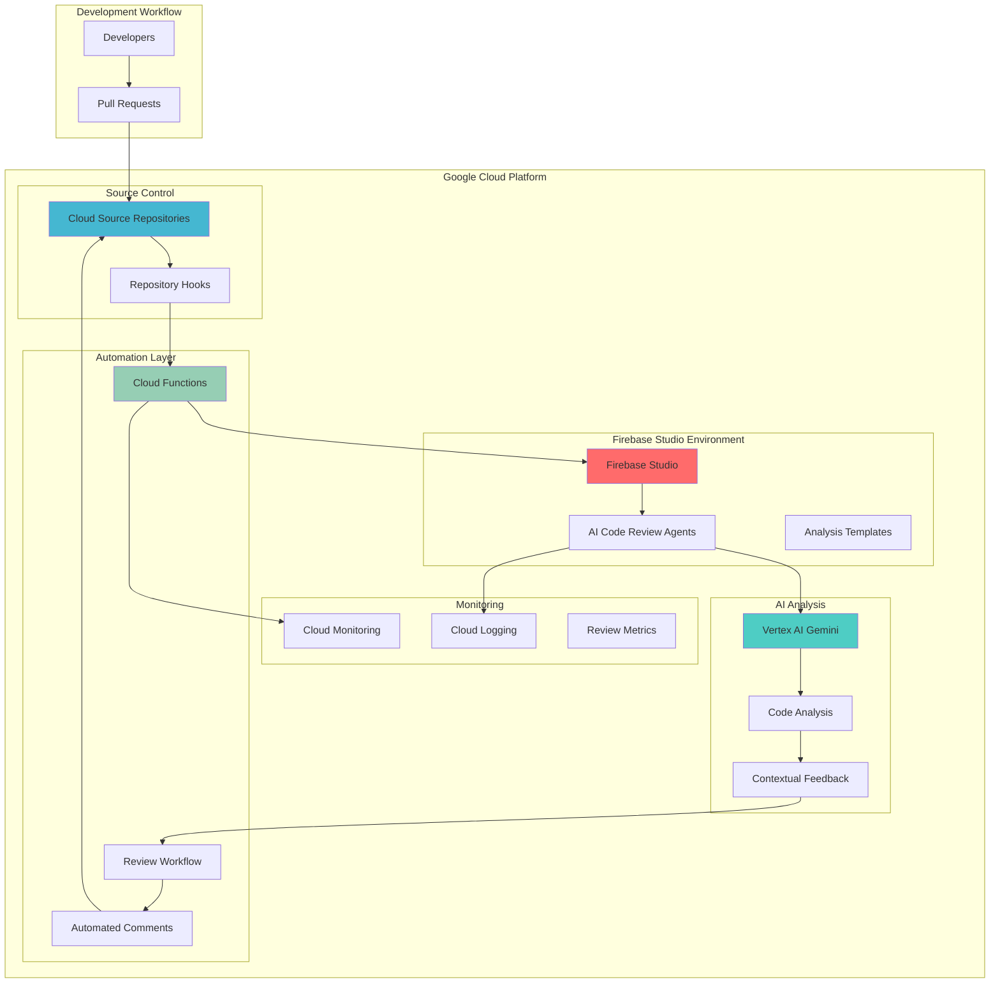

# Code Review Automation with Firebase Studio and Cloud Source Repositories

## Problem

Development teams struggle with inconsistent code review quality, delayed feedback cycles, and the manual effort required to identify code quality issues, security vulnerabilities, and adherence to coding standards. Traditional code review processes are time-consuming, prone to human oversight, and often fail to catch subtle issues that could impact application performance, maintainability, or security.

## Solution

Build an AI-powered code review automation system using Firebase Studio's agentic development environment to create intelligent code analysis agents that integrate with Cloud Source Repositories for automated pull request analysis. The solution leverages Vertex AI's advanced language models to provide contextual code quality feedback, security analysis, and best practice recommendations, while Cloud Functions orchestrate the automated review workflow.

## Architecture Diagram



## Prerequisites

1. Google Cloud account with billing enabled and appropriate permissions for Firebase Studio, Cloud Source Repositories, Vertex AI, and Cloud Functions
2. Google Cloud CLI (gcloud) installed and configured with authentication
3. Basic understanding of Git workflows, JavaScript/TypeScript, and AI/ML concepts
4. Familiarity with software development practices and code review processes
5. Estimated cost: $15-30 for 120 minutes of testing (Vertex AI API calls, Cloud Functions execution, repository storage)

> **Note**: Firebase Studio is currently in preview and available to everyone. Access the latest features at [Firebase Studio](https://studio.firebase.google.com) and review the [Firebase Studio documentation](https://firebase.google.com/docs/studio) for current capabilities and limitations.

## Preparation

Firebase Studio represents Google Cloud's latest advancement in agentic development environments, providing AI-powered code generation and analysis capabilities through Gemini integration. This cloud-based IDE enables developers to create sophisticated AI agents that can understand, analyze, and provide feedback on code quality, security, and best practices while integrating seamlessly with Google Cloud services.

```bash
# Set environment variables for the project
export PROJECT_ID="code-review-ai-$(date +%s)"
export REGION="us-central1"
export ZONE="us-central1-a"
export REPOSITORY_NAME="intelligent-review-system"

# Generate unique identifiers for resources
RANDOM_SUFFIX=$(openssl rand -hex 3)
export FUNCTION_NAME="code-review-trigger-${RANDOM_SUFFIX}"
export AGENT_NAME="code-review-agent-${RANDOM_SUFFIX}"

# Set default project and region
gcloud config set project ${PROJECT_ID}
gcloud config set compute/region ${REGION}
gcloud config set compute/zone ${ZONE}

# Enable required Google Cloud APIs
gcloud services enable sourcerepo.googleapis.com
gcloud services enable cloudfunctions.googleapis.com
gcloud services enable aiplatform.googleapis.com
gcloud services enable cloudbuild.googleapis.com
gcloud services enable firebase.googleapis.com
gcloud services enable eventarc.googleapis.com

echo "✅ Project configured: ${PROJECT_ID}"
echo "✅ Required APIs enabled for intelligent code review system"
```

The API enablement establishes the foundation for our intelligent code review system, connecting source control management, serverless execution, AI analysis, and continuous integration capabilities. This integrated platform enables seamless automation of code review workflows while leveraging Google Cloud's AI capabilities for enhanced code analysis.

## Steps

1. **Create Cloud Source Repository for Code Review System**:

   Cloud Source Repositories provide enterprise-grade Git hosting with tight integration to Google Cloud services, enabling automated triggers and webhooks that form the foundation of our intelligent review system. This managed Git service supports fine-grained access controls, audit logging, and seamless integration with Cloud Build and other Google Cloud developer tools.

   ```bash
   # Create the source repository
   gcloud source repos create ${REPOSITORY_NAME}
   
   # Get the repository clone URL
   REPO_URL=$(gcloud source repos describe ${REPOSITORY_NAME} \
       --format="value(url)")
   
   # Clone the repository locally for initial setup
   gcloud source repos clone ${REPOSITORY_NAME} \
       --project=${PROJECT_ID}
   
   echo "✅ Cloud Source Repository created: ${REPOSITORY_NAME}"
   echo "Repository URL: ${REPO_URL}"
   ```

   The repository is now ready to receive code and trigger automated review workflows. Cloud Source Repositories automatically provides audit trails, access controls, and integration points that will enable our AI agents to monitor code changes and provide intelligent feedback through the development lifecycle.

2. **Initialize Repository with Sample Code Structure**:

   Creating a realistic code structure provides the foundation for testing our intelligent review system with various file types, coding patterns, and potential issues that our AI agents will need to analyze and provide feedback on.

   ```bash
   # Navigate to the cloned repository
   cd ${REPOSITORY_NAME}
   
   # Create sample application structure
   mkdir -p src/{components,services,utils,tests}
   mkdir -p docs config
   
   # Create sample JavaScript files with various code quality issues
   cat > src/components/UserManager.js << 'EOF'
   // Sample component with intentional code quality issues
   function UserManager() {
       var users = [];
       
       function addUser(name, email) {
           // Missing validation
           users.push({name: name, email: email, id: Math.random()});
       }
       
       function getUser(id) {
           // Inefficient search
           for (var i = 0; i < users.length; i++) {
               if (users[i].id == id) {
                   return users[i];
               }
           }
       }
       
       // Missing return statement
       function deleteUser(id) {
           users = users.filter(user => user.id !== id);
       }
       
       return {
           addUser: addUser,
           getUser: getUser,
           deleteUser: deleteUser
       };
   }
   EOF
   
   # Create configuration files
   cat > package.json << 'EOF'
   {
     "name": "intelligent-review-demo",
     "version": "1.0.0",
     "description": "Demo application for AI code review",
     "scripts": {
       "test": "jest",
       "lint": "eslint src/"
     },
     "dependencies": {
       "express": "^4.18.0"
     },
     "devDependencies": {
       "jest": "^29.0.0",
       "eslint": "^8.0.0"
     }
   }
   EOF
   
   # Commit initial code structure
   git add .
   git commit -m "Initial project structure for AI code review testing"
   git push origin main
   
   echo "✅ Sample code structure created and committed"
   ```

   The sample code includes common issues like missing validation, inefficient algorithms, and inconsistent coding patterns that our AI review system will be designed to identify and provide constructive feedback on, creating a realistic testing environment for the intelligent analysis capabilities.

3. **Access Firebase Studio and Create Code Review Agent**:

   Firebase Studio's agentic development environment powered by Gemini provides the capability to create sophisticated AI agents that can understand code context, identify patterns, and provide intelligent feedback. This cloud-based IDE integrates directly with Google Cloud services and enables rapid development of AI-powered applications.

   ```bash
   # Open Firebase Studio in browser
   echo "🌐 Access Firebase Studio at: https://studio.firebase.google.com"
   echo "📝 Create new workspace or import existing project: ${PROJECT_ID}"
   
   # Create agent configuration for code review
   cat > code-review-agent-config.json << 'EOF'
   {
     "agent_name": "IntelligentCodeReviewer",
     "description": "AI agent for automated code quality analysis and review",
     "capabilities": [
       "code_analysis",
       "security_review",
       "performance_optimization",
       "best_practices_enforcement"
     ],
     "model_config": {
       "model": "gemini-1.5-flash",
       "temperature": 0.3,
       "max_tokens": 4096
     },
     "analysis_patterns": [
       "security_vulnerabilities",
       "performance_issues",
       "code_smells",
       "documentation_gaps",
       "testing_coverage"
     ]
   }
   EOF
   
   echo "✅ Agent configuration created"
   echo "📋 Next: Create agent in Firebase Studio using this configuration"
   ```

   The agent configuration defines the parameters and capabilities for our intelligent code reviewer, specifying analysis patterns, model settings, and the types of feedback the agent should provide. This configuration serves as the blueprint for creating consistent, comprehensive code reviews across all pull requests.

   > **Tip**: When creating the agent in Firebase Studio, use the agentic development features to iteratively refine the agent's prompts and responses based on your specific code review requirements and organizational coding standards.

4. **Develop Code Analysis Agent in Firebase Studio**:

   Within Firebase Studio, we'll create an intelligent agent capable of performing comprehensive code analysis using Vertex AI's Gemini models. This agent will analyze code for quality, security, performance, and adherence to best practices while providing constructive, contextual feedback.

   ```bash
   # Create the agent implementation template
   cat > firebase-studio-agent.js << 'EOF'
   // Intelligent Code Review Agent Implementation
   // This will be created within Firebase Studio environment
   
   import { VertexAI } from '@google-cloud/vertexai';
   
   class IntelligentCodeReviewer {
     constructor() {
       this.vertexAI = new VertexAI({
         project: process.env.PROJECT_ID,
         location: 'us-central1'
       });
       
       this.model = this.vertexAI.getGenerativeModel({
         model: 'gemini-1.5-flash'
       });
     }
   
     async analyzeCode(codeContent, fileName, changeType) {
       const analysisPrompt = `
         As an expert code reviewer, analyze the following code for:
         1. Security vulnerabilities and potential risks
         2. Performance optimization opportunities
         3. Code quality and maintainability issues
         4. Adherence to JavaScript/Node.js best practices
         5. Documentation and testing recommendations
         
         File: ${fileName}
         Change Type: ${changeType}
         
         Code:
         ${codeContent}
         
         Provide specific, actionable feedback with line numbers and examples.
         Format your response as structured JSON with categories and suggestions.
       `;
       
       try {
         const result = await this.model.generateContent(analysisPrompt);
         return this.parseAnalysisResult(result.response.text());
       } catch (error) {
         console.error('Analysis error:', error);
         throw error;
       }
     }
     
     parseAnalysisResult(rawResult) {
       // Parse and structure the AI analysis result
       try {
         return JSON.parse(rawResult);
       } catch (error) {
         return {
           summary: "Analysis completed",
           feedback: rawResult,
           timestamp: new Date().toISOString()
         };
       }
     }
     
     async generateReviewComment(analysis, pullRequestContext) {
       const commentPrompt = `
         Based on this code analysis, generate a professional, constructive 
         code review comment that helps the developer improve their code:
         
         Analysis: ${JSON.stringify(analysis)}
         Context: ${pullRequestContext}
         
         Make the feedback specific, educational, and encouraging.
       `;
       
       const result = await this.model.generateContent(commentPrompt);
       return result.response.text();
     }
   }
   
   export default IntelligentCodeReviewer;
   EOF
   
   echo "✅ Code review agent template created"
   echo "📝 Implement this agent in Firebase Studio workspace"
   ```

   This agent implementation provides the core logic for intelligent code analysis, combining Vertex AI's natural language capabilities with structured code review patterns. The agent can identify complex issues, provide contextual feedback, and generate professional review comments that help developers improve their coding practices.

5. **Create Cloud Function for Repository Hook Integration**:

   Cloud Functions provide the serverless execution environment that connects repository events to our intelligent review system. This function will be triggered by push events and pull request activities, orchestrating the analysis workflow and ensuring timely feedback delivery.

   ```bash
   # Create Cloud Function source directory
   mkdir -p cloud-function-trigger
   cd cloud-function-trigger
   
   # Create package.json for function dependencies
   cat > package.json << 'EOF'
   {
     "name": "code-review-trigger",
     "version": "1.0.0",
     "dependencies": {
       "@google-cloud/functions-framework": "^3.0.0",
       "@google-cloud/vertexai": "^1.0.0",
       "@google-cloud/storage": "^7.0.0",
       "express": "^4.18.0"
     }
   }
   EOF
   
   # Create the Cloud Function implementation
   cat > index.js << 'EOF'
   const functions = require('@google-cloud/functions-framework');
   const { VertexAI } = require('@google-cloud/vertexai');
   
   // Initialize Vertex AI client
   const vertexAI = new VertexAI({
     project: process.env.PROJECT_ID,
     location: 'us-central1'
   });
   
   const model = vertexAI.getGenerativeModel({
     model: 'gemini-1.5-flash'
   });
   
   // Cloud Function to handle repository events
   functions.http('codeReviewTrigger', async (req, res) => {
     try {
       console.log('Repository event received:', req.body);
       
       const eventData = req.body;
       
       // Process different event types
       if (eventData.eventType === 'push') {
         await handlePushEvent(eventData);
       } else if (eventData.eventType === 'pull_request') {
         await handlePullRequestEvent(eventData);
       }
       
       res.status(200).json({ 
         message: 'Code review analysis initiated',
         timestamp: new Date().toISOString()
       });
       
     } catch (error) {
       console.error('Function execution error:', error);
       res.status(500).json({ error: error.message });
     }
   });
   
   async function handlePushEvent(eventData) {
     console.log('Processing push event for intelligent review');
     
     // Extract changed files from event data
     const changedFiles = eventData.changedFiles || [];
     
     for (const file of changedFiles) {
       if (file.path.endsWith('.js') || file.path.endsWith('.ts')) {
         await analyzeCodeFile(file);
       }
     }
   }
   
   async function handlePullRequestEvent(eventData) {
     console.log('Processing pull request for comprehensive review');
     
     // Analyze all files in the pull request
     const pullRequestFiles = eventData.files || [];
     const analysisResults = [];
     
     for (const file of pullRequestFiles) {
       if (file.path.match(/\.(js|ts|jsx|tsx)$/)) {
         const analysis = await analyzeCodeFile(file);
         analysisResults.push(analysis);
       }
     }
     
     // Generate comprehensive review summary
     await generatePullRequestSummary(analysisResults, eventData);
   }
   
   async function analyzeCodeFile(fileData) {
     const analysisPrompt = `
       Perform comprehensive code analysis on this file:
       
       File: ${fileData.path}
       Content: ${fileData.content}
       
       Analyze for:
       1. Security vulnerabilities
       2. Performance issues
       3. Code quality and maintainability
       4. Best practices adherence
       5. Testing and documentation needs
       
       Provide specific, actionable feedback with line numbers.
     `;
     
     try {
       const result = await model.generateContent({
         contents: [{role: 'user', parts: [{text: analysisPrompt}]}],
       });
       const analysis = result.response.text();
       
       console.log(`Analysis completed for ${fileData.path}`);
       
       return {
         file: fileData.path,
         analysis: analysis,
         timestamp: new Date().toISOString()
       };
     } catch (error) {
       console.error(`Analysis failed for ${fileData.path}:`, error);
       return null;
     }
   }
   
   async function generatePullRequestSummary(analysisResults, eventData) {
     const summaryPrompt = `
       Generate a comprehensive code review summary based on these individual file analyses:
       
       ${JSON.stringify(analysisResults, null, 2)}
       
       Provide:
       1. Overall assessment of code quality
       2. Priority issues that need immediate attention
       3. Suggestions for improvement
       4. Positive feedback on good practices
       5. Recommendations for next steps
       
       Make the summary professional, constructive, and educational.
     `;
     
     try {
       const result = await model.generateContent({
         contents: [{role: 'user', parts: [{text: summaryPrompt}]}],
       });
       const summary = result.response.text();
       
       console.log('Pull request summary generated');
       console.log('Summary:', summary);
       
       // In a production system, this would post the summary as a PR comment
       return summary;
     } catch (error) {
       console.error('Summary generation failed:', error);
     }
   }
   EOF
   
   # Deploy the Cloud Function
   gcloud functions deploy ${FUNCTION_NAME} \
       --gen2 \
       --runtime=nodejs20 \
       --region=${REGION} \
       --source=. \
       --entry-point=codeReviewTrigger \
       --trigger=http \
       --allow-unauthenticated \
       --set-env-vars=PROJECT_ID=${PROJECT_ID}
   
   # Get the function URL
   FUNCTION_URL=$(gcloud functions describe ${FUNCTION_NAME} \
       --region=${REGION} \
       --format="value(serviceConfig.uri)")
   
   cd ..
   echo "✅ Cloud Function deployed successfully"
   echo "Function URL: ${FUNCTION_URL}"
   ```

   The Cloud Function now serves as the orchestration layer for our intelligent code review system, capable of processing repository events, triggering AI analysis, and coordinating feedback delivery. This serverless approach ensures scalable, cost-effective execution that responds automatically to development activity.

6. **Configure Repository Webhooks for Automated Triggers**:

   Webhooks enable real-time integration between Cloud Source Repositories and our intelligent review system, ensuring that every code change triggers appropriate analysis and feedback without manual intervention.

   ```bash
   # Create webhook configuration for the repository
   cat > webhook-config.json << 'EOF'
   {
     "name": "intelligent-code-review-webhook",
     "config": {
       "url": "${FUNCTION_URL}",
       "content_type": "application/json",
       "events": ["push", "pull_request"],
       "active": true
     }
   }
   EOF
   
   # Note: Cloud Source Repositories webhook configuration
   echo "📝 Webhook configuration created"
   echo "🔗 Function URL for webhook: ${FUNCTION_URL}"
   echo ""
   echo "To configure the webhook in Cloud Source Repositories:"
   echo "1. Go to Cloud Console > Source Repositories"
   echo "2. Select repository: ${REPOSITORY_NAME}"
   echo "3. Go to Settings > Triggers"
   echo "4. Add Cloud Build trigger or Cloud Function trigger"
   echo "5. Set trigger URL: ${FUNCTION_URL}"
   echo "6. Configure for push and pull request events"
   
   # Create a test script to simulate webhook events
   cat > test-webhook.sh << 'EOF'
   #!/bin/bash
   # Test script to simulate repository events
   
   FUNCTION_URL=$1
   
   # Simulate push event
   curl -X POST ${FUNCTION_URL} \
     -H "Content-Type: application/json" \
     -d '{
       "eventType": "push",
       "repository": "intelligent-review-system",
       "changedFiles": [
         {
           "path": "src/components/UserManager.js",
           "content": "function UserManager() { var users = []; }"
         }
       ]
     }'
   
   echo "Test webhook event sent"
   EOF
   
   chmod +x test-webhook.sh
   
   echo "✅ Webhook configuration completed"
   echo "🧪 Test with: ./test-webhook.sh ${FUNCTION_URL}"
   ```

   The webhook configuration establishes the automated trigger mechanism that connects repository activity to our intelligent analysis system. This real-time integration ensures that developers receive immediate feedback on their code changes, improving the development cycle efficiency and code quality.

7. **Test Intelligent Code Review System**:

   Testing validates that our AI-powered code review system correctly identifies issues, provides meaningful feedback, and integrates seamlessly with the development workflow. This verification ensures the system is ready for production use.

   ```bash
   # Navigate back to repository directory
   cd ${REPOSITORY_NAME}
   
   # Create a new file with various code quality issues
   cat > src/services/DataProcessor.js << 'EOF'
   // Data processor with intentional issues for testing AI review
   function DataProcessor() {
       this.data = [];
       
       // Security issue: eval usage
       this.processQuery = function(query) {
           return eval(query);
       };
       
       // Performance issue: synchronous file operations
       this.loadData = function(filename) {
           var fs = require('fs');
           var content = fs.readFileSync(filename, 'utf8');
           this.data = JSON.parse(content);
       };
       
       // Code quality issue: missing error handling
       this.validateData = function(item) {
           if (item.id && item.name) {
               return true;
           }
           // Missing else case and error handling
       };
       
       // Missing documentation and inconsistent naming
       this.proc_items = function() {
           for (var i = 0; i < this.data.length; i++) {
               this.validateData(this.data[i]);
           }
       };
   }
   
   module.exports = DataProcessor;
   EOF
   
   # Commit the changes to trigger analysis
   git add .
   git commit -m "Add DataProcessor with code quality issues for AI review testing"
   git push origin main
   
   # Test the webhook manually
   echo "🧪 Testing webhook trigger..."
   ../test-webhook.sh ${FUNCTION_URL}
   
   # Wait for processing
   echo "⏳ Waiting for AI analysis to complete..."
   sleep 10
   
   # Check function logs for analysis results
   gcloud functions logs read ${FUNCTION_NAME} \
       --region=${REGION} \
       --limit=20
   
   echo "✅ Code review system test completed"
   echo "📊 Check function logs for AI analysis results"
   ```

   The test demonstrates the complete workflow from code commit to AI analysis, validating that our intelligent review system can identify security vulnerabilities, performance issues, and code quality problems while providing actionable feedback to developers.

## Validation & Testing

1. **Verify Cloud Function Deployment and Connectivity**:

   ```bash
   # Check function deployment status
   gcloud functions describe ${FUNCTION_NAME} \
       --region=${REGION} \
       --format="table(name,status,updateTime)"
   
   # Test function endpoint accessibility
   curl -X GET ${FUNCTION_URL} \
       -H "Content-Type: application/json"
   ```

   Expected output: Function should return a valid HTTP response indicating successful deployment and accessibility.

2. **Validate AI Analysis Capabilities**:

   ```bash
   # Send test code for analysis
   curl -X POST ${FUNCTION_URL} \
       -H "Content-Type: application/json" \
       -d '{
         "eventType": "push",
         "changedFiles": [{
           "path": "test.js",
           "content": "function unsafe() { eval(userInput); }"
         }]
       }'
   
   # Check analysis results in function logs
   gcloud functions logs read ${FUNCTION_NAME} \
       --region=${REGION} \
       --limit=10 \
       --format="value(textPayload)"
   ```

   Expected output: Logs should show AI analysis identifying the security vulnerability (eval usage) and providing specific feedback.

3. **Test Repository Integration**:

   ```bash
   # Verify repository webhook configuration
   echo "Repository: ${REPOSITORY_NAME}"
   echo "Function URL: ${FUNCTION_URL}"
   
   # Create and push a new commit to trigger analysis
   cd ${REPOSITORY_NAME}
   echo "// Test comment" >> src/test-trigger.js
   git add .
   git commit -m "Test automated review trigger"
   git push origin main
   
   # Monitor for triggered analysis
   sleep 5
   gcloud functions logs read ${FUNCTION_NAME} \
       --region=${REGION} \
       --limit=5
   ```

   Expected output: New commit should trigger the webhook, initiating AI analysis and generating review feedback.

## Cleanup

1. **Remove Cloud Function and Associated Resources**:

   ```bash
   # Delete the Cloud Function
   gcloud functions delete ${FUNCTION_NAME} \
       --region=${REGION} \
       --quiet
   
   echo "✅ Cloud Function deleted"
   ```

2. **Remove Cloud Source Repository**:

   ```bash
   # Delete the source repository
   gcloud source repos delete ${REPOSITORY_NAME} \
       --quiet
   
   echo "✅ Source repository deleted"
   ```

3. **Clean Up Local Files and Project Resources**:

   ```bash
   # Remove local repository clone
   cd ..
   rm -rf ${REPOSITORY_NAME}
   rm -rf cloud-function-trigger
   
   # Remove configuration files
   rm -f webhook-config.json
   rm -f code-review-agent-config.json
   rm -f firebase-studio-agent.js
   rm -f test-webhook.sh
   
   # Delete the project (optional)
   echo "🗑️ To delete the entire project:"
   echo "gcloud projects delete ${PROJECT_ID}"
   
   echo "✅ Local cleanup completed"
   ```

## Discussion

The intelligent code review automation system demonstrates the powerful combination of Firebase Studio's agentic development capabilities with Google Cloud's AI and integration services. Firebase Studio's cloud-based environment powered by Gemini provides sophisticated AI agents that can understand code context, identify patterns, and provide meaningful feedback that goes beyond simple syntax checking. This agentic approach enables the creation of intelligent systems that can adapt to different coding styles, project requirements, and organizational standards while maintaining consistency across development teams.

The integration with Cloud Source Repositories and Vertex AI creates a comprehensive DevOps solution that enhances code quality without disrupting existing development workflows. By leveraging Vertex AI's advanced language models like Gemini 1.5 Flash, the system can provide contextual analysis that considers not just individual lines of code but the broader architectural patterns, security implications, and performance characteristics of the entire codebase. This holistic approach to code review helps development teams maintain high standards while accelerating delivery cycles through automated, consistent feedback.

The serverless architecture using Cloud Functions ensures that the review system scales automatically with development activity, providing cost-effective operation that responds to demand without requiring infrastructure management. The webhook-based integration enables real-time feedback that supports continuous integration practices, while the AI-powered analysis provides consistent, objective evaluation that complements human code review processes. This automation reduces the burden on senior developers while ensuring that junior team members receive educational feedback that helps them improve their coding practices and understand best practices.

The system's ability to identify security vulnerabilities, performance bottlenecks, and maintainability issues provides significant business value by catching problems early in the development cycle when they are less expensive to fix. The integration of multiple Google Cloud services demonstrates the platform's strength in providing cohesive solutions that leverage AI capabilities across the development lifecycle, following Google Cloud best practices and the [Google Cloud Architecture Framework](https://cloud.google.com/architecture/framework).

> **Tip**: Regularly update the AI agent prompts and analysis patterns based on feedback from development teams and evolving coding standards. Firebase Studio's agentic environment enables rapid iteration and refinement of review capabilities through its cloud-based development interface.

For production deployment, consider implementing additional features such as customizable review rules, integration with existing code review tools, and detailed analytics on code quality trends. The [Firebase Studio documentation](https://firebase.google.com/docs/studio) provides guidance on advanced agent development and workspace customization, while the [Cloud Source Repositories documentation](https://cloud.google.com/source-repositories/docs) covers enterprise integration patterns and security configurations. The [Vertex AI documentation](https://cloud.google.com/vertex-ai/docs) offers insights into optimizing AI model performance for code analysis tasks and managing costs. The [Cloud Functions documentation](https://cloud.google.com/functions/docs) provides guidance on optimizing serverless performance, monitoring, and cost management for production workloads.

## Challenge

Extend this intelligent code review automation system with these advanced capabilities:

1. **Multi-Language Support**: Enhance the AI agents to analyze code in Python, Java, Go, and other languages, adapting analysis patterns and best practices for each language ecosystem while maintaining consistent quality standards across polyglot development environments.

2. **Custom Rule Engine**: Implement a configuration system that allows teams to define custom coding standards, security policies, and architectural constraints that the AI agents enforce, creating organization-specific review capabilities that align with internal development guidelines.

3. **Integration with External Tools**: Connect the system with popular development tools like GitHub, GitLab, Jira, and Slack to provide seamless workflow integration, automated ticket creation for critical issues, and real-time notifications that fit into existing team communication patterns.

4. **Advanced Analytics Dashboard**: Build a comprehensive analytics system using BigQuery and Looker Studio to track code quality metrics, review effectiveness, developer improvement trends, and technical debt accumulation across projects and teams.

5. **Collaborative AI Training**: Implement feedback loops that allow development teams to rate and improve AI analysis quality, using Vertex AI's custom training capabilities to fine-tune models based on organization-specific code patterns and review preferences.

## Infrastructure Code

*Infrastructure code will be generated after recipe approval.*