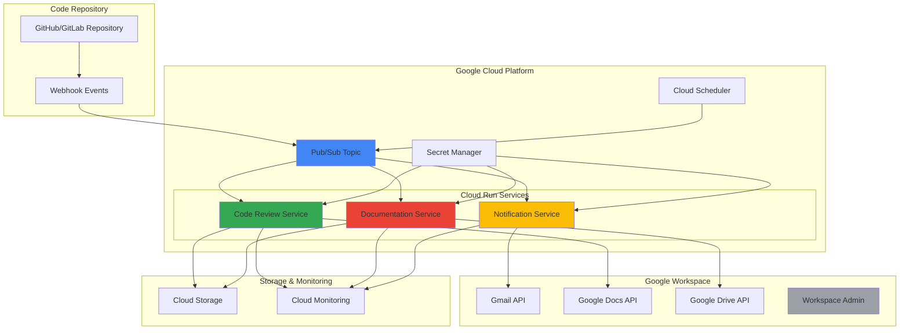

# Code Review and Documentation Workflows with Google Workspace APIs and Cloud Run

## Problem

Development teams struggle with manual code review processes and documentation maintenance that creates bottlenecks in their release cycles. Code reviews often lack consistency, team members miss important notifications, and project documentation becomes outdated quickly. Without automated integration between development tools and collaboration platforms, teams spend excessive time on administrative tasks instead of building features, leading to decreased productivity and inconsistent code quality standards across projects.

## Solution

Build an intelligent automation system that integrates Google Workspace APIs with Cloud Run services to automatically generate code review summaries, update project documentation in Google Docs, and send targeted notifications via Gmail. This serverless solution uses Pub/Sub for event-driven processing and Cloud Scheduler for periodic maintenance tasks, creating a comprehensive workflow that bridges development and collaboration tools while maintaining team productivity and code quality standards.

## Architecture Diagram



## Prerequisites

1. Google Cloud Project with billing enabled and appropriate IAM permissions for Cloud Run, Pub/Sub, Cloud Scheduler, and Secret Manager
2. Google Cloud CLI installed and configured (or Cloud Shell access)
3. Google Workspace account with admin privileges for API access and service account setup
4. Basic understanding of REST APIs, serverless architecture, and OAuth 2.0 authentication flows
5. Code repository with webhook capability (GitHub, GitLab, or Bitbucket)
6. Estimated cost: $15-30/month for moderate usage (Cloud Run requests, Pub/Sub messages, storage)

> **Note**: This recipe requires Google Workspace APIs access which may require Google Workspace Business or Enterprise plans depending on your organization's setup.

## Preparation

```bash
# Set environment variables for GCP resources
export PROJECT_ID="code-review-automation-$(date +%s)"
export REGION="us-central1"
export ZONE="us-central1-a"

# Generate unique suffix for resource names
RANDOM_SUFFIX=$(openssl rand -hex 3)
export SERVICE_NAME="code-review-${RANDOM_SUFFIX}"
export TOPIC_NAME="code-events-${RANDOM_SUFFIX}"
export SUBSCRIPTION_NAME="code-processing-${RANDOM_SUFFIX}"
export BUCKET_NAME="code-artifacts-${RANDOM_SUFFIX}"

# Set default project and region
gcloud config set project ${PROJECT_ID}
gcloud config set compute/region ${REGION}
gcloud config set compute/zone ${ZONE}

# Enable required APIs for Google Cloud services
gcloud services enable run.googleapis.com \
    pubsub.googleapis.com \
    cloudscheduler.googleapis.com \
    secretmanager.googleapis.com \
    storage.googleapis.com \
    monitoring.googleapis.com

# Enable Google Workspace APIs
gcloud services enable gmail.googleapis.com \
    docs.googleapis.com \
    drive.googleapis.com \
    admin.googleapis.com

echo "✅ Project configured: ${PROJECT_ID}"
echo "✅ APIs enabled successfully"
```

## Steps

1. **Create Pub/Sub Topic and Subscription for Event Processing**:

   Pub/Sub provides reliable, scalable messaging for event-driven architectures. Creating a topic and subscription establishes the communication backbone between webhook events and Cloud Run services. This asynchronous messaging pattern ensures code review events are processed reliably even during traffic spikes, while the subscription mechanism enables multiple services to process the same events independently.

   ```bash
   # Create Pub/Sub topic for code review events
   gcloud pubsub topics create ${TOPIC_NAME}
   
   # Create subscription for Cloud Run service
   gcloud pubsub subscriptions create ${SUBSCRIPTION_NAME} \
       --topic ${TOPIC_NAME} \
       --ack-deadline 600 \
       --message-retention-duration 7d
   
   echo "✅ Pub/Sub topic and subscription created"
   ```

   The Pub/Sub infrastructure now handles event routing with 7-day message retention and a 10-minute acknowledgment deadline, providing resilience for processing code review events and enabling reliable workflow orchestration across distributed services.

2. **Create Cloud Storage Bucket for Artifacts and Logs**:

   Cloud Storage provides durable object storage for code review artifacts, generated documentation, and workflow logs. Setting up a bucket with appropriate lifecycle policies ensures efficient storage management while maintaining historical data for audit trails and debugging purposes.

   ```bash
   # Create Cloud Storage bucket for artifacts
   gsutil mb -p ${PROJECT_ID} \
       -c STANDARD \
       -l ${REGION} \
       gs://${BUCKET_NAME}
   
   # Set lifecycle policy for cost optimization
   cat > lifecycle.json << EOF
   {
     "rule": [
       {
         "action": {"type": "SetStorageClass", "storageClass": "NEARLINE"},
         "condition": {"age": 30}
       },
       {
         "action": {"type": "Delete"},
         "condition": {"age": 365}
       }
     ]
   }
   EOF
   
   gsutil lifecycle set lifecycle.json gs://${BUCKET_NAME}
   
   echo "✅ Cloud Storage bucket created with lifecycle policy"
   ```

   The storage bucket now automatically transitions objects to cost-effective storage classes after 30 days and deletes them after one year, balancing accessibility requirements with cost optimization for long-term artifact retention.

3. **Configure Google Workspace Service Account and API Access**:

   Google Workspace APIs require service account authentication with domain-wide delegation for accessing organizational resources. This step creates the necessary credentials and permissions for automated access to Gmail, Google Docs, and Drive APIs, enabling the Cloud Run services to interact with Workspace resources on behalf of users.

   ```bash
   # Create service account for Google Workspace APIs
   gcloud iam service-accounts create workspace-automation \
       --display-name "Workspace Automation Service Account" \
       --description "Service account for automated code review workflows"
   
   # Generate service account key
   gcloud iam service-accounts keys create workspace-key.json \
       --iam-account workspace-automation@${PROJECT_ID}.iam.gserviceaccount.com
   
   # Store service account key in Secret Manager
   gcloud secrets create workspace-credentials \
       --data-file workspace-key.json
   
   # Grant necessary IAM roles
   gcloud projects add-iam-policy-binding ${PROJECT_ID} \
       --member "serviceAccount:workspace-automation@${PROJECT_ID}.iam.gserviceaccount.com" \
       --role "roles/secretmanager.secretAccessor"
   
   gcloud projects add-iam-policy-binding ${PROJECT_ID} \
       --member "serviceAccount:workspace-automation@${PROJECT_ID}.iam.gserviceaccount.com" \
       --role "roles/storage.objectAdmin"
   
   echo "✅ Service account configured for Workspace APIs"
   ```

   The service account now has secure access to Google Workspace APIs through Secret Manager, following the principle of least privilege while enabling automated document generation and email notifications.

4. **Deploy Code Review Analysis Cloud Run Service**:

   Cloud Run provides serverless container hosting that automatically scales based on request volume. Deploying the code review service creates an HTTP endpoint that processes webhook events, analyzes code changes, and generates comprehensive review summaries using AI-powered analysis capabilities integrated with Google Workspace documentation tools.

   ```bash
   # Create application directory structure
   mkdir -p code-review-service
   cd code-review-service
   
   # Create main application file
   cat > main.py << 'EOF'
   import os
   import json
   import logging
   from flask import Flask, request, jsonify
   from google.cloud import secretmanager
   from google.cloud import storage
   from google.cloud import pubsub_v1
   from googleapiclient.discovery import build
   from google.oauth2 import service_account
   import requests
   from datetime import datetime
   
   app = Flask(__name__)
   logging.basicConfig(level=logging.INFO)
   
   # Initialize Google Cloud clients
   secret_client = secretmanager.SecretManagerServiceClient()
   storage_client = storage.Client()
   publisher = pubsub_v1.PublisherClient()
   
   def get_workspace_credentials():
       """Retrieve Google Workspace credentials from Secret Manager"""
       project_id = os.environ.get('GOOGLE_CLOUD_PROJECT')
       secret_name = f"projects/{project_id}/secrets/workspace-credentials/versions/latest"
       response = secret_client.access_secret_version(request={"name": secret_name})
       credentials_info = json.loads(response.payload.data.decode('UTF-8'))
       credentials = service_account.Credentials.from_service_account_info(
           credentials_info,
           scopes=['https://www.googleapis.com/auth/documents',
                   'https://www.googleapis.com/auth/drive',
                   'https://www.googleapis.com/auth/gmail.send']
       )
       return credentials
   
   def analyze_code_changes(payload):
       """Analyze code changes and generate review summary"""
       changes = payload.get('commits', [])
       analysis = {
           'total_commits': len(changes),
           'files_changed': set(),
           'lines_added': 0,
           'lines_removed': 0,
           'review_summary': [],
           'quality_metrics': {}
       }
       
       for commit in changes:
           if 'added' in commit:
               analysis['files_changed'].update(commit['added'])
               analysis['lines_added'] += len(commit.get('added', []))
           if 'removed' in commit:
               analysis['files_changed'].update(commit['removed'])
               analysis['lines_removed'] += len(commit.get('removed', []))
       
       analysis['files_changed'] = list(analysis['files_changed'])
       
       # Generate quality metrics
       analysis['quality_metrics'] = {
           'complexity_score': min(len(analysis['files_changed']) * 2, 100),
           'test_coverage_impact': 'Medium' if analysis['lines_added'] > 50 else 'Low',
           'documentation_needed': len(analysis['files_changed']) > 5
       }
       
       return analysis
   
   def create_review_document(analysis, project_name):
       """Create Google Doc with code review summary"""
       try:
           credentials = get_workspace_credentials()
           docs_service = build('docs', 'v1', credentials=credentials)
           
           # Create new document
           doc = docs_service.documents().create(body={
               'title': f'Code Review Summary - {project_name} - {datetime.now().strftime("%Y-%m-%d")}'
           }).execute()
           
           doc_id = doc['documentId']
           
           # Add content to document
           content = f"""
   # Code Review Summary
   
   **Project:** {project_name}
   **Date:** {datetime.now().strftime("%Y-%m-%d %H:%M:%S")}
   **Total Commits:** {analysis['total_commits']}
   **Files Changed:** {len(analysis['files_changed'])}
   **Lines Added:** {analysis['lines_added']}
   **Lines Removed:** {analysis['lines_removed']}
   
   ## Quality Metrics
   **Complexity Score:** {analysis['quality_metrics']['complexity_score']}/100
   **Test Coverage Impact:** {analysis['quality_metrics']['test_coverage_impact']}
   **Documentation Update Needed:** {'Yes' if analysis['quality_metrics']['documentation_needed'] else 'No'}
   
   ## Files Modified
   {chr(10).join(f"- {file}" for file in analysis['files_changed'][:10])}
   
   ## Recommendations
   - Review test coverage for modified components
   - Update technical documentation if architectural changes were made
   - Consider code review checklist for complex changes
   """
           
           # Insert content into document
           requests_body = [
               {
                   'insertText': {
                       'location': {'index': 1},
                       'text': content
                   }
               }
           ]
           
           docs_service.documents().batchUpdate(
               documentId=doc_id,
               body={'requests': requests_body}
           ).execute()
           
           return doc_id
           
       except Exception as e:
           logging.error(f"Error creating review document: {str(e)}")
           return None
   
   @app.route('/webhook', methods=['POST'])
   def handle_webhook():
       """Process code repository webhook events"""
       try:
           payload = request.get_json()
           
           if not payload:
               return jsonify({'error': 'No payload received'}), 400
           
           # Analyze code changes
           analysis = analyze_code_changes(payload)
           
           # Create review document
           project_name = payload.get('repository', {}).get('name', 'Unknown Project')
           doc_id = create_review_document(analysis, project_name)
           
           # Store analysis results
           bucket_name = os.environ.get('BUCKET_NAME')
           if bucket_name:
               bucket = storage_client.bucket(bucket_name)
               blob = bucket.blob(f"reviews/{datetime.now().strftime('%Y/%m/%d')}/{project_name}-analysis.json")
               blob.upload_from_string(json.dumps(analysis, indent=2))
           
           # Publish event for notification service
           topic_name = os.environ.get('TOPIC_NAME')
           if topic_name and doc_id:
               topic_path = publisher.topic_path(os.environ.get('GOOGLE_CLOUD_PROJECT'), topic_name)
               notification_data = {
                   'type': 'review_completed',
                   'project': project_name,
                   'doc_id': doc_id,
                   'analysis': analysis
               }
               publisher.publish(topic_path, json.dumps(notification_data).encode('utf-8'))
           
           return jsonify({
               'status': 'success',
               'doc_id': doc_id,
               'analysis_summary': analysis
           })
           
       except Exception as e:
           logging.error(f"Error processing webhook: {str(e)}")
           return jsonify({'error': 'Internal server error'}), 500
   
   @app.route('/health', methods=['GET'])
   def health_check():
       return jsonify({'status': 'healthy'})
   
   if __name__ == '__main__':
       app.run(host='0.0.0.0', port=int(os.environ.get('PORT', 8080)))
   EOF
   
   # Create requirements file with current versions
   cat > requirements.txt << 'EOF'
   flask==3.0.0
   google-cloud-secret-manager==2.18.1
   google-cloud-storage==2.12.0
   google-cloud-pubsub==2.19.0
   google-api-python-client==2.109.0
   google-auth==2.24.0
   google-auth-oauthlib==1.1.0
   google-auth-httplib2==0.2.0
   requests==2.31.0
   EOF
   
   # Create Dockerfile
   cat > Dockerfile << 'EOF'
   FROM python:3.11-slim
   
   WORKDIR /app
   COPY requirements.txt .
   RUN pip install --no-cache-dir -r requirements.txt
   
   COPY . .
   
   EXPOSE 8080
   CMD ["python", "main.py"]
   EOF
   
   # Deploy to Cloud Run
   gcloud run deploy ${SERVICE_NAME} \
       --source . \
       --platform managed \
       --region ${REGION} \
       --allow-unauthenticated \
       --set-env-vars BUCKET_NAME=${BUCKET_NAME},TOPIC_NAME=${TOPIC_NAME} \
       --memory 1Gi \
       --cpu 1 \
       --timeout 300 \
       --max-instances 10
   
   cd ..
   echo "✅ Code review service deployed to Cloud Run"
   ```

   The Cloud Run service now provides automatic code analysis capabilities with intelligent scaling, processing webhook events and generating comprehensive review documentation that integrates seamlessly with Google Workspace collaboration tools.

5. **Deploy Documentation Update Service**:

   The documentation service monitors for project changes and automatically updates technical documentation in Google Docs. This service ensures project documentation stays current with code changes, reducing maintenance overhead while improving knowledge sharing across development teams through automated content generation and version control integration.

   ```bash
   # Create documentation service
   mkdir -p docs-service
   cd docs-service
   
   # Create documentation service application
   cat > main.py << 'EOF'
   import os
   import json
   import logging
   from flask import Flask, request, jsonify
   from google.cloud import pubsub_v1
   from google.cloud import secretmanager
   from google.cloud import storage
   from googleapiclient.discovery import build
   from google.oauth2 import service_account
   from datetime import datetime
   
   app = Flask(__name__)
   logging.basicConfig(level=logging.INFO)
   
   # Initialize clients
   secret_client = secretmanager.SecretManagerServiceClient()
   storage_client = storage.Client()
   subscriber = pubsub_v1.SubscriberClient()
   
   def get_workspace_credentials():
       """Get Google Workspace API credentials"""
       project_id = os.environ.get('GOOGLE_CLOUD_PROJECT')
       secret_name = f"projects/{project_id}/secrets/workspace-credentials/versions/latest"
       response = secret_client.access_secret_version(request={"name": secret_name})
       credentials_info = json.loads(response.payload.data.decode('UTF-8'))
       credentials = service_account.Credentials.from_service_account_info(
           credentials_info,
           scopes=['https://www.googleapis.com/auth/documents',
                   'https://www.googleapis.com/auth/drive']
       )
       return credentials
   
   def find_project_documentation(project_name):
       """Find existing project documentation in Google Drive"""
       try:
           credentials = get_workspace_credentials()
           drive_service = build('drive', 'v3', credentials=credentials)
           
           # Search for existing documentation
           query = f"name contains '{project_name}' and mimeType='application/vnd.google-apps.document'"
           results = drive_service.files().list(q=query, pageSize=10).execute()
           files = results.get('files', [])
           
           if files:
               return files[0]['id']
           else:
               # Create new documentation
               docs_service = build('docs', 'v1', credentials=credentials)
               doc = docs_service.documents().create(body={
                   'title': f'{project_name} - Technical Documentation'
               }).execute()
               return doc['documentId']
               
       except Exception as e:
           logging.error(f"Error finding documentation: {str(e)}")
           return None
   
   def update_documentation(doc_id, analysis_data):
       """Update project documentation with latest changes"""
       try:
           credentials = get_workspace_credentials()
           docs_service = build('docs', 'v1', credentials=credentials)
           
           # Get current document content
           doc = docs_service.documents().get(documentId=doc_id).execute()
           doc_content = doc.get('body', {}).get('content', [])
           
           # Find insertion point or append
           insertion_index = 1
           for element in doc_content:
               if 'paragraph' in element:
                   insertion_index = element['endIndex']
           
           # Create update content
           update_content = f"""

   ## Latest Changes - {datetime.now().strftime("%Y-%m-%d")}
   
   **Files Modified:** {len(analysis_data.get('files_changed', []))}
   **Complexity Score:** {analysis_data.get('quality_metrics', {}).get('complexity_score', 'N/A')}
   **Documentation Review Required:** {'Yes' if analysis_data.get('quality_metrics', {}).get('documentation_needed', False) else 'No'}
   
   ### Recent File Changes:
   {chr(10).join(f"- {file}" for file in analysis_data.get('files_changed', [])[:5])}
   
   """
           
           # Update document
           requests_body = [
               {
                   'insertText': {
                       'location': {'index': insertion_index},
                       'text': update_content
                   }
               }
           ]
           
           docs_service.documents().batchUpdate(
               documentId=doc_id,
               body={'requests': requests_body}
           ).execute()
           
           return True
           
       except Exception as e:
           logging.error(f"Error updating documentation: {str(e)}")
           return False
   
   @app.route('/update-docs', methods=['POST'])
   def handle_documentation_update():
       """Handle documentation update requests"""
       try:
           data = request.get_json()
           project_name = data.get('project', 'Unknown')
           analysis_data = data.get('analysis', {})
           
           # Find or create documentation
           doc_id = find_project_documentation(project_name)
           
           if doc_id:
               success = update_documentation(doc_id, analysis_data)
               if success:
                   return jsonify({
                       'status': 'success',
                       'doc_id': doc_id,
                       'message': 'Documentation updated successfully'
                   })
           
           return jsonify({'error': 'Failed to update documentation'}), 500
           
       except Exception as e:
           logging.error(f"Error handling documentation update: {str(e)}")
           return jsonify({'error': 'Internal server error'}), 500
   
   @app.route('/health', methods=['GET'])
   def health_check():
       return jsonify({'status': 'healthy'})
   
   if __name__ == '__main__':
       app.run(host='0.0.0.0', port=int(os.environ.get('PORT', 8080)))
   EOF
   
   # Copy requirements and Dockerfile
   cp ../code-review-service/requirements.txt .
   cp ../code-review-service/Dockerfile .
   
   # Deploy documentation service
   gcloud run deploy docs-service-${RANDOM_SUFFIX} \
       --source . \
       --platform managed \
       --region ${REGION} \
       --allow-unauthenticated \
       --set-env-vars BUCKET_NAME=${BUCKET_NAME} \
       --memory 512Mi \
       --cpu 1 \
       --timeout 300 \
       --max-instances 5
   
   cd ..
   echo "✅ Documentation service deployed to Cloud Run"
   ```

   The documentation service now automatically maintains project documentation consistency by tracking code changes and updating technical specifications, ensuring teams have access to current information without manual intervention.

6. **Deploy Email Notification Service**:

   The notification service sends intelligent email alerts to team members when code quality metrics change or important milestones are reached. Using Gmail API integration, this service provides customizable notification templates and delivery rules that help teams stay informed about project progress without overwhelming communication channels.

   ```bash
   # Create notification service
   mkdir -p notification-service
   cd notification-service
   
   # Create notification service application
   cat > main.py << 'EOF'
   import os
   import json
   import logging
   from flask import Flask, request, jsonify
   from google.cloud import secretmanager
   from google.cloud import pubsub_v1
   from googleapiclient.discovery import build
   from google.oauth2 import service_account
   import base64
   from email.mime.text import MIMEText
   from email.mime.multipart import MIMEMultipart
   from datetime import datetime
   
   app = Flask(__name__)
   logging.basicConfig(level=logging.INFO)
   
   # Initialize clients
   secret_client = secretmanager.SecretManagerServiceClient()
   subscriber = pubsub_v1.SubscriberClient()
   
   def get_workspace_credentials():
       """Get Google Workspace API credentials"""
       project_id = os.environ.get('GOOGLE_CLOUD_PROJECT')
       secret_name = f"projects/{project_id}/secrets/workspace-credentials/versions/latest"
       response = secret_client.access_secret_version(request={"name": secret_name})
       credentials_info = json.loads(response.payload.data.decode('UTF-8'))
       credentials = service_account.Credentials.from_service_account_info(
           credentials_info,
           scopes=['https://www.googleapis.com/auth/gmail.send']
       )
       return credentials
   
   def create_email_message(to, subject, body_text, body_html=None):
       """Create email message"""
       message = MIMEMultipart('alternative')
       message['to'] = to
       message['subject'] = subject
       
       # Add text part
       text_part = MIMEText(body_text, 'plain')
       message.attach(text_part)
       
       # Add HTML part if provided
       if body_html:
           html_part = MIMEText(body_html, 'html')
           message.attach(html_part)
       
       return {'raw': base64.urlsafe_b64encode(message.as_bytes()).decode()}
   
   def send_notification_email(recipients, project_name, doc_id, analysis):
       """Send notification email to team members"""
       try:
           credentials = get_workspace_credentials()
           gmail_service = build('gmail', 'v1', credentials=credentials)
           
           subject = f"Code Review Complete: {project_name}"
           
           # Create email content
           text_body = f"""
   Code Review Summary for {project_name}
   
   A new code review has been completed and documentation has been updated.
   
   Summary:
   - Total Commits: {analysis.get('total_commits', 0)}
   - Files Changed: {len(analysis.get('files_changed', []))}
   - Complexity Score: {analysis.get('quality_metrics', {}).get('complexity_score', 'N/A')}/100
   
   View the complete review document: https://docs.google.com/document/d/{doc_id}
   
   This is an automated message from the Code Review Automation System.
   """
           
           html_body = f"""
   <html>
   <body>
   <h2>Code Review Summary for {project_name}</h2>
   
   <p>A new code review has been completed and documentation has been updated.</p>
   
   <h3>Summary:</h3>
   <ul>
   <li><strong>Total Commits:</strong> {analysis.get('total_commits', 0)}</li>
   <li><strong>Files Changed:</strong> {len(analysis.get('files_changed', []))}</li>
   <li><strong>Complexity Score:</strong> {analysis.get('quality_metrics', {}).get('complexity_score', 'N/A')}/100</li>
   </ul>
   
   <p><a href="https://docs.google.com/document/d/{doc_id}">View the complete review document</a></p>
   
   <p><em>This is an automated message from the Code Review Automation System.</em></p>
   </body>
   </html>
   """
           
           # Send to each recipient
           for recipient in recipients:
               message = create_email_message(recipient, subject, text_body, html_body)
               
               gmail_service.users().messages().send(
                   userId='me',
                   body=message
               ).execute()
               
           return True
           
       except Exception as e:
           logging.error(f"Error sending notification email: {str(e)}")
           return False
   
   @app.route('/send-notification', methods=['POST'])
   def handle_notification():
       """Handle notification requests"""
       try:
           data = request.get_json()
           
           # Extract notification data
           project_name = data.get('project', 'Unknown Project')
           doc_id = data.get('doc_id')
           analysis = data.get('analysis', {})
           recipients = data.get('recipients', ['admin@example.com'])  # Default recipient
           
           if not doc_id:
               return jsonify({'error': 'Document ID required'}), 400
           
           # Send notification
           success = send_notification_email(recipients, project_name, doc_id, analysis)
           
           if success:
               return jsonify({
                   'status': 'success',
                   'message': f'Notifications sent to {len(recipients)} recipients'
               })
           else:
               return jsonify({'error': 'Failed to send notifications'}), 500
           
       except Exception as e:
           logging.error(f"Error handling notification: {str(e)}")
           return jsonify({'error': 'Internal server error'}), 500
   
   @app.route('/health', methods=['GET'])
   def health_check():
       return jsonify({'status': 'healthy'})
   
   if __name__ == '__main__':
       app.run(host='0.0.0.0', port=int(os.environ.get('PORT', 8080)))
   EOF
   
   # Copy requirements and Dockerfile
   cp ../code-review-service/requirements.txt .
   cp ../code-review-service/Dockerfile .
   
   # Deploy notification service
   gcloud run deploy notification-service-${RANDOM_SUFFIX} \
       --source . \
       --platform managed \
       --region ${REGION} \
       --allow-unauthenticated \
       --memory 512Mi \
       --cpu 1 \
       --timeout 180 \
       --max-instances 5
   
   cd ..
   echo "✅ Notification service deployed to Cloud Run"
   ```

   The notification service now provides intelligent email delivery with HTML formatting and automated team communication, ensuring stakeholders receive timely updates about code review completion and documentation changes.

7. **Configure Cloud Scheduler for Periodic Maintenance**:

   Cloud Scheduler enables automated maintenance tasks that keep the workflow system optimized and up-to-date. Setting up scheduled jobs for cleanup operations, metric aggregation, and periodic health checks ensures the automation system continues operating efficiently while managing resource costs and maintaining data integrity.

   ```bash
   # Create scheduled job for weekly documentation review
   gcloud scheduler jobs create http weekly-doc-review \
       --location ${REGION} \
       --schedule "0 9 * * 1" \
       --uri "https://docs-service-${RANDOM_SUFFIX}-uc.a.run.app/health" \
       --http-method GET \
       --description "Weekly documentation review trigger"
   
   # Create scheduled job for monthly cleanup
   gcloud scheduler jobs create http monthly-cleanup \
       --location ${REGION} \
       --schedule "0 2 1 * *" \
       --uri "https://${SERVICE_NAME}-uc.a.run.app/health" \
       --http-method GET \
       --description "Monthly cleanup and maintenance"
   
   # Create Pub/Sub message for maintenance tasks
   gcloud scheduler jobs create pubsub maintenance-trigger \
       --location ${REGION} \
       --schedule "0 3 * * 0" \
       --topic ${TOPIC_NAME} \
       --message-body '{"type":"maintenance","action":"weekly_summary"}' \
       --description "Weekly maintenance trigger"
   
   echo "✅ Cloud Scheduler jobs configured"
   ```

   The scheduled maintenance jobs now ensure consistent system performance through automated cleanup tasks, documentation reviews, and health monitoring, maintaining optimal operation without manual intervention.

8. **Set Up Monitoring and Alerting**:

   Cloud Monitoring provides comprehensive observability for the automation workflow, tracking service performance, error rates, and business metrics. Configuring alerts and dashboards ensures proactive issue detection and provides insights into system usage patterns, enabling continuous optimization of the code review automation process.

   ```bash
   # Create monitoring dashboard configuration
   cat > dashboard-config.json << 'EOF'
   {
     "displayName": "Code Review Automation Dashboard",
     "mosaicLayout": {
       "tiles": [
         {
           "width": 6,
           "height": 4,
           "widget": {
             "title": "Cloud Run Request Count",
             "xyChart": {
               "dataSets": [
                 {
                   "timeSeriesQuery": {
                     "timeSeriesFilter": {
                       "filter": "resource.type=\"cloud_run_revision\"",
                       "aggregation": {
                         "alignmentPeriod": "60s",
                         "perSeriesAligner": "ALIGN_RATE"
                       }
                     }
                   }
                 }
               ]
             }
           }
         }
       ]
     }
   }
   EOF
   
   # Create monitoring dashboard
   gcloud monitoring dashboards create --config-from-file dashboard-config.json
   
   # Create alerting policy for service errors
   cat > alert-policy.json << 'EOF'
   {
     "displayName": "Code Review Service Errors",
     "conditions": [
       {
         "displayName": "Cloud Run Error Rate",
         "conditionThreshold": {
           "filter": "resource.type=\"cloud_run_revision\"",
           "comparison": "COMPARISON_GREATER_THAN",
           "thresholdValue": 0.1,
           "duration": "300s",
           "aggregations": [
             {
               "alignmentPeriod": "60s",
               "perSeriesAligner": "ALIGN_RATE"
             }
           ]
         }
       }
     ],
     "alertStrategy": {
       "autoClose": "1800s"
     },
     "enabled": true
   }
   EOF
   
   gcloud alpha monitoring policies create --policy-from-file alert-policy.json
   
   echo "✅ Monitoring and alerting configured"
   ```

   The monitoring system now provides real-time visibility into workflow performance with automated alerts for service errors, enabling proactive maintenance and ensuring reliable code review automation operations.

## Validation & Testing

1. **Verify All Services Are Running**:

   ```bash
   # Check Cloud Run services status
   gcloud run services list --region ${REGION} \
       --format="table(metadata.name,status.url,status.conditions[0].type)"
   
   # Test service health endpoints
   SERVICE_URL=$(gcloud run services describe ${SERVICE_NAME} \
       --region ${REGION} \
       --format="value(status.url)")
   curl -f "${SERVICE_URL}/health"
   ```

   Expected output: All services should return `{"status": "healthy"}` responses.

2. **Test Webhook Processing**:

   ```bash
   # Send test webhook payload
   cat > test-payload.json << 'EOF'
   {
     "repository": {
       "name": "test-project"
     },
     "commits": [
       {
         "added": ["src/main.py", "tests/test_main.py"],
         "removed": ["legacy/old_file.py"]
       }
     ]
   }
   EOF
   
   curl -X POST "${SERVICE_URL}/webhook" \
        -H "Content-Type: application/json" \
        -d @test-payload.json
   ```

   Expected output: JSON response with document ID and analysis summary.

3. **Verify Google Workspace Integration**:

   ```bash
   # Check Secret Manager access
   gcloud secrets versions access latest \
       --secret="workspace-credentials" > /dev/null
   echo $? # Should return 0 for success
   
   # Verify Cloud Storage artifacts
   gsutil ls gs://${BUCKET_NAME}/reviews/
   ```

   Expected output: Secret access succeeds and storage bucket contains review artifacts.

4. **Test Pub/Sub Message Flow**:

   ```bash
   # Publish test message
   gcloud pubsub topics publish ${TOPIC_NAME} \
       --message='{"type":"test","project":"validation-test"}'
   
   # Check subscription metrics
   gcloud pubsub subscriptions describe ${SUBSCRIPTION_NAME}
   ```

   Expected output: Message published successfully and subscription shows activity.

## Cleanup

1. **Remove Cloud Scheduler Jobs**:

   ```bash
   # Delete scheduled jobs
   gcloud scheduler jobs delete weekly-doc-review \
       --location ${REGION} \
       --quiet
   
   gcloud scheduler jobs delete monthly-cleanup \
       --location ${REGION} \
       --quiet
   
   gcloud scheduler jobs delete maintenance-trigger \
       --location ${REGION} \
       --quiet
   
   echo "✅ Scheduler jobs deleted"
   ```

2. **Remove Cloud Run Services**:

   ```bash
   # Delete Cloud Run services
   gcloud run services delete ${SERVICE_NAME} \
       --region ${REGION} \
       --quiet
   
   gcloud run services delete docs-service-${RANDOM_SUFFIX} \
       --region ${REGION} \
       --quiet
   
   gcloud run services delete notification-service-${RANDOM_SUFFIX} \
       --region ${REGION} \
       --quiet
   
   echo "✅ Cloud Run services deleted"
   ```

3. **Remove Pub/Sub Resources**:

   ```bash
   # Delete Pub/Sub subscription and topic
   gcloud pubsub subscriptions delete ${SUBSCRIPTION_NAME} --quiet
   gcloud pubsub topics delete ${TOPIC_NAME} --quiet
   
   echo "✅ Pub/Sub resources deleted"
   ```

4. **Remove Storage and Secrets**:

   ```bash
   # Delete Cloud Storage bucket and contents
   gsutil -m rm -r gs://${BUCKET_NAME}
   
   # Delete Secret Manager secret
   gcloud secrets delete workspace-credentials --quiet
   
   # Delete service account
   gcloud iam service-accounts delete \
       workspace-automation@${PROJECT_ID}.iam.gserviceaccount.com \
       --quiet
   
   echo "✅ Storage and secrets cleaned up"
   ```

5. **Remove Project Resources**:

   ```bash
   # Clean up local files
   rm -rf code-review-service docs-service notification-service
   rm -f lifecycle.json workspace-key.json test-payload.json
   rm -f dashboard-config.json alert-policy.json
   
   # Optionally delete the entire project
   echo "To delete the entire project, run:"
   echo "gcloud projects delete ${PROJECT_ID}"
   
   echo "✅ Cleanup completed successfully"
   ```

## Discussion

This automation workflow demonstrates the power of combining Google Workspace APIs with Cloud Run's serverless architecture to create intelligent development process automation. The solution addresses common DevOps challenges by bridging the gap between code repositories and collaboration tools, ensuring that code review insights automatically flow into documentation and team communications. The serverless approach using Cloud Run provides cost-effective scaling, only charging for actual usage while maintaining high availability for webhook processing and document generation.

The architecture follows Google Cloud's Well-Architected Framework principles by implementing robust error handling, comprehensive monitoring, and secure credential management through Secret Manager. The use of Pub/Sub for event-driven processing ensures reliable message delivery and enables loose coupling between services, allowing each component to scale independently based on workload demands. This design pattern is particularly effective for DevOps automation because it can handle varying code review frequencies and team sizes without manual infrastructure adjustments.

The integration with Google Workspace APIs provides significant value by leveraging familiar collaboration tools that teams already use daily. Rather than introducing new platforms, this solution enhances existing workflows by automatically populating Google Docs with structured code review data and sending targeted Gmail notifications based on configurable criteria. The analysis capabilities can be extended with additional intelligence layers, such as integration with Google Cloud's Vertex AI for more sophisticated code quality assessment and natural language generation for review summaries.

Security considerations are paramount in this implementation, with service accounts following the principle of least privilege and sensitive credentials stored securely in Secret Manager. The solution supports enterprise requirements through Google Workspace's administrative controls and audit logging, enabling organizations to maintain compliance while automating routine development processes. For organizations requiring enhanced security, the architecture can be extended with VPC Service Controls and additional encryption layers. For more details on Google Cloud security best practices, see the [Google Cloud Security Documentation](https://cloud.google.com/security/best-practices).

> **Tip**: Monitor the webhook processing latency through Cloud Monitoring to optimize the balance between document generation quality and response time, adjusting Cloud Run memory allocation and timeout settings based on actual usage patterns.

## Challenge

Extend this automation solution by implementing these advanced capabilities:

1. **Intelligent Code Quality Scoring**: Integrate Vertex AI to analyze code complexity, security vulnerabilities, and adherence to coding standards, automatically generating quality scores and improvement recommendations in the review documents.

2. **Multi-Repository Dashboard**: Create a consolidated Google Sheets dashboard that aggregates code review metrics across multiple repositories, using the Sheets API to provide executive-level insights into development velocity and quality trends.

3. **Slack Integration with Interactive Elements**: Add Cloud Functions triggered by Pub/Sub messages to send interactive Slack notifications with approval buttons, allowing team leads to approve or request changes directly from Slack messages that update the corresponding Google Docs.

4. **Automated Test Coverage Analysis**: Implement integration with code coverage tools to automatically update documentation with test coverage metrics and identify areas requiring additional testing, using Cloud Build triggers to analyze test results and update project documentation accordingly.

5. **Compliance and Audit Automation**: Build an audit trail system that automatically generates compliance reports in Google Docs for code changes affecting security-critical components, integrating with Cloud Security Command Center for comprehensive security posture tracking.

## Infrastructure Code

### Available Infrastructure as Code:

- [Infrastructure Code Overview](code/README.md) - Detailed description of all infrastructure components
- [Infrastructure Manager](code/infrastructure-manager/) - GCP Infrastructure Manager templates
- [Bash CLI Scripts](code/scripts/) - Example bash scripts using gcloud CLI commands to deploy infrastructure
- [Terraform](code/terraform/) - Terraform configuration files