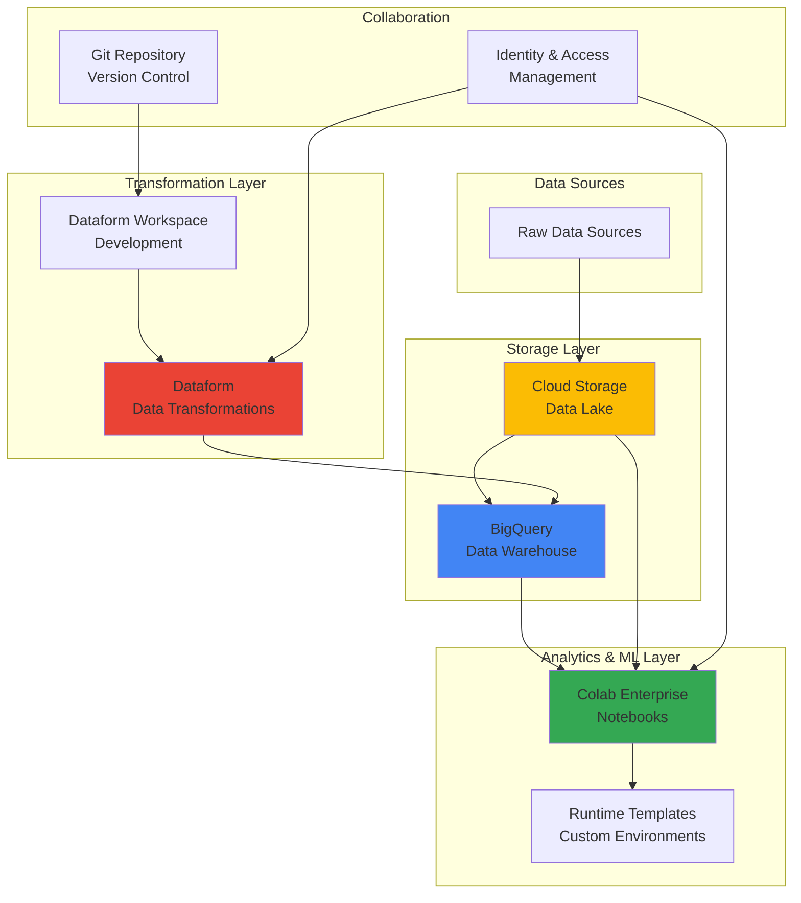

# Collaborative Data Science Workflows with Colab Enterprise and Dataform

## Problem

Data science teams often struggle with fragmented workflows where data preparation, model development, and deployment happen in isolated environments. Teams face challenges coordinating between data engineers building transformation pipelines and data scientists developing models, leading to duplicated work, inconsistent data transformations, and difficulty reproducing results. Without proper collaboration tools and shared environments, organizations cannot effectively scale their data science initiatives or maintain quality standards across projects.

## Solution

This recipe creates an integrated collaborative data science workflow using Colab Enterprise for managed Jupyter notebooks, Dataform for version-controlled data transformations, BigQuery for scalable analytics, and Cloud Storage for artifact management. The solution enables teams to work together on shared datasets with reproducible transformations while maintaining proper version control and governance throughout the entire machine learning lifecycle.

## Architecture Diagram



## Prerequisites

1. Google Cloud project with billing enabled and appropriate IAM permissions
2. Enable required APIs: Vertex AI, BigQuery, Cloud Storage, Dataform
3. Basic knowledge of SQL, Python, and Jupyter notebooks
4. Understanding of data transformation concepts and version control with Git
5. Estimated cost: $50-100 for running this recipe with moderate data volumes

> **Note**: Colab Enterprise is part of Vertex AI and requires proper IAM roles for notebook creation and runtime management. Review [Colab Enterprise documentation](https://cloud.google.com/colab/docs/introduction) for detailed access requirements.

## Preparation

```bash
# Set environment variables for Google Cloud resources
export PROJECT_ID="data-science-workflow-$(date +%s)"
export REGION="us-central1"
export ZONE="us-central1-a"

# Generate unique suffix for resource names
RANDOM_SUFFIX=$(openssl rand -hex 3)
export BUCKET_NAME="ds-workflow-${RANDOM_SUFFIX}"
export DATASET_NAME="analytics_${RANDOM_SUFFIX}"
export REPOSITORY_NAME="dataform-repo-${RANDOM_SUFFIX}"

# Set default project and region
gcloud config set project ${PROJECT_ID}
gcloud config set compute/region ${REGION}
gcloud config set compute/zone ${ZONE}

# Enable required APIs
gcloud services enable compute.googleapis.com
gcloud services enable storage.googleapis.com
gcloud services enable bigquery.googleapis.com
gcloud services enable dataform.googleapis.com
gcloud services enable aiplatform.googleapis.com
gcloud services enable notebooks.googleapis.com

echo "✅ Project configured: ${PROJECT_ID}"
echo "✅ APIs enabled for data science workflow"
```

## Steps

1. **Create Cloud Storage Bucket for Data Lake**:

   Google Cloud Storage provides unified object storage with global edge caching and strong consistency guarantees. Creating a bucket with appropriate location and storage class settings establishes the foundation for a data lake architecture that can scale from gigabytes to exabytes while maintaining high performance and cost efficiency.

   ```bash
   # Create Cloud Storage bucket for raw data and model artifacts
   gsutil mb -p ${PROJECT_ID} \
       -c STANDARD \
       -l ${REGION} \
       gs://${BUCKET_NAME}
   
   # Enable versioning for data protection
   gsutil versioning set on gs://${BUCKET_NAME}
   
   # Create folder structure for organized data management
   gsutil -m cp /dev/null gs://${BUCKET_NAME}/raw-data/.keep
   gsutil -m cp /dev/null gs://${BUCKET_NAME}/processed-data/.keep
   gsutil -m cp /dev/null gs://${BUCKET_NAME}/model-artifacts/.keep
   
   echo "✅ Cloud Storage bucket created: gs://${BUCKET_NAME}"
   ```

   The storage bucket is now ready with versioning enabled, providing both scalability and data protection. This foundational component supports the entire data pipeline, from ingestion through analytics, while Google's global infrastructure ensures low-latency access from anywhere in the world.

2. **Create BigQuery Dataset for Analytics**:

   BigQuery serves as the central data warehouse for your collaborative workflow, providing serverless analytics capabilities that automatically scale to petabyte-level datasets. The dataset configuration includes proper access controls and regional data residency compliance.

   ```bash
   # Create BigQuery dataset with proper configuration
   bq mk --location=${REGION} \
       --description="Analytics dataset for collaborative data science" \
       ${PROJECT_ID}:${DATASET_NAME}
   
   # Create sample tables for demonstration
   bq mk --table \
       ${PROJECT_ID}:${DATASET_NAME}.customer_data \
       customer_id:STRING,name:STRING,email:STRING,signup_date:DATE
   
   bq mk --table \
       ${PROJECT_ID}:${DATASET_NAME}.transaction_data \
       transaction_id:STRING,customer_id:STRING,amount:FLOAT,transaction_date:TIMESTAMP
   
   echo "✅ BigQuery dataset created: ${DATASET_NAME}"
   ```

   The BigQuery dataset now provides a centralized location for storing and analyzing structured data. With automatic scaling and built-in ML capabilities, your data science team can perform complex analytics and machine learning directly within the data warehouse.

3. **Set Up Dataform Repository for Data Transformations**:

   Dataform enables SQL-based data transformation workflows with version control, dependency management, and automated testing. This creates a reliable, reproducible data pipeline that data engineers and scientists can collaborate on using familiar Git workflows.

   ```bash
   # Create Dataform repository
   gcloud dataform repositories create ${REPOSITORY_NAME} \
       --region=${REGION} \
       --project=${PROJECT_ID}
   
   # Wait for repository creation
   sleep 10
   
   # Verify repository creation
   gcloud dataform repositories describe ${REPOSITORY_NAME} \
       --region=${REGION} \
       --project=${PROJECT_ID}
   
   echo "✅ Dataform repository created: ${REPOSITORY_NAME}"
   ```

   The Dataform repository establishes version-controlled data transformation workflows. Teams can now develop, test, and deploy SQL-based transformations with proper dependency tracking and automated documentation generation.

4. **Create Dataform Workspace for Development**:

   Development workspaces in Dataform provide isolated environments where team members can experiment with data transformations without affecting production workflows. This enables safe collaboration and iterative development of complex data pipelines.

   ```bash
   # Create development workspace
   WORKSPACE_NAME="dev-workspace-${RANDOM_SUFFIX}"
   
   gcloud dataform workspaces create ${WORKSPACE_NAME} \
       --repository=${REPOSITORY_NAME} \
       --region=${REGION} \
       --project=${PROJECT_ID}
   
   # Store workspace details
   export WORKSPACE_NAME
   
   echo "✅ Dataform workspace created: ${WORKSPACE_NAME}"
   ```

   The development workspace provides an isolated environment for building and testing data transformations. Team members can now work on different features simultaneously without conflicts, using Git-based collaboration patterns.

5. **Configure Sample Data Transformation in Dataform**:

   Creating sample SQLX files demonstrates Dataform's capabilities for defining reusable data transformation logic with proper dependency management and documentation. These transformations serve as templates for more complex analytical workflows.

   ```bash
   # Create sample SQLX transformation file
   mkdir -p /tmp/dataform-config
   
   cat > /tmp/dataform-config/customer_analytics.sqlx << 'EOF'
   config {
     type: "table",
     description: "Customer analytics with transaction summaries",
     columns: {
       customer_id: "Unique customer identifier",
       total_transactions: "Count of customer transactions",
       total_amount: "Sum of transaction amounts",
       avg_transaction: "Average transaction amount",
       last_transaction_date: "Most recent transaction date"
     }
   }
   
   SELECT 
     c.customer_id,
     c.name,
     c.email,
     COUNT(t.transaction_id) as total_transactions,
     SUM(t.amount) as total_amount,
     AVG(t.amount) as avg_transaction,
     MAX(t.transaction_date) as last_transaction_date
   FROM ${ref("customer_data")} c
   LEFT JOIN ${ref("transaction_data")} t 
     ON c.customer_id = t.customer_id
   GROUP BY c.customer_id, c.name, c.email
   EOF
   
   echo "✅ Sample Dataform transformation created"
   ```

   The sample transformation demonstrates best practices for documenting data lineage and creating reusable analytical models. This foundation enables teams to build complex transformation pipelines with clear dependencies and automated testing.

6. **Create Colab Enterprise Runtime Template**:

   Runtime templates in Colab Enterprise define standardized computing environments with specific machine types, accelerators, and software packages. This ensures consistent, reproducible environments across all team members while enabling cost optimization through appropriate resource sizing.

   ```bash
   # Create custom runtime template for data science workloads
   TEMPLATE_NAME="ds-runtime-template-${RANDOM_SUFFIX}"
   
   gcloud colab runtime-templates create \
       --display-name="Data Science Runtime Template" \
       --description="Optimized runtime for collaborative data science workflows" \
       --region=${REGION} \
       --runtime-template-id=${TEMPLATE_NAME} \
       --machine-type=n1-standard-4 \
       --disk-size-gb=100 \
       --disk-type=PD_STANDARD \
       --idle-shutdown-timeout=3h
   
   export TEMPLATE_NAME
   echo "✅ Runtime template created: ${TEMPLATE_NAME}"
   ```

   The runtime template standardizes the computational environment for all team members, ensuring consistent Python versions, libraries, and system configurations. This eliminates environment-related issues and enables seamless collaboration across different team members' workflows.

7. **Create Sample Dataset and Load Data**:

   Loading sample data demonstrates the complete data flow from source systems through BigQuery to analytics workflows. This establishes realistic data patterns that teams can use for developing and testing their machine learning models.

   ```bash
   # Create sample customer data
   cat > /tmp/customer_data.csv << 'EOF'
   customer_id,name,email,signup_date
   CUST001,Alice Johnson,alice@example.com,2023-01-15
   CUST002,Bob Smith,bob@example.com,2023-02-20
   CUST003,Carol Davis,carol@example.com,2023-03-10
   CUST004,David Wilson,david@example.com,2023-04-05
   CUST005,Eve Brown,eve@example.com,2023-05-12
   EOF
   
   # Create sample transaction data
   cat > /tmp/transaction_data.csv << 'EOF'
   transaction_id,customer_id,amount,transaction_date
   TXN001,CUST001,150.50,2023-06-01 10:30:00
   TXN002,CUST002,89.99,2023-06-02 14:15:00
   TXN003,CUST001,200.00,2023-06-03 09:45:00
   TXN004,CUST003,75.25,2023-06-04 16:20:00
   TXN005,CUST002,120.75,2023-06-05 11:10:00
   TXN006,CUST004,95.50,2023-06-06 13:30:00
   TXN007,CUST005,250.00,2023-06-07 08:45:00
   TXN008,CUST003,180.25,2023-06-08 15:20:00
   EOF
   
   # Upload data to Cloud Storage
   gsutil cp /tmp/customer_data.csv gs://${BUCKET_NAME}/raw-data/
   gsutil cp /tmp/transaction_data.csv gs://${BUCKET_NAME}/raw-data/
   
   # Load data into BigQuery tables
   bq load --source_format=CSV --skip_leading_rows=1 \
       ${DATASET_NAME}.customer_data \
       gs://${BUCKET_NAME}/raw-data/customer_data.csv \
       customer_id:STRING,name:STRING,email:STRING,signup_date:DATE
   
   bq load --source_format=CSV --skip_leading_rows=1 \
       ${DATASET_NAME}.transaction_data \
       gs://${BUCKET_NAME}/raw-data/transaction_data.csv \
       transaction_id:STRING,customer_id:STRING,amount:FLOAT,transaction_date:TIMESTAMP
   
   echo "✅ Sample data loaded into BigQuery"
   ```

   Sample data is now available in both Cloud Storage and BigQuery, providing realistic datasets for developing and testing analytical workflows. This demonstrates the complete data ingestion pipeline that teams will use for production workloads.

8. **Configure IAM Permissions for Collaboration**:

   Proper IAM configuration ensures secure collaboration while maintaining appropriate access controls. These permissions enable team members to access necessary resources while following the principle of least privilege for data governance and security compliance.

   ```bash
   # Get current user email for IAM configuration
   USER_EMAIL=$(gcloud config get-value account)
   
   # Grant necessary permissions for Colab Enterprise
   gcloud projects add-iam-policy-binding ${PROJECT_ID} \
       --member="user:${USER_EMAIL}" \
       --role="roles/notebooks.admin"
   
   gcloud projects add-iam-policy-binding ${PROJECT_ID} \
       --member="user:${USER_EMAIL}" \
       --role="roles/aiplatform.user"
   
   # Grant BigQuery permissions
   gcloud projects add-iam-policy-binding ${PROJECT_ID} \
       --member="user:${USER_EMAIL}" \
       --role="roles/bigquery.dataEditor"
   
   gcloud projects add-iam-policy-binding ${PROJECT_ID} \
       --member="user:${USER_EMAIL}" \
       --role="roles/bigquery.jobUser"
   
   # Grant Dataform permissions
   gcloud projects add-iam-policy-binding ${PROJECT_ID} \
       --member="user:${USER_EMAIL}" \
       --role="roles/dataform.editor"
   
   # Grant Cloud Storage permissions
   gcloud projects add-iam-policy-binding ${PROJECT_ID} \
       --member="user:${USER_EMAIL}" \
       --role="roles/storage.objectAdmin"
   
   echo "✅ IAM permissions configured for collaborative access"
   ```

   Team members now have appropriate permissions to collaborate on data science workflows while maintaining security boundaries. The role-based access control ensures that users can only access resources necessary for their specific responsibilities.

## Validation & Testing

1. **Verify BigQuery Data Loading**:

   ```bash
   # Query customer data to verify loading
   bq query --use_legacy_sql=false \
       "SELECT COUNT(*) as customer_count FROM \`${PROJECT_ID}.${DATASET_NAME}.customer_data\`"
   
   # Query transaction data with sample analytics
   bq query --use_legacy_sql=false \
       "SELECT customer_id, COUNT(*) as transaction_count, SUM(amount) as total_amount 
        FROM \`${PROJECT_ID}.${DATASET_NAME}.transaction_data\` 
        GROUP BY customer_id 
        ORDER BY total_amount DESC"
   ```

   Expected output: Customer count of 5 and transaction summary showing customer purchase patterns.

2. **Test Dataform Repository Access**:

   ```bash
   # List Dataform repositories
   gcloud dataform repositories list --region=${REGION}
   
   # Verify workspace creation
   gcloud dataform workspaces list \
       --repository=${REPOSITORY_NAME} \
       --region=${REGION}
   ```

   Expected output: Repository and workspace listings showing successful creation.

3. **Verify Cloud Storage Access**:

   ```bash
   # List bucket contents
   gsutil ls -la gs://${BUCKET_NAME}/raw-data/
   
   # Test file access
   gsutil cat gs://${BUCKET_NAME}/raw-data/customer_data.csv | head -3
   ```

   Expected output: CSV files with proper data formatting and accessibility.

4. **Test Runtime Template Creation**:

   ```bash
   # List available runtime templates
   gcloud colab runtime-templates list --region=${REGION}
   ```

   Expected output: Runtime template showing configured machine specifications and environment settings.

## Cleanup

1. **Remove BigQuery Resources**:

   ```bash
   # Delete BigQuery dataset and all tables
   bq rm -r -f ${PROJECT_ID}:${DATASET_NAME}
   
   echo "✅ BigQuery dataset deleted"
   ```

2. **Remove Dataform Resources**:

   ```bash
   # Delete Dataform workspace
   gcloud dataform workspaces delete ${WORKSPACE_NAME} \
       --repository=${REPOSITORY_NAME} \
       --region=${REGION} \
       --quiet
   
   # Delete Dataform repository
   gcloud dataform repositories delete ${REPOSITORY_NAME} \
       --region=${REGION} \
       --quiet
   
   echo "✅ Dataform resources deleted"
   ```

3. **Remove Cloud Storage Bucket**:

   ```bash
   # Remove all objects and bucket
   gsutil -m rm -r gs://${BUCKET_NAME}
   
   echo "✅ Cloud Storage bucket deleted"
   ```

4. **Clean Up Runtime Templates**:

   ```bash
   # Delete runtime template
   gcloud colab runtime-templates delete ${TEMPLATE_NAME} \
       --region=${REGION} \
       --quiet
   
   echo "✅ Runtime template deleted"
   ```

5. **Remove Project Resources**:

   ```bash
   # Clean up temporary files
   rm -f /tmp/customer_data.csv /tmp/transaction_data.csv
   rm -rf /tmp/dataform-config
   
   # Optionally delete the entire project if created specifically for this recipe
   # gcloud projects delete ${PROJECT_ID} --quiet
   
   echo "✅ Cleanup completed"
   ```

## Discussion

This collaborative data science workflow demonstrates how Google Cloud's integrated services create a powerful platform for team-based analytics and machine learning development. **Colab Enterprise** provides managed Jupyter notebook environments with configurable runtimes, eliminating the complexity of environment setup while ensuring consistency across team members. The service's integration with Vertex AI enables seamless access to Google Cloud's ML capabilities, from AutoML to custom model training and deployment.

**Dataform** serves as the foundation for reproducible data transformations, bringing software engineering best practices to analytics workflows. By using SQL with version control, teams can collaborate on complex data pipelines with proper testing, documentation, and dependency management. The integration with BigQuery ensures that transformations execute efficiently at scale, while Git-based workflows enable code reviews and collaborative development patterns familiar to software development teams.

The architecture leverages **BigQuery's serverless analytics capabilities** to provide instant scalability and built-in machine learning functions. This eliminates infrastructure management overhead while enabling teams to perform complex analytics on petabyte-scale datasets. Cloud Storage integration provides a cost-effective data lake for raw data and model artifacts, with automatic tiering and lifecycle management to optimize storage costs over time.

**Security and governance** are built into the workflow through IAM integration, ensuring that team members have appropriate access to resources while maintaining audit trails and compliance requirements. The combination of Google Cloud's identity management with service-specific permissions enables fine-grained access control that scales with organizational needs.

> **Tip**: Use [Vertex AI Workbench](https://cloud.google.com/vertex-ai/docs/workbench) integration to seamlessly transition from notebook development to production ML pipelines. This enables continuous integration of data science workflows with MLOps practices.

For production deployments, consider implementing automated testing in Dataform workflows, setting up monitoring and alerting for data quality, and establishing clear data governance policies. The [Google Cloud Architecture Framework](https://cloud.google.com/architecture/framework) provides comprehensive guidance for scaling these collaborative workflows across enterprise organizations while maintaining operational excellence and security standards.

## Challenge

Extend this collaborative data science workflow by implementing these enhancements:

1. **Implement automated data quality testing** in Dataform with assertions and data validation rules, including custom tests for business logic validation and automated alerts for data quality issues.

2. **Create MLOps pipeline integration** by connecting Colab Enterprise notebooks to Vertex AI Pipelines for automated model training, evaluation, and deployment using Kubeflow components.

3. **Build real-time analytics capabilities** by integrating Pub/Sub and Dataflow to process streaming data, with real-time model serving using Vertex AI Prediction endpoints.

4. **Establish data governance framework** using Cloud Data Catalog for metadata management, DLP API for sensitive data detection, and Policy Intelligence for access pattern analysis.

5. **Implement advanced collaboration features** including notebook sharing with granular permissions, automated code review workflows using Cloud Build, and integration with external Git providers for enterprise source control.

## Infrastructure Code

### Available Infrastructure as Code:

- [Infrastructure Code Overview](code/README.md) - Detailed description of all infrastructure components
- [Infrastructure Manager](code/infrastructure-manager/) - GCP Infrastructure Manager templates
- [Bash CLI Scripts](code/scripts/) - Example bash scripts using gcloud CLI commands to deploy infrastructure
- [Terraform](code/terraform/) - Terraform configuration files