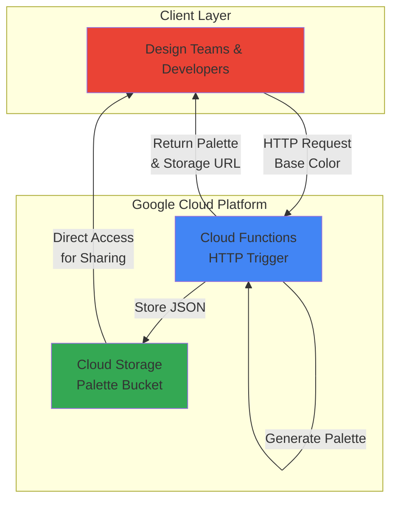

# Color Palette Generator with Cloud Functions and Storage

## Problem

Design teams and developers frequently need harmonious color palettes for digital products but struggle with manual color selection that lacks consistency and aesthetic balance. Creating complementary color schemes requires design expertise and time-consuming iteration, slowing down project development and potentially resulting in poor visual cohesion across applications.

## Solution

Deploy a serverless API using Cloud Functions that generates harmonious color palettes from a base color input and automatically stores them as JSON files in Cloud Storage. This solution provides instant palette generation with persistent storage for sharing and reuse, eliminating manual color selection overhead while ensuring consistent design standards.

## Architecture Diagram



## Prerequisites

1. Google Cloud account with billing enabled and appropriate permissions for Cloud Functions and Cloud Storage
2. Google Cloud CLI installed and configured (or Cloud Shell access)
3. Basic understanding of HTTP APIs and JSON data structures
4. Familiarity with color theory concepts (hex codes, HSL color space)
5. Estimated cost: Less than $0.10 USD for testing (includes function invocations and storage)

> **Note**: This recipe uses Google Cloud's serverless architecture, ensuring you only pay for actual usage with automatic scaling based on demand.

## Preparation

```bash
# Set environment variables for GCP resources
export PROJECT_ID="color-palette-$(date +%s)"
export REGION="us-central1"
export FUNCTION_NAME="generate-color-palette"

# Generate unique suffix for resource names
RANDOM_SUFFIX=$(openssl rand -hex 3)
export BUCKET_NAME="color-palettes-${RANDOM_SUFFIX}"

# Create and configure Google Cloud project
gcloud projects create ${PROJECT_ID}
gcloud config set project ${PROJECT_ID}
gcloud config set compute/region ${REGION}

# Enable required APIs for Cloud Functions and Cloud Storage
gcloud services enable cloudfunctions.googleapis.com \
    storage.googleapis.com \
    cloudbuild.googleapis.com \
    artifactregistry.googleapis.com

echo "✅ Project configured: ${PROJECT_ID}"
echo "✅ Function name: ${FUNCTION_NAME}"
echo "✅ Storage bucket: ${BUCKET_NAME}"
```

## Steps

1. **Create Cloud Storage Bucket for Palette Storage**:

   Google Cloud Storage provides globally distributed object storage with strong consistency guarantees, making it ideal for storing generated color palettes as JSON files. The bucket configuration includes appropriate access controls and lifecycle management to ensure cost-effective storage while maintaining data accessibility for sharing and retrieval.

   ```bash
   # Create Cloud Storage bucket with regional storage class
   gsutil mb -p ${PROJECT_ID} \
       -c STANDARD \
       -l ${REGION} \
       gs://${BUCKET_NAME}
   
   # Configure bucket for public read access to enable palette sharing
   gsutil iam ch allUsers:objectViewer gs://${BUCKET_NAME}
   
   echo "✅ Cloud Storage bucket created: gs://${BUCKET_NAME}"
   ```

   The bucket is now configured with public read access, enabling easy sharing of generated color palettes while maintaining secure write permissions for the Cloud Function. This configuration follows Google Cloud security best practices by providing least-privilege access.

2. **Create Function Source Code Directory and Dependencies**:

   Cloud Functions requires a structured deployment package with proper dependencies and entry point definitions. Creating the function directory structure and requirements file establishes the foundation for serverless color palette generation with mathematical color theory calculations.

   ```bash
   # Create function source directory
   mkdir -p palette-function
   cd palette-function
   
   # Create requirements.txt for Python dependencies
   cat > requirements.txt << 'EOF'
   google-cloud-storage==2.19.0
   functions-framework==3.*
   EOF
   
   echo "✅ Function directory and dependencies configured"
   ```

   The requirements specification includes the latest Google Cloud Storage client library for seamless integration with the bucket and the current Functions Framework version for reliable deployment compatibility. The colorsys module is included in Python's standard library and doesn't require separate installation.

3. **Implement Color Palette Generation Logic**:

   The main function implements color theory algorithms to generate harmonious color palettes using HSL color space transformations. This approach ensures mathematically pleasing color combinations by calculating complementary, triadic, and analogous color relationships from a base color input.

   ```bash
   # Create main function file with color generation logic
   cat > main.py << 'EOF'
import json
import colorsys
import hashlib
from datetime import datetime
from google.cloud import storage
import functions_framework

def hex_to_hsl(hex_color):
    """Convert hex color to HSL values"""
    hex_color = hex_color.lstrip('#')
    r, g, b = tuple(int(hex_color[i:i+2], 16) for i in (0, 2, 4))
    r, g, b = r/255.0, g/255.0, b/255.0
    h, l, s = colorsys.rgb_to_hls(r, g, b)
    return h * 360, s * 100, l * 100

def hsl_to_hex(h, s, l):
    """Convert HSL values to hex color"""
    h, s, l = h/360.0, s/100.0, l/100.0
    r, g, b = colorsys.hls_to_rgb(h, l, s)
    return '#{:02x}{:02x}{:02x}'.format(int(r*255), int(g*255), int(b*255))

def generate_palette(base_color):
    """Generate harmonious color palette from base color"""
    h, s, l = hex_to_hsl(base_color)
    
    # Generate complementary and analogous colors
    palette = {
        'base': base_color,
        'complementary': hsl_to_hex((h + 180) % 360, s, l),
        'analogous_1': hsl_to_hex((h + 30) % 360, s, l),
        'analogous_2': hsl_to_hex((h - 30) % 360, s, l),
        'triadic_1': hsl_to_hex((h + 120) % 360, s, l),
        'triadic_2': hsl_to_hex((h + 240) % 360, s, l),
        'light_variant': hsl_to_hex(h, s, min(100, l + 20)),
        'dark_variant': hsl_to_hex(h, s, max(0, l - 20))
    }
    
    return palette

@functions_framework.http
def generate_color_palette(request):
    """HTTP Cloud Function for color palette generation"""
    
    # Handle CORS for web applications
    if request.method == 'OPTIONS':
        headers = {
            'Access-Control-Allow-Origin': '*',
            'Access-Control-Allow-Methods': 'POST',
            'Access-Control-Allow-Headers': 'Content-Type',
        }
        return ('', 204, headers)
    
    headers = {'Access-Control-Allow-Origin': '*'}
    
    try:
        # Parse request data
        request_json = request.get_json(silent=True)
        if not request_json or 'base_color' not in request_json:
            return (json.dumps({"error": "Missing base_color parameter"}), 400, headers)
        
        base_color = request_json['base_color']
        
        # Validate hex color format
        if not base_color.startswith('#') or len(base_color) != 7:
            return (json.dumps({"error": "Invalid hex color format. Use #RRGGBB"}), 400, headers)
        
        # Validate hex characters
        try:
            int(base_color[1:], 16)
        except ValueError:
            return (json.dumps({"error": "Invalid hex color format. Use #RRGGBB"}), 400, headers)
        
        # Generate color palette
        palette = generate_palette(base_color)
        
        # Create palette metadata
        palette_id = hashlib.md5(base_color.encode()).hexdigest()[:8]
        palette_data = {
            'id': palette_id,
            'base_color': base_color,
            'colors': palette,
            'created_at': datetime.utcnow().isoformat(),
            'palette_type': 'harmonious'
        }
        
        # Store palette in Cloud Storage
        storage_client = storage.Client()
        bucket = storage_client.bucket('BUCKET_NAME_PLACEHOLDER')
        blob = bucket.blob(f'palettes/{palette_id}.json')
        blob.upload_from_string(
            json.dumps(palette_data, indent=2),
            content_type='application/json'
        )
        
        # Return response with palette and storage URL
        response_data = {
            'success': True,
            'palette': palette_data,
            'storage_url': f'https://storage.googleapis.com/{bucket.name}/{blob.name}'
        }
        
        return (json.dumps(response_data), 200, headers)
        
    except Exception as e:
        error_response = {'error': f'Internal server error: {str(e)}'}
        return (json.dumps(error_response), 500, headers)
EOF
   
   # Replace bucket name placeholder with actual bucket name
   sed -i "s/BUCKET_NAME_PLACEHOLDER/${BUCKET_NAME}/g" main.py
   
   echo "✅ Color palette generation logic implemented"
   ```

   The function implements comprehensive color theory calculations using HSL color space transformations to ensure visually harmonious palette generation. Enhanced error handling includes hex color validation, and CORS support enables robust API functionality for web applications.

4. **Deploy Cloud Function with HTTP Trigger**:

   Cloud Functions deployment creates a fully managed serverless HTTP endpoint with automatic scaling and built-in security features. The deployment process includes source code packaging, dependency resolution, and runtime configuration optimized for color palette generation workloads.

   ```bash
   # Deploy Cloud Function with HTTP trigger and current Python runtime
   gcloud functions deploy ${FUNCTION_NAME} \
       --runtime python312 \
       --trigger-http \
       --allow-unauthenticated \
       --source . \
       --entry-point generate_color_palette \
       --memory 256MB \
       --timeout 60s \
       --region ${REGION}
   
   # Get function URL for testing
   FUNCTION_URL=$(gcloud functions describe ${FUNCTION_NAME} \
       --region=${REGION} \
       --format="value(httpsTrigger.url)")
   
   echo "✅ Cloud Function deployed successfully"
   echo "Function URL: ${FUNCTION_URL}"
   ```

   The Cloud Function is now deployed using Python 3.12 runtime with optimized memory allocation and timeout settings for color palette generation. The HTTP trigger enables direct API access while automatic scaling ensures consistent performance under varying load conditions.

## Validation & Testing

1. **Test Color Palette Generation API**:

   ```bash
   # Test palette generation with a base color
   curl -X POST ${FUNCTION_URL} \
        -H "Content-Type: application/json" \
        -d '{"base_color": "#3498db"}' \
        | python3 -m json.tool
   ```

   Expected output: JSON response containing generated color palette with complementary, analogous, and triadic colors, plus storage URL for the saved palette.

2. **Verify Palette Storage in Cloud Storage**:

   ```bash
   # List stored palettes in bucket
   gsutil ls gs://${BUCKET_NAME}/palettes/
   
   # Download and view a specific palette file
   gsutil cat gs://${BUCKET_NAME}/palettes/*.json | head -20
   ```

3. **Test Multiple Palette Generations**:

   ```bash
   # Generate palettes for different base colors
   for color in "#e74c3c" "#2ecc71" "#f39c12" "#9b59b6"; do
       echo "Testing color: $color"
       curl -X POST ${FUNCTION_URL} \
            -H "Content-Type: application/json" \
            -d "{\"base_color\": \"$color\"}" \
            -s | python3 -c "import sys, json; data=json.load(sys.stdin); print(f\"Generated palette ID: {data['palette']['id']}\")"
   done
   ```

4. **Test Error Handling**:

   ```bash
   # Test invalid hex color format
   curl -X POST ${FUNCTION_URL} \
        -H "Content-Type: application/json" \
        -d '{"base_color": "invalid"}' \
        | python3 -m json.tool
   
   # Test missing parameter
   curl -X POST ${FUNCTION_URL} \
        -H "Content-Type: application/json" \
        -d '{}' \
        | python3 -m json.tool
   ```

## Cleanup

1. **Delete Cloud Function**:

   ```bash
   # Remove the deployed Cloud Function
   gcloud functions delete ${FUNCTION_NAME} \
       --region=${REGION} \
       --quiet
   
   echo "✅ Cloud Function deleted"
   ```

2. **Remove Cloud Storage Bucket and Contents**:

   ```bash
   # Delete all objects in the bucket
   gsutil -m rm -r gs://${BUCKET_NAME}
   
   echo "✅ Cloud Storage bucket and contents deleted"
   ```

3. **Clean Up Project Resources**:

   ```bash
   # Delete the entire project (optional - only if created specifically for this recipe)
   gcloud projects delete ${PROJECT_ID} --quiet
   
   # Clean up local function directory
   cd ..
   rm -rf palette-function
   
   echo "✅ Project and local resources cleaned up"
   echo "Note: Project deletion may take several minutes to complete"
   ```

## Discussion

This serverless color palette generator demonstrates the power of Google Cloud's fully managed services for creating scalable, cost-effective APIs. Cloud Functions provides automatic scaling from zero to handle varying workloads while eliminating infrastructure management overhead. The function's implementation leverages mathematical color theory principles, specifically HSL color space transformations, to generate visually harmonious palettes that maintain proper contrast ratios and aesthetic balance.

The integration between Cloud Functions and Cloud Storage creates a robust architecture for persistent data storage with global accessibility. Cloud Storage's strong consistency guarantees ensure that generated palettes are immediately available for sharing, while the bucket's public read configuration enables direct access via HTTPS URLs. This design pattern is particularly valuable for design systems and developer tools that require reliable color palette management across distributed teams.

The serverless approach offers significant advantages over traditional server-based solutions. With Google Cloud's pay-per-invocation pricing model, costs remain minimal during low-usage periods while automatically scaling to handle traffic spikes. The Functions Framework enables local development and testing, ensuring consistent behavior between development and production environments. Additionally, Cloud Functions' built-in monitoring and logging through Google Cloud Operations provides comprehensive observability for API performance and error tracking.

The color generation algorithm implemented here uses HSL (Hue, Saturation, Lightness) color space manipulation, which provides more intuitive control over color relationships compared to RGB transformations. This mathematical approach ensures consistent palette quality while supporting various harmony rules including complementary, triadic, and analogous color schemes. For more advanced color theory implementations, consider exploring perceptually uniform color spaces like LAB or LUV for improved visual harmony calculations.

> **Tip**: Use Cloud Monitoring to track function invocations and response times, enabling proactive optimization of color generation algorithms and storage operations based on actual usage patterns.

**References:**
- [Google Cloud Functions Documentation](https://cloud.google.com/functions/docs)
- [Google Cloud Storage Best Practices](https://cloud.google.com/storage/docs/best-practices)
- [Cloud Functions HTTP Triggers](https://cloud.google.com/functions/docs/calling/http)
- [Google Cloud Architecture Framework](https://cloud.google.com/architecture)
- [Python Runtime for Cloud Functions](https://cloud.google.com/functions/docs/concepts/python-runtime)
- [Google Cloud Operations Monitoring](https://cloud.google.com/monitoring/docs)

## Challenge

Extend this solution by implementing these enhancements:

1. **Advanced Color Harmony Generation**: Implement additional color harmony algorithms including split-complementary, tetradic, and monochromatic schemes with customizable saturation and lightness variations for more diverse palette options.

2. **Palette History and User Management**: Add Cloud Firestore integration for user authentication and palette history tracking, enabling personalized palette collections and collaborative sharing features with team management capabilities.

3. **Image-Based Color Extraction**: Integrate Cloud Vision API to analyze uploaded images and extract dominant color palettes, automatically generating harmonious variations based on real-world color combinations from photographs or artwork.

4. **Real-time Palette Collaboration**: Implement Pub/Sub messaging and WebSocket connections for real-time palette sharing and collaborative editing, allowing design teams to work together on color schemes with live updates and version control.

5. **AI-Powered Color Suggestions**: Leverage Vertex AI to train custom models on design trends and brand guidelines, providing intelligent color recommendations based on industry, season, or specific design contexts with confidence scoring and rationale explanations.

## Infrastructure Code

### Available Infrastructure as Code:

- [Infrastructure Code Overview](code/README.md) - Detailed description of all infrastructure components
- [Infrastructure Manager](code/infrastructure-manager/) - GCP Infrastructure Manager templates
- [Bash CLI Scripts](code/scripts/) - Example bash scripts using gcloud CLI commands to deploy infrastructure
- [Terraform](code/terraform/) - Terraform configuration files