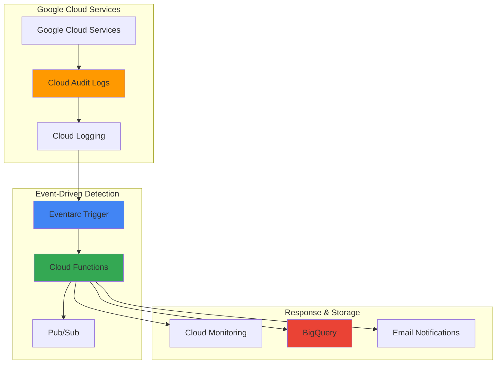

# Compliance Violation Detection with Cloud Audit Logs and Eventarc

## Problem

Organizations struggle to maintain continuous compliance monitoring across their Google Cloud infrastructure, often discovering policy violations hours or days after they occur. Manual audit log reviews are time-consuming and error-prone, while security teams need real-time alerts when critical compliance violations happen, such as unauthorized IAM changes, data access anomalies, or resource configuration drift. Traditional reactive compliance approaches create security gaps and regulatory risks that can result in significant business impact and penalties.

## Solution

Build an automated compliance violation detection system that monitors Google Cloud Audit Logs in real-time using Eventarc to trigger immediate responses when policy violations occur. This event-driven architecture uses Cloud Functions to analyze audit log events, evaluate compliance rules, and execute automated remediation actions such as notifications, resource isolation, or configuration rollbacks, ensuring continuous security posture management and rapid incident response.

## Architecture Diagram



## Prerequisites

1. Google Cloud project with billing enabled and appropriate permissions for Security, Logging, and Eventarc
2. gcloud CLI installed and configured (or Cloud Shell)
3. Basic understanding of Google Cloud IAM, audit logging, and event-driven architectures
4. Familiarity with Cloud Functions development and compliance frameworks
5. Estimated cost: $5-15/month for typical workloads (based on function executions and log storage)

> **Note**: This recipe demonstrates compliance monitoring patterns applicable to SOC 2, ISO 27001, and other regulatory frameworks. Review [Google Cloud compliance certifications](https://cloud.google.com/security/compliance) for specific requirements.

## Preparation

```bash
# Set environment variables for GCP resources
export PROJECT_ID=$(gcloud config get-value project)
export REGION="us-central1"
export ZONE="us-central1-a"

# Generate unique suffix for resource names
RANDOM_SUFFIX=$(openssl rand -hex 3)
export FUNCTION_NAME="compliance-detector-${RANDOM_SUFFIX}"
export TRIGGER_NAME="audit-log-trigger-${RANDOM_SUFFIX}"
export TOPIC_NAME="compliance-alerts-${RANDOM_SUFFIX}"
export DATASET_NAME="compliance_logs_${RANDOM_SUFFIX}"

# Set default project and region
gcloud config set project ${PROJECT_ID}
gcloud config set functions/region ${REGION}

# Enable required APIs for the compliance monitoring system
gcloud services enable cloudfunctions.googleapis.com
gcloud services enable eventarc.googleapis.com
gcloud services enable logging.googleapis.com
gcloud services enable pubsub.googleapis.com
gcloud services enable bigquery.googleapis.com
gcloud services enable monitoring.googleapis.com

echo "✅ Project configured: ${PROJECT_ID}"
echo "✅ Region set to: ${REGION}"
echo "✅ Required APIs enabled for compliance monitoring"
```

## Steps

1. **Create Pub/Sub Topic for Compliance Alerts**:

   Pub/Sub provides a reliable messaging foundation for distributing compliance violation alerts to multiple subscribers. This decoupled architecture ensures that violation notifications can be processed by various downstream systems including monitoring dashboards, ticketing systems, and automated remediation workflows, enabling scalable incident response coordination.

   ```bash
   # Create Pub/Sub topic for compliance notifications
   gcloud pubsub topics create ${TOPIC_NAME}
   
   # Create subscription for alert processing
   gcloud pubsub subscriptions create \
       ${TOPIC_NAME}-subscription \
       --topic=${TOPIC_NAME}
   
   echo "✅ Pub/Sub topic created: ${TOPIC_NAME}"
   ```

   The messaging infrastructure is now established, providing the foundation for reliable alert distribution across your compliance monitoring ecosystem. This ensures that critical violations are communicated to all relevant stakeholders and automated systems without message loss.

2. **Create BigQuery Dataset for Compliance Logs**:

   BigQuery serves as the analytical data warehouse for compliance violation records, enabling long-term trend analysis, regulatory reporting, and forensic investigations. Its columnar storage and SQL interface make it ideal for compliance auditors to query historical violation patterns and generate compliance reports required for regulatory frameworks.

   ```bash
   # Create BigQuery dataset for compliance violation storage
   bq mk --location=${REGION} \
       --description="Compliance violation logs and analysis" \
       ${DATASET_NAME}
   
   # Create table for violation records
   bq mk --table \
       ${PROJECT_ID}:${DATASET_NAME}.violations \
       timestamp:TIMESTAMP,violation_type:STRING,severity:STRING,resource:STRING,principal:STRING,details:STRING,remediation_status:STRING
   
   echo "✅ BigQuery dataset created: ${DATASET_NAME}"
   ```

   The data warehouse is configured to capture comprehensive violation metadata, supporting both real-time compliance monitoring and historical analysis for audit purposes. This structured approach ensures compliance teams can demonstrate due diligence to auditors and regulators.

3. **Deploy Cloud Function for Compliance Detection**:

   Cloud Functions provides the serverless compute environment for analyzing audit log events and implementing compliance rules. The function evaluates each audit log entry against your organization's compliance policies, identifying violations such as unauthorized privilege escalations, suspicious data access patterns, or configuration changes that deviate from security baselines.

   ```bash
   # Create function source directory
   mkdir -p /tmp/compliance-function
   cd /tmp/compliance-function
   
   # Create package.json for Node.js dependencies
   cat > package.json << 'EOF'
   {
     "name": "compliance-detector",
     "version": "1.0.0",
     "dependencies": {
       "@google-cloud/functions-framework": "^3.3.0",
       "@google-cloud/pubsub": "^4.0.0",
       "@google-cloud/bigquery": "^7.0.0",
       "@google-cloud/monitoring": "^4.0.0"
     }
   }
   EOF
   
   # Create the compliance detection function
   cat > index.js << 'EOF'
   const functions = require('@google-cloud/functions-framework');
   const { PubSub } = require('@google-cloud/pubsub');
   const { BigQuery } = require('@google-cloud/bigquery');
   const { MetricServiceClient } = require('@google-cloud/monitoring');
   
   const pubsub = new PubSub();
   const bigquery = new BigQuery();
   const monitoring = new MetricServiceClient();
   
   // Compliance rules configuration
   const COMPLIANCE_RULES = {
     IAM_POLICY_CHANGES: {
       severity: 'HIGH',
       methods: ['SetIamPolicy', 'setIamPolicy'],
       services: ['iam.googleapis.com', 'cloudresourcemanager.googleapis.com']
     },
     ADMIN_ACTIONS: {
       severity: 'MEDIUM',
       methods: ['Delete', 'Create', 'Update'],
       services: ['compute.googleapis.com', 'storage.googleapis.com']
     },
     DATA_ACCESS: {
       severity: 'LOW',
       logType: 'DATA_READ',
       services: ['storage.googleapis.com', 'bigquery.googleapis.com']
     }
   };
   
   functions.cloudEvent('analyzeAuditLog', async (cloudEvent) => {
     try {
       const auditLog = cloudEvent.data;
       const logEntry = auditLog.protoPayload || auditLog.jsonPayload;
       
       if (!logEntry) {
         console.log('No audit log payload found');
         return;
       }
       
       console.log('Processing audit log:', JSON.stringify(logEntry, null, 2));
       
       // Analyze for compliance violations
       const violations = await analyzeCompliance(logEntry, auditLog);
       
       if (violations.length > 0) {
         await Promise.all(violations.map(violation => processViolation(violation, auditLog)));
         console.log(`Processed ${violations.length} compliance violations`);
       }
       
     } catch (error) {
       console.error('Error processing audit log:', error);
       throw error;
     }
   });
   
   async function analyzeCompliance(logEntry, auditLog) {
     const violations = [];
     const timestamp = auditLog.timestamp;
     const resource = auditLog.resource?.labels?.resource_name || 'unknown';
     const principal = logEntry.authenticationInfo?.principalEmail || 'unknown';
     
     // Check IAM policy changes
     if (COMPLIANCE_RULES.IAM_POLICY_CHANGES.methods.includes(logEntry.methodName) &&
         COMPLIANCE_RULES.IAM_POLICY_CHANGES.services.includes(logEntry.serviceName)) {
       violations.push({
         type: 'IAM_POLICY_CHANGE',
         severity: 'HIGH',
         timestamp: timestamp,
         resource: resource,
         principal: principal,
         details: `IAM policy modified: ${logEntry.methodName} on ${logEntry.serviceName}`,
         logEntry: logEntry
       });
     }
     
     // Check suspicious admin actions
     if (COMPLIANCE_RULES.ADMIN_ACTIONS.services.includes(logEntry.serviceName) &&
         COMPLIANCE_RULES.ADMIN_ACTIONS.methods.some(method => logEntry.methodName?.includes(method))) {
       violations.push({
         type: 'ADMIN_ACTION',
         severity: 'MEDIUM',
         timestamp: timestamp,
         resource: resource,
         principal: principal,
         details: `Administrative action: ${logEntry.methodName} on ${logEntry.serviceName}`,
         logEntry: logEntry
       });
     }
     
     // Check data access patterns
     if (auditLog.severity === 'INFO' && 
         logEntry.authenticationInfo && 
         COMPLIANCE_RULES.DATA_ACCESS.services.includes(logEntry.serviceName)) {
       violations.push({
         type: 'DATA_ACCESS',
         severity: 'LOW',
         timestamp: timestamp,
         resource: resource,
         principal: principal,
         details: `Data access: ${logEntry.methodName} on ${logEntry.serviceName}`,
         logEntry: logEntry
       });
     }
     
     return violations;
   }
   
   async function processViolation(violation, auditLog) {
     try {
       // Store in BigQuery for analysis
       await storeViolationInBigQuery(violation);
       
       // Send alert via Pub/Sub
       await sendAlert(violation);
       
       // Create custom metric for monitoring
       await createCustomMetric(violation);
       
       console.log(`Processed ${violation.type} violation for ${violation.principal}`);
       
     } catch (error) {
       console.error('Error processing violation:', error);
       throw error;
     }
   }
   
   async function storeViolationInBigQuery(violation) {
     const dataset = bigquery.dataset(process.env.DATASET_NAME);
     const table = dataset.table('violations');
     
     const row = {
       timestamp: violation.timestamp,
       violation_type: violation.type,
       severity: violation.severity,
       resource: violation.resource,
       principal: violation.principal,
       details: violation.details,
       remediation_status: 'PENDING'
     };
     
     await table.insert([row]);
   }
   
   async function sendAlert(violation) {
     const topic = pubsub.topic(process.env.TOPIC_NAME);
     
     const alertMessage = {
       violation_type: violation.type,
       severity: violation.severity,
       timestamp: violation.timestamp,
       resource: violation.resource,
       principal: violation.principal,
       details: violation.details,
       project_id: process.env.GOOGLE_CLOUD_PROJECT
     };
     
     await topic.publishMessage({
       data: Buffer.from(JSON.stringify(alertMessage))
     });
   }
   
   async function createCustomMetric(violation) {
     const projectId = process.env.GOOGLE_CLOUD_PROJECT;
     const request = {
       name: `projects/${projectId}`,
       timeSeries: [{
         metric: {
           type: 'custom.googleapis.com/compliance/violations',
           labels: {
             violation_type: violation.type,
             severity: violation.severity
           }
         },
         resource: {
           type: 'global',
           labels: {
             project_id: projectId
           }
         },
         points: [{
           interval: {
             endTime: {
               seconds: Math.floor(Date.now() / 1000)
             }
           },
           value: {
             int64Value: 1
           }
         }]
       }]
     };
     
     try {
       await monitoring.createTimeSeries(request);
     } catch (error) {
       console.error('Error creating custom metric:', error);
     }
   }
   EOF
   
   # Deploy the Cloud Function with Node.js 20 runtime
   gcloud functions deploy ${FUNCTION_NAME} \
       --gen2 \
       --runtime=nodejs20 \
       --trigger-event-filters="type=google.cloud.audit.log.v1.written" \
       --trigger-location=${REGION} \
       --entry-point=analyzeAuditLog \
       --set-env-vars="TOPIC_NAME=${TOPIC_NAME},DATASET_NAME=${DATASET_NAME}" \
       --timeout=540s \
       --memory=512MB \
       --source=.
   
   echo "✅ Cloud Function deployed: ${FUNCTION_NAME}"
   ```

   The compliance detection function is now active and monitoring all audit log events in real-time. It implements sophisticated rule-based analysis to identify policy violations, automatically categorizes them by severity, and initiates appropriate response workflows based on your organization's compliance requirements.

4. **Create Eventarc Trigger for Audit Logs**:

   Eventarc provides the event routing infrastructure that connects Cloud Audit Logs to your compliance detection function. This managed service ensures reliable delivery of audit events with automatic retry logic and dead letter handling, guaranteeing that no compliance-relevant events are missed even during high-volume periods or system maintenance windows.

   ```bash
   # Create service account for Eventarc trigger
   gcloud iam service-accounts create eventarc-trigger-sa \
       --display-name="Eventarc Trigger Service Account"
   
   # Grant necessary permissions
   gcloud projects add-iam-policy-binding ${PROJECT_ID} \
       --member="serviceAccount:eventarc-trigger-sa@${PROJECT_ID}.iam.gserviceaccount.com" \
       --role="roles/eventarc.eventReceiver"
   
   gcloud functions add-iam-policy-binding ${FUNCTION_NAME} \
       --region=${REGION} \
       --member="serviceAccount:eventarc-trigger-sa@${PROJECT_ID}.iam.gserviceaccount.com" \
       --role="roles/cloudfunctions.invoker"
   
   # Create Eventarc trigger for Cloud Audit Logs
   gcloud eventarc triggers create ${TRIGGER_NAME} \
       --location=${REGION} \
       --destination-run-service=${FUNCTION_NAME} \
       --event-filters="type=google.cloud.audit.log.v1.written" \
       --service-account=eventarc-trigger-sa@${PROJECT_ID}.iam.gserviceaccount.com
   
   # Verify trigger creation
   gcloud eventarc triggers describe ${TRIGGER_NAME} \
       --location=${REGION}
   
   echo "✅ Eventarc trigger created: ${TRIGGER_NAME}"
   ```

   The event routing is configured to capture all audit log events and deliver them to your compliance function with guaranteed delivery semantics. This ensures comprehensive monitoring coverage across all Google Cloud services and maintains audit trail integrity for compliance reporting.

5. **Configure Advanced Audit Log Settings**:

   Comprehensive audit logging configuration ensures that all compliance-relevant activities are captured and routed to your detection system. Data Access audit logs provide visibility into data operations that are critical for privacy regulations like GDPR, while Admin Activity logs track configuration changes essential for security compliance frameworks.

   ```bash
   # Enable Data Access audit logs for specific services
   cat > audit-policy.yaml << 'EOF'
   auditConfigs:
   - service: storage.googleapis.com
     auditLogConfigs:
     - logType: DATA_READ
     - logType: DATA_WRITE
   - service: bigquery.googleapis.com
     auditLogConfigs:
     - logType: DATA_READ
     - logType: DATA_WRITE
   - service: compute.googleapis.com
     auditLogConfigs:
     - logType: ADMIN_READ
   EOF
   
   # Apply audit configuration using IAM policy
   gcloud projects get-iam-policy ${PROJECT_ID} \
       --format=json > policy.json
   
   # Create log-based metric for compliance monitoring
   gcloud logging metrics create compliance_violations \
       --description="Count of compliance violations detected" \
       --log-filter='resource.type="cloud_function" AND textPayload:"violation"'
   
   # Create log sink to BigQuery for audit logs
   gcloud logging sinks create compliance-audit-sink \
       bigquery.googleapis.com/projects/${PROJECT_ID}/datasets/${DATASET_NAME} \
       --log-filter='protoPayload.@type="type.googleapis.com/google.cloud.audit.AuditLog"'
   
   echo "✅ Enhanced audit logging configured"
   ```

   Advanced audit logging is now capturing comprehensive activity data across your Google Cloud environment, providing the detailed event stream necessary for regulatory compliance monitoring and forensic analysis capabilities required by security teams.

6. **Set Up Cloud Monitoring Alerts**:

   Cloud Monitoring integration provides real-time alerting capabilities that escalate compliance violations to security teams through multiple channels. This proactive monitoring approach ensures that critical violations trigger immediate human intervention while routine violations are processed through automated workflows, optimizing incident response efficiency.

   ```bash
   # Create alert policy for high-severity violations
   cat > alert-policy.json << EOF
   {
     "displayName": "High Severity Compliance Violations",
     "conditions": [
       {
         "displayName": "High severity violations detected",
         "conditionThreshold": {
           "filter": "metric.type=\"custom.googleapis.com/compliance/violations\" AND metric.labels.severity=\"HIGH\"",
           "comparison": "COMPARISON_GREATER_THAN",
           "thresholdValue": 0,
           "duration": "60s"
         }
       }
     ],
     "alertStrategy": {
       "autoClose": "1800s"
     },
     "enabled": true,
     "notificationChannels": []
   }
   EOF
   
   # Create the alert policy
   gcloud alpha monitoring policies create --policy-from-file=alert-policy.json
   
   # Create dashboard for compliance monitoring
   cat > dashboard.json << EOF
   {
     "displayName": "Compliance Monitoring Dashboard",
     "mosaicLayout": {
       "tiles": [
         {
           "width": 6,
           "height": 4,
           "widget": {
             "title": "Compliance Violations by Type",
             "xyChart": {
               "dataSets": [
                 {
                   "timeSeriesQuery": {
                     "timeSeriesFilter": {
                       "filter": "metric.type=\"custom.googleapis.com/compliance/violations\"",
                       "aggregation": {
                         "alignmentPeriod": "300s",
                         "perSeriesAligner": "ALIGN_RATE",
                         "crossSeriesReducer": "REDUCE_SUM",
                         "groupByFields": ["metric.labels.violation_type"]
                       }
                     }
                   }
                 }
               ]
             }
           }
         }
       ]
     }
   }
   EOF
   
   gcloud monitoring dashboards create --config-from-file=dashboard.json
   
   echo "✅ Monitoring alerts and dashboard configured"
   ```

   Comprehensive monitoring infrastructure is operational, providing real-time visibility into compliance violations with automated alerting for critical events and executive dashboards for compliance posture reporting to leadership and audit teams.

## Validation & Testing

1. **Verify Function Deployment and Event Processing**:

   ```bash
   # Check function status and logs
   gcloud functions describe ${FUNCTION_NAME} \
       --region=${REGION} \
       --format="table(status,updateTime)"
   
   # View recent function logs
   gcloud functions logs read ${FUNCTION_NAME} \
       --region=${REGION} \
       --limit=20
   ```

   Expected output: Function status should show "ACTIVE" with recent deployment timestamp

2. **Test Compliance Detection with Simulated Violation**:

   ```bash
   # Create a test IAM policy change to trigger compliance detection
   gcloud projects add-iam-policy-binding ${PROJECT_ID} \
       --member="user:test@example.com" \
       --role="roles/viewer"
   
   # Remove the test binding
   gcloud projects remove-iam-policy-binding ${PROJECT_ID} \
       --member="user:test@example.com" \
       --role="roles/viewer"
   
   # Check for violation detection in BigQuery
   sleep 30
   bq query --use_legacy_sql=false \
       "SELECT * FROM \`${PROJECT_ID}.${DATASET_NAME}.violations\` 
        WHERE timestamp > TIMESTAMP_SUB(CURRENT_TIMESTAMP(), INTERVAL 5 MINUTE) 
        ORDER BY timestamp DESC LIMIT 5"
   ```

3. **Verify Alert Processing**:

   ```bash
   # Check Pub/Sub messages for compliance alerts
   gcloud pubsub subscriptions pull \
       ${TOPIC_NAME}-subscription \
       --auto-ack \
       --limit=5
   
   # Verify custom metrics in Cloud Monitoring
   gcloud monitoring metrics list \
       --filter="metric.type:custom.googleapis.com/compliance"
   ```

## Cleanup

1. **Remove Eventarc Trigger and Cloud Function**:

   ```bash
   # Delete Eventarc trigger
   gcloud eventarc triggers delete ${TRIGGER_NAME} \
       --location=${REGION} \
       --quiet
   
   # Delete Cloud Function
   gcloud functions delete ${FUNCTION_NAME} \
       --region=${REGION} \
       --quiet
   
   # Delete service account
   gcloud iam service-accounts delete \
       eventarc-trigger-sa@${PROJECT_ID}.iam.gserviceaccount.com \
       --quiet
   
   echo "✅ Function and trigger deleted"
   ```

2. **Clean Up Storage and Messaging Resources**:

   ```bash
   # Delete BigQuery dataset
   bq rm -r -f ${PROJECT_ID}:${DATASET_NAME}
   
   # Delete Pub/Sub resources
   gcloud pubsub subscriptions delete ${TOPIC_NAME}-subscription
   gcloud pubsub topics delete ${TOPIC_NAME}
   
   # Delete log sink
   gcloud logging sinks delete compliance-audit-sink --quiet
   
   echo "✅ Storage and messaging resources cleaned up"
   ```

3. **Remove Monitoring Resources**:

   ```bash
   # Delete custom metric
   gcloud logging metrics delete compliance_violations --quiet
   
   # List and delete alert policies (manual cleanup required)
   gcloud alpha monitoring policies list \
       --filter="displayName:'High Severity Compliance Violations'"
   
   echo "✅ Monitoring resources cleaned up"
   ```

## Discussion

This automated compliance violation detection system represents a modern approach to cloud security governance that addresses the scale and complexity challenges faced by enterprise organizations. By leveraging Google Cloud's native audit logging capabilities combined with event-driven architecture patterns, organizations can achieve real-time compliance monitoring that was previously only possible through expensive third-party solutions or extensive manual processes.

The architecture demonstrates several key compliance automation principles. First, the separation of concerns between event capture (Cloud Audit Logs), event processing (Eventarc), and business logic (Cloud Functions) creates a maintainable and scalable system that can evolve with changing compliance requirements. Second, the multi-channel alerting approach through Pub/Sub, BigQuery, and Cloud Monitoring ensures that violations are both immediately actionable and historically auditable, supporting both operational security teams and compliance auditors.

The rule-based detection engine implemented in the Cloud Function can be easily extended to support additional compliance frameworks such as PCI DSS, HIPAA, or SOX by modifying the COMPLIANCE_RULES configuration object. This flexibility allows organizations to adapt the system to their specific regulatory requirements without architectural changes. For enhanced detection capabilities, consider integrating machine learning models through Vertex AI to identify anomalous patterns that static rules might miss, particularly for insider threat detection or unusual data access patterns.

Performance considerations include the function's ability to process high-volume audit log streams during peak activity periods. The current configuration supports typical enterprise workloads, but organizations with extremely high API call volumes should consider implementing message batching through Cloud Pub/Sub subscriptions or deploying multiple function instances across regions. Cost optimization can be achieved by implementing intelligent filtering in the Eventarc trigger configuration to reduce function invocations for low-risk activities while maintaining comprehensive coverage for security-critical events.

> **Tip**: Configure log retention policies in Cloud Logging and BigQuery based on your compliance requirements - many frameworks require 7+ years of audit log retention. Use [Cloud Storage lifecycle policies](https://cloud.google.com/storage/docs/lifecycle) for cost-effective long-term storage.

## Challenge

Extend this compliance monitoring solution by implementing these advanced capabilities:

1. **Intelligent Threat Detection**: Integrate Vertex AI to detect anomalous user behavior patterns, such as unusual login locations, privilege escalation attempts, or data access outside normal business hours, creating a behavioral baseline for each user and role.

2. **Automated Remediation Workflows**: Implement Cloud Workflows to automatically respond to specific violation types, such as temporarily disabling compromised accounts, reverting unauthorized configuration changes, or isolating affected resources while notifying security teams.

3. **Multi-Cloud Compliance Monitoring**: Extend the system to monitor compliance across hybrid and multi-cloud environments by integrating AWS CloudTrail and Azure Activity Logs through Cloud Functions, providing unified compliance visibility across your entire infrastructure.

4. **Executive Compliance Reporting**: Build automated compliance reporting using Looker Studio and BigQuery to generate executive dashboards showing compliance trends, violation patterns, and risk metrics that align with frameworks like NIST Cybersecurity Framework or ISO 27001.

5. **Zero-Trust Integration**: Enhance the system with Context-Aware Access policies that automatically adjust resource access permissions based on real-time risk scores calculated from compliance violation history, user behavior analysis, and environmental factors.

## Infrastructure Code

### Available Infrastructure as Code:

- [Infrastructure Code Overview](code/README.md) - Detailed description of all infrastructure components
- [Infrastructure Manager](code/infrastructure-manager/) - GCP Infrastructure Manager templates
- [Bash CLI Scripts](code/scripts/) - Example bash scripts using gcloud CLI commands to deploy infrastructure
- [Terraform](code/terraform/) - Terraform configuration files