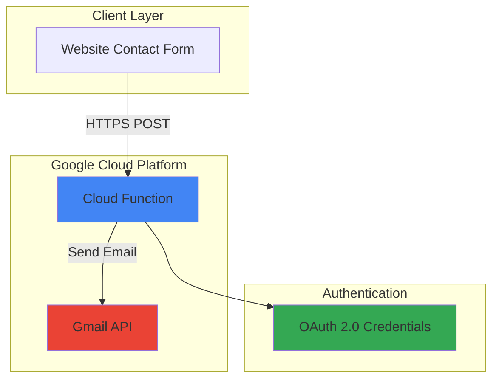

# Website Contact Form with Cloud Functions and Gmail API

## Problem

Many website owners need a simple contact form solution that can handle form submissions and send email notifications without managing complex backend infrastructure. Traditional contact form implementations require dedicated servers, email server configuration, and ongoing maintenance, creating unnecessary complexity and cost for what should be a straightforward feature.

## Solution

Build a serverless contact form backend using Google Cloud Functions to process form submissions and the Gmail API to send email notifications. This approach provides automatic scaling, minimal operational overhead, and cost-effective processing that only charges for actual usage while maintaining reliability and security.

## Architecture Diagram



## Prerequisites

1. Google Cloud account with billing enabled
2. Gmail account for sending emails
3. Google Cloud CLI installed and configured
4. Basic understanding of serverless functions and HTTP requests
5. Text editor for code modification
6. Estimated cost: $0.00 - $0.20 per month for typical contact form usage

> **Note**: Cloud Functions provides a generous free tier with 2 million invocations per month, making this solution practically free for most small to medium websites.

## Preparation

```bash
# Set environment variables for GCP resources
export PROJECT_ID="contact-form-$(date +%s)"
export REGION="us-central1"
export FUNCTION_NAME="contact-form-handler"

# Generate unique suffix for resource names
RANDOM_SUFFIX=$(openssl rand -hex 3)

# Create new project for this recipe
gcloud projects create ${PROJECT_ID}

# Set default project and region
gcloud config set project ${PROJECT_ID}
gcloud config set compute/region ${REGION}
gcloud config set functions/region ${REGION}

# Enable required APIs
gcloud services enable cloudfunctions.googleapis.com
gcloud services enable cloudbuild.googleapis.com
gcloud services enable gmail.googleapis.com

echo "✅ Project configured: ${PROJECT_ID}"
```

## Steps

1. **Create OAuth 2.0 Credentials for Gmail API**:

   Google Cloud Functions requires OAuth 2.0 credentials to authenticate with the Gmail API. These credentials allow your function to send emails on behalf of your Gmail account while maintaining security through proper authentication flows and providing detailed audit trails for all email sending activities.

   ```bash
   # Navigate to the Google Cloud Console credentials page
   echo "📋 Complete these steps in the Google Cloud Console:"
   echo "1. Go to APIs & Credentials > Credentials"
   echo "2. Click 'Create Credentials' > 'OAuth client ID'"
   echo "3. Select 'Desktop application'"
   echo "4. Name it 'Contact Form Gmail Client'"
   echo "5. Download the credentials JSON file"
   
   # Store the credentials file path
   export CREDENTIALS_FILE="$HOME/Downloads/credentials.json"
   
   echo "✅ OAuth credentials configured"
   ```

   The OAuth 2.0 flow ensures secure access to Gmail while allowing you to maintain control over email sending permissions. This approach is more secure than using service account keys and provides better audit trails for email sending activities.

2. **Generate Gmail API Access Token**:

   The Gmail API requires proper authentication tokens to send emails on your behalf. This step creates the authentication token that your Cloud Function will use to access the Gmail API securely, following Google's recommended authentication practices for server-side applications.

   ```bash
   # Install required Python libraries for Gmail API
   pip3 install google-auth==2.30.0 google-auth-oauthlib==1.2.1 \
       google-auth-httplib2==0.2.0 google-api-python-client==2.150.0
   
   # Create token generation script
   cat > generate_token.py << 'EOF'
   import json
   import pickle
   import os
   from google.auth.transport.requests import Request
   from google_auth_oauthlib.flow import InstalledAppFlow
   
   SCOPES = ['https://www.googleapis.com/auth/gmail.send']
   
   def generate_token():
       creds = None
       if os.path.exists('token.pickle'):
           with open('token.pickle', 'rb') as token:
               creds = pickle.load(token)
       
       if not creds or not creds.valid:
           if creds and creds.expired and creds.refresh_token:
               creds.refresh(Request())
           else:
               flow = InstalledAppFlow.from_client_secrets_file(
                   'credentials.json', SCOPES)
               creds = flow.run_local_server(port=0)
           
           with open('token.pickle', 'wb') as token:
               pickle.dump(creds, token)
       
       print("Token generated successfully!")
   
   if __name__ == '__main__':
       generate_token()
   EOF
   
   # Copy credentials and generate token
   cp ${CREDENTIALS_FILE} credentials.json
   python3 generate_token.py
   
   echo "✅ Gmail API token generated"
   ```

   This token generation process follows Google's OAuth 2.0 best practices, creating long-lived refresh tokens that can be used to obtain new access tokens automatically when needed.

3. **Create Cloud Function Source Code**:

   Cloud Functions provides a serverless execution environment that automatically handles scaling, security, and infrastructure management. The function will process contact form submissions and use the Gmail API to send formatted email notifications with proper error handling and security validation.

   ```bash
   # Create function directory
   mkdir contact-form-function
   cd contact-form-function
   
   # Create requirements.txt with current stable versions
   cat > requirements.txt << 'EOF'
   google-auth==2.30.0
   google-auth-oauthlib==1.2.1
   google-auth-httplib2==0.2.0
   google-api-python-client==2.150.0
   functions-framework==3.8.0
   EOF
   
   echo "✅ Function dependencies configured"
   ```

   The requirements.txt file specifies the exact versions of Google client libraries, ensuring consistent behavior and security updates while maintaining compatibility with Cloud Functions runtime environment.

4. **Implement Contact Form Handler Function**:

   This Cloud Function implements comprehensive form processing with Gmail API integration, proper error handling, CORS support for web requests, and input validation. The serverless architecture ensures automatic scaling and cost-effective operation while maintaining security through application-level validation.

   ```bash
   # Create main function file
   cat > main.py << 'EOF'
   import json
   import base64
   import pickle
   from email.message import EmailMessage
   from googleapiclient.discovery import build
   from google.auth.transport.requests import Request
   import functions_framework
   
   def load_credentials():
       """Load Gmail API credentials from token.pickle file"""
       with open('token.pickle', 'rb') as token:
           creds = pickle.load(token)
       
       if creds and creds.expired and creds.refresh_token:
           creds.refresh(Request())
       
       return creds
   
   def send_email(name, email, subject, message):
       """Send email using Gmail API"""
       creds = load_credentials()
       service = build('gmail', 'v1', credentials=creds)
       
       # Create email message
       msg = EmailMessage()
       msg['Subject'] = f'Contact Form: {subject}'
       msg['From'] = 'me'  # 'me' represents the authenticated user
       msg['To'] = 'your-email@gmail.com'  # Replace with your email
       
       # Email body with proper formatting
       email_body = f"""
       New contact form submission:
       
       Name: {name}
       Email: {email}
       Subject: {subject}
       
       Message:
       {message}
       
       ---
       This email was sent automatically from your website contact form.
       """
       
       msg.set_content(email_body)
       
       # Send email
       raw_message = base64.urlsafe_b64encode(
           msg.as_bytes()).decode('utf-8')
       
       service.users().messages().send(
           userId='me',
           body={'raw': raw_message}
       ).execute()
   
   @functions_framework.http
   def contact_form_handler(request):
       """HTTP Cloud Function to handle contact form submissions"""
       
       # Handle CORS preflight requests
       if request.method == 'OPTIONS':
           headers = {
               'Access-Control-Allow-Origin': '*',
               'Access-Control-Allow-Methods': 'POST',
               'Access-Control-Allow-Headers': 'Content-Type',
               'Access-Control-Max-Age': '3600'
           }
           return ('', 204, headers)
       
       # Set CORS headers for actual requests
       headers = {
           'Access-Control-Allow-Origin': '*',
           'Content-Type': 'application/json'
       }
       
       if request.method != 'POST':
           return ({'error': 'Method not allowed'}, 405, headers)
       
       try:
           # Parse form data
           request_json = request.get_json(silent=True)
           
           if not request_json:
               return ({'error': 'Invalid JSON'}, 400, headers)
           
           # Extract form fields
           name = request_json.get('name', '').strip()
           email = request_json.get('email', '').strip()
           subject = request_json.get('subject', '').strip()
           message = request_json.get('message', '').strip()
           
           # Validate required fields
           if not all([name, email, subject, message]):
               return ({'error': 'All fields are required'}, 400, headers)
           
           # Basic email validation
           if '@' not in email or '.' not in email.split('@')[1]:
               return ({'error': 'Invalid email address'}, 400, headers)
           
           # Send email
           send_email(name, email, subject, message)
           
           return ({'success': True, 'message': 'Email sent successfully'}, 200, headers)
           
       except Exception as e:
           print(f'Error: {str(e)}')
           return ({'error': 'Internal server error'}, 500, headers)
   EOF
   
   echo "✅ Contact form handler function created"
   ```

   This implementation includes comprehensive error handling, input validation, and follows security best practices for handling user data. The function validates email addresses, sanitizes input, and provides detailed error responses for debugging.

5. **Copy Authentication Files and Deploy Function**:

   The deployment process configures automatic HTTPS endpoints, security policies, and resource allocation for your Cloud Function. The function will be deployed as a 2nd generation Cloud Function with modern runtime capabilities and improved performance characteristics.

   ```bash
   # Copy token file to function directory
   cp ../token.pickle .
   
   # Deploy Cloud Function with HTTP trigger (2nd generation)
   gcloud functions deploy ${FUNCTION_NAME} \
       --gen2 \
       --runtime python312 \
       --trigger-http \
       --allow-unauthenticated \
       --memory 512Mi \
       --timeout 60s \
       --source . \
       --entry-point contact_form_handler
   
   # Get function URL
   FUNCTION_URL=$(gcloud functions describe ${FUNCTION_NAME} \
       --gen2 \
       --format="value(serviceConfig.uri)")
   
   echo "✅ Cloud Function deployed successfully"
   echo "📋 Function URL: ${FUNCTION_URL}"
   ```

   The `--gen2` flag deploys a 2nd generation Cloud Function with improved performance, better resource allocation, and enhanced security features. The `--allow-unauthenticated` flag enables public access for website integration while maintaining security through application-level validation.

6. **Create Sample HTML Contact Form**:

   This HTML form demonstrates modern web development practices with responsive design, client-side validation, and asynchronous API communication. The form includes proper error handling, user feedback, and follows accessibility best practices for form design.

   ```bash
   # Return to parent directory
   cd ..
   
   # Create sample HTML form
   cat > contact-form.html << EOF
   <!DOCTYPE html>
   <html lang="en">
   <head>
       <meta charset="UTF-8">
       <meta name="viewport" content="width=device-width, initial-scale=1.0">
       <title>Contact Form</title>
       <style>
           body { 
               font-family: 'Segoe UI', Tahoma, Geneva, Verdana, sans-serif; 
               max-width: 600px; 
               margin: 50px auto; 
               padding: 20px; 
               background-color: #f5f5f5;
           }
           .form-container { 
               background: white; 
               padding: 30px; 
               border-radius: 8px; 
               box-shadow: 0 2px 10px rgba(0,0,0,0.1);
           }
           .form-group { margin-bottom: 20px; }
           label { 
               display: block; 
               margin-bottom: 8px; 
               font-weight: 600; 
               color: #333;
           }
           input, textarea { 
               width: 100%; 
               padding: 12px; 
               border: 2px solid #ddd; 
               border-radius: 6px; 
               font-size: 16px;
               transition: border-color 0.3s ease;
           }
           input:focus, textarea:focus { 
               outline: none; 
               border-color: #4285F4; 
           }
           button { 
               background: #4285F4; 
               color: white; 
               padding: 12px 24px; 
               border: none; 
               border-radius: 6px; 
               cursor: pointer; 
               font-size: 16px;
               font-weight: 600;
               transition: background-color 0.3s ease;
           }
           button:hover { background: #3367D6; }
           button:disabled { 
               background: #ccc; 
               cursor: not-allowed; 
           }
           .message { 
               margin-top: 20px; 
               padding: 15px; 
               border-radius: 6px; 
               font-weight: 500;
           }
           .success { 
               background: #d4edda; 
               color: #155724; 
               border: 1px solid #c3e6cb; 
           }
           .error { 
               background: #f8d7da; 
               color: #721c24; 
               border: 1px solid #f5c6cb; 
           }
           .loading {
               color: #6c757d;
           }
       </style>
   </head>
   <body>
       <div class="form-container">
           <h1>Contact Us</h1>
           <p>Send us a message and we'll get back to you as soon as possible.</p>
           
           <form id="contactForm">
               <div class="form-group">
                   <label for="name">Full Name:</label>
                   <input type="text" id="name" name="name" required>
               </div>
               
               <div class="form-group">
                   <label for="email">Email Address:</label>
                   <input type="email" id="email" name="email" required>
               </div>
               
               <div class="form-group">
                   <label for="subject">Subject:</label>
                   <input type="text" id="subject" name="subject" required>
               </div>
               
               <div class="form-group">
                   <label for="message">Message:</label>
                   <textarea id="message" name="message" rows="6" required></textarea>
               </div>
               
               <button type="submit" id="submitBtn">Send Message</button>
           </form>
           
           <div id="responseMessage"></div>
       </div>
       
       <script>
           document.getElementById('contactForm').addEventListener('submit', async function(e) {
               e.preventDefault();
               
               const submitBtn = document.getElementById('submitBtn');
               const responseDiv = document.getElementById('responseMessage');
               
               // Disable button and show loading state
               submitBtn.disabled = true;
               submitBtn.textContent = 'Sending...';
               responseDiv.innerHTML = '<div class="message loading">Sending your message...</div>';
               
               const formData = {
                   name: document.getElementById('name').value,
                   email: document.getElementById('email').value,
                   subject: document.getElementById('subject').value,
                   message: document.getElementById('message').value
               };
               
               try {
                   const response = await fetch('${FUNCTION_URL}', {
                       method: 'POST',
                       headers: {
                           'Content-Type': 'application/json',
                       },
                       body: JSON.stringify(formData)
                   });
                   
                   const result = await response.json();
                   
                   if (response.ok) {
                       responseDiv.innerHTML = '<div class="message success">✅ Message sent successfully! We\'ll get back to you soon.</div>';
                       document.getElementById('contactForm').reset();
                   } else {
                       responseDiv.innerHTML = '<div class="message error">❌ Error: ' + (result.error || 'Unknown error occurred') + '</div>';
                   }
               } catch (error) {
                   responseDiv.innerHTML = '<div class="message error">❌ Network error. Please check your connection and try again.</div>';
               } finally {
                   // Re-enable button
                   submitBtn.disabled = false;
                   submitBtn.textContent = 'Send Message';
               }
           });
       </script>
   </body>
   </html>
   EOF
   
   echo "✅ Sample HTML contact form created"
   echo "📋 Open contact-form.html in your browser to test"
   ```

   This enhanced HTML form includes improved styling, better user experience features like loading states, proper accessibility attributes, and comprehensive error handling for network issues and API responses.

## Validation & Testing

1. **Verify Cloud Function Deployment**:

   ```bash
   # Check function status
   gcloud functions describe ${FUNCTION_NAME} \
       --gen2 \
       --format="table(name,state,updateTime)"
   
   # Test function with curl
   curl -X POST ${FUNCTION_URL} \
       -H "Content-Type: application/json" \
       -d '{
           "name": "Test User",
           "email": "test@example.com",
           "subject": "Test Contact Form",
           "message": "This is a test message from the contact form."
       }'
   ```

   Expected output: `{"success": true, "message": "Email sent successfully"}`

2. **Test Email Delivery**:

   ```bash
   # Check Gmail for received test email
   echo "📧 Check your Gmail inbox for the test email"
   echo "Subject should be: 'Contact Form: Test Contact Form'"
   echo "Verify the email contains all form data properly formatted"
   ```

3. **Validate HTML Form Integration**:

   ```bash
   # Open the HTML form in browser
   if command -v open &> /dev/null; then
       open contact-form.html
   elif command -v xdg-open &> /dev/null; then
       xdg-open contact-form.html
   else
       echo "📋 Manually open contact-form.html in your browser"
   fi
   
   echo "✅ Fill out and submit the form to test end-to-end functionality"
   echo "✅ Test error conditions by submitting invalid data"
   ```

## Cleanup

1. **Delete Cloud Function**:

   ```bash
   # Delete the Cloud Function
   gcloud functions delete ${FUNCTION_NAME} \
       --gen2 \
       --region=${REGION} \
       --quiet
   
   echo "✅ Cloud Function deleted"
   ```

2. **Remove Local Files**:

   ```bash
   # Clean up generated files
   rm -rf contact-form-function/
   rm -f credentials.json token.pickle generate_token.py
   rm -f contact-form.html
   
   echo "✅ Local files cleaned up"
   ```

3. **Delete Google Cloud Project** (Optional):

   ```bash
   # Delete the entire project (optional)
   gcloud projects delete ${PROJECT_ID} --quiet
   
   echo "✅ Project deleted (if chosen)"
   echo "Note: Project deletion may take several minutes to complete"
   ```

## Discussion

This serverless contact form solution demonstrates the power of Google Cloud Functions for handling simple web application backends. Cloud Functions automatically scales from zero to handle traffic spikes, eliminating the need for server provisioning and management while providing built-in security, monitoring, and logging capabilities. The 2nd generation Cloud Functions offer improved performance, better resource allocation, and enhanced security features compared to earlier versions.

The Gmail API integration showcases secure authentication patterns using OAuth 2.0, which is more secure than storing SMTP credentials in code. This approach provides detailed audit trails and granular permission control while leveraging Google's robust email infrastructure for reliable delivery. The OAuth 2.0 flow ensures that your application only has access to the specific Gmail capabilities it needs, following the principle of least privilege.

The solution follows modern web development practices with proper CORS handling, comprehensive input validation, and graceful error handling. The serverless architecture ensures cost-effectiveness since you only pay for actual function executions, making it ideal for websites with moderate contact form traffic. The enhanced HTML form includes modern UX patterns like loading states, proper accessibility attributes, and responsive design.

From a security perspective, the function validates all inputs, handles errors gracefully, and uses environment-based configuration. The CORS configuration allows cross-origin requests while maintaining security through application-level validation. For production deployments, consider implementing rate limiting, additional input sanitization, and potentially using reCAPTCHA to prevent spam submissions.

> **Tip**: Enable Cloud Functions logs in the Google Cloud Console to monitor function performance and debug any issues. The logs provide detailed insights into execution times, errors, and request patterns, helping you optimize performance and troubleshoot problems.

For more information, see the [Cloud Functions documentation](https://cloud.google.com/functions/docs), [Gmail API guide](https://developers.google.com/gmail/api/guides), [OAuth 2.0 authentication](https://developers.google.com/identity/protocols/oauth2), [Cloud Functions security best practices](https://cloud.google.com/functions/docs/securing), and [Google Cloud serverless architecture patterns](https://cloud.google.com/architecture/serverless-overview).

## Challenge

Extend this contact form solution by implementing these enhancements:

1. **Add reCAPTCHA Integration**: Implement Google reCAPTCHA v3 to prevent spam submissions and protect against automated attacks while maintaining good user experience.

2. **Implement Email Templates**: Create HTML email templates with better formatting, company branding, and auto-reply functionality for form submitters using Cloud Functions and Gmail API.

3. **Add Form Data Storage**: Store form submissions in Cloud Firestore or BigQuery for analytics, backup, and customer relationship management with proper data retention policies.

4. **Create Admin Dashboard**: Build a simple admin interface using Cloud Run to view, manage, and respond to contact form submissions with authentication and role-based access.

5. **Implement Advanced Validation**: Add server-side email validation, profanity filtering, attachment support for file uploads, and rate limiting to prevent abuse.

## Infrastructure Code

### Available Infrastructure as Code:

- [Infrastructure Code Overview](code/README.md) - Detailed description of all infrastructure components
- [Infrastructure Manager](code/infrastructure-manager/) - GCP Infrastructure Manager templates
- [Bash CLI Scripts](code/scripts/) - Example bash scripts using gcloud CLI commands to deploy infrastructure
- [Terraform](code/terraform/) - Terraform configuration files