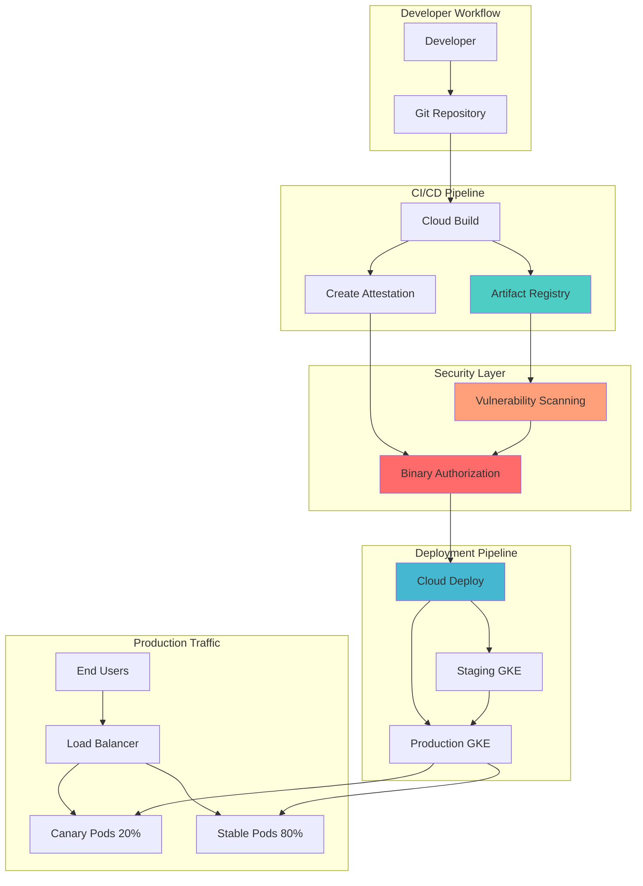

# Container Security Pipeline with Binary Authorization and Cloud Deploy

## Problem

Organizations deploying containerized applications face significant security risks from vulnerable or unauthorized container images entering production environments. Without proper security controls in the deployment pipeline, teams struggle to enforce security policies, verify image integrity, and maintain compliance with security standards. Manual security reviews create bottlenecks and increase the risk of human error, while lack of automated deployment strategies makes it difficult to safely rollout updates without impacting users.

## Solution

Build an automated container security pipeline that integrates Binary Authorization for policy enforcement, Artifact Registry for secure image storage with vulnerability scanning, Cloud Build for creating cryptographic attestations, and Cloud Deploy for safe canary deployments. This solution enforces security policies at deployment time while enabling progressive rollouts that minimize risk to production users.

## Architecture Diagram



## Prerequisites

1. Google Cloud account with appropriate permissions for Binary Authorization, Cloud Deploy, GKE, and Artifact Registry
2. gcloud CLI installed and configured
3. Understanding of Kubernetes, Docker, and container security concepts
4. Basic knowledge of CI/CD pipelines and deployment strategies
5. Estimated cost: $15-25 for GKE clusters, minimal costs for other services during testing

> **Note**: This recipe demonstrates enterprise-grade container security practices following Google Cloud's software supply chain security framework.

## Preparation

```bash
# Set environment variables for GCP resources
export PROJECT_ID="container-security-$(date +%s)"
export REGION="us-central1"
export ZONE="us-central1-a"

# Generate unique suffix for resource names
RANDOM_SUFFIX=$(openssl rand -hex 3)

# Set default project and region
gcloud config set project ${PROJECT_ID}
gcloud config set compute/region ${REGION}
gcloud config set compute/zone ${ZONE}

# Enable required APIs
gcloud services enable container.googleapis.com \
    cloudbuild.googleapis.com \
    artifactregistry.googleapis.com \
    binaryauthorization.googleapis.com \
    clouddeploy.googleapis.com \
    containeranalysis.googleapis.com

echo "✅ Project configured: ${PROJECT_ID}"
```

## Steps

1. **Create Artifact Registry repository for secure image storage**:

   Artifact Registry provides vulnerability scanning and centralized image management with fine-grained access controls. Creating a dedicated repository establishes the foundation for secure container image storage with automatic vulnerability scanning enabled by default.

   ```bash
   # Create Artifact Registry repository
   gcloud artifacts repositories create secure-apps-repo \
       --repository-format=docker \
       --location=${REGION} \
       --description="Secure container repository with scanning"
   
   # Configure Docker authentication
   gcloud auth configure-docker ${REGION}-docker.pkg.dev
   
   export REPO_URL="${REGION}-docker.pkg.dev/${PROJECT_ID}/secure-apps-repo"
   
   echo "✅ Artifact Registry repository created: ${REPO_URL}"
   ```

   The repository is now configured with automatic vulnerability scanning, providing critical security insights before images are deployed to production environments.

2. **Create GKE clusters for staging and production**:

   Google Kubernetes Engine clusters with Binary Authorization enabled provide the runtime environment for secure container deployments. The staging cluster validates deployments before production, while the production cluster enforces strict security policies.

   ```bash
   # Create staging cluster with Binary Authorization enabled
   gcloud container clusters create staging-cluster-${RANDOM_SUFFIX} \
       --zone=${ZONE} \
       --num-nodes=2 \
       --machine-type=e2-standard-2 \
       --enable-binauthz \
       --enable-network-policy \
       --enable-autorepair \
       --enable-autoupgrade
   
   # Create production cluster with Binary Authorization enabled
   gcloud container clusters create prod-cluster-${RANDOM_SUFFIX} \
       --zone=${ZONE} \
       --num-nodes=3 \
       --machine-type=e2-standard-2 \
       --enable-binauthz \
       --enable-network-policy \
       --enable-autorepair \
       --enable-autoupgrade
   
   echo "✅ GKE clusters created with Binary Authorization enabled"
   ```

   Both clusters are now ready with Binary Authorization enforcement, ensuring only approved container images can be deployed based on defined security policies.

3. **Configure Binary Authorization attestor for build verification**:

   Binary Authorization attestors verify that container images have passed required security checks. Creating an attestor with cryptographic keys enables automated verification of build integrity and compliance with security policies.

   ```bash
   # Create note for attestation
   export ATTESTOR_NAME="build-attestor-${RANDOM_SUFFIX}"
   export NOTE_ID="build-note-${RANDOM_SUFFIX}"
   
   # Create attestation note
   cat > note.json <<EOF
{
  "name": "projects/${PROJECT_ID}/notes/${NOTE_ID}",
  "attestationAuthority": {
    "hint": {
      "humanReadableName": "Build verification attestor"
    }
  }
}
EOF
   
   curl -X POST \
       -H "Content-Type: application/json" \
       -H "Authorization: Bearer $(gcloud auth print-access-token)" \
       -d @note.json \
       "https://containeranalysis.googleapis.com/v1beta1/projects/${PROJECT_ID}/notes?noteId=${NOTE_ID}"
   
   # Create PGP key for signing
   gpg --quick-generate-key \
       --yes \
       --passphrase="" \
       "Build Attestor <build@${PROJECT_ID}.example.com>"
   
   # Export public key
   gpg --armor --export "Build Attestor <build@${PROJECT_ID}.example.com>" > attestor-key.pub
   
   # Create Binary Authorization attestor
   gcloud container binauthz attestors create ${ATTESTOR_NAME} \
       --attestation-authority-note=${NOTE_ID} \
       --attestation-authority-note-project=${PROJECT_ID}
   
   # Add public key to attestor
   gcloud container binauthz attestors public-keys add \
       --attestor=${ATTESTOR_NAME} \
       --pgp-public-key-file=attestor-key.pub
   
   echo "✅ Binary Authorization attestor created and configured"
   ```

   The attestor is now ready to verify cryptographic signatures on container images, ensuring only builds that pass security verification can be deployed.

4. **Create Binary Authorization policy requiring attestations**:

   Binary Authorization policies define the security requirements that container images must meet before deployment. This policy enforces attestation requirements for production while allowing more flexibility in staging environments.

   ```bash
   # Create Binary Authorization policy
   cat > binauthz-policy.yaml <<EOF
admissionWhitelistPatterns:
- namePattern: gcr.io/distroless/*
- namePattern: gcr.io/gke-release/*
defaultAdmissionRule:
  requireAttestationsBy:
  - projects/${PROJECT_ID}/attestors/${ATTESTOR_NAME}
  enforcementMode: ENFORCED_BLOCK_AND_AUDIT_LOG
clusterAdmissionRules:
  ${ZONE}.staging-cluster-${RANDOM_SUFFIX}:
    requireAttestationsBy: []
    enforcementMode: DRYRUN_AUDIT_LOG_ONLY
  ${ZONE}.prod-cluster-${RANDOM_SUFFIX}:
    requireAttestationsBy:
    - projects/${PROJECT_ID}/attestors/${ATTESTOR_NAME}
    enforcementMode: ENFORCED_BLOCK_AND_AUDIT_LOG
EOF
   
   # Import the policy
   gcloud container binauthz policy import binauthz-policy.yaml
   
   echo "✅ Binary Authorization policy configured with attestation requirements"
   ```

   The policy now enforces strict security requirements for production deployments while allowing testing flexibility in staging environments.

5. **Build and attest a sample application**:

   Cloud Build creates container images, performs security scanning, and generates cryptographic attestations. This process demonstrates the complete software supply chain security workflow from source code to verified container image.

   ```bash
   # Create sample application
   mkdir -p sample-app
   cd sample-app
   
   # Create simple web application
   cat > app.py <<EOF
from flask import Flask
import os

app = Flask(__name__)

@app.route('/')
def hello():
    version = os.environ.get('VERSION', 'v1.0.0')
    return f'Hello from secure app version {version}!'

@app.route('/health')
def health():
    return {'status': 'healthy', 'version': os.environ.get('VERSION', 'v1.0.0')}

if __name__ == '__main__':
    app.run(host='0.0.0.0', port=8080)
EOF
   
   # Create Dockerfile
   cat > Dockerfile <<EOF
FROM python:3.9-slim
WORKDIR /app
COPY requirements.txt .
RUN pip install -r requirements.txt
COPY app.py .
EXPOSE 8080
ENV VERSION=v1.0.0
CMD ["python", "app.py"]
EOF
   
   # Create requirements file
   echo "Flask==2.3.3" > requirements.txt
   
   # Create Cloud Build configuration with attestation
   cat > cloudbuild.yaml <<EOF
steps:
# Build container image
- name: 'gcr.io/cloud-builders/docker'
  args: ['build', '-t', '${REPO_URL}/secure-app:v1.0.0', '.']

# Push to Artifact Registry
- name: 'gcr.io/cloud-builders/docker'
  args: ['push', '${REPO_URL}/secure-app:v1.0.0']

# Create attestation after successful build
- name: 'gcr.io/cloud-builders/gcloud'
  entrypoint: 'bash'
  args:
  - '-c'
  - |
    # Get image digest
    IMAGE_DIGEST=\$(gcloud artifacts docker images describe ${REPO_URL}/secure-app:v1.0.0 --format='value(image_summary.digest)')
    IMAGE_URL="${REPO_URL}/secure-app@\$IMAGE_DIGEST"
    
    # Create attestation payload
    cat > /tmp/payload.json <<EOL
    {
      "critical": {
        "identity": {
          "docker-reference": "\$IMAGE_URL"
        },
        "image": {
          "docker-manifest-digest": "\$IMAGE_DIGEST"
        },
        "type": "Google Cloud Build"
      },
      "non-critical": {
        "build": {
          "build-id": "\$BUILD_ID",
          "project-id": "${PROJECT_ID}",
          "build-timestamp": "\$(date -Iseconds)"
        }
      }
    }
    EOL
    
    # Sign payload and create attestation
    gcloud container binauthz attestations sign-and-create \
        --artifact-url="\$IMAGE_URL" \
        --attestor=${ATTESTOR_NAME} \
        --attestor-project=${PROJECT_ID} \
        --payload-file=/tmp/payload.json
images:
- '${REPO_URL}/secure-app:v1.0.0'
EOF
   
   # Submit build with attestation
   gcloud builds submit --config=cloudbuild.yaml .
   
   cd ..
   echo "✅ Container image built, scanned, and attested"
   ```

   The application is now built, stored in Artifact Registry with vulnerability scanning results, and has a cryptographic attestation proving it passed security verification.

6. **Configure Cloud Deploy pipeline with canary strategy**:

   Cloud Deploy orchestrates progressive deployment strategies that minimize risk during updates. The canary deployment configuration enables safe rollouts by gradually shifting traffic from stable to new versions based on defined percentages.

   ```bash
   # Create Kubernetes manifests for deployment
   mkdir -p k8s-manifests
   cd k8s-manifests
   
   # Create deployment manifest
   cat > deployment.yaml <<EOF
apiVersion: apps/v1
kind: Deployment
metadata:
  name: secure-app
  labels:
    app: secure-app
spec:
  replicas: 3
  selector:
    matchLabels:
      app: secure-app
  template:
    metadata:
      labels:
        app: secure-app
    spec:
      containers:
      - name: secure-app
        image: ${REPO_URL}/secure-app:v1.0.0
        ports:
        - containerPort: 8080
        env:
        - name: VERSION
          value: "v1.0.0"
        resources:
          requests:
            memory: "64Mi"
            cpu: "50m"
          limits:
            memory: "128Mi"
            cpu: "100m"
---
apiVersion: v1
kind: Service
metadata:
  name: secure-app-service
spec:
  selector:
    app: secure-app
  ports:
  - port: 80
    targetPort: 8080
  type: LoadBalancer
EOF
   
   # Create skaffold configuration
   cat > skaffold.yaml <<EOF
apiVersion: skaffold/v4beta6
kind: Config
metadata:
  name: secure-app
build:
  artifacts:
  - image: secure-app
    docker:
      dockerfile: Dockerfile
manifests:
  rawYaml:
  - deployment.yaml
deploy:
  kubectl: {}
EOF
   
   cd ..
   
   # Create Cloud Deploy pipeline configuration
   cat > clouddeploy.yaml <<EOF
apiVersion: deploy.cloud.google.com/v1
kind: DeliveryPipeline
metadata:
  name: secure-app-pipeline
description: Secure deployment pipeline with Binary Authorization
serialPipeline:
  stages:
  - targetId: staging
    profiles: []
  - targetId: production
    profiles: []
    strategy:
      canary:
        runtimeConfig:
          kubernetes:
            serviceNetworking:
              service: "secure-app-service"
              deployment: "secure-app"
        canaryDeployment:
          percentages: [20, 50, 80]
          verify: false
---
apiVersion: deploy.cloud.google.com/v1
kind: Target
metadata:
  name: staging
description: Staging environment for security validation
gke:
  cluster: projects/${PROJECT_ID}/locations/${ZONE}/clusters/staging-cluster-${RANDOM_SUFFIX}
---
apiVersion: deploy.cloud.google.com/v1
kind: Target
metadata:
  name: production
description: Production environment with canary deployment
gke:
  cluster: projects/${PROJECT_ID}/locations/${ZONE}/clusters/prod-cluster-${RANDOM_SUFFIX}
EOF
   
   # Register the pipeline
   gcloud deploy apply --file=clouddeploy.yaml --region=${REGION}
   
   echo "✅ Cloud Deploy pipeline configured with canary deployment strategy"
   ```

   The deployment pipeline is now configured to automatically progress through staging validation and production canary deployment, ensuring safe and controlled rollouts.

7. **Deploy application through the secure pipeline**:

   Creating a Cloud Deploy release initiates the automated deployment process that validates security policies, performs canary deployment, and enables progressive traffic shifting. This demonstrates the complete end-to-end secure deployment workflow.

   ```bash
   # Get cluster credentials
   gcloud container clusters get-credentials staging-cluster-${RANDOM_SUFFIX} --zone=${ZONE}
   gcloud container clusters get-credentials prod-cluster-${RANDOM_SUFFIX} --zone=${ZONE}
   
   # Create release through Cloud Deploy
   cd k8s-manifests
   gcloud deploy releases create secure-app-v1-0-0 \
       --delivery-pipeline=secure-app-pipeline \
       --region=${REGION} \
       --source=.
   
   # Monitor deployment progress
   echo "Monitor the deployment in the Cloud Console:"
   echo "https://console.cloud.google.com/deploy/delivery-pipelines"
   
   # Wait for staging deployment to complete
   echo "Waiting for staging deployment to complete..."
   sleep 60
   
   # Promote to production (canary deployment will start)
   gcloud deploy rollouts promote \
       --release=secure-app-v1-0-0 \
       --delivery-pipeline=secure-app-pipeline \
       --region=${REGION}
   
   cd ..
   echo "✅ Application deployed through secure pipeline with Binary Authorization validation"
   ```

   The application is now deployed with full security validation, demonstrating how Binary Authorization prevents unauthorized images while Cloud Deploy enables safe canary rollouts.

## Validation & Testing

1. Verify Binary Authorization policy enforcement:

   ```bash
   # Check Binary Authorization policy status
   gcloud container binauthz policy list
   
   # Verify attestations exist for deployed image
   gcloud container binauthz attestations list \
       --attestor=${ATTESTOR_NAME} \
       --artifact-url="${REPO_URL}/secure-app:v1.0.0"
   ```

   Expected output: Policy shows enforcement enabled and attestations are present for the deployed image.

2. Test security policy by attempting unauthorized deployment:

   ```bash
   # Try to deploy an unsigned image (should fail in production)
   kubectl set image deployment/secure-app \
       secure-app=nginx:latest \
       --namespace=default \
       --context="gke_${PROJECT_ID}_${ZONE}_prod-cluster-${RANDOM_SUFFIX}"
   ```

   Expected output: Deployment should fail due to Binary Authorization policy enforcement.

3. Verify canary deployment traffic distribution:

   ```bash
   # Get production service endpoint
   PROD_IP=$(kubectl get service secure-app-service \
       --context="gke_${PROJECT_ID}_${ZONE}_prod-cluster-${RANDOM_SUFFIX}" \
       -o jsonpath='{.status.loadBalancer.ingress[0].ip}')
   
   # Test canary traffic distribution
   for i in {1..10}; do
       curl -s http://${PROD_IP}/ && echo
       sleep 1
   done
   ```

   Expected output: Responses showing traffic distribution between canary and stable versions according to configured percentages.

4. Check vulnerability scanning results:

   ```bash
   # View vulnerability scan results
   gcloud artifacts docker images scan ${REPO_URL}/secure-app:v1.0.0 \
       --location=${REGION}
   
   # List vulnerability occurrences
   gcloud artifacts docker images list-vulnerabilities ${REPO_URL}/secure-app:v1.0.0 \
       --location=${REGION}
   ```

   Expected output: Vulnerability scan results showing security assessment of the container image.

## Cleanup

1. Remove Cloud Deploy resources:

   ```bash
   # Delete Cloud Deploy release and pipeline
   gcloud deploy delivery-pipelines delete secure-app-pipeline \
       --region=${REGION} \
       --quiet
   
   echo "✅ Deleted Cloud Deploy resources"
   ```

2. Remove GKE clusters:

   ```bash
   # Delete GKE clusters
   gcloud container clusters delete staging-cluster-${RANDOM_SUFFIX} \
       --zone=${ZONE} \
       --quiet
   
   gcloud container clusters delete prod-cluster-${RANDOM_SUFFIX} \
       --zone=${ZONE} \
       --quiet
   
   echo "✅ Deleted GKE clusters"
   ```

3. Remove Binary Authorization resources:

   ```bash
   # Delete Binary Authorization attestor
   gcloud container binauthz attestors delete ${ATTESTOR_NAME} --quiet
   
   # Reset Binary Authorization policy to default
   gcloud container binauthz policy import \
       --policy-file=<(echo "defaultAdmissionRule: {enforcementMode: ALWAYS_ALLOW}")
   
   echo "✅ Cleaned up Binary Authorization resources"
   ```

4. Remove Artifact Registry and other resources:

   ```bash
   # Delete Artifact Registry repository
   gcloud artifacts repositories delete secure-apps-repo \
       --location=${REGION} \
       --quiet
   
   # Clean up local files
   rm -rf sample-app k8s-manifests
   rm -f binauthz-policy.yaml clouddeploy.yaml note.json attestor-key.pub
   
   # Remove GPG key
   gpg --delete-secret-keys "Build Attestor <build@${PROJECT_ID}.example.com>"
   gpg --delete-keys "Build Attestor <build@${PROJECT_ID}.example.com>"
   
   echo "✅ All resources cleaned up successfully"
   ```

## Discussion

This recipe demonstrates a comprehensive container security pipeline that addresses critical challenges in modern DevSecOps practices. Binary Authorization serves as the enforcement mechanism that ensures only verified, secure container images reach production environments, while Cloud Deploy provides the orchestration layer for safe, progressive deployments.

The integration of vulnerability scanning through Artifact Registry provides continuous security assessment of container images, automatically detecting known vulnerabilities and providing remediation guidance. The attestation-based workflow creates a verifiable chain of trust from source code to production deployment, ensuring that every deployed container has passed required security checks and build verification processes.

The canary deployment strategy implemented through Cloud Deploy minimizes risk during updates by gradually shifting traffic from stable to new versions. This approach allows teams to detect issues early and rollback quickly if problems arise, while the percentage-based traffic distribution provides fine-grained control over exposure to potential issues. The combination of security enforcement and safe deployment practices creates a robust foundation for production container workloads.

The architecture follows Google Cloud's software supply chain security best practices by implementing multiple layers of verification and control. From vulnerability scanning and attestation creation in the build process to policy enforcement at deployment time, this approach provides comprehensive protection against supply chain attacks and unauthorized deployments.

> **Tip**: Consider implementing continuous validation with Binary Authorization to monitor running containers for policy compliance over time, providing ongoing security assurance beyond initial deployment verification.

## Challenge

Extend this solution by implementing these enhancements:

1. **Multi-environment attestation workflow** - Configure separate attestors for different stages (build, test, security scan) requiring multiple signatures before production deployment
2. **Custom vulnerability policies** - Implement severity-based policies that automatically block deployments containing critical or high-severity vulnerabilities
3. **Integration with external security tools** - Connect third-party security scanners or compliance tools to create additional attestations based on custom security checks
4. **Advanced canary metrics** - Implement automated promotion or rollback based on application metrics, error rates, and performance indicators during canary phases
5. **Cross-region disaster recovery** - Extend the pipeline to support automated failover deployments across multiple regions with consistent security policies

## Infrastructure Code

*Infrastructure code will be generated after recipe approval.*