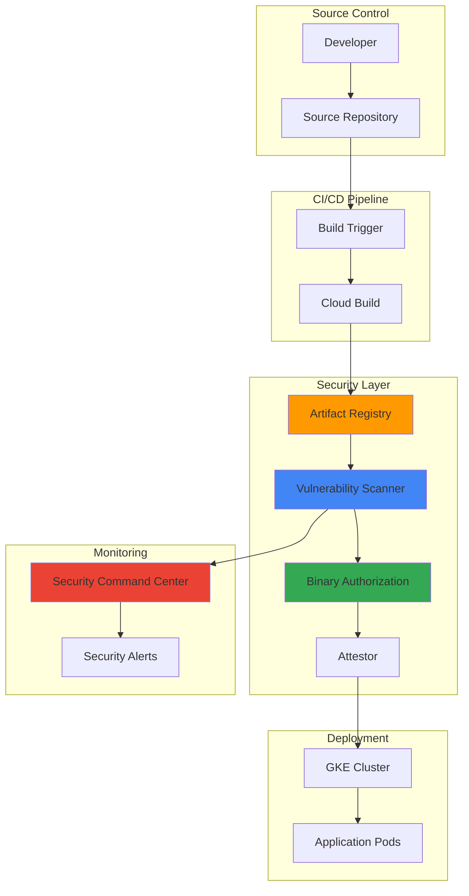

# Container Security Scanning with Artifact Registry and Cloud Build

## Problem

Enterprise organizations deploying containerized applications face significant security challenges in their CI/CD pipelines. Without automated vulnerability scanning and policy enforcement, insecure container images can reach production environments, exposing applications to known security vulnerabilities, malware, and compliance violations. Manual security reviews create bottlenecks that slow development velocity while inconsistent security gates across environments lead to gaps in security posture and potential regulatory non-compliance.

## Solution

Implement an automated container security scanning and policy enforcement pipeline using Artifact Registry's built-in vulnerability scanning, Cloud Build for CI/CD automation, and Binary Authorization for deployment gates. This solution automatically scans container images for vulnerabilities upon push, enforces security policies through attestations, and prevents vulnerable images from being deployed to production environments while maintaining development velocity.

## Architecture Diagram



## Prerequisites

1. Google Cloud project with billing enabled and appropriate IAM permissions (Container Analysis Admin, Artifact Registry Admin, Binary Authorization Admin)
2. Google Cloud CLI v450.0.0 or later installed and configured
3. Docker installed locally for container image testing
4. Basic understanding of Kubernetes, container security, and CI/CD concepts
5. Estimated cost: $10-30 per month for development workloads (varies by image size and scan frequency)

> **Note**: Container vulnerability scanning in Artifact Registry is included at no additional cost for Docker repositories, while Binary Authorization requires Google Cloud's premium tier for production workloads.

## Preparation

```bash
# Set environment variables for Google Cloud resources
export PROJECT_ID=$(gcloud config get-value project)
export REGION="us-central1"
export ZONE="us-central1-a"

# Generate unique suffix for resource names
RANDOM_SUFFIX=$(openssl rand -hex 3)
export REPO_NAME="secure-app-${RANDOM_SUFFIX}"
export CLUSTER_NAME="security-cluster-${RANDOM_SUFFIX}"
export SERVICE_ACCOUNT_NAME="security-scanner-${RANDOM_SUFFIX}"

# Set default project and region
gcloud config set project ${PROJECT_ID}
gcloud config set compute/region ${REGION}
gcloud config set compute/zone ${ZONE}

# Enable required Google Cloud APIs
gcloud services enable \
    artifactregistry.googleapis.com \
    cloudbuild.googleapis.com \
    container.googleapis.com \
    binaryauthorization.googleapis.com \
    containeranalysis.googleapis.com \
    securitycenter.googleapis.com \
    cloudkms.googleapis.com

echo "✅ Project configured: ${PROJECT_ID}"
echo "✅ Repository name: ${REPO_NAME}"
echo "✅ Cluster name: ${CLUSTER_NAME}"
```

## Steps

1. **Create Artifact Registry Repository with Vulnerability Scanning**:

   Artifact Registry provides centralized container image storage with built-in vulnerability scanning capabilities. When enabled, it automatically scans container images for known security vulnerabilities using Google's comprehensive vulnerability database, which includes CVE data from multiple sources including OS package maintainers and the GitHub Advisory Database.

   ```bash
   # Create Docker repository in Artifact Registry
   gcloud artifacts repositories create ${REPO_NAME} \
       --repository-format=docker \
       --location=${REGION} \
       --description="Secure container repository with vulnerability scanning"

   # Configure Docker authentication for Artifact Registry
   gcloud auth configure-docker ${REGION}-docker.pkg.dev

   echo "✅ Artifact Registry repository created with vulnerability scanning enabled"
   ```

   The repository is now configured to automatically scan all pushed container images for vulnerabilities in both OS packages and application dependencies. Vulnerability scanning is enabled by default for new Docker repositories in Artifact Registry, providing immediate security analysis upon image push with continuous monitoring for newly discovered vulnerabilities.

2. **Create GKE Cluster with Binary Authorization**:

   Google Kubernetes Engine with Binary Authorization enabled provides deployment-time security controls that ensure only trusted and verified container images can run in your cluster. This creates a security gate that prevents vulnerable or unauthorized images from being deployed.

   ```bash
   # Create GKE cluster with Binary Authorization enabled
   gcloud container clusters create ${CLUSTER_NAME} \
       --zone=${ZONE} \
       --enable-binauthz \
       --enable-autorepair \
       --enable-autoupgrade \
       --num-nodes=2 \
       --machine-type=e2-medium \
       --disk-size=30GB

   # Get cluster credentials for kubectl
   gcloud container clusters get-credentials ${CLUSTER_NAME} \
       --zone=${ZONE}

   echo "✅ GKE cluster created with Binary Authorization enabled"
   ```

   The cluster is now configured to enforce Binary Authorization policies, which will evaluate container images against security policies before allowing deployment. This provides runtime protection by ensuring only compliant images can execute in your production environment.

3. **Set up Service Account for Automation**:

   A dedicated service account with precise permissions enables automated security scanning and attestation processes while following the principle of least privilege. This service account will be used by Cloud Build to create security attestations.

   ```bash
   # Create service account for security automation
   gcloud iam service-accounts create ${SERVICE_ACCOUNT_NAME} \
       --display-name="Security Scanner Service Account" \
       --description="Service account for automated security scanning and attestation"

   # Grant necessary permissions for Binary Authorization
   gcloud projects add-iam-policy-binding ${PROJECT_ID} \
       --member="serviceAccount:${SERVICE_ACCOUNT_NAME}@${PROJECT_ID}.iam.gserviceaccount.com" \
       --role="roles/binaryauthorization.attestorsAdmin"

   gcloud projects add-iam-policy-binding ${PROJECT_ID} \
       --member="serviceAccount:${SERVICE_ACCOUNT_NAME}@${PROJECT_ID}.iam.gserviceaccount.com" \
       --role="roles/containeranalysis.notes.editor"

   # Grant Cloud Build service account permission to use the security service account
   CLOUD_BUILD_SA="${PROJECT_ID}@cloudbuild.gserviceaccount.com"
   gcloud iam service-accounts add-iam-policy-binding \
       ${SERVICE_ACCOUNT_NAME}@${PROJECT_ID}.iam.gserviceaccount.com \
       --member="serviceAccount:${CLOUD_BUILD_SA}" \
       --role="roles/iam.serviceAccountTokenCreator"

   echo "✅ Service account created with appropriate permissions"
   ```

   The service account is now configured to create attestations and manage security metadata, enabling automated security workflows within your CI/CD pipeline while maintaining secure access controls.

4. **Create Binary Authorization Attestor**:

   An attestor in Binary Authorization represents a trusted authority that can verify that specific security requirements have been met. This cryptographic verification ensures that only images that have passed security checks can be deployed.

   ```bash
   # Create attestor note for security verification
   cat > /tmp/attestor-note.json << EOF
   {
     "name": "projects/${PROJECT_ID}/notes/security-attestor-note",
     "attestation": {
       "hint": {
         "human_readable_name": "Security vulnerability scan attestor"
       }
     }
   }
   EOF

   # Create the attestor note
   curl -X POST \
       -H "Authorization: Bearer $(gcloud auth print-access-token)" \
       -H "Content-Type: application/json" \
       --data-binary @/tmp/attestor-note.json \
       "https://containeranalysis.googleapis.com/v1/projects/${PROJECT_ID}/notes?noteId=security-attestor-note"

   # Create the Binary Authorization attestor
   gcloud container binauthz attestors create security-attestor \
       --attestation-authority-note=security-attestor-note \
       --attestation-authority-note-project=${PROJECT_ID}

   echo "✅ Binary Authorization attestor created"
   ```

   The attestor is now ready to cryptographically sign container images that pass security scans, providing a verifiable proof of security compliance that can be enforced at deployment time.

5. **Generate Cryptographic Keys for Image Signing**:

   Cryptographic key pairs enable secure signing and verification of container images. The private key signs security attestations, while the public key allows Binary Authorization to verify these signatures during deployment.

   ```bash
   # Create KMS keyring and key for signing
   gcloud kms keyrings create security-keyring \
       --location=${REGION}

   gcloud kms keys create security-signing-key \
       --location=${REGION} \
       --keyring=security-keyring \
       --purpose=asymmetric-signing \
       --default-algorithm=rsa-sign-pkcs1-4096-sha512

   # Get the key version and add to the attestor
   gcloud container binauthz attestors public-keys add \
       --attestor=security-attestor \
       --keyversion-project=${PROJECT_ID} \
       --keyversion-location=${REGION} \
       --keyversion-keyring=security-keyring \
       --keyversion-key=security-signing-key \
       --keyversion=1

   echo "✅ Cryptographic keys created and configured"
   ```

   The KMS-managed keys provide enterprise-grade security for signing operations while eliminating the need to manage private keys manually. This integration ensures that signing operations are auditable and keys are protected by Google Cloud's security infrastructure.

6. **Configure Binary Authorization Policy**:

   The Binary Authorization policy defines security requirements that must be met before container images can be deployed. This policy acts as a security gate, preventing unauthorized or vulnerable images from running in production.

   ```bash
   # Create Binary Authorization policy
   cat > /tmp/binauthz-policy.yaml << EOF
   defaultAdmissionRule:
     requireAttestationsBy:
     - projects/${PROJECT_ID}/attestors/security-attestor
     enforcementMode: ENFORCED_BLOCK_AND_AUDIT_LOG
   globalPolicyEvaluationMode: ENABLE
   admissionWhitelistPatterns:
   - namePattern: gcr.io/gke-release/*
   - namePattern: gcr.io/google-containers/*
   - namePattern: k8s.gcr.io/*
   - namePattern: registry.k8s.io/*
   clusterAdmissionRules:
     ${ZONE}.${CLUSTER_NAME}:
       requireAttestationsBy:
       - projects/${PROJECT_ID}/attestors/security-attestor
       enforcementMode: ENFORCED_BLOCK_AND_AUDIT_LOG
   EOF

   # Import the policy
   gcloud container binauthz policy import /tmp/binauthz-policy.yaml

   echo "✅ Binary Authorization policy configured"
   ```

   The policy now requires that all container images (except system images) must have valid security attestations before deployment. This ensures that only images that have passed vulnerability scanning can run in your cluster.

7. **Create Cloud Build Pipeline with Security Integration**:

   Cloud Build automates the container building, scanning, and attestation process. This pipeline integrates security scanning results with deployment decisions, creating a fully automated security gate in your CI/CD workflow.

   ```bash
   # Create sample application directory
   mkdir -p /tmp/secure-app
   cd /tmp/secure-app

   # Create simple Flask application
   cat > app.py << EOF
   from flask import Flask
   import os

   app = Flask(__name__)

   @app.route('/')
   def hello():
       return f"Secure Application Running! Environment: {os.getenv('ENV', 'development')}"

   @app.route('/health')
   def health():
       return {"status": "healthy", "version": "1.0.0"}

   if __name__ == '__main__':
       app.run(host='0.0.0.0', port=8080)
   EOF

   # Create requirements file
   cat > requirements.txt << EOF
   Flask==3.0.0
   Werkzeug==3.0.1
   EOF

   # Create Dockerfile
   cat > Dockerfile << EOF
   FROM python:3.11-slim

   WORKDIR /app
   COPY requirements.txt .
   RUN pip install --no-cache-dir -r requirements.txt
   COPY app.py .

   EXPOSE 8080
   CMD ["python", "app.py"]
   EOF

   echo "✅ Sample application created"
   ```

   The sample application provides a simple web service that can be used to test the complete security scanning and deployment pipeline with realistic container image characteristics.

8. **Create Cloud Build Configuration with Security Scanning**:

   The Cloud Build configuration automates the entire security workflow, from building container images to scanning for vulnerabilities and creating security attestations based on scan results.

   ```bash
   # Create Cloud Build configuration
   cat > cloudbuild.yaml << EOF
   steps:
   # Build the container image
   - name: 'gcr.io/cloud-builders/docker'
     args: ['build', '-t', '${REGION}-docker.pkg.dev/${PROJECT_ID}/${REPO_NAME}/secure-app:\$SHORT_SHA', '.']

   # Push image to Artifact Registry
   - name: 'gcr.io/cloud-builders/docker'
     args: ['push', '${REGION}-docker.pkg.dev/${PROJECT_ID}/${REPO_NAME}/secure-app:\$SHORT_SHA']

   # Wait for vulnerability scanning to complete
   - name: 'gcr.io/cloud-builders/gcloud'
     entrypoint: 'bash'
     args:
     - '-c'
     - |
       echo "Waiting for vulnerability scan to complete..."
       for i in {1..30}; do
         SCAN_STATUS=\$(gcloud artifacts docker images scan ${REGION}-docker.pkg.dev/${PROJECT_ID}/${REPO_NAME}/secure-app:\$SHORT_SHA --format="value(status)" 2>/dev/null || echo "SCANNING")
         if [[ "\$SCAN_STATUS" == "FINISHED" ]]; then
           echo "Vulnerability scan completed"
           break
         fi
         echo "Scan in progress... (\$i/30)"
         sleep 10
       done

   # Check vulnerability scan results
   - name: 'gcr.io/cloud-builders/gcloud'
     entrypoint: 'bash'
     args:
     - '-c'
     - |
       echo "Checking vulnerability scan results..."
       CRITICAL_VULNS=\$(gcloud artifacts docker images list-vulnerabilities ${REGION}-docker.pkg.dev/${PROJECT_ID}/${REPO_NAME}/secure-app:\$SHORT_SHA --format="value(vulnerability.severity)" --filter="vulnerability.severity=CRITICAL" 2>/dev/null | wc -l)
       HIGH_VULNS=\$(gcloud artifacts docker images list-vulnerabilities ${REGION}-docker.pkg.dev/${PROJECT_ID}/${REPO_NAME}/secure-app:\$SHORT_SHA --format="value(vulnerability.severity)" --filter="vulnerability.severity=HIGH" 2>/dev/null | wc -l)
       
       echo "Critical vulnerabilities: \$CRITICAL_VULNS"
       echo "High vulnerabilities: \$HIGH_VULNS"
       
       if [[ \$CRITICAL_VULNS -gt 0 ]]; then
         echo "FAIL: Critical vulnerabilities found. Deployment blocked."
         exit 1
       fi
       
       if [[ \$HIGH_VULNS -gt 5 ]]; then
         echo "FAIL: Too many high-severity vulnerabilities (\$HIGH_VULNS > 5). Deployment blocked."
         exit 1
       fi
       
       echo "PASS: Image meets security requirements"

   # Create security attestation
   - name: 'gcr.io/cloud-builders/gcloud'
     entrypoint: 'bash'
     args:
     - '-c'
     - |
       echo "Creating security attestation..."
       
       # Get image digest
       IMAGE_DIGEST=\$(gcloud artifacts docker images describe ${REGION}-docker.pkg.dev/${PROJECT_ID}/${REPO_NAME}/secure-app:\$SHORT_SHA --format="value(image_summary.digest)")
       IMAGE_URL="${REGION}-docker.pkg.dev/${PROJECT_ID}/${REPO_NAME}/secure-app@\$IMAGE_DIGEST"
       
       # Create attestation payload
       PAYLOAD=\$(echo -n "{\"timestamp\":\"\$(date -u +%Y-%m-%dT%H:%M:%SZ)\",\"vulnerabilities_checked\":true,\"policy_compliant\":true}" | base64 -w 0)
       
       # Create the attestation
       gcloud container binauthz attestations create \
         --artifact-url="\$IMAGE_URL" \
         --attestor=security-attestor \
         --signature-file=<(gcloud kms asymmetric-sign \
           --key=security-signing-key \
           --keyring=security-keyring \
           --location=${REGION} \
           --digest-algorithm=sha512 \
           --input-file=<(echo -n "{\"timestamp\":\"\$(date -u +%Y-%m-%dT%H:%M:%SZ)\",\"vulnerabilities_checked\":true,\"policy_compliant\":true}") \
           --format="value(signature)") \
         --payload-file=<(echo -n "{\"timestamp\":\"\$(date -u +%Y-%m-%dT%H:%M:%SZ)\",\"vulnerabilities_checked\":true,\"policy_compliant\":true}")
       
       echo "✅ Security attestation created for image"

   images:
   - '${REGION}-docker.pkg.dev/${PROJECT_ID}/${REPO_NAME}/secure-app:\$SHORT_SHA'

   serviceAccount: 'projects/${PROJECT_ID}/serviceAccounts/${SERVICE_ACCOUNT_NAME}@${PROJECT_ID}.iam.gserviceaccount.com'
   EOF

   echo "✅ Cloud Build configuration created"
   ```

   This comprehensive build pipeline automatically scans container images for vulnerabilities, applies security policies, and creates cryptographic attestations for compliant images, ensuring that only secure containers can be deployed.

## Validation & Testing

1. **Execute the Security Pipeline**:

   ```bash
   # Submit the build to Cloud Build
   cd /tmp/secure-app
   gcloud builds submit --config=cloudbuild.yaml

   # Monitor build progress
   echo "Build submitted. Monitor progress at:"
   echo "https://console.cloud.google.com/cloud-build/builds?project=${PROJECT_ID}"
   ```

   Expected output: Build should complete successfully with vulnerability scanning and attestation creation.

2. **Verify Vulnerability Scan Results**:

   ```bash
   # Get the latest image SHA
   IMAGE_SHA=$(gcloud builds list --limit=1 --format="value(substitutions.SHORT_SHA)")
   
   # Check vulnerability scan results
   gcloud artifacts docker images list-vulnerabilities \
       ${REGION}-docker.pkg.dev/${PROJECT_ID}/${REPO_NAME}/secure-app:${IMAGE_SHA} \
       --format="table(vulnerability.severity,vulnerability.cvssScore,vulnerability.packageIssue.affectedLocation.package.name)"

   # View detailed security information
   gcloud artifacts docker images describe \
       ${REGION}-docker.pkg.dev/${PROJECT_ID}/${REPO_NAME}/secure-app:${IMAGE_SHA} \
       --show-package-vulnerability
   ```

   Expected output: Detailed vulnerability report showing security assessment results.

3. **Test Binary Authorization Enforcement**:

   ```bash
   # Get the latest image SHA
   IMAGE_SHA=$(gcloud builds list --limit=1 --format="value(substitutions.SHORT_SHA)")
   
   # Try to deploy the attested image (should succeed)
   kubectl create deployment secure-app \
       --image=${REGION}-docker.pkg.dev/${PROJECT_ID}/${REPO_NAME}/secure-app:${IMAGE_SHA}

   # Verify deployment status
   kubectl get deployments
   kubectl get pods

   # Test with unauthorized image (should fail)
   kubectl create deployment unauthorized-app \
       --image=nginx:latest
   ```

   Expected output: Attested image deploys successfully; unauthorized image deployment is blocked.

4. **Verify Security Command Center Integration**:

   ```bash
   # Check Security Command Center for findings
   gcloud scc findings list \
       --organization=$(gcloud organizations list --format="value(name)" --limit=1) \
       --filter="category='VULNERABILITY'" \
       --limit=10
   ```

   Expected output: Security findings related to container vulnerabilities appear in Security Command Center.

## Cleanup

1. **Remove Kubernetes deployments**:

   ```bash
   # Delete deployments
   kubectl delete deployment secure-app --ignore-not-found=true
   kubectl delete deployment unauthorized-app --ignore-not-found=true

   echo "✅ Kubernetes deployments removed"
   ```

2. **Delete GKE cluster**:

   ```bash
   # Delete the GKE cluster
   gcloud container clusters delete ${CLUSTER_NAME} \
       --zone=${ZONE} \
       --quiet

   echo "✅ GKE cluster deleted"
   ```

3. **Remove Binary Authorization resources**:

   ```bash
   # Delete attestor
   gcloud container binauthz attestors delete security-attestor --quiet

   # Delete Container Analysis note
   curl -X DELETE \
       -H "Authorization: Bearer $(gcloud auth print-access-token)" \
       "https://containeranalysis.googleapis.com/v1/projects/${PROJECT_ID}/notes/security-attestor-note"

   echo "✅ Binary Authorization resources removed"
   ```

4. **Delete KMS resources**:

   ```bash
   # Delete KMS key and keyring (note: keyrings cannot be deleted, only disabled)
   gcloud kms keys versions destroy 1 \
       --key=security-signing-key \
       --keyring=security-keyring \
       --location=${REGION} \
       --quiet

   echo "✅ KMS resources cleaned up"
   ```

5. **Remove Artifact Registry and service accounts**:

   ```bash
   # Delete Artifact Registry repository
   gcloud artifacts repositories delete ${REPO_NAME} \
       --location=${REGION} \
       --quiet

   # Delete service account
   gcloud iam service-accounts delete \
       ${SERVICE_ACCOUNT_NAME}@${PROJECT_ID}.iam.gserviceaccount.com \
       --quiet

   # Clean up local files
   rm -rf /tmp/secure-app
   rm -f /tmp/attestor-note.json /tmp/binauthz-policy.yaml

   echo "✅ All resources cleaned up successfully"
   ```

## Discussion

This comprehensive security automation solution demonstrates how Google Cloud's integrated security services can create a robust defense-in-depth strategy for containerized applications. By combining Artifact Registry's vulnerability scanning with Binary Authorization's policy enforcement, organizations can automate security validation without compromising development velocity.

The architecture provides multiple security benefits: Artifact Registry automatically scans container images for vulnerabilities in both OS packages and application dependencies using Google's comprehensive vulnerability database. Binary Authorization creates a cryptographic trust boundary that prevents unsigned or vulnerable images from reaching production environments. Security Command Center provides centralized visibility into security findings across your infrastructure, enabling security teams to track and respond to threats effectively.

The integration of these services creates a seamless security workflow where vulnerability scanning results directly influence deployment decisions. Images with critical vulnerabilities are automatically blocked from deployment, while compliant images receive cryptographic attestations that enable automatic deployment. This approach reduces manual security reviews while maintaining high security standards.

From an operational perspective, this solution supports GitOps methodologies by treating security policies as code. The Binary Authorization policies, Cloud Build configurations, and attestor definitions can all be version-controlled and managed through infrastructure-as-code practices. This ensures consistent security enforcement across environments and provides audit trails for compliance requirements.

The economic benefits include reduced security incident costs through early vulnerability detection, improved developer productivity through automated security gates, and decreased operational overhead through centralized security management. Organizations typically see a reduction in time-to-remediation for security issues and improved compliance posture through automated policy enforcement.

> **Tip**: Monitor vulnerability scan results over time to identify patterns in your base images and dependencies. Consider implementing automated base image updates and dependency scanning in your development workflow to prevent vulnerabilities from entering your pipeline.

For comprehensive documentation on container security best practices, see the [Google Cloud Container Security Guide](https://cloud.google.com/security/container-security). Additional information on Binary Authorization can be found in the [Binary Authorization Documentation](https://cloud.google.com/binary-authorization/docs). For vulnerability scanning details, refer to the [Artifact Analysis Documentation](https://cloud.google.com/artifact-analysis/docs). Security Command Center integration is documented in the [Security Command Center Guide](https://cloud.google.com/security-command-center/docs). For CI/CD security best practices, consult the [Secure CI/CD Best Practices](https://cloud.google.com/architecture/devops/devops-tech-continuous-integration).

## Challenge

Extend this security automation solution by implementing these advanced enhancements:

1. **Multi-Environment Security Policies**: Create different Binary Authorization policies for development, staging, and production environments with progressively stricter security requirements and automated policy promotion workflows.

2. **Advanced Vulnerability Management**: Implement vulnerability allowlisting for accepted risks, automated vulnerability reporting to security teams, and integration with third-party security scanning tools for comprehensive coverage.

3. **Runtime Security Monitoring**: Add GKE Security Posture monitoring and runtime threat detection using Security Command Center's advanced features to monitor running containers for suspicious behavior.

4. **Supply Chain Security**: Implement SLSA (Supply-chain Levels for Software Artifacts) compliance by adding provenance attestations, build environment verification, and dependency tracking throughout the software supply chain.

5. **Automated Remediation Workflows**: Create automated workflows that trigger security updates, dependency upgrades, and image rebuilds when new vulnerabilities are discovered in existing images.

## Infrastructure Code

*Infrastructure code will be generated after recipe approval.*