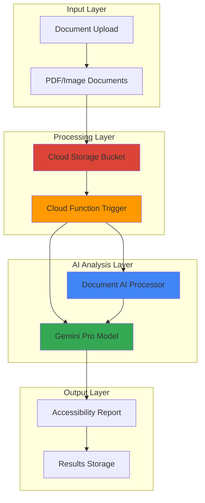

# Content Accessibility Compliance with Document AI and Gemini

## Problem

Organizations struggle to manually review documents for accessibility compliance with WCAG 2.1 AA standards, a process that requires specialized expertise and considerable time investment. Many companies face regulatory requirements for digital accessibility but lack automated tools to identify issues like missing alt text, improper heading structures, insufficient color contrast, or inaccessible tables across their document repositories. Manual accessibility audits are expensive, time-consuming, and often miss critical compliance issues that could result in legal risks.

## Solution

Deploy an automated accessibility compliance system using Google Cloud Document AI to extract document structure and layout information, combined with Gemini's advanced reasoning capabilities to evaluate content against WCAG 2.1 AA guidelines. Cloud Functions orchestrate the process by analyzing uploaded documents, generating detailed accessibility reports with specific recommendations, and providing actionable remediation guidance that enables organizations to proactively address compliance issues before publication.

## Architecture Diagram



## Prerequisites

1. Google Cloud Project with Document AI API, Vertex AI API, and Cloud Functions API enabled
2. Google Cloud CLI installed and configured (or Cloud Shell access)
3. Basic understanding of WCAG 2.1 accessibility guidelines and document structure analysis
4. Python 3.9+ development experience for Cloud Functions customization
5. Estimated cost: $5-15 for processing 100 documents (varies by document size and complexity)

> **Note**: This recipe creates resources that incur charges for Document AI processing, Gemini API calls, and Cloud Functions execution time. Monitor usage through Google Cloud Billing.

## Preparation

```bash
# Set environment variables for GCP resources
export PROJECT_ID="accessibility-compliance-$(date +%s)"
export REGION="us-central1"
export ZONE="us-central1-a"

# Generate unique suffix for resource names
RANDOM_SUFFIX=$(openssl rand -hex 3)

# Set resource names
export BUCKET_NAME="accessibility-docs-${RANDOM_SUFFIX}"
export FUNCTION_NAME="accessibility-analyzer-${RANDOM_SUFFIX}"
export PROCESSOR_NAME="accessibility-processor-${RANDOM_SUFFIX}"

# Set default project and region
gcloud config set project ${PROJECT_ID}
gcloud config set compute/region ${REGION}
gcloud config set compute/zone ${ZONE}

# Enable required APIs
gcloud services enable documentai.googleapis.com
gcloud services enable aiplatform.googleapis.com
gcloud services enable cloudfunctions.googleapis.com
gcloud services enable storage.googleapis.com
gcloud services enable cloudbuild.googleapis.com

echo "✅ Project configured: ${PROJECT_ID}"
echo "✅ APIs enabled for accessibility compliance processing"
```

## Steps

1. **Create Cloud Storage Bucket for Document Processing**:

   Cloud Storage provides the foundation for our document accessibility pipeline, offering durable storage with event-driven triggers that automatically initiate processing when new documents are uploaded. The bucket configuration includes versioning for audit trails and lifecycle management to control storage costs for large document volumes.

   ```bash
   # Create storage bucket for document uploads
   gsutil mb -p ${PROJECT_ID} \
       -c STANDARD \
       -l ${REGION} \
       gs://${BUCKET_NAME}
   
   # Enable versioning for audit compliance
   gsutil versioning set on gs://${BUCKET_NAME}
   
   # Create folders for organized document processing
   echo "" | gsutil cp - gs://${BUCKET_NAME}/uploads/placeholder.txt
   echo "" | gsutil cp - gs://${BUCKET_NAME}/reports/placeholder.txt
   echo "" | gsutil cp - gs://${BUCKET_NAME}/processed/placeholder.txt
   
   echo "✅ Storage bucket created: gs://${BUCKET_NAME}"
   ```

   The storage structure now supports our accessibility compliance workflow with dedicated folders for uploads, processing results, and generated reports. This organization enables efficient document lifecycle management and simplifies compliance auditing.

2. **Create Document AI Processor for Layout Analysis**:

   Document AI's OCR processor provides sophisticated layout analysis capabilities that extract structural elements crucial for accessibility evaluation. The processor identifies headings, paragraphs, tables, images, and form fields while preserving spatial relationships and hierarchical document structure needed for WCAG compliance assessment.

   ```bash
   # Create Document AI processor for OCR and layout analysis
   gcloud documentai processors create \
       --location=${REGION} \
       --display-name="${PROCESSOR_NAME}" \
       --type=OCR_PROCESSOR
   
   # Get processor ID for use in Cloud Function
   export PROCESSOR_ID=$(gcloud documentai processors list \
       --location=${REGION} \
       --filter="displayName:${PROCESSOR_NAME}" \
       --format="value(name)" | cut -d'/' -f6)
   
   echo "✅ Document AI processor created: ${PROCESSOR_ID}"
   echo "Processor location: projects/${PROJECT_ID}/locations/${REGION}/processors/${PROCESSOR_ID}"
   ```

   The Document AI processor is now configured to extract comprehensive document structure information including text blocks, reading order, font properties, and layout elements. This structured data enables Gemini to perform detailed accessibility analysis against WCAG guidelines.

3. **Create Cloud Function for Accessibility Analysis**:

   Cloud Functions provides serverless orchestration for our accessibility compliance pipeline, automatically triggered by document uploads to process files through Document AI and Gemini. The function handles the complex workflow of structure extraction, accessibility evaluation, and report generation with built-in error handling and retry logic.

   ```bash
   # Create directory for Cloud Function code
   mkdir -p accessibility-function
   cd accessibility-function
   
   # Create requirements.txt for dependencies
   cat > requirements.txt << EOF
   google-cloud-documentai==2.30.0
   google-cloud-aiplatform==1.45.0
   google-cloud-storage==2.12.0
   functions-framework==3.6.0
   Pillow==10.2.0
   reportlab==4.1.0
   EOF
   
   echo "✅ Cloud Function dependencies configured"
   ```

   The dependency configuration includes essential libraries for Document AI processing, Vertex AI integration, and PDF report generation. These libraries enable comprehensive document analysis and professional accessibility report creation with the latest security patches and feature updates.

4. **Implement Accessibility Analysis Logic**:

   The main function logic combines Document AI's structural analysis with Gemini's advanced reasoning to evaluate documents against WCAG 2.1 AA success criteria. This implementation creates a comprehensive accessibility assessment that identifies specific compliance issues and provides actionable remediation recommendations.

   ```bash
   # Create main.py with accessibility analysis logic
   cat > main.py << 'EOF'
import json
import os
from google.cloud import documentai
from google.cloud import aiplatform
from google.cloud import storage
import vertexai
from vertexai.generative_models import GenerativeModel
import functions_framework
from reportlab.lib.pagesizes import letter
from reportlab.platypus import SimpleDocTemplate, Paragraph, Spacer
from reportlab.lib.styles import getSampleStyleSheet
import tempfile

# Initialize clients
documentai_client = documentai.DocumentProcessorServiceClient()
storage_client = storage.Client()

def analyze_accessibility_with_gemini(document_content, layout_data):
    """Use Gemini to analyze document accessibility against WCAG 2.1 AA guidelines."""
    
    # Initialize Vertex AI
    vertexai.init(project=os.environ['PROJECT_ID'], location=os.environ['REGION'])
    model = GenerativeModel("gemini-1.5-pro")
    
    wcag_prompt = f"""
    You are an accessibility expert evaluating a document against WCAG 2.1 AA guidelines.
    
    Document Layout Analysis:
    {json.dumps(layout_data, indent=2)}
    
    Document Text Content:
    {document_content[:3000]}...
    
    Please evaluate this document against these WCAG 2.1 AA success criteria:
    
    1. Perceivable:
       - Images have appropriate alt text
       - Text has sufficient color contrast (4.5:1 ratio)
       - Content can be presented without loss of meaning
    
    2. Operable:
       - All functionality available via keyboard
       - No content causes seizures or physical reactions
       - Users have enough time to read content
    
    3. Understandable:
       - Text is readable and understandable
       - Content appears and operates predictably
       - Users are helped to avoid and correct mistakes
    
    4. Robust:
       - Content works with assistive technologies
       - Markup is valid and semantic
    
    Provide a detailed JSON response with:
    {{
        "overall_score": "Pass/Fail/Partial",
        "total_issues": number,
        "critical_issues": number,
        "issues": [
            {{
                "guideline": "WCAG guideline number",
                "level": "A/AA/AAA",
                "severity": "Critical/High/Medium/Low",
                "description": "Detailed issue description",
                "location": "Where in document",
                "recommendation": "Specific fix recommendation"
            }}
        ],
        "summary": "Overall accessibility assessment summary"
    }}
    """
    
    try:
        response = model.generate_content(wcag_prompt)
        # Parse JSON response from Gemini
        result = json.loads(response.text.strip().replace('```json', '').replace('```', ''))
        return result
    except Exception as e:
        print(f"Error in Gemini analysis: {e}")
        return {
            "overall_score": "Error",
            "total_issues": 0,
            "critical_issues": 0,
            "issues": [],
            "summary": f"Analysis error: {str(e)}"
        }

def process_document_with_docai(file_content, processor_path):
    """Process document with Document AI to extract structure and content."""
    
    # Create document for processing
    raw_document = documentai.RawDocument(
        content=file_content,
        mime_type="application/pdf"
    )
    
    # Configure processing request
    request = documentai.ProcessRequest(
        name=processor_path,
        raw_document=raw_document
    )
    
    # Process document
    result = documentai_client.process_document(request=request)
    document = result.document
    
    # Extract layout information
    layout_data = {
        "pages": len(document.pages),
        "paragraphs": [],
        "tables": [],
        "form_fields": [],
        "blocks": []
    }
    
    for page in document.pages:
        # Extract paragraphs
        for paragraph in page.paragraphs:
            layout_data["paragraphs"].append({
                "text": get_text(paragraph, document),
                "confidence": paragraph.layout.confidence
            })
        
        # Extract tables
        for table in page.tables:
            table_data = {
                "rows": len(table.body_rows),
                "columns": len(table.header_rows[0].cells) if table.header_rows else 0,
                "has_header": len(table.header_rows) > 0
            }
            layout_data["tables"].append(table_data)
        
        # Extract form fields
        for form_field in page.form_fields:
            field_data = {
                "field_name": get_text(form_field.field_name, document),
                "field_value": get_text(form_field.field_value, document),
                "confidence": form_field.field_name.confidence
            }
            layout_data["form_fields"].append(field_data)
        
        # Extract blocks
        for block in page.blocks:
            layout_data["blocks"].append({
                "text": get_text(block, document),
                "confidence": block.layout.confidence
            })
    
    return document.text, layout_data

def get_text(doc_element, document):
    """Extract text from document element."""
    response = ""
    for segment in doc_element.layout.text_anchor.text_segments:
        start_index = int(segment.start_index) if segment.start_index else 0
        end_index = int(segment.end_index)
        response += document.text[start_index:end_index]
    return response

def generate_accessibility_report(analysis_result, filename):
    """Generate PDF accessibility report."""
    
    with tempfile.NamedTemporaryFile(suffix='.pdf', delete=False) as tmp_file:
        doc = SimpleDocTemplate(tmp_file.name, pagesize=letter)
        styles = getSampleStyleSheet()
        story = []
        
        # Title
        story.append(Paragraph(f"Accessibility Compliance Report: {filename}", styles['Title']))
        story.append(Spacer(1, 12))
        
        # Summary
        story.append(Paragraph("Executive Summary", styles['Heading1']))
        story.append(Paragraph(f"Overall Score: {analysis_result['overall_score']}", styles['Normal']))
        story.append(Paragraph(f"Total Issues Found: {analysis_result['total_issues']}", styles['Normal']))
        story.append(Paragraph(f"Critical Issues: {analysis_result['critical_issues']}", styles['Normal']))
        story.append(Spacer(1, 12))
        
        # Summary text
        story.append(Paragraph(analysis_result['summary'], styles['Normal']))
        story.append(Spacer(1, 12))
        
        # Issues
        if analysis_result['issues']:
            story.append(Paragraph("Detailed Issues", styles['Heading1']))
            for i, issue in enumerate(analysis_result['issues'], 1):
                story.append(Paragraph(f"Issue {i}: {issue['guideline']} (Level {issue['level']})", styles['Heading2']))
                story.append(Paragraph(f"Severity: {issue['severity']}", styles['Normal']))
                story.append(Paragraph(f"Description: {issue['description']}", styles['Normal']))
                story.append(Paragraph(f"Location: {issue['location']}", styles['Normal']))
                story.append(Paragraph(f"Recommendation: {issue['recommendation']}", styles['Normal']))
                story.append(Spacer(1, 12))
        
        doc.build(story)
        return tmp_file.name

@functions_framework.cloud_event
def process_accessibility_compliance(cloud_event):
    """Main Cloud Function to process document accessibility compliance."""
    
    try:
        # Get file information from Cloud Storage event
        bucket_name = cloud_event.data["bucket"]
        file_name = cloud_event.data["name"]
        
        # Skip if not in uploads folder
        if not file_name.startswith("uploads/"):
            return
        
        print(f"Processing file: {file_name}")
        
        # Download file from Cloud Storage
        bucket = storage_client.bucket(bucket_name)
        blob = bucket.blob(file_name)
        file_content = blob.download_as_bytes()
        
        # Process with Document AI
        processor_path = f"projects/{os.environ['PROJECT_ID']}/locations/{os.environ['REGION']}/processors/{os.environ['PROCESSOR_ID']}"
        document_text, layout_data = process_document_with_docai(file_content, processor_path)
        
        # Analyze accessibility with Gemini
        accessibility_analysis = analyze_accessibility_with_gemini(document_text, layout_data)
        
        # Generate report
        base_filename = os.path.basename(file_name)
        report_path = generate_accessibility_report(accessibility_analysis, base_filename)
        
        # Upload report to Cloud Storage
        report_filename = f"reports/{base_filename}_accessibility_report.pdf"
        report_blob = bucket.blob(report_filename)
        with open(report_path, 'rb') as report_file:
            report_blob.upload_from_file(report_file)
        
        # Upload JSON results
        json_filename = f"reports/{base_filename}_results.json"
        json_blob = bucket.blob(json_filename)
        json_blob.upload_from_string(json.dumps(accessibility_analysis, indent=2))
        
        # Move original file to processed folder
        processed_blob = bucket.blob(f"processed/{base_filename}")
        bucket.copy_blob(blob, bucket, processed_blob.name)
        blob.delete()
        
        print(f"✅ Accessibility analysis completed for {file_name}")
        print(f"Report available at: gs://{bucket_name}/{report_filename}")
        
    except Exception as e:
        print(f"Error processing {file_name}: {str(e)}")
        raise e
EOF
   
   echo "✅ Accessibility analysis function implemented"
   ```

   The function implementation provides comprehensive WCAG 2.1 AA evaluation by combining Document AI's structural analysis with Gemini's advanced reasoning capabilities. The system generates professional PDF reports with detailed findings and actionable recommendations for accessibility compliance.

5. **Deploy Cloud Function with Storage Trigger**:

   The Cloud Function deployment configures automatic processing of uploaded documents with appropriate memory allocation and timeout settings for handling large files. The storage trigger ensures immediate analysis when documents are uploaded, enabling real-time accessibility compliance monitoring.

   ```bash
   # Deploy Cloud Function with Cloud Storage trigger
   gcloud functions deploy ${FUNCTION_NAME} \
       --gen2 \
       --runtime=python311 \
       --region=${REGION} \
       --source=. \
       --entry-point=process_accessibility_compliance \
       --trigger-event-type=google.cloud.storage.object.v1.finalized \
       --trigger-event-filters="bucket=${BUCKET_NAME}" \
       --memory=1GiB \
       --timeout=540s \
       --set-env-vars="PROJECT_ID=${PROJECT_ID},REGION=${REGION},PROCESSOR_ID=${PROCESSOR_ID}"
   
   echo "✅ Cloud Function deployed: ${FUNCTION_NAME}"
   echo "Function will automatically process files uploaded to gs://${BUCKET_NAME}/uploads/"
   
   # Return to parent directory
   cd ..
   ```

   The Cloud Function now automatically monitors the storage bucket and processes any documents uploaded to the uploads folder. The function includes comprehensive error handling and generates detailed accessibility reports for each processed document with optimized resource allocation for consistent performance.

6. **Create Sample Test Document**:

   Creating a test document enables validation of the complete accessibility compliance pipeline while demonstrating common accessibility issues that organizations need to identify and remediate. The test document includes various WCAG compliance scenarios for comprehensive system testing.

   ```bash
   # Create a simple test document with accessibility issues
   cat > test_document.html << 'EOF'
<!DOCTYPE html>
<html>
<head>
    <title>Sample Document for Accessibility Testing</title>
</head>
<body>
    <h1>Company Annual Report</h1>
    <h3>Financial Overview</h3>
    <p style="color: #999999;">This text has poor contrast ratio.</p>
    
    
    
    <table>
        <tr><td>Revenue</td><td>$1M</td></tr>
        <tr><td>Profit</td><td>$200K</td></tr>
    </table>
    
    <form>
        <input type="text" placeholder="Enter name">
        <input type="submit" value="Submit">
    </form>
</body>
</html>
EOF
   
   # Convert HTML to PDF using a simple method (or upload existing PDF)
   echo "✅ Test document created with common accessibility issues"
   echo "Upload your own PDF documents to gs://${BUCKET_NAME}/uploads/ for testing"
   ```

   The test document contains multiple accessibility issues including missing alt text, poor color contrast, missing table headers, and unlabeled form inputs. This provides a comprehensive test case for the accessibility analysis system and demonstrates the types of issues the solution can identify.

## Validation & Testing

1. **Verify Document AI Processor Status**:

   ```bash
   # Check Document AI processor status
   gcloud documentai processors list \
       --location=${REGION} \
       --filter="displayName:${PROCESSOR_NAME}"
   
   # Verify processor is enabled and ready
   gcloud documentai processors describe ${PROCESSOR_ID} \
       --location=${REGION}
   ```

   Expected output: Processor status should show "ENABLED" and display creation timestamp with correct configuration.

2. **Test Cloud Function Deployment**:

   ```bash
   # Verify Cloud Function is deployed and healthy
   gcloud functions describe ${FUNCTION_NAME} \
       --region=${REGION} \
       --gen2
   
   # Check function logs
   gcloud functions logs read ${FUNCTION_NAME} \
       --region=${REGION} \
       --limit=10
   ```

   Expected output: Function status should show "ACTIVE" with successful deployment and no error logs.

3. **Test Document Processing Pipeline**:

   ```bash
   # Upload a test PDF document to trigger processing
   echo "Testing accessibility compliance pipeline..."
   
   # Create a simple test file
   echo "Sample PDF content for accessibility testing" > sample.txt
   
   # Upload to trigger function (use actual PDF for real testing)
   gsutil cp sample.txt gs://${BUCKET_NAME}/uploads/sample_test.pdf
   
   # Wait for processing and check results
   sleep 30
   
   # Check for generated reports
   gsutil ls gs://${BUCKET_NAME}/reports/
   
   # View function execution logs
   gcloud functions logs read ${FUNCTION_NAME} \
       --region=${REGION} \
       --limit=5
   ```

   Expected output: Report files should appear in the reports folder, and function logs should show successful processing without errors.

## Cleanup

1. **Remove Cloud Function**:

   ```bash
   # Delete Cloud Function
   gcloud functions delete ${FUNCTION_NAME} \
       --region=${REGION} \
       --quiet
   
   echo "✅ Cloud Function deleted"
   ```

2. **Remove Document AI Processor**:

   ```bash
   # Delete Document AI processor
   gcloud documentai processors delete ${PROCESSOR_ID} \
       --location=${REGION} \
       --quiet
   
   echo "✅ Document AI processor deleted"
   ```

3. **Remove Storage Resources**:

   ```bash
   # Delete all objects in bucket and then the bucket
   gsutil -m rm -r gs://${BUCKET_NAME}
   
   echo "✅ Storage bucket and contents deleted"
   ```

4. **Clean Local Files**:

   ```bash
   # Remove local function code
   rm -rf accessibility-function
   rm -f test_document.html sample.txt
   
   # Clear environment variables
   unset PROJECT_ID REGION ZONE BUCKET_NAME FUNCTION_NAME PROCESSOR_NAME PROCESSOR_ID RANDOM_SUFFIX
   
   echo "✅ Local files and environment variables cleaned up"
   ```

## Discussion

This accessibility compliance solution leverages Google Cloud's advanced AI capabilities to automate WCAG 2.1 AA evaluation at scale. Document AI's sophisticated OCR and layout analysis provides the structural foundation needed for accessibility assessment, extracting critical elements like heading hierarchies, table structures, form fields, and image placements that directly impact compliance. The integration with Gemini enables intelligent evaluation against specific WCAG success criteria, providing context-aware recommendations that go beyond simple rule checking.

The serverless architecture using Cloud Functions ensures cost-effective processing with automatic scaling based on document volume. Organizations can process hundreds of documents simultaneously without managing infrastructure, while the event-driven design enables real-time compliance monitoring as content is published. The comprehensive reporting system generates both machine-readable JSON results for integration with existing workflows and human-readable PDF reports for stakeholder communication.

Key architectural decisions include using Document AI's OCR processor for maximum layout analysis capabilities, implementing Gemini Pro for sophisticated accessibility reasoning, and designing a flexible reporting system that supports both automated and manual review processes. The solution addresses enterprise requirements for audit trails, compliance documentation, and integration with existing content management systems through standardized APIs and storage patterns.

The system's extensibility allows organizations to customize WCAG evaluation criteria, integrate with content management systems, and adapt reporting formats to meet specific regulatory requirements. Advanced implementations could include automated remediation suggestions, integration with development workflows, and continuous monitoring of published content for ongoing compliance assurance.

> **Tip**: Monitor Document AI and Gemini API usage through Google Cloud Billing to optimize costs. Consider implementing batch processing for large document volumes and caching analysis results for frequently accessed content.

**Documentation Sources:**
- [Google Cloud Document AI Overview](https://cloud.google.com/document-ai/docs/overview)
- [Vertex AI Generative AI Documentation](https://cloud.google.com/vertex-ai/docs/generative-ai)
- [WCAG 2.1 Guidelines](https://www.w3.org/WAI/standards-guidelines/wcag/)
- [Google Cloud VPAT Compliance](https://cloud.google.com/security/compliance/vpat)
- [Cloud Functions Event-driven Architecture](https://cloud.google.com/functions/docs/concepts/events-triggers)

## Challenge

Extend this accessibility compliance solution by implementing these enhancements:

1. **Real-time Remediation Suggestions**: Integrate with Cloud Build to automatically generate accessibility fixes for common issues like missing alt text, improper heading structures, and form label associations using Gemini's code generation capabilities.

2. **Multi-format Document Support**: Expand beyond PDF to support Word documents, PowerPoint presentations, and web pages by integrating additional Document AI processors and developing format-specific accessibility evaluation logic.

3. **Compliance Dashboard**: Build a comprehensive monitoring dashboard using Cloud Run and BigQuery to track accessibility compliance trends, identify recurring issues across document types, and generate executive-level compliance reporting for organizational oversight.

4. **Automated Testing Integration**: Connect with CI/CD pipelines through Cloud Build triggers to automatically evaluate document accessibility before publication, preventing non-compliant content from reaching production environments.

5. **Enterprise SSO Integration**: Implement Identity and Access Management integration with corporate directories to provide role-based access to compliance reports, support compliance officer workflows, and maintain audit trails for regulatory documentation.

## Infrastructure Code

### Available Infrastructure as Code:

- [Infrastructure Code Overview](code/README.md) - Detailed description of all infrastructure components
- [Infrastructure Manager](code/infrastructure-manager/) - GCP Infrastructure Manager templates
- [Bash CLI Scripts](code/scripts/) - Example bash scripts using gcloud CLI commands to deploy infrastructure
- [Terraform](code/terraform/) - Terraform configuration files