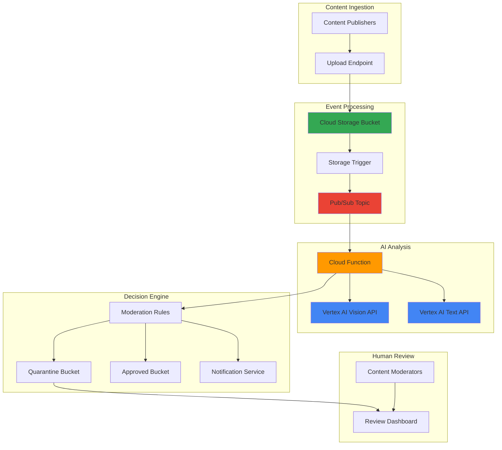

# Content Moderation with Vertex AI and Cloud Storage

## Problem

Organizations face mounting challenges from user-generated content that may contain inappropriate images, hate speech, or violate community guidelines. Manual content review processes are slow, expensive, and inconsistent, while basic keyword filtering fails to catch sophisticated violations like visual content, context-dependent language, or evolving harmful patterns that impact brand safety and regulatory compliance.

## Solution

Build an automated content moderation system using Vertex AI's multimodal capabilities to analyze both images and text in real-time. The solution leverages Cloud Storage for content ingestion, Cloud Functions for serverless processing orchestration, and Pub/Sub for reliable event-driven architecture, providing scalable content analysis with automated quarantine and human review workflows.

## Architecture Diagram



## Prerequisites

1. Google Cloud Project with billing enabled and owner/editor permissions
2. Google Cloud CLI (gcloud) installed and authenticated
3. Basic understanding of serverless architectures and event-driven systems
4. Knowledge of Python programming and Google Cloud APIs
5. Estimated cost: $10-20 for initial setup and testing (primarily Vertex AI API calls)

> **Note**: Vertex AI APIs require enabling and may have regional availability restrictions. Review [Vertex AI locations](https://cloud.google.com/vertex-ai/docs/general/locations) for supported regions.

## Preparation

```bash
# Set environment variables for project configuration
export PROJECT_ID="content-mod-$(date +%s)"
export REGION="us-central1"
export ZONE="us-central1-a"

# Generate unique suffix for resource naming
RANDOM_SUFFIX=$(openssl rand -hex 3)
export BUCKET_INCOMING="content-incoming-${RANDOM_SUFFIX}"
export BUCKET_QUARANTINE="content-quarantine-${RANDOM_SUFFIX}"
export BUCKET_APPROVED="content-approved-${RANDOM_SUFFIX}"
export TOPIC_NAME="content-moderation-${RANDOM_SUFFIX}"
export FUNCTION_NAME="content-moderator-${RANDOM_SUFFIX}"

# Create the project and set configuration
gcloud projects create ${PROJECT_ID} \
    --name="Content Moderation Demo"

gcloud config set project ${PROJECT_ID}
gcloud config set compute/region ${REGION}
gcloud config set compute/zone ${ZONE}

# Enable required APIs for the content moderation system
gcloud services enable storage.googleapis.com
gcloud services enable cloudfunctions.googleapis.com
gcloud services enable pubsub.googleapis.com
gcloud services enable aiplatform.googleapis.com
gcloud services enable eventarc.googleapis.com
gcloud services enable cloudbuild.googleapis.com

echo "✅ Project ${PROJECT_ID} configured with required APIs"
```

## Steps

1. **Create Cloud Storage Buckets for Content Workflow**:

   Cloud Storage provides the foundation for content ingestion and segregation in our moderation pipeline. We'll create three buckets: one for incoming content uploads, one for quarantined content requiring review, and one for approved content ready for publication. This segregated approach ensures content security and provides clear audit trails for compliance requirements.

   ```bash
   # Create incoming content bucket with regional storage
   gsutil mb -p ${PROJECT_ID} \
       -c STANDARD \
       -l ${REGION} \
       gs://${BUCKET_INCOMING}
   
   # Create quarantine bucket for flagged content
   gsutil mb -p ${PROJECT_ID} \
       -c STANDARD \
       -l ${REGION} \
       gs://${BUCKET_QUARANTINE}
   
   # Create approved content bucket
   gsutil mb -p ${PROJECT_ID} \
       -c STANDARD \
       -l ${REGION} \
       gs://${BUCKET_APPROVED}
   
   # Configure lifecycle policies for cost optimization
   echo '{
     "lifecycle": {
       "rule": [
         {
           "action": {"type": "SetStorageClass", "storageClass": "NEARLINE"},
           "condition": {"age": 30}
         }
       ]
     }
   }' > lifecycle.json
   
   gsutil lifecycle set lifecycle.json gs://${BUCKET_QUARANTINE}
   rm lifecycle.json
   
   echo "✅ Storage buckets created: ${BUCKET_INCOMING}, ${BUCKET_QUARANTINE}, ${BUCKET_APPROVED}"
   ```

   The storage infrastructure is now established with intelligent lifecycle policies that automatically transition quarantined content to cost-effective Nearline storage after 30 days, optimizing long-term storage costs while maintaining accessibility for compliance audits.

2. **Create Pub/Sub Topic for Event-Driven Processing**:

   Pub/Sub enables reliable, asynchronous message delivery between our storage triggers and processing functions. This decoupling ensures that content analysis can scale independently of upload volume and provides built-in retry mechanisms for handling temporary processing failures.

   ```bash
   # Create Pub/Sub topic for content moderation events
   gcloud pubsub topics create ${TOPIC_NAME} \
       --message-retention-duration=7d
   
   # Create subscription for the Cloud Function
   gcloud pubsub subscriptions create ${TOPIC_NAME}-subscription \
       --topic=${TOPIC_NAME} \
       --ack-deadline=600 \
       --message-retention-duration=7d \
       --max-delivery-attempts=3
   
   echo "✅ Pub/Sub topic and subscription created: ${TOPIC_NAME}"
   ```

   The Pub/Sub infrastructure provides reliable message delivery with extended retention periods and retry policies, ensuring no content uploads are lost during processing while preventing infinite retry loops through maximum delivery attempt limits.

3. **Create Service Account with Required Permissions**:

   Identity and Access Management (IAM) security follows the principle of least privilege by creating dedicated service accounts with minimal required permissions. This approach enhances security by limiting access scope and provides clear audit trails for compliance monitoring.

   ```bash
   # Create service account for content moderation function
   gcloud iam service-accounts create content-moderator-sa \
       --display-name="Content Moderation Service Account" \
       --description="Service account for automated content moderation"
   
   # Grant necessary permissions for Cloud Storage operations
   gcloud projects add-iam-policy-binding ${PROJECT_ID} \
       --member="serviceAccount:content-moderator-sa@${PROJECT_ID}.iam.gserviceaccount.com" \
       --role="roles/storage.objectAdmin"
   
   # Grant Vertex AI user permissions
   gcloud projects add-iam-policy-binding ${PROJECT_ID} \
       --member="serviceAccount:content-moderator-sa@${PROJECT_ID}.iam.gserviceaccount.com" \
       --role="roles/aiplatform.user"
   
   # Grant Pub/Sub publisher permissions
   gcloud projects add-iam-policy-binding ${PROJECT_ID} \
       --member="serviceAccount:content-moderator-sa@${PROJECT_ID}.iam.gserviceaccount.com" \
       --role="roles/pubsub.publisher"
   
   echo "✅ Service account created with appropriate permissions"
   ```

   The service account is now configured with minimal required permissions, enabling secure access to Vertex AI for content analysis, Cloud Storage for file operations, and Pub/Sub for event publishing while maintaining security best practices.

4. **Create Content Moderation Function**:

   Cloud Functions provides serverless execution for our content analysis logic, automatically scaling based on upload volume while minimizing operational overhead. The function integrates Vertex AI's vision and language models to analyze both visual and textual content using Google's state-of-the-art AI capabilities.

   ```bash
   # Create function directory and dependencies
   mkdir -p content-moderator
   cd content-moderator
   
   # Create requirements.txt for Python dependencies
   cat > requirements.txt << 'EOF'
   google-cloud-storage==2.14.0
   google-cloud-aiplatform==1.43.0
   google-cloud-pubsub==2.20.1
   functions-framework==3.5.0
   cloudevents>=1.6.0
   EOF
   
   # Create the main function code
   cat > main.py << 'EOF'
   import json
   import time
   from google.cloud import storage
   from google.cloud import aiplatform
   from google.cloud import pubsub_v1
   import vertexai
   from vertexai.generative_models import GenerativeModel, Part, SafetySetting
   import functions_framework
   from cloudevents.http.event import CloudEvent
   import os
   import logging
   
   # Configure logging
   logging.basicConfig(level=logging.INFO)
   logger = logging.getLogger(__name__)
   
   # Initialize clients
   PROJECT_ID = os.environ.get('GCP_PROJECT')
   REGION = os.environ.get('FUNCTION_REGION', 'us-central1')
   QUARANTINE_BUCKET = os.environ.get('QUARANTINE_BUCKET')
   APPROVED_BUCKET = os.environ.get('APPROVED_BUCKET')
   
   vertexai.init(project=PROJECT_ID, location=REGION)
   storage_client = storage.Client()
   publisher = pubsub_v1.PublisherClient()
   
   # Initialize Gemini model for multimodal analysis
   model = GenerativeModel('gemini-1.5-pro')
   
   @functions_framework.cloud_event
   def moderate_content(cloud_event: CloudEvent) -> None:
       """Cloud Function triggered by Cloud Storage uploads."""
       try:
           # Parse the Cloud Storage event
           data = cloud_event.data
           bucket_name = data['bucket']
           file_name = data['name']
           
           logger.info(f"Processing file: {file_name} from bucket: {bucket_name}")
           
           # Download the file
           bucket = storage_client.bucket(bucket_name)
           blob = bucket.blob(file_name)
           
           # Check if it's an image or text file
           content_type = blob.content_type or ''
           file_extension = file_name.lower().split('.')[-1] if '.' in file_name else ''
           
           moderation_result = None
           
           if content_type.startswith('image/') or file_extension in ['jpg', 'jpeg', 'png', 'gif', 'webp']:
               moderation_result = moderate_image(blob)
           elif content_type.startswith('text/') or file_extension in ['txt', 'md', 'json']:
               moderation_result = moderate_text(blob)
           else:
               logger.warning(f"Unsupported file type: {content_type}")
               return
           
           # Process moderation result
           if moderation_result:
               process_moderation_result(blob, file_name, moderation_result)
               
       except Exception as e:
           logger.error(f"Error processing file: {str(e)}")
           raise
   
   def moderate_image(blob):
       """Analyze image content using Vertex AI Vision."""
       try:
           # Download image data
           image_data = blob.download_as_bytes()
           
           # Create image part for Gemini
           image_part = Part.from_data(image_data, mime_type=blob.content_type)
           
           # Moderation prompt
           prompt = """
           Analyze this image for content moderation. Check for:
           1. Adult/sexual content
           2. Violence or graphic content
           3. Hate symbols or offensive imagery
           4. Illegal substances
           5. Weapons or dangerous items
           
           Respond with a JSON object containing:
           - "safe": boolean (true if content is safe)
           - "categories": array of detected harmful categories
           - "confidence": float (0-1)
           - "reasoning": brief explanation
           """
           
           # Configure safety settings to allow content analysis
           safety_settings = [
               SafetySetting(
                   category=SafetySetting.HarmCategory.HARM_CATEGORY_HATE_SPEECH,
                   threshold=SafetySetting.HarmBlockThreshold.BLOCK_NONE
               ),
               SafetySetting(
                   category=SafetySetting.HarmCategory.HARM_CATEGORY_DANGEROUS_CONTENT,
                   threshold=SafetySetting.HarmBlockThreshold.BLOCK_NONE
               ),
               SafetySetting(
                   category=SafetySetting.HarmCategory.HARM_CATEGORY_SEXUALLY_EXPLICIT,
                   threshold=SafetySetting.HarmBlockThreshold.BLOCK_NONE
               ),
               SafetySetting(
                   category=SafetySetting.HarmCategory.HARM_CATEGORY_HARASSMENT,
                   threshold=SafetySetting.HarmBlockThreshold.BLOCK_NONE
               )
           ]
           
           # Generate response
           response = model.generate_content(
               [prompt, image_part],
               safety_settings=safety_settings,
               generation_config={
                   'max_output_tokens': 1024,
                   'temperature': 0.1
               }
           )
           
           # Parse JSON response
           result_text = response.text.strip()
           if result_text.startswith('```json'):
               result_text = result_text[7:-3]
           elif result_text.startswith('```'):
               result_text = result_text[3:-3]
           
           return json.loads(result_text)
           
       except Exception as e:
           logger.error(f"Error moderating image: {str(e)}")
           return {"safe": False, "categories": ["processing_error"], "confidence": 0.0, "reasoning": str(e)}
   
   def moderate_text(blob):
       """Analyze text content using Vertex AI Language."""
       try:
           # Download and decode text
           text_content = blob.download_as_text()
           
           # Moderation prompt
           prompt = f"""
           Analyze this text for content moderation. Check for:
           1. Hate speech or harassment
           2. Threats or violent language
           3. Adult/sexual content
           4. Spam or misleading information
           5. Personal information exposure
           
           Text to analyze:
           "{text_content}"
           
           Respond with a JSON object containing:
           - "safe": boolean (true if content is safe)
           - "categories": array of detected harmful categories
           - "confidence": float (0-1)
           - "reasoning": brief explanation
           """
           
           # Generate response with disabled safety filters
           response = model.generate_content(
               prompt,
               generation_config={
                   'max_output_tokens': 1024,
                   'temperature': 0.1
               }
           )
           
           # Parse JSON response
           result_text = response.text.strip()
           if result_text.startswith('```json'):
               result_text = result_text[7:-3]
           elif result_text.startswith('```'):
               result_text = result_text[3:-3]
           
           return json.loads(result_text)
           
       except Exception as e:
           logger.error(f"Error moderating text: {str(e)}")
           return {"safe": False, "categories": ["processing_error"], "confidence": 0.0, "reasoning": str(e)}
   
   def process_moderation_result(blob, file_name, result):
       """Process moderation result and move file accordingly."""
       try:
           source_bucket = blob.bucket
           
           if result.get('safe', False) and result.get('confidence', 0) > 0.7:
               # Move to approved bucket
               destination_bucket = storage_client.bucket(APPROVED_BUCKET)
               logger.info(f"Moving {file_name} to approved bucket")
           else:
               # Move to quarantine bucket
               destination_bucket = storage_client.bucket(QUARANTINE_BUCKET)
               logger.info(f"Moving {file_name} to quarantine bucket")
           
           # Copy file with metadata
           new_blob = source_bucket.copy_blob(blob, destination_bucket, file_name)
           
           # Add moderation metadata
           new_blob.metadata = {
               'moderation_result': json.dumps(result),
               'original_bucket': source_bucket.name,
               'processed_timestamp': str(int(time.time()))
           }
           new_blob.patch()
           
           # Delete original file
           blob.delete()
           
           logger.info(f"Successfully processed {file_name}")
           
       except Exception as e:
           logger.error(f"Error processing moderation result: {str(e)}")
           raise
   EOF
   
   echo "✅ Content moderation function code created"
   ```

   The Cloud Function implements sophisticated content analysis using Vertex AI's Gemini model for both image and text moderation, with configurable safety settings and structured JSON responses that enable automated decision-making based on confidence levels and detected categories.

5. **Deploy the Cloud Function with Event Trigger**:

   Function deployment with Eventarc integration creates automatic triggers for Cloud Storage events, enabling real-time content processing without manual intervention. The deployment includes environment variable configuration and service account binding for secure operation.

   ```bash
   # Deploy the Cloud Function with storage trigger
   gcloud functions deploy ${FUNCTION_NAME} \
       --gen2 \
       --runtime=python311 \
       --region=${REGION} \
       --source=. \
       --entry-point=moderate_content \
       --trigger-event-filters="type=google.cloud.storage.object.v1.finalized" \
       --trigger-event-filters="bucket=${BUCKET_INCOMING}" \
       --service-account=content-moderator-sa@${PROJECT_ID}.iam.gserviceaccount.com \
       --set-env-vars="GCP_PROJECT=${PROJECT_ID},QUARANTINE_BUCKET=${BUCKET_QUARANTINE},APPROVED_BUCKET=${BUCKET_APPROVED}" \
       --memory=1Gi \
       --timeout=540s \
       --max-instances=10
   
   cd ..
   
   echo "✅ Cloud Function deployed with storage trigger: ${FUNCTION_NAME}"
   ```

   The serverless function is now deployed with automatic scaling capabilities, processing uploaded content in real-time with appropriate memory allocation and timeout settings for handling large files and complex AI analysis operations.

6. **Create Notification System for Quarantined Content**:

   Pub/Sub notifications enable real-time alerts for content moderators when potentially harmful content requires human review. This system ensures rapid response times for compliance-critical situations while maintaining audit trails for all moderation decisions.

   ```bash
   # Create notification function for quarantined content
   mkdir -p notification-handler
   cd notification-handler
   
   cat > main.py << 'EOF'
   import json
   from google.cloud import storage
   import functions_framework
   from cloudevents.http.event import CloudEvent
   import os
   import logging
   
   logger = logging.getLogger(__name__)
   
   @functions_framework.cloud_event
   def notify_quarantine(cloud_event: CloudEvent) -> None:
       """Notify moderators of quarantined content."""
       try:
           data = cloud_event.data
           bucket_name = data['bucket']
           file_name = data['name']
           
           # Only process quarantine bucket events
           if bucket_name != os.environ.get('QUARANTINE_BUCKET'):
               return
           
           logger.info(f"Quarantined content detected: {file_name}")
           
           # Get file metadata
           storage_client = storage.Client()
           bucket = storage_client.bucket(bucket_name)
           blob = bucket.blob(file_name)
           
           metadata = blob.metadata or {}
           moderation_result = json.loads(metadata.get('moderation_result', '{}'))
           
           # Log the quarantine event (in production, send email/Slack notification)
           logger.warning(f"""
           CONTENT QUARANTINED:
           File: {file_name}
           Bucket: {bucket_name}
           Categories: {moderation_result.get('categories', [])}
           Confidence: {moderation_result.get('confidence', 0)}
           Reasoning: {moderation_result.get('reasoning', 'No reason provided')}
           """)
           
           print(f"🚨 ALERT: Content quarantined - {file_name}")
           
       except Exception as e:
           logger.error(f"Error processing quarantine notification: {str(e)}")
   EOF
   
   cat > requirements.txt << 'EOF'
   google-cloud-storage==2.14.0
   functions-framework==3.5.0
   cloudevents>=1.6.0
   EOF
   
   # Deploy notification function
   gcloud functions deploy quarantine-notifier-${RANDOM_SUFFIX} \
       --gen2 \
       --runtime=python311 \
       --region=${REGION} \
       --source=. \
       --entry-point=notify_quarantine \
       --trigger-event-filters="type=google.cloud.storage.object.v1.finalized" \
       --trigger-event-filters="bucket=${BUCKET_QUARANTINE}" \
       --service-account=content-moderator-sa@${PROJECT_ID}.iam.gserviceaccount.com \
       --set-env-vars="QUARANTINE_BUCKET=${BUCKET_QUARANTINE}" \
       --memory=512Mi \
       --timeout=60s
   
   cd ..
   
   echo "✅ Notification system deployed for quarantined content"
   ```

   The notification system provides immediate alerts for quarantined content, enabling content moderation teams to prioritize review efforts and maintain compliance with response time requirements for harmful content removal.

## Validation & Testing

1. **Verify Infrastructure Deployment**:

   ```bash
   # Check bucket creation and configuration
   gsutil ls -L gs://${BUCKET_INCOMING} gs://${BUCKET_QUARANTINE} gs://${BUCKET_APPROVED}
   
   # Verify function deployment
   gcloud functions describe ${FUNCTION_NAME} --region=${REGION} \
       --format="value(state)"
   
   # Check service account permissions
   gcloud projects get-iam-policy ${PROJECT_ID} \
       --flatten="bindings[].members" \
       --filter="bindings.members:content-moderator-sa@${PROJECT_ID}.iam.gserviceaccount.com"
   ```

   Expected output: All buckets should show "STANDARD" storage class, function should show "ACTIVE" status, and service account should have the three required roles listed.

2. **Test Image Content Moderation**:

   ```bash
   # Create test images for moderation
   echo "Creating test content for image analysis..."
   
   # Download a safe test image (Google's logo)
   curl -o safe-image.png \
       "https://www.google.com/images/branding/googlelogo/2x/googlelogo_color_272x92dp.png"
   
   # Upload safe image to trigger processing
   gsutil cp safe-image.png gs://${BUCKET_INCOMING}/test-safe-image.png
   
   echo "Uploaded test image, waiting for processing..."
   sleep 30
   
   # Check if image was processed correctly
   gsutil ls gs://${BUCKET_APPROVED}/test-safe-image.png 2>/dev/null && \
       echo "✅ Safe image correctly approved" || \
       echo "❌ Safe image processing failed"
   ```

3. **Test Text Content Moderation**:

   ```bash
   # Create safe text content
   echo "This is a perfectly normal and safe text message about technology and innovation." > safe-text.txt
   
   # Create questionable text content
   echo "This text contains mild profanity that might be flagged by content moderation systems." > questionable-text.txt
   
   # Upload text files
   gsutil cp safe-text.txt gs://${BUCKET_INCOMING}/
   gsutil cp questionable-text.txt gs://${BUCKET_INCOMING}/
   
   sleep 45
   
   # Check processing results
   echo "Checking text moderation results..."
   gsutil ls gs://${BUCKET_APPROVED}/safe-text.txt 2>/dev/null && \
       echo "✅ Safe text approved" || echo "⚠️  Safe text result pending"
   
   gsutil ls gs://${BUCKET_QUARANTINE}/questionable-text.txt 2>/dev/null && \
       echo "✅ Questionable text quarantined" || echo "⚠️  Questionable text result pending"
   ```

4. **Monitor Function Logs**:

   ```bash
   # View function execution logs
   gcloud functions logs read ${FUNCTION_NAME} \
       --region=${REGION} \
       --limit=10
   
   # Check for any errors in processing
   gcloud functions logs read ${FUNCTION_NAME} \
       --region=${REGION} \
       --filter="severity>=ERROR" \
       --limit=5
   ```

## Cleanup

1. **Remove Cloud Functions**:

   ```bash
   # Delete the content moderation function
   gcloud functions delete ${FUNCTION_NAME} \
       --region=${REGION} \
       --quiet
   
   # Delete the notification function
   gcloud functions delete quarantine-notifier-${RANDOM_SUFFIX} \
       --region=${REGION} \
       --quiet
   
   echo "✅ Cloud Functions deleted"
   ```

2. **Remove Storage Buckets**:

   ```bash
   # Remove all objects and buckets
   gsutil -m rm -r gs://${BUCKET_INCOMING} 2>/dev/null || true
   gsutil -m rm -r gs://${BUCKET_QUARANTINE} 2>/dev/null || true
   gsutil -m rm -r gs://${BUCKET_APPROVED} 2>/dev/null || true
   
   echo "✅ Storage buckets deleted"
   ```

3. **Remove Pub/Sub Resources**:

   ```bash
   # Delete subscription and topic
   gcloud pubsub subscriptions delete ${TOPIC_NAME}-subscription --quiet
   gcloud pubsub topics delete ${TOPIC_NAME} --quiet
   
   echo "✅ Pub/Sub resources deleted"
   ```

4. **Remove Service Account and Project**:

   ```bash
   # Delete service account
   gcloud iam service-accounts delete \
       content-moderator-sa@${PROJECT_ID}.iam.gserviceaccount.com \
       --quiet
   
   # Clean up local files
   rm -rf content-moderator notification-handler
   rm -f safe-image.png safe-text.txt questionable-text.txt
   
   # Delete the entire project (optional)
   echo "To completely remove all resources, delete the project:"
   echo "gcloud projects delete ${PROJECT_ID}"
   
   echo "✅ Cleanup completed"
   ```

## Discussion

This intelligent content moderation system demonstrates the power of combining Google Cloud's serverless computing platform with advanced AI capabilities from Vertex AI. The architecture leverages event-driven design patterns that enable automatic scaling based on content upload volume while maintaining cost efficiency through pay-per-use pricing models. By using Cloud Storage triggers and Pub/Sub messaging, the system achieves loose coupling between components, ensuring high reliability and fault tolerance essential for production content moderation workflows.

The integration of Vertex AI's Gemini model provides sophisticated multimodal analysis capabilities that surpass traditional rule-based content filtering systems. Unlike keyword-based approaches, this AI-powered solution understands context, visual content, and nuanced language patterns that evolving harmful content often employs to evade detection. The structured JSON response format enables programmatic decision-making with confidence scoring, allowing organizations to implement graduated response policies based on risk assessment rather than binary approve/reject decisions.

Security and compliance considerations are embedded throughout the architecture, from IAM service accounts with least-privilege permissions to audit-friendly metadata storage for all moderation decisions. The quarantine-and-review workflow ensures that potentially harmful content is immediately isolated while preserving human oversight for edge cases and appeal processes. This approach aligns with content moderation best practices recommended by regulatory bodies and industry standards for responsible AI deployment.

The serverless architecture provides significant operational advantages over traditional content moderation systems that require dedicated infrastructure management. Cloud Functions automatically handle scaling, monitoring, and error recovery, while the event-driven design ensures processing latency remains consistent regardless of upload volume spikes during viral content events or coordinated campaigns.

> **Tip**: For production deployments, implement multiple confidence thresholds to create different review queues - high-confidence violations for immediate removal, medium-confidence for expedited human review, and low-confidence for standard review processes.

For more information, refer to the [Vertex AI documentation](https://cloud.google.com/vertex-ai/docs), [Cloud Functions triggers guide](https://cloud.google.com/functions/docs/calling), [Cloud Storage event notifications](https://cloud.google.com/storage/docs/reporting-changes), and [Google Cloud AI best practices](https://cloud.google.com/ai/responsible-ai).

## Challenge

Extend this content moderation system by implementing these enhancements:

1. **Multi-language Support**: Integrate Cloud Translation API to detect and moderate content in multiple languages, expanding global content coverage and implementing language-specific moderation rules.

2. **Advanced Analytics Dashboard**: Build a real-time dashboard using Cloud Monitoring and Looker to track moderation metrics, false positive rates, and content trend analysis for operational insights.

3. **Appeal Process Workflow**: Implement a human review workflow using Cloud Tasks and Firestore to manage content appeals, track reviewer decisions, and maintain audit trails for compliance reporting.

4. **Custom Model Training**: Use AutoML to train custom content classification models on your organization's specific content policies and historical moderation decisions for improved accuracy.

5. **Integration with External Systems**: Connect the moderation pipeline to existing content management systems, social media platforms, or e-commerce platforms using Cloud Run APIs and webhook integrations.

## Infrastructure Code

### Available Infrastructure as Code:

- [Infrastructure Code Overview](code/README.md) - Detailed description of all infrastructure components
- [Infrastructure Manager](code/infrastructure-manager/) - GCP Infrastructure Manager templates
- [Bash CLI Scripts](code/scripts/) - Example bash scripts using gcloud CLI commands to deploy infrastructure
- [Terraform](code/terraform/) - Terraform configuration files