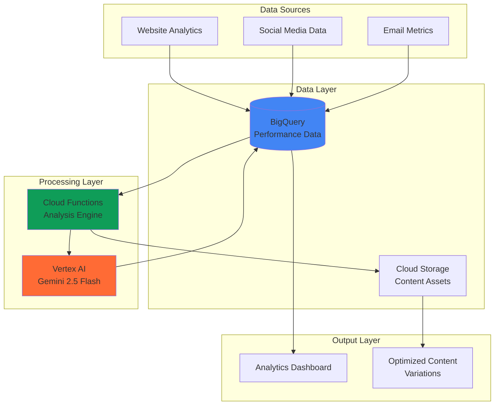

# Content Performance Optimization using Gemini and Analytics

## Problem

Marketing teams struggle to identify which content performs best and why, often relying on manual analysis of disconnected metrics across multiple platforms. Without automated insights into content performance patterns, businesses miss opportunities to optimize their content strategy, leading to decreased engagement, lower conversion rates, and inefficient marketing spend that could impact revenue by 20-30%.

## Solution

Build an intelligent content optimization system that automatically analyzes performance data in BigQuery, uses Gemini 2.5 Flash to identify improvement patterns, and generates data-driven content variations. This serverless solution creates a continuous feedback loop that learns from successful content characteristics and automatically suggests optimized versions, improving engagement metrics and content ROI.

## Architecture Diagram



## Prerequisites

1. Google Cloud project with billing enabled and APIs for Vertex AI, Cloud Functions, and BigQuery
2. gcloud CLI installed and configured (or use Cloud Shell)
3. Basic understanding of SQL for BigQuery queries and content analytics concepts
4. Marketing or analytics background for interpreting content performance metrics
5. Estimated cost: $15-25 per month for moderate usage (Vertex AI: $10-15, BigQuery: $3-7, Cloud Functions: $1-3)

> **Note**: This recipe follows Google Cloud Architecture Framework principles for scalable, AI-driven analytics solutions. Enable required APIs before proceeding to avoid permission errors.

## Preparation

```bash
# Set environment variables for GCP resources
export PROJECT_ID="content-opt-$(date +%s)"
export REGION="us-central1"
export ZONE="us-central1-a"

# Generate unique suffix for resource names
RANDOM_SUFFIX=$(openssl rand -hex 3)
export DATASET_NAME="content_analytics_${RANDOM_SUFFIX}"
export FUNCTION_NAME="content-analyzer-${RANDOM_SUFFIX}"
export BUCKET_NAME="content-optimization-${RANDOM_SUFFIX}"
export TABLE_NAME="performance_data"

# Set default project and region
gcloud config set project ${PROJECT_ID}
gcloud config set compute/region ${REGION}
gcloud config set compute/zone ${ZONE}

# Enable required APIs
gcloud services enable cloudfunctions.googleapis.com
gcloud services enable aiplatform.googleapis.com
gcloud services enable bigquery.googleapis.com
gcloud services enable storage.googleapis.com
gcloud services enable cloudbuild.googleapis.com

echo "✅ Project configured: ${PROJECT_ID}"
echo "✅ Dataset: ${DATASET_NAME}"
echo "✅ Function: ${FUNCTION_NAME}"
echo "✅ Bucket: ${BUCKET_NAME}"
```

## Steps

1. **Create BigQuery Dataset and Performance Data Table**:

   BigQuery provides a fully managed, AI-ready data platform that serves as the foundation for content analytics. Creating a structured dataset with appropriate schema enables efficient querying of performance metrics and supports machine learning workloads for content optimization patterns.

   ```bash
   # Create BigQuery dataset for content analytics
   bq mk --location=${REGION} ${PROJECT_ID}:${DATASET_NAME}
   
   # Create table schema for content performance data
   cat > /tmp/schema.json << 'EOF'
   [
     {"name": "content_id", "type": "STRING", "mode": "REQUIRED"},
     {"name": "title", "type": "STRING", "mode": "REQUIRED"},
     {"name": "content_type", "type": "STRING", "mode": "REQUIRED"},
     {"name": "publish_date", "type": "TIMESTAMP", "mode": "REQUIRED"},
     {"name": "page_views", "type": "INTEGER", "mode": "NULLABLE"},
     {"name": "engagement_rate", "type": "FLOAT", "mode": "NULLABLE"},
     {"name": "conversion_rate", "type": "FLOAT", "mode": "NULLABLE"},
     {"name": "time_on_page", "type": "FLOAT", "mode": "NULLABLE"},
     {"name": "social_shares", "type": "INTEGER", "mode": "NULLABLE"},
     {"name": "content_score", "type": "FLOAT", "mode": "NULLABLE"}
   ]
   EOF
   
   # Create the performance data table
   bq mk --table \
       ${PROJECT_ID}:${DATASET_NAME}.${TABLE_NAME} \
       /tmp/schema.json
   
   echo "✅ BigQuery dataset and table created successfully"
   ```

   The BigQuery infrastructure now provides a scalable foundation for content analytics with proper schema design that supports both real-time ingestion and batch processing. This structure enables efficient querying and machine learning analysis across large volumes of content performance data.

2. **Create Cloud Storage Bucket for Content Assets**:

   Cloud Storage provides unified object storage with global edge caching, serving as the repository for content assets and analysis results. The bucket configuration ensures data durability and access control while supporting the content optimization workflow.

   ```bash
   # Create Cloud Storage bucket for content optimization
   gsutil mb -p ${PROJECT_ID} \
       -c STANDARD \
       -l ${REGION} \
       gs://${BUCKET_NAME}
   
   # Enable versioning for content asset protection
   gsutil versioning set on gs://${BUCKET_NAME}
   
   # Set appropriate IAM permissions for Cloud Functions
   gsutil iam ch serviceAccount:${PROJECT_ID}@appspot.gserviceaccount.com:objectAdmin \
       gs://${BUCKET_NAME}
   
   echo "✅ Cloud Storage bucket configured with versioning and permissions"
   ```

   The storage infrastructure now supports scalable content asset management with versioning enabled for data protection. This configuration enables the Cloud Functions to store and retrieve content variations while maintaining proper access controls and audit trails.

3. **Insert Sample Content Performance Data**:

   Populating BigQuery with realistic sample data establishes the foundation for content analysis and optimization patterns. This sample data represents typical content performance metrics that Gemini will analyze to identify successful content characteristics and improvement opportunities.

   ```bash
   # Create sample data file
   cat > /tmp/sample_data.json << 'EOF'
   {"content_id": "blog_001", "title": "10 Tips for Better SEO", "content_type": "blog", "publish_date": "2024-01-15 10:00:00", "page_views": 1250, "engagement_rate": 0.65, "conversion_rate": 0.08, "time_on_page": 180.5, "social_shares": 45, "content_score": 8.2}
   {"content_id": "video_001", "title": "Product Demo Walkthrough", "content_type": "video", "publish_date": "2024-01-20 14:30:00", "page_views": 890, "engagement_rate": 0.78, "conversion_rate": 0.12, "time_on_page": 220.3, "social_shares": 67, "content_score": 9.1}
   {"content_id": "infographic_001", "title": "Data Visualization Best Practices", "content_type": "infographic", "publish_date": "2024-01-25 09:15:00", "page_views": 2100, "engagement_rate": 0.72, "conversion_rate": 0.05, "time_on_page": 95.2, "social_shares": 89, "content_score": 7.8}
   {"content_id": "blog_002", "title": "Advanced Analytics Techniques", "content_type": "blog", "publish_date": "2024-02-01 11:45:00", "page_views": 780, "engagement_rate": 0.58, "conversion_rate": 0.06, "time_on_page": 165.7, "social_shares": 23, "content_score": 6.9}
   {"content_id": "case_study_001", "title": "Customer Success Story", "content_type": "case_study", "publish_date": "2024-02-05 16:20:00", "page_views": 1450, "engagement_rate": 0.82, "conversion_rate": 0.18, "time_on_page": 310.8, "social_shares": 78, "content_score": 9.5}
   EOF
   
   # Load sample data into BigQuery
   bq load --source_format=NEWLINE_DELIMITED_JSON \
       ${PROJECT_ID}:${DATASET_NAME}.${TABLE_NAME} \
       /tmp/sample_data.json
   
   echo "✅ Sample content performance data loaded into BigQuery"
   ```

   The BigQuery table now contains representative content performance data that provides the foundation for AI-driven analysis. This dataset enables Gemini to understand content performance patterns and generate insights about successful content characteristics across different content types and engagement metrics.

4. **Create Cloud Function for Content Analysis**:

   Cloud Functions provides serverless event processing that automatically scales based on demand, eliminating infrastructure management while providing cost-effective processing. The function integrates BigQuery analytics with Vertex AI Gemini to analyze content patterns and generate optimization recommendations.

   ```bash
   # Create directory for Cloud Function source code
   mkdir -p /tmp/content-analyzer
   cd /tmp/content-analyzer
   
   # Create requirements.txt for Python dependencies
   cat > requirements.txt << 'EOF'
   google-cloud-bigquery==3.34.0
   google-cloud-aiplatform==1.70.0
   google-cloud-storage==2.19.0
   pandas==2.3.0
   functions-framework==3.8.0
   EOF
   
   # Create main Cloud Function code
   cat > main.py << 'EOF'
   import json
   import pandas as pd
   from google.cloud import bigquery
   from google.cloud import aiplatform
   from google.cloud import storage
   import functions_framework
   from datetime import datetime, timedelta
   import os
   
   # Initialize clients
   bq_client = bigquery.Client()
   storage_client = storage.Client()
   
   @functions_framework.http
   def analyze_content(request):
       """Analyze content performance and generate optimization recommendations."""
       
       project_id = os.environ.get('GCP_PROJECT')
       dataset_name = os.environ.get('DATASET_NAME')
       bucket_name = os.environ.get('BUCKET_NAME')
       
       try:
           # Query recent content performance data
           query = f"""
           SELECT 
               content_id,
               title,
               content_type,
               page_views,
               engagement_rate,
               conversion_rate,
               time_on_page,
               social_shares,
               content_score
           FROM `{project_id}.{dataset_name}.performance_data`
           WHERE publish_date >= DATE_SUB(CURRENT_DATE(), INTERVAL 30 DAY)
           ORDER BY content_score DESC
           """
           
           query_job = bq_client.query(query)
           results = query_job.result()
           
           # Convert to DataFrame for analysis
           data = []
           for row in results:
               data.append({
                   'content_id': row.content_id,
                   'title': row.title,
                   'content_type': row.content_type,
                   'page_views': row.page_views,
                   'engagement_rate': row.engagement_rate,
                   'conversion_rate': row.conversion_rate,
                   'time_on_page': row.time_on_page,
                   'social_shares': row.social_shares,
                   'content_score': row.content_score
               })
           
           df = pd.DataFrame(data)
           
           if df.empty:
               return {'status': 'no_data', 'message': 'No content data found'}
           
           # Prepare data for Gemini analysis
           content_summary = df.to_string(index=False)
           
           # Initialize Vertex AI
           aiplatform.init(project=project_id, location='us-central1')
           
           # Create Gemini prompt for content analysis
           prompt = f"""
           Analyze the following content performance data and provide optimization recommendations:
           
           {content_summary}
           
           Please provide:
           1. Top 3 highest-performing content characteristics
           2. Content optimization recommendations for underperforming pieces
           3. Suggested content variations for the top-performing content
           4. Key performance indicators to monitor
           
           Format your response as a structured JSON with clear recommendations.
           """
           
           # Generate content with Gemini 2.5 Flash
           from vertexai.generative_models import GenerativeModel
           
           model = GenerativeModel("gemini-2.5-flash")
           response = model.generate_content(prompt)
           
           # Store analysis results in Cloud Storage
           bucket = storage_client.bucket(bucket_name)
           timestamp = datetime.now().strftime('%Y%m%d_%H%M%S')
           blob_name = f'analysis_results/content_analysis_{timestamp}.json'
           
           analysis_result = {
               'timestamp': timestamp,
               'data_analyzed': len(df),
               'gemini_analysis': response.text,
               'top_performers': df.nlargest(3, 'content_score').to_dict('records')
           }
           
           blob = bucket.blob(blob_name)
           blob.upload_from_string(json.dumps(analysis_result, indent=2))
           
           return {
               'status': 'success',
               'analysis_file': f'gs://{bucket_name}/{blob_name}',
               'content_analyzed': len(df),
               'recommendations_available': True
           }
           
       except Exception as e:
           return {'status': 'error', 'message': str(e)}
   EOF
   
   echo "✅ Cloud Function source code created"
   ```

   The Cloud Function now provides intelligent content analysis capabilities by combining BigQuery data processing with Vertex AI Gemini's advanced language understanding. This serverless architecture automatically scales based on analysis requests while maintaining cost efficiency through pay-per-invocation pricing.

5. **Deploy Cloud Function with Environment Variables**:

   Deploying the Cloud Function with proper environment configuration and IAM permissions enables secure, automated content analysis. The function configuration optimizes resource allocation while ensuring proper access to BigQuery, Vertex AI, and Cloud Storage services.

   ```bash
   # Deploy Cloud Function with environment variables
   gcloud functions deploy ${FUNCTION_NAME} \
       --gen2 \
       --runtime python312 \
       --trigger-http \
       --allow-unauthenticated \
       --source . \
       --entry-point analyze_content \
       --memory 512MB \
       --timeout 300s \
       --set-env-vars "GCP_PROJECT=${PROJECT_ID},DATASET_NAME=${DATASET_NAME},BUCKET_NAME=${BUCKET_NAME}"
   
   # Get the function URL for testing
   FUNCTION_URL=$(gcloud functions describe ${FUNCTION_NAME} \
       --gen2 \
       --format="value(serviceConfig.uri)")
   
   echo "✅ Cloud Function deployed successfully"
   echo "Function URL: ${FUNCTION_URL}"
   ```

   The Cloud Function deployment now provides a scalable HTTP endpoint for content analysis with optimized memory allocation and timeout settings. The environment variables enable secure access to Google Cloud services while the function automatically scales based on demand without infrastructure management overhead.

6. **Create BigQuery View for Performance Metrics**:

   BigQuery views provide virtual tables that simplify complex queries and enable consistent data access patterns across the analytics pipeline. Creating performance metric views standardizes content analysis calculations and supports automated reporting for content optimization insights.

   ```bash
   # Create a view for aggregated performance metrics
   bq mk --view \
       "SELECT 
           content_type,
           COUNT(*) as total_content,
           AVG(page_views) as avg_page_views,
           AVG(engagement_rate) as avg_engagement,
           AVG(conversion_rate) as avg_conversion,
           AVG(content_score) as avg_score,
           SUM(social_shares) as total_shares
        FROM \`${PROJECT_ID}.${DATASET_NAME}.${TABLE_NAME}\`
        GROUP BY content_type
        ORDER BY avg_score DESC" \
       ${PROJECT_ID}:${DATASET_NAME}.content_performance_summary
   
   # Create a view for top-performing content identification
   bq mk --view \
       "SELECT 
           content_id,
           title,
           content_type,
           content_score,
           CASE 
               WHEN content_score >= 9.0 THEN 'Excellent'
               WHEN content_score >= 7.5 THEN 'Good'
               WHEN content_score >= 6.0 THEN 'Average'
               ELSE 'Needs Improvement'
           END as performance_category
        FROM \`${PROJECT_ID}.${DATASET_NAME}.${TABLE_NAME}\`
        ORDER BY content_score DESC" \
       ${PROJECT_ID}:${DATASET_NAME}.content_rankings
   
   echo "✅ BigQuery views created for performance analytics"
   ```

   The BigQuery views now provide standardized analytics interfaces that simplify content performance analysis and enable consistent reporting across the organization. These views support both automated analysis workflows and manual exploration of content performance patterns.

7. **Test Content Analysis System**:

   Testing the complete content analysis pipeline validates the integration between BigQuery, Cloud Functions, and Vertex AI while ensuring the system generates meaningful optimization recommendations. This verification step confirms the automated analysis workflow functions correctly before production deployment.

   ```bash
   # Trigger content analysis through Cloud Function
   curl -X POST ${FUNCTION_URL} \
       -H "Content-Type: application/json" \
       -d '{"trigger": "manual_analysis"}'
   
   # Wait for analysis to complete
   sleep 30
   
   # Check for analysis results in Cloud Storage
   gsutil ls gs://${BUCKET_NAME}/analysis_results/
   
   # Query the performance summary view
   bq query --use_legacy_sql=false \
       "SELECT * FROM \`${PROJECT_ID}.${DATASET_NAME}.content_performance_summary\`"
   
   echo "✅ Content analysis system tested successfully"
   ```

   The content analysis system now demonstrates end-to-end functionality with automated data processing, AI-driven insights generation, and result storage. The test confirms that Gemini successfully analyzes content performance patterns and generates actionable optimization recommendations stored in Cloud Storage.

## Validation & Testing

1. Verify BigQuery dataset and tables were created successfully:

   ```bash
   # Check dataset exists
   bq ls ${PROJECT_ID}:${DATASET_NAME}
   
   # Verify table schema
   bq show ${PROJECT_ID}:${DATASET_NAME}.${TABLE_NAME}
   ```

   Expected output: Dataset listing with performance_data table and schema showing all required fields (content_id, title, content_type, etc.)

2. Test Cloud Function deployment and functionality:

   ```bash
   # Check function status
   gcloud functions describe ${FUNCTION_NAME} \
       --gen2 \
       --format="table(state,updateTime)"
   
   # Test function execution
   curl -X POST ${FUNCTION_URL} \
       -H "Content-Type: application/json"
   ```

   Expected output: Function state as ACTIVE with recent update time and successful HTTP response with analysis results

3. Validate Vertex AI integration and content analysis:

   ```bash
   # Check latest analysis results
   gsutil ls -l gs://${BUCKET_NAME}/analysis_results/ | tail -1
   
   # Download and review analysis output
   LATEST_FILE=$(gsutil ls gs://${BUCKET_NAME}/analysis_results/ | tail -1)
   gsutil cp ${LATEST_FILE} /tmp/latest_analysis.json
   cat /tmp/latest_analysis.json
   ```

   Expected output: JSON file containing Gemini analysis with content recommendations, performance insights, and optimization suggestions

4. Test BigQuery views and performance queries:

   ```bash
   # Query content rankings view
   bq query --use_legacy_sql=false \
       "SELECT * FROM \`${PROJECT_ID}.${DATASET_NAME}.content_rankings\` LIMIT 5"
   
   # Test performance summary aggregations
   bq query --use_legacy_sql=false \
       "SELECT content_type, total_content, avg_score 
        FROM \`${PROJECT_ID}.${DATASET_NAME}.content_performance_summary\`"
   ```

   Expected output: Ranked content list with performance categories and aggregated metrics by content type showing average scores and engagement data

## Cleanup

1. Remove Cloud Function and related resources:

   ```bash
   # Delete Cloud Function
   gcloud functions delete ${FUNCTION_NAME} \
       --gen2 \
       --region=${REGION} \
       --quiet
   
   echo "✅ Cloud Function deleted"
   ```

2. Remove BigQuery dataset and all tables:

   ```bash
   # Delete BigQuery dataset (includes all tables and views)
   bq rm -r -f ${PROJECT_ID}:${DATASET_NAME}
   
   echo "✅ BigQuery dataset deleted"
   ```

3. Remove Cloud Storage bucket and contents:

   ```bash
   # Delete all objects in bucket
   gsutil -m rm -r gs://${BUCKET_NAME}
   
   echo "✅ Cloud Storage bucket deleted"
   ```

4. Clean up local files and environment variables:

   ```bash
   # Remove temporary files
   rm -rf /tmp/content-analyzer
   rm -f /tmp/schema.json /tmp/sample_data.json /tmp/latest_analysis.json
   
   # Unset environment variables
   unset PROJECT_ID REGION ZONE DATASET_NAME FUNCTION_NAME BUCKET_NAME TABLE_NAME
   
   echo "✅ Local cleanup completed"
   ```

5. Delete project (if created specifically for this recipe):

   ```bash
   # Delete project (optional - only if project was created for this recipe)
   # gcloud projects delete ${PROJECT_ID} --quiet
   
   echo "✅ Resources cleaned up successfully"
   echo "Note: Project deletion commented out for safety"
   ```

## Discussion

This content optimization solution demonstrates the power of combining Google Cloud's AI and analytics services to create intelligent content insights. The architecture leverages BigQuery's serverless data warehouse capabilities for scalable performance data storage and analysis, while Vertex AI Gemini 2.5 Flash provides advanced language understanding to identify content optimization patterns that would be difficult to detect through traditional analytics alone. The [Google Cloud Architecture Framework](https://cloud.google.com/architecture) principles ensure the solution maintains high availability, security, and cost efficiency.

The serverless approach using Cloud Functions eliminates infrastructure management overhead while providing automatic scaling based on analysis demand. This design pattern is particularly effective for content teams who need regular insights without maintaining complex analytics infrastructure. The separation of data storage (BigQuery), processing (Cloud Functions), and AI analysis (Vertex AI) creates a modular architecture that can evolve with changing business requirements and accommodate new data sources or analysis methodologies.

The integration of structured performance metrics with AI-driven content analysis creates a powerful feedback loop for continuous content improvement. By analyzing patterns across content types, engagement metrics, and conversion data, the system can identify subtle characteristics that contribute to content success. This approach enables content teams to move beyond simple metrics like page views to understand deeper engagement patterns and optimize for business outcomes like conversions and user retention.

Google Cloud's AI-ready data platform design ensures that as content volumes grow, the system maintains performance and cost efficiency. BigQuery's separation of compute and storage enables independent scaling of analysis workloads, while Vertex AI's managed infrastructure provides enterprise-grade AI capabilities without requiring specialized machine learning expertise from content teams. The latest Gemini 2.5 Flash model provides enhanced performance and cost optimization compared to previous generations, making this solution accessible for organizations of all sizes.

> **Tip**: Monitor analysis costs by setting up BigQuery slot reservations for predictable workloads and Vertex AI quotas to control AI processing expenses. Use Cloud Monitoring to track function execution patterns and optimize memory allocation based on actual usage patterns.

## Challenge

Extend this content optimization solution by implementing these enhancements:

1. **Real-time Content Scoring**: Integrate with Google Analytics 4 API and Social Media APIs to stream live performance data into BigQuery, enabling real-time content score updates and immediate optimization alerts when content performance changes significantly.

2. **Multi-language Content Analysis**: Enhance the Gemini prompts to analyze content performance across different languages and cultural contexts, using Cloud Translation API to normalize content analysis and identify language-specific optimization patterns.

3. **Automated A/B Testing**: Implement Cloud Scheduler to automatically generate content variations using Gemini, deploy them through a content management system integration, and track performance differences to identify winning variations automatically.

4. **Predictive Content Performance**: Train a custom Vertex AI model using historical performance data to predict content success before publication, incorporating factors like topic trends, seasonal patterns, and audience preferences to guide content creation strategy.

5. **Advanced Visualization Dashboard**: Build a Looker Studio dashboard that connects to BigQuery views and displays real-time content performance insights, optimization recommendations, and trend analysis with interactive filters for content type, time periods, and performance categories.

## Infrastructure Code

### Available Infrastructure as Code:

- [Infrastructure Code Overview](code/README.md) - Detailed description of all infrastructure components
- [Infrastructure Manager](code/infrastructure-manager/) - GCP Infrastructure Manager templates
- [Bash CLI Scripts](code/scripts/) - Example bash scripts using gcloud CLI commands to deploy infrastructure
- [Terraform](code/terraform/) - Terraform configuration files