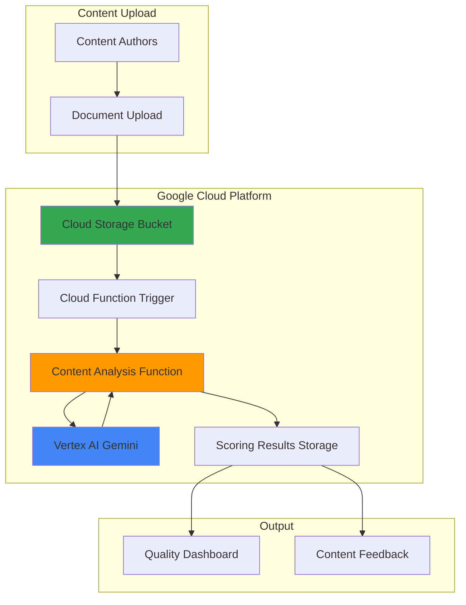

# Content Quality Scoring with Vertex AI and Functions

## Problem

Marketing teams and content creators struggle to maintain consistent quality across their written content, with no systematic way to evaluate readability, engagement potential, and alignment with brand guidelines. Manual review processes are time-consuming and subjective, while simple grammar checkers miss critical quality dimensions like audience relevance, persuasiveness, and content structure effectiveness.

## Solution

Build an automated content quality scoring system using Vertex AI's Gemini models to analyze text across multiple dimensions including readability, engagement, clarity, and brand alignment. Cloud Functions provide serverless processing that triggers on content uploads to Cloud Storage, while Vertex AI delivers intelligent analysis with detailed scoring and improvement recommendations for enhanced content strategy.

## Architecture Diagram



## Prerequisites

1. Google Cloud account with billing enabled and Vertex AI API access
2. Google Cloud CLI installed and configured (gcloud version 450.0.0+)
3. Basic understanding of Python programming and Google Cloud services
4. Text editor for function development and content creation
5. Estimated cost: $2-5 for testing (includes Vertex AI API calls and Cloud Functions execution)

> **Note**: This recipe uses Vertex AI Gemini models which require appropriate quota and may incur charges based on token usage.

## Preparation

```bash
# Set environment variables for GCP resources
export PROJECT_ID="content-quality-$(date +%s)"
export REGION="us-central1"
export ZONE="us-central1-a"

# Generate unique suffix for resource names
RANDOM_SUFFIX=$(openssl rand -hex 3)

# Set default project and region
gcloud config set project ${PROJECT_ID}
gcloud config set compute/region ${REGION}
gcloud config set compute/zone ${ZONE}

# Create project if it doesn't exist
gcloud projects create ${PROJECT_ID} \
    --name="Content Quality Scoring"

# Enable required APIs
gcloud services enable cloudfunctions.googleapis.com \
    storage.googleapis.com \
    aiplatform.googleapis.com \
    cloudbuild.googleapis.com \
    eventarc.googleapis.com

echo "✅ Project configured: ${PROJECT_ID}"

# Set additional environment variables
export BUCKET_NAME="content-analysis-${RANDOM_SUFFIX}"
export FUNCTION_NAME="analyze-content-quality"
export RESULTS_BUCKET="quality-results-${RANDOM_SUFFIX}"
```

## Steps

1. **Create Cloud Storage Buckets for Content and Results**:

   Google Cloud Storage provides the foundation for our content analysis pipeline with event-driven triggers that automatically initiate processing when new content is uploaded. The dual-bucket approach separates input content from analysis results, enabling clean organization and separate access controls for content creators and analysts.

   ```bash
   # Create bucket for content uploads
   gsutil mb -p ${PROJECT_ID} \
       -c STANDARD \
       -l ${REGION} \
       gs://${BUCKET_NAME}
   
   # Create bucket for analysis results
   gsutil mb -p ${PROJECT_ID} \
       -c STANDARD \
       -l ${REGION} \
       gs://${RESULTS_BUCKET}
   
   # Enable versioning for data protection
   gsutil versioning set on gs://${BUCKET_NAME}
   gsutil versioning set on gs://${RESULTS_BUCKET}
   
   echo "✅ Storage buckets created: ${BUCKET_NAME} and ${RESULTS_BUCKET}"
   ```

   The storage buckets now provide scalable, durable storage with versioning enabled for data protection. This foundation supports the entire content analysis workflow while Google's global infrastructure ensures consistent performance regardless of content volume or geographic distribution.

2. **Create Content Analysis Function Code**:

   Cloud Functions provides serverless event processing that automatically scales based on content uploads. The function integrates with Vertex AI's Gemini models to perform sophisticated content analysis across multiple quality dimensions, leveraging Google's advanced natural language understanding capabilities for comprehensive content evaluation.

   ```bash
   # Create function directory
   mkdir content-quality-function
   cd content-quality-function
   
   # Create main function file
   cat > main.py << 'EOF'
import functions_framework
import json
import time
import logging
import os
from google.cloud import storage
from google.cloud import aiplatform
from vertexai.generative_models import GenerativeModel

# Initialize logging
logging.basicConfig(level=logging.INFO)
logger = logging.getLogger(__name__)

# Initialize Vertex AI
PROJECT_ID = os.environ.get("PROJECT_ID")
REGION = "us-central1"
RESULTS_BUCKET = os.environ.get("RESULTS_BUCKET")

aiplatform.init(project=PROJECT_ID, location=REGION)

@functions_framework.cloud_event
def analyze_content_quality(cloud_event):
    """Triggered by Cloud Storage upload - analyzes content quality."""
    
    try:
        # Extract file information from event
        data = cloud_event.data
        bucket_name = data["bucket"]
        file_name = data["name"]
        
        logger.info(f"Processing file: {file_name} from bucket: {bucket_name}")
        
        # Read content from Cloud Storage
        storage_client = storage.Client()
        bucket = storage_client.bucket(bucket_name)
        blob = bucket.blob(file_name)
        
        # Download and decode content
        content_text = blob.download_as_text()
        
        # Analyze content quality using Vertex AI
        quality_scores = analyze_with_vertex_ai(content_text)
        
        # Store results in results bucket
        store_analysis_results(file_name, quality_scores)
        
        logger.info(f"Analysis complete for {file_name}")
        
    except Exception as e:
        logger.error(f"Error processing {file_name}: {str(e)}")
        raise

def analyze_with_vertex_ai(content):
    """Analyze content quality using Vertex AI Gemini."""
    
    # Create comprehensive quality analysis prompt
    prompt = f"""
    Analyze the following content for quality across multiple dimensions. 
    Provide scores (1-10) and specific feedback for each category:
    
    CONTENT TO ANALYZE:
    {content}
    
    Please evaluate and provide JSON output with the following structure:
    {{
        "overall_score": <1-10>,
        "readability": {{
            "score": <1-10>,
            "feedback": "specific feedback on readability"
        }},
        "engagement": {{
            "score": <1-10>,
            "feedback": "feedback on engagement potential"
        }},
        "clarity": {{
            "score": <1-10>,
            "feedback": "feedback on clarity and comprehension"
        }},
        "structure": {{
            "score": <1-10>,
            "feedback": "feedback on content organization"
        }},
        "tone": {{
            "score": <1-10>,
            "feedback": "feedback on tone appropriateness"
        }},
        "actionability": {{
            "score": <1-10>,
            "feedback": "feedback on actionable insights"
        }},
        "improvement_suggestions": [
            "specific suggestion 1",
            "specific suggestion 2",
            "specific suggestion 3"
        ]
    }}
    
    Focus on providing constructive, specific feedback that content creators can act upon.
    """
    
    try:
        # Initialize Gemini model
        model = GenerativeModel("gemini-1.5-flash")
        
        # Generate response with appropriate parameters
        response = model.generate_content(
            prompt,
            generation_config={
                "temperature": 0.2,
                "max_output_tokens": 2048,
                "top_p": 0.8,
                "top_k": 40
            }
        )
        
        # Parse JSON response
        quality_analysis = json.loads(response.text.strip())
        
        return quality_analysis
        
    except Exception as e:
        logger.error(f"Vertex AI analysis failed: {str(e)}")
        # Return default scores if analysis fails
        return {
            "overall_score": 5,
            "error": f"Analysis failed: {str(e)}",
            "readability": {"score": 5, "feedback": "Analysis unavailable"},
            "engagement": {"score": 5, "feedback": "Analysis unavailable"},
            "clarity": {"score": 5, "feedback": "Analysis unavailable"},
            "structure": {"score": 5, "feedback": "Analysis unavailable"},
            "tone": {"score": 5, "feedback": "Analysis unavailable"},
            "actionability": {"score": 5, "feedback": "Analysis unavailable"},
            "improvement_suggestions": ["Retry analysis when service is available"]
        }

def store_analysis_results(original_filename, analysis_results):
    """Store analysis results in Cloud Storage."""
    
    try:
        storage_client = storage.Client()
        results_bucket = storage_client.bucket(RESULTS_BUCKET)
        
        # Create results filename
        results_filename = f"analysis_{original_filename}_{int(time.time())}.json"
        
        # Prepare results data
        results_data = {
            "original_file": original_filename,
            "timestamp": time.time(),
            "analysis": analysis_results
        }
        
        # Upload results
        blob = results_bucket.blob(results_filename)
        blob.upload_from_string(
            json.dumps(results_data, indent=2),
            content_type='application/json'
        )
        
        logger.info(f"Results stored: {results_filename}")
        
    except Exception as e:
        logger.error(f"Failed to store results: {str(e)}")
        raise
EOF
   
   echo "✅ Function code created with Vertex AI integration"
   ```

   The Cloud Function now provides sophisticated content analysis capabilities using Vertex AI's Gemini models. This serverless approach eliminates infrastructure management while providing automatic scaling and cost-effective processing based on actual content volume and analysis requirements.

3. **Create Function Requirements and Configuration**:

   Python dependencies and function configuration define the runtime environment for our content analysis service. The requirements file specifies Google Cloud client libraries that enable seamless integration with Vertex AI and Cloud Storage, while the configuration ensures optimal performance and resource allocation for content processing workloads.

   ```bash
   # Create requirements.txt for Python dependencies
   cat > requirements.txt << 'EOF'
functions-framework==3.8.2
google-cloud-storage==2.18.0
google-cloud-aiplatform==1.60.0
google-cloud-logging==3.11.0
EOF
   
   echo "✅ Function configuration completed"
   ```

   The function configuration now includes all necessary dependencies for Google Cloud services integration. This setup ensures reliable communication with Vertex AI and Cloud Storage while maintaining optimal performance through appropriate library versions and configuration parameters.

4. **Deploy Cloud Function with Storage Trigger**:

   Cloud Functions deployment with Storage triggers enables automatic content processing without manual intervention. The event-driven architecture ensures immediate analysis when new content is uploaded, while the function configuration optimizes memory allocation and timeout settings for reliable Vertex AI integration and content processing performance.

   ```bash
   # Deploy function with Cloud Storage trigger
   gcloud functions deploy ${FUNCTION_NAME} \
       --gen2 \
       --runtime python311 \
       --region ${REGION} \
       --source . \
       --entry-point analyze_content_quality \
       --trigger-bucket ${BUCKET_NAME} \
       --memory 512MiB \
       --timeout 540s \
       --max-instances 10 \
       --set-env-vars "PROJECT_ID=${PROJECT_ID},RESULTS_BUCKET=${RESULTS_BUCKET}"
   
   echo "✅ Function deployed: ${FUNCTION_NAME}"
   echo "Trigger configured for bucket: ${BUCKET_NAME}"
   ```

   The Cloud Function is now active with automatic scaling and event-driven processing. This configuration provides reliable content analysis with appropriate resource allocation, timeout settings for Vertex AI processing, and environment variable configuration for seamless integration with Google Cloud services.

5. **Create Sample Content for Testing**:

   Sample content creation demonstrates the content analysis system capabilities across different content types and quality levels. These examples showcase how the system evaluates various writing styles, structures, and quality dimensions, providing realistic test cases for validating the Vertex AI analysis and scoring functionality.

   ```bash
   # Create sample content files for testing
   mkdir sample-content
   
   # Create high-quality content sample
   cat > sample-content/high-quality-article.txt << 'EOF'
# Effective Remote Team Communication Strategies

Remote work has fundamentally transformed how teams collaborate and communicate. Success in distributed teams requires intentional communication practices that bridge physical distances and time zones.

## Key Communication Principles

**Clarity First**: Every message should have a clear purpose and actionable outcomes. Avoid ambiguous language that can lead to misinterpretation across different cultural contexts.

**Asynchronous by Default**: Design communication workflows that don't require immediate responses. This approach respects different working hours and allows for thoughtful, well-considered responses.

**Documentation Culture**: Create searchable, accessible records of decisions and discussions. This practice ensures knowledge preservation and enables team members to stay informed regardless of meeting attendance.

## Implementation Strategies

1. **Establish Communication Protocols**: Define which channels to use for different types of communication - urgent matters, project updates, casual conversation.

2. **Regular Check-ins**: Schedule consistent one-on-one and team meetings that focus on both work progress and team well-being.

3. **Use Visual Communication**: Leverage screen sharing, diagrams, and video when explaining complex concepts to reduce misunderstanding.

Remote communication excellence requires practice, patience, and continuous refinement based on team feedback and evolving needs.
EOF
   
   # Create medium-quality content sample
   cat > sample-content/medium-quality-post.txt << 'EOF'
Social Media Marketing Tips

Social media is important for business today. Here are some tips that can help your business grow online.

Post regularly - You should post content on a regular basis to keep your audience engaged. Try to post at least once a day.

Use hashtags - Hashtags help people find your content. Research popular hashtags in your industry and use them in your posts.

Engage with followers - Respond to comments and messages. This helps build relationships with your customers.

Share quality content - Don't just promote your products. Share useful information that your audience will find valuable.

Analyze your results - Look at your analytics to see what content performs best. Use this information to improve your strategy.

Social media marketing takes time and effort, but it can really help your business reach more customers and increase sales.
EOF
   
   # Create low-quality content sample
   cat > sample-content/low-quality-draft.txt << 'EOF'
productivity tips

here are some ways to be more productive at work:

- make lists
- dont procrastinate
- take breaks
- organize workspace
- minimize distractions

these tips will help you get more done. productivity is important for success in any job. try implementing these strategies and see if they work for you.
EOF
   
   echo "✅ Sample content created for testing different quality levels"
   ```

   The sample content files represent different quality levels and writing styles, enabling comprehensive testing of the content analysis system. These examples will demonstrate how Vertex AI evaluates structure, clarity, engagement, and overall content quality across various formats and domains.

6. **Upload Content and Trigger Analysis**:

   Content upload triggers automatic analysis through the event-driven architecture. Cloud Storage events activate the Cloud Function, which processes content through Vertex AI for comprehensive quality evaluation. This workflow demonstrates the seamless integration between storage, serverless computing, and AI services for automated content analysis.

   ```bash
   # Upload sample content to trigger analysis
   gsutil cp sample-content/high-quality-article.txt \
       gs://${BUCKET_NAME}/
   gsutil cp sample-content/medium-quality-post.txt \
       gs://${BUCKET_NAME}/
   gsutil cp sample-content/low-quality-draft.txt \
       gs://${BUCKET_NAME}/
   
   echo "✅ Content uploaded and analysis triggered"
   echo "Monitoring function execution..."
   
   # Wait for function execution
   sleep 30
   
   # Check function logs
   gcloud functions logs read ${FUNCTION_NAME} \
       --gen2 \
       --region ${REGION} \
       --limit 10
   ```

   The content upload process demonstrates real-world usage patterns where content creators simply upload files to Cloud Storage for automatic analysis. The system provides immediate processing feedback through Cloud Functions logs, showing the serverless architecture's responsiveness and reliability.

## Validation & Testing

1. Verify Cloud Function deployment and configuration:

   ```bash
   # Check function status and configuration
   gcloud functions describe ${FUNCTION_NAME} \
       --gen2 \
       --region ${REGION} \
       --format="table(name,state,eventTrigger.eventType,buildConfig.runtime)"
   ```

   Expected output: Function state should show "ACTIVE" with eventType showing storage trigger configuration.

2. Verify content analysis results:

   ```bash
   # List analysis results in results bucket
   gsutil ls gs://${RESULTS_BUCKET}/
   
   # Download and view a sample analysis result
   RESULT_FILE=$(gsutil ls gs://${RESULTS_BUCKET}/ | head -1)
   gsutil cp ${RESULT_FILE} ./sample-result.json
   cat sample-result.json | jq '.'
   ```

   Expected output: JSON files containing quality scores, feedback, and improvement suggestions for each uploaded content file.

3. Test different content types:

   ```bash
   # Create and upload additional test content
   echo "Test content with poor grammar and structure" > test-content.txt
   gsutil cp test-content.txt gs://${BUCKET_NAME}/
   
   # Wait and check for new results
   sleep 20
   gsutil ls gs://${RESULTS_BUCKET}/ | grep test-content
   ```

4. Monitor function performance and error handling:

   ```bash
   # Check function metrics and error rates
   gcloud functions logs read ${FUNCTION_NAME} \
       --gen2 \
       --region ${REGION} \
       --filter="severity>=ERROR" \
       --limit 5
   ```

## Cleanup

1. Remove Cloud Functions and associated resources:

   ```bash
   # Delete Cloud Function
   gcloud functions delete ${FUNCTION_NAME} \
       --gen2 \
       --region ${REGION} \
       --quiet
   
   echo "✅ Cloud Function deleted"
   ```

2. Remove Cloud Storage buckets and contents:

   ```bash
   # Remove all content from buckets
   gsutil -m rm -r gs://${BUCKET_NAME}
   gsutil -m rm -r gs://${RESULTS_BUCKET}
   
   echo "✅ Storage buckets and contents deleted"
   ```

3. Clean up local files and directories:

   ```bash
   # Remove local function code and test files
   cd ..
   rm -rf content-quality-function
   rm -rf sample-content
   rm -f sample-result.json test-content.txt
   
   echo "✅ Local files cleaned up"
   ```

4. Disable APIs and delete project (optional):

   ```bash
   # Delete project (if created specifically for this recipe)
   gcloud projects delete ${PROJECT_ID} --quiet
   
   echo "✅ Project deletion initiated"
   echo "Note: Project deletion may take several minutes to complete"
   ```

## Discussion

This content quality scoring system demonstrates the power of combining Google Cloud's serverless architecture with advanced AI capabilities to solve real-world business challenges. The solution leverages Vertex AI's Gemini models to provide sophisticated content analysis that goes beyond simple grammar checking, offering insights into readability, engagement potential, and structural effectiveness that content creators can immediately act upon.

The event-driven architecture using Cloud Functions and Cloud Storage provides several key advantages for content analysis workflows. First, the serverless approach eliminates infrastructure management while automatically scaling based on content volume, making it cost-effective for organizations with varying content production levels. Second, the trigger-based processing ensures immediate analysis when content is uploaded, enabling rapid feedback cycles that improve content creation efficiency. Third, the separation of content storage and results storage provides clean data organization and enables different access patterns for content creators versus analysts.

Vertex AI's Gemini models bring advanced natural language understanding capabilities that enable comprehensive content evaluation across multiple quality dimensions. The system analyzes readability using advanced linguistic models that consider sentence complexity, vocabulary difficulty, and structural clarity. Engagement analysis evaluates content's potential to capture and maintain audience attention through elements like storytelling, emotional resonance, and call-to-action effectiveness. The AI-powered analysis provides specific, actionable feedback that helps content creators understand not just what needs improvement, but exactly how to enhance their writing effectiveness.

The scoring system's multi-dimensional approach reflects modern content marketing best practices where success depends on multiple factors beyond grammatical correctness. By evaluating tone appropriateness, structural organization, and actionability, the system helps organizations maintain brand consistency while ensuring content serves its intended purpose effectively. The JSON-structured output enables integration with existing content management systems, workflow tools, and analytics platforms for comprehensive content strategy optimization.

> **Tip**: Monitor Vertex AI token usage and implement content length limits to manage costs effectively. Consider implementing caching for repeated analysis of similar content types to optimize performance and reduce API costs.

For more detailed implementation guidance, see the [Vertex AI Generative AI documentation](https://cloud.google.com/vertex-ai/generative-ai/docs/), [Cloud Functions Event-driven Architecture guide](https://cloud.google.com/functions/docs/calling/storage), and [Google Cloud Storage Event Triggers reference](https://cloud.google.com/storage/docs/pubsub-notifications). The [Google Cloud Architecture Center](https://cloud.google.com/architecture) provides additional patterns for AI-powered content processing workflows and serverless application design.

## Challenge

Extend this content quality scoring system by implementing these enhancements:

1. **Multi-language Content Analysis**: Add language detection and scoring models for content in multiple languages using Vertex AI's multilingual capabilities and Cloud Translation API integration.

2. **Brand Voice Consistency Scoring**: Integrate a brand voice analysis component that compares content against established brand guidelines and tone requirements using custom Vertex AI model fine-tuning.

3. **Real-time Content Improvement Suggestions**: Build a web interface using App Engine or Cloud Run that provides real-time content analysis and improvement suggestions as users type, similar to advanced writing assistants.

4. **Content Performance Prediction**: Integrate with Google Analytics 4 and BigQuery to correlate content quality scores with actual performance metrics, creating predictive models for content success.

5. **Automated Content Optimization**: Implement an advanced system using Vertex AI that not only scores content but automatically generates improved versions based on identified quality issues and target audience preferences.

## Infrastructure Code

*Infrastructure code will be generated after recipe approval.*