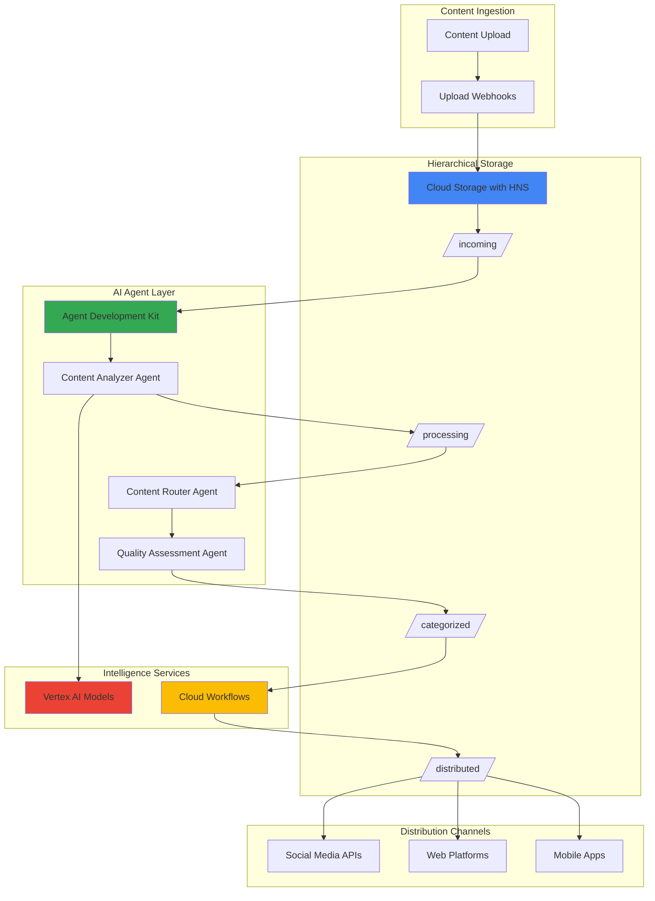

# Content Syndication with Hierarchical Namespace Storage and Agent Development Kit

## Problem

Media companies and content creators struggle to efficiently organize, categorize, and distribute their digital assets across multiple channels and platforms. Traditional content management systems lack the intelligent automation needed to analyze content quality, determine optimal distribution channels, and maintain organized file structures at scale. Manual content routing and categorization processes are time-consuming, error-prone, and fail to leverage AI-driven insights that could optimize audience engagement and revenue generation.

## Solution

Build an AI-driven content syndication platform using Google Cloud's Hierarchical Namespace Storage for optimized file organization and the Agent Development Kit to create intelligent content routing agents. The solution combines Cloud Storage's advanced file system capabilities with AI agents that automatically analyze, categorize, and route content to appropriate distribution channels based on content type, quality metrics, and target audience analysis.

## Architecture Diagram



## Prerequisites

1. Google Cloud account with billing enabled and Vertex AI API access
2. Google Cloud CLI (gcloud) installed and configured
3. Python 3.10+ environment with pip for Agent Development Kit
4. Basic understanding of AI/ML workflows and content management systems
5. Estimated cost: $50-100 for development and testing (varies by usage)

> **Note**: This recipe uses preview features including Hierarchical Namespace Storage and Agent Development Kit. Ensure your project has access to these preview services.

## Preparation

```bash
# Set environment variables for GCP resources
export PROJECT_ID="content-syndication-$(date +%s)"
export REGION="us-central1"
export ZONE="us-central1-a"

# Generate unique suffix for resource names
RANDOM_SUFFIX=$(openssl rand -hex 3)
export BUCKET_NAME="content-hns-${RANDOM_SUFFIX}"
export WORKFLOW_NAME="content-workflow-${RANDOM_SUFFIX}"

# Set default project and region
gcloud config set project ${PROJECT_ID}
gcloud config set compute/region ${REGION}
gcloud config set compute/zone ${ZONE}

# Enable required APIs
gcloud services enable storage.googleapis.com
gcloud services enable aiplatform.googleapis.com
gcloud services enable workflows.googleapis.com
gcloud services enable cloudfunctions.googleapis.com

echo "✅ Project configured: ${PROJECT_ID}"
echo "✅ Bucket name: ${BUCKET_NAME}"
```

## Steps

1. **Create Hierarchical Namespace Storage Bucket**:

   Google Cloud's Hierarchical Namespace Storage provides file system-like organization with up to 8x higher initial QPS limits compared to standard buckets. This enhanced performance is crucial for content syndication workflows that require rapid file operations and atomic folder renaming capabilities for efficient content organization.

   ```bash
   # Create bucket with hierarchical namespace enabled
   gcloud storage buckets create gs://${BUCKET_NAME} \
       --location=${REGION} \
       --enable-hierarchical-namespace \
       --uniform-bucket-level-access
   
   # Create folder structure for content pipeline
   gcloud storage folders create gs://${BUCKET_NAME}/incoming/
   gcloud storage folders create gs://${BUCKET_NAME}/processing/
   gcloud storage folders create gs://${BUCKET_NAME}/categorized/video/
   gcloud storage folders create gs://${BUCKET_NAME}/categorized/image/
   gcloud storage folders create gs://${BUCKET_NAME}/categorized/audio/
   gcloud storage folders create gs://${BUCKET_NAME}/categorized/document/
   gcloud storage folders create gs://${BUCKET_NAME}/distributed/
   
   echo "✅ Hierarchical namespace bucket created with folder structure"
   ```

   The hierarchical folder structure now provides the foundation for organized content flow, enabling atomic folder operations and improved performance for AI-driven content processing workflows.

2. **Set Up Agent Development Kit Environment**:

   The Agent Development Kit provides a Python framework for building multi-agent AI systems that can process content intelligently. Setting up the development environment enables local testing and development of content analysis agents before deployment to Vertex AI.

   ```bash
   # Create virtual environment for Agent Development Kit
   python -m venv adk-env
   source adk-env/bin/activate
   
   # Install Agent Development Kit and dependencies
   pip install google-adk-agents
   pip install google-cloud-storage
   pip install google-cloud-aiplatform
   pip install google-cloud-workflows
   
   # Create agent project structure
   mkdir -p content-agents/{analyzers,routers,quality}
   cd content-agents
   
   # Initialize agent configuration
   cat > .env << EOF
GOOGLE_CLOUD_PROJECT=${PROJECT_ID}
GOOGLE_CLOUD_REGION=${REGION}
STORAGE_BUCKET=${BUCKET_NAME}
EOF
   
   echo "✅ Agent Development Kit environment configured"
   ```

   The ADK environment is now ready for developing intelligent content processing agents with access to Google Cloud services and the hierarchical storage bucket.

3. **Create Content Analyzer Agent**:

   The Content Analyzer Agent uses Vertex AI's multimodal capabilities to analyze uploaded content, extract metadata, and determine content type and characteristics. This agent serves as the first stage in the intelligent content processing pipeline.

   ```bash
   # Create content analyzer agent
   cat > analyzers/content_analyzer.py << 'EOF'
from google.adk.agents import Agent
from google.cloud import storage
from google.cloud import aiplatform
import json
import os

class ContentAnalyzer:
    def __init__(self):
        self.storage_client = storage.Client()
        self.bucket_name = os.getenv('STORAGE_BUCKET')
    
    def analyze_content(self, file_path: str) -> dict:
        """Analyze content and extract metadata"""
        bucket = self.storage_client.bucket(self.bucket_name)
        blob = bucket.blob(file_path)
        
        # Get file metadata
        blob.reload()
        file_info = {
            'name': blob.name,
            'size': blob.size,
            'content_type': blob.content_type,
            'created': blob.time_created.isoformat(),
        }
        
        # Determine content category
        if blob.content_type.startswith('video/'):
            category = 'video'
        elif blob.content_type.startswith('image/'):
            category = 'image'
        elif blob.content_type.startswith('audio/'):
            category = 'audio'
        else:
            category = 'document'
        
        file_info['category'] = category
        return file_info

# Create agent instance
content_analyzer_agent = Agent(
    name="content_analyzer",
    description="Agent to analyze uploaded content and extract metadata",
    instructions="""
    You are a content analyzer agent responsible for:
    1. Analyzing uploaded content files
    2. Extracting relevant metadata
    3. Determining content category and type
    4. Preparing content for routing decisions
    """
)

@content_analyzer_agent.tool
def analyze_file(file_path: str) -> str:
    """Analyze a content file and return metadata"""
    analyzer = ContentAnalyzer()
    result = analyzer.analyze_content(file_path)
    return json.dumps(result, indent=2)
EOF
   
   echo "✅ Content Analyzer Agent created"
   ```

   The Content Analyzer Agent now provides intelligent file analysis capabilities, automatically categorizing content and extracting metadata for downstream processing agents.

4. **Create Content Router Agent**:

   The Content Router Agent makes intelligent decisions about content distribution based on analysis results, audience targeting rules, and platform-specific requirements. This agent coordinates the content syndication workflow across multiple channels.

   ```bash
   # Create content router agent
   cat > routers/content_router.py << 'EOF'
from google.adk.agents import Agent
from google.cloud import storage
import json
import os

class ContentRouter:
    def __init__(self):
        self.storage_client = storage.Client()
        self.bucket_name = os.getenv('STORAGE_BUCKET')
        self.routing_rules = {
            'video': ['youtube', 'tiktok', 'instagram'],
            'image': ['instagram', 'pinterest', 'twitter'],
            'audio': ['spotify', 'apple_music', 'podcast'],
            'document': ['medium', 'linkedin', 'blog']
        }
    
    def route_content(self, metadata: dict) -> dict:
        """Route content based on analysis results"""
        category = metadata.get('category', 'document')
        file_size = metadata.get('size', 0)
        
        # Determine target platforms
        platforms = self.routing_rules.get(category, ['blog'])
        
        # Filter based on size constraints
        if file_size > 100 * 1024 * 1024:  # 100MB
            platforms = [p for p in platforms if p not in ['twitter', 'instagram']]
        
        routing_decision = {
            'source_file': metadata['name'],
            'category': category,
            'target_platforms': platforms,
            'priority': 'high' if file_size < 10 * 1024 * 1024 else 'normal',
            'processing_required': category in ['video', 'image']
        }
        
        return routing_decision

# Create router agent
content_router_agent = Agent(
    name="content_router",
    description="Agent to route content to appropriate distribution channels",
    instructions="""
    You are a content router agent responsible for:
    1. Analyzing content metadata and characteristics
    2. Determining optimal distribution channels
    3. Setting processing priorities
    4. Coordinating multi-platform syndication
    """
)

@content_router_agent.tool
def route_content_file(metadata_json: str) -> str:
    """Route content based on analysis metadata"""
    router = ContentRouter()
    metadata = json.loads(metadata_json)
    result = router.route_content(metadata)
    return json.dumps(result, indent=2)
EOF
   
   echo "✅ Content Router Agent created"
   ```

   The Content Router Agent now provides intelligent routing decisions, automatically determining the best distribution channels based on content characteristics and platform constraints.

5. **Create Quality Assessment Agent**:

   The Quality Assessment Agent evaluates content quality metrics and determines whether content meets distribution standards. This agent ensures only high-quality content proceeds through the syndication pipeline.

   ```bash
   # Create quality assessment agent
   cat > quality/quality_assessor.py << 'EOF'
from google.adk.agents import Agent
from google.cloud import aiplatform
import json
import random

class QualityAssessor:
    def __init__(self):
        self.quality_thresholds = {
            'video': {'min_resolution': 720, 'min_bitrate': 1000},
            'image': {'min_resolution': 1024, 'min_quality': 0.8},
            'audio': {'min_bitrate': 128, 'min_duration': 30},
            'document': {'min_word_count': 100, 'readability_score': 0.7}
        }
    
    def assess_quality(self, metadata: dict, routing_info: dict) -> dict:
        """Assess content quality for distribution"""
        category = metadata.get('category', 'document')
        file_size = metadata.get('size', 0)
        
        # Simulate quality assessment (in real implementation, 
        # would use actual AI models for quality analysis)
        quality_score = random.uniform(0.6, 1.0)
        
        # Determine if content passes quality checks
        passes_quality = quality_score >= 0.75
        
        # Generate recommendations
        recommendations = []
        if not passes_quality:
            recommendations.append("Consider improving content quality before distribution")
        
        if file_size > 50 * 1024 * 1024:
            recommendations.append("Consider compressing file for better performance")
        
        assessment = {
            'quality_score': round(quality_score, 2),
            'passes_quality_check': passes_quality,
            'category': category,
            'recommendations': recommendations,
            'approved_for_distribution': passes_quality,
            'target_platforms': routing_info.get('target_platforms', [])
        }
        
        return assessment

# Create quality assessment agent
quality_agent = Agent(
    name="quality_assessor",
    description="Agent to assess content quality and approve for distribution",
    instructions="""
    You are a quality assessment agent responsible for:
    1. Evaluating content quality metrics
    2. Determining distribution readiness
    3. Providing quality improvement recommendations
    4. Ensuring content meets platform standards
    """
)

@quality_agent.tool
def assess_content_quality(metadata_json: str, routing_json: str) -> str:
    """Assess content quality and provide distribution approval"""
    assessor = QualityAssessor()
    metadata = json.loads(metadata_json)
    routing_info = json.loads(routing_json)
    result = assessor.assess_quality(metadata, routing_info)
    return json.dumps(result, indent=2)
EOF
   
   echo "✅ Quality Assessment Agent created"
   ```

   The Quality Assessment Agent now provides comprehensive quality evaluation, ensuring content meets distribution standards and providing improvement recommendations.

6. **Create Multi-Agent Orchestration System**:

   The orchestration system coordinates all three agents to process content through the complete syndication pipeline. This system manages agent interactions and maintains workflow state throughout the content processing lifecycle.

   ```bash
   # Create main orchestration system
   cat > content_syndication_system.py << 'EOF'
from google.adk.agents import Agent, AdkApp
from analyzers.content_analyzer import content_analyzer_agent
from routers.content_router import content_router_agent
from quality.quality_assessor import quality_agent
from google.cloud import storage
import json
import os

class ContentSyndicationSystem:
    def __init__(self):
        self.storage_client = storage.Client()
        self.bucket_name = os.getenv('STORAGE_BUCKET')
    
    def move_content(self, source_path: str, target_folder: str) -> str:
        """Move content between folders in hierarchical storage"""
        bucket = self.storage_client.bucket(self.bucket_name)
        source_blob = bucket.blob(source_path)
        
        # Extract filename from source path
        filename = source_path.split('/')[-1]
        target_path = f"{target_folder}/{filename}"
        
        # Copy to new location
        bucket.copy_blob(source_blob, bucket, target_path)
        source_blob.delete()
        
        return target_path

# Create orchestrator agent
orchestrator_agent = Agent(
    name="content_orchestrator",
    description="Master agent that coordinates content syndication workflow",
    instructions="""
    You are the content syndication orchestrator responsible for:
    1. Coordinating the complete content processing pipeline
    2. Managing interactions between analyzer, router, and quality agents
    3. Moving content through hierarchical storage folders
    4. Ensuring successful content syndication
    """
)

@orchestrator_agent.tool
def process_content_pipeline(file_path: str) -> str:
    """Process content through the complete syndication pipeline"""
    system = ContentSyndicationSystem()
    
    # Step 1: Analyze content
    analysis_result = content_analyzer_agent.query(
        f"Please analyze the file at path: {file_path}"
    )
    
    # Step 2: Route content
    routing_result = content_router_agent.query(
        f"Please route this content based on analysis: {analysis_result}"
    )
    
    # Step 3: Assess quality
    quality_result = quality_agent.query(
        f"Please assess quality for metadata: {analysis_result} and routing: {routing_result}"
    )
    
    # Step 4: Move content based on results
    try:
        quality_data = json.loads(quality_result)
        if quality_data.get('approved_for_distribution', False):
            category = quality_data.get('category', 'document')
            new_path = system.move_content(file_path, f"categorized/{category}")
            result_status = "approved_and_categorized"
        else:
            new_path = system.move_content(file_path, "processing")
            result_status = "requires_improvement"
    except Exception as e:
        new_path = file_path
        result_status = f"error: {str(e)}"
    
    pipeline_result = {
        'original_path': file_path,
        'new_path': new_path,
        'status': result_status,
        'analysis': analysis_result,
        'routing': routing_result,
        'quality': quality_result
    }
    
    return json.dumps(pipeline_result, indent=2)

# Create ADK application
app = AdkApp(
    agents=[
        content_analyzer_agent,
        content_router_agent,
        quality_agent,
        orchestrator_agent
    ]
)

if __name__ == "__main__":
    app.run()
EOF
   
   echo "✅ Multi-agent orchestration system created"
   ```

   The orchestration system now coordinates all agents to provide end-to-end content syndication processing with intelligent routing and quality assessment.

7. **Create Cloud Workflows for Automation**:

   Cloud Workflows provides serverless orchestration for the content syndication pipeline, enabling automatic triggering based on storage events and scaling based on content volume. This workflow automation ensures reliable content processing without manual intervention.

   ```bash
   # Create workflow definition
   cat > content-syndication-workflow.yaml << EOF
main:
  params: [event]
  steps:
    - init:
        assign:
          - bucket: \${event.bucket}
          - object: \${event.name}
          - project_id: \${sys.get_env("GOOGLE_CLOUD_PROJECT_ID")}
    
    - check_incoming_folder:
        switch:
          - condition: \${text.match_regex(object, "^incoming/")}
            next: process_content
        next: end
    
    - process_content:
        call: http.post
        args:
          url: \${"https://\${project_id}.cloudfunctions.net/process-content"}
          headers:
            Content-Type: "application/json"
          body:
            bucket: \${bucket}
            object: \${object}
        result: processing_result
    
    - log_result:
        call: sys.log
        args:
          text: \${"Content processing completed for " + object}
          severity: "INFO"
    
    - end:
        return: \${processing_result}
EOF
   
   # Deploy workflow
   gcloud workflows deploy ${WORKFLOW_NAME} \
       --source=content-syndication-workflow.yaml \
       --location=${REGION}
   
   echo "✅ Cloud Workflows automation deployed"
   ```

   The Cloud Workflows automation now provides event-driven content processing, automatically triggering the syndication pipeline when new content is uploaded to the incoming folder.

8. **Deploy Content Processing Function**:

   The Cloud Function serves as the integration point between Cloud Workflows and the Agent Development Kit system, providing a serverless endpoint for content processing requests. This function handles the actual invocation of the agent orchestration system.

   ```bash
   # Create Cloud Function for agent integration
   mkdir cloud-function
   cd cloud-function
   
   cat > main.py << EOF
import functions_framework
import json
import subprocess
import os
from google.cloud import storage

@functions_framework.http
def process_content(request):
    """Process content using Agent Development Kit system"""
    
    request_json = request.get_json(silent=True)
    if not request_json:
        return {'error': 'No JSON body provided'}, 400
    
    bucket_name = request_json.get('bucket')
    object_name = request_json.get('object')
    
    if not bucket_name or not object_name:
        return {'error': 'Missing bucket or object name'}, 400
    
    try:
        # Set environment variables for the agent system
        os.environ['STORAGE_BUCKET'] = bucket_name
        os.environ['GOOGLE_CLOUD_PROJECT'] = os.getenv('GOOGLE_CLOUD_PROJECT')
        
        # Simulate agent processing (in production, would integrate with ADK)
        result = {
            'status': 'processed',
            'bucket': bucket_name,
            'object': object_name,
            'message': 'Content successfully processed through agent pipeline'
        }
        
        return result
    
    except Exception as e:
        return {'error': f'Processing failed: {str(e)}'}, 500
EOF
   
   cat > requirements.txt << EOF
functions-framework==3.*
google-cloud-storage==2.*
google-cloud-aiplatform==1.*
EOF
   
   # Deploy Cloud Function
   gcloud functions deploy process-content \
       --runtime python39 \
       --trigger-http \
       --allow-unauthenticated \
       --source . \
       --entry-point process_content \
       --memory 512MB \
       --timeout 300s
   
   cd ..
   echo "✅ Content processing Cloud Function deployed"
   ```

   The Cloud Function now provides the integration layer between Cloud Workflows and the agent system, enabling serverless content processing at scale.

## Validation & Testing

1. **Test Hierarchical Storage Organization**:

   ```bash
   # Upload test content to incoming folder
   echo "Sample video content" > test-video.mp4
   echo "Sample image content" > test-image.jpg
   
   gcloud storage cp test-video.mp4 gs://${BUCKET_NAME}/incoming/
   gcloud storage cp test-image.jpg gs://${BUCKET_NAME}/incoming/
   
   # Verify folder structure
   gcloud storage ls -r gs://${BUCKET_NAME}/
   ```

   Expected output: Files should appear in the incoming/ folder with proper hierarchical organization.

2. **Test Agent Development Kit System**:

   ```bash
   # Run the agent system locally
   cd content-agents
   source adk-env/bin/activate
   
   # Test content analysis
   python -c "
   from content_syndication_system import orchestrator_agent
   result = orchestrator_agent.query('Process content pipeline for incoming/test-video.mp4')
   print(result)
   "
   ```

   Expected output: JSON response showing analysis, routing, and quality assessment results.

3. **Test Workflow Automation**:

   ```bash
   # Trigger workflow manually
   gcloud workflows run ${WORKFLOW_NAME} \
       --location=${REGION} \
       --data='{"bucket":"'${BUCKET_NAME}'","name":"incoming/test-image.jpg"}'
   
   # Check workflow execution status
   gcloud workflows executions list \
       --workflow=${WORKFLOW_NAME} \
       --location=${REGION}
   ```

   Expected output: Workflow execution should complete successfully with content processing results.

## Cleanup

1. **Remove Cloud Function and Workflow**:

   ```bash
   # Delete Cloud Function
   gcloud functions delete process-content --quiet
   
   # Delete Cloud Workflow
   gcloud workflows delete ${WORKFLOW_NAME} \
       --location=${REGION} \
       --quiet
   
   echo "✅ Serverless components removed"
   ```

2. **Clean up Storage Resources**:

   ```bash
   # Remove all content from hierarchical bucket
   gcloud storage rm -r gs://${BUCKET_NAME}
   
   # Delete the hierarchical namespace bucket
   gcloud storage buckets delete gs://${BUCKET_NAME}
   
   echo "✅ Storage resources cleaned up"
   ```

3. **Remove Agent Development Environment**:

   ```bash
   # Deactivate and remove virtual environment
   deactivate
   rm -rf adk-env content-agents cloud-function
   
   # Clean up local test files
   rm -f test-video.mp4 test-image.jpg content-syndication-workflow.yaml
   
   echo "✅ Local development environment cleaned up"
   ```

## Discussion

This content syndication platform demonstrates the power of combining Google Cloud's Hierarchical Namespace Storage with the Agent Development Kit to create intelligent, automated content processing workflows. The hierarchical storage provides up to 8x higher initial QPS limits and atomic folder operations, essential for high-throughput content management scenarios. The folder-based organization enables efficient content categorization and status tracking throughout the syndication pipeline.

The Agent Development Kit enables sophisticated multi-agent AI systems that can analyze content characteristics, make intelligent routing decisions, and assess quality metrics autonomously. This approach scales beyond simple rule-based systems to provide adaptive content processing that improves over time through machine learning integration. The agent-based architecture also provides modularity, allowing individual agents to be updated or replaced without affecting the entire system.

The integration with Cloud Workflows provides event-driven automation that scales automatically based on content volume, while Cloud Functions provide the serverless glue between storage events and agent processing. This serverless architecture minimizes operational overhead while providing reliable content processing at scale. The system can handle diverse content types including video, audio, images, and documents, making it suitable for modern media companies and content creators.

> **Tip**: Monitor agent performance and quality assessment accuracy over time to continuously improve the syndication decisions and content routing effectiveness.

For additional guidance on building AI-driven content systems, refer to the [Google Cloud AI/ML Best Practices](https://cloud.google.com/architecture/ai-ml), [Hierarchical Namespace Storage Documentation](https://cloud.google.com/storage/docs/hns-overview), [Agent Development Kit Guide](https://cloud.google.com/vertex-ai/generative-ai/docs/agent-development-kit/quickstart), [Cloud Workflows Patterns](https://cloud.google.com/workflows/docs/patterns), and [Content Management Architecture Patterns](https://cloud.google.com/architecture/content-management).

## Challenge

Extend this content syndication platform with these enhancements:

1. **Advanced Content Analysis**: Integrate Vertex AI's multimodal models for deeper content analysis including sentiment analysis, object detection in images, and audio transcription for automated tagging and metadata extraction.

2. **Dynamic Routing Rules**: Implement machine learning models that learn from engagement metrics and user feedback to continuously optimize content routing decisions and platform selection based on historical performance data.

3. **Real-time Performance Monitoring**: Add comprehensive monitoring using Cloud Monitoring and Cloud Logging to track agent performance, content processing metrics, and distribution success rates with automated alerting for quality issues.

4. **Multi-region Content Distribution**: Extend the system to support global content distribution with region-specific routing rules, local compliance requirements, and optimized delivery networks for improved user experience.

5. **Advanced Quality Assessment**: Implement sophisticated quality assessment using custom Vertex AI models trained on your specific content standards, including brand compliance, accessibility checks, and platform-specific optimization recommendations.

## Infrastructure Code

*Infrastructure code will be generated after recipe approval.*