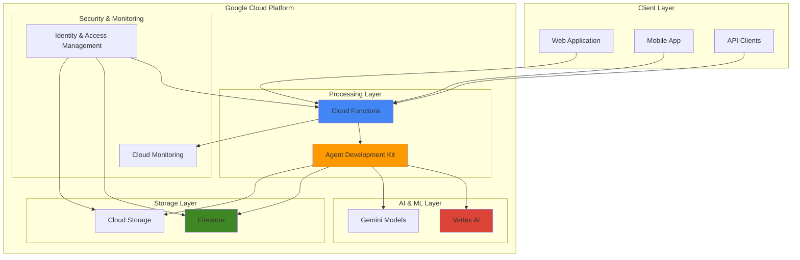

# Conversational AI Backends with Agent Development Kit and Firestore

## Problem

Organizations need to build sophisticated conversational AI systems that can handle complex multi-turn conversations, maintain context across interactions, and provide personalized responses based on user history and preferences. Traditional chatbot solutions often lack the intelligence to understand nuanced queries, fail to maintain conversation state effectively, and struggle to integrate with existing business systems and data sources.

## Solution

Google Cloud's Agent Development Kit (ADK) provides a comprehensive framework for building intelligent conversational agents that integrate seamlessly with Firestore for persistent conversation memory, Cloud Functions for scalable API processing, and Cloud Storage for managing conversation artifacts and training data. This architecture enables real-time, context-aware interactions with automatic scaling and enterprise-grade security.

## Architecture Diagram



## Prerequisites

1. Google Cloud account with billing enabled and the following APIs enabled:
   - Vertex AI API
   - Cloud Functions API
   - Cloud Firestore API
   - Cloud Storage API
   - Cloud Build API
2. Google Cloud CLI (gcloud) installed and configured
3. Python 3.10+ installed locally with pip
4. Basic understanding of conversational AI concepts and NoSQL databases
5. Estimated cost: $50-100/month for moderate usage (varies by conversation volume and model usage)

> **Note**: The Agent Development Kit is now generally available as the `google-adk` Python package. Ensure your Google Cloud project has the necessary APIs enabled before proceeding.

## Preparation

```bash
# Set environment variables for project configuration
export PROJECT_ID="conversational-ai-$(date +%s)"
export REGION="us-central1"
export ZONE="us-central1-a"

# Generate unique suffix for resource names
RANDOM_SUFFIX=$(openssl rand -hex 3)
export FUNCTION_NAME="chat-processor-${RANDOM_SUFFIX}"
export BUCKET_NAME="${PROJECT_ID}-conversations-${RANDOM_SUFFIX}"
export FIRESTORE_DATABASE="chat-conversations"

# Set default project and region
gcloud config set project ${PROJECT_ID}
gcloud config set compute/region ${REGION}
gcloud config set compute/zone ${ZONE}

# Create the project (if needed)
gcloud projects create ${PROJECT_ID} --name="Conversational AI Backend"

# Enable required APIs
gcloud services enable aiplatform.googleapis.com
gcloud services enable cloudfunctions.googleapis.com
gcloud services enable firestore.googleapis.com
gcloud services enable storage.googleapis.com
gcloud services enable cloudbuild.googleapis.com
gcloud services enable run.googleapis.com

echo "✅ Project configured: ${PROJECT_ID}"
echo "✅ Region set to: ${REGION}"
echo "✅ Required APIs enabled"
```

## Steps

1. **Initialize Firestore Database for Conversation Storage**:

   Firestore provides a NoSQL document database optimized for real-time applications and automatic scaling. For conversational AI systems, Firestore excels at storing conversation history, user context, and session state with strong consistency guarantees and real-time synchronization capabilities that ensure conversation continuity across multiple interactions and devices.

   ```bash
   # Create Firestore database in native mode
   gcloud firestore databases create \
       --database=${FIRESTORE_DATABASE} \
       --location=${REGION} \
       --type=firestore-native
   
   # Set default database for subsequent operations
   gcloud config set firestore/database ${FIRESTORE_DATABASE}
   
   # Create composite indexes for efficient conversation queries
   gcloud firestore indexes composite create \
       --collection-group=conversations \
       --field-config=field-path=userId,order=ascending \
       --field-config=field-path=timestamp,order=descending
   
   echo "✅ Firestore database created and configured"
   ```

   The Firestore database is now ready with optimized indexing for conversation retrieval patterns. This configuration enables efficient querying of user conversations by timestamp, supports real-time listeners for live chat features, and provides the foundation for maintaining conversation context across multiple interactions.

2. **Create Cloud Storage Bucket for Conversation Artifacts**:

   Cloud Storage provides unified object storage for conversation artifacts, training data, and model assets. The bucket configuration includes appropriate lifecycle policies and security settings to manage conversation data efficiently while maintaining compliance with data retention requirements.

   ```bash
   # Create Cloud Storage bucket with regional storage
   gsutil mb -p ${PROJECT_ID} \
       -c STANDARD \
       -l ${REGION} \
       gs://${BUCKET_NAME}
   
   # Enable versioning for conversation artifact protection
   gsutil versioning set on gs://${BUCKET_NAME}
   
   # Set lifecycle policy for automated cleanup
   cat > lifecycle.json << 'EOF'
   {
     "rule": [
       {
         "action": {"type": "Delete"},
         "condition": {
           "age": 90,
           "matchesPrefix": ["conversations/archived/"]
         }
       }
     ]
   }
   EOF
   
   gsutil lifecycle set lifecycle.json gs://${BUCKET_NAME}
   rm lifecycle.json
   
   echo "✅ Cloud Storage bucket created with lifecycle policies"
   ```

   The storage bucket is now configured with versioning and automated cleanup policies. This setup provides scalable storage for conversation logs, user-uploaded content, and training datasets while ensuring cost-effective data lifecycle management.

3. **Install and Configure Agent Development Kit**:

   The Agent Development Kit (ADK) is Google's open-source framework for building intelligent conversational agents. It provides powerful abstractions for managing conversation flow, integrating with Vertex AI models, and handling complex multi-turn interactions with built-in state management and tool integration capabilities.

   ```bash
   # Install Python dependencies for ADK
   pip install --upgrade pip
   pip install google-adk
   pip install google-cloud-firestore
   pip install google-cloud-storage
   pip install functions-framework
   
   # Set up authentication for local development
   gcloud auth application-default login
   
   # Create project structure
   mkdir -p conversation-agent/{src,config,functions}
   cd conversation-agent
   
   echo "✅ Agent Development Kit installed and configured"
   ```

   The ADK environment is now ready for agent development. This setup provides access to Google's latest conversational AI capabilities, including integration with Gemini models, tool calling functionality, and seamless connection to Google Cloud services.

4. **Create Intelligent Conversation Agent**:

   The conversation agent serves as the core intelligence layer, processing user inputs, maintaining conversation context, and generating appropriate responses. This agent integrates with Vertex AI for natural language understanding and uses Firestore for persistent conversation memory.

   ```bash
   # Create main agent configuration
   cat > config/agent_config.py << 'EOF'
   from google.adk.core import Agent, MemoryStore
   from google.cloud import firestore
   from google.cloud import storage
   import json
   import datetime
   from typing import Optional
   
   class ConversationAgent:
       def __init__(self, project_id: str, region: str, database_id: str):
           self.project_id = project_id
           self.region = region
           self.firestore_client = firestore.Client(
               project=project_id, 
               database=database_id
           )
           self.storage_client = storage.Client(project=project_id)
           
           # Initialize ADK agent with Gemini integration
           self.agent = Agent(
               name="intelligent_chat_agent",
               description="Advanced conversational AI agent with persistent memory",
               model="gemini-1.5-pro",
               project_id=project_id,
               location=region,
               memory_store=MemoryStore()
           )
   
       def process_conversation(self, user_id: str, message: str, session_id: Optional[str] = None) -> str:
           """Process user message and generate intelligent response"""
           # Retrieve conversation history from Firestore
           conversation_ref = self.firestore_client.collection('conversations').document(user_id)
           conversation_doc = conversation_ref.get()
           
           conversation_history = []
           if conversation_doc.exists:
               conversation_history = conversation_doc.to_dict().get('messages', [])
           
           # Add user message to history
           user_message = {
               'role': 'user',
               'content': message,
               'timestamp': datetime.datetime.now().isoformat(),
               'session_id': session_id
           }
           conversation_history.append(user_message)
           
           # Generate response using ADK with conversation context
           context = "\n".join([
               f"{msg['role']}: {msg['content']}" 
               for msg in conversation_history[-10:]  # Last 10 messages for context
           ])
           
           response = self.agent.run(
               input_text=f"Context: {context}\nUser: {message}",
               session_id=session_id or user_id
           )
           
           # Add assistant response to history
           assistant_message = {
               'role': 'assistant',
               'content': response,
               'timestamp': datetime.datetime.now().isoformat(),
               'session_id': session_id
           }
           conversation_history.append(assistant_message)
           
           # Store updated conversation in Firestore
           conversation_ref.set({
               'messages': conversation_history,
               'last_updated': datetime.datetime.now(),
               'user_id': user_id
           })
           
           return response
   EOF
   
   echo "✅ Conversation agent created with Firestore integration"
   ```

   The intelligent conversation agent is now configured with persistent memory capabilities. This implementation maintains conversation context across sessions, integrates with Vertex AI for natural language processing, and provides a scalable foundation for complex conversational workflows.

5. **Develop Cloud Functions API Layer**:

   Cloud Functions provides serverless compute for handling API requests, processing conversations, and managing real-time interactions. This layer handles HTTP requests, validates inputs, manages authentication, and orchestrates communication between the agent and storage systems.

   ```bash
   # Create main Cloud Function for conversation processing
   cat > functions/main.py << 'EOF'
   import os
   import json
   from flask import Flask, request, jsonify
   from google.cloud import firestore
   from google.cloud import storage
   import functions_framework
   from datetime import datetime
   import uuid
   import sys
   
   # Import our conversation agent
   sys.path.append('../config')
   from agent_config import ConversationAgent
   
   # Initialize agent
   PROJECT_ID = os.environ.get('PROJECT_ID')
   REGION = os.environ.get('REGION', 'us-central1')
   DATABASE_ID = os.environ.get('FIRESTORE_DATABASE', 'chat-conversations')
   
   agent = ConversationAgent(PROJECT_ID, REGION, DATABASE_ID)
   
   @functions_framework.http
   def chat_processor(request):
       """HTTP Cloud Function for processing chat messages"""
       # Handle CORS preflight requests
       if request.method == 'OPTIONS':
           headers = {
               'Access-Control-Allow-Origin': '*',
               'Access-Control-Allow-Methods': 'POST',
               'Access-Control-Allow-Headers': 'Content-Type, Authorization'
           }
           return ('', 204, headers)
       
       headers = {'Access-Control-Allow-Origin': '*'}
       
       try:
           # Validate request method
           if request.method != 'POST':
               return jsonify({'error': 'Method not allowed'}), 405, headers
           
           # Parse and validate request data
           data = request.get_json()
           if not data or 'message' not in data or 'user_id' not in data:
               return jsonify({'error': 'Missing required fields: message, user_id'}), 400, headers
           
           user_id = data['user_id']
           message = data['message']
           session_id = data.get('session_id', str(uuid.uuid4()))
           
           # Process conversation with error handling
           response = agent.process_conversation(user_id, message, session_id)
           
           return jsonify({
               'response': response,
               'session_id': session_id,
               'timestamp': datetime.now().isoformat(),
               'status': 'success'
           }), 200, headers
           
       except Exception as e:
           return jsonify({
               'error': str(e),
               'status': 'error'
           }), 500, headers
   
   @functions_framework.http
   def get_conversation_history(request):
       """HTTP Cloud Function for retrieving conversation history"""
       headers = {'Access-Control-Allow-Origin': '*'}
       
       try:
           user_id = request.args.get('user_id')
           if not user_id:
               return jsonify({'error': 'user_id parameter required'}), 400, headers
           
           # Retrieve conversation from Firestore
           firestore_client = firestore.Client(project=PROJECT_ID, database=DATABASE_ID)
           conversation_ref = firestore_client.collection('conversations').document(user_id)
           conversation_doc = conversation_ref.get()
           
           if not conversation_doc.exists:
               return jsonify({'messages': [], 'status': 'success'}), 200, headers
           
           conversation_data = conversation_doc.to_dict()
           messages = conversation_data.get('messages', [])
           
           return jsonify({
               'messages': messages,
               'last_updated': conversation_data.get('last_updated').isoformat() if conversation_data.get('last_updated') else None,
               'status': 'success'
           }), 200, headers
           
       except Exception as e:
           return jsonify({
               'error': str(e),
               'status': 'error'
           }), 500, headers
   EOF
   
   # Create requirements.txt for Cloud Functions
   cat > functions/requirements.txt << 'EOF'
   functions-framework==3.5.0
   google-cloud-firestore==2.16.0
   google-cloud-storage==2.10.0
   google-cloud-aiplatform==1.42.1
   google-adk==1.4.2
   Flask==3.0.0
   EOF
   
   echo "✅ Cloud Functions created for conversation processing"
   ```

   The Cloud Functions API layer provides scalable endpoints for conversation processing and history retrieval. This serverless architecture automatically scales based on demand, provides built-in security through IAM integration, and ensures low-latency response times for real-time conversations.

6. **Deploy Cloud Functions with Environment Configuration**:

   Deploying Cloud Functions requires proper environment configuration, dependency management, and security settings. The deployment process includes setting up environment variables, configuring memory and timeout settings, and establishing proper IAM permissions for service integration.

   ```bash
   # Deploy main conversation processing function
   gcloud functions deploy ${FUNCTION_NAME} \
       --gen2 \
       --runtime=python312 \
       --region=${REGION} \
       --source=functions \
       --entry-point=chat_processor \
       --trigger=http \
       --allow-unauthenticated \
       --memory=1GiB \
       --timeout=60s \
       --set-env-vars=PROJECT_ID=${PROJECT_ID},REGION=${REGION},FIRESTORE_DATABASE=${FIRESTORE_DATABASE}
   
   # Deploy conversation history function
   gcloud functions deploy ${FUNCTION_NAME}-history \
       --gen2 \
       --runtime=python312 \
       --region=${REGION} \
       --source=functions \
       --entry-point=get_conversation_history \
       --trigger=http \
       --allow-unauthenticated \
       --memory=512MiB \
       --timeout=30s \
       --set-env-vars=PROJECT_ID=${PROJECT_ID},REGION=${REGION},FIRESTORE_DATABASE=${FIRESTORE_DATABASE}
   
   # Get function URLs for API access
   CHAT_URL=$(gcloud functions describe ${FUNCTION_NAME} \
       --region=${REGION} \
       --format="value(serviceConfig.uri)")
   
   HISTORY_URL=$(gcloud functions describe ${FUNCTION_NAME}-history \
       --region=${REGION} \
       --format="value(serviceConfig.uri)")
   
   echo "✅ Cloud Functions deployed successfully"
   echo "Chat API URL: ${CHAT_URL}"
   echo "History API URL: ${HISTORY_URL}"
   ```

   The Cloud Functions are now deployed and ready to handle conversation requests. The functions are configured with appropriate memory allocation, timeout settings, and environment variables for seamless integration with Firestore and the Agent Development Kit.

7. **Create Conversation Context Management System**:

   Advanced conversation management requires sophisticated context handling, user preference tracking, and conversation state management. This system maintains conversation continuity, handles context switching, and provides personalized responses based on user history and preferences.

   ```bash
   # Create context management utilities
   cat > src/context_manager.py << 'EOF'
   from google.cloud import firestore
   from datetime import datetime, timedelta
   import json
   from typing import Dict, List, Any
   
   class ConversationContextManager:
       def __init__(self, firestore_client: firestore.Client):
           self.firestore_client = firestore_client
           
       def get_user_context(self, user_id: str) -> Dict[str, Any]:
           """Retrieve comprehensive user context"""
           user_ref = self.firestore_client.collection('user_contexts').document(user_id)
           user_doc = user_ref.get()
           
           if not user_doc.exists:
               # Create new user context with default values
               default_context = {
                   'user_id': user_id,
                   'preferences': {},
                   'conversation_topics': [],
                   'last_active': datetime.now(),
                   'total_conversations': 0,
                   'created_at': datetime.now()
               }
               user_ref.set(default_context)
               return default_context
           
           return user_doc.to_dict()
       
       def update_conversation_context(self, user_id: str, topic: str, sentiment: str, entities: List[str]):
           """Update conversation context with new information"""
           user_ref = self.firestore_client.collection('user_contexts').document(user_id)
           
           # Update user context with atomic operations
           user_ref.update({
               'conversation_topics': firestore.ArrayUnion([topic]),
               'last_active': datetime.now(),
               'total_conversations': firestore.Increment(1)
           })
           
           # Store conversation analytics for insights
           analytics_ref = self.firestore_client.collection('conversation_analytics').document()
           analytics_ref.set({
               'user_id': user_id,
               'topic': topic,
               'sentiment': sentiment,
               'entities': entities,
               'timestamp': datetime.now()
           })
       
       def get_conversation_suggestions(self, user_id: str) -> List[str]:
           """Generate conversation suggestions based on user context"""
           user_context = self.get_user_context(user_id)
           topics = user_context.get('conversation_topics', [])
           
           # Generate intelligent suggestions based on conversation history
           suggestions = []
           topic_set = set(topics)
           
           if 'technology' in topic_set:
               suggestions.append("What are the latest developments in AI technology?")
           if 'business' in topic_set:
               suggestions.append("Can you help me with business strategy planning?")
           if 'health' in topic_set:
               suggestions.append("What are some healthy lifestyle tips?")
           if not suggestions:  # Default suggestions for new users
               suggestions.extend([
                   "How can I get started with our services?",
                   "What are your most popular features?",
                   "Can you help me solve a problem?"
               ])
           
           return suggestions[:5]  # Return top 5 suggestions
   EOF
   
   echo "✅ Conversation context management system created"
   ```

   The context management system provides sophisticated conversation continuity and personalization capabilities. This system tracks user preferences, maintains conversation history, and generates intelligent suggestions based on past interactions, creating a more engaging and personalized conversational experience.

8. **Implement Real-time Conversation Monitoring**:

   Real-time monitoring provides insights into conversation performance, user engagement, and system health. This monitoring system tracks conversation metrics, identifies performance bottlenecks, and provides alerts for system issues or unusual conversation patterns.

   ```bash
   # Create monitoring and analytics functions
   cat > src/monitoring.py << 'EOF'
   from google.cloud import monitoring_v3
   from google.cloud import firestore
   import time
   import json
   from typing import Dict, Any
   
   class ConversationMonitoring:
       def __init__(self, project_id: str):
           self.project_id = project_id
           self.monitoring_client = monitoring_v3.MetricServiceClient()
           self.project_name = f"projects/{project_id}"
           
       def record_conversation_metrics(self, response_time: float, user_satisfaction: float, conversation_length: int):
           """Record custom metrics for conversation performance"""
           
           try:
               # Create response time metric
               series = monitoring_v3.TimeSeries()
               series.metric.type = "custom.googleapis.com/conversation/response_time"
               series.resource.type = "generic_node"
               series.resource.labels["project_id"] = self.project_id
               series.resource.labels["node_id"] = "conversation_agent"
               
               now = time.time()
               seconds = int(now)
               nanos = int((now - seconds) * 10 ** 9)
               interval = monitoring_v3.TimeInterval(
                   {"end_time": {"seconds": seconds, "nanos": nanos}}
               )
               
               point = monitoring_v3.Point({
                   "interval": interval,
                   "value": {"double_value": response_time},
               })
               series.points = [point]
               
               # Write the time series data
               self.monitoring_client.create_time_series(
                   name=self.project_name, 
                   time_series=[series]
               )
           except Exception as e:
               print(f"Error recording metrics: {e}")
       
       def analyze_conversation_patterns(self, user_id: str) -> Dict[str, Any]:
           """Analyze conversation patterns for insights"""
           firestore_client = firestore.Client(project=self.project_id)
           
           # Query recent conversations with error handling
           try:
               conversations = firestore_client.collection('conversations').where(
                   'user_id', '==', user_id
               ).limit(50).stream()
               
               patterns = {
                   'avg_message_length': 0,
                   'common_topics': [],
                   'conversation_frequency': 0,
                   'user_engagement_score': 0
               }
               
               # Analyze patterns with improved logic
               total_messages = 0
               total_length = 0
               
               for conv in conversations:
                   messages = conv.to_dict().get('messages', [])
                   for msg in messages:
                       if msg.get('role') == 'user':
                           total_messages += 1
                           total_length += len(msg.get('content', ''))
               
               if total_messages > 0:
                   patterns['avg_message_length'] = total_length / total_messages
                   patterns['user_engagement_score'] = min(total_messages / 10, 1.0)
               
               return patterns
           except Exception as e:
               print(f"Error analyzing patterns: {e}")
               return {'error': str(e)}
   EOF
   
   # Create Cloud Monitoring dashboard configuration
   cat > monitoring_dashboard.json << 'EOF'
   {
     "displayName": "Conversational AI Dashboard",
     "mosaicLayout": {
       "tiles": [
         {
           "width": 6,
           "height": 4,
           "widget": {
             "title": "Conversation Response Time",
             "xyChart": {
               "dataSets": [
                 {
                   "timeSeriesQuery": {
                     "timeSeriesFilter": {
                       "filter": "metric.type=\"custom.googleapis.com/conversation/response_time\"",
                       "aggregation": {
                         "alignmentPeriod": "60s",
                         "perSeriesAligner": "ALIGN_MEAN"
                       }
                     }
                   }
                 }
               ]
             }
           }
         }
       ]
     }
   }
   EOF
   
   echo "✅ Conversation monitoring system implemented"
   ```

   The monitoring system provides comprehensive insights into conversation performance and user engagement. This system tracks response times, analyzes conversation patterns, and provides custom metrics for optimizing the conversational AI experience.

## Validation & Testing

1. **Test Conversation Processing Function**:

   ```bash
   # Test the main conversation endpoint
   curl -X POST ${CHAT_URL} \
       -H "Content-Type: application/json" \
       -d '{
         "user_id": "test_user_123",
         "message": "Hello, can you help me with my project planning?",
         "session_id": "test_session_1"
       }'
   ```

   Expected output: JSON response with generated conversation reply and session information.

2. **Verify Firestore Data Storage**:

   ```bash
   # Check if conversation data is stored in Firestore
   gcloud firestore query \
       --collection-group=conversations \
       --limit=5 \
       --format="value(name,data)"
   
   # Check user context data
   gcloud firestore query \
       --collection-group=user_contexts \
       --limit=5 \
       --format="value(name,data)"
   ```

3. **Test Conversation History Retrieval**:

   ```bash
   # Test conversation history endpoint
   curl -X GET "${HISTORY_URL}?user_id=test_user_123" \
       -H "Content-Type: application/json"
   ```

   Expected output: JSON response with conversation history array.

4. **Validate Cloud Storage Integration**:

   ```bash
   # List objects in conversation bucket
   gsutil ls -la gs://${BUCKET_NAME}/
   
   # Check bucket configuration
   gsutil lifecycle get gs://${BUCKET_NAME}
   ```

5. **Monitor Function Performance**:

   ```bash
   # Check function logs
   gcloud functions logs read ${FUNCTION_NAME} \
       --region=${REGION} \
       --limit=10
   
   # View function metrics
   gcloud functions describe ${FUNCTION_NAME} \
       --region=${REGION} \
       --format="value(serviceConfig.availableMemory,serviceConfig.timeout)"
   ```

## Cleanup

1. **Delete Cloud Functions**:

   ```bash
   # Delete conversation processing functions
   gcloud functions delete ${FUNCTION_NAME} \
       --region=${REGION} \
       --quiet
   
   gcloud functions delete ${FUNCTION_NAME}-history \
       --region=${REGION} \
       --quiet
   
   echo "✅ Cloud Functions deleted"
   ```

2. **Remove Firestore Database**:

   ```bash
   # Delete Firestore database
   gcloud firestore databases delete ${FIRESTORE_DATABASE} \
       --quiet
   
   echo "✅ Firestore database deleted"
   ```

3. **Delete Cloud Storage Bucket**:

   ```bash
   # Remove all objects and delete bucket
   gsutil -m rm -r gs://${BUCKET_NAME}
   
   echo "✅ Cloud Storage bucket deleted"
   ```

4. **Clean Up Local Development Environment**:

   ```bash
   # Remove local project directory
   cd ..
   rm -rf conversation-agent
   
   # Clean up environment variables
   unset PROJECT_ID REGION ZONE FUNCTION_NAME BUCKET_NAME FIRESTORE_DATABASE
   
   echo "✅ Local environment cleaned up"
   ```

5. **Delete Google Cloud Project (Optional)**:

   ```bash
   # Delete the entire project if no longer needed
   gcloud projects delete ${PROJECT_ID} --quiet
   
   echo "✅ Google Cloud project deleted"
   echo "Note: Project deletion may take several minutes to complete"
   ```

## Discussion

The Agent Development Kit represents Google's latest approach to building sophisticated conversational AI systems, providing developers with powerful abstractions for managing complex conversational flows while maintaining enterprise-grade security and scalability. This architecture leverages Google's Gemini models for natural language understanding, Firestore for persistent conversation memory, and Cloud Functions for serverless API processing, creating a comprehensive solution for modern conversational AI applications.

The integration between ADK and Firestore enables sophisticated conversation continuity management, allowing agents to maintain context across multiple sessions while providing personalized responses based on user history and preferences. The NoSQL document structure of Firestore aligns perfectly with the conversational data model, supporting efficient storage and retrieval of conversation threads, user contexts, and conversation analytics. This combination provides the foundation for building chatbots that can handle complex, multi-turn conversations with human-like understanding and memory.

Cloud Functions serves as the critical middleware layer, providing scalable API endpoints that can handle varying conversation loads while maintaining low latency and high availability. The serverless architecture automatically scales based on demand, ensuring cost-effective operations during low-traffic periods while providing robust performance during peak usage. The integration with Cloud Monitoring provides real-time insights into conversation performance, user engagement metrics, and system health, enabling continuous optimization of the conversational AI experience.

The monitoring and analytics capabilities built into this architecture provide valuable insights into conversation patterns, user engagement, and system performance. These metrics enable data-driven optimization of conversation flows, identification of common user intents, and continuous improvement of the AI agent's responses. The real-time monitoring also provides early warning systems for performance degradation or unusual conversation patterns, ensuring reliable operation of the conversational AI system.

> **Tip**: Use conversation analytics to continuously improve your AI agent's performance by analyzing user interaction patterns and identifying areas for enhancement in conversation flow and response quality.

**References:**
- [Google Cloud Agent Development Kit Documentation](https://google.github.io/adk-docs/)
- [Firestore for Real-time Applications](https://cloud.google.com/firestore/docs/solutions)
- [Cloud Functions for Serverless Computing](https://cloud.google.com/functions/docs/concepts/overview)
- [Vertex AI Integration Patterns](https://cloud.google.com/vertex-ai/docs/start/introduction-unified-platform)
- [Conversational AI Best Practices](https://cloud.google.com/architecture/ai-ml/conversational-ai)

## Challenge

Extend this conversational AI backend by implementing these advanced features:

1. **Multi-language Support**: Integrate Google Cloud Translation API to provide real-time conversation translation, enabling global deployment with automatic language detection and response translation.

2. **Voice Integration**: Add Cloud Speech-to-Text and Text-to-Speech APIs to create a complete voice-enabled conversational AI system with audio processing capabilities.

3. **Advanced Analytics Dashboard**: Build a comprehensive analytics dashboard using Cloud Monitoring and BigQuery to track conversation metrics, user engagement patterns, and AI performance insights.

4. **Integration with External Systems**: Implement tool calling capabilities to integrate with external APIs, databases, and business systems, enabling the AI agent to perform actions beyond conversation.

5. **Conversation Flow Management**: Develop sophisticated conversation flow management with conditional logic, branching conversations, and context-aware response generation based on user intent classification.

## Infrastructure Code

### Available Infrastructure as Code:

- [Infrastructure Code Overview](code/README.md) - Detailed description of all infrastructure components
- [Infrastructure Manager](code/infrastructure-manager/) - GCP Infrastructure Manager templates
- [Bash CLI Scripts](code/scripts/) - Example bash scripts using gcloud CLI commands to deploy infrastructure
- [Terraform](code/terraform/) - Terraform configuration files