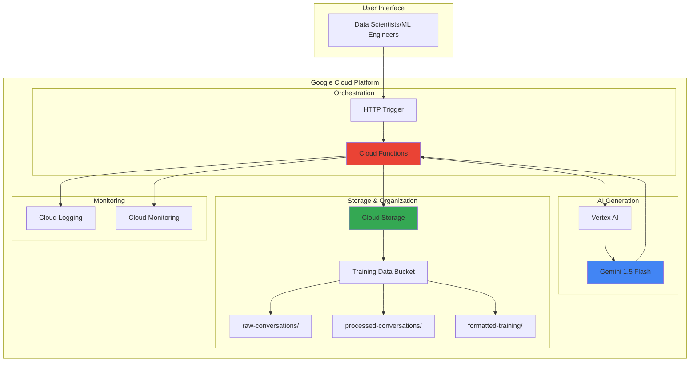

# Conversational AI Training Data Generation with Gemini and Cloud Storage

## Problem

AI chatbots and virtual assistants require extensive, high-quality conversational training data to perform effectively, but manually creating thousands of realistic dialogue examples is time-consuming and expensive. Many organizations struggle to generate diverse, contextually appropriate conversations that cover various scenarios, user intents, and response patterns needed for robust AI model training.

## Solution

Automatically generate synthetic conversational training data using Gemini's advanced language capabilities, organize the datasets efficiently in Cloud Storage with structured folder hierarchies, and orchestrate the entire workflow through Cloud Functions for scalable, event-driven processing that can produce thousands of training conversations on demand.

## Architecture Diagram



## Prerequisites

1. Google Cloud Platform account with billing enabled
2. gcloud CLI installed and configured
3. Basic understanding of machine learning and conversational AI concepts
4. Python programming knowledge for Cloud Functions
5. Estimated cost: $5-15 for resources created during this recipe

> **Note**: This recipe uses Vertex AI Gemini API which charges per token. Cost will vary based on the volume of conversational data generated.

## Preparation

```bash
# Set environment variables for GCP resources
export PROJECT_ID="conv-ai-training-$(date +%s)"
export REGION="us-central1"
export ZONE="us-central1-a"

# Generate unique suffix for resource names
RANDOM_SUFFIX=$(openssl rand -hex 3)

# Create new project (optional - use existing project if available)
gcloud projects create ${PROJECT_ID} \
    --name="Conversational AI Training"

# Set the active project and region
gcloud config set project ${PROJECT_ID}
gcloud config set compute/region ${REGION}
gcloud config set compute/zone ${ZONE}

# Enable billing for the project (replace BILLING_ACCOUNT_ID)
# gcloud billing projects link ${PROJECT_ID} \
#     --billing-account=BILLING_ACCOUNT_ID

# Enable required APIs
gcloud services enable compute.googleapis.com \
    cloudfunctions.googleapis.com \
    storage.googleapis.com \
    aiplatform.googleapis.com \
    cloudbuild.googleapis.com \
    logging.googleapis.com \
    monitoring.googleapis.com

echo "✅ Project configured: ${PROJECT_ID}"

# Set environment variables for resources
export BUCKET_NAME="training-data-${RANDOM_SUFFIX}"
export FUNCTION_NAME="conversation-generator-${RANDOM_SUFFIX}"

echo "✅ Environment variables configured"
```

## Steps

1. **Create Cloud Storage Bucket for Training Data Organization**:

   Google Cloud Storage provides the foundational data lake architecture for organizing conversational training datasets. The hierarchical folder structure enables efficient data management, version control, and access patterns that support both data generation and model training workflows. This organization strategy ensures datasets remain discoverable and maintainable as they scale.

   ```bash
   # Create Cloud Storage bucket with regional storage
   gsutil mb -p ${PROJECT_ID} \
       -c STANDARD \
       -l ${REGION} \
       gs://${BUCKET_NAME}
   
   # Enable versioning for data protection and lineage
   gsutil versioning set on gs://${BUCKET_NAME}
   
   # Create folder structure for organized data management
   echo "" | gsutil cp - gs://${BUCKET_NAME}/raw-conversations/.keep
   echo "" | gsutil cp - gs://${BUCKET_NAME}/processed-conversations/.keep
   echo "" | gsutil cp - gs://${BUCKET_NAME}/formatted-training/.keep
   echo "" | gsutil cp - gs://${BUCKET_NAME}/templates/.keep
   
   echo "✅ Storage bucket created with organized folder structure"
   ```

   The bucket now provides a scalable foundation for conversational data with versioning enabled for data lineage tracking. The folder structure separates raw generated content from processed training-ready datasets, supporting efficient data pipeline operations and model training workflows.

2. **Create Conversation Templates and Scenarios**:

   Conversation templates provide the structured foundation for generating diverse, realistic training data. These templates define conversation patterns, user intents, and response styles that guide Gemini's generation process, ensuring consistency while maintaining natural language variety across different use cases and domains.

   ```bash
   # Create conversation template file locally
   cat > conversation_templates.json << 'EOF'
{
  "templates": [
    {
      "scenario": "customer_support",
      "context": "Technical support for a software application",
      "user_intents": ["bug_report", "feature_request", "account_issue"],
      "conversation_length": "3-5 exchanges",
      "tone": "professional, helpful"
    },
    {
      "scenario": "e_commerce",
      "context": "Online shopping assistance and product inquiries",
      "user_intents": ["product_search", "order_status", "return_request"],
      "conversation_length": "2-4 exchanges",
      "tone": "friendly, sales-oriented"
    },
    {
      "scenario": "healthcare",
      "context": "General health information and appointment scheduling",
      "user_intents": ["symptom_inquiry", "appointment_booking", "medication_info"],
      "conversation_length": "4-6 exchanges",
      "tone": "empathetic, professional"
    }
  ]
}
EOF
   
   # Upload templates to Cloud Storage
   gsutil cp conversation_templates.json \
       gs://${BUCKET_NAME}/templates/
   
   echo "✅ Conversation templates created and uploaded"
   ```

   Templates are now stored in Cloud Storage, providing reusable conversation patterns that ensure generated training data covers diverse scenarios while maintaining consistency in structure and quality across different domains and use cases.

3. **Deploy Cloud Function for Conversation Generation**:

   Cloud Functions provides serverless orchestration for the conversation generation workflow, automatically scaling based on demand while integrating seamlessly with Vertex AI and Cloud Storage. This event-driven architecture enables efficient batch processing of training data generation requests with built-in error handling and monitoring.

   ```bash
   # Create Cloud Function source directory
   mkdir -p conversation-generator
   cd conversation-generator
   
   # Create the main function file
   cat > main.py << 'EOF'
import json
import os
from google.cloud import storage
import vertexai
from vertexai.generative_models import GenerativeModel
import logging
import uuid
from typing import Dict, List
import random
import functions_framework

# Initialize logging
logging.basicConfig(level=logging.INFO)
logger = logging.getLogger(__name__)

@functions_framework.http
def generate_conversations(request):
    """Cloud Function to generate conversational training data using Gemini."""
    
    try:
        # Set CORS headers for browser compatibility
        headers = {
            'Access-Control-Allow-Origin': '*',
            'Access-Control-Allow-Methods': 'GET, POST, OPTIONS',
            'Access-Control-Allow-Headers': 'Content-Type',
        }
        
        # Handle preflight request
        if request.method == 'OPTIONS':
            return ('', 204, headers)
            
        # Initialize Vertex AI
        project_id = os.getenv('GCP_PROJECT', os.getenv('GOOGLE_CLOUD_PROJECT'))
        region = os.getenv('FUNCTION_REGION', 'us-central1')
        vertexai.init(project=project_id, location=region)
        
        # Initialize storage client
        storage_client = storage.Client()
        bucket_name = os.getenv('BUCKET_NAME')
        bucket = storage_client.bucket(bucket_name)
        
        # Load conversation templates
        template_blob = bucket.blob('templates/conversation_templates.json')
        templates = json.loads(template_blob.download_as_text())
        
        # Initialize Gemini model
        model = GenerativeModel("gemini-1.5-flash-001")
        
        # Parse request parameters
        request_json = request.get_json(silent=True) or {}
        num_conversations = request_json.get('num_conversations', 10)
        scenario = request_json.get('scenario', 'customer_support')
        
        # Find matching template
        template = next((t for t in templates['templates'] 
                        if t['scenario'] == scenario), templates['templates'][0])
        
        conversations = []
        
        for i in range(num_conversations):
            # Generate conversation prompt
            intent = random.choice(template['user_intents'])
            prompt = f"""
            Generate a realistic conversation between a user and an AI assistant for the following scenario:
            
            Context: {template['context']}
            User Intent: {intent}
            Conversation Length: {template['conversation_length']}
            Tone: {template['tone']}
            
            Format the conversation as a JSON object with the following structure:
            {{
                "conversation_id": "unique_id",
                "scenario": "{scenario}",
                "intent": "{intent}",
                "messages": [
                    {{"role": "user", "content": "user message"}},
                    {{"role": "assistant", "content": "assistant response"}},
                    ...
                ]
            }}
            
            Make the conversation natural, diverse, and realistic. Vary the language, 
            specific details, and conversation flow while maintaining the core intent and tone.
            """
            
            # Generate conversation using Gemini
            response = model.generate_content(
                prompt,
                generation_config={
                    "temperature": 0.8,
                    "top_p": 0.9,
                    "max_output_tokens": 1024
                }
            )
            
            # Parse and store conversation
            try:
                # Clean response text and extract JSON
                response_text = response.text.strip()
                if response_text.startswith('```json'):
                    response_text = response_text[7:]
                if response_text.endswith('```'):
                    response_text = response_text[:-3]
                    
                conversation = json.loads(response_text.strip())
                conversation['conversation_id'] = str(uuid.uuid4())
                conversation['generated_timestamp'] = str(uuid.uuid1().time)
                conversations.append(conversation)
                
                logger.info(f"Generated conversation {i+1}/{num_conversations}")
                
            except json.JSONDecodeError as e:
                logger.warning(f"Failed to parse conversation {i+1}: {e}, skipping...")
                continue
        
        # Save conversations to Cloud Storage
        output_file = f"raw-conversations/{scenario}_{uuid.uuid4()}.json"
        blob = bucket.blob(output_file)
        blob.upload_from_string(
            json.dumps({"conversations": conversations}, indent=2),
            content_type='application/json'
        )
        
        result = {
            'status': 'success',
            'conversations_generated': len(conversations),
            'output_file': f"gs://{bucket_name}/{output_file}",
            'scenario': scenario
        }
        
        return (json.dumps(result), 200, headers)
        
    except Exception as e:
        logger.error(f"Error generating conversations: {str(e)}")
        error_result = {'status': 'error', 'message': str(e)}
        return (json.dumps(error_result), 500, headers)

EOF
   
   # Create requirements file
   cat > requirements.txt << 'EOF'
google-cloud-storage==2.18.0
google-cloud-aiplatform==1.60.0
vertexai==1.60.0
functions-framework==3.8.1
EOF
   
   # Deploy Cloud Function
   gcloud functions deploy ${FUNCTION_NAME} \
       --runtime python312 \
       --trigger-http \
       --allow-unauthenticated \
       --source . \
       --entry-point generate_conversations \
       --memory 1024MB \
       --timeout 540s \
       --set-env-vars BUCKET_NAME=${BUCKET_NAME}
   
   cd ..
   echo "✅ Cloud Function deployed successfully"
   ```

   The Cloud Function is now deployed with Gemini integration, providing a scalable API endpoint for generating conversational training data. The function automatically handles template loading, conversation generation, and data storage while maintaining proper error handling and logging for production reliability.

4. **Generate Sample Conversational Training Data**:

   Testing the conversation generation system validates the integration between Gemini, Cloud Storage, and Cloud Functions while producing initial training datasets. This step demonstrates the system's capability to generate diverse, contextually appropriate conversations that can be used immediately for model training and evaluation.

   ```bash
   # Get the Cloud Function trigger URL
   FUNCTION_URL=$(gcloud functions describe ${FUNCTION_NAME} \
       --format="value(httpsTrigger.url)")
   
   # Generate customer support conversations
   curl -X POST ${FUNCTION_URL} \
       -H "Content-Type: application/json" \
       -d '{
           "num_conversations": 15,
           "scenario": "customer_support"
       }' > customer_support_response.json
   
   # Generate e-commerce conversations
   curl -X POST ${FUNCTION_URL} \
       -H "Content-Type: application/json" \
       -d '{
           "num_conversations": 12,
           "scenario": "e_commerce"
       }' > ecommerce_response.json
   
   # Generate healthcare conversations
   curl -X POST ${FUNCTION_URL} \
       -H "Content-Type: application/json" \
       -d '{
           "num_conversations": 8,
           "scenario": "healthcare"
       }' > healthcare_response.json
   
   echo "✅ Generated sample conversational training data across multiple scenarios"
   ```

   Sample conversations are now generated and stored in Cloud Storage, demonstrating the system's ability to produce diverse training data across different domains. These conversations provide immediate value for model training while validating the end-to-end generation workflow.

5. **Create Data Processing and Formatting Function**:

   Data processing transforms raw generated conversations into training-ready formats compatible with popular machine learning frameworks and conversational AI platforms. This processing step ensures data quality, consistency, and proper formatting for efficient model training and evaluation workflows.

   ```bash
   # Create data processing function
   mkdir -p data-processor
   cd data-processor
   
   cat > main.py << 'EOF'
import json
from google.cloud import storage
import pandas as pd
from typing import List, Dict
import logging
import functions_framework

logging.basicConfig(level=logging.INFO)
logger = logging.getLogger(__name__)

@functions_framework.http
def process_conversations(request):
    """Process raw conversations into training-ready formats."""
    
    try:
        # Set CORS headers
        headers = {
            'Access-Control-Allow-Origin': '*',
            'Access-Control-Allow-Methods': 'GET, POST, OPTIONS',
            'Access-Control-Allow-Headers': 'Content-Type',
        }
        
        if request.method == 'OPTIONS':
            return ('', 204, headers)
            
        storage_client = storage.Client()
        request_json = request.get_json(silent=True) or {}
        bucket_name = request_json.get('bucket_name')
        
        if not bucket_name:
            return (json.dumps({'status': 'error', 'message': 'bucket_name required'}), 400, headers)
            
        bucket = storage_client.bucket(bucket_name)
        
        # List all raw conversation files
        raw_blobs = list(bucket.list_blobs(prefix='raw-conversations/'))
        
        all_conversations = []
        training_pairs = []
        
        # Process each file
        for blob in raw_blobs:
            if blob.name.endswith('.json') and not blob.name.endswith('.keep'):
                try:
                    content = json.loads(blob.download_as_text())
                    conversations = content.get('conversations', [])
                    
                    for conv in conversations:
                        all_conversations.append(conv)
                        
                        # Create training pairs from conversation messages
                        messages = conv.get('messages', [])
                        conversation_history = []
                        
                        for i, message in enumerate(messages):
                            if message['role'] == 'user':
                                # Find corresponding assistant response
                                if i + 1 < len(messages) and messages[i + 1]['role'] == 'assistant':
                                    training_pairs.append({
                                        'conversation_id': conv['conversation_id'],
                                        'scenario': conv['scenario'],
                                        'intent': conv['intent'],
                                        'conversation_history': conversation_history.copy(),
                                        'user_input': message['content'],
                                        'assistant_response': messages[i + 1]['content'],
                                        'turn_number': len(conversation_history) // 2 + 1
                                    })
                            
                            conversation_history.append({
                                'role': message['role'],
                                'content': message['content']
                            })
                except Exception as e:
                    logger.warning(f"Failed to process {blob.name}: {e}")
                    continue
        
        # Create different output formats
        formats = {
            'jsonl': create_jsonl_format(training_pairs),
            'csv': create_csv_format(training_pairs),
            'chatml': create_chatml_format(training_pairs)
        }
        
        # Save processed data in multiple formats
        for format_name, format_data in formats.items():
            blob_name = f"formatted-training/training_data.{format_name}"
            blob = bucket.blob(blob_name)
            blob.upload_from_string(format_data)
        
        # Create summary statistics
        stats = {
            'total_conversations': len(all_conversations),
            'total_training_pairs': len(training_pairs),
            'scenarios': list(set(conv['scenario'] for conv in all_conversations)),
            'intents': list(set(conv['intent'] for conv in all_conversations))
        }
        
        # Save statistics
        stats_blob = bucket.blob('processed-conversations/processing_stats.json')
        stats_blob.upload_from_string(json.dumps(stats, indent=2))
        
        result = {
            'status': 'success',
            'processed_conversations': len(all_conversations),
            'training_pairs_created': len(training_pairs),
            'output_formats': list(formats.keys()),
            'statistics': stats
        }
        
        return (json.dumps(result), 200, headers)
        
    except Exception as e:
        logger.error(f"Processing error: {str(e)}")
        error_result = {'status': 'error', 'message': str(e)}
        return (json.dumps(error_result), 500, headers)

def create_jsonl_format(training_pairs: List[Dict]) -> str:
    """Create JSONL format for training."""
    lines = []
    for pair in training_pairs:
        jsonl_record = {
            'messages': pair['conversation_history'] + [
                {'role': 'user', 'content': pair['user_input']},
                {'role': 'assistant', 'content': pair['assistant_response']}
            ],
            'metadata': {
                'scenario': pair['scenario'],
                'intent': pair['intent'],
                'turn_number': pair['turn_number']
            }
        }
        lines.append(json.dumps(jsonl_record))
    return '\n'.join(lines)

def create_csv_format(training_pairs: List[Dict]) -> str:
    """Create CSV format for training."""
    df_data = []
    for pair in training_pairs:
        history_text = ' '.join([f"{msg['role']}: {msg['content']}" 
                               for msg in pair['conversation_history']])
        df_data.append({
            'conversation_id': pair['conversation_id'],
            'scenario': pair['scenario'],
            'intent': pair['intent'],
            'conversation_history': history_text,
            'user_input': pair['user_input'],
            'assistant_response': pair['assistant_response'],
            'turn_number': pair['turn_number']
        })
    
    df = pd.DataFrame(df_data)
    return df.to_csv(index=False)

def create_chatml_format(training_pairs: List[Dict]) -> str:
    """Create ChatML format for training."""
    chatml_conversations = []
    for pair in training_pairs:
        conversation = []
        for msg in pair['conversation_history']:
            conversation.append(f"<|im_start|>{msg['role']}\n{msg['content']}<|im_end|>")
        conversation.append(f"<|im_start|>user\n{pair['user_input']}<|im_end|>")
        conversation.append(f"<|im_start|>assistant\n{pair['assistant_response']}<|im_end|>")
        chatml_conversations.append('\n'.join(conversation))
    
    return '\n\n'.join(chatml_conversations)
EOF
   
   # Create requirements file for processor
   cat > requirements.txt << 'EOF'
google-cloud-storage==2.18.0
pandas==2.2.0
functions-framework==3.8.1
EOF
   
   # Deploy processing function
   PROCESSOR_NAME="data-processor-${RANDOM_SUFFIX}"
   gcloud functions deploy ${PROCESSOR_NAME} \
       --runtime python312 \
       --trigger-http \
       --allow-unauthenticated \
       --source . \
       --entry-point process_conversations \
       --memory 1024MB \
       --timeout 540s
   
   cd ..
   echo "✅ Data processing function deployed successfully"
   ```

   The data processing function is now deployed with capabilities to transform raw conversations into multiple training-ready formats including JSONL, CSV, and ChatML. This ensures compatibility with various machine learning frameworks and conversational AI platforms for immediate model training use.

6. **Process and Format Training Data**:

   Processing the generated conversations creates structured training datasets in multiple formats suitable for different machine learning frameworks and conversational AI platforms. This step transforms raw conversation data into standardized formats that support efficient model training, evaluation, and deployment workflows.

   ```bash
   # Get processor function URL
   PROCESSOR_URL=$(gcloud functions describe ${PROCESSOR_NAME} \
       --format="value(httpsTrigger.url)")
   
   # Process all generated conversations
   curl -X POST ${PROCESSOR_URL} \
       -H "Content-Type: application/json" \
       -d "{\"bucket_name\": \"${BUCKET_NAME}\"}" \
       > processing_response.json
   
   # Display processing results
   cat processing_response.json | jq '.'
   
   echo "✅ Conversational data processed and formatted for training"
   ```

   The conversation data is now processed and available in multiple formats, providing immediate compatibility with popular machine learning frameworks and enabling efficient model training workflows for conversational AI development.

7. **Set Up Monitoring and Logging**:

   Comprehensive monitoring and logging provide operational visibility into the conversation generation system, enabling performance optimization, cost tracking, and quality assurance. This observability infrastructure supports production deployment with automated alerting and detailed analytics for system health and data quality metrics.

   ```bash
   # Create log-based metrics for conversation generation
   gcloud logging metrics create conversation_generation_success \
       --description="Successful conversation generation events" \
       --log-filter="resource.type=\"cloud_function\" 
                     resource.labels.function_name=\"${FUNCTION_NAME}\"
                     jsonPayload.status=\"success\""
   
   gcloud logging metrics create conversation_generation_errors \
       --description="Failed conversation generation events" \
       --log-filter="resource.type=\"cloud_function\" 
                     resource.labels.function_name=\"${FUNCTION_NAME}\"
                     severity=\"ERROR\""
   
   echo "✅ Monitoring and logging configured for production visibility"
   ```

   Monitoring infrastructure is now configured to track system performance, error rates, and operational metrics, providing the observability needed for production deployment and continuous optimization of the conversation generation system.

## Validation & Testing

1. **Verify Cloud Storage Organization**:

   ```bash
   # Check bucket structure and content
   gsutil ls -r gs://${BUCKET_NAME}/
   
   # Verify conversation files exist
   gsutil ls gs://${BUCKET_NAME}/raw-conversations/
   gsutil ls gs://${BUCKET_NAME}/formatted-training/
   ```

   Expected output: Organized folder structure with generated conversation files in JSON, JSONL, CSV, and ChatML formats.

2. **Test Conversation Quality**:

   ```bash
   # Download and examine sample conversations
   gsutil cp gs://${BUCKET_NAME}/formatted-training/training_data.jsonl \
       sample_training_data.jsonl
   
   # Display first few training examples
   head -3 sample_training_data.jsonl | jq '.'
   ```

   Expected output: Well-formatted conversational training data with diverse scenarios and natural dialogue patterns.

3. **Validate Function Performance**:

   ```bash
   # Check function logs for successful execution
   gcloud functions logs read ${FUNCTION_NAME} \
       --limit 20
   
   # Verify processing function logs
   gcloud functions logs read ${PROCESSOR_NAME} \
       --limit 10
   ```

   Expected output: Successful function execution logs with conversation generation metrics and processing statistics.

4. **Test Data Quality and Metrics**:

   ```bash
   # Download processing statistics
   gsutil cp gs://${BUCKET_NAME}/processed-conversations/processing_stats.json \
       stats.json
   
   # Review generation statistics
   cat stats.json | jq '.'
   ```

   Expected output: Comprehensive statistics showing conversation counts, scenarios covered, and intent distribution across the generated training dataset.

## Cleanup

1. **Remove Cloud Functions**:

   ```bash
   # Delete conversation generator function
   gcloud functions delete ${FUNCTION_NAME} --quiet
   
   # Delete data processor function
   gcloud functions delete ${PROCESSOR_NAME} --quiet
   
   echo "✅ Cloud Functions deleted"
   ```

2. **Remove Cloud Storage Resources**:

   ```bash
   # Delete all objects in bucket
   gsutil -m rm -r gs://${BUCKET_NAME}/**
   
   # Delete the bucket
   gsutil rb gs://${BUCKET_NAME}
   
   echo "✅ Storage resources cleaned up"
   ```

3. **Remove Monitoring Resources**:

   ```bash
   # Delete log-based metrics
   gcloud logging metrics delete conversation_generation_success --quiet
   gcloud logging metrics delete conversation_generation_errors --quiet
   
   echo "✅ Monitoring resources removed"
   ```

4. **Clean Local Files**:

   ```bash
   # Remove local directories and files
   rm -rf conversation-generator data-processor
   rm -f conversation_templates.json *.json
   
   echo "✅ Local files cleaned up"
   ```

## Discussion

This solution demonstrates a comprehensive approach to automated conversational AI training data generation using Google Cloud's modern AI and serverless infrastructure. The architecture leverages Gemini's advanced language understanding capabilities to produce diverse, contextually appropriate training conversations while Cloud Storage provides scalable data organization and Cloud Functions enable event-driven orchestration.

The template-driven approach ensures generated conversations maintain consistency and quality across different scenarios while allowing for natural language variation. By structuring conversation templates with specific contexts, intents, and tones, the system can generate thousands of training examples that cover comprehensive conversational patterns needed for robust AI model training. This approach significantly reduces the time and cost associated with manual conversation dataset creation.

The multi-format data processing capability ensures compatibility with various machine learning frameworks and conversational AI platforms. The system produces JSONL format for modern transformer training, CSV for traditional machine learning approaches, and ChatML for chat-optimized model fine-tuning. This flexibility enables teams to use the generated data across different training pipelines and model architectures without additional conversion steps.

The serverless architecture provides automatic scaling and cost optimization, charging only for actual generation requests while maintaining high availability. Cloud Functions automatically handle traffic spikes during batch generation while Cloud Storage provides virtually unlimited capacity for training datasets. The monitoring and logging integration ensures production-ready observability for performance optimization and quality assurance.

> **Tip**: Consider implementing conversation quality scoring using additional Gemini calls to evaluate generated content against predefined criteria for automated quality assurance.

Key documentation references used:
- [Vertex AI Gemini API Documentation](https://cloud.google.com/vertex-ai/docs/generative-ai/model-reference/gemini)
- [Google Cloud Storage Best Practices](https://cloud.google.com/storage/docs/best-practices)
- [Cloud Functions Python Runtime](https://cloud.google.com/functions/docs/concepts/python-runtime)
- [Vertex AI Machine Learning Workflows](https://cloud.google.com/vertex-ai/docs/training/overview)
- [Google Cloud Architecture Framework](https://cloud.google.com/architecture/framework)

## Challenge

Extend this solution by implementing these enhancements:

1. **Quality Assurance Pipeline**: Add automated conversation quality evaluation using Gemini to score generated conversations on naturalness, coherence, and appropriateness before including them in training datasets.

2. **Multi-language Support**: Extend the template system to generate conversations in multiple languages, leveraging Gemini's multilingual capabilities to create diverse international training datasets.

3. **Domain-specific Customization**: Implement industry-specific conversation templates and vocabulary for specialized domains like finance, healthcare, or legal services with appropriate compliance considerations.

4. **Real-time Generation API**: Create a streaming API that generates conversations in real-time as they're requested, enabling dynamic training data creation during model development workflows.

5. **Integration with Vertex AI Training**: Build automated pipelines that use generated conversation data to fine-tune conversational AI models directly within Vertex AI, creating end-to-end training automation.

## Infrastructure Code

### Available Infrastructure as Code:

- [Infrastructure Code Overview](code/README.md) - Detailed description of all infrastructure components
- [Infrastructure Manager](code/infrastructure-manager/) - GCP Infrastructure Manager templates
- [Bash CLI Scripts](code/scripts/) - Example bash scripts using gcloud CLI commands to deploy infrastructure
- [Terraform](code/terraform/) - Terraform configuration files