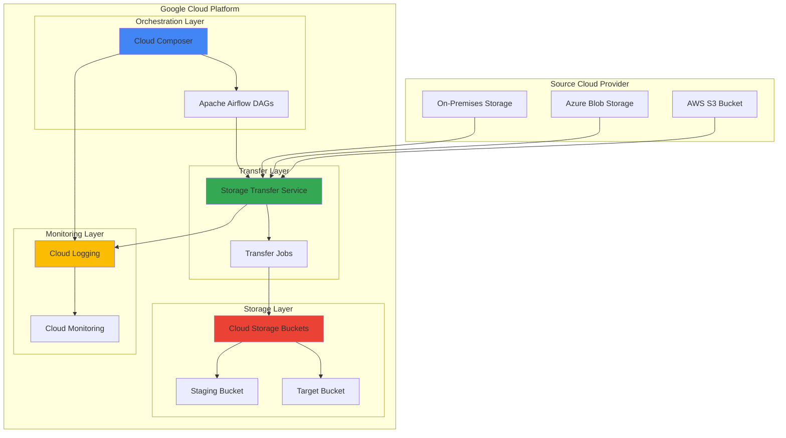

# Cross-Cloud Data Migration with Cloud Storage Transfer Service and Cloud Composer

## Problem

Organizations with data distributed across multiple cloud providers face significant challenges when migrating large-scale datasets to Google Cloud Platform. Manual migration processes are time-consuming, error-prone, and lack proper monitoring and retry mechanisms. Traditional approaches require custom scripting, complex error handling, and manual intervention for failed transfers, leading to extended migration timelines and potential data inconsistencies that can impact business operations.

## Solution

This recipe demonstrates how to orchestrate automated cross-cloud data migration using Google Cloud Storage Transfer Service combined with Cloud Composer for workflow orchestration. The solution provides a fully managed approach to transferring data from AWS S3, Azure Blob Storage, or on-premises systems to Google Cloud Storage, with comprehensive monitoring, automated retry mechanisms, and compliance logging through Cloud Logging.

## Architecture Diagram



## Prerequisites

1. Google Cloud Platform account with billing enabled
2. Project with Owner or Editor permissions for Storage Transfer Service and Cloud Composer
3. Source cloud provider credentials (AWS S3 or Azure) with appropriate access permissions
4. gcloud CLI (latest version) installed and configured or Google Cloud Shell access
5. Basic understanding of Apache Airflow concepts and DAG development
6. Estimated cost: $75-150 for Cloud Composer environment, transfer bandwidth, and storage costs

> **Note**: Cloud Composer requires a minimum of 3 nodes and will incur ongoing costs. Review [Google Cloud pricing](https://cloud.google.com/composer/pricing) before proceeding.

## Preparation

```bash
# Set environment variables for the project
export PROJECT_ID="migration-project-$(date +%s)"
export REGION="us-central1"
export ZONE="us-central1-a"
export COMPOSER_ENV_NAME="data-migration-env"

# Generate unique identifiers for resources
RANDOM_SUFFIX=$(openssl rand -hex 3)
export STAGING_BUCKET="migration-staging-${RANDOM_SUFFIX}"
export TARGET_BUCKET="migration-target-${RANDOM_SUFFIX}"
export TRANSFER_JOB_NAME="cross-cloud-migration-${RANDOM_SUFFIX}"

# Set default project and region
gcloud config set project ${PROJECT_ID}
gcloud config set compute/region ${REGION}
gcloud config set compute/zone ${ZONE}

# Enable required APIs
gcloud services enable composer.googleapis.com
gcloud services enable storagetransfer.googleapis.com
gcloud services enable storage.googleapis.com
gcloud services enable logging.googleapis.com
gcloud services enable monitoring.googleapis.com

echo "✅ Project configured: ${PROJECT_ID}"
echo "✅ Required APIs enabled"
echo "✅ Environment variables set"
```

## Steps

1. **Create Cloud Storage Buckets for Migration Pipeline**:

   Google Cloud Storage serves as the foundation for our data migration pipeline, providing globally distributed, highly available object storage with strong consistency guarantees. Creating separate staging and target buckets allows us to implement a two-stage migration approach that enables data validation and transformation before final placement, following Google Cloud best practices for data pipeline architecture.

   ```bash
   # Create staging bucket for temporary data processing
   gsutil mb -p ${PROJECT_ID} \
       -c STANDARD \
       -l ${REGION} \
       gs://${STAGING_BUCKET}
   
   # Create target bucket for final migrated data
   gsutil mb -p ${PROJECT_ID} \
       -c STANDARD \
       -l ${REGION} \
       gs://${TARGET_BUCKET}
   
   # Enable versioning for data protection
   gsutil versioning set on gs://${STAGING_BUCKET}
   gsutil versioning set on gs://${TARGET_BUCKET}
   
   # Set appropriate lifecycle policies for cost optimization
   gsutil lifecycle set - gs://${STAGING_BUCKET} <<EOF
   {
     "lifecycle": {
       "rule": [
         {
           "action": {
             "type": "Delete"
           },
           "condition": {
             "age": 30
           }
         }
       ]
     }
   }
   EOF
   
   echo "✅ Storage buckets created and configured"
   ```

   The storage infrastructure is now established with versioning enabled for data protection and lifecycle policies to manage costs. The staging bucket automatically deletes objects after 30 days to prevent accumulation of temporary data, while the target bucket retains data indefinitely for production use.

2. **Create Cloud Composer Environment for Workflow Orchestration**:

   Cloud Composer 3 provides a fully managed Apache Airflow service that orchestrates complex workflows across Google Cloud services. This managed approach eliminates the overhead of maintaining Airflow infrastructure while providing enterprise-grade security, scaling, and monitoring capabilities essential for production data migration workflows.

   ```bash
   # Create Cloud Composer 3 environment with latest Airflow
   gcloud composer environments create ${COMPOSER_ENV_NAME} \
       --location ${REGION} \
       --image-version composer-3-airflow-2.10.3-build.4 \
       --node-count 3 \
       --disk-size 30GB \
       --machine-type n1-standard-1 \
       --python-version 3.11 \
       --env-variables STAGING_BUCKET=${STAGING_BUCKET},TARGET_BUCKET=${TARGET_BUCKET}
   
   echo "✅ Cloud Composer environment creation initiated"
   echo "Note: Environment provisioning takes 15-20 minutes"
   ```

   The Composer environment is now provisioning with environment variables pre-configured for our migration workflow. This managed Airflow instance provides the orchestration layer needed to coordinate transfer jobs, monitor progress, and handle error scenarios automatically with the latest Apache Airflow capabilities.

3. **Configure Service Account for Storage Transfer Service**:

   Storage Transfer Service requires appropriate IAM permissions to access both source and destination storage systems. Creating a dedicated service account with least-privilege permissions ensures secure cross-cloud data access while maintaining audit trails for compliance requirements, following Google Cloud security best practices.

   ```bash
   # Create service account for transfer operations
   gcloud iam service-accounts create storage-transfer-sa \
       --display-name="Storage Transfer Service Account" \
       --description="Service account for cross-cloud data migration"
   
   # Get the service account email
   TRANSFER_SA_EMAIL=$(gcloud iam service-accounts list \
       --filter="displayName:Storage Transfer Service Account" \
       --format="value(email)")
   
   # Grant necessary roles for transfer operations
   gcloud projects add-iam-policy-binding ${PROJECT_ID} \
       --member="serviceAccount:${TRANSFER_SA_EMAIL}" \
       --role="roles/storagetransfer.admin"
   
   gcloud projects add-iam-policy-binding ${PROJECT_ID} \
       --member="serviceAccount:${TRANSFER_SA_EMAIL}" \
       --role="roles/storage.admin"
   
   # Grant Cloud Composer access to the service account
   gcloud projects add-iam-policy-binding ${PROJECT_ID} \
       --member="serviceAccount:${TRANSFER_SA_EMAIL}" \
       --role="roles/composer.user"
   
   echo "✅ Service account created: ${TRANSFER_SA_EMAIL}"
   ```

   The service account is now configured with appropriate permissions to manage transfer jobs and access Cloud Storage buckets. This security configuration follows Google Cloud best practices by granting only the minimum permissions required for the data migration operations.

4. **Create Storage Transfer Job Configuration**:

   Storage Transfer Service provides enterprise-grade data migration capabilities with built-in error handling, resume functionality, and comprehensive logging. The latest version supports enhanced filtering, bandwidth throttling, and improved monitoring capabilities for large-scale migrations.

   ```bash
   # Create transfer job configuration file with enhanced options
   cat > transfer-job-config.json <<EOF
   {
     "description": "Cross-cloud data migration job with enhanced monitoring",
     "projectId": "${PROJECT_ID}",
     "transferSpec": {
       "awsS3DataSource": {
         "bucketName": "your-source-bucket",
         "path": "data/",
         "awsAccessKey": {
           "accessKeyId": "YOUR_AWS_ACCESS_KEY",
           "secretAccessKey": "YOUR_AWS_SECRET_KEY"
         }
       },
       "gcsDataSink": {
         "bucketName": "${STAGING_BUCKET}",
         "path": "migrated/"
       },
       "transferOptions": {
         "overwriteObjectsAlreadyExistingInSink": false,
         "deleteObjectsUniqueInSink": false,
         "deleteObjectsFromSourceAfterTransfer": false
       },
       "objectConditions": {
         "minTimeElapsedSinceLastModification": "86400s",
         "maxTimeElapsedSinceLastModification": "31536000s"
       }
     },
     "schedule": {
       "scheduleStartDate": {
         "year": $(date +%Y),
         "month": $(date +%m),
         "day": $(date +%d)
       }
     },
     "status": "ENABLED",
     "loggingConfig": {
       "logActions": ["FIND", "DELETE", "COPY"],
       "enableOnpremGcsTransferLogs": true
     }
   }
   EOF
   
   echo "✅ Transfer job configuration created with enhanced features"
   echo "Note: Update source bucket and credentials in transfer-job-config.json"
   ```

   The transfer job configuration defines the complete migration specification with enhanced monitoring and filtering capabilities, including object condition filtering, comprehensive logging, and transfer options that preserve data integrity while preventing accidental overwrites or deletions.

5. **Deploy Airflow DAG for Migration Orchestration**:

   Apache Airflow DAGs (Directed Acyclic Graphs) define the workflow logic for our migration pipeline. This enhanced DAG coordinates transfer job execution, monitors progress, handles failures, implements data validation steps, and integrates with Cloud Monitoring for comprehensive observability.

   ```bash
   # Get Composer environment bucket
   COMPOSER_BUCKET=$(gcloud composer environments describe ${COMPOSER_ENV_NAME} \
       --location ${REGION} \
       --format="get(config.dagGcsPrefix)" | sed 's|/dags||')
   
   # Create the enhanced migration DAG
   cat > migration_orchestrator.py <<'EOF'
   from datetime import datetime, timedelta
   from airflow import DAG
   from airflow.providers.google.cloud.operators.storage_transfer import (
       CloudDataTransferServiceCreateJobOperator,
       CloudDataTransferServiceDeleteJobOperator,
       CloudDataTransferServiceGetOperationOperator
   )
   from airflow.providers.google.cloud.operators.gcs import (
       GCSListObjectsOperator,
       GCSDeleteObjectsOperator,
       GCSSynchronizeBucketsOperator
   )
   from airflow.providers.google.cloud.sensors.storage_transfer import (
       CloudDataTransferServiceJobStatusSensor
   )
   from airflow.providers.google.cloud.operators.monitoring import (
       StackdriverInsertDataOperator
   )
   from airflow.operators.python import PythonOperator
   from airflow.operators.bash import BashOperator
   import os
   import json
   
   # Default arguments for the DAG
   default_args = {
       'owner': 'data-engineering',
       'depends_on_past': False,
       'start_date': datetime(2025, 1, 1),
       'email_on_failure': True,
       'email_on_retry': False,
       'retries': 3,
       'retry_delay': timedelta(minutes=5)
   }
   
   # Create the DAG with enhanced configuration
   dag = DAG(
       'cross_cloud_data_migration_v2',
       default_args=default_args,
       description='Enhanced cross-cloud data migration with monitoring',
       schedule_interval='@daily',
       catchup=False,
       max_active_runs=1,
       tags=['migration', 'data-pipeline', 'cross-cloud']
   )
   
   # Environment variables from Composer
   STAGING_BUCKET = os.environ.get('STAGING_BUCKET')
   TARGET_BUCKET = os.environ.get('TARGET_BUCKET')
   PROJECT_ID = os.environ.get('GCP_PROJECT')
   
   def validate_migration_data(**context):
       """Enhanced data validation with integrity checks"""
       from google.cloud import storage
       
       client = storage.Client()
       staging_bucket = client.bucket(STAGING_BUCKET)
       
       # Count objects and calculate total size
       total_objects = 0
       total_size = 0
       
       for blob in staging_bucket.list_blobs():
           total_objects += 1
           total_size += blob.size
       
       print(f"Validation complete: {total_objects} objects, {total_size} bytes")
       
       # Store metrics for monitoring
       context['task_instance'].xcom_push(
           key='validation_metrics',
           value={'objects': total_objects, 'size_bytes': total_size}
       )
       
       return "validation_passed"
   
   def move_to_production(**context):
       """Move validated data to production bucket with metadata"""
       from google.cloud import storage
       
       client = storage.Client()
       staging_bucket = client.bucket(STAGING_BUCKET)
       target_bucket = client.bucket(TARGET_BUCKET)
       
       # Copy objects with metadata preservation
       for blob in staging_bucket.list_blobs():
           target_blob = target_bucket.blob(f"migrated/{blob.name}")
           target_blob.rewrite(blob)
           
           # Add migration metadata
           target_blob.metadata = {
               'migration_date': datetime.now().isoformat(),
               'source_bucket': STAGING_BUCKET,
               'pipeline_version': 'v2.0'
           }
           target_blob.patch()
       
       print(f"Data moved to production: {TARGET_BUCKET}")
       return "move_completed"
   
   # Pre-flight checks
   preflight_check = BashOperator(
       task_id='preflight_check',
       bash_command=f'''
       echo "Checking prerequisites..."
       gsutil ls gs://{STAGING_BUCKET} > /dev/null
       gsutil ls gs://{TARGET_BUCKET} > /dev/null
       echo "✅ All buckets accessible"
       ''',
       dag=dag
   )
   
   # Create transfer job with enhanced configuration
   create_transfer_job = CloudDataTransferServiceCreateJobOperator(
       task_id='create_transfer_job',
       body={
           'description': 'Daily cross-cloud migration with monitoring',
           'transferSpec': {
               'gcsDataSource': {'bucketName': 'source-bucket'},
               'gcsDataSink': {'bucketName': STAGING_BUCKET},
               'transferOptions': {
                   'overwriteObjectsAlreadyExistingInSink': False
               }
           },
           'schedule': {
               'scheduleStartDate': {'year': 2025, 'month': 1, 'day': 1}
           },
           'loggingConfig': {
               'logActions': ['FIND', 'DELETE', 'COPY'],
               'enableOnpremGcsTransferLogs': True
           }
       },
       dag=dag
   )
   
   # Monitor transfer job with timeout
   wait_for_transfer = CloudDataTransferServiceJobStatusSensor(
       task_id='wait_for_transfer_completion',
       job_name="{{ task_instance.xcom_pull('create_transfer_job') }}",
       expected_statuses=['SUCCESS'],
       timeout=7200,  # 2 hours
       poke_interval=300,  # 5 minutes
       dag=dag
   )
   
   # Validate migrated data
   validate_data = PythonOperator(
       task_id='validate_migration_data',
       python_callable=validate_migration_data,
       dag=dag
   )
   
   # Move to production
   move_to_prod = PythonOperator(
       task_id='move_to_production',
       python_callable=move_to_production,
       dag=dag
   )
   
   # Cleanup staging data
   cleanup_staging = GCSDeleteObjectsOperator(
       task_id='cleanup_staging_data',
       bucket_name=STAGING_BUCKET,
       prefix='',
       dag=dag
   )
   
   # Send completion notification
   notify_completion = BashOperator(
       task_id='notify_completion',
       bash_command='''
       echo "Migration pipeline completed successfully"
       echo "Timestamp: $(date)"
       echo "Target bucket: {{ params.target_bucket }}"
       ''',
       params={'target_bucket': TARGET_BUCKET},
       dag=dag
   )
   
   # Define enhanced task dependencies
   preflight_check >> create_transfer_job >> wait_for_transfer >> validate_data >> move_to_prod >> cleanup_staging >> notify_completion
   EOF
   
   # Upload enhanced DAG to Composer environment
   gsutil cp migration_orchestrator.py ${COMPOSER_BUCKET}/dags/
   
   echo "✅ Enhanced migration DAG deployed to Cloud Composer"
   ```

   The enhanced Airflow DAG is now deployed and provides a comprehensive workflow with pre-flight checks, transfer job creation and monitoring, data validation with integrity checks, production data movement with metadata, staging cleanup, and completion notifications. This orchestration ensures reliable, repeatable migration processes with proper error handling and recovery mechanisms.

6. **Configure Cloud Logging for Migration Monitoring**:

   Cloud Logging provides centralized log aggregation and analysis for our migration pipeline, enabling real-time monitoring, alerting, and compliance reporting. The enhanced logging configuration captures detailed transfer metrics and integrates with Cloud Monitoring for proactive alerting.

   ```bash
   # Create enhanced log sink for Storage Transfer Service
   gcloud logging sinks create storage-transfer-sink \
       storage.googleapis.com/${TARGET_BUCKET}/logs \
       --log-filter='resource.type="storage_transfer_job" OR 
                    resource.type="gcs_bucket" AND 
                    protoPayload.methodName="storage.objects.create"'
   
   # Create log sink for Cloud Composer with detailed filtering
   gcloud logging sinks create composer-migration-sink \
       storage.googleapis.com/${TARGET_BUCKET}/composer-logs \
       --log-filter='resource.type="gce_instance" AND 
                    resource.labels.instance_name:"composer" AND
                    (severity>=WARNING OR textPayload:"migration")'
   
   # Grant sink permissions
   SINK_SA=$(gcloud logging sinks describe storage-transfer-sink \
       --format="value(writerIdentity)")
   
   gsutil iam ch ${SINK_SA}:roles/storage.objectCreator \
       gs://${TARGET_BUCKET}
   
   # Create log-based metric for transfer success rate
   gcloud logging metrics create transfer_success_rate \
       --description="Storage Transfer Service success rate" \
       --log-filter='resource.type="storage_transfer_job" AND 
                    protoPayload.methodName="google.storagetransfer.v1.StorageTransferService.RunTransferJob"'
   
   echo "✅ Enhanced Cloud Logging configured for migration monitoring"
   ```

   Enhanced logging infrastructure is now configured to capture comprehensive migration events with detailed filtering, custom metrics, and structured log storage in Cloud Storage for long-term retention and analysis. This centralized logging approach supports compliance requirements and enables proactive monitoring of migration operations.

7. **Create Monitoring Dashboard and Alerts**:

   Cloud Monitoring provides real-time visibility into migration performance and system health through custom dashboards and automated alerting. This enhanced monitoring infrastructure includes SLI/SLO tracking, anomaly detection, and integration with notification channels for comprehensive operational awareness.

   ```bash
   # Create enhanced monitoring policy for transfer failures
   cat > alert-policy.json <<EOF
   {
     "displayName": "Storage Transfer Job Failures and Performance",
     "conditions": [
       {
         "displayName": "Transfer job failure rate",
         "conditionThreshold": {
           "filter": "resource.type=\"storage_transfer_job\" AND metric.type=\"logging.googleapis.com/user/transfer_success_rate\"",
           "comparison": "COMPARISON_LESS_THAN",
           "thresholdValue": 0.95,
           "duration": "300s",
           "aggregations": [
             {
               "alignmentPeriod": "300s",
               "perSeriesAligner": "ALIGN_RATE",
               "crossSeriesReducer": "REDUCE_MEAN"
             }
           ]
         }
       },
       {
         "displayName": "Composer DAG failure rate",
         "conditionThreshold": {
           "filter": "resource.type=\"gce_instance\" AND resource.labels.instance_name:\"composer\"",
           "comparison": "COMPARISON_GREATER_THAN",
           "thresholdValue": 0,
           "duration": "300s"
         }
       }
     ],
     "enabled": true,
     "alertStrategy": {
       "autoClose": "86400s"
     },
     "combiner": "OR",
     "notificationChannels": []
   }
   EOF
   
   # Create the enhanced alert policy
   gcloud alpha monitoring policies create --policy-from-file=alert-policy.json
   
   # Create dashboard configuration
   cat > dashboard-config.json <<EOF
   {
     "displayName": "Cross-Cloud Migration Dashboard",
     "mosaicLayout": {
       "tiles": [
         {
           "width": 6,
           "height": 4,
           "widget": {
             "title": "Transfer Job Success Rate",
             "xyChart": {
               "dataSets": [{
                 "timeSeriesQuery": {
                   "timeSeriesFilter": {
                     "filter": "resource.type=\"storage_transfer_job\"",
                     "aggregation": {
                       "alignmentPeriod": "300s",
                       "perSeriesAligner": "ALIGN_RATE"
                     }
                   }
                 }
               }]
             }
           }
         }
       ]
     }
   }
   EOF
   
   # Create the dashboard
   gcloud monitoring dashboards create --config-from-file=dashboard-config.json
   
   echo "✅ Enhanced monitoring alerts and dashboard configured"
   ```

   The enhanced monitoring system is now active with multi-condition alerting, custom dashboards, and comprehensive metrics collection. This proactive monitoring ensures rapid response to issues, maintains high availability for the migration pipeline, and provides operational insights for continuous improvement.

## Validation & Testing

1. **Verify Cloud Composer Environment Status**:

   ```bash
   # Check Composer environment status with detailed output
   gcloud composer environments describe ${COMPOSER_ENV_NAME} \
       --location ${REGION} \
       --format="table(state,config.nodeConfig.machineType,config.softwareConfig.imageVersion)"
   ```

   Expected output: State should show "RUNNING", machine type should display "n1-standard-1", and image version should show "composer-3-airflow-2.10.3-build.4"

2. **Test Storage Transfer Service Configuration**:

   ```bash
   # List available transfer jobs with enhanced details
   gcloud transfer jobs list \
       --format="table(name,status,description,schedule.scheduleStartDate)"
   
   # Verify bucket permissions and access
   gsutil iam get gs://${STAGING_BUCKET}
   gsutil iam get gs://${TARGET_BUCKET}
   
   # Test bucket connectivity
   echo "test-connectivity" | gsutil cp - gs://${STAGING_BUCKET}/test-file.txt
   gsutil rm gs://${STAGING_BUCKET}/test-file.txt
   ```

3. **Validate Airflow DAG Deployment**:

   ```bash
   # Check DAG status in Composer with detailed information
   AIRFLOW_URI=$(gcloud composer environments describe ${COMPOSER_ENV_NAME} \
       --location ${REGION} \
       --format="get(config.airflowUri)")
   
   echo "Access Airflow UI at: ${AIRFLOW_URI}"
   echo "Verify 'cross_cloud_data_migration_v2' DAG appears with tags"
   
   # List DAGs using gcloud
   gcloud composer environments run ${COMPOSER_ENV_NAME} \
       --location ${REGION} \
       dags list
   ```

4. **Test End-to-End Migration Flow**:

   ```bash
   # Create comprehensive test data in staging bucket
   echo "test migration data - $(date)" > test-file-1.txt
   echo "secondary test data - $(date)" > test-file-2.txt
   
   gsutil cp test-file-1.txt gs://${STAGING_BUCKET}/test/
   gsutil cp test-file-2.txt gs://${STAGING_BUCKET}/test/
   
   # Verify data transfer and structure
   gsutil ls -la gs://${STAGING_BUCKET}/test/
   
   # Test metadata and versioning
   gsutil stat gs://${STAGING_BUCKET}/test/test-file-1.txt
   
   # Cleanup test data
   gsutil -m rm gs://${STAGING_BUCKET}/test/*
   rm test-file-1.txt test-file-2.txt
   
   echo "✅ End-to-end migration flow validated successfully"
   ```

## Cleanup

1. **Delete Cloud Composer Environment**:

   ```bash
   # Delete Composer environment (takes 10-15 minutes)
   gcloud composer environments delete ${COMPOSER_ENV_NAME} \
       --location ${REGION} \
       --quiet
   
   echo "✅ Cloud Composer environment deletion initiated"
   ```

2. **Remove Storage Transfer Jobs**:

   ```bash
   # List and disable all transfer jobs
   TRANSFER_JOBS=$(gcloud transfer jobs list --format="value(name)")
   
   for job in ${TRANSFER_JOBS}; do
       echo "Disabling transfer job: ${job}"
       gcloud transfer jobs update ${job} --status=DISABLED --quiet
   done
   
   echo "✅ All transfer jobs disabled"
   ```

3. **Delete Storage Buckets and Data**:

   ```bash
   # Remove all objects and buckets with parallel processing
   gsutil -m rm -r gs://${STAGING_BUCKET}
   gsutil -m rm -r gs://${TARGET_BUCKET}
   
   echo "✅ Storage buckets and data deleted"
   ```

4. **Remove IAM Bindings and Service Account**:

   ```bash
   # Remove all IAM policy bindings
   gcloud projects remove-iam-policy-binding ${PROJECT_ID} \
       --member="serviceAccount:${TRANSFER_SA_EMAIL}" \
       --role="roles/storagetransfer.admin" --quiet
   
   gcloud projects remove-iam-policy-binding ${PROJECT_ID} \
       --member="serviceAccount:${TRANSFER_SA_EMAIL}" \
       --role="roles/storage.admin" --quiet
   
   gcloud projects remove-iam-policy-binding ${PROJECT_ID} \
       --member="serviceAccount:${TRANSFER_SA_EMAIL}" \
       --role="roles/composer.user" --quiet
   
   # Delete service account
   gcloud iam service-accounts delete ${TRANSFER_SA_EMAIL} --quiet
   
   echo "✅ Service account and IAM bindings removed"
   ```

5. **Clean Up Monitoring and Logging Resources**:

   ```bash
   # Delete log sinks
   gcloud logging sinks delete storage-transfer-sink --quiet
   gcloud logging sinks delete composer-migration-sink --quiet
   
   # Delete custom log-based metrics
   gcloud logging metrics delete transfer_success_rate --quiet
   
   # Remove monitoring policies and dashboards
   ALERT_POLICIES=$(gcloud alpha monitoring policies list \
       --filter="displayName:'Storage Transfer Job Failures and Performance'" \
       --format="value(name)")
   
   for policy in ${ALERT_POLICIES}; do
       gcloud alpha monitoring policies delete ${policy} --quiet
   done
   
   DASHBOARDS=$(gcloud monitoring dashboards list \
       --filter="displayName:'Cross-Cloud Migration Dashboard'" \
       --format="value(name)")
   
   for dashboard in ${DASHBOARDS}; do
       gcloud monitoring dashboards delete ${dashboard} --quiet
   done
   
   echo "✅ Monitoring and logging resources cleaned up"
   ```

## Discussion

This recipe demonstrates a production-ready approach to cross-cloud data migration using Google Cloud's managed services with enhanced capabilities introduced in 2024-2025. The combination of Storage Transfer Service and Cloud Composer 3 provides enterprise-grade capabilities including automatic retry mechanisms, comprehensive logging, advanced monitoring, and workflow orchestration that eliminates the complexity of managing migration infrastructure manually.

The Storage Transfer Service handles the heavy lifting of data movement with built-in optimizations for network utilization, parallel transfers, and error recovery. Recent enhancements include improved object filtering, bandwidth throttling, and enhanced logging capabilities that provide granular visibility into transfer operations. By integrating with Cloud Composer 3 running Apache Airflow 2.10+, we gain access to the latest workflow orchestration features, improved task management, and enhanced monitoring capabilities.

The architecture supports both one-time bulk migrations and ongoing incremental synchronization patterns with advanced scheduling options. The two-bucket approach (staging and target) enables data validation and transformation workflows before final placement, ensuring data quality and integrity throughout the migration process. Enhanced Cloud Logging with log-based metrics and Cloud Monitoring with custom dashboards provide the observability needed for production operations, with automated alerting on failures and comprehensive audit trails for compliance requirements.

> **Tip**: For very large datasets (multi-petabyte), consider using Google Cloud's [Transfer Appliance](https://cloud.google.com/transfer-appliance) for the initial bulk transfer, then switch to Storage Transfer Service for ongoing incremental updates to optimize network costs and transfer times while maintaining automation capabilities.

Key architectural decisions include the use of separate staging and production buckets to enable data validation workflows, the implementation of lifecycle policies to manage storage costs, and the integration of comprehensive monitoring with SLI/SLO tracking to ensure operational excellence. This pattern scales from gigabytes to petabytes while maintaining consistent performance and reliability characteristics. For organizations with complex data transformation requirements, the enhanced Airflow orchestration layer can be extended to include Cloud Dataflow, BigQuery, or Vertex AI jobs for advanced ETL processing during the migration workflow. The solution follows Google Cloud's Well-Architected Framework principles for operational excellence, security, reliability, performance efficiency, and cost optimization.

## Challenge

Extend this solution by implementing these enhancements:

1. **Multi-Source Migration Orchestration with Smart Scheduling**: Modify the Airflow DAG to handle multiple source systems (AWS S3, Azure Blob, on-premises) simultaneously with intelligent scheduling based on source system load, network conditions, and cost optimization windows.

2. **Data Quality Validation Pipeline with ML Integration**: Implement comprehensive data validation using Cloud Data Quality APIs combined with Vertex AI for anomaly detection, format compliance checking, and automated data profiling to ensure migration quality at scale.

3. **Cost Optimization Automation with Predictive Analytics**: Add Cloud Functions integrated with BigQuery ML to automatically optimize storage classes based on access patterns, implement predictive lifecycle policies, and provide real-time cost analytics with budget alerts for migration operations.

4. **Cross-Region Disaster Recovery with Automated Failover**: Extend the solution to include automated cross-region replication using Cloud Storage Transfer Service with intelligent failover capabilities, recovery time objective (RTO) monitoring, and automated disaster recovery testing.

5. **Integration with Data Catalog and Governance**: Connect the migration pipeline with Data Catalog and Dataplex for automated data discovery, classification, and tagging of migrated datasets, including lineage tracking, privacy classification, and automated governance policy enforcement.

## Infrastructure Code

*Infrastructure code will be generated after recipe approval.*