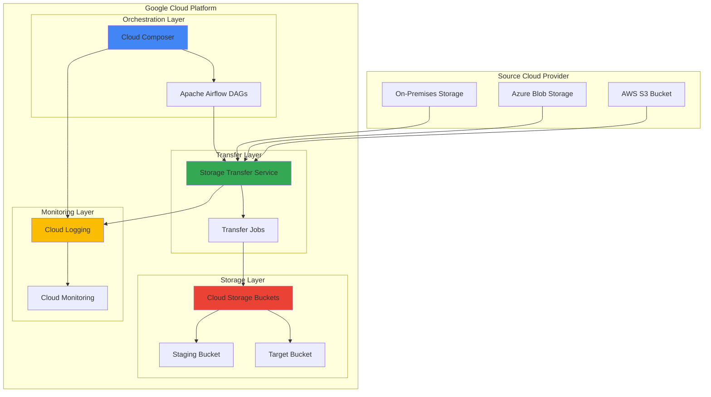

# Cross-Cloud Data Migration with Cloud Storage Transfer Service and Cloud Composer

## Problem

Organizations with data distributed across multiple cloud providers face significant challenges when migrating large-scale datasets to Google Cloud Platform. Manual migration processes are time-consuming, error-prone, and lack proper monitoring and retry mechanisms. Traditional approaches require custom scripting, complex error handling, and manual intervention for failed transfers, leading to extended migration timelines and potential data inconsistencies that can impact business operations.

## Solution

This recipe demonstrates how to orchestrate automated cross-cloud data migration using Google Cloud Storage Transfer Service combined with Cloud Composer for workflow orchestration. The solution provides a fully managed approach to transferring data from AWS S3, Azure Blob Storage, or on-premises systems to Google Cloud Storage, with comprehensive monitoring, automated retry mechanisms, and compliance logging through Cloud Logging.

## Architecture Diagram



## Prerequisites

1. Google Cloud Platform account with billing enabled
2. Project with Owner or Editor permissions
3. Source cloud provider credentials (AWS S3 or Azure)
4. gcloud CLI v2 installed and configured (or Google Cloud Shell)
5. Basic understanding of Apache Airflow concepts
6. Estimated cost: $50-100 for Cloud Composer environment and transfer costs

> **Note**: Cloud Composer requires a minimum of 3 nodes and will incur ongoing costs. Review [Google Cloud pricing](https://cloud.google.com/composer/pricing) before proceeding.

## Preparation

```bash
# Set environment variables for the project
export PROJECT_ID="migration-project-$(date +%s)"
export REGION="us-central1"
export ZONE="us-central1-a"
export COMPOSER_ENV_NAME="data-migration-env"

# Generate unique identifiers for resources
RANDOM_SUFFIX=$(openssl rand -hex 3)
export STAGING_BUCKET="migration-staging-${RANDOM_SUFFIX}"
export TARGET_BUCKET="migration-target-${RANDOM_SUFFIX}"
export TRANSFER_JOB_NAME="cross-cloud-migration-${RANDOM_SUFFIX}"

# Set default project and region
gcloud config set project ${PROJECT_ID}
gcloud config set compute/region ${REGION}
gcloud config set compute/zone ${ZONE}

# Enable required APIs
gcloud services enable composer.googleapis.com
gcloud services enable storagetransfer.googleapis.com
gcloud services enable storage.googleapis.com
gcloud services enable logging.googleapis.com
gcloud services enable monitoring.googleapis.com

echo "✅ Project configured: ${PROJECT_ID}"
echo "✅ Required APIs enabled"
echo "✅ Environment variables set"
```

## Steps

1. **Create Cloud Storage Buckets for Migration Pipeline**:

   Google Cloud Storage serves as the foundation for our data migration pipeline, providing globally distributed, highly available object storage with strong consistency guarantees. Creating separate staging and target buckets allows us to implement a two-stage migration approach that enables data validation and transformation before final placement.

   ```bash
   # Create staging bucket for temporary data processing
   gsutil mb -p ${PROJECT_ID} \
       -c STANDARD \
       -l ${REGION} \
       gs://${STAGING_BUCKET}
   
   # Create target bucket for final migrated data
   gsutil mb -p ${PROJECT_ID} \
       -c STANDARD \
       -l ${REGION} \
       gs://${TARGET_BUCKET}
   
   # Enable versioning for data protection
   gsutil versioning set on gs://${STAGING_BUCKET}
   gsutil versioning set on gs://${TARGET_BUCKET}
   
   # Set appropriate lifecycle policies
   gsutil lifecycle set - gs://${STAGING_BUCKET} <<EOF
   {
     "lifecycle": {
       "rule": [
         {
           "action": {
             "type": "Delete"
           },
           "condition": {
             "age": 30
           }
         }
       ]
     }
   }
   EOF
   
   echo "✅ Storage buckets created and configured"
   ```

   The storage infrastructure is now established with versioning enabled for data protection and lifecycle policies to manage costs. The staging bucket automatically deletes objects after 30 days to prevent accumulation of temporary data, while the target bucket retains data indefinitely for production use.

2. **Create Cloud Composer Environment for Workflow Orchestration**:

   Cloud Composer provides a fully managed Apache Airflow service that orchestrates complex workflows across Google Cloud services. This managed approach eliminates the overhead of maintaining Airflow infrastructure while providing enterprise-grade security, scaling, and monitoring capabilities essential for production data migration workflows.

   ```bash
   # Create Cloud Composer environment
   gcloud composer environments create ${COMPOSER_ENV_NAME} \
       --location ${REGION} \
       --node-count 3 \
       --disk-size 30GB \
       --machine-type n1-standard-1 \
       --python-version 3 \
       --airflow-version 2.8.1 \
       --env-variables STAGING_BUCKET=${STAGING_BUCKET},TARGET_BUCKET=${TARGET_BUCKET}
   
   echo "✅ Cloud Composer environment creation initiated"
   echo "Note: Environment provisioning takes 15-20 minutes"
   ```

   The Composer environment is now provisioning with environment variables pre-configured for our migration workflow. This managed Airflow instance provides the orchestration layer needed to coordinate transfer jobs, monitor progress, and handle error scenarios automatically.

3. **Configure Service Account for Storage Transfer Service**:

   Storage Transfer Service requires appropriate IAM permissions to access both source and destination storage systems. Creating a dedicated service account with least-privilege permissions ensures secure cross-cloud data access while maintaining audit trails for compliance requirements.

   ```bash
   # Create service account for transfer operations
   gcloud iam service-accounts create storage-transfer-sa \
       --display-name="Storage Transfer Service Account" \
       --description="Service account for cross-cloud data migration"
   
   # Get the service account email
   TRANSFER_SA_EMAIL=$(gcloud iam service-accounts list \
       --filter="displayName:Storage Transfer Service Account" \
       --format="value(email)")
   
   # Grant necessary roles for transfer operations
   gcloud projects add-iam-policy-binding ${PROJECT_ID} \
       --member="serviceAccount:${TRANSFER_SA_EMAIL}" \
       --role="roles/storagetransfer.admin"
   
   gcloud projects add-iam-policy-binding ${PROJECT_ID} \
       --member="serviceAccount:${TRANSFER_SA_EMAIL}" \
       --role="roles/storage.admin"
   
   echo "✅ Service account created: ${TRANSFER_SA_EMAIL}"
   ```

   The service account is now configured with appropriate permissions to manage transfer jobs and access Cloud Storage buckets. This security configuration follows Google Cloud best practices by granting only the minimum permissions required for the data migration operations.

4. **Create Storage Transfer Job Configuration**:

   Storage Transfer Service provides enterprise-grade data migration capabilities with built-in error handling, resume functionality, and comprehensive logging. Configuring transfer jobs through the API enables programmatic control and integration with our Airflow orchestration workflows.

   ```bash
   # Create transfer job configuration file
   cat > transfer-job-config.json <<EOF
   {
     "description": "Cross-cloud data migration job",
     "projectId": "${PROJECT_ID}",
     "transferSpec": {
       "awsS3DataSource": {
         "bucketName": "your-source-bucket",
         "awsAccessKey": {
           "accessKeyId": "YOUR_AWS_ACCESS_KEY",
           "secretAccessKey": "YOUR_AWS_SECRET_KEY"
         }
       },
       "gcsDataSink": {
         "bucketName": "${STAGING_BUCKET}"
       },
       "transferOptions": {
         "overwriteObjectsAlreadyExistingInSink": false,
         "deleteObjectsUniqueInSink": false,
         "deleteObjectsFromSourceAfterTransfer": false
       }
     },
     "schedule": {
       "scheduleStartDate": {
         "year": $(date +%Y),
         "month": $(date +%m),
         "day": $(date +%d)
       }
     },
     "status": "ENABLED"
   }
   EOF
   
   echo "✅ Transfer job configuration created"
   echo "Note: Update source bucket and credentials in transfer-job-config.json"
   ```

   The transfer job configuration defines the complete migration specification, including source credentials, destination buckets, and transfer options that preserve data integrity while preventing accidental overwrites or deletions.

5. **Deploy Airflow DAG for Migration Orchestration**:

   Apache Airflow DAGs (Directed Acyclic Graphs) define the workflow logic for our migration pipeline. This DAG coordinates transfer job execution, monitors progress, handles failures, and implements data validation steps to ensure migration quality and completeness.

   ```bash
   # Get Composer environment bucket
   COMPOSER_BUCKET=$(gcloud composer environments describe ${COMPOSER_ENV_NAME} \
       --location ${REGION} \
       --format="get(config.dagGcsPrefix)" | sed 's|/dags||')
   
   # Create the migration DAG
   cat > migration_orchestrator.py <<'EOF'
   from datetime import datetime, timedelta
   from airflow import DAG
   from airflow.providers.google.cloud.operators.storage_transfer import (
       CloudDataTransferServiceCreateJobOperator,
       CloudDataTransferServiceGetOperationOperator
   )
   from airflow.providers.google.cloud.operators.gcs import (
       GCSListObjectsOperator,
       GCSDeleteObjectsOperator
   )
   from airflow.providers.google.cloud.sensors.storage_transfer import (
       CloudDataTransferServiceJobStatusSensor
   )
   from airflow.operators.python import PythonOperator
   import os
   
   # Default arguments for the DAG
   default_args = {
       'owner': 'data-engineering',
       'depends_on_past': False,
       'start_date': datetime(2024, 1, 1),
       'email_on_failure': True,
       'email_on_retry': False,
       'retries': 2,
       'retry_delay': timedelta(minutes=5)
   }
   
   # Create the DAG
   dag = DAG(
       'cross_cloud_data_migration',
       default_args=default_args,
       description='Orchestrate cross-cloud data migration',
       schedule_interval='@daily',
       catchup=False,
       max_active_runs=1
   )
   
   # Environment variables from Composer
   STAGING_BUCKET = os.environ.get('STAGING_BUCKET')
   TARGET_BUCKET = os.environ.get('TARGET_BUCKET')
   
   def validate_migration_data(**context):
       """Validate migrated data integrity"""
       # Add your data validation logic here
       print(f"Validating data in {STAGING_BUCKET}")
       return "validation_passed"
   
   def move_to_production(**context):
       """Move validated data to production bucket"""
       print(f"Moving data from {STAGING_BUCKET} to {TARGET_BUCKET}")
       return "move_completed"
   
   # Create transfer job
   create_transfer_job = CloudDataTransferServiceCreateJobOperator(
       task_id='create_transfer_job',
       body={
           'description': 'Daily cross-cloud migration',
           'transferSpec': {
               'gcsDataSource': {'bucketName': 'source-bucket'},
               'gcsDataSink': {'bucketName': STAGING_BUCKET}
           },
           'schedule': {
               'scheduleStartDate': {'year': 2024, 'month': 1, 'day': 1}
           }
       },
       dag=dag
   )
   
   # Monitor transfer job
   wait_for_transfer = CloudDataTransferServiceJobStatusSensor(
       task_id='wait_for_transfer_completion',
       job_name="{{ task_instance.xcom_pull('create_transfer_job') }}",
       expected_statuses=['SUCCESS'],
       timeout=3600,
       poke_interval=300,
       dag=dag
   )
   
   # Validate migrated data
   validate_data = PythonOperator(
       task_id='validate_migration_data',
       python_callable=validate_migration_data,
       dag=dag
   )
   
   # Move to production
   move_to_prod = PythonOperator(
       task_id='move_to_production',
       python_callable=move_to_production,
       dag=dag
   )
   
   # Define task dependencies
   create_transfer_job >> wait_for_transfer >> validate_data >> move_to_prod
   EOF
   
   # Upload DAG to Composer environment
   gsutil cp migration_orchestrator.py ${COMPOSER_BUCKET}/dags/
   
   echo "✅ Migration DAG deployed to Cloud Composer"
   ```

   The Airflow DAG is now deployed and provides a comprehensive workflow that creates transfer jobs, monitors their progress, validates data integrity, and moves validated data to production storage. This orchestration ensures reliable, repeatable migration processes with proper error handling and recovery mechanisms.

6. **Configure Cloud Logging for Migration Monitoring**:

   Cloud Logging provides centralized log aggregation and analysis for our migration pipeline, enabling real-time monitoring, alerting, and compliance reporting. Proper logging configuration ensures visibility into transfer progress, error conditions, and performance metrics essential for production operations.

   ```bash
   # Create log sink for Storage Transfer Service
   gcloud logging sinks create storage-transfer-sink \
       storage.googleapis.com/${TARGET_BUCKET}/logs \
       --log-filter='resource.type="storage_transfer_job"'
   
   # Create log sink for Cloud Composer
   gcloud logging sinks create composer-migration-sink \
       storage.googleapis.com/${TARGET_BUCKET}/composer-logs \
       --log-filter='resource.type="gce_instance" AND resource.labels.instance_name:"composer"'
   
   # Grant sink permissions
   SINK_SA=$(gcloud logging sinks describe storage-transfer-sink \
       --format="value(writerIdentity)")
   
   gsutil iam ch ${SINK_SA}:roles/storage.objectCreator \
       gs://${TARGET_BUCKET}
   
   echo "✅ Cloud Logging configured for migration monitoring"
   ```

   Logging infrastructure is now configured to capture and store all migration-related events in Cloud Storage for long-term retention and analysis. This centralized logging approach supports compliance requirements and enables proactive monitoring of migration operations.

7. **Create Monitoring Dashboard and Alerts**:

   Cloud Monitoring provides real-time visibility into migration performance and system health through custom dashboards and automated alerting. This monitoring infrastructure enables proactive identification of issues and ensures migration SLAs are maintained throughout the process.

   ```bash
   # Create monitoring policy for transfer failures
   cat > alert-policy.json <<EOF
   {
     "displayName": "Storage Transfer Job Failures",
     "conditions": [
       {
         "displayName": "Transfer job failure rate",
         "conditionThreshold": {
           "filter": "resource.type=\"storage_transfer_job\"",
           "comparison": "COMPARISON_GREATER_THAN",
           "thresholdValue": 0,
           "duration": "300s",
           "aggregations": [
             {
               "alignmentPeriod": "300s",
               "perSeriesAligner": "ALIGN_RATE",
               "crossSeriesReducer": "REDUCE_SUM"
             }
           ]
         }
       }
     ],
     "enabled": true,
     "alertStrategy": {
       "autoClose": "86400s"
     }
   }
   EOF
   
   # Create the alert policy
   gcloud alpha monitoring policies create --policy-from-file=alert-policy.json
   
   echo "✅ Monitoring alerts configured for migration pipeline"
   ```

   The monitoring system is now active and will automatically alert on transfer failures or performance degradation. This proactive monitoring ensures rapid response to issues and maintains high availability for the migration pipeline.

## Validation & Testing

1. **Verify Cloud Composer Environment Status**:

   ```bash
   # Check Composer environment status
   gcloud composer environments describe ${COMPOSER_ENV_NAME} \
       --location ${REGION} \
       --format="table(state,config.nodeConfig.machineType)"
   ```

   Expected output: State should show "RUNNING" and machine type should display "n1-standard-1"

2. **Test Storage Transfer Service Configuration**:

   ```bash
   # List available transfer jobs
   gcloud transfer jobs list --format="table(name,status,description)"
   
   # Verify bucket permissions
   gsutil iam get gs://${STAGING_BUCKET}
   gsutil iam get gs://${TARGET_BUCKET}
   ```

3. **Validate Airflow DAG Deployment**:

   ```bash
   # Check DAG status in Composer
   AIRFLOW_URI=$(gcloud composer environments describe ${COMPOSER_ENV_NAME} \
       --location ${REGION} \
       --format="get(config.airflowUri)")
   
   echo "Access Airflow UI at: ${AIRFLOW_URI}"
   echo "Verify 'cross_cloud_data_migration' DAG appears in the UI"
   ```

4. **Test End-to-End Migration Flow**:

   ```bash
   # Create test data in staging bucket
   echo "test migration data" > test-file.txt
   gsutil cp test-file.txt gs://${STAGING_BUCKET}/test/
   
   # Verify data transfer and cleanup
   gsutil ls -r gs://${STAGING_BUCKET}/test/
   gsutil rm gs://${STAGING_BUCKET}/test/test-file.txt
   rm test-file.txt
   ```

## Cleanup

1. **Delete Cloud Composer Environment**:

   ```bash
   # Delete Composer environment (takes 10-15 minutes)
   gcloud composer environments delete ${COMPOSER_ENV_NAME} \
       --location ${REGION} \
       --quiet
   
   echo "✅ Cloud Composer environment deletion initiated"
   ```

2. **Remove Storage Transfer Jobs**:

   ```bash
   # List and delete transfer jobs
   TRANSFER_JOBS=$(gcloud transfer jobs list --format="value(name)")
   
   for job in ${TRANSFER_JOBS}; do
       gcloud transfer jobs update ${job} --status=DISABLED --quiet
   done
   
   echo "✅ Transfer jobs disabled"
   ```

3. **Delete Storage Buckets and Data**:

   ```bash
   # Remove all objects and buckets
   gsutil -m rm -r gs://${STAGING_BUCKET}
   gsutil -m rm -r gs://${TARGET_BUCKET}
   
   echo "✅ Storage buckets and data deleted"
   ```

4. **Remove IAM Bindings and Service Account**:

   ```bash
   # Remove IAM policy bindings
   gcloud projects remove-iam-policy-binding ${PROJECT_ID} \
       --member="serviceAccount:${TRANSFER_SA_EMAIL}" \
       --role="roles/storagetransfer.admin" --quiet
   
   gcloud projects remove-iam-policy-binding ${PROJECT_ID} \
       --member="serviceAccount:${TRANSFER_SA_EMAIL}" \
       --role="roles/storage.admin" --quiet
   
   # Delete service account
   gcloud iam service-accounts delete ${TRANSFER_SA_EMAIL} --quiet
   
   echo "✅ Service account and IAM bindings removed"
   ```

5. **Clean Up Monitoring and Logging Resources**:

   ```bash
   # Delete log sinks
   gcloud logging sinks delete storage-transfer-sink --quiet
   gcloud logging sinks delete composer-migration-sink --quiet
   
   # Remove monitoring policies
   gcloud alpha monitoring policies list --format="value(name)" | \
       grep "Storage Transfer Job Failures" | \
       xargs -I {} gcloud alpha monitoring policies delete {} --quiet
   
   echo "✅ Monitoring and logging resources cleaned up"
   ```

## Discussion

This recipe demonstrates a production-ready approach to cross-cloud data migration using Google Cloud's managed services. The combination of Storage Transfer Service and Cloud Composer provides enterprise-grade capabilities including automatic retry mechanisms, comprehensive logging, and workflow orchestration that eliminates the complexity of managing migration infrastructure manually.

The Storage Transfer Service handles the heavy lifting of data movement with built-in optimizations for network utilization, parallel transfers, and error recovery. By integrating with Cloud Composer, we gain the ability to orchestrate complex migration workflows, implement data validation steps, and coordinate with downstream processing systems. This approach is particularly valuable for organizations migrating from AWS S3 or Azure Blob Storage to Google Cloud Storage as part of a broader cloud modernization initiative.

The architecture supports both one-time bulk migrations and ongoing incremental synchronization patterns. The two-bucket approach (staging and target) enables data validation and transformation workflows before final placement, ensuring data quality and integrity throughout the migration process. Cloud Logging and Cloud Monitoring provide the observability needed for production operations, with automated alerting on failures and comprehensive audit trails for compliance requirements.

> **Tip**: For very large datasets (multi-petabyte), consider using [Transfer Appliance](https://cloud.google.com/transfer-appliance) for the initial bulk transfer, then switch to Storage Transfer Service for ongoing incremental updates to optimize network costs and transfer times.

Key architectural decisions include the use of separate staging and production buckets to enable data validation workflows, the implementation of lifecycle policies to manage storage costs, and the integration of comprehensive monitoring to ensure operational visibility. This pattern scales from gigabytes to petabytes while maintaining consistent performance and reliability characteristics. For organizations with complex data transformation requirements, the Airflow orchestration layer can be extended to include Cloud Dataflow or BigQuery jobs for ETL processing during the migration workflow.

## Challenge

Extend this solution by implementing these enhancements:

1. **Multi-Source Migration Orchestration**: Modify the Airflow DAG to handle multiple source systems (AWS S3, Azure Blob, on-premises) simultaneously with different transfer schedules and validation requirements.

2. **Data Quality Validation Pipeline**: Implement comprehensive data validation using Cloud Data Quality or custom validation logic in Cloud Functions to verify data integrity, completeness, and format compliance during migration.

3. **Cost Optimization Automation**: Add Cloud Functions that automatically optimize storage classes based on access patterns, implement intelligent lifecycle policies, and provide cost analytics for migration operations.

4. **Cross-Region Disaster Recovery**: Extend the solution to include automated cross-region replication using Cloud Storage Transfer Service with failover capabilities and recovery time objective (RTO) monitoring.

5. **Integration with Data Catalog**: Connect the migration pipeline with Data Catalog to automatically discover, classify, and tag migrated datasets for improved data governance and searchability.

## Infrastructure Code

*Infrastructure code will be generated after recipe approval.*