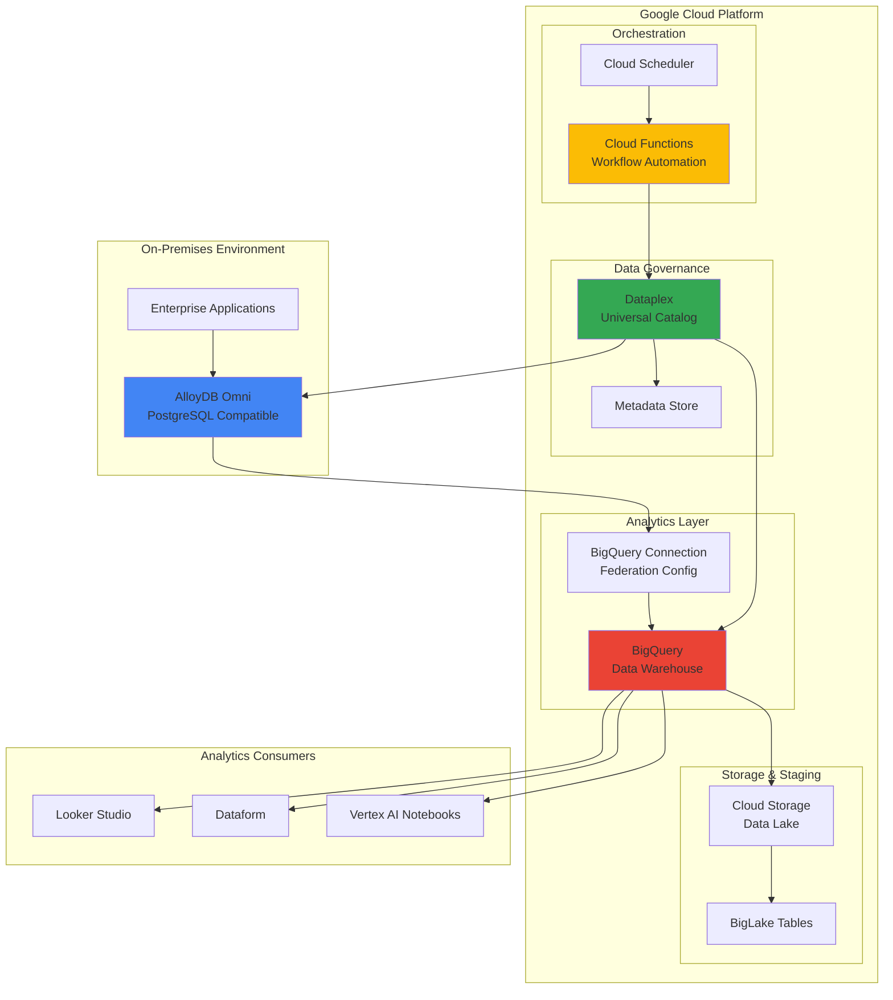

# Cross-Database Analytics Federation with AlloyDB Omni and BigQuery

## Problem

Modern enterprises struggle with data silos when operating hybrid cloud environments where critical transactional data resides on-premises in PostgreSQL-compatible databases while analytical workloads run in cloud data warehouses. Organizations face challenges performing unified analytics across these distributed data sources without complex ETL processes that introduce latency, increase costs, and create data consistency issues. Traditional approaches require moving data between systems, resulting in delayed insights and increased operational overhead.

## Solution

Build a unified analytics platform using AlloyDB Omni for on-premises high-performance PostgreSQL-compatible databases federated with BigQuery cloud data warehouse capabilities. This solution leverages BigQuery's federated query functionality to execute real-time cross-database analytics without data movement, while Dataplex provides intelligent data governance and discovery across the hybrid environment, and Cloud Functions automate metadata synchronization and workflow orchestration.

## Architecture Diagram



## Prerequisites

1. Google Cloud account with billing enabled and appropriate permissions for BigQuery, Dataplex, Cloud Functions, and Cloud Storage
2. Google Cloud CLI installed and configured (or use Cloud Shell)
3. On-premises infrastructure capable of running AlloyDB Omni (minimum 4 vCPUs, 16GB RAM)
4. Network connectivity between on-premises environment and Google Cloud (VPN or Cloud Interconnect recommended)
5. Basic knowledge of PostgreSQL, SQL, and data federation concepts
6. Estimated cost: $50-100 per day for testing (varies by data volume and query frequency)

> **Note**: AlloyDB Omni provides enterprise-grade PostgreSQL capabilities with columnar analytics engine for hybrid deployments, enabling high-performance OLTP and OLAP workloads in on-premises environments.

## Preparation

```bash
# Set environment variables for GCP resources
export PROJECT_ID="analytics-federation-$(date +%s)"
export REGION="us-central1"
export ZONE="us-central1-a"

# Generate unique suffix for resource names
RANDOM_SUFFIX=$(openssl rand -hex 3)

# Set default project and region
gcloud config set project ${PROJECT_ID}
gcloud config set compute/region ${REGION}
gcloud config set compute/zone ${ZONE}

# Enable required APIs
gcloud services enable bigquery.googleapis.com
gcloud services enable dataplex.googleapis.com
gcloud services enable cloudfunctions.googleapis.com
gcloud services enable storage.googleapis.com
gcloud services enable compute.googleapis.com
gcloud services enable sqladmin.googleapis.com

# Create service account for cross-service authentication
gcloud iam service-accounts create federation-sa-${RANDOM_SUFFIX} \
    --display-name="Analytics Federation Service Account"

export SERVICE_ACCOUNT="federation-sa-${RANDOM_SUFFIX}@${PROJECT_ID}.iam.gserviceaccount.com"

# Grant necessary IAM roles
gcloud projects add-iam-policy-binding ${PROJECT_ID} \
    --member="serviceAccount:${SERVICE_ACCOUNT}" \
    --role="roles/bigquery.connectionUser"

gcloud projects add-iam-policy-binding ${PROJECT_ID} \
    --member="serviceAccount:${SERVICE_ACCOUNT}" \
    --role="roles/bigquery.dataEditor"

gcloud projects add-iam-policy-binding ${PROJECT_ID} \
    --member="serviceAccount:${SERVICE_ACCOUNT}" \
    --role="roles/dataplex.editor"

echo "✅ Project configured: ${PROJECT_ID}"
echo "✅ Service account created: ${SERVICE_ACCOUNT}"
```

## Steps

1. **Create Cloud Storage Data Lake Foundation**:

   Cloud Storage serves as the central data lake foundation for the federated analytics platform, providing scalable object storage with global availability and strong consistency. This storage layer supports both structured and unstructured data while integrating seamlessly with BigQuery and Dataplex for comprehensive data governance and analytics workflows.

   ```bash
   # Create primary data lake bucket
   export BUCKET_NAME="analytics-lake-${RANDOM_SUFFIX}"
   gsutil mb -p ${PROJECT_ID} \
       -c STANDARD \
       -l ${REGION} \
       gs://${BUCKET_NAME}
   
   # Enable versioning for data protection
   gsutil versioning set on gs://${BUCKET_NAME}
   
   # Create directory structure for organized data management
   gsutil -m cp /dev/null gs://${BUCKET_NAME}/raw-data/.keep
   gsutil -m cp /dev/null gs://${BUCKET_NAME}/processed-data/.keep
   gsutil -m cp /dev/null gs://${BUCKET_NAME}/staging/.keep
   
   echo "✅ Data lake foundation created: gs://${BUCKET_NAME}"
   ```

   The Cloud Storage data lake now provides a scalable foundation with organized directory structures that support the entire analytics pipeline, from raw data ingestion through processed analytics outputs.

2. **Set Up BigQuery Datasets and Federation Connection**:

   BigQuery's federated query capabilities enable real-time analytics across distributed data sources without data movement. Creating dedicated datasets and connection configurations establishes the foundation for seamless cross-database analytics while maintaining data security and governance controls through IAM and connection-level permissions.

   ```bash
   # Create BigQuery datasets for federated analytics
   bq mk --dataset \
       --location=${REGION} \
       --description="Federated analytics workspace" \
       ${PROJECT_ID}:analytics_federation
   
   bq mk --dataset \
       --location=${REGION} \
       --description="Cloud-native analytics data" \
       ${PROJECT_ID}:cloud_analytics
   
   # Create sample cloud-native data table
   bq mk --table \
       ${PROJECT_ID}:cloud_analytics.customers \
       customer_id:INTEGER,customer_name:STRING,region:STRING,signup_date:DATE
   
   # Insert sample customer data for federation testing
   bq query --use_legacy_sql=false \
       "INSERT INTO \`${PROJECT_ID}.cloud_analytics.customers\` VALUES
        (1, 'Acme Corp', 'North America', '2023-01-15'),
        (2, 'Global Tech Ltd', 'Europe', '2023-02-20'),
        (3, 'Pacific Solutions', 'Asia Pacific', '2023-03-10')"
   
   echo "✅ BigQuery datasets created with sample data"
   ```

   BigQuery datasets are now configured with sample cloud-native data that will be federated with on-premises AlloyDB Omni data, demonstrating the power of unified analytics across hybrid environments.

3. **Deploy AlloyDB Omni Simulation Environment**:

   For this recipe, we'll simulate the AlloyDB Omni on-premises environment using Cloud SQL for PostgreSQL with AlloyDB-compatible configurations. In production environments, AlloyDB Omni would be deployed on-premises with direct connectivity to Google Cloud through VPN or Cloud Interconnect for optimal performance and security.

   ```bash
   # Create Cloud SQL PostgreSQL instance to simulate AlloyDB Omni
   export ALLOYDB_INSTANCE="alloydb-omni-sim-${RANDOM_SUFFIX}"
   export DB_PASSWORD="SecurePassword123!"
   
   gcloud sql instances create ${ALLOYDB_INSTANCE} \
       --database-version=POSTGRES_15 \
       --cpu=2 \
       --memory=8GB \
       --region=${REGION} \
       --storage-size=20GB \
       --storage-type=SSD \
       --root-password=${DB_PASSWORD}
   
   # Wait for instance to be ready
   gcloud sql instances wait ${ALLOYDB_INSTANCE} \
       --for=operations \
       --timeout=600
   
   # Create database for transactional data
   gcloud sql databases create transactions \
       --instance=${ALLOYDB_INSTANCE}
   
   # Get instance connection details
   export INSTANCE_IP=$(gcloud sql instances describe ${ALLOYDB_INSTANCE} \
       --format="value(ipAddresses[0].ipAddress)")
   
   echo "✅ AlloyDB Omni simulation instance created: ${ALLOYDB_INSTANCE}"
   echo "✅ Instance IP: ${INSTANCE_IP}"
   ```

   The AlloyDB Omni simulation environment is now running with enterprise-grade PostgreSQL capabilities, providing the foundation for federated analytics testing and development workflows.

4. **Configure BigQuery External Connection for Federation**:

   BigQuery external connections enable secure, authenticated communication with external data sources like AlloyDB Omni. The connection configuration includes credential management, network security settings, and query performance optimizations that ensure reliable federated query execution while maintaining data governance and security compliance.

   ```bash
   # Create BigQuery connection for AlloyDB federation
   export CONNECTION_ID="alloydb-federation-${RANDOM_SUFFIX}"
   
   # Create connection configuration file
   cat > connection_config.json << EOF
   {
     "friendlyName": "AlloyDB Omni Federation Connection",
     "description": "Federated connection to AlloyDB Omni for cross-database analytics",
     "cloudSql": {
       "instanceId": "${PROJECT_ID}:${REGION}:${ALLOYDB_INSTANCE}",
       "database": "transactions",
       "type": "POSTGRES",
       "credential": {
         "username": "postgres",
         "password": "${DB_PASSWORD}"
       }
     }
   }
   EOF
   
   # Create the BigQuery connection
   bq mk --connection \
       --location=${REGION} \
       --connection_type=CLOUD_SQL \
       --properties_file=connection_config.json \
       ${CONNECTION_ID}
   
   # Get connection details for verification
   bq show --connection \
       --location=${REGION} \
       ${PROJECT_ID}.${REGION}.${CONNECTION_ID}
   
   echo "✅ BigQuery federation connection created: ${CONNECTION_ID}"
   ```

   The BigQuery external connection is now configured for secure federated queries, enabling real-time analytics across cloud and on-premises data sources without compromising security or performance.

5. **Create Sample Transactional Data in AlloyDB Omni**:

   Populating the AlloyDB Omni instance with realistic transactional data demonstrates the federation capabilities between operational databases and analytical data warehouses. This data represents typical enterprise transactional patterns that benefit from real-time analytics integration with cloud-based business intelligence and reporting systems.

   ```bash
   # Connect to Cloud SQL instance and create sample data
   gcloud sql connect ${ALLOYDB_INSTANCE} \
       --user=postgres \
       --database=transactions << 'EOF'
   
   -- Create orders table with transactional data
   CREATE TABLE orders (
       order_id SERIAL PRIMARY KEY,
       customer_id INTEGER NOT NULL,
       product_name VARCHAR(255) NOT NULL,
       order_amount DECIMAL(10,2) NOT NULL,
       order_date DATE NOT NULL,
       order_status VARCHAR(50) NOT NULL,
       created_at TIMESTAMP DEFAULT CURRENT_TIMESTAMP
   );
   
   -- Insert sample transactional data
   INSERT INTO orders (customer_id, product_name, order_amount, order_date, order_status) VALUES
   (1, 'Enterprise Software License', 25000.00, '2024-01-15', 'completed'),
   (1, 'Support Package', 5000.00, '2024-02-01', 'completed'),
   (2, 'Cloud Infrastructure Setup', 15000.00, '2024-01-20', 'completed'),
   (2, 'Data Migration Service', 8000.00, '2024-03-01', 'in_progress'),
   (3, 'Analytics Platform', 30000.00, '2024-02-15', 'completed'),
   (3, 'Training Services', 3000.00, '2024-03-15', 'pending');
   
   -- Create index for federation performance
   CREATE INDEX idx_orders_customer_date ON orders(customer_id, order_date);
   
   -- Verify data creation
   SELECT COUNT(*) as total_orders, 
          SUM(order_amount) as total_revenue 
   FROM orders;
   
   \q
   EOF
   
   echo "✅ Sample transactional data created in AlloyDB Omni"
   ```

   The AlloyDB Omni instance now contains realistic transactional data with proper indexing for optimal federation query performance, representing the operational data source that will be unified with cloud analytics.

6. **Deploy Cloud Functions for Metadata Orchestration**:

   Cloud Functions provide serverless orchestration for metadata synchronization and workflow automation across the federated analytics platform. These functions handle automatic data discovery, metadata enrichment, and governance policy enforcement while integrating with Dataplex for comprehensive data catalog management and lineage tracking.

   ```bash
   # Create Cloud Function source directory
   mkdir -p federation-functions
   cd federation-functions
   
   # Create metadata synchronization function
   cat > main.py << 'EOF'
   import functions_framework
   import json
   from google.cloud import bigquery
   from google.cloud import dataplex_v1
   from google.cloud import storage
   import logging
   
   @functions_framework.http
   def sync_metadata(request):
       """Synchronize metadata between AlloyDB Omni and Dataplex catalog."""
       try:
           # Initialize clients
           bq_client = bigquery.Client()
           dataplex_client = dataplex_v1.CatalogServiceClient()
           
           # Discovery logic for federated data sources
           project_id = request.get_json().get('project_id')
           connection_id = request.get_json().get('connection_id')
           region = request.get_json().get('region', 'us-central1')
           
           # Discover AlloyDB Omni tables via federated query
           discover_query = f"""
           SELECT table_name, column_name, data_type
           FROM EXTERNAL_QUERY(
               '{project_id}.{region}.{connection_id}',
               'SELECT table_name, column_name, data_type 
                FROM information_schema.columns 
                WHERE table_schema = ''public'''
           )
           """
           
           query_job = bq_client.query(discover_query)
           results = query_job.result()
           
           # Build metadata catalog entry
           metadata = {
               'discovered_tables': [],
               'federation_status': 'active',
               'last_sync': str(query_job.ended)
           }
           
           for row in results:
               metadata['discovered_tables'].append({
                   'table_name': row.table_name,
                   'column_name': row.column_name,
                   'data_type': row.data_type
               })
           
           logging.info(f"Discovered {len(metadata['discovered_tables'])} table columns")
           
           return {
               'status': 'success',
               'metadata': metadata,
               'message': 'Metadata synchronization completed'
           }
           
       except Exception as e:
           logging.error(f"Metadata sync failed: {str(e)}")
           return {
               'status': 'error',
               'message': str(e)
           }, 500
   EOF
   
   # Create requirements file with current versions
   cat > requirements.txt << 'EOF'
   functions-framework==3.*
   google-cloud-bigquery==3.*
   google-cloud-dataplex==1.*
   google-cloud-storage==2.*
   EOF
   
   # Deploy Cloud Function with latest Python runtime
   gcloud functions deploy federation-metadata-sync \
       --runtime python312 \
       --trigger-http \
       --allow-unauthenticated \
       --memory 256MB \
       --timeout 60s \
       --service-account ${SERVICE_ACCOUNT}
   
   cd ..
   
   echo "✅ Cloud Functions deployed for metadata orchestration"
   ```

   The Cloud Functions are now deployed with the latest Python runtime and ready to orchestrate metadata synchronization and workflow automation across the federated analytics platform, providing intelligent governance and operational insights.

7. **Configure Dataplex for Unified Data Governance**:

   Dataplex Universal Catalog provides intelligent data governance across hybrid cloud environments, automatically discovering data assets, managing metadata, and enforcing governance policies. This configuration establishes unified data lineage tracking and quality monitoring across both cloud and on-premises data sources for comprehensive data governance.

   ```bash
   # Create Dataplex lake for federated analytics governance
   export LAKE_ID="analytics-federation-lake-${RANDOM_SUFFIX}"
   
   gcloud dataplex lakes create ${LAKE_ID} \
       --location=${REGION} \
       --display-name="Analytics Federation Lake" \
       --description="Unified governance for federated analytics across AlloyDB Omni and BigQuery"
   
   # Create asset for BigQuery datasets
   gcloud dataplex assets create bigquery-analytics-asset \
       --location=${REGION} \
       --lake=${LAKE_ID} \
       --display-name="BigQuery Analytics Asset" \
       --resource-type=BIGQUERY_DATASET \
       --resource-name="projects/${PROJECT_ID}/datasets/analytics_federation"
   
   # Create asset for Cloud Storage data lake
   gcloud dataplex assets create storage-lake-asset \
       --location=${REGION} \
       --lake=${LAKE_ID} \
       --display-name="Cloud Storage Data Lake Asset" \
       --resource-type=STORAGE_BUCKET \
       --resource-name="projects/${PROJECT_ID}/buckets/${BUCKET_NAME}"
   
   # Configure data discovery for automatic metadata extraction
   gcloud dataplex zones create analytics-zone \
       --location=${REGION} \
       --lake=${LAKE_ID} \
       --display-name="Analytics Zone" \
       --type=RAW \
       --resource-location-type=SINGLE_REGION
   
   echo "✅ Dataplex configured for unified data governance"
   echo "✅ Lake ID: ${LAKE_ID}"
   ```

   Dataplex is now configured to provide unified data governance across the federated analytics platform, automatically discovering and cataloging data assets while maintaining comprehensive lineage tracking and quality monitoring.

8. **Execute Federated Analytics Queries**:

   Federated queries demonstrate the real-time analytics capabilities across distributed data sources, combining transactional data from AlloyDB Omni with analytical data in BigQuery. These queries showcase the power of unified analytics without data movement, enabling real-time business insights across hybrid cloud environments.

   ```bash
   # Execute comprehensive federated analytics query
   cat > federated_analytics_query.sql << EOF
   -- Federated analytics: Customer lifetime value analysis
   SELECT 
       c.customer_id,
       c.customer_name,
       c.region,
       c.signup_date,
       COALESCE(orders_summary.total_orders, 0) as total_orders,
       COALESCE(orders_summary.total_revenue, 0) as total_revenue,
       COALESCE(orders_summary.avg_order_value, 0) as avg_order_value,
       orders_summary.last_order_date,
       CASE 
           WHEN orders_summary.total_revenue IS NOT NULL 
           THEN ROUND(orders_summary.total_revenue / 
                     GREATEST(DATE_DIFF(CURRENT_DATE(), c.signup_date, DAY), 1), 2) 
           ELSE 0 
       END as daily_clv
   FROM \`${PROJECT_ID}.cloud_analytics.customers\` c
   LEFT JOIN (
       SELECT 
           customer_id,
           COUNT(*) as total_orders,
           SUM(order_amount) as total_revenue,
           AVG(order_amount) as avg_order_value,
           MAX(order_date) as last_order_date
       FROM EXTERNAL_QUERY(
           '${PROJECT_ID}.${REGION}.${CONNECTION_ID}',
           'SELECT customer_id, order_amount, order_date FROM orders'
       )
       GROUP BY customer_id
   ) orders_summary ON c.customer_id = orders_summary.customer_id
   ORDER BY total_revenue DESC;
   EOF
   
   # Execute the federated query
   bq query --use_legacy_sql=false \
       --format=table \
       < federated_analytics_query.sql
   
   # Create a view for ongoing federated analytics
   bq mk --view \
       --use_legacy_sql=false \
       --description="Real-time customer analytics across cloud and on-premises data" \
       --view_file=federated_analytics_query.sql \
       ${PROJECT_ID}:analytics_federation.customer_lifetime_value
   
   echo "✅ Federated analytics queries executed successfully"
   echo "✅ Customer lifetime value view created"
   ```

   The federated analytics queries successfully demonstrate real-time cross-database analytics, providing unified business insights by combining cloud and on-premises data sources without the complexity and latency of traditional ETL processes.

## Validation & Testing

1. **Verify Federation Connection Status**:

   ```bash
   # Check BigQuery connection status
   bq show --connection \
       --location=${REGION} \
       ${PROJECT_ID}.${REGION}.${CONNECTION_ID}
   
   # Test basic connectivity
   bq query --use_legacy_sql=false \
       "SELECT COUNT(*) as connection_test FROM EXTERNAL_QUERY(
           '${PROJECT_ID}.${REGION}.${CONNECTION_ID}',
           'SELECT 1'
       )"
   ```

   Expected output: Connection details showing active status and successful query execution returning count of 1.

2. **Validate Federated Query Performance**:

   ```bash
   # Execute performance test with query statistics
   bq query --use_legacy_sql=false \
       --format=prettyjson \
       --dry_run \
       "SELECT * FROM \`${PROJECT_ID}.analytics_federation.customer_lifetime_value\`"
   
   # Execute actual query with timing
   time bq query --use_legacy_sql=false \
       --format=table \
       "SELECT * FROM \`${PROJECT_ID}.analytics_federation.customer_lifetime_value\`"
   ```

   Expected output: Query validation showing estimated bytes processed and execution completing within 2-5 seconds for small datasets.

3. **Test Dataplex Data Discovery**:

   ```bash
   # Verify Dataplex lake and assets
   gcloud dataplex lakes describe ${LAKE_ID} \
       --location=${REGION} \
       --format="table(displayName,state)"
   
   # Check asset discovery status
   gcloud dataplex assets list \
       --location=${REGION} \
       --lake=${LAKE_ID} \
       --format="table(displayName,state,resourceStatus.state)"
   ```

   Expected output: Lake showing ACTIVE state and assets showing READY state with successful resource discovery.

4. **Validate Cloud Function Metadata Sync**:

   ```bash
   # Test metadata synchronization function
   curl -X POST \
       -H "Content-Type: application/json" \
       -d "{\"project_id\":\"${PROJECT_ID}\",\"connection_id\":\"${CONNECTION_ID}\",\"region\":\"${REGION}\"}" \
       $(gcloud functions describe federation-metadata-sync \
           --format="value(httpsTrigger.url)")
   ```

   Expected output: JSON response with status "success" and discovered table metadata from AlloyDB Omni.

## Cleanup

1. **Remove Dataplex Resources**:

   ```bash
   # Delete Dataplex assets
   gcloud dataplex assets delete bigquery-analytics-asset \
       --location=${REGION} \
       --lake=${LAKE_ID} \
       --quiet
   
   gcloud dataplex assets delete storage-lake-asset \
       --location=${REGION} \
       --lake=${LAKE_ID} \
       --quiet
   
   # Delete zones and lake
   gcloud dataplex zones delete analytics-zone \
       --location=${REGION} \
       --lake=${LAKE_ID} \
       --quiet
   
   gcloud dataplex lakes delete ${LAKE_ID} \
       --location=${REGION} \
       --quiet
   
   echo "✅ Dataplex resources deleted"
   ```

2. **Remove Cloud Functions and Storage**:

   ```bash
   # Delete Cloud Function
   gcloud functions delete federation-metadata-sync --quiet
   
   # Remove Cloud Storage bucket and contents
   gsutil -m rm -r gs://${BUCKET_NAME}
   
   # Clean up local files
   rm -rf federation-functions
   rm -f connection_config.json federated_analytics_query.sql
   
   echo "✅ Cloud Functions and storage cleaned up"
   ```

3. **Remove AlloyDB Omni Simulation and BigQuery Resources**:

   ```bash
   # Delete Cloud SQL instance (AlloyDB Omni simulation)
   gcloud sql instances delete ${ALLOYDB_INSTANCE} --quiet
   
   # Delete BigQuery datasets
   bq rm -r -f ${PROJECT_ID}:analytics_federation
   bq rm -r -f ${PROJECT_ID}:cloud_analytics
   
   # Remove BigQuery connection
   bq rm --connection \
       --location=${REGION} \
       ${PROJECT_ID}.${REGION}.${CONNECTION_ID}
   
   echo "✅ Database and BigQuery resources deleted"
   ```

4. **Remove IAM and Project Resources**:

   ```bash
   # Delete service account
   gcloud iam service-accounts delete ${SERVICE_ACCOUNT} --quiet
   
   # Delete project (if created specifically for this recipe)
   gcloud projects delete ${PROJECT_ID} --quiet
   
   echo "✅ All resources cleaned up successfully"
   echo "Note: Project deletion may take several minutes to complete"
   ```

## Discussion

Cross-database analytics federation represents a paradigm shift from traditional ETL-heavy data integration approaches to real-time, query-time data federation. This architecture leverages AlloyDB Omni's enterprise-grade PostgreSQL capabilities for high-performance on-premises transactional workloads while utilizing BigQuery's serverless data warehouse for cloud-scale analytics. The federation approach eliminates the need for complex data movement pipelines, reducing latency from hours to seconds and significantly lowering operational overhead.

BigQuery's federated query engine provides intelligent query optimization that pushes computation down to the source systems where possible, minimizing data transfer and maximizing performance. The EXTERNAL_QUERY function enables seamless SQL operations across distributed data sources while maintaining consistent security and governance controls through IAM and connection-level authentication. This approach is particularly valuable for organizations with hybrid cloud strategies that need to maintain sensitive operational data on-premises while leveraging cloud analytics capabilities. For more details, see the [BigQuery Cloud SQL federated queries documentation](https://cloud.google.com/bigquery/docs/cloud-sql-federated-queries).

Dataplex Universal Catalog enhances this architecture by providing unified data governance across the hybrid environment, automatically discovering data assets, tracking lineage, and enforcing quality policies. The catalog maintains comprehensive metadata about federated data sources, enabling data scientists and analysts to discover and understand available data without requiring deep knowledge of underlying system architectures. Cloud Functions orchestrate automated workflows for metadata synchronization, ensuring that governance policies remain current as data schemas evolve.

The performance characteristics of federated queries depend heavily on network connectivity, data volume, and query complexity. For optimal performance in production environments, organizations should implement dedicated network connections like Cloud Interconnect or Partner Interconnect to ensure consistent, low-latency connectivity between on-premises AlloyDB Omni instances and Google Cloud services. Query design best practices include leveraging appropriate filtering and aggregation at the source system level to minimize data transfer across network boundaries. See the [Google Cloud Architecture Framework](https://cloud.google.com/architecture) for additional guidance on hybrid cloud connectivity patterns.

> **Tip**: For production deployments, implement connection pooling and query result caching to optimize federation performance, and consider using materialized views for frequently accessed federated data patterns.

## Challenge

Extend this federated analytics solution by implementing these advanced capabilities:

1. **Real-time streaming integration**: Deploy Dataflow pipelines to capture change data capture (CDC) events from AlloyDB Omni and stream them to BigQuery for near real-time analytics, reducing federation query load for frequently accessed data patterns.

2. **Multi-region federation**: Expand the architecture to federate multiple AlloyDB Omni instances across different geographical regions, implementing intelligent query routing and data locality optimization for global analytics workloads.

3. **Advanced governance automation**: Implement Cloud Functions triggered by Pub/Sub to automatically apply data classification tags, detect sensitive data patterns, and enforce dynamic masking policies across federated data sources based on Dataplex metadata insights.

4. **ML-powered query optimization**: Integrate Vertex AI to analyze federation query patterns and automatically recommend materialization strategies, index optimizations, and data partitioning approaches to improve overall analytics performance.

5. **Cross-cloud federation**: Extend the federation capabilities to include external data sources from other cloud providers or SaaS platforms using BigQuery Omni and custom connection drivers for truly universal analytics federation.

## Infrastructure Code

### Available Infrastructure as Code:

- [Infrastructure Code Overview](code/README.md) - Detailed description of all infrastructure components
- [Infrastructure Manager](code/infrastructure-manager/) - GCP Infrastructure Manager templates
- [Bash CLI Scripts](code/scripts/) - Example bash scripts using gcloud CLI commands to deploy infrastructure
- [Terraform](code/terraform/) - Terraform configuration files