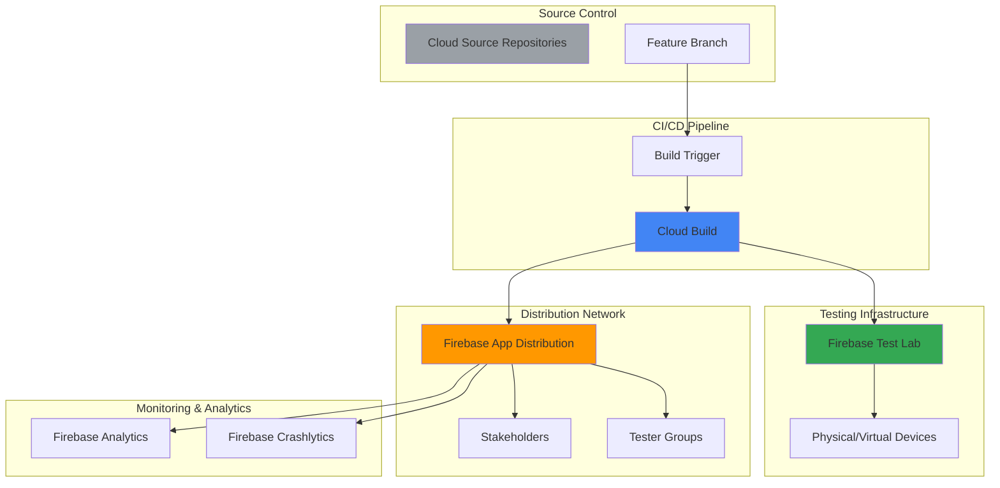

# Cross-Platform Mobile Development Workflows with Firebase App Distribution and Cloud Build

## Problem

Mobile development teams struggle with fragmented testing processes that require manual app distribution to multiple testers across different platforms, leading to delayed feedback cycles and inefficient release management. Teams often face weeks-long release cycles due to manual testing coordination, device compatibility issues that surface late in the development process, and lack of automated feedback collection from stakeholders and quality assurance teams.

## Solution

This solution establishes an automated mobile CI/CD pipeline using Firebase App Distribution for streamlined app delivery, Cloud Build for continuous integration and automated builds, and Firebase Test Lab for comprehensive device testing. The integrated workflow enables rapid iteration with automated testing across multiple device configurations, instant stakeholder feedback, and seamless distribution management that reduces release cycles from weeks to days.

## Architecture Diagram



## Prerequisites

1. Google Cloud Project with Firebase enabled and appropriate permissions for Cloud Build, Firebase, and source repositories
2. gcloud CLI and Firebase CLI installed and configured (or use Google Cloud Shell)
3. Basic understanding of mobile app development (Android/iOS) and CI/CD concepts
4. Firebase project configured with mobile app registration (Android and/or iOS)
5. Estimated cost: $15-30 USD for testing resources during recipe completion (Test Lab device time, build minutes)

> **Note**: Firebase App Distribution requires enabling billing for your Firebase project to access advanced features like tester groups and detailed analytics.

## Preparation

```bash
# Set environment variables for GCP resources
export PROJECT_ID="mobile-cicd-$(date +%s | tail -c 7)"
export REGION="us-central1"
export ZONE="us-central1-a"
export FIREBASE_PROJECT_ID="${PROJECT_ID}"

# Generate unique suffix for resource naming
RANDOM_SUFFIX=$(openssl rand -hex 3)
export APP_NAME="mobile-app-${RANDOM_SUFFIX}"
export REPO_NAME="mobile-source-${RANDOM_SUFFIX}"

# Set default project and region
gcloud config set project ${PROJECT_ID}
gcloud config set compute/region ${REGION}
gcloud config set compute/zone ${ZONE}

# Enable required Google Cloud APIs
gcloud services enable cloudbuild.googleapis.com
gcloud services enable sourcerepo.googleapis.com
gcloud services enable firebase.googleapis.com
gcloud services enable testing.googleapis.com
gcloud services enable artifactregistry.googleapis.com

# Create the Firebase project first
gcloud projects create ${PROJECT_ID} \
    --name="Mobile CI/CD Pipeline"

# Wait for project creation to complete
sleep 10

# Set billing account if needed (replace with your billing account)
# gcloud billing projects link ${PROJECT_ID} \
#     --billing-account=YOUR-BILLING-ACCOUNT-ID

# Initialize Firebase project
firebase login --no-localhost
firebase projects:addfirebase ${PROJECT_ID}

echo "✅ Project configured: ${PROJECT_ID}"
echo "✅ Firebase project: ${FIREBASE_PROJECT_ID}"
```

## Steps

1. **Create Cloud Source Repository for Mobile Application**:

   Cloud Source Repositories provides secure, fully-featured Git repositories hosted on Google Cloud infrastructure. Establishing a centralized source repository enables automated CI/CD triggers and integrates seamlessly with Cloud Build for consistent build environments. This foundation supports collaborative development while maintaining security and audit capabilities essential for enterprise mobile development workflows.

   ```bash
   # Create the source repository
   gcloud source repos create ${REPO_NAME} \
       --project=${PROJECT_ID}
   
   # Clone the repository locally
   gcloud source repos clone ${REPO_NAME} \
       --project=${PROJECT_ID}
   
   # Navigate to repository directory
   cd ${REPO_NAME}
   
   echo "✅ Source repository created and cloned successfully"
   ```

   The source repository is now ready to host your mobile application code with integrated version control and automated build triggers. This establishes the foundation for continuous integration workflows that automatically build and test code changes as they're committed to different branches.

2. **Configure Firebase Project and Enable App Distribution**:

   Firebase App Distribution streamlines the process of distributing pre-release versions of mobile apps to trusted testers and stakeholders. By configuring App Distribution with proper project settings, you enable automated app delivery with release notes, tester management, and feedback collection capabilities that transform traditional manual distribution workflows into efficient automated processes.

   ```bash
   # Set Firebase project context
   firebase use ${FIREBASE_PROJECT_ID}
   
   # Initialize Firebase in the repository with minimal prompts
   echo "N" | echo "N" | firebase init \
       --project=${FIREBASE_PROJECT_ID}
   
   # Create Android app in Firebase
   gcloud firebase apps create android \
       --display-name="${APP_NAME} Android" \
       --package-name="com.example.${APP_NAME//-/}" \
       --project=${PROJECT_ID}
   
   # Store the app ID for later use
   export ANDROID_APP_ID=$(gcloud firebase apps list \
       --filter="displayName:'${APP_NAME} Android'" \
       --format="value(appId)" \
       --project=${PROJECT_ID})
   
   echo "✅ Firebase project configured with App Distribution"
   echo "Android App ID: ${ANDROID_APP_ID}"
   ```

   Firebase App Distribution is now enabled and configured for your project, providing the infrastructure needed for automated app distribution to testing teams. This service integrates with your CI/CD pipeline to automatically deliver new builds to designated tester groups with detailed release information.

3. **Create Sample Mobile Application Structure**:

   A well-structured mobile application with proper build configuration enables seamless integration with Cloud Build and automated testing workflows. This step establishes the foundational code structure with build scripts and configuration files that support cross-platform development and automated deployment pipelines essential for continuous integration.

   ```bash
   # Create Android application structure
   mkdir -p android/app/src/main/java/com/example/app
   mkdir -p android/app/src/main/res/values
   mkdir -p android/app/src/androidTest/java/com/example/app
   
   # Create basic Android app manifest
   cat > android/app/src/main/AndroidManifest.xml << 'EOF'
   <?xml version="1.0" encoding="utf-8"?>
   <manifest xmlns:android="http://schemas.android.com/apk/res/android"
       package="com.example.app">
       <application
           android:allowBackup="true"
           android:label="@string/app_name"
           android:theme="@style/AppTheme">
           <activity android:name=".MainActivity"
               android:exported="true">
               <intent-filter>
                   <action android:name="android.intent.action.MAIN" />
                   <category android:name="android.intent.category.LAUNCHER" />
               </intent-filter>
           </activity>
       </application>
   </manifest>
   EOF
   
   # Create app-level Gradle build configuration
   cat > android/app/build.gradle << 'EOF'
   plugins {
       id 'com.android.application'
       id 'com.google.gms.google-services'
       id 'com.google.firebase.appdistribution'
   }
   
   android {
       compileSdk 34
       namespace 'com.example.app'
       
       defaultConfig {
           applicationId "com.example.app"
           minSdk 21
           targetSdk 34
           versionCode 1
           versionName "1.0"
           
           testInstrumentationRunner "androidx.test.runner.AndroidJUnitRunner"
       }
       
       buildTypes {
           debug {
               debuggable true
           }
           release {
               minifyEnabled false
               proguardFiles getDefaultProguardFile('proguard-android-optimize.txt'), 'proguard-rules.pro'
           }
       }
   }
   
   dependencies {
       implementation 'androidx.appcompat:appcompat:1.6.1'
       implementation 'androidx.constraintlayout:constraintlayout:2.1.4'
       testImplementation 'junit:junit:4.13.2'
       androidTestImplementation 'androidx.test.ext:junit:1.1.5'
       androidTestImplementation 'androidx.test.espresso:espresso-core:3.5.1'
   }
   EOF
   
   # Create project-level Gradle build configuration
   cat > android/build.gradle << 'EOF'
   buildscript {
       dependencies {
           classpath 'com.android.tools.build:gradle:8.1.2'
           classpath 'com.google.gms:google-services:4.4.0'
           classpath 'com.google.firebase:firebase-appdistribution-gradle:4.2.0'
       }
   }
   
   plugins {
       id 'com.android.application' version '8.1.2' apply false
   }
   
   allprojects {
       repositories {
           google()
           mavenCentral()
       }
   }
   EOF
   
   # Create basic MainActivity
   cat > android/app/src/main/java/com/example/app/MainActivity.java << 'EOF'
   package com.example.app;
   
   import androidx.appcompat.app.AppCompatActivity;
   import android.os.Bundle;
   
   public class MainActivity extends AppCompatActivity {
       @Override
       protected void onCreate(Bundle savedInstanceState) {
           super.onCreate(savedInstanceState);
           setContentView(R.layout.activity_main);
       }
   }
   EOF
   
   # Create layout file
   mkdir -p android/app/src/main/res/layout
   cat > android/app/src/main/res/layout/activity_main.xml << 'EOF'
   <?xml version="1.0" encoding="utf-8"?>
   <androidx.constraintlayout.widget.ConstraintLayout xmlns:android="http://schemas.android.com/apk/res/android"
       xmlns:app="http://schemas.android.com/apk/res-auto"
       android:layout_width="match_parent"
       android:layout_height="match_parent">
   
       <TextView
           android:layout_width="wrap_content"
           android:layout_height="wrap_content"
           android:text="Hello CI/CD!"
           app:layout_constraintBottom_toBottomOf="parent"
           app:layout_constraintEnd_toEndOf="parent"
           app:layout_constraintStart_toStartOf="parent"
           app:layout_constraintTop_toTopOf="parent" />
   
   </androidx.constraintlayout.widget.ConstraintLayout>
   EOF
   
   # Create string resources
   cat > android/app/src/main/res/values/strings.xml << 'EOF'
   <resources>
       <string name="app_name">Mobile CI/CD</string>
   </resources>
   EOF
   
   echo "✅ Mobile application structure created"
   ```

   The mobile application structure is now established with proper build configurations and manifest files. This foundation supports automated building, testing, and distribution through the CI/CD pipeline while maintaining compatibility with Firebase services and Google Cloud Build infrastructure.

4. **Configure Cloud Build Pipeline for Mobile CI/CD**:

   Cloud Build provides serverless CI/CD capabilities that automatically build, test, and deploy mobile applications in response to source code changes. Configuring a comprehensive build pipeline with multiple stages ensures code quality through automated testing while enabling rapid feedback cycles essential for agile mobile development teams working with complex, multi-platform applications.

   ```bash
   # Create comprehensive Cloud Build configuration
   cat > cloudbuild.yaml << 'EOF'
   steps:
   # Build Android application
   - name: 'gcr.io/cloud-builders/gradle'
     dir: 'android'
     args: ['clean', 'assembleDebug', 'assembleDebugAndroidTest']
     env:
     - 'GRADLE_OPTS=-Dorg.gradle.daemon=false'
   
   # Run Firebase Test Lab testing
   - name: 'gcr.io/cloud-builders/gcloud'
     args: 
     - 'firebase'
     - 'test'
     - 'android'
     - 'run'
     - '--type=instrumentation'
     - '--app=android/app/build/outputs/apk/debug/app-debug.apk'
     - '--test=android/app/build/outputs/apk/androidTest/debug/app-debug-androidTest.apk'
     - '--device=model=Pixel2,version=28,locale=en,orientation=portrait'
     - '--timeout=10m'
     env:
     - 'PROJECT_ID=${PROJECT_ID}'
   
   # Distribute to Firebase App Distribution
   - name: 'gcr.io/cloud-builders/gcloud'
     args:
     - 'firebase'
     - 'appdistribution:distribute'
     - 'android/app/build/outputs/apk/debug/app-debug.apk'
     - '--app=${_ANDROID_APP_ID}'
     - '--groups=qa-team,stakeholders'
     - '--release-notes=Automated build from commit ${SHORT_SHA}'
     env:
     - 'PROJECT_ID=${PROJECT_ID}'
   
   options:
     logging: CLOUD_LOGGING_ONLY
     machineType: 'E2_HIGHCPU_8'
   
   substitutions:
     _ANDROID_APP_ID: '${ANDROID_APP_ID}'
   
   timeout: '1800s'
   EOF
   
   echo "✅ Cloud Build pipeline configuration created"
   ```

   The Cloud Build pipeline is now configured with comprehensive stages including dependency management, application building, automated testing through Firebase Test Lab, and distribution via Firebase App Distribution. This automated workflow ensures code quality and rapid delivery to testing teams with each code commit.

5. **Create Build Trigger for Automated CI/CD**:

   Build triggers enable automatic pipeline execution in response to source code changes, creating a seamless continuous integration experience. Configuring triggers with branch-specific rules ensures that development, staging, and production environments maintain appropriate isolation while enabling rapid iteration and testing feedback essential for modern mobile development workflows.

   ```bash
   # Create build trigger for the main branch
   gcloud builds triggers create cloud-source-repositories \
       --repo=${REPO_NAME} \
       --branch-pattern="^main$" \
       --build-config=cloudbuild.yaml \
       --description="Mobile CI/CD Pipeline" \
       --substitutions="_ANDROID_APP_ID=${ANDROID_APP_ID}" \
       --project=${PROJECT_ID}
   
   # Create additional trigger for feature branches
   gcloud builds triggers create cloud-source-repositories \
       --repo=${REPO_NAME} \
       --branch-pattern="^feature/.*" \
       --build-config=cloudbuild.yaml \
       --description="Feature Branch Testing" \
       --substitutions="_ANDROID_APP_ID=${ANDROID_APP_ID}" \
       --project=${PROJECT_ID}
   
   echo "✅ Build triggers created for automated CI/CD"
   ```

   Build triggers are now active and will automatically initiate the CI/CD pipeline whenever code is pushed to the main branch or feature branches. This automation ensures consistent testing and distribution processes while reducing manual intervention and potential human errors in the deployment workflow.

6. **Configure Firebase Test Lab for Multi-Device Testing**:

   Firebase Test Lab provides access to physical and virtual devices hosted in Google data centers, enabling comprehensive compatibility testing across diverse Android configurations. Configuring automated testing with multiple device matrices ensures broad compatibility coverage and identifies device-specific issues early in the development cycle, significantly reducing production bugs and user experience problems.

   ```bash
   # Create test matrix configuration for comprehensive device testing
   cat > test-matrix.yml << 'EOF'
   # Firebase Test Lab device matrix configuration
   environmentType: ANDROID
   androidDeviceList:
     androidDevices:
     - androidModelId: Pixel2
       androidVersionId: "28"
       locale: en
       orientation: portrait
     - androidModelId: Pixel3
       androidVersionId: "29"
       locale: en
       orientation: portrait
     - androidModelId: Pixel4
       androidVersionId: "30"
       locale: en
       orientation: portrait
     - androidModelId: NexusLowRes
       androidVersionId: "26"
       locale: en
       orientation: portrait
   EOF
   
   # Create Firebase configuration for automated testing
   cat > .firebaserc << EOF
   {
     "projects": {
       "default": "${FIREBASE_PROJECT_ID}"
     }
   }
   EOF
   
   echo "✅ Firebase Test Lab configured for multi-device testing"
   ```

   Firebase Test Lab is now configured with a comprehensive device matrix that covers multiple Android versions and device types. This setup ensures thorough compatibility testing and provides detailed reports on application performance across different hardware configurations and Android versions.

7. **Set Up Tester Groups and Distribution Configuration**:

   Organizing testers into logical groups enables targeted distribution strategies and efficient feedback collection from different stakeholder categories. Proper tester group configuration streamlines the review process by ensuring the right builds reach the appropriate audiences, facilitating faster iteration cycles and more effective quality assurance processes in mobile development workflows.

   ```bash
   # Create tester groups for organized distribution
   firebase appdistribution:group:create qa-team \
       --project=${FIREBASE_PROJECT_ID}
   
   firebase appdistribution:group:create stakeholders \
       --project=${FIREBASE_PROJECT_ID}
   
   firebase appdistribution:group:create beta-users \
       --project=${FIREBASE_PROJECT_ID}
   
   # Add sample testers to groups (replace with actual email addresses)
   firebase appdistribution:testers:add \
       qa-team@example.com,tester1@example.com \
       --group qa-team \
       --project=${FIREBASE_PROJECT_ID}
   
   firebase appdistribution:testers:add \
       stakeholder1@example.com,product-manager@example.com \
       --group stakeholders \
       --project=${FIREBASE_PROJECT_ID}
   
   echo "✅ Tester groups configured for organized distribution"
   ```

   Tester groups are now established with proper organization for quality assurance teams, stakeholders, and beta users. This structure enables targeted distribution strategies where different builds can reach specific audiences based on their role in the development and feedback process.

8. **Commit Initial Code and Trigger First Build**:

   Committing the initial codebase and configuration files activates the automated CI/CD pipeline, demonstrating the complete workflow from source control to app distribution. This first build validates the entire pipeline configuration while establishing the foundation for continuous integration practices that support rapid iteration and collaborative mobile development.

   ```bash
   # Add all files to git and commit
   git add .
   git config user.email "developer@example.com"
   git config user.name "Mobile Developer"
   
   git commit -m "Initial mobile CI/CD pipeline setup
   
   - Android application structure
   - Cloud Build configuration
   - Firebase App Distribution integration
   - Test Lab multi-device testing
   - Automated tester group distribution"
   
   # Push to trigger the build pipeline
   git push origin main
   
   echo "✅ Initial code committed and build pipeline triggered"
   ```

   The initial commit has triggered the automated CI/CD pipeline, initiating the first complete workflow cycle including building, testing across multiple devices, and distributing to configured tester groups. This demonstrates the end-to-end automation that will support ongoing development activities.

## Validation & Testing

1. **Verify Cloud Build Pipeline Execution**:

   ```bash
   # Check the status of recent builds
   gcloud builds list --limit=5 \
       --format="table(id,status,createTime,duration)"
   
   # Get detailed information about the latest build
   LATEST_BUILD=$(gcloud builds list --limit=1 \
       --format="value(id)")
   
   gcloud builds describe ${LATEST_BUILD} \
       --format="yaml(status,steps[].name,steps[].status)"
   ```

   Expected output: Build status should show "SUCCESS" with all pipeline steps completed successfully.

2. **Validate Firebase Test Lab Results**:

   ```bash
   # Check Firebase Test Lab test results
   gcloud firebase test android list \
       --format="table(testId,state,createTime)" \
       --limit=3
   
   # View detailed test outcomes for latest test
   LATEST_TEST=$(gcloud firebase test android list \
       --format="value(testId)" --limit=1)
   
   gcloud firebase test android describe ${LATEST_TEST}
   ```

   Expected output: Test results should show successful execution across multiple device configurations with detailed compatibility reports.

3. **Confirm App Distribution Delivery**:

   ```bash
   # List recent app releases in Firebase App Distribution
   firebase appdistribution:releases:list \
       --app=${ANDROID_APP_ID} \
       --project=${FIREBASE_PROJECT_ID}
   
   # Check tester group membership
   firebase appdistribution:group:list \
       --project=${FIREBASE_PROJECT_ID}
   ```

   Expected output: Recent releases should appear with proper tester group distribution and release notes from the build process.

## Cleanup

1. **Remove Build Triggers and Pipeline Resources**:

   ```bash
   # Delete build triggers
   TRIGGER_IDS=$(gcloud builds triggers list \
       --format="value(id)" \
       --filter="description:('Mobile CI/CD Pipeline' OR 'Feature Branch Testing')")
   
   for trigger_id in ${TRIGGER_IDS}; do
       gcloud builds triggers delete ${trigger_id} --quiet
   done
   
   echo "✅ Build triggers deleted"
   ```

2. **Clean Up Source Repository**:

   ```bash
   # Delete the source repository
   gcloud source repos delete ${REPO_NAME} \
       --project=${PROJECT_ID} \
       --quiet
   
   # Remove local repository directory
   cd ..
   rm -rf ${REPO_NAME}
   
   echo "✅ Source repository cleaned up"
   ```

3. **Remove Firebase Configuration**:

   ```bash
   # Delete tester groups
   firebase appdistribution:group:delete qa-team \
       --project=${FIREBASE_PROJECT_ID} --force
   
   firebase appdistribution:group:delete stakeholders \
       --project=${FIREBASE_PROJECT_ID} --force
   
   firebase appdistribution:group:delete beta-users \
       --project=${FIREBASE_PROJECT_ID} --force
   
   echo "✅ Firebase App Distribution resources cleaned up"
   ```

4. **Delete Project Resources**:

   ```bash
   # Delete the entire project (if created specifically for this recipe)
   gcloud projects delete ${PROJECT_ID} --quiet
   
   echo "✅ Project and all resources deleted"
   echo "Note: Project deletion may take several minutes to complete"
   ```

## Discussion

This implementation demonstrates a comprehensive mobile CI/CD workflow that transforms traditional manual app distribution into an automated, scalable process. The integration between Firebase App Distribution and Cloud Build creates a seamless pipeline where code changes automatically trigger building, testing across multiple device configurations, and distribution to organized tester groups. This approach significantly reduces the time between development and feedback collection, enabling faster iteration cycles and improved app quality.

The multi-device testing capability provided by Firebase Test Lab ensures broad compatibility coverage across different Android versions and hardware configurations. By automating these tests within the CI/CD pipeline, teams catch device-specific issues early in the development cycle, preventing costly bugs from reaching production environments. The comprehensive device matrix testing provides confidence in app stability across the diverse Android ecosystem while maintaining development velocity.

Firebase App Distribution's tester group management system enables sophisticated distribution strategies where different builds reach appropriate audiences based on their role in the development process. Quality assurance teams receive every build for comprehensive testing, stakeholders get milestone builds for review and approval, and beta users receive stable candidates for user experience feedback. This targeted approach optimizes the feedback loop while reducing notification fatigue among different user groups.

The automated release notes and crash reporting integration provide valuable context for each distribution, enabling testers to understand what changed and developers to quickly identify and resolve issues. The combination of Firebase Crashlytics with App Distribution creates a complete feedback ecosystem where runtime issues are automatically collected and correlated with specific app versions, accelerating the debugging and resolution process.

> **Tip**: Configure different build configurations for various environments (development, staging, production) using Cloud Build substitutions and branch-specific triggers to maintain proper environment isolation while maximizing automation benefits.

For comprehensive documentation on Firebase App Distribution best practices, see the [Firebase App Distribution documentation](https://firebase.google.com/docs/app-distribution). Additional information about Cloud Build mobile application workflows can be found in the [Cloud Build documentation](https://cloud.google.com/build/docs/building/build-mobile-apps). Firebase Test Lab device compatibility testing is detailed in the [Test Lab documentation](https://firebase.google.com/docs/test-lab), and advanced CI/CD patterns are covered in the [Google Cloud DevOps best practices guide](https://cloud.google.com/architecture/devops).

## Challenge

Extend this mobile CI/CD workflow by implementing these advanced capabilities:

1. **Multi-Platform Support**: Add iOS application building and distribution alongside Android, configuring Xcode Cloud or custom macOS build agents in Cloud Build to support complete cross-platform development workflows with unified distribution management.

2. **Advanced Testing Strategies**: Implement UI automation testing with Espresso or UI Automator, integrate performance testing benchmarks that automatically fail builds when performance regressions are detected, and add accessibility testing validation to ensure compliance with accessibility standards.

3. **Staged Rollout Management**: Configure gradual rollout capabilities using Firebase App Distribution's percentage-based distribution features, implement automated rollback mechanisms based on crash rate thresholds, and create approval workflows for production releases with stakeholder sign-off requirements.

4. **Security and Compliance Integration**: Add static security analysis using Cloud Security Command Center, implement code signing validation and certificate management for app store distribution, and configure compliance reporting for regulatory requirements in mobile application development.

5. **Advanced Analytics and Monitoring**: Integrate Firebase Analytics for custom event tracking during testing phases, implement build performance monitoring and optimization recommendations, and create comprehensive dashboards using Cloud Monitoring for pipeline health and app quality metrics across the entire development lifecycle.

## Infrastructure Code

### Available Infrastructure as Code:

- [Infrastructure Code Overview](code/README.md) - Detailed description of all infrastructure components
- [Infrastructure Manager](code/infrastructure-manager/) - GCP Infrastructure Manager templates
- [Bash CLI Scripts](code/scripts/) - Example bash scripts using gcloud CLI commands to deploy infrastructure
- [Terraform](code/terraform/) - Terraform configuration files