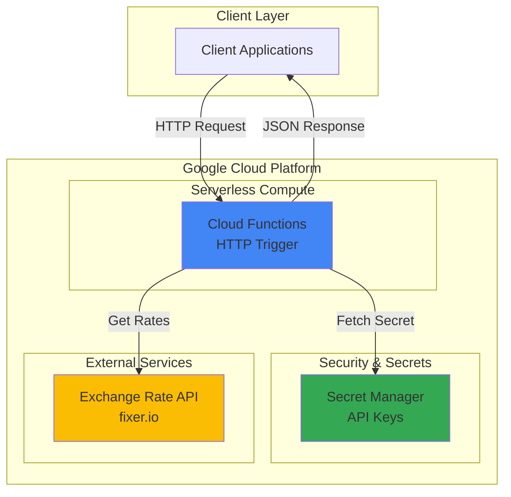

# Currency Converter API with Cloud Functions

## Problem

E-commerce companies and financial platforms need real-time currency conversion capabilities to display accurate pricing to international customers. Building and maintaining currency conversion infrastructure requires managing API keys securely, handling rate limiting, and ensuring high availability across global regions. Traditional server-based solutions incur ongoing costs even during low-usage periods and require complex deployment and scaling management.

## Solution

Build a serverless currency converter API using Google Cloud Functions with HTTP triggers that fetches real-time exchange rates from external services. Store API credentials securely in Secret Manager and configure automatic secret access for the function. This serverless approach provides automatic scaling, pay-per-use pricing, and eliminates infrastructure management while maintaining enterprise-grade security for sensitive API keys.

## Architecture Diagram



## Prerequisites

1. Google Cloud project with billing enabled and appropriate permissions (Cloud Functions Admin, Secret Manager Admin)
2. Google Cloud CLI installed and configured or Cloud Shell access
3. Basic understanding of HTTP APIs and JSON data formats
4. A free API key from an exchange rate service (we'll use fixer.io free tier)
5. Estimated cost: $0.01-0.05 per month for low usage (Cloud Functions free tier: 2M invocations/month, Secret Manager: $0.06 per 10,000 operations, plus minimal networking costs)

> **Note**: This recipe uses fixer.io's free tier which provides 100 API calls per month. For production use, consider upgrading to a paid plan or using alternative services like [Exchange Rates API](https://exchangeratesapi.io/) or [CurrencyAPI](https://currencyapi.com/).

## Preparation

```bash
# Set environment variables for GCP resources
export PROJECT_ID="currency-converter-$(date +%s)"
export REGION="us-central1"
export FUNCTION_NAME="currency-converter"

# Generate unique suffix for resource names
RANDOM_SUFFIX=$(openssl rand -hex 3)
export SECRET_NAME="exchange-api-key-${RANDOM_SUFFIX}"

# Set default project and region
gcloud config set project ${PROJECT_ID}
gcloud config set compute/region ${REGION}

# Enable required APIs
gcloud services enable cloudfunctions.googleapis.com
gcloud services enable secretmanager.googleapis.com

echo "✅ Project configured: ${PROJECT_ID}"
echo "✅ Function name: ${FUNCTION_NAME}"
echo "✅ Secret name: ${SECRET_NAME}"
```

## Steps

1. **Create Secret Manager secret for API key**:

   Secret Manager provides secure, encrypted storage for sensitive data like API keys, eliminating the need to hardcode credentials in your application. By storing the exchange rate API key in Secret Manager, we ensure it's encrypted at rest with Google-managed encryption keys and access is controlled through IAM policies.

   ```bash
   # Get your free API key from https://fixer.io (sign up for free)
   # Replace YOUR_API_KEY_HERE with your actual API key
   echo -n "YOUR_API_KEY_HERE" | gcloud secrets create ${SECRET_NAME} \
       --data-file=-
   
   echo "✅ Secret created: ${SECRET_NAME}"
   ```

   The secret is now securely stored and ready to be accessed by our Cloud Function with proper IAM permissions.

2. **Create the function source code**:

   Cloud Functions supports multiple programming languages and automatically handles HTTP request parsing, response formatting, and scaling. Our Python function will use the Functions Framework to handle HTTP requests and the Secret Manager client library to securely access stored credentials.

   ```bash
   # Create function directory and source files
   mkdir -p currency-converter-function
   cd currency-converter-function
   
   # Create main.py with currency conversion logic
   cat > main.py << 'EOF'
import functions_framework
import requests
import json
from google.cloud import secretmanager

# Initialize Secret Manager client
secret_client = secretmanager.SecretManagerServiceClient()

def get_api_key():
    """Retrieve API key from Secret Manager"""
    import os
    project_id = os.environ.get('GCP_PROJECT')
    secret_name = os.environ.get('SECRET_NAME')
    
    name = f"projects/{project_id}/secrets/{secret_name}/versions/latest"
    response = secret_client.access_secret_version(request={"name": name})
    return response.payload.data.decode("UTF-8")

@functions_framework.http
def currency_converter(request):
    """HTTP Cloud Function for currency conversion"""
    
    # Set CORS headers for web browsers
    headers = {
        'Access-Control-Allow-Origin': '*',
        'Access-Control-Allow-Methods': 'GET, POST, OPTIONS',
        'Access-Control-Allow-Headers': 'Content-Type'
    }
    
    # Handle preflight OPTIONS request
    if request.method == 'OPTIONS':
        return ('', 204, headers)
    
    try:
        # Parse request parameters
        if request.method == 'GET':
            from_currency = request.args.get('from', 'USD')
            to_currency = request.args.get('to', 'EUR')
            amount = float(request.args.get('amount', '1'))
        else:
            request_json = request.get_json()
            from_currency = request_json.get('from', 'USD')
            to_currency = request_json.get('to', 'EUR')
            amount = float(request_json.get('amount', '1'))
        
        # Get API key from Secret Manager
        api_key = get_api_key()
        
        # Call exchange rate API (use HTTPS for security)
        url = f"https://data.fixer.io/api/convert"
        params = {
            'access_key': api_key,
            'from': from_currency,
            'to': to_currency,
            'amount': amount
        }
        
        response = requests.get(url, params=params)
        data = response.json()
        
        if data.get('success'):
            result = {
                'success': True,
                'from': from_currency,
                'to': to_currency,
                'amount': amount,
                'result': data['result'],
                'rate': data['info']['rate'],
                'timestamp': data['date']
            }
        else:
            result = {
                'success': False,
                'error': data.get('error', {}).get('info', 'Unknown error')
            }
        
        return (json.dumps(result), 200, headers)
        
    except Exception as e:
        error_result = {
            'success': False,
            'error': f'Internal error: {str(e)}'
        }
        return (json.dumps(error_result), 500, headers)
EOF
   
   echo "✅ Function source code created"
   ```

   The function implements comprehensive error handling, CORS support for web browsers, and secure credential management through Secret Manager integration.

3. **Create requirements.txt for dependencies**:

   Cloud Functions automatically installs Python dependencies listed in requirements.txt during deployment. We'll include the essential libraries for HTTP requests and Google Cloud Secret Manager integration.

   ```bash
   # Create requirements.txt with necessary dependencies
   cat > requirements.txt << 'EOF'
functions-framework>=3.0.0,<4.0.0
google-cloud-secret-manager>=2.16.0,<3.0.0
requests>=2.31.0,<3.0.0
EOF
   
   echo "✅ Requirements file created"
   ```

   These dependencies provide the Functions Framework for HTTP handling, Secret Manager client for secure credential access, and requests library for external API calls.

4. **Deploy the Cloud Function with environment variables**:

   Cloud Functions deployment automatically provisions the serverless infrastructure, configures HTTP triggers, and sets up IAM permissions. We're using Python 3.12 runtime for the latest language features and security updates. Environment variables allow the function to access project and secret information at runtime.

   ```bash
   # Deploy function with environment variables and secret access
   gcloud functions deploy ${FUNCTION_NAME} \
       --runtime python312 \
       --trigger-http \
       --allow-unauthenticated \
       --source . \
       --entry-point currency_converter \
       --memory 256MB \
       --timeout 60s \
       --set-env-vars GCP_PROJECT=${PROJECT_ID},SECRET_NAME=${SECRET_NAME}
   
   echo "✅ Function deployed successfully"
   ```

   The function is now deployed with HTTP triggers enabled, allowing it to respond to web requests while securely accessing stored API credentials.

5. **Grant function access to Secret Manager**:

   Google Cloud Functions run with a default compute service account that needs explicit permissions to access Secret Manager. This follows the principle of least privilege by granting only the necessary permissions for secret access.

   ```bash
   # Get the function's service account
   FUNCTION_SA=$(gcloud functions describe ${FUNCTION_NAME} \
       --region=${REGION} \
       --format="value(serviceAccountEmail)")
   
   # Grant secret accessor role to function service account
   gcloud secrets add-iam-policy-binding ${SECRET_NAME} \
       --member="serviceAccount:${FUNCTION_SA}" \
       --role="roles/secretmanager.secretAccessor"
   
   echo "✅ Secret access permissions granted to: ${FUNCTION_SA}"
   ```

   The function can now securely retrieve API credentials from Secret Manager during execution without exposing sensitive data in code or environment variables.

6. **Get the function URL for testing**:

   Cloud Functions automatically provisions an HTTPS endpoint for HTTP triggers, providing a secure and scalable way to access your serverless API from any client application.

   ```bash
   # Retrieve the function's trigger URL
   export FUNCTION_URL=$(gcloud functions describe ${FUNCTION_NAME} \
       --region=${REGION} \
       --format="value(httpsTrigger.url)")
   
   echo "✅ Function URL: ${FUNCTION_URL}"
   echo "✅ Ready for testing"
   ```

   The HTTPS URL provides secure access to your currency conversion API with automatic SSL/TLS encryption and global availability.

## Validation & Testing

1. **Test basic currency conversion via GET request**:

   ```bash
   # Test USD to EUR conversion
   curl "${FUNCTION_URL}?from=USD&to=EUR&amount=100"
   ```

   Expected output: JSON response with converted amount, exchange rate, and timestamp.

2. **Test currency conversion via POST request**:

   ```bash
   # Test with JSON payload
   curl -X POST "${FUNCTION_URL}" \
       -H "Content-Type: application/json" \
       -d '{"from": "GBP", "to": "JPY", "amount": 50}'
   ```

   Expected output: JSON response showing GBP to JPY conversion results.

3. **Verify error handling with invalid currency codes**:

   ```bash
   # Test with invalid currency code
   curl "${FUNCTION_URL}?from=INVALID&to=EUR&amount=100"
   ```

   Expected output: JSON error response with success: false and error message.

4. **Test CORS headers for browser compatibility**:

   ```bash
   # Test OPTIONS request for CORS preflight
   curl -X OPTIONS "${FUNCTION_URL}" -I
   ```

   Expected output: HTTP headers including Access-Control-Allow-Origin and other CORS headers.

## Cleanup

1. **Delete the Cloud Function**:

   ```bash
   # Remove the deployed function
   gcloud functions delete ${FUNCTION_NAME} \
       --region=${REGION} \
       --quiet
   
   echo "✅ Function deleted"
   ```

2. **Delete Secret Manager secret**:

   ```bash
   # Delete the stored API key secret
   gcloud secrets delete ${SECRET_NAME} --quiet
   
   echo "✅ Secret deleted"
   ```

3. **Clean up local files**:

   ```bash
   # Remove function source directory
   cd ..
   rm -rf currency-converter-function
   
   echo "✅ Local files cleaned up"
   ```

## Discussion

This serverless currency converter demonstrates the power of Google Cloud Functions for building scalable, cost-effective APIs. Cloud Functions automatically handles infrastructure provisioning, scaling, and maintenance, allowing developers to focus on business logic rather than operational concerns. The pay-per-use pricing model means you only pay for actual function execution time, making it highly cost-effective for applications with variable or unpredictable traffic patterns.

Secret Manager integration provides enterprise-grade security for sensitive credentials without the complexity of traditional key management systems. By storing API keys in Secret Manager, we eliminate security risks associated with hardcoded credentials while maintaining easy access through IAM-controlled permissions. The automatic encryption at rest and in transit ensures compliance with security best practices and regulatory requirements.

The serverless architecture offers several key advantages: automatic scaling from zero to millions of requests, built-in high availability across Google's global infrastructure, and no server maintenance overhead. Cloud Functions can scale to handle sudden traffic spikes while scaling down to zero during idle periods, optimizing both performance and costs. This makes serverless ideal for APIs that experience irregular usage patterns or need to respond quickly to demand changes.

For more comprehensive information, refer to the [Google Cloud Functions documentation](https://cloud.google.com/functions/docs), [Secret Manager best practices](https://cloud.google.com/secret-manager/docs/best-practices), [HTTP Functions guide](https://cloud.google.com/functions/docs/writing/http), [Secret Manager IAM roles](https://cloud.google.com/secret-manager/docs/access-control), [Cloud Functions pricing model](https://cloud.google.com/functions/pricing), and the [Functions Framework for Python](https://github.com/GoogleCloudPlatform/functions-framework-python) for runtime details.

> **Tip**: Use Cloud Monitoring to track function performance, error rates, and costs. Set up alerts for high error rates or unexpected usage spikes to maintain optimal API performance.

## Challenge

Extend this solution by implementing these enhancements:

1. **Add caching with Memorystore Redis** - Implement response caching to reduce external API calls and improve response times for frequently requested currency pairs.

2. **Implement rate limiting with Cloud Firestore** - Add per-client rate limiting using Firestore to track and limit API usage, preventing abuse and managing costs.

3. **Create a web interface with Cloud Storage** - Build a simple HTML/JavaScript frontend hosted on Cloud Storage that provides a user-friendly interface for currency conversion.

4. **Add historical rate tracking with BigQuery** - Extend the function to store conversion history in BigQuery for analytics and trend analysis capabilities.

5. **Implement multi-provider failover** - Configure multiple exchange rate API providers with automatic failover to ensure high availability and redundancy.

## Infrastructure Code

### Available Infrastructure as Code:

- [Infrastructure Code Overview](code/README.md) - Detailed description of all infrastructure components
- [Infrastructure Manager](code/infrastructure-manager/) - GCP Infrastructure Manager templates
- [Bash CLI Scripts](code/scripts/) - Example bash scripts using gcloud CLI commands to deploy infrastructure
- [Terraform](code/terraform/) - Terraform configuration files