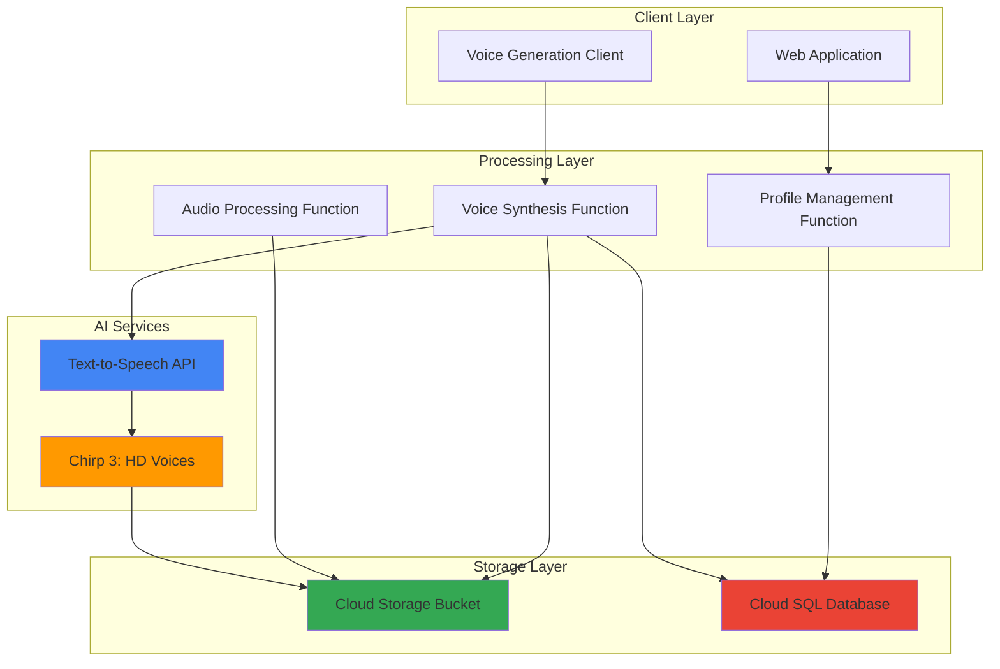

# Custom Voice Generation with Chirp 3 and Functions

## Problem

Organizations need personalized voice experiences for customer service, accessibility applications, and content creation but face challenges with traditional text-to-speech systems that sound robotic and lack natural human-like intonation. Creating custom voices typically requires extensive audio data collection and complex training processes, making it impractical for most businesses to implement personalized voice solutions at scale.

## Solution

Implement a serverless voice generation system using Google Cloud's Chirp 3: HD voices, which provide natural human-like quality with advanced audio controls and support for real-time synthesis. The solution combines Cloud Functions for processing requests, Cloud Storage for audio management, and Cloud SQL for voice profile metadata, enabling instant custom voice creation and high-quality audio generation with minimal infrastructure overhead.

## Architecture Diagram



## Prerequisites

1. GCP account with Text-to-Speech API, Cloud Functions, Cloud Storage, and Cloud SQL permissions
2. Google Cloud CLI installed and configured (or Cloud Shell)
3. Basic understanding of serverless functions and audio processing
4. Node.js 18+ for local function development
5. Estimated cost: $15-25 for resources created during this recipe

> **Note**: Chirp 3: HD voices use cutting-edge LLMs to deliver unparalleled realism and emotional resonance with 30 distinct voice styles across many languages.

## Preparation

```bash
# Set environment variables for GCP resources
export PROJECT_ID="voice-gen-$(date +%s)"
export REGION="us-central1"
export ZONE="us-central1-a"

# Generate unique suffix for resource names
RANDOM_SUFFIX=$(openssl rand -hex 3)
export BUCKET_NAME="voice-audio-${RANDOM_SUFFIX}"
export FUNCTION_NAME="voice-synthesis-${RANDOM_SUFFIX}"
export DB_INSTANCE="voice-profiles-${RANDOM_SUFFIX}"

# Set default project and region
gcloud config set project ${PROJECT_ID}
gcloud config set compute/region ${REGION}
gcloud config set compute/zone ${ZONE}

# Enable required APIs
gcloud services enable texttospeech.googleapis.com
gcloud services enable cloudfunctions.googleapis.com
gcloud services enable storage.googleapis.com
gcloud services enable sqladmin.googleapis.com
gcloud services enable eventarc.googleapis.com

echo "✅ Project configured: ${PROJECT_ID}"
echo "✅ APIs enabled successfully"
```

## Steps

1. **Create Cloud Storage Bucket for Audio Files**:

   Google Cloud Storage provides unified object storage with global edge caching and strong consistency guarantees. Creating a bucket with appropriate location and storage class settings establishes the foundation for storing voice samples and generated audio files while maintaining high performance and cost efficiency.

   ```bash
   # Create storage bucket for audio files
   gsutil mb -p ${PROJECT_ID} \
       -c STANDARD \
       -l ${REGION} \
       gs://${BUCKET_NAME}
   
   # Enable versioning for audio file protection
   gsutil versioning set on gs://${BUCKET_NAME}
   
   # Create directory structure for organization
   echo "Creating audio storage structure..."
   gsutil -m cp /dev/null gs://${BUCKET_NAME}/samples/.keep
   gsutil -m cp /dev/null gs://${BUCKET_NAME}/generated/.keep
   
   echo "✅ Cloud Storage bucket created: ${BUCKET_NAME}"
   ```

   The storage bucket is now ready with versioning enabled and organized directory structure, providing scalable audio file management with built-in redundancy and global accessibility.

2. **Set Up Cloud SQL Database for Voice Profiles**:

   Cloud SQL provides fully managed relational database services with automatic backups, high availability, and seamless scaling. The database will store voice profile metadata, synthesis parameters, and usage analytics while maintaining ACID compliance and enterprise-grade security.

   ```bash
   # Create Cloud SQL instance for voice profile metadata
   gcloud sql instances create ${DB_INSTANCE} \
       --database-version=POSTGRES_15 \
       --tier=db-f1-micro \
       --region=${REGION} \
       --storage-type=SSD \
       --storage-size=10GB \
       --backup \
       --enable-ip-alias
   
   # Set database root password
   DB_PASSWORD=$(openssl rand -base64 32)
   gcloud sql users set-password postgres \
       --instance=${DB_INSTANCE} \
       --password=${DB_PASSWORD}
   
   # Create application database
   gcloud sql databases create voice_profiles \
       --instance=${DB_INSTANCE}
   
   echo "✅ Cloud SQL instance created: ${DB_INSTANCE}"
   echo "Database password: ${DB_PASSWORD}"
   ```

   The Cloud SQL database is now configured with automated backups and secure password authentication, ready to store voice profile metadata and synthesis configurations.

3. **Create Voice Profile Management Function**:

   Cloud Functions provides serverless event processing that automatically scales based on demand. This function will manage voice profile creation, updates, and retrieval while integrating with Cloud SQL for persistent data storage and Cloud Storage for audio file management.

   ```bash
   # Create function source directory
   mkdir -p voice-functions/profile-manager
   cd voice-functions/profile-manager
   
   # Create package.json for dependencies
   cat > package.json << 'EOF'
{
  "name": "voice-profile-manager",
  "version": "1.0.0",
  "dependencies": {
    "@google-cloud/functions-framework": "^3.3.0",
    "@google-cloud/storage": "^7.7.0",
    "pg": "^8.11.3",
    "express": "^4.18.2"
  }
}
EOF
   
   # Create voice profile management function
   cat > index.js << 'EOF'
const functions = require('@google-cloud/functions-framework');
const {Storage} = require('@google-cloud/storage');
const {Client} = require('pg');

const storage = new Storage();
const bucketName = process.env.BUCKET_NAME;

// Database configuration
const dbConfig = {
  host: `/cloudsql/${process.env.PROJECT_ID}:${process.env.REGION}:${process.env.DB_INSTANCE}`,
  user: 'postgres',
  password: process.env.DB_PASSWORD,
  database: 'voice_profiles'
};

functions.http('profileManager', async (req, res) => {
  const client = new Client(dbConfig);
  
  try {
    await client.connect();
    
    // Initialize database table if not exists
    await client.query(`
      CREATE TABLE IF NOT EXISTS voice_profiles (
        id SERIAL PRIMARY KEY,
        profile_name VARCHAR(255) UNIQUE NOT NULL,
        voice_style VARCHAR(100) NOT NULL,
        language_code VARCHAR(10) NOT NULL,
        created_at TIMESTAMP DEFAULT CURRENT_TIMESTAMP,
        audio_sample_path VARCHAR(500),
        synthesis_config JSONB
      )
    `);
    
    switch (req.method) {
      case 'POST':
        const {profileName, voiceStyle, languageCode, synthesisConfig} = req.body;
        
        const result = await client.query(
          'INSERT INTO voice_profiles (profile_name, voice_style, language_code, synthesis_config) VALUES ($1, $2, $3, $4) RETURNING *',
          [profileName, voiceStyle, languageCode, JSON.stringify(synthesisConfig)]
        );
        
        res.json({
          success: true,
          profile: result.rows[0],
          message: 'Voice profile created successfully'
        });
        break;
        
      case 'GET':
        const profiles = await client.query('SELECT * FROM voice_profiles ORDER BY created_at DESC');
        res.json({
          success: true,
          profiles: profiles.rows
        });
        break;
        
      default:
        res.status(405).json({error: 'Method not allowed'});
    }
  } catch (error) {
    console.error('Profile management error:', error);
    res.status(500).json({error: error.message});
  } finally {
    await client.end();
  }
});
EOF
   
   echo "✅ Voice profile management function created"
   ```

   The profile management function is now ready with database integration, providing RESTful endpoints for creating and retrieving voice profiles with automated database schema initialization.

4. **Deploy Voice Synthesis Function with Chirp 3 Integration**:

   This function integrates with Google Cloud's Text-to-Speech API and Chirp 3: HD voices to provide natural, human-like voice synthesis with advanced audio controls. The serverless architecture ensures cost-effective scaling based on synthesis requests.

   ```bash
   # Create synthesis function directory
   cd ../..
   mkdir -p voice-functions/synthesis
   cd voice-functions/synthesis
   
   # Create package.json for Text-to-Speech dependencies
   cat > package.json << 'EOF'
{
  "name": "voice-synthesis",
  "version": "1.0.0",
  "dependencies": {
    "@google-cloud/functions-framework": "^3.3.0",
    "@google-cloud/text-to-speech": "^5.3.0",
    "@google-cloud/storage": "^7.7.0",
    "pg": "^8.11.3"
  }
}
EOF
   
   # Create voice synthesis function with Chirp 3 support
   cat > index.js << 'EOF'
const functions = require('@google-cloud/functions-framework');
const textToSpeech = require('@google-cloud/text-to-speech');
const {Storage} = require('@google-cloud/storage');
const {Client} = require('pg');
const crypto = require('crypto');

const ttsClient = new textToSpeech.TextToSpeechClient();
const storage = new Storage();
const bucketName = process.env.BUCKET_NAME;

functions.http('voiceSynthesis', async (req, res) => {
  try {
    const {text, profileId, voiceStyle = 'en-US-Chirp3-HD-Achernar'} = req.body;
    
    if (!text) {
      return res.status(400).json({error: 'Text is required'});
    }
    
    // Configure Chirp 3: HD voice synthesis request
    const request = {
      input: {text: text},
      voice: {
        name: voiceStyle,
        languageCode: 'en-US'
      },
      audioConfig: {
        audioEncoding: 'MP3',
        speakingRate: 1.0,
        pitch: 0.0,
        volumeGainDb: 0.0,
        effectsProfileId: ['telephony-class-application']
      }
    };
    
    // Perform text-to-speech synthesis
    console.log('Synthesizing speech with Chirp 3:', voiceStyle);
    const [response] = await ttsClient.synthesizeSpeech(request);
    
    // Generate unique filename for audio output
    const audioId = crypto.randomUUID();
    const fileName = `generated/voice_${audioId}.mp3`;
    
    // Upload synthesized audio to Cloud Storage
    const file = storage.bucket(bucketName).file(fileName);
    await file.save(response.audioContent, {
      metadata: {
        contentType: 'audio/mp3',
        metadata: {
          profileId: profileId || 'default',
          voiceStyle: voiceStyle,
          synthesizedAt: new Date().toISOString()
        }
      }
    });
    
    // Generate signed URL for audio access
    const [signedUrl] = await file.getSignedUrl({
      action: 'read',
      expires: Date.now() + 24 * 60 * 60 * 1000 // 24 hours
    });
    
    res.json({
      success: true,
      audioId: audioId,
      audioUrl: signedUrl,
      fileName: fileName,
      voiceStyle: voiceStyle,
      message: 'Voice synthesis completed successfully'
    });
    
  } catch (error) {
    console.error('Voice synthesis error:', error);
    res.status(500).json({
      success: false,
      error: error.message
    });
  }
});
EOF
   
   echo "✅ Voice synthesis function created with Chirp 3 integration"
   ```

   The synthesis function now integrates Chirp 3: HD voices with Cloud Storage, providing natural voice generation with secure audio file management and time-limited access URLs.

5. **Deploy Cloud Functions with Environment Configuration**:

   Deploy both functions with proper environment variables and IAM permissions to enable seamless integration between services while maintaining security best practices and cost-effective resource allocation.

   ```bash
   # Deploy profile management function
   cd ../profile-manager
   gcloud functions deploy profile-manager \
       --runtime nodejs18 \
       --trigger-http \
       --allow-unauthenticated \
       --memory 256MB \
       --timeout 60s \
       --set-env-vars BUCKET_NAME=${BUCKET_NAME},PROJECT_ID=${PROJECT_ID},REGION=${REGION},DB_INSTANCE=${DB_INSTANCE},DB_PASSWORD=${DB_PASSWORD}
   
   # Deploy voice synthesis function
   cd ../synthesis
   gcloud functions deploy voice-synthesis \
       --runtime nodejs18 \
       --trigger-http \
       --allow-unauthenticated \
       --memory 512MB \
       --timeout 120s \
       --set-env-vars BUCKET_NAME=${BUCKET_NAME}
   
   # Get function URLs for testing
   export PROFILE_URL=$(gcloud functions describe profile-manager --format="value(httpsTrigger.url)")
   export SYNTHESIS_URL=$(gcloud functions describe voice-synthesis --format="value(httpsTrigger.url)")
   
   echo "✅ Cloud Functions deployed successfully"
   echo "Profile Manager URL: ${PROFILE_URL}"
   echo "Voice Synthesis URL: ${SYNTHESIS_URL}"
   ```

   Both Cloud Functions are now deployed with appropriate memory allocation and timeout settings, ready to handle voice profile management and synthesis requests with automatic scaling based on demand.

6. **Configure IAM Permissions for Service Integration**:

   Establish proper Identity and Access Management permissions to enable secure communication between Cloud Functions, Text-to-Speech API, Cloud Storage, and Cloud SQL while following the principle of least privilege.

   ```bash
   # Create service account for enhanced security
   gcloud iam service-accounts create voice-synthesis-sa \
       --display-name="Voice Synthesis Service Account"
   
   # Grant necessary permissions to service account
   gcloud projects add-iam-policy-binding ${PROJECT_ID} \
       --member="serviceAccount:voice-synthesis-sa@${PROJECT_ID}.iam.gserviceaccount.com" \
       --role="roles/cloudsql.client"
   
   gcloud projects add-iam-policy-binding ${PROJECT_ID} \
       --member="serviceAccount:voice-synthesis-sa@${PROJECT_ID}.iam.gserviceaccount.com" \
       --role="roles/storage.objectAdmin"
   
   gcloud projects add-iam-policy-binding ${PROJECT_ID} \
       --member="serviceAccount:voice-synthesis-sa@${PROJECT_ID}.iam.gserviceaccount.com" \
       --role="roles/cloudtts.user"
   
   echo "✅ IAM permissions configured for secure service integration"
   ```

   Service account permissions are now configured to enable secure access to required services while maintaining security boundaries and audit compliance.

7. **Create Sample Voice Profile and Test Synthesis**:

   Create a sample voice profile and test the complete voice synthesis pipeline to validate the integration between all components and demonstrate the Chirp 3: HD voice capabilities.

   ```bash
   # Create sample voice profile
   curl -X POST ${PROFILE_URL} \
       -H "Content-Type: application/json" \
       -d '{
         "profileName": "customer-service-assistant",
         "voiceStyle": "en-US-Chirp3-HD-Achernar",
         "languageCode": "en-US",
         "synthesisConfig": {
           "speakingRate": 1.0,
           "pitch": 0.0,
           "volumeGainDb": 2.0
         }
       }'
   
   # Test voice synthesis with sample text
   curl -X POST ${SYNTHESIS_URL} \
       -H "Content-Type: application/json" \
       -d '{
         "text": "Welcome to our customer service. How may I assist you today? I am here to help with any questions or concerns you may have.",
         "profileId": "1",
         "voiceStyle": "en-US-Chirp3-HD-Achernar"
       }' | python3 -m json.tool
   
   echo "✅ Sample voice profile created and synthesis tested"
   ```

   The voice synthesis pipeline is now operational with sample data, demonstrating natural human-like voice generation using Chirp 3: HD technology with customizable audio parameters.

## Validation & Testing

1. **Verify Cloud Functions Deployment**:

   ```bash
   # Check function deployment status
   gcloud functions list --filter="name:profile-manager OR name:voice-synthesis"
   
   # Test function health endpoints
   curl -X GET ${PROFILE_URL}
   ```

   Expected output: JSON response with empty profiles array or existing profiles

2. **Test Voice Synthesis Quality**:

   ```bash
   # Test multiple Chirp 3 voice styles
   for voice in "en-US-Chirp3-HD-Achernar" "en-US-Chirp3-HD-Charon"; do
     echo "Testing voice: $voice"
     curl -X POST ${SYNTHESIS_URL} \
         -H "Content-Type: application/json" \
         -d "{
           \"text\": \"This is a test of the $voice voice style using Chirp 3 HD technology.\",
           \"voiceStyle\": \"$voice\"
         }"
   done
   ```

3. **Verify Storage and Database Integration**:

   ```bash
   # Check generated audio files in Cloud Storage
   gsutil ls gs://${BUCKET_NAME}/generated/
   
   # Verify database connectivity
   gcloud sql connect ${DB_INSTANCE} --user=postgres
   ```

## Cleanup

1. **Remove Cloud Functions**:

   ```bash
   # Delete deployed functions
   gcloud functions delete profile-manager --quiet
   gcloud functions delete voice-synthesis --quiet
   
   echo "✅ Cloud Functions deleted"
   ```

2. **Remove Cloud SQL Database**:

   ```bash
   # Delete Cloud SQL instance
   gcloud sql instances delete ${DB_INSTANCE} --quiet
   
   echo "✅ Cloud SQL instance deleted"
   ```

3. **Remove Cloud Storage Resources**:

   ```bash
   # Remove all objects and bucket
   gsutil -m rm -r gs://${BUCKET_NAME}
   
   echo "✅ Cloud Storage bucket deleted"
   ```

4. **Clean Up IAM and Project Resources**:

   ```bash
   # Delete service account
   gcloud iam service-accounts delete \
       voice-synthesis-sa@${PROJECT_ID}.iam.gserviceaccount.com --quiet
   
   # Remove function source code
   cd ../../..
   rm -rf voice-functions
   
   # Optionally delete project (if created specifically for this recipe)
   # gcloud projects delete ${PROJECT_ID} --quiet
   
   echo "✅ Resources cleaned up successfully"
   echo "Note: Project deletion may take several minutes to complete"
   ```

## Discussion

This recipe demonstrates how to build a production-ready custom voice generation system using Google Cloud's Chirp 3: HD voices, which represent a significant advancement in text-to-speech technology powered by cutting-edge large language models (LLMs). Unlike traditional parametric synthesis methods, Chirp 3: HD voices deliver unparalleled realism and emotional resonance with 30 distinct voice styles available across many languages. The serverless architecture using Cloud Functions ensures cost-effective scaling, with automatic resource allocation based on synthesis demand rather than pre-provisioned capacity.

The integration between Text-to-Speech API, Cloud Storage, and Cloud SQL creates a comprehensive voice management platform suitable for enterprise applications. Cloud Storage provides scalable audio file management with global edge caching and strong consistency guarantees, while Cloud SQL ensures ACID-compliant metadata storage with automated backups and high availability. The RESTful API design enables easy integration with existing applications, mobile apps, and web platforms. According to the [Google Cloud Text-to-Speech documentation](https://cloud.google.com/text-to-speech/docs/chirp3-hd), Chirp 3: HD voices support advanced audio controls and low-latency real-time communication through text streaming capabilities.

Security considerations include IAM service accounts with least-privilege permissions, encrypted data storage, and signed URLs for temporary audio access. The solution follows Google Cloud's Well-Architected Framework principles, with automated scaling, comprehensive monitoring capabilities, and cost optimization through serverless computing. Performance is optimized through regional deployment, efficient audio encoding, and CDN-backed storage access.

For production deployments, consider implementing authentication and authorization, request rate limiting, and comprehensive logging with Cloud Monitoring. The modular function design enables independent scaling and maintenance, while the database schema supports advanced features like voice analytics, usage tracking, and personalization parameters. The [Google Cloud Architecture Framework](https://cloud.google.com/architecture) provides additional guidance on building well-architected solutions with operational excellence, security, reliability, performance efficiency, and cost optimization principles.

> **Tip**: Use Cloud Monitoring and Cloud Logging to track synthesis requests, audio generation latency, and storage costs to optimize performance and resource allocation based on actual usage patterns, following Google Cloud's operational best practices.

## Challenge

Extend this solution by implementing these enhancements:

1. **Multi-language Voice Cloning**: Implement voice profile creation from audio samples using custom voice training APIs and support for multiple languages and accents
2. **Real-time Voice Streaming**: Add WebSocket support for streaming text-to-speech synthesis with Cloud Functions and real-time audio playback
3. **Voice Analytics Dashboard**: Create a monitoring dashboard using Cloud Monitoring and BigQuery to track voice synthesis usage, quality metrics, and cost optimization opportunities
4. **Advanced Audio Processing**: Integrate Cloud Functions with audio processing libraries to support background music mixing, audio effects, and dynamic content generation
5. **Enterprise Integration**: Add authentication with Identity and Access Management, API rate limiting, and integration with customer relationship management systems for personalized voice experiences

## Infrastructure Code

*Infrastructure code will be generated after recipe approval.*