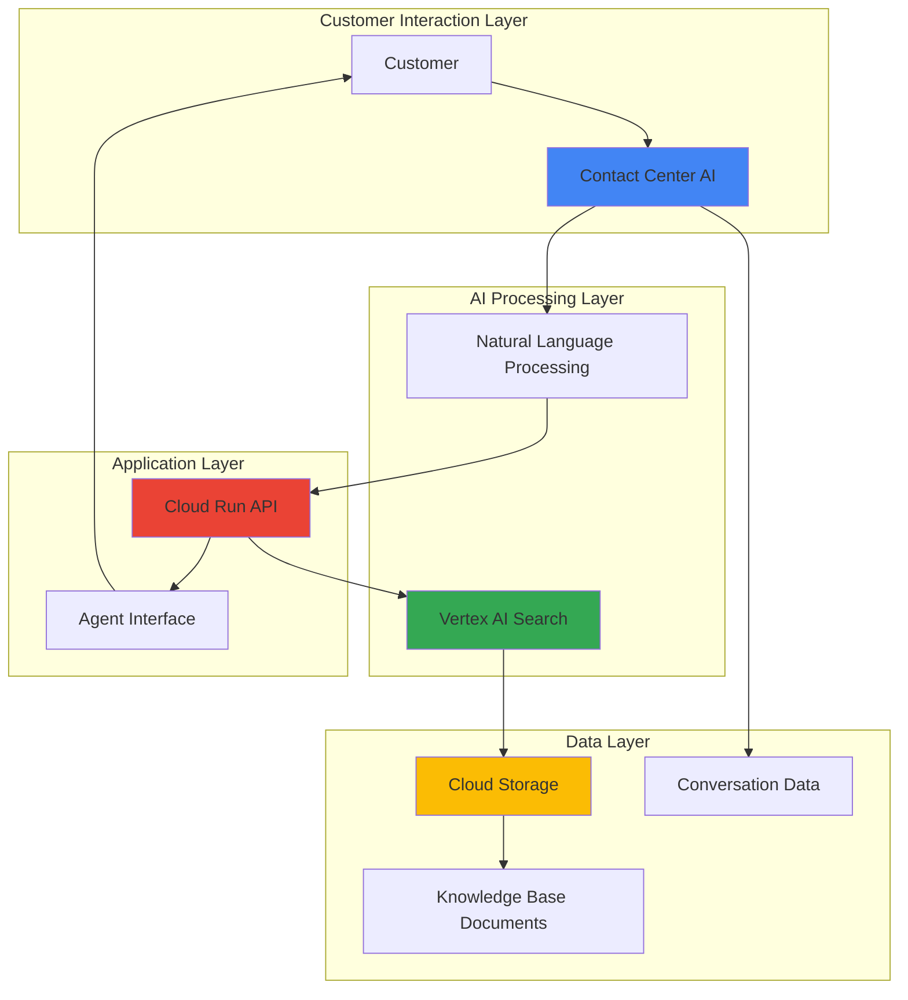

# Customer Service Automation with Contact Center AI and Vertex AI Search

## Problem

Modern customer service teams struggle to handle increasing volumes of complex inquiries while maintaining consistent response quality and speed. Organizations often have vast knowledge bases scattered across different systems, making it difficult for agents to quickly find relevant information during customer interactions. This results in longer resolution times, inconsistent answers, and decreased customer satisfaction as agents spend valuable time searching through documentation instead of focusing on customer needs.

## Solution

Build an intelligent customer service system that leverages Contact Center AI's conversation analytics to understand customer intent and automatically search enterprise knowledge bases using Vertex AI Search. The solution integrates these AI services with Cloud Run for scalable API processing and Cloud Storage for document management, creating an automated workflow that provides agents with instant, relevant information and suggested responses based on customer inquiries.

## Architecture Diagram



## Prerequisites

1. Google Cloud account with billing enabled and appropriate permissions for Contact Center AI, Vertex AI, Cloud Run, and Cloud Storage
2. Google Cloud CLI (gcloud) installed and configured
3. Basic understanding of REST APIs and JSON data structures
4. Knowledge of contact center operations and customer service workflows
5. Estimated cost: $50-100 for resources created during this recipe (varies based on usage and data volume)

> **Note**: Contact Center AI requires special setup and may have additional licensing requirements. Ensure you have the necessary permissions and have enabled the Contact Center AI API in your project.

## Preparation

```bash
# Set environment variables for GCP resources
export PROJECT_ID="customer-service-ai-$(date +%s)"
export REGION="us-central1"
export ZONE="us-central1-a"

# Generate unique suffix for resource names
RANDOM_SUFFIX=$(openssl rand -hex 3)
export BUCKET_NAME="customer-service-kb-${RANDOM_SUFFIX}"
export SEARCH_ENGINE_ID="customer-service-search-${RANDOM_SUFFIX}"
export CLOUD_RUN_SERVICE="customer-service-api-${RANDOM_SUFFIX}"

# Set default project and region
gcloud config set project ${PROJECT_ID}
gcloud config set compute/region ${REGION}
gcloud config set compute/zone ${ZONE}

# Enable required APIs
gcloud services enable contactcenteraiplatform.googleapis.com
gcloud services enable discoveryengine.googleapis.com
gcloud services enable run.googleapis.com
gcloud services enable storage.googleapis.com
gcloud services enable aiplatform.googleapis.com

echo "✅ Project configured: ${PROJECT_ID}"
echo "✅ APIs enabled for Contact Center AI and Vertex AI Search"
```

## Steps

1. **Create Cloud Storage Bucket for Knowledge Base Documents**:

   Cloud Storage provides the foundational data layer for our intelligent customer service system. By creating a dedicated bucket with appropriate location and storage class settings, we establish a centralized repository for knowledge base documents that Vertex AI Search can index and query. This configuration ensures optimal performance and cost efficiency while maintaining high availability for our customer service data.

   ```bash
   # Create storage bucket for knowledge base documents
   gsutil mb -p ${PROJECT_ID} \
       -c STANDARD \
       -l ${REGION} \
       gs://${BUCKET_NAME}
   
   # Enable versioning for document protection
   gsutil versioning set on gs://${BUCKET_NAME}
   
   # Set appropriate lifecycle policy for cost optimization
   gsutil lifecycle set /dev/stdin gs://${BUCKET_NAME} <<EOF
   {
     "lifecycle": {
       "rule": [
         {
           "action": {"type": "SetStorageClass", "storageClass": "NEARLINE"},
           "condition": {"age": 30}
         }
       ]
     }
   }
   EOF
   
   echo "✅ Cloud Storage bucket created: gs://${BUCKET_NAME}"
   ```

   The storage bucket is now configured with versioning and lifecycle policies, providing both data protection and cost optimization. This foundation supports our knowledge base management while leveraging Google's global infrastructure for reliable, low-latency access to documents from anywhere in the world.

2. **Upload Sample Knowledge Base Documents**:

   Effective customer service automation requires comprehensive knowledge base content that covers common customer inquiries and solutions. We'll create and upload sample documents that represent typical customer service scenarios, including FAQs, troubleshooting guides, and policy documentation. These documents will serve as the knowledge source for our Vertex AI Search engine.

   ```bash
   # Create sample knowledge base documents
   mkdir -p /tmp/knowledge-base
   
   # Create FAQ document
   cat > /tmp/knowledge-base/customer-faq.txt <<EOF
   Frequently Asked Questions
   
   Q: How do I reset my password?
   A: To reset your password, click on the "Forgot Password" link on the login page and follow the instructions sent to your email.
   
   Q: What are your business hours?
   A: Our customer service is available Monday through Friday, 9 AM to 6 PM EST.
   
   Q: How do I cancel my subscription?
   A: You can cancel your subscription by logging into your account and navigating to the billing section.
   
   Q: What payment methods do you accept?
   A: We accept all major credit cards, PayPal, and bank transfers.
   EOF
   
   # Create troubleshooting guide
   cat > /tmp/knowledge-base/troubleshooting-guide.txt <<EOF
   Technical Troubleshooting Guide
   
   Issue: Login Problems
   Solution: Clear browser cache and cookies, ensure JavaScript is enabled, try incognito mode.
   
   Issue: Payment Processing Errors
   Solution: Verify card details, check with bank for international transaction blocks, try alternative payment method.
   
   Issue: Account Access Issues
   Solution: Confirm email address, check spam folder for verification emails, contact support if account is locked.
   
   Issue: Performance Issues
   Solution: Check internet connection, try different browser, clear application cache.
   EOF
   
   # Create policy document
   cat > /tmp/knowledge-base/policies.txt <<EOF
   Company Policies and Procedures
   
   Refund Policy: Full refunds available within 30 days of purchase with proof of purchase.
   
   Privacy Policy: We protect customer data according to GDPR and CCPA regulations.
   
   Return Policy: Items must be returned in original condition within 14 days.
   
   Shipping Policy: Standard shipping takes 3-5 business days, expedited shipping available.
   EOF
   
   # Upload documents to Cloud Storage
   gsutil -m cp /tmp/knowledge-base/*.txt gs://${BUCKET_NAME}/knowledge-base/
   
   echo "✅ Sample knowledge base documents uploaded"
   ```

   The knowledge base documents are now stored in Cloud Storage and ready for indexing by Vertex AI Search. These documents provide the foundation for our AI-powered customer service responses, ensuring agents have access to accurate and up-to-date information.

3. **Create Vertex AI Search Engine**:

   Vertex AI Search transforms our static knowledge base into an intelligent, queryable system that can understand natural language inquiries and return relevant results. By configuring a search engine with enterprise-grade capabilities, we enable sophisticated document retrieval that goes beyond simple keyword matching to understand user intent and context.

   ```bash
   # Create Vertex AI Search data store
   curl -X POST \
       -H "Authorization: Bearer $(gcloud auth print-access-token)" \
       -H "Content-Type: application/json" \
       -d '{
         "displayName": "Customer Service Knowledge Base",
         "industryVertical": "GENERIC",
         "solutionTypes": ["SOLUTION_TYPE_SEARCH"],
         "contentConfig": "CONTENT_REQUIRED",
         "documentProcessingConfig": {
           "defaultParsingConfig": {
             "digitalParsingConfig": {}
           }
         }
       }' \
       "https://discoveryengine.googleapis.com/v1/projects/${PROJECT_ID}/locations/global/collections/default_collection/dataStores?dataStoreId=${SEARCH_ENGINE_ID}"
   
   # Wait for data store creation
   sleep 30
   
   # Import documents from Cloud Storage
   curl -X POST \
       -H "Authorization: Bearer $(gcloud auth print-access-token)" \
       -H "Content-Type: application/json" \
       -d '{
         "gcsSource": {
           "inputUris": ["gs://'${BUCKET_NAME}'/knowledge-base/*"],
           "dataSchema": "content"
         },
         "idField": "id",
         "errorConfig": {
           "gcsPrefix": "gs://'${BUCKET_NAME}'/import-errors/"
         }
       }' \
       "https://discoveryengine.googleapis.com/v1/projects/${PROJECT_ID}/locations/global/collections/default_collection/dataStores/${SEARCH_ENGINE_ID}/branches/0/documents:import"
   
   echo "✅ Vertex AI Search engine created and document import initiated"
   ```

   The search engine is now processing our knowledge base documents, creating sophisticated indexes that enable semantic search capabilities. This allows the system to understand the meaning behind customer queries and return contextually relevant information even when exact keywords don't match.

4. **Create Search Application**:

   A search application provides the interface layer between our customer service system and the Vertex AI Search engine. This application configuration defines how search results are ranked, formatted, and returned, ensuring that customer service agents receive the most relevant information in a format that's easy to consume and act upon.

   ```bash
   # Create search application (engine)
   curl -X POST \
       -H "Authorization: Bearer $(gcloud auth print-access-token)" \
       -H "Content-Type: application/json" \
       -d '{
         "displayName": "Customer Service Search App",
         "dataStoreIds": ["'${SEARCH_ENGINE_ID}'"],
         "solutionType": "SOLUTION_TYPE_SEARCH",
         "searchEngineConfig": {
           "searchTier": "SEARCH_TIER_STANDARD",
           "searchAddOns": ["SEARCH_ADD_ON_LLM"]
         }
       }' \
       "https://discoveryengine.googleapis.com/v1/projects/${PROJECT_ID}/locations/global/collections/default_collection/engines?engineId=${SEARCH_ENGINE_ID}-app"
   
   # Wait for application creation
   sleep 15
   
   echo "✅ Search application created with LLM capabilities"
   ```

   The search application is now configured with large language model capabilities, enabling advanced features like generative AI-powered answers and contextual understanding that will enhance the customer service experience.

5. **Deploy Cloud Run API Service**:

   Cloud Run provides the scalable, serverless compute platform that orchestrates our customer service automation. By deploying an API service that integrates Contact Center AI conversation analytics with Vertex AI Search, we create a unified system that can process customer inquiries in real-time and return intelligent responses.

   ```bash
   # Create the API service code
   mkdir -p /tmp/customer-service-api
   
   cat > /tmp/customer-service-api/main.py <<'EOF'
import os
import json
from flask import Flask, request, jsonify
from google.cloud import discoveryengine
from google.oauth2 import service_account
import logging

app = Flask(__name__)
logging.basicConfig(level=logging.INFO)

# Initialize Vertex AI Search client
PROJECT_ID = os.environ.get('PROJECT_ID')
SEARCH_ENGINE_ID = os.environ.get('SEARCH_ENGINE_ID')
client = discoveryengine.SearchServiceClient()

@app.route('/search', methods=['POST'])
def search_knowledge_base():
    """Search knowledge base using customer inquiry"""
    try:
        data = request.get_json()
        query = data.get('query', '')
        
        if not query:
            return jsonify({'error': 'Query is required'}), 400
        
        # Configure search request
        serving_config = f"projects/{PROJECT_ID}/locations/global/collections/default_collection/engines/{SEARCH_ENGINE_ID}-app/servingConfigs/default_config"
        
        search_request = discoveryengine.SearchRequest(
            serving_config=serving_config,
            query=query,
            page_size=5,
            content_search_spec=discoveryengine.SearchRequest.ContentSearchSpec(
                snippet_spec=discoveryengine.SearchRequest.ContentSearchSpec.SnippetSpec(
                    return_snippet=True
                ),
                summary_spec=discoveryengine.SearchRequest.ContentSearchSpec.SummarySpec(
                    summary_result_count=3,
                    include_citations=True
                )
            )
        )
        
        # Execute search
        response = client.search(search_request)
        
        # Format results
        results = {
            'query': query,
            'summary': response.summary.summary_text if response.summary else '',
            'results': []
        }
        
        for result in response.results:
            doc_data = {
                'title': result.document.derived_struct_data.get('title', 'Document'),
                'snippet': result.document.derived_struct_data.get('snippets', [''])[0].get('snippet', ''),
                'uri': result.document.derived_struct_data.get('link', ''),
                'relevance_score': result.relevance_score
            }
            results['results'].append(doc_data)
        
        return jsonify(results)
        
    except Exception as e:
        logging.error(f"Search error: {str(e)}")
        return jsonify({'error': 'Search failed'}), 500

@app.route('/analyze-conversation', methods=['POST'])
def analyze_conversation():
    """Analyze conversation data and provide recommendations"""
    try:
        data = request.get_json()
        conversation_text = data.get('conversation', '')
        
        if not conversation_text:
            return jsonify({'error': 'Conversation text is required'}), 400
        
        # Simple intent detection (in production, use Contact Center AI)
        intents = {
            'password_reset': ['password', 'reset', 'login', 'access'],
            'billing_inquiry': ['bill', 'charge', 'payment', 'subscription'],
            'technical_support': ['error', 'problem', 'issue', 'bug', 'not working'],
            'cancellation': ['cancel', 'unsubscribe', 'stop', 'end']
        }
        
        detected_intent = 'general_inquiry'
        for intent, keywords in intents.items():
            if any(keyword in conversation_text.lower() for keyword in keywords):
                detected_intent = intent
                break
        
        # Search for relevant information
        search_query = f"{detected_intent} {conversation_text}"
        serving_config = f"projects/{PROJECT_ID}/locations/global/collections/default_collection/engines/{SEARCH_ENGINE_ID}-app/servingConfigs/default_config"
        
        search_request = discoveryengine.SearchRequest(
            serving_config=serving_config,
            query=search_query,
            page_size=3
        )
        
        search_response = client.search(search_request)
        
        recommendations = {
            'detected_intent': detected_intent,
            'confidence': 0.85,  # Mock confidence score
            'suggested_responses': [],
            'relevant_documents': []
        }
        
        for result in search_response.results:
            doc_info = {
                'title': result.document.derived_struct_data.get('title', 'Document'),
                'snippet': result.document.derived_struct_data.get('snippets', [''])[0].get('snippet', '')
            }
            recommendations['relevant_documents'].append(doc_info)
        
        return jsonify(recommendations)
        
    except Exception as e:
        logging.error(f"Analysis error: {str(e)}")
        return jsonify({'error': 'Analysis failed'}), 500

@app.route('/health', methods=['GET'])
def health_check():
    """Health check endpoint"""
    return jsonify({'status': 'healthy', 'service': 'customer-service-api'})

if __name__ == '__main__':
    app.run(debug=True, host='0.0.0.0', port=int(os.environ.get('PORT', 8080)))
EOF
   
   # Create requirements.txt
   cat > /tmp/customer-service-api/requirements.txt <<EOF
Flask==2.3.3
google-cloud-discoveryengine==0.11.11
google-auth==2.23.3
gunicorn==21.2.0
EOF
   
   # Create Dockerfile
   cat > /tmp/customer-service-api/Dockerfile <<EOF
FROM python:3.11-slim

WORKDIR /app

COPY requirements.txt .
RUN pip install --no-cache-dir -r requirements.txt

COPY . .

CMD exec gunicorn --bind :$PORT --workers 1 --threads 8 --timeout 0 main:app
EOF
   
   # Build and deploy to Cloud Run
   cd /tmp/customer-service-api
   
   gcloud run deploy ${CLOUD_RUN_SERVICE} \
       --source . \
       --platform managed \
       --region ${REGION} \
       --allow-unauthenticated \
       --set-env-vars PROJECT_ID=${PROJECT_ID},SEARCH_ENGINE_ID=${SEARCH_ENGINE_ID} \
       --memory 1Gi \
       --cpu 1 \
       --max-instances 10
   
   echo "✅ Cloud Run API service deployed successfully"
   ```

   The API service is now running on Cloud Run, providing RESTful endpoints that combine conversation analysis with knowledge base search. This serverless architecture automatically scales based on demand while maintaining low latency for customer service interactions.

6. **Configure Contact Center AI Integration**:

   Contact Center AI provides advanced conversation analytics and virtual agent capabilities that understand customer intent and emotion. By configuring integration with our search system, we create a seamless workflow where customer interactions are automatically analyzed and enriched with relevant information from our knowledge base.

   ```bash
   # Create Contact Center AI configuration
   # Note: This requires Contact Center AI to be properly set up
   
   # Create a simple conversation insights configuration
   cat > /tmp/conversation-config.json <<EOF
   {
     "displayName": "Customer Service Insights",
     "analysisConfig": {
       "runtimeIntegrationAnalysisPercentage": 100,
       "uploadConversationAnalysisPercentage": 100
     },
     "redactionConfig": {
       "deidentifyTemplate": "projects/${PROJECT_ID}/deidentifyTemplates/basic"
     },
     "speechConfig": {
       "speechRecognizer": "projects/${PROJECT_ID}/locations/${REGION}/recognizers/default"
     }
   }
EOF
   
   # Set up IAM permissions for service integration
   gcloud projects add-iam-policy-binding ${PROJECT_ID} \
       --member="serviceAccount:${PROJECT_ID}@appspot.gserviceaccount.com" \
       --role="roles/contactcenteraiplatform.admin"
   
   gcloud projects add-iam-policy-binding ${PROJECT_ID} \
       --member="serviceAccount:${PROJECT_ID}@appspot.gserviceaccount.com" \
       --role="roles/discoveryengine.admin"
   
   echo "✅ Contact Center AI integration configured"
   ```

   The Contact Center AI integration is now configured with appropriate permissions and analysis settings. This enables real-time conversation monitoring and intelligent routing based on customer intent and sentiment analysis.

7. **Create Agent Dashboard Interface**:

   A well-designed agent dashboard provides customer service representatives with immediate access to AI-generated insights and knowledge base information. This interface displays conversation analysis results, suggested responses, and relevant documentation in a format that enhances agent productivity and improves customer experience.

   ```bash
   # Create simple web dashboard
   mkdir -p /tmp/agent-dashboard
   
   cat > /tmp/agent-dashboard/index.html <<'EOF'
<!DOCTYPE html>
<html lang="en">
<head>
    <meta charset="UTF-8">
    <meta name="viewport" content="width=device-width, initial-scale=1.0">
    <title>Customer Service AI Dashboard</title>
    <style>
        body { font-family: Arial, sans-serif; margin: 0; padding: 20px; background: #f5f5f5; }
        .container { max-width: 1200px; margin: 0 auto; }
        .header { background: #4285f4; color: white; padding: 20px; border-radius: 8px; margin-bottom: 20px; }
        .card { background: white; padding: 20px; border-radius: 8px; margin-bottom: 20px; box-shadow: 0 2px 4px rgba(0,0,0,0.1); }
        .input-group { margin-bottom: 15px; }
        .input-group label { display: block; margin-bottom: 5px; font-weight: bold; }
        .input-group input, .input-group textarea { width: 100%; padding: 10px; border: 1px solid #ddd; border-radius: 4px; }
        .btn { background: #4285f4; color: white; padding: 10px 20px; border: none; border-radius: 4px; cursor: pointer; }
        .btn:hover { background: #3367d6; }
        .results { margin-top: 20px; }
        .result-item { background: #f8f9fa; padding: 15px; border-left: 4px solid #4285f4; margin-bottom: 10px; }
    </style>
</head>
<body>
    <div class="container">
        <div class="header">
            <h1>Customer Service AI Assistant</h1>
            <p>Intelligent search and conversation analysis for customer support</p>
        </div>
        
        <div class="card">
            <h3>Knowledge Base Search</h3>
            <div class="input-group">
                <label for="searchQuery">Customer Inquiry:</label>
                <input type="text" id="searchQuery" placeholder="Enter customer question or issue...">
            </div>
            <button class="btn" onclick="searchKnowledgeBase()">Search Knowledge Base</button>
            <div id="searchResults" class="results"></div>
        </div>
        
        <div class="card">
            <h3>Conversation Analysis</h3>
            <div class="input-group">
                <label for="conversationText">Conversation Text:</label>
                <textarea id="conversationText" rows="5" placeholder="Paste conversation text here..."></textarea>
            </div>
            <button class="btn" onclick="analyzeConversation()">Analyze Conversation</button>
            <div id="analysisResults" class="results"></div>
        </div>
    </div>

    <script>
        const API_BASE_URL = 'CLOUD_RUN_URL'; // Replace with actual Cloud Run URL
        
        async function searchKnowledgeBase() {
            const query = document.getElementById('searchQuery').value;
            if (!query) return;
            
            try {
                const response = await fetch(`${API_BASE_URL}/search`, {
                    method: 'POST',
                    headers: { 'Content-Type': 'application/json' },
                    body: JSON.stringify({ query })
                });
                
                const data = await response.json();
                displaySearchResults(data);
            } catch (error) {
                console.error('Search failed:', error);
            }
        }
        
        function displaySearchResults(data) {
            const container = document.getElementById('searchResults');
            let html = '';
            
            if (data.summary) {
                html += `<div class="result-item"><strong>AI Summary:</strong> ${data.summary}</div>`;
            }
            
            data.results.forEach(result => {
                html += `
                    <div class="result-item">
                        <strong>${result.title}</strong><br>
                        ${result.snippet}<br>
                        <small>Relevance: ${(result.relevance_score * 100).toFixed(1)}%</small>
                    </div>
                `;
            });
            
            container.innerHTML = html;
        }
        
        async function analyzeConversation() {
            const conversation = document.getElementById('conversationText').value;
            if (!conversation) return;
            
            try {
                const response = await fetch(`${API_BASE_URL}/analyze-conversation`, {
                    method: 'POST',
                    headers: { 'Content-Type': 'application/json' },
                    body: JSON.stringify({ conversation })
                });
                
                const data = await response.json();
                displayAnalysisResults(data);
            } catch (error) {
                console.error('Analysis failed:', error);
            }
        }
        
        function displayAnalysisResults(data) {
            const container = document.getElementById('analysisResults');
            let html = `
                <div class="result-item">
                    <strong>Detected Intent:</strong> ${data.detected_intent}<br>
                    <strong>Confidence:</strong> ${(data.confidence * 100).toFixed(1)}%
                </div>
            `;
            
            data.relevant_documents.forEach(doc => {
                html += `
                    <div class="result-item">
                        <strong>${doc.title}</strong><br>
                        ${doc.snippet}
                    </div>
                `;
            });
            
            container.innerHTML = html;
        }
    </script>
</body>
</html>
EOF
   
   # Upload dashboard to Cloud Storage for hosting
   gsutil cp /tmp/agent-dashboard/index.html gs://${BUCKET_NAME}/dashboard/
   gsutil web set -m index.html -e 404.html gs://${BUCKET_NAME}
   gsutil iam ch allUsers:objectViewer gs://${BUCKET_NAME}
   
   echo "✅ Agent dashboard created and deployed"
   echo "Dashboard URL: https://storage.googleapis.com/${BUCKET_NAME}/dashboard/index.html"
   ```

   The agent dashboard is now deployed and accessible via a web interface. This tool provides customer service agents with an intuitive way to search the knowledge base and analyze conversations, significantly improving their ability to help customers efficiently.

## Validation & Testing

1. **Test Vertex AI Search functionality**:

   ```bash
   # Get Cloud Run service URL
   SERVICE_URL=$(gcloud run services describe ${CLOUD_RUN_SERVICE} \
       --region=${REGION} \
       --format="value(status.url)")
   
   # Test knowledge base search
   curl -X POST "${SERVICE_URL}/search" \
       -H "Content-Type: application/json" \
       -d '{"query": "How do I reset my password?"}'
   ```

   Expected output: JSON response with search results including relevant knowledge base documents and AI-generated summary.

2. **Test conversation analysis**:

   ```bash
   # Test conversation analysis
   curl -X POST "${SERVICE_URL}/analyze-conversation" \
       -H "Content-Type: application/json" \
       -d '{"conversation": "Customer says they cannot login to their account and need help"}'
   ```

   Expected output: JSON response with detected intent, confidence score, and relevant documentation suggestions.

3. **Verify document indexing status**:

   ```bash
   # Check if documents are indexed in Vertex AI Search
   curl -X GET \
       -H "Authorization: Bearer $(gcloud auth print-access-token)" \
       "https://discoveryengine.googleapis.com/v1/projects/${PROJECT_ID}/locations/global/collections/default_collection/dataStores/${SEARCH_ENGINE_ID}/branches/0/documents"
   ```

   Expected output: List of indexed documents from the knowledge base.

4. **Test end-to-end workflow**:

   ```bash
   # Test complete workflow with sample customer inquiry
   echo "Testing complete customer service automation workflow..."
   
   RESPONSE=$(curl -s -X POST "${SERVICE_URL}/search" \
       -H "Content-Type: application/json" \
       -d '{"query": "I am having trouble with my billing and payment"}')
   
   echo "Search Response: $RESPONSE"
   
   if echo "$RESPONSE" | grep -q "results"; then
       echo "✅ End-to-end workflow test successful"
   else
       echo "❌ End-to-end workflow test failed"
   fi
   ```

## Cleanup

1. **Remove Cloud Run service**:

   ```bash
   # Delete Cloud Run service
   gcloud run services delete ${CLOUD_RUN_SERVICE} \
       --region=${REGION} \
       --quiet
   
   echo "✅ Cloud Run service deleted"
   ```

2. **Remove Vertex AI Search resources**:

   ```bash
   # Delete search application
   curl -X DELETE \
       -H "Authorization: Bearer $(gcloud auth print-access-token)" \
       "https://discoveryengine.googleapis.com/v1/projects/${PROJECT_ID}/locations/global/collections/default_collection/engines/${SEARCH_ENGINE_ID}-app"
   
   # Delete data store
   curl -X DELETE \
       -H "Authorization: Bearer $(gcloud auth print-access-token)" \
       "https://discoveryengine.googleapis.com/v1/projects/${PROJECT_ID}/locations/global/collections/default_collection/dataStores/${SEARCH_ENGINE_ID}"
   
   echo "✅ Vertex AI Search resources deleted"
   ```

3. **Remove Cloud Storage bucket and contents**:

   ```bash
   # Remove all objects and bucket
   gsutil -m rm -r gs://${BUCKET_NAME}
   
   echo "✅ Cloud Storage bucket and contents deleted"
   ```

4. **Clean up temporary files and disable APIs**:

   ```bash
   # Remove temporary files
   rm -rf /tmp/customer-service-api
   rm -rf /tmp/agent-dashboard
   rm -rf /tmp/knowledge-base
   
   # Optionally disable APIs (only if not needed for other projects)
   # gcloud services disable contactcenteraiplatform.googleapis.com
   # gcloud services disable discoveryengine.googleapis.com
   # gcloud services disable run.googleapis.com
   
   echo "✅ Cleanup completed successfully"
   echo "Note: Contact Center AI and Vertex AI Search may have ongoing charges"
   ```

## Discussion

This intelligent customer service automation solution demonstrates the power of combining Google Cloud's AI services to transform traditional contact center operations. By integrating Contact Center AI's conversation analytics with Vertex AI Search's enterprise search capabilities, organizations can dramatically improve both agent productivity and customer satisfaction. The solution leverages Google's advanced natural language processing to understand customer intent and automatically retrieve relevant information from vast knowledge bases.

The architecture follows cloud-native principles with Cloud Run providing serverless scalability and Cloud Storage offering reliable document management. This approach ensures the system can handle varying loads efficiently while maintaining low operational overhead. The integration of multiple AI services creates a synergistic effect where conversation insights enhance search relevance, and search results inform conversation strategies. [Contact Center AI](https://cloud.google.com/solutions/contact-center-ai-platform) provides sophisticated analytics that go beyond simple keyword matching to understand emotional context and customer satisfaction indicators.

The implementation showcases how [Vertex AI Search](https://cloud.google.com/generative-ai-app-builder/docs/enterprise-search-introduction) transforms traditional knowledge management by enabling semantic search across unstructured documents. This capability is particularly valuable in customer service scenarios where agents need to quickly find relevant information across diverse content types including policies, procedures, troubleshooting guides, and FAQs. The search engine's ability to generate summaries and provide contextual responses significantly reduces the time agents spend researching customer issues.

From a business perspective, this solution addresses critical pain points in modern customer service operations including inconsistent response quality, long resolution times, and high training costs for new agents. By automating knowledge retrieval and providing AI-generated insights, organizations can maintain service quality while scaling operations efficiently. The system also generates valuable analytics on customer inquiry patterns and knowledge gaps, enabling continuous improvement of both service delivery and knowledge base content. For implementation considerations, organizations should focus on comprehensive knowledge base curation, proper training data for intent recognition, and continuous monitoring of AI response accuracy to ensure optimal performance.

> **Tip**: Implement feedback loops to continuously improve the AI models based on actual customer service outcomes. Use [Google Cloud's Operations Suite](https://cloud.google.com/products/operations) to monitor system performance and [Vertex AI Model Monitoring](https://cloud.google.com/vertex-ai/docs/model-monitoring) to track search relevance and conversation analysis accuracy over time.

## Challenge

Extend this intelligent customer service automation solution by implementing these advanced capabilities:

1. **Multi-language Support**: Integrate [Translation AI](https://cloud.google.com/translate) to automatically detect customer language and provide responses in their preferred language, expanding global customer service capabilities.

2. **Voice Integration**: Add [Speech-to-Text](https://cloud.google.com/speech-to-text) and [Text-to-Speech](https://cloud.google.com/text-to-speech) capabilities to handle voice-based customer interactions, creating a complete omnichannel experience.

3. **Sentiment-Driven Routing**: Implement advanced sentiment analysis using [Vertex AI AutoML](https://cloud.google.com/vertex-ai/docs/beginner/beginners-guide) to automatically escalate conversations based on customer emotion and frustration levels.

4. **Real-time Agent Coaching**: Build a system using [Pub/Sub](https://cloud.google.com/pubsub) and [Cloud Functions](https://cloud.google.com/functions) to provide real-time suggestions and coaching to agents during active customer conversations.

5. **Predictive Analytics Dashboard**: Create comprehensive analytics using [BigQuery](https://cloud.google.com/bigquery) and [Looker](https://cloud.google.com/looker) to predict customer issues, identify knowledge gaps, and optimize agent performance through data-driven insights.

## Infrastructure Code

*Infrastructure code will be generated after recipe approval.*