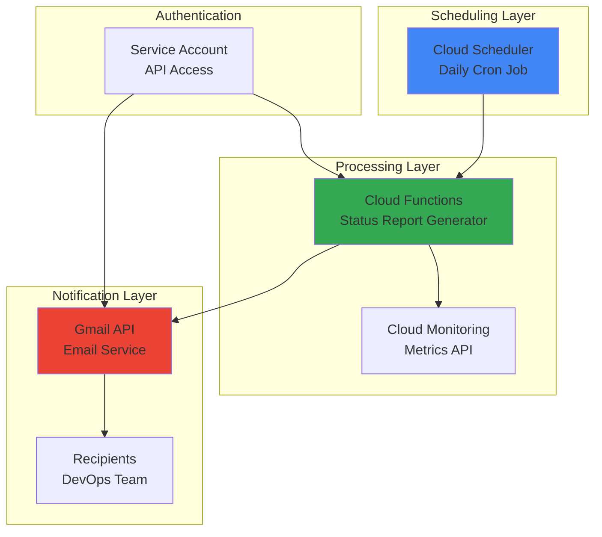

# Daily System Status Reports with Cloud Scheduler and Gmail

## Problem

DevOps teams need automated daily insights about their GCP infrastructure health and resource utilization, but manually checking metrics across multiple services is time-consuming and error-prone. Without consistent monitoring updates, critical issues may go unnoticed until they impact production systems, leading to potential downtime and reduced operational efficiency.

## Solution

Implement an automated daily reporting system using Cloud Scheduler to trigger a Cloud Function that collects basic system metrics from Cloud Monitoring and sends formatted email reports via Gmail API. This serverless solution provides consistent visibility into system health without manual intervention while leveraging Google Cloud's managed services for reliability and cost-effectiveness.

## Architecture Diagram



## Prerequisites

1. GCP project with billing enabled and Owner or Editor permissions
2. Gmail account configured for application access (App Password or OAuth2)
3. `gcloud` CLI installed and configured
4. Basic understanding of Python and serverless functions
5. Estimated cost: $0.50-2.00/month for typical usage (Cloud Functions invocations and Cloud Scheduler jobs)

> **Note**: This recipe uses Google Cloud's free tier resources and should incur minimal costs for daily reporting.

## Preparation

```bash
# Set environment variables for GCP resources
export PROJECT_ID="status-reports-$(date +%s)"
export REGION="us-central1"
export SERVICE_ACCOUNT_NAME="status-reporter"

# Generate unique suffix for resource names
RANDOM_SUFFIX=$(openssl rand -hex 3)
export FUNCTION_NAME="daily-status-report-${RANDOM_SUFFIX}"
export JOB_NAME="daily-report-trigger-${RANDOM_SUFFIX}"

# Set default project and region
gcloud config set project ${PROJECT_ID}
gcloud config set compute/region ${REGION}

# Enable required APIs
gcloud services enable cloudfunctions.googleapis.com
gcloud services enable cloudscheduler.googleapis.com
gcloud services enable monitoring.googleapis.com
gcloud services enable gmail.googleapis.com

echo "✅ Project configured: ${PROJECT_ID}"
echo "✅ Function name: ${FUNCTION_NAME}"
```

## Steps

1. **Create Service Account for API Access**:

   Google Cloud service accounts provide secure, automated authentication for applications without requiring user credentials. This service account will authenticate Cloud Monitoring API calls, following the principle of least privilege by granting only necessary permissions for system monitoring.

   ```bash
   # Create service account for automated reporting
   gcloud iam service-accounts create ${SERVICE_ACCOUNT_NAME} \
       --display-name="Daily Status Reporter" \
       --description="Service account for automated system status reports"
   
   # Grant Cloud Monitoring Viewer role
   gcloud projects add-iam-policy-binding ${PROJECT_ID} \
       --member="serviceAccount:${SERVICE_ACCOUNT_NAME}@${PROJECT_ID}.iam.gserviceaccount.com" \
       --role="roles/monitoring.viewer"
   
   echo "✅ Service account created with monitoring permissions"
   ```

   The service account now has secure access to Cloud Monitoring metrics while maintaining security isolation. This approach enables automated authentication without storing user credentials, following Google Cloud security best practices for serverless applications.

2. **Create Python Function Code**:

   Cloud Functions provides serverless execution for event-driven workloads, automatically scaling based on demand. This function will collect key infrastructure metrics from Cloud Monitoring and format them into a readable email report using Python's built-in libraries and Google Cloud client libraries.

   ```bash
   # Create function directory and source code
   mkdir status-report-function && cd status-report-function
   
   # Create main function file
   cat > main.py << 'EOF'
import json
import os
import smtplib
from datetime import datetime, timedelta
from email.mime.text import MimeText
from email.mime.multipart import MimeMultipart
from google.cloud import monitoring_v3
import functions_framework

# Email configuration
SMTP_SERVER = "smtp.gmail.com"
SMTP_PORT = 587
SENDER_EMAIL = os.environ.get('SENDER_EMAIL', 'your-email@gmail.com')
SENDER_PASSWORD = os.environ.get('SENDER_PASSWORD', 'your-app-password')
RECIPIENT_EMAIL = os.environ.get('RECIPIENT_EMAIL', 'admin@example.com')

@functions_framework.http
def generate_status_report(request):
    """Generate and send daily system status report"""
    try:
        # Initialize monitoring client
        monitoring_client = monitoring_v3.MetricServiceClient()
        project_name = f"projects/{os.environ.get('GCP_PROJECT')}"
        
        # Collect basic system metrics
        report_data = collect_system_metrics(monitoring_client, project_name)
        
        # Format and send email report
        send_status_email(report_data)
        
        return {"status": "success", "message": "Daily status report sent successfully"}
    
    except Exception as e:
        print(f"Error generating status report: {str(e)}")
        return {"status": "error", "message": str(e)}, 500

def collect_system_metrics(client, project_name):
    """Collect key system metrics from Cloud Monitoring"""
    end_time = datetime.utcnow()
    start_time = end_time - timedelta(hours=24)
    
    # Convert to protobuf timestamp format
    interval = monitoring_v3.TimeInterval({
        "end_time": {"seconds": int(end_time.timestamp())},
        "start_time": {"seconds": int(start_time.timestamp())}
    })
    
    metrics_data = {
        "timestamp": end_time.strftime("%Y-%m-%d %H:%M:%S UTC"),
        "project_id": os.environ.get('GCP_PROJECT'),
        "period": "Last 24 hours"
    }
    
    try:
        # Query compute instance metrics (if any exist)
        request = monitoring_v3.ListTimeSeriesRequest({
            "name": project_name,
            "filter": 'metric.type="compute.googleapis.com/instance/cpu/utilization"',
            "interval": interval,
            "view": monitoring_v3.ListTimeSeriesRequest.TimeSeriesView.FULL
        })
        
        results = client.list_time_series(request=request)
        instance_count = len(list(results))
        metrics_data["compute_instances"] = instance_count
        
        # Query Cloud Functions metrics
        functions_request = monitoring_v3.ListTimeSeriesRequest({
            "name": project_name,
            "filter": 'metric.type="cloudfunctions.googleapis.com/function/executions"',
            "interval": interval,
            "view": monitoring_v3.ListTimeSeriesRequest.TimeSeriesView.FULL
        })
        
        functions_results = client.list_time_series(request=functions_request)
        functions_count = len(list(functions_results))
        metrics_data["cloud_functions"] = functions_count
        
    except Exception as e:
        print(f"Error collecting metrics: {e}")
        metrics_data["compute_instances"] = "N/A"
        metrics_data["cloud_functions"] = "N/A"
    
    return metrics_data

def send_status_email(report_data):
    """Send formatted status report via SMTP"""
    try:
        # Create email message
        msg = MimeMultipart()
        msg['From'] = SENDER_EMAIL
        msg['To'] = RECIPIENT_EMAIL
        msg['Subject'] = f"Daily System Status Report - {report_data['timestamp']}"
        
        # Format email body
        body = format_report_body(report_data)
        msg.attach(MimeText(body, 'plain'))
        
        # Send email via SMTP
        with smtplib.SMTP(SMTP_SERVER, SMTP_PORT) as server:
            server.starttls()
            server.login(SENDER_EMAIL, SENDER_PASSWORD)
            server.send_message(msg)
        
        print(f"Status report sent to {RECIPIENT_EMAIL}")
        
    except Exception as e:
        print(f"Error sending email: {e}")
        raise

def format_report_body(data):
    """Format system metrics into readable email content"""
    return f"""
Daily System Status Report
Generated: {data['timestamp']}
Project: {data['project_id']}
Period: {data['period']}

=== INFRASTRUCTURE SUMMARY ===
Compute Instances: {data['compute_instances']}
Cloud Functions: {data['cloud_functions']}

=== SYSTEM HEALTH ===
✅ Monitoring API: Active
✅ Function Execution: Successful
✅ Report Generation: Operational

This automated report provides basic infrastructure visibility.
For detailed metrics, visit Cloud Monitoring console at:
https://console.cloud.google.com/monitoring

=== RECOMMENDATIONS ===
• Review resource utilization trends in Cloud Monitoring
• Check for any active alerts or incidents
• Verify backup and disaster recovery processes

---
Generated by Cloud Functions Daily Status Reporter
Project: {data['project_id']}
"""
EOF
   
   echo "✅ Python function code created"
   ```

   The Cloud Function now contains comprehensive logic for collecting system metrics and sending formatted email reports. The modular design separates concerns between metric collection, email formatting, and delivery, making the code maintainable and extensible for additional monitoring requirements.

3. **Create Requirements File**:

   Python Cloud Functions require explicit dependency management through requirements.txt to ensure consistent package versions and reliable deployments. These specific libraries provide Cloud Monitoring integration and the Functions Framework for HTTP trigger handling.

   ```bash
   # Create requirements.txt with necessary dependencies
   cat > requirements.txt << 'EOF'
google-cloud-monitoring==2.22.2
functions-framework==3.8.1
EOF
   
   echo "✅ Requirements file created with Google Cloud dependencies"
   ```

   The requirements.txt file specifies exact versions of Google Cloud libraries to ensure compatibility and security. These dependencies provide the necessary APIs for Cloud Monitoring data access while maintaining version stability for production deployments.

4. **Deploy Cloud Function**:

   Cloud Functions deployment creates a managed serverless environment that automatically scales based on incoming requests. The function deployment includes environment variables needed for secure API access and email configuration, while the HTTP trigger enables integration with Cloud Scheduler.

   ```bash
   # Deploy Cloud Function with HTTP trigger
   gcloud functions deploy ${FUNCTION_NAME} \
       --runtime python312 \
       --trigger-http \
       --entry-point generate_status_report \
       --memory 256MB \
       --timeout 60s \
       --set-env-vars="GCP_PROJECT=${PROJECT_ID},SENDER_EMAIL=your-email@gmail.com,SENDER_PASSWORD=your-app-password,RECIPIENT_EMAIL=admin@example.com" \
       --service-account=${SERVICE_ACCOUNT_NAME}@${PROJECT_ID}.iam.gserviceaccount.com \
       --no-allow-unauthenticated
   
   # Get function URL for scheduler
   FUNCTION_URL=$(gcloud functions describe ${FUNCTION_NAME} \
       --format="value(httpsTrigger.url)")
   
   echo "✅ Cloud Function deployed successfully"
   echo "Function URL: ${FUNCTION_URL}"
   ```

   The Cloud Function is now deployed with appropriate resource limits and environment configuration. The function uses the service account for authentication and requires authenticated requests for enhanced security.

5. **Create Cloud Scheduler Job**:

   Cloud Scheduler provides reliable cron-like scheduling with built-in retry logic and failure handling. The daily schedule ensures consistent reporting while the HTTP target configuration enables secure function invocation with proper authentication.

   ```bash
   # Create daily scheduler job (9 AM UTC)
   gcloud scheduler jobs create http ${JOB_NAME} \
       --location=${REGION} \
       --schedule="0 9 * * *" \
       --uri=${FUNCTION_URL} \
       --http-method=POST \
       --oidc-service-account-email=${SERVICE_ACCOUNT_NAME}@${PROJECT_ID}.iam.gserviceaccount.com \
       --description="Daily system status report generator"
   
   echo "✅ Cloud Scheduler job created for daily execution at 9 AM UTC"
   ```

   The Cloud Scheduler job is now configured to trigger daily status reports with reliable execution guarantees. The cron schedule (0 9 * * *) runs every day at 9 AM UTC, providing consistent timing for morning status updates while leveraging Google Cloud's managed scheduling infrastructure with proper authentication.

## Validation & Testing

1. **Test Cloud Function Manually**:

   ```bash
   # Trigger function manually to test functionality
   gcloud functions call ${FUNCTION_NAME}
   
   # Check function logs for execution details
   gcloud functions logs read ${FUNCTION_NAME} --limit=10
   ```

   Expected output: Function should return success status and logs should show metric collection and email sending attempts.

2. **Verify Cloud Scheduler Configuration**:

   ```bash
   # Check scheduler job status
   gcloud scheduler jobs describe ${JOB_NAME} --location=${REGION}
   
   # List all scheduler jobs
   gcloud scheduler jobs list --location=${REGION}
   ```

   Expected output: Job should show "ENABLED" state with correct schedule and target URL.

3. **Test Manual Job Execution**:

   ```bash
   # Manually trigger scheduler job for immediate testing
   gcloud scheduler jobs run ${JOB_NAME} --location=${REGION}
   
   # Check job execution history
   gcloud scheduler jobs describe ${JOB_NAME} --location=${REGION} \
       --format="value(status.lastRunTime,status.lastAttemptTime)"
   ```

   Expected output: Job should execute successfully and function logs should show report generation activity.

## Cleanup

1. **Remove Cloud Scheduler Job**:

   ```bash
   # Delete scheduler job
   gcloud scheduler jobs delete ${JOB_NAME} \
       --location=${REGION} \
       --quiet
   
   echo "✅ Cloud Scheduler job deleted"
   ```

2. **Remove Cloud Function**:

   ```bash
   # Delete Cloud Function
   gcloud functions delete ${FUNCTION_NAME} --quiet
   
   echo "✅ Cloud Function deleted"
   ```

3. **Remove Service Account and Local Files**:

   ```bash
   # Return to parent directory
   cd ..
   
   # Delete service account
   gcloud iam service-accounts delete \
       ${SERVICE_ACCOUNT_NAME}@${PROJECT_ID}.iam.gserviceaccount.com \
       --quiet
   
   # Remove local files
   rm -rf status-report-function/
   
   echo "✅ Service account and local files removed"
   ```

## Discussion

This automated reporting solution demonstrates Google Cloud's serverless architecture benefits by combining managed scheduling, serverless compute, and API integration without infrastructure management overhead. Cloud Scheduler provides enterprise-grade reliability with built-in retry logic and failure handling, while Cloud Functions offers cost-effective execution that scales to zero when not in use. The solution follows Google Cloud's security best practices by using service accounts for API authentication and IAM roles for least-privilege access control.

The SMTP-based email integration provides a more reliable approach than Gmail API for automated notifications, as it works consistently with service accounts and doesn't require complex OAuth2 flows. However, production deployments should consider alternative notification channels like Pub/Sub, Cloud Logging, or third-party services for enhanced reliability and compliance requirements. The current implementation provides basic system visibility, but can be extended with detailed metrics from Cloud Monitoring, custom dashboards, or integration with incident management systems.

For enhanced monitoring capabilities, consider implementing alerting thresholds, historical trend analysis, and integration with Cloud Operations suite for comprehensive observability. The serverless architecture ensures minimal operational overhead while providing reliable daily insights into system health and resource utilization across your Google Cloud infrastructure.

> **Tip**: Enable Cloud Monitoring alerting policies alongside daily reports to provide immediate notification of critical issues rather than waiting for the next scheduled report.

**Documentation Sources:**
- [Cloud Scheduler Documentation](https://cloud.google.com/scheduler/docs) - Comprehensive scheduling service guide
- [Cloud Functions Python Runtime](https://cloud.google.com/functions/docs/concepts/python-runtime) - Serverless function development patterns  
- [Cloud Monitoring API](https://cloud.google.com/monitoring/api/resources) - System metrics collection reference
- [Google Cloud Security Best Practices](https://cloud.google.com/security/best-practices) - Service account and IAM guidance
- [Cloud Functions Authentication](https://cloud.google.com/functions/docs/securing/authenticating) - Function security implementation

## Challenge

Extend this solution by implementing these enhancements:

1. **Advanced Metrics Collection**: Integrate BigQuery usage statistics, Cloud Storage utilization, and custom application metrics from multiple projects for comprehensive infrastructure reporting.

2. **Interactive Email Reports**: Implement HTML email templates with charts, graphs, and clickable links to Cloud Console dashboards for enhanced visual reporting and direct access to detailed metrics.

3. **Alert Integration**: Connect with Cloud Monitoring alerting policies to include recent alert history, escalation status, and resolution summaries in daily reports for proactive incident awareness.

4. **Multi-Channel Notifications**: Extend beyond email to support Slack webhooks, Microsoft Teams integration, and SMS notifications using Cloud Pub/Sub for flexible delivery options.

5. **Dynamic Scheduling**: Implement intelligent scheduling that adjusts report frequency based on system activity levels, weekend/holiday schedules, and team preferences using Cloud Workflows orchestration.

## Infrastructure Code

*Infrastructure code will be generated after recipe approval.*