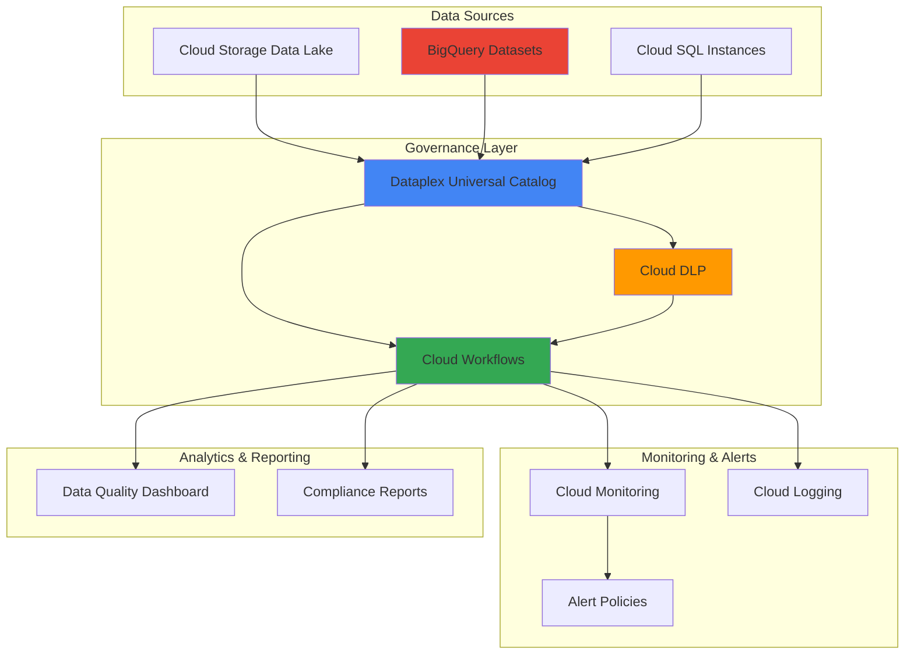

# Data Governance Workflows with Dataplex and Cloud Workflows

## Problem

Enterprise organizations struggle with maintaining consistent data governance across distributed multi-zone data lakes, where sensitive data requires automated quality validation, compliance monitoring, and policy enforcement. Traditional manual governance processes cannot scale with modern data volumes, leading to compliance violations, data quality issues, and operational inefficiencies that impact business decision-making and regulatory adherence.

## Solution

Implement an intelligent, automated data governance solution using Dataplex Universal Catalog for unified data asset management, Cloud DLP for sensitive data discovery and classification, BigQuery for analytical processing, and Cloud Workflows for orchestrating end-to-end governance processes. This approach provides automated data quality monitoring, compliance validation, and policy enforcement across distributed data assets.

## Architecture Diagram



## Prerequisites

1. Google Cloud project with Dataplex, Cloud Workflows, Cloud DLP, and BigQuery APIs enabled
2. Google Cloud CLI installed and configured with appropriate permissions
3. Basic understanding of data governance principles and YAML workflow syntax
4. Existing data assets in Cloud Storage or BigQuery for governance implementation
5. Estimated cost: $50-100 for testing (varies based on data volume and processing frequency)

> **Note**: This recipe demonstrates enterprise data governance patterns that scale with organizational data growth and compliance requirements.

## Preparation

```bash
# Set environment variables for GCP resources
export PROJECT_ID="dataplex-governance-$(date +%s)"
export REGION="us-central1"
export ZONE="us-central1-a"

# Generate unique suffix for resource names
RANDOM_SUFFIX=$(openssl rand -hex 3)

# Set default project and region
gcloud config set project ${PROJECT_ID}
gcloud config set compute/region ${REGION}
gcloud config set compute/zone ${ZONE}

# Enable required APIs for data governance services
gcloud services enable dataplex.googleapis.com
gcloud services enable workflows.googleapis.com
gcloud services enable dlp.googleapis.com
gcloud services enable bigquery.googleapis.com
gcloud services enable cloudasset.googleapis.com
gcloud services enable monitoring.googleapis.com
gcloud services enable logging.googleapis.com
gcloud services enable cloudfunctions.googleapis.com

# Create foundational storage bucket for data lake
export BUCKET_NAME="governance-data-lake-${RANDOM_SUFFIX}"
gsutil mb -p ${PROJECT_ID} -c STANDARD -l ${REGION} gs://${BUCKET_NAME}

# Enable versioning for data protection
gsutil versioning set on gs://${BUCKET_NAME}

# Create BigQuery dataset for analytics
export DATASET_NAME="governance_analytics_${RANDOM_SUFFIX}"
bq mk --project_id=${PROJECT_ID} --location=${REGION} ${DATASET_NAME}

echo "✅ Project configured: ${PROJECT_ID}"
echo "✅ Data lake bucket created: ${BUCKET_NAME}"
echo "✅ BigQuery dataset created: ${DATASET_NAME}"
```

## Steps

1. **Create Dataplex Lake for Unified Data Management**:

   Dataplex Universal Catalog provides centralized governance and metadata management across distributed data assets. Creating a Dataplex lake establishes the foundation for automated data discovery, profiling, and quality monitoring while maintaining consistent governance policies across multi-zone data environments.

   ```bash
   # Create Dataplex lake for unified governance
   export LAKE_NAME="governance-lake-${RANDOM_SUFFIX}"
   
   gcloud dataplex lakes create ${LAKE_NAME} \
       --location=${REGION} \
       --description="Intelligent data governance lake" \
       --labels="environment=governance,team=data-engineering"
   
   # Create data zone for raw data assets
   export RAW_ZONE_NAME="raw-data-zone"
   gcloud dataplex zones create ${RAW_ZONE_NAME} \
       --location=${REGION} \
       --lake=${LAKE_NAME} \
       --type=RAW \
       --resource-location-type=SINGLE_REGION \
       --description="Raw data zone for ingestion"
   
   # Create curated zone for processed data
   export CURATED_ZONE_NAME="curated-data-zone"
   gcloud dataplex zones create ${CURATED_ZONE_NAME} \
       --location=${REGION} \
       --lake=${LAKE_NAME} \
       --type=CURATED \
       --resource-location-type=SINGLE_REGION \
       --description="Curated data zone for analytics"
   
   echo "✅ Dataplex lake and zones created successfully"
   ```

   The Dataplex lake now provides unified governance capabilities across raw and curated data zones, enabling automated metadata cataloging, data lineage tracking, and policy enforcement throughout the data lifecycle.

2. **Configure Cloud DLP for Sensitive Data Detection**:

   Cloud DLP (Data Loss Prevention) provides intelligent scanning and classification of sensitive data using machine learning and predefined templates. This configuration enables automated detection of PII, financial data, and other sensitive information across your data lake assets.

   ```bash
   # Create DLP inspection template for sensitive data detection
   export DLP_TEMPLATE_NAME="governance-inspection-template"
   
   cat > dlp_template.json << 'EOF'
   {
     "displayName": "Governance Data Inspection Template",
     "description": "Template for detecting sensitive data in governance workflows",
     "inspectConfig": {
       "infoTypes": [
         {"name": "EMAIL_ADDRESS"},
         {"name": "PHONE_NUMBER"},
         {"name": "CREDIT_CARD_NUMBER"},
         {"name": "US_SOCIAL_SECURITY_NUMBER"},
         {"name": "PERSON_NAME"}
       ],
       "minLikelihood": "POSSIBLE",
       "limits": {
         "maxFindingsPerRequest": 1000
       },
       "includeQuote": true
     }
   }
   EOF
   
   # Create the DLP template
   gcloud dlp inspect-templates create \
       --source=dlp_template.json \
       --template-id=${DLP_TEMPLATE_NAME}
   
   # Create DLP job trigger for automated scanning
   export DLP_TRIGGER_NAME="governance-scan-trigger"
   
   cat > dlp_trigger.json << 'EOF'
   {
     "displayName": "Governance Automated Scan Trigger",
     "description": "Automated trigger for scanning data lake assets",
     "triggers": [
       {
         "schedule": {
           "recurrenceType": "WEEKLY"
         }
       }
     ],
     "inspectJob": {
       "storageConfig": {
         "cloudStorageOptions": {
           "fileSet": {
             "url": "gs://BUCKET_NAME/*"
           },
           "bytesLimitPerFile": 1048576
         }
       },
       "inspectTemplateName": "projects/PROJECT_ID/inspectTemplates/TEMPLATE_NAME"
     }
   }
   EOF
   
   # Replace placeholders and create trigger
   sed -i "s/BUCKET_NAME/${BUCKET_NAME}/g" dlp_trigger.json
   sed -i "s/PROJECT_ID/${PROJECT_ID}/g" dlp_trigger.json
   sed -i "s/TEMPLATE_NAME/${DLP_TEMPLATE_NAME}/g" dlp_trigger.json
   
   gcloud dlp job-triggers create \
       --source=dlp_trigger.json \
       --trigger-id=${DLP_TRIGGER_NAME}
   
   echo "✅ DLP inspection template and trigger configured"
   ```

   Cloud DLP is now configured to automatically scan data assets for sensitive information, providing the intelligence needed for automated data classification and compliance monitoring within your governance workflows.

3. **Create BigQuery Data Quality Tables**:

   BigQuery serves as the analytical engine for data governance metrics, storing quality assessments, compliance reports, and governance metadata. These tables enable real-time monitoring and historical analysis of data governance performance across your organization.

   ```bash
   # Create data quality monitoring table
   bq mk --table \
       ${PROJECT_ID}:${DATASET_NAME}.data_quality_metrics \
       timestamp:TIMESTAMP,asset_name:STRING,zone:STRING,quality_score:FLOAT64,issues_found:INTEGER,scan_type:STRING,details:JSON
   
   # Create compliance monitoring table
   bq mk --table \
       ${PROJECT_ID}:${DATASET_NAME}.compliance_reports \
       timestamp:TIMESTAMP,asset_name:STRING,compliance_status:STRING,violations:INTEGER,sensitive_data_types:STRING,risk_level:STRING
   
   # Create governance audit log table
   bq mk --table \
       ${PROJECT_ID}:${DATASET_NAME}.governance_audit_log \
       timestamp:TIMESTAMP,action:STRING,user:STRING,asset:STRING,zone:STRING,status:STRING,details:JSON
   
   # Insert sample data for testing
   bq query --use_legacy_sql=false \
   "INSERT INTO \`${PROJECT_ID}.${DATASET_NAME}.data_quality_metrics\`
   (timestamp, asset_name, zone, quality_score, issues_found, scan_type, details)
   VALUES
   (CURRENT_TIMESTAMP(), 'sample-dataset', 'raw-data-zone', 0.95, 2, 'automated', JSON '{\"completeness\": 0.98, \"validity\": 0.92}');"
   
   echo "✅ BigQuery governance tables created and initialized"
   ```

   The BigQuery analytics foundation is now established, providing structured storage for governance metrics and enabling sophisticated analysis of data quality trends, compliance status, and governance performance across your data estate.

4. **Deploy Data Quality Assessment Cloud Function**:

   This Cloud Function performs automated data quality assessments using Dataplex and BigQuery capabilities. It evaluates data completeness, validity, consistency, and accuracy, providing the intelligence needed for governance decision-making and automated remediation workflows.

   ```bash
   # Create Cloud Function for data quality assessment
   mkdir -p governance-functions/data-quality
   cd governance-functions/data-quality
   
   cat > main.py << 'EOF'
   import functions_framework
   from google.cloud import bigquery
   from google.cloud import dataplex_v1
   import json
   import datetime
   import os
   
   @functions_framework.http
   def assess_data_quality(request):
       """Assess data quality for governance workflows"""
       try:
           client = bigquery.Client()
           dataplex_client = dataplex_v1.DataplexServiceClient()
           
           # Get request parameters
           request_json = request.get_json(silent=True)
           asset_name = request_json.get('asset_name', 'unknown') if request_json else 'unknown'
           zone = request_json.get('zone', 'unknown') if request_json else 'unknown'
           
           # Simulate quality assessment (replace with actual logic)
           quality_metrics = {
               'completeness': 0.95,
               'validity': 0.88,
               'consistency': 0.92,
               'accuracy': 0.89
           }
           
           # Calculate overall quality score
           quality_score = sum(quality_metrics.values()) / len(quality_metrics)
           issues_found = sum(1 for score in quality_metrics.values() if score < 0.9)
           
           # Insert results into BigQuery
           dataset_name = os.environ.get('DATASET_NAME', 'governance_analytics')
           table_id = f"{client.project}.{dataset_name}.data_quality_metrics"
           rows_to_insert = [{
               'timestamp': datetime.datetime.utcnow().isoformat(),
               'asset_name': asset_name,
               'zone': zone,
               'quality_score': quality_score,
               'issues_found': issues_found,
               'scan_type': 'automated',
               'details': quality_metrics
           }]
           
           errors = client.insert_rows_json(table_id, rows_to_insert)
           
           return {
               'status': 'success' if not errors else 'error',
               'quality_score': quality_score,
               'issues_found': issues_found,
               'metrics': quality_metrics,
               'errors': errors
           }
           
       except Exception as e:
           return {'status': 'error', 'message': str(e)}
   EOF
   
   cat > requirements.txt << 'EOF'
   functions-framework==3.*
   google-cloud-bigquery==3.*
   google-cloud-dataplex==1.*
   EOF
   
   # Deploy the Cloud Function (Gen 2)
   gcloud functions deploy data-quality-assessor \
       --gen2 \
       --runtime python39 \
       --trigger-http \
       --allow-unauthenticated \
       --source . \
       --entry-point assess_data_quality \
       --memory 512MB \
       --timeout 300s \
       --region ${REGION} \
       --set-env-vars PROJECT_ID=${PROJECT_ID},DATASET_NAME=${DATASET_NAME}
   
   cd ../..
   
   echo "✅ Data quality assessment function deployed"
   ```

   The data quality assessment function provides automated evaluation capabilities that integrate with your governance workflows, enabling real-time quality monitoring and intelligent remediation based on configurable quality thresholds.

5. **Create Governance Orchestration Workflow**:

   Cloud Workflows orchestrates the entire data governance process, coordinating between Dataplex, Cloud DLP, BigQuery, and custom functions. This workflow automates data discovery, quality assessment, compliance validation, and alert generation while maintaining audit trails for governance accountability.

   ```bash
   # Create the main governance workflow
   cat > governance-workflow.yaml << 'EOF'
   # Intelligent Data Governance Orchestration Workflow
   main:
     params: [args]
     steps:
       - init:
           assign:
             - projectId: ${sys.get_env("GOOGLE_CLOUD_PROJECT_ID")}
             - region: "us-central1"
             - timestamp: ${sys.now()}
             - assets: []
             - governance_results: {}
       
       - discover_assets:
           call: discover_data_assets
           args:
             project: ${projectId}
             region: ${region}
           result: discovered_assets
       
       - process_assets:
           for:
             value: asset
             in: ${discovered_assets}
             steps:
               - assess_quality:
                   call: http.post
                   args:
                     url: ${"https://" + region + "-" + projectId + ".cloudfunctions.net/data-quality-assessor"}
                     body:
                       asset_name: ${asset.name}
                       zone: ${asset.zone}
                     headers:
                       Content-Type: "application/json"
                   result: quality_result
               
               - scan_sensitive_data:
                   call: scan_for_sensitive_data
                   args:
                     asset: ${asset}
                     project: ${projectId}
                   result: dlp_result
               
               - evaluate_compliance:
                   call: evaluate_compliance_status
                   args:
                     quality_result: ${quality_result}
                     dlp_result: ${dlp_result}
                     asset: ${asset}
                   result: compliance_status
               
               - store_results:
                   call: store_governance_results
                   args:
                     project: ${projectId}
                     asset: ${asset}
                     quality: ${quality_result}
                     compliance: ${compliance_status}
                     timestamp: ${timestamp}
       
       - generate_alerts:
           call: generate_governance_alerts
           args:
             results: ${governance_results}
             project: ${projectId}
       
       - return_summary:
           return:
             status: "completed"
             timestamp: ${timestamp}
             assets_processed: ${len(discovered_assets)}
             governance_summary: ${governance_results}
   
   # Discover data assets in Dataplex
   discover_data_assets:
     params: [project, region]
     steps:
       - list_assets:
           assign:
             - mock_assets:
               - name: "customer-data"
                 zone: "raw-data-zone"
                 type: "table"
               - name: "transaction-logs"
                 zone: "curated-data-zone"
                 type: "bucket"
       - return_assets:
           return: ${mock_assets}
   
   # Scan for sensitive data using Cloud DLP
   scan_for_sensitive_data:
     params: [asset, project]
     steps:
       - simulate_scan:
           assign:
             - scan_result:
                 findings_count: 5
                 info_types: ["EMAIL_ADDRESS", "PHONE_NUMBER"]
                 risk_level: "MEDIUM"
       - return_scan:
           return: ${scan_result}
   
   # Evaluate compliance status
   evaluate_compliance_status:
     params: [quality_result, dlp_result, asset]
     steps:
       - calculate_compliance:
           assign:
             - quality_score: ${quality_result.body.quality_score}
             - sensitive_findings: ${dlp_result.findings_count}
             - compliance_status:
                 status: ${if(quality_score >= 0.9 and sensitive_findings <= 10, "COMPLIANT", "NON_COMPLIANT")}
                 quality_score: ${quality_score}
                 sensitive_data_count: ${sensitive_findings}
                 risk_assessment: ${dlp_result.risk_level}
       - return_compliance:
           return: ${compliance_status}
   
   # Store governance results in BigQuery
   store_governance_results:
     params: [project, asset, quality, compliance, timestamp]
     steps:
       - log_result:
           assign:
             - result: "stored"
       - return_result:
           return: ${result}
   
   # Generate governance alerts
   generate_governance_alerts:
     params: [results, project]
     steps:
       - check_violations:
           assign:
             - alerts_generated: 0
       - return_alerts:
           return: ${alerts_generated}
   EOF
   
   # Deploy the governance workflow
   export WORKFLOW_NAME="intelligent-governance-workflow"
   gcloud workflows deploy ${WORKFLOW_NAME} \
       --source=governance-workflow.yaml \
       --location=${REGION} \
       --description="Intelligent data governance orchestration workflow"
   
   echo "✅ Governance orchestration workflow deployed"
   ```

   The governance workflow now provides end-to-end orchestration of data governance processes, automating the coordination between discovery, quality assessment, compliance validation, and alerting while maintaining comprehensive audit trails.

6. **Configure Monitoring and Alerting**:

   Cloud Monitoring and alerting ensure proactive governance by detecting quality degradation, compliance violations, and operational issues. This configuration provides real-time visibility into governance performance and enables automated response to critical governance events.

   ```bash
   # Create monitoring dashboard for governance metrics
   cat > monitoring-dashboard.json << 'EOF'
   {
     "displayName": "Data Governance Dashboard",
     "mosaicLayout": {
       "tiles": [
         {
           "width": 6,
           "height": 4,
           "widget": {
             "title": "Data Quality Scores",
             "xyChart": {
               "dataSets": [
                 {
                   "timeSeriesQuery": {
                     "timeSeriesFilter": {
                       "filter": "resource.type=\"bigquery_dataset\"",
                       "aggregation": {
                         "alignmentPeriod": "300s",
                         "perSeriesAligner": "ALIGN_MEAN"
                       }
                     }
                   },
                   "plotType": "LINE"
                 }
               ]
             }
           }
         }
       ]
     }
   }
   EOF
   
   # Create alert policy for data quality issues
   cat > alert-policy.json << 'EOF'
   {
     "displayName": "Data Quality Alert Policy",
     "documentation": {
       "content": "Alert when data quality scores drop below threshold"
     },
     "conditions": [
       {
         "displayName": "Low Data Quality Score",
         "conditionThreshold": {
           "filter": "resource.type=\"cloud_function\"",
           "comparison": "COMPARISON_LESS_THAN",
           "thresholdValue": 0.8,
           "duration": "300s",
           "aggregations": [
             {
               "alignmentPeriod": "300s",
               "perSeriesAligner": "ALIGN_MEAN"
             }
           ]
         }
       }
     ],
     "alertStrategy": {
       "autoClose": "1800s"
     },
     "enabled": true
   }
   EOF
   
   # Create the alert policy
   gcloud alpha monitoring policies create --policy-from-file=alert-policy.json
   
   # Set up log-based metrics for governance events
   gcloud logging metrics create governance_workflow_executions \
       --description="Count of governance workflow executions" \
       --log-filter='resource.type="workflows.googleapis.com/Workflow" AND jsonPayload.workflow_name="intelligent-governance-workflow"'
   
   echo "✅ Monitoring and alerting configured"
   ```

   Comprehensive monitoring and alerting infrastructure now provides real-time visibility into governance performance, enabling proactive identification and resolution of data quality issues and compliance violations.

7. **Execute Governance Workflow and Validate Results**:

   Execute the complete governance workflow to validate end-to-end functionality and demonstrate automated data discovery, quality assessment, compliance validation, and reporting capabilities across your multi-zone data lake environment.

   ```bash
   # Execute the governance workflow
   gcloud workflows run ${WORKFLOW_NAME} \
       --location=${REGION} \
       --data='{"trigger": "manual", "scope": "full_scan"}'
   
   # Get execution details
   export EXECUTION_ID=$(gcloud workflows executions list \
       --workflow=${WORKFLOW_NAME} \
       --location=${REGION} \
       --limit=1 \
       --format="value(name.segment(-1))")
   
   # Monitor execution status
   gcloud workflows executions describe ${EXECUTION_ID} \
       --workflow=${WORKFLOW_NAME} \
       --location=${REGION} \
       --format="value(state,startTime,endTime)"
   
   # Check governance results in BigQuery
   bq query --use_legacy_sql=false \
   "SELECT 
       timestamp,
       asset_name,
       quality_score,
       issues_found,
       details
   FROM \`${PROJECT_ID}.${DATASET_NAME}.data_quality_metrics\`
   ORDER BY timestamp DESC
   LIMIT 10;"
   
   echo "✅ Governance workflow executed and results validated"
   ```

   The governance workflow execution demonstrates automated orchestration of data discovery, quality assessment, and compliance validation, providing comprehensive governance coverage across your distributed data assets.

## Validation & Testing

1. **Verify Dataplex Lake Configuration**:

   ```bash
   # Check Dataplex lake status
   gcloud dataplex lakes describe ${LAKE_NAME} \
       --location=${REGION} \
       --format="table(name,state,createTime)"
   
   # Verify zones are active
   gcloud dataplex zones list \
       --location=${REGION} \
       --lake=${LAKE_NAME} \
       --format="table(name,type,state)"
   ```

   Expected output: Lake and zones should show "ACTIVE" state with proper configuration.

2. **Test Cloud DLP Integration**:

   ```bash
   # Create test file with sensitive data
   echo "Customer email: john.doe@example.com, Phone: 555-123-4567" > test-data.txt
   gsutil cp test-data.txt gs://${BUCKET_NAME}/test-data.txt
   
   # Trigger DLP inspection
   gcloud dlp content inspect test-data.txt \
       --inspect-template-name="projects/${PROJECT_ID}/inspectTemplates/${DLP_TEMPLATE_NAME}" \
       --format="value(result.findings.count())"
   ```

   Expected output: Should detect email address and phone number in the test data.

3. **Validate BigQuery Governance Data**:

   ```bash
   # Check data quality metrics
   bq query --use_legacy_sql=false \
   "SELECT COUNT(*) as total_assessments, AVG(quality_score) as avg_quality
   FROM \`${PROJECT_ID}.${DATASET_NAME}.data_quality_metrics\`;"
   
   # Verify table schemas
   bq show --schema ${PROJECT_ID}:${DATASET_NAME}.compliance_reports
   ```

   Expected output: Should show populated tables with governance metrics and proper schema structure.

4. **Test Workflow Execution**:

   ```bash
   # Execute workflow with test parameters
   gcloud workflows run ${WORKFLOW_NAME} \
       --location=${REGION} \
       --data='{"test": true, "assets": ["test-asset"]}' \
       --format="value(name)"
   
   # Check execution logs
   gcloud workflows executions describe ${EXECUTION_ID} \
       --workflow=${WORKFLOW_NAME} \
       --location=${REGION} \
       --format="value(result)"
   ```

   Expected output: Workflow should complete successfully with governance results and summary data.

## Cleanup

1. **Remove Cloud Workflows and Functions**:

   ```bash
   # Delete the governance workflow
   gcloud workflows delete ${WORKFLOW_NAME} \
       --location=${REGION} \
       --quiet
   
   # Delete Cloud Function
   gcloud functions delete data-quality-assessor \
       --region=${REGION} \
       --gen2 \
       --quiet
   
   echo "✅ Workflows and functions deleted"
   ```

2. **Remove DLP Resources**:

   ```bash
   # Delete DLP job trigger
   gcloud dlp job-triggers delete ${DLP_TRIGGER_NAME} --quiet
   
   # Delete DLP inspection template
   gcloud dlp inspect-templates delete ${DLP_TEMPLATE_NAME} --quiet
   
   echo "✅ DLP resources deleted"
   ```

3. **Remove Dataplex Resources**:

   ```bash
   # Delete Dataplex zones
   gcloud dataplex zones delete ${RAW_ZONE_NAME} \
       --location=${REGION} \
       --lake=${LAKE_NAME} \
       --quiet
   
   gcloud dataplex zones delete ${CURATED_ZONE_NAME} \
       --location=${REGION} \
       --lake=${LAKE_NAME} \
       --quiet
   
   # Delete Dataplex lake
   gcloud dataplex lakes delete ${LAKE_NAME} \
       --location=${REGION} \
       --quiet
   
   echo "✅ Dataplex resources deleted"
   ```

4. **Remove Storage and BigQuery Resources**:

   ```bash
   # Remove Cloud Storage bucket and contents
   gsutil -m rm -r gs://${BUCKET_NAME}
   
   # Delete BigQuery dataset
   bq rm -r -f ${PROJECT_ID}:${DATASET_NAME}
   
   # Clean up local files
   rm -rf governance-functions/
   rm -f dlp_template.json dlp_trigger.json
   rm -f governance-workflow.yaml monitoring-dashboard.json alert-policy.json
   rm -f test-data.txt
   
   echo "✅ Storage and BigQuery resources deleted"
   ```

5. **Remove Monitoring Resources**:

   ```bash
   # Delete log-based metrics
   gcloud logging metrics delete governance_workflow_executions --quiet
   
   # Note: Alert policies and dashboards should be manually removed from Cloud Console
   echo "✅ Monitoring resources cleaned up"
   echo "Note: Manually remove alert policies and dashboards from Cloud Console"
   ```

## Discussion

This intelligent data governance solution demonstrates how modern cloud-native services can automate complex enterprise data management challenges. Dataplex Universal Catalog serves as the central nervous system, providing unified metadata management and discovery across heterogeneous data sources. By integrating Cloud DLP for sensitive data detection, organizations can automatically classify and protect sensitive information while maintaining compliance with regulations like GDPR, HIPAA, and PCI DSS.

The Cloud Workflows orchestration layer provides the critical automation that transforms manual governance processes into intelligent, event-driven workflows. This approach enables organizations to scale data governance from reactive, manual processes to proactive, automated systems that can handle enterprise-scale data volumes. The integration with BigQuery for analytics and reporting ensures that governance teams have real-time visibility into data quality trends, compliance status, and governance performance metrics across their entire data estate.

The serverless nature of this solution provides significant operational advantages, including automatic scaling based on data volume, pay-per-use pricing that aligns costs with actual governance activities, and zero infrastructure maintenance overhead. This enables organizations to focus on governance strategy and policy development rather than infrastructure management, while ensuring that governance processes can scale seamlessly as data volumes grow.

Security and compliance considerations are built into every layer of this architecture, from IAM-based access controls and audit logging to automated sensitive data detection and encryption at rest and in transit. The solution provides comprehensive audit trails through Cloud Logging and maintains governance accountability through BigQuery-based reporting, enabling organizations to demonstrate compliance to auditors and regulatory bodies.

> **Tip**: Implement gradual rollout of governance policies by starting with monitoring and alerting before enforcing blocking policies, allowing teams to adapt to new governance requirements while maintaining operational continuity.

For comprehensive guidance on data governance best practices, refer to the [Google Cloud Data Governance Guide](https://cloud.google.com/architecture/data-governance), [Dataplex Universal Catalog documentation](https://cloud.google.com/dataplex/docs/introduction), [Cloud DLP best practices](https://cloud.google.com/dlp/docs/best-practices), [Cloud Workflows patterns](https://cloud.google.com/workflows/docs/patterns), and the [Google Cloud Security Command Center](https://cloud.google.com/security-command-center/docs) for comprehensive security monitoring.

## Challenge

Extend this governance solution by implementing these advanced capabilities:

1. **Real-time Data Lineage Tracking**: Integrate with Cloud Data Fusion and Dataflow to automatically capture and visualize end-to-end data lineage, enabling impact analysis and root cause identification for data quality issues.

2. **Machine Learning-Enhanced Quality Scoring**: Implement Vertex AI models to predict data quality degradation based on historical patterns, seasonal trends, and external factors, enabling proactive governance interventions.

3. **Multi-Cloud Governance Federation**: Extend the solution to govern data assets across AWS and Azure using Cloud Interconnect and federated identity management, providing unified governance across hybrid and multi-cloud environments.

4. **Automated Remediation Workflows**: Develop intelligent remediation capabilities that automatically fix common data quality issues, quarantine non-compliant data, and trigger data refresh processes based on governance policy violations.

5. **Advanced Privacy Engineering**: Implement differential privacy techniques and automated data anonymization using Cloud DLP and custom functions to enable analytics on sensitive datasets while preserving individual privacy.

## Infrastructure Code

*Infrastructure code will be generated after recipe approval.*